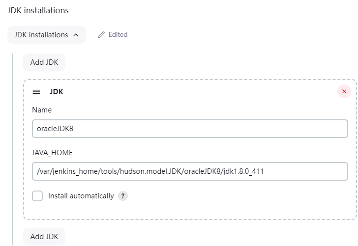
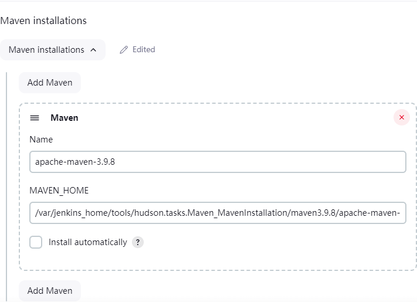
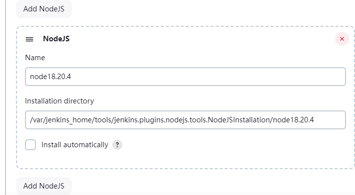
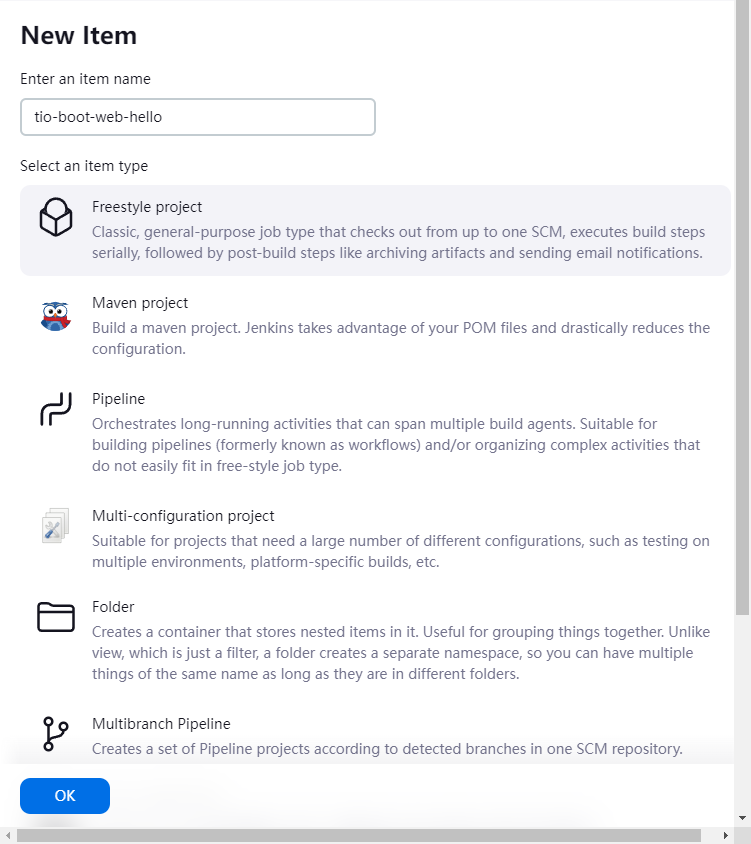
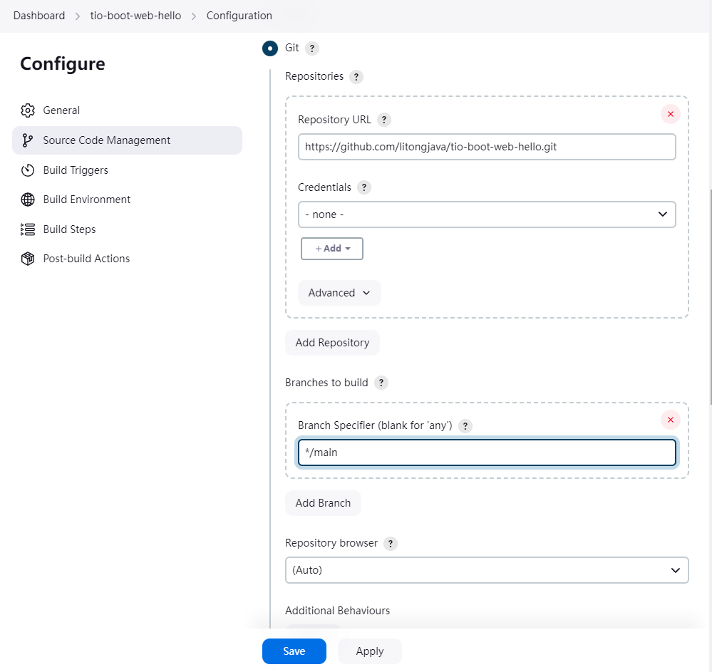
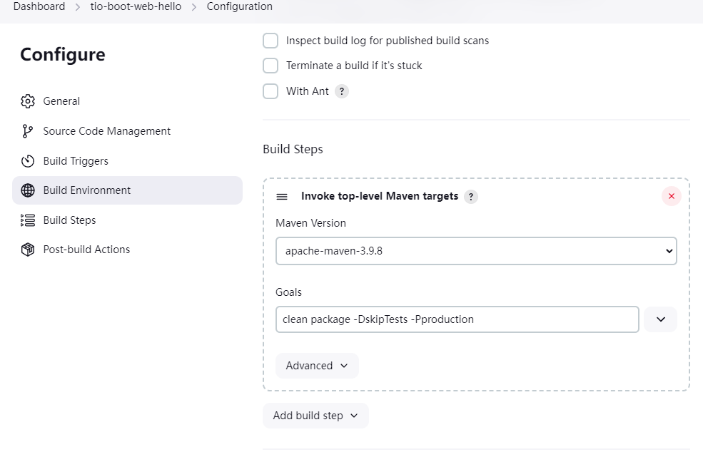
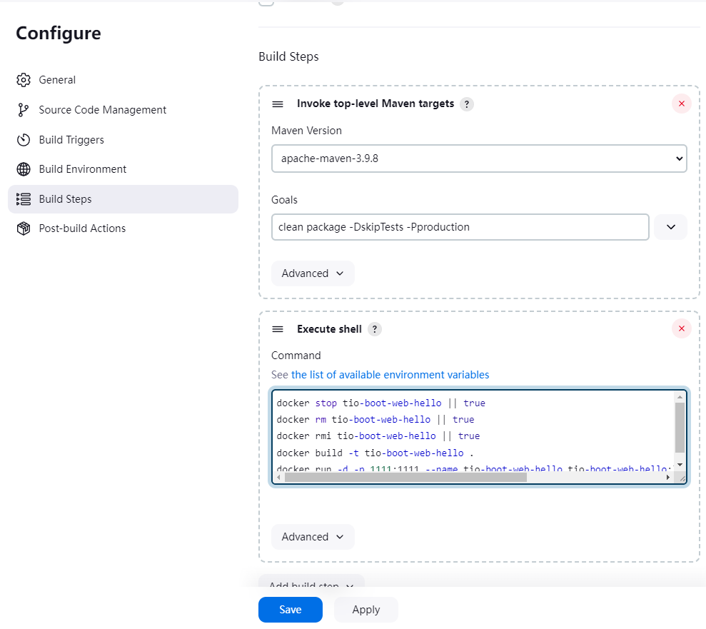
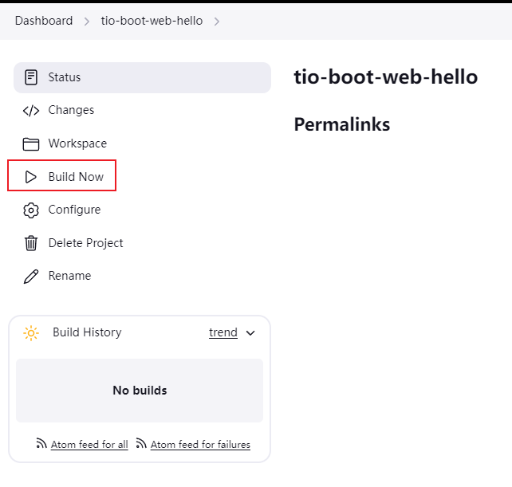
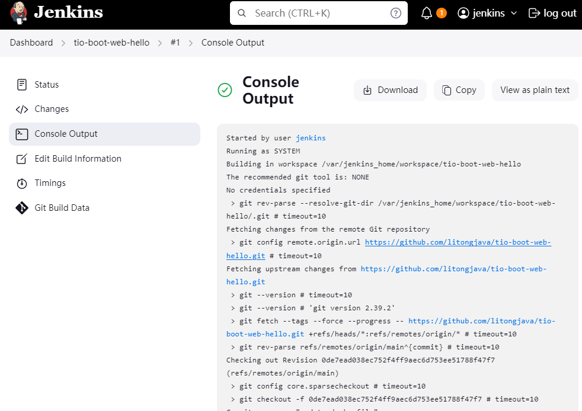

# 使用 Jenkins 部署 Tio-Boot 项目

在这篇博客中，我们将介绍如何使用 Jenkins 自动化部署 Tio-Boot 项目，帮助开发者实现项目的持续集成和部署（CI/CD）。本文详细介绍了从 Jenkins 安装、配置到项目构建、部署的每一步操作，并附带相关的原理说明。

## Jenkins 简介

Jenkins 是一个开源的自动化服务器，广泛用于构建、测试和部署软件项目。它通过流水线的形式自动化处理开发流程，可以极大提高开发效率和部署稳定性。在 Tio-Boot 项目中，Jenkins 可以帮助我们实现代码的自动构建、打包，并通过 Docker 部署项目到生产环境。

### Jenkins Docker 安装

首先，我们使用 Docker 启动 Jenkins 实例。以下命令用于在 Docker 中安装和运行 Jenkins：

```bash
docker run --name jenkins --restart=always -u root --privileged -d \
--dns 8.8.8.8 \
-p 9080:8080 -p 50000:50000 \
-v /data/apps/jenkins/jenkins_home:/var/jenkins_home \
-v /data/apps/jenkins/mvnrepository:/root/.m2/repository \
-v /var/run/docker.sock:/var/run/docker.sock \
-v /usr/bin/docker:/usr/bin/docker \
jenkins/jenkins:lts
```

### 解释说明

1. **--restart=always**：确保 Jenkins 容器在 Docker 重启或宕机后自动重启。
2. **-v** 参数：将宿主机的目录挂载到 Jenkins 容器中，保证 Jenkins 配置数据的持久化以及 Maven 仓库的共享。
3. **-p 9080:8080**：将 Jenkins 的 web 端口映射到宿主机的 9080 端口。

### 常用目录

- **/var/jenkins_home/workspace/**：Jenkins 的工作空间目录，存放项目代码。

## 配置 Jenkins

### 解锁 Jenkins

Jenkins 初次安装时需要通过解锁获取管理员密码：

1. 进入 Jenkins 容器：
   ```bash
   docker exec -it jenkins bash
   ```
2. 查看密码：
   ```bash
   cat /var/jenkins_home/secrets/initialAdminPassword
   ```
   复制输出的密码，访问 Jenkins 的 Web 界面，解锁后继续配置。

or

```
docker exec -it jenkins cat /var/jenkins_home/secrets/initialAdminPassword
```

### 访问 jenins

http://127.0.0.1:9080
username:jenkins
password:

### 安装插件

**插件选择**：首次启动时建议不要通过网络安装插件，因为网络原因可能导致安装失败，并且下载速度较慢。我们可以选择直接上传所需插件，手动安装。

### 创建管理员用户

按照 Jenkins 的提示，创建管理员用户并登录。

### 导入插件

将从以下地址下载的 `plugins.zip` 上传并解压到 Jenkins 数据目录 `/data/apps/jenkins/jenkins_home`，随后重启 Jenkins 即可生效：

[插件下载链接](https://github.com/litongjava/jenkins-package/releases/tag/v20240909)

```bash
mkdir /opt/package/jenkins -p
cd /opt/package/jenkins
wget https://github.com/litongjava/jenkins-package/releases/download/v20240909/plugins.zip
unzip plugins.zip -d /data/apps/jenkins/jenkins_home/
docker restart jenkins
```

### 导入工具库

安装工具库（JDK、Maven、Node.js），下载并解压到 `/data/apps/jenkins/jenkins_home/tools` 目录下：

- **hudson.model.JDK.zip**
- **hudson.tasks.Maven_MavenInstallation.zip**
- **jenkins.plugins.nodejs.tools.NodeJSInstallation.tar.gz**

```
mkdir /opt/package/jenkins -p
cd /opt/package/jenkins
wget https://github.com/litongjava/jenkins-package/releases/download/v20240909/hudson.model.JDK.zip
wget https://github.com/litongjava/jenkins-package/releases/download/v20240909/hudson.tasks.Maven_MavenInstallation.zip
wget https://github.com/litongjava/jenkins-package/releases/download/v20240909/jenkins.plugins.nodejs.tools.NodeJSInstallation.tar.gz

unzip hudson.model.JDK.zip -d /data/apps/jenkins/jenkins_home/tools
unzip hudson.tasks.Maven_MavenInstallation.zip -d /data/apps/jenkins/jenkins_home/tools
tar -xf jenkins.plugins.nodejs.tools.NodeJSInstallation.tar.gz -C /data/apps/jenkins/jenkins_home/tools
chmod u+x /data/apps/jenkins/jenkins_home/tools/hudson.model.JDK/oracleJDK8/jdk1.8.0_411/bin/*
chmod u+x /data/apps/jenkins/jenkins_home/tools/hudson.tasks.Maven_MavenInstallation/maven3.9.8/apache-maven-3.9.8/bin/*
```

### 系统配置

1. **配置 JDK**  
   在 Jenkins 中配置 JDK，路径为：

   - 名称：oracleJDK8
   - 安装目录：`/var/jenkins_home/tools/hudson.model.JDK/oracleJDK8/jdk1.8.0_411`

   

2. **配置 Maven**

   - 名称：apache-maven-3.9.8
   - 安装目录：`/var/jenkins_home/tools/hudson.tasks.Maven_MavenInstallation/maven3.9.8/apache-maven-3.9.8`

   

3. **配置 Node.js**

   - 名称：node18.20.4
   - 安装目录：`/var/jenkins_home/tools/jenkins.plugins.nodejs.tools.NodeJSInstallation/node18.20.4`

   

## 项目构建与部署

### 新建任务

1. 创建任务 `tio-boot-web-hello`：

   - 点击【新建任务】，输入任务名称，选择 "构建一个自由风格的软件项目"。

   

2. 配置源码管理：

   - 选择 Git，填写项目仓库地址（如 `https://github.com/litongjava/tio-boot-web-hello.git`），并选择正确的分支（如 `main`）。

   

3. 配置构建触发器和步骤：

   - 点击【构建触发器】，选择【构建】，添加构建步骤，调用 Maven 构建项目。
   - 配置 Maven 命令为 `clean package -DskipTests -Pproduction`，确保能够生成 `.jar` 包。

   

4. 添加 Docker 命令：
   构建成功后，执行以下 Docker 命令以启动项目：

```bash
docker stop tio-boot-web-hello || true
docker rm tio-boot-web-hello || true
docker rmi tio-boot-web-hello || true
docker build -t tio-boot-web-hello .
docker run -d -p 1111:1111 --name tio-boot-web-hello \
-v ${pwd}/logs:/app/logs \
-e TZ=Asia/Shanghai -e LANG=C.UTF-8 \
tio-boot-web-hello:latest \
--server.port=1111 --app.env=prod
```



### 手动触发任务

点击【构建】，手动触发项目构建：



2. 查看日志：

   - 点击正在构建的任务，进入详情页面，查看 Jenkins 控制台输出，确保项目构建成功。

   

如果控制台显示以下信息，说明项目已经成功构建并运行：

```bash
Successfully built a67d81a888ff
Successfully tagged tio-boot-web-hello:latest
+ docker run -d -p 1111:1111 --name tio-boot-web-hello tio-boot-web-hello:latest --server.port=1111 --app.env=prod
d0dfdc94578c868781182bd5753e6b2bc612e12931a3feb74ade7763dd827e2a
Finished: SUCCESS
```

### 验证构建

使用以下命令查看 Docker 日志，确认项目是否成功启动：

```bash
docker logs -f tio-boot-web-hello
```

## 总结

通过 Jenkins 的持续集成，我们可以自动化管理 Tio-Boot 项目的构建和部署，确保每次代码更新后能够快速、稳定地将项目部署到生产环境中。Docker 结合 Jenkins 的优势让整个过程更灵活、高效。

## 使用笔者封装的镜像启动

```shell
docker run --name jenkins --restart=always -u root --privileged -d \
--dns 8.8.8.8 \
-p 9080:8080 -p 50000:50000 \
-v /data/apps/jenkins/mvnrepository:/root/.m2/repository \
-v /var/run/docker.sock:/var/run/docker.sock \
-v /usr/bin/docker:/usr/bin/docker \
litongjava/jenkins:2.462.2
```

```shell
mkdir -p /data/apps/jenkins/jenkins_home
docker cp jenkins:/var/jenkins_home /data/apps/jenkins/jenkins_home
```

```shell
docker run --name jenkins --restart=always -u root --privileged -d \
--dns 8.8.8.8 \
-p 9080:8080 -p 50000:50000 \
-v /data/apps/jenkins/jenkins_home:/var/jenkins_home \
-v /data/apps/jenkins/mvnrepository:/root/.m2/repository \
-v /var/run/docker.sock:/var/run/docker.sock \
-v /usr/bin/docker:/usr/bin/docker \
litongjava/jenkins:2.462.2
```
