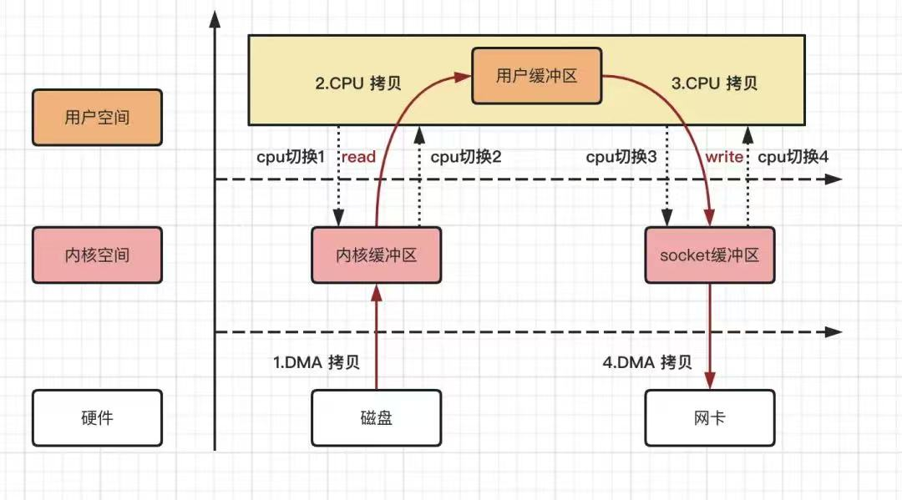

# 使用零拷贝发送大文件

本文将结合示例代码，深入剖析零拷贝（Zero-Copy）技术的原理，演示如何在 Tio-boot HTTP 服务中利用零拷贝高效传输大文件，并补充性能优化和使用注意事项，帮助你快速上手并理解底层机制。

---

## 一、背景与意义

传统的文件传输往往采用以下流程：

1. **磁盘 → 内核缓冲区**（DMA 读取）
2. **内核缓冲区 → 用户缓冲区**（`read()` 系统调用）
3. **用户缓冲区 → 内核缓冲区**（`write()` 系统调用）
4. **内核缓冲区 → 网卡**（DMA 发送）




上述流程涉及**两次**用户态 ↔ 内核态切换和**两次**内存拷贝（第 2、3 步）。当文件体积很大时，CPU 与内存带宽将被反复耗费在数据搬运上，严重影响吞吐和并发能力。

> **零拷贝**的核心目标：
> 在内核空间直接完成磁盘页到网卡的传输，跳过用户空间缓冲和多余的内存拷贝，降低 CPU 占用，提升 I/O 性能。

---

## 二、零拷贝原理概述

以 Linux 下的 `sendfile()` 为例，零拷贝的流程简化为：

1. **DMA 从磁盘将文件页加载到内核页缓存**
2. **内核直接将该页缓存映射给网卡驱动，触发 DMA 发送**

整个过程仅发生一次内核态切换，无需用户态参与数据搬运：

```
磁盘 ──DMA──▶ 内核页缓存 ──DMA──▶ 网卡
         ↑                 ↑
      （load）           （send）
```

* **省去用户态拷贝**：无需 `read()`/`write()` 把数据先拉到用户缓冲区再写回内核。
* **减少上下文切换**：只有一次系统调用进入内核，减少 CPU 上下文切换开销。
* **充分利用页缓存**：内核可以复用已加载的页，不必重复从磁盘读取。

---

## 三、Tio-boot 中使用零拷贝发送大文件

在 Tio-boot HTTP 服务里，只需将文件交给响应对象，框架会自动选用零拷贝的 `sendfile` 路径：

```java
package com.litongjava.docker.io.proxy.handler;

import java.io.File;
import com.litongjava.tio.boot.http.TioRequestContext;
import com.litongjava.tio.http.common.HttpRequest;
import com.litongjava.tio.http.common.HttpResponse;

/**
 * BigFileHandler：将大文件交给框架自动使用零拷贝发送
 */
public class BigFileHandler {

  public HttpResponse index(HttpRequest request) {
    HttpResponse response = TioRequestContext.getResponse();
    // 指定本地大文件路径
    String filePath = "F:\\video\\左程云-算法课\\03.进阶班\\255445ddd42abd3da5bfdc129ad52cf5.mp4";
    File cacheFile = new File(filePath);
    // 直接设置文件体，框架内部会调用 sendfile 实现零拷贝
    response.setFileBody(cacheFile);
    return response;
  }

}
```

> **关键一行**：`response.setFileBody(cacheFile);`
> Tio-boot 底层会检测到 `File` 类型的响应体，并在写出阶段调用 `sendfile()`，在大文件场景下自动走零拷贝通道。

---

## 四、数据流转与 CPU／DMA 切换详解

结合下图，完整数据流转流程：

```
【1】磁盘 → (DMA) → 内核页缓存
    ↓
  sendfile()
    ↓
【2】内核页缓存 → (DMA) → 网卡
```

* **DMA 拷贝**：① 第一次 DMA 从磁盘读取，④ 第二次 DMA 将内核页缓存发送给网卡。
* **系统调用**：只有一次 `sendfile()`，来自用户态到内核态的上下文切换。
* **内核优化**：无需 `read()`/`write()`，也不分配用户空间缓冲，显著降低内存带宽压力。

---

## 五、适用场景与注意事项

### 1. 适用场景

* **单个文件 ≥ 1 MB**：大文件传输效果最佳，能够摊薄系统调用开销。
* **持续高吞吐**：视频流、备份、容器镜像分发等场景。
* **无需数据加工**：文件内容无需在应用层加密、压缩或修改。

### 2. 限制与注意

* **小文件或大量小文件**：单次文件 < 64 KB 时，系统调用开销相对较高，建议采用 buffered I/O 或先合并打包。
* **跨文件系统／管道**：部分平台对 `sendfile()` 有限制，无法跨文件系统或向管道／SSL 套接字发送。
* **TCP 拆包／拥塞控制**：大数据流场景下需关注 TCP 拥塞算法与 Nagle 行为，可结合 `TCP_CORK` 或 `SO_SNDBUF` 调优。

---

## 六、性能优化建议

1. **Benchmark 测试**

   * 在你的硬件和网络环境中，对比 `read/write` 与 `sendfile` 不同文件大小下的吞吐与 CPU 占用，找到最优临界点。

2. **合理配置缓冲**

   * 调整 `socket send buffer` 大小，避免零拷贝发送因小缓冲而分段过多。

3. **并发控制**

   * 对并发下载请求做好限流，避免瞬间并发数过高打满网卡和 I/O 子系统。

4. **监控指标**

   * 重点监控 CPU 使用率、内存带宽、磁盘 I/O 等，确保零拷贝不会引发页缓存竞争或磁盘热点。

---

## 七、总结

* **零拷贝**：通过 `sendfile()` 等接口，将内核页缓存直接 DMA 到网卡，省去用户态拷贝和多余上下文切换。
* **Tio-boot 支持**：只需在 `HttpResponse` 中设置 `File`，框架自动走零拷贝通道。
* **最佳实践**：在大文件、高吞吐且无需中间处理的场景中启用；对小文件或特殊协议，可保留传统 I/O。

掌握零拷贝技术，能让你的服务在面对海量大文件传输时，获得更稳定、更高效的性能提升。

