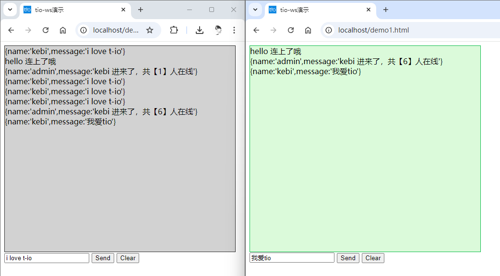

# WebSocket 聊天室项目示例

## 简介

这个项目的主要目的是展示如何使用 `tio-boot` 框架构建一个简单的 WebSocket 聊天室应用。通过这个项目，开发者可以学习如何使用 `tio-boot` 创建一个支持实时通信的 WebSocket 服务器，并了解如何处理客户端连接、消息广播、群组管理等常见的聊天功能。此外，项目还展示了如何通过 `tio-boot` 配置 WebSocket 路由和使用 `tio` 框架的各种监听器来监控连接和消息的状态。

## 后端

### 实现过程

1. **项目初始化与依赖配置**：

   - 首先，项目使用 Maven 进行管理，定义了所需的依赖项，包括 `tio-boot`、`fastjson2`、`lombok` 等，用于快速构建 WebSocket 服务器、处理 JSON 数据以及简化 Java 代码开发。
   - 配置了 `app.properties` 文件，设置了服务器端口、SSL 证书等基础配置。

2. **服务器启动类**：

   - 创建了 `ImServerApp` 作为服务器的启动类，通过 `TioApplication.run()` 方法启动 `tio-boot` 应用，加载所有配置并初始化 WebSocket 服务。

3. **常量定义**：

   - 在 `MyChatServerConstant` 类中定义了 WebSocket 服务的一些重要常量，例如群组 ID (`GROUP_ID`)、字符编码(`CHARSET`) 和心跳超时时间 (`HEARTBEAT_TIMEOUT`)。

4. **IP 统计监听器**：

   - 实现了 `MyIpStatListener` 监听器，用于监听和记录与 IP 相关的统计数据，如连接数、接收和发送的字节数等。监听器可以将这些统计数据输出到日志中或者保存到数据库中，方便后续分析。

5. **WebSocket 服务器监听器**：

   - `MyWebSocketServerAioListener` 监听器负责处理 WebSocket 服务器的一些核心事件，例如客户端连接建立、消息发送、连接关闭等。当客户端连接或断开时，监听器会自动广播消息给所有在线的客户端。

6. **WebSocket 处理器**：

   - 实现了 `ImWebSocketHandler` 处理器，处理 WebSocket 的握手、文本消息、二进制消息和连接关闭事件。特别是当客户端发送消息时，处理器会将消息包装成 JSON 格式，并广播到所有已连接的客户端，实现群聊功能。

7. **WebSocket 配置**：

   - 在 `WebSocketConfig` 类中，将自定义的 `ImWebSocketHandler` 处理器与指定的 URL 路径（如 `/im`）绑定，并将配置添加到 `TioBootServer` 中，以启用 WebSocket 服务。

8. **测试与演示**：
   - 通过多个浏览器窗口测试 WebSocket 服务，模拟多人聊天场景。服务器能够接收每个客户端的消息，并实时广播给其他所有在线的客户端，确保消息能够在聊天室中同步显示。

### 依赖

以下是项目所需的 Maven 依赖：

```xml
<properties>
    <java.version>1.8</java.version>
    <tio-boot.version>1.5.0</tio-boot.version>
    <lombok-version>1.18.30</lombok-version>
    <fastjson2.version>2.0.52</fastjson2.version>
</properties>

<dependencies>
    <dependency>
        <groupId>ch.qos.logback</groupId>
        <artifactId>logback-classic</artifactId>
        <version>1.3.3</version>
    </dependency>
    <dependency>
        <groupId>com.litongjava</groupId>
        <artifactId>tio-boot</artifactId>
        <version>${tio-boot.version}</version>
    </dependency>
    <dependency>
        <groupId>com.alibaba.fastjson2</groupId>
        <artifactId>fastjson2</artifactId>
        <version>${fastjson2.version}</version>
    </dependency>
    <dependency>
        <groupId>org.projectlombok</groupId>
        <artifactId>lombok</artifactId>
        <version>${lombok-version}</version>
        <scope>provided</scope>
    </dependency>
</dependencies>
```

### 配置文件 `app.properties`

```properties
server.port=80
server.ssl.enable=false
server.ssl.keyStore=classpath:config/ssl/cert-1538199102261_t-io.org.jks
server.ssl.trustStore=classpath:config/ssl/cert-1538199102261_t-io.org.jks
server.ssl.password=08gUMx4x
```

### 启动类

以下是项目的启动类：

```java
package com.litongjava.im.server;

import com.litongjava.jfinal.aop.annotation.AComponentScan;
import com.litongjava.tio.boot.TioApplication;

@AComponentScan
public class ImServerApp {
  public static void main(String[] args) {
    long start = System.currentTimeMillis();
    TioApplication.run(ImServerApp.class, args);
    long end = System.currentTimeMillis();
    System.out.println((end - start) + "ms");
  }
}
```

### 常量类

定义了一些常量，用于服务器配置和心跳超时等设置：

```java
package com.litongjava.im.server.config;

public interface MyChatServerConstant {
  /**
   * 用于群聊的 group id
   */
  String GROUP_ID = "group-01";
  String CHARSET = "utf-8";
  /**
   * 心跳超时时间，单位：毫秒
   */
  int HEARTBEAT_TIMEOUT = 1000 * 60;
}
```

### IP 统计监听器

该类用于监听和处理 IP 统计数据，例如连接数、接收字节数、发送字节数等，并可以选择将数据存储到数据库中或记录到日志文件：

```java
import com.litongjava.tio.utils.time.Time;

public interface IpStatDuration {
  public static final Long DURATION_1 = Time.MINUTE_1 * 5;
  public static final Long[] IPSTAT_DURATIONS = new Long[] { DURATION_1 };
}
```

```java
package com.litongjava.im.server.listener;

import com.litongjava.tio.core.ChannelContext;
import com.litongjava.tio.core.TioConfig;
import com.litongjava.tio.core.stat.IpStat;
import com.litongjava.tio.core.stat.IpStatListener;
import com.litongjava.tio.utils.json.JsonUtils;

import lombok.extern.slf4j.Slf4j;

@Slf4j
public class MyIpStatListener implements IpStatListener {
  public static final MyIpStatListener me = new MyIpStatListener();

  private MyIpStatListener() {}

  @Override
  public void onExpired(TioConfig tioConfig, IpStat ipStat) {
    // 统计数据过期时调用，可将数据存储到数据库或日志
    if (log.isInfoEnabled()) {
      log.info("可以把统计数据入库\r\n{}", JsonUtils.toJson(ipStat));
    }
  }

  @Override
  public void onAfterConnected(ChannelContext channelContext, boolean isConnected, boolean isReconnect, IpStat ipStat) throws Exception {
    if (log.isInfoEnabled()) {
      log.info("onAfterConnected\r\n{}", JsonUtils.toJson(ipStat));
    }
  }

  @Override
  public void onDecodeError(ChannelContext channelContext, IpStat ipStat) {
    if (log.isInfoEnabled()) {
      log.info("onDecodeError\r\n{}", JsonUtils.toJson(ipStat));
    }
  }

  @Override
  public void onAfterSent(ChannelContext channelContext, Packet packet, boolean isSentSuccess, IpStat ipStat) throws Exception {
    if (log.isInfoEnabled()) {
      log.info("onAfterSent\r\n{}\r\n{}", packet.logstr(), JsonUtils.toJson(ipStat));
    }
  }

  @Override
  public void onAfterDecoded(ChannelContext channelContext, Packet packet, int packetSize, IpStat ipStat) throws Exception {
    if (log.isInfoEnabled()) {
      log.info("onAfterDecoded\r\n{}\r\n{}", packet.logstr(), JsonUtils.toJson(ipStat));
    }
  }

  @Override
  public void onAfterReceivedBytes(ChannelContext channelContext, int receivedBytes, IpStat ipStat) throws Exception {
    if (log.isInfoEnabled()) {
      log.info("onAfterReceivedBytes\r\n{}", JsonUtils.toJson(ipStat));
    }
  }

  @Override
  public void onAfterHandled(ChannelContext channelContext, Packet packet, IpStat ipStat, long cost) throws Exception {
    if (log.isInfoEnabled()) {
      log.info("onAfterHandled\r\n{}\r\n{}", packet.logstr(), JsonUtils.toJson(ipStat));
    }
  }
}
```

### WebSocket 服务器监听器

用于处理 WebSocket 服务器事件，如连接建立、消息接收、连接关闭等：

```java
package com.litongjava.im.listener;

import org.slf4j.Logger;
import org.slf4j.LoggerFactory;

import com.litongjava.aio.Packet;
import com.litongjava.im.config.MyChatServerConstant;
import com.litongjava.tio.core.ChannelContext;
import com.litongjava.tio.core.Tio;
import com.litongjava.tio.websocket.common.WebSocketResponse;
import com.litongjava.tio.websocket.common.WebSocketSessionContext;
import com.litongjava.tio.websocket.server.WebSocketServerAioListener;

public class MyWebSocketServerAioListener extends WebSocketServerAioListener {
  private static Logger log = LoggerFactory.getLogger(MyWebSocketServerAioListener.class);
  public static final MyWebSocketServerAioListener me = new MyWebSocketServerAioListener();

  private MyWebSocketServerAioListener() {
  }

  @Override
  public void onAfterConnected(ChannelContext channelContext, boolean isConnected, boolean isReconnect) throws Exception {
    super.onAfterConnected(channelContext, isConnected, isReconnect);
    if (log.isInfoEnabled()) {
      log.info("onAfterConnected\r\n{}", channelContext);
    }
  }

  @Override
  public void onAfterSent(ChannelContext channelContext, Packet packet, boolean isSentSuccess) throws Exception {
    super.onAfterSent(channelContext, packet, isSentSuccess);
    if (log.isInfoEnabled()) {
      log.info("onAfterSent\r\n{}\r\n{}", packet.logstr(), channelContext);
    }
  }

  @Override
  public void onBeforeClose(ChannelContext channelContext, Throwable throwable, String remark, boolean isRemove) throws Exception {
    super.onBeforeClose(channelContext, throwable, remark, isRemove);
    if (log.isInfoEnabled()) {
      log.info("onBeforeClose\r\n{}", channelContext);
    }
    WebSocketSessionContext wsSessionContext = (WebSocketSessionContext) channelContext.get();
    if (wsSessionContext != null && wsSessionContext.isHandshaked()) {
      int count = Tio.getAll(channelContext.tioConfig).getObj().size();
      String msg = channelContext.getClientNode().toString() + " 离开了，现在共有【" + count + "】人在线";
      WebSocketResponse wsResponse = WebSocketResponse.fromText(msg, MyChatServerConstant.CHARSET);
      Tio.sendToGroup(channelContext.tioConfig, MyChatServerConstant.GROUP_ID, wsResponse);
    }
  }

  @Override
  public void onAfterDecoded(ChannelContext channelContext, Packet packet, int packetSize) throws Exception {
    super.onAfterDecoded(channelContext, packet, packetSize);
    if (log.isInfoEnabled()) {
      log.info("onAfterDecoded\r\n{}\r\n{}", packet.logstr(), channelContext);
    }
  }

  @Override
  public void onAfterReceivedBytes(ChannelContext channelContext, int receivedBytes) throws Exception {
    super.onAfterReceivedBytes(channelContext, receivedBytes);
    if (log.isInfoEnabled()) {
      log.info("onAfterReceivedBytes\r\n{}", channelContext);
    }
  }

  @Override
  public void onAfterHandled(ChannelContext channelContext, Packet packet, long cost) throws Exception {
    super.onAfterHandled(channelContext, packet, cost);
    if (log.isInfoEnabled()) {
      log.info("onAfterHandled\r\n{}\r\n{}", packet.logstr(), channelContext);
    }
  }
}
```

### 配置类

配置了服务器的 IP 统计、SSL 证

书及心跳超时等参数：

```java
package com.litongjava.im.server.config;

import com.litongjava.im.server.constant.IpStatDuration;
import com.litongjava.im.server.listener.MyIpStatListener;
import com.litongjava.jfinal.aop.annotation.AConfiguration;
import com.litongjava.jfinal.aop.annotation.AInitialization;
import com.litongjava.tio.boot.server.TioBootServer;
import com.litongjava.tio.server.ServerTioConfig;
import com.litongjava.tio.utils.environment.EnvUtils;

import lombok.extern.slf4j.Slf4j;

@AConfiguration
@Slf4j
public class TioBootServerConfig {

  @Initialization(priority = 99)
  public void config() {

    ServerTioConfig serverTioConfig = TioBootServer.me().getServerTioConfig();

    // 设置ip监控
    serverTioConfig.setIpStatListener(MyIpStatListener.me);
    // 设置ip统计时间段
    serverTioConfig.ipStats.addDurations(IpStatDuration.IPSTAT_DURATIONS);

    // 设置心跳超时时间
    serverTioConfig.setHeartbeatTimeout(MyChatServerConstant.HEARTBEAT_TIMEOUT);

    if (EnvUtils.getBoolean("server.ssl.enable", false)) {
      log.info("enable ssl");
      String keyStoreFile = EnvUtils.get("server.ssl.keyStore", null);
      String trustStoreFile = EnvUtils.get("server.ssl.trustStore", null);
      String keyStorePwd = EnvUtils.get("server.ssl.password", null);
      try {
        serverTioConfig.useSsl(keyStoreFile, trustStoreFile, keyStorePwd);
      } catch (Exception e) {
        e.printStackTrace();
      }
    }
  }
}
```

### WebSocket 处理器

处理 WebSocket 的握手、消息接收和关闭事件，支持群聊功能：

```java
package com.litongjava.im.server.handler;

import java.util.Objects;

import com.litongjava.im.server.config.MyChatServerConstant;
import com.litongjava.tio.core.ChannelContext;
import com.litongjava.tio.core.Tio;
import com.litongjava.tio.http.common.HttpRequest;
import com.litongjava.tio.http.common.HttpResponse;
import com.litongjava.tio.websocket.common.WebSocketRequest;
import com.litongjava.tio.websocket.common.WebSocketResponse;
import com.litongjava.tio.websocket.common.WebSocketSessionContext;
import com.litongjava.tio.websocket.server.handler.IWebSocketHandler;

import lombok.extern.slf4j.Slf4j;

@Slf4j
public class ImWebSocketHandler implements IWebSocketHandler {

  /**
   * 处理握手，业务可以在这里获取cookie，request参数等
   */
  @Override
  public HttpResponse handshake(HttpRequest request, HttpResponse httpResponse, ChannelContext channelContext) throws Exception {
    String clientip = request.getClientIp();
    String myname = request.getParam("name");

    Tio.bindUser(channelContext, myname);
    log.info("收到来自{}的ws握手包{}", clientip, request.toString());
    return httpResponse;
  }

  /**
   * 握手完成后
   */
  @Override
  public void onAfterHandshaked(HttpRequest httpRequest, HttpResponse httpResponse, ChannelContext channelContext) throws Exception {
    // 绑定到群组，后面会有群发
    Tio.bindGroup(channelContext, MyChatServerConstant.GROUP_ID);
    // 获取客户端连接数量
    int count = Tio.getAll(channelContext.tioConfig).getObj().size();

    String msg = "{name:'admin',message:'" + channelContext.userid + " 进来了，共【" + count + "】人在线" + "'}";
    WebSocketResponse wsResponse = WebSocketResponse.fromText(msg, MyChatServerConstant.CHARSET);
    Tio.sendToGroup(channelContext.tioConfig, MyChatServerConstant.GROUP_ID, wsResponse);
  }

  @Override
  public Object onBytes(WebSocketRequest wsRequest, byte[] bytes, ChannelContext channelContext) throws Exception {
    return null;
  }

  @Override
  public Object onClose(WebSocketRequest wsRequest, byte[] bytes, ChannelContext channelContext) throws Exception {
    Tio.remove(channelContext, "receive close flag");
    return null;
  }

  @Override
  public Object onText(WebSocketRequest wsRequest, String text, ChannelContext channelContext) throws Exception {
    WebSocketSessionContext wsSessionContext = (WebSocketSessionContext) channelContext.get();
    String path = wsSessionContext.getHandshakeRequest().getRequestLine().path;
    log.info("path:{},收到ws消息:{}", path, text);

    if (Objects.equals("心跳内容", text)) {
      return null;
    }

    String msg = "{name:'" + channelContext.userid + "',message:'" + text + "'}";
    WebSocketResponse wsResponse = WebSocketResponse.fromText(msg, MyChatServerConstant.CHARSET);
    Tio.sendToGroup(channelContext.tioConfig, MyChatServerConstant.GROUP_ID, wsResponse);

    return null;
  }
}
```

### WebSocket 配置类

用于配置 WebSocket 的路由，将 WebSocket 请求路径与处理器关联起来：

```java
package com.litongjava.im.config;

import com.litongjava.annotation.AConfiguration;
import com.litongjava.annotation.Initialization;
import com.litongjava.im.handler.ImWebSocketHandler;
import com.litongjava.tio.boot.server.TioBootServer;
import com.litongjava.tio.boot.websocket.WebSocketRouter;

@AConfiguration
public class WebSocketConfig {

  @Initialization
  public void config() {

    WebSocketRouter r = TioBootServer.me().getWebSocketRouter();
    if (r != null) {
      r.add("/im", new ImWebSocketHandler());
    }

  }
}
```

### 项目原理

这个项目的核心是利用 WebSocket 协议进行实时通信。WebSocket 是一种全双工协议，允许服务器和客户端之间建立一个持久的连接，并且可以在这个连接上实时地发送和接收消息。这种实时通信能力使得 WebSocket 特别适合用于聊天室、在线游戏等需要低延迟、高实时性的数据交换场景。

#### 实现过程中的关键点：

1. **WebSocket 连接建立**：

   - 客户端通过 HTTP 请求发起 WebSocket 握手请求，服务器通过响应来完成握手，从而建立一个 WebSocket 连接。
   - 握手成功后，连接保持打开状态，允许双向数据传输。

2. **消息处理**：

   - 服务器接收来自客户端的消息，并通过广播的方式将消息分发给所有已连接的客户端，从而实现聊天室的群聊功能。
   - 通过自定义的 `WebSocketHandler`，服务器可以处理各种类型的消息，包括文本消息、二进制消息，以及处理连接关闭等事件。

3. **群组管理**：

   - 项目中使用了 `Tio` 的群组功能，每个连接的客户端都会被绑定到一个指定的群组，这样服务器可以轻松地将消息广播到该群组的所有成员。

4. **监听和统计**：
   - 项目实现了多种监听器，如 `MyIpStatListener` 和 `MyWebSocketServerAioListener`，用于实时监控和记录连接状态、消息传递情况等信息。这些信息可以帮助开发者了解服务器的运行状态，并进行必要的优化和调试。

### `MyIpStatListener` 的作用

`MyIpStatListener` 是一个用于统计和监听 IP 状态的监听器，它主要用于记录和输出与 IP 相关的统计数据。它可以帮助开发者跟踪以下内容：

- **连接统计**：记录每个 IP 的连接次数。
- **数据流量统计**：记录每个 IP 的数据接收和发送字节数。
- **错误统计**：记录解码错误等异常情况。
- **数据持久化**：可以选择将统计数据存储到数据库中，方便后续分析。

从输出日志中可以看到 `MyIpStatListener` 的具体作用：

- **连接建立后**：

  - 日志输出连接信息，如 `onAfterConnected`，表明新客户端已连接。
  - `"receivedBytes":0,"sentBytes":0` 表示刚连接时还没有数据传输。

- **收到数据后**：
  - `onAfterReceivedBytes` 记录了接收到的字节数，如日志中的 `"receivedBytes":285`，表示客户端发送了 285 字节的数据。
- **处理消息后**：
  - `onAfterHandled` 记录了服务器处理消息后的统计信息，比如处理时间、处理的字节数等。

这些信息对于监控服务器性能、诊断网络问题非常有帮助。

### `MyWebSocketServerAioListener` 的作用

`MyWebSocketServerAioListener` 是一个专门用于处理 WebSocket 服务器事件的监听器。它处理的事件包括：

- **连接事件**：当客户端连接到服务器时，监听器会触发 `onAfterConnected` 方法。这可以用来记录连接的客户端信息，以及通知其他客户端有新用户加入聊天室。
- **消息发送事件**：当服务器成功发送消息给客户端时，会触发 `onAfterSent` 方法。这可以用来确认消息已成功发送，并可以进一步优化消息传递的性能。

- **连接关闭事件**：当客户端断开连接时，触发 `onBeforeClose` 方法。在此事件中，可以处理一些清理工作，例如通知群组中的其他成员该用户已经离开。

从日志中可以看到 `MyWebSocketServerAioListener` 的作用：

- **连接建立后**：
  - 日志中 `onAfterConnected` 表明客户端成功连接服务器，日志详细输出了连接的上下文信息。
- **消息发送后**：

  - 日志中 `onAfterSent` 表示服务器成功将数据发送到客户端，如 `"sentBytes":192`，表示服务器成功发送了 192 字节的数据。

- **消息处理后**：
  - 日志中的 `onAfterHandled` 表示服务器已处理完成客户端发来的消息，记录了处理时间和数据量。

总结来说，`MyIpStatListener` 主要用于记录和统计网络流量和连接状态，而 `MyWebSocketServerAioListener` 主要用于监控和处理 WebSocket 的各种事件，如连接、消息发送和接收等。通过这两个监听器，可以实时监控服务器的运行状况，确保聊天系统的稳定性和高效性。

## 测试

连接到 WebSocket 服务器：

```
http://localhost/im?name=Tong%20Li
```

### 服务端日志

```plaintext
2024-09-01 01:42:40.680 [tio-group-2] INFO  c.l.i.s.l.MyIpStatListener.onAfterConnected:33 - onAfterConnected
{"durationType":"300","duration":"15","receivedPackets":0,"handledPackets":0,"handledCostsPerPacket":0.0,"bytesPerTcpReceive":0.0,"packetsPerTcpReceive":0.0,"handledPacketCosts":0,"ip":"127.0.0.1","sentBytes":0,"handledBytes":0,"receivedBytes":0,"receivedTcps":0,"sentPackets":0,"decodeErrorCount":0,"formatedDuration":"15毫秒","requestCount":1,"start":"2024-09-01 01:42:40"}
```

客户端消息发送：

```
hi
```

服务端日志记录接收消息并群发：

```plaintext
2024-09-01 01:43:45.295 [tio-group-6] INFO  c.l.i.s.h.ImWebSocketHandler.onText:80 - path:/im,收到ws消息:hi
```

返回数据：

```plaintext
{name:'Tong Li',message:'hi'}
```

## 前端

这里就不添加具体前端代码了。前端演示效果如下：

### 演示效果

测试地址：

http://localhost/demo.html
http://localhost/demo1.html

http://localhost/im.html

http://localhost/index.html


以上展示了一个 WebSocket 聊天室的基本实现和效果演示，能够在本地进行简单的多人聊天。你可以通过打开多个浏览器窗口进行测试。
