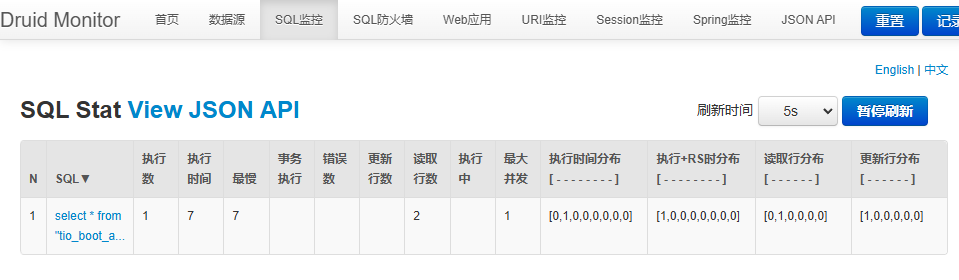
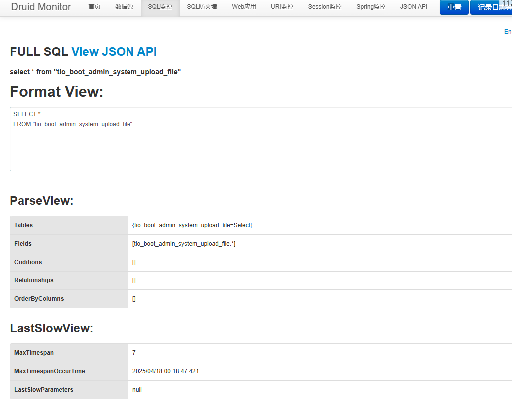
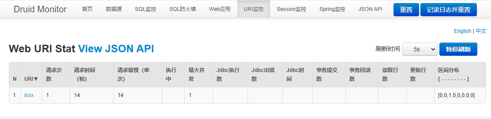

# Druid 监控集成指南

[[toc]]

---

## 一、前置依赖

在项目的构建文件（如 Maven 的 `pom.xml`）中添加 Druid 和数据库驱动依赖：

```xml
<dependency>
  <groupId>com.alibaba</groupId>
  <artifactId>druid</artifactId>
  <version>1.1.23</version>
</dependency>

<dependency>
  <groupId>org.postgresql</groupId>
  <artifactId>postgresql</artifactId>
  <version>42.2.24</version>
</dependency>
```

- **Druid**：提供高性能 JDBC 连接池、慢 SQL 日志、Web 监控等功能。
- **数据库驱动**：根据实际使用的关系型数据库选择对应驱动。

---

## 二、配置 Druid 连接池与过滤器

在一个启动时被扫描的配置类（使用自定义 `@AConfiguration` 注解）中：

```java
package com.litongjava.druid.config;

import java.util.Arrays;
import java.util.Collections;

import com.alibaba.druid.filter.stat.StatFilter;
import com.alibaba.druid.wall.WallFilter;
import com.litongjava.annotation.AConfiguration;
import com.litongjava.annotation.Initialization;
import com.litongjava.db.activerecord.ActiveRecordPlugin;
import com.litongjava.db.activerecord.Db;
import com.litongjava.db.activerecord.OrderedFieldContainerFactory;
import com.litongjava.db.activerecord.Row;
import com.litongjava.db.activerecord.dialect.PostgreSqlDialect;
import com.litongjava.db.druid.DruidPlugin;
import com.litongjava.tio.boot.druid.DruidConfig;
import com.litongjava.tio.boot.druid.DruidStatHandler;
import com.litongjava.tio.boot.server.TioBootServer;
import com.litongjava.tio.http.server.router.HttpRequestRouter;
import com.litongjava.tio.utils.environment.EnvUtils;

import lombok.extern.slf4j.Slf4j;

@AConfiguration
@Slf4j
public class AdminAppConfig {

  @Initialization
  public void config() {
    // —— 一、配置 Druid 连接池并加上 StatFilter/WallFilter ——
    String jdbcUrl = EnvUtils.getStr("jdbc.url");
    String jdbcUser = EnvUtils.getStr("jdbc.user");
    String jdbcPwd = EnvUtils.getStr("jdbc.pswd");

    DruidPlugin druidPlugin = new DruidPlugin(jdbcUrl, jdbcUser, jdbcPwd);

    // 1）防止 SQL 注入
    WallFilter wall = new WallFilter();
    wall.setDbType("postgresql");
    druidPlugin.addFilter(wall);

    // 2）统计 & 慢 SQL 日志
    StatFilter stat = new StatFilter();
    stat.setSlowSqlMillis(500);  // 慢 SQL 阈值 500ms
    stat.setLogSlowSql(true);    // 是否将慢 SQL 打印到日志
    stat.setMergeSql(true);      // 合并相同 SQL 统计
    druidPlugin.addFilter(stat);

    // 启动 Druid
    druidPlugin.start();

    // 配置 ActiveRecord（可选）并跑一次测试查询，确保有统计数据
    ActiveRecordPlugin arp = new ActiveRecordPlugin(druidPlugin);
    arp.setContainerFactory(new OrderedFieldContainerFactory());
    arp.setDialect(new PostgreSqlDialect());
    arp.start();

    Db.findAll("tio_boot_admin_system_upload_file").forEach((Row r) -> {
      /* no-op */
    });

    // —— 二、配置 Druid HTTP 监控面板 ——
    DruidConfig druidConfig = new DruidConfig();
    druidConfig.setLoginUsername("admin");      // 登录用户名
    druidConfig.setLoginPassword("123456");    // 登录密码
    druidConfig.setResetEnable(true);            // 是否允许 "Reset All" 功能
    druidConfig.setAllowIps(Arrays.asList("127.0.0.1")); // 允许访问的 IP 白名单
    druidConfig.setDenyIps(Collections.emptyList());       // IP 黑名单

    // 若需通过 JMX 远程拉取监控，可配置下面三项：
    // druidConfig.setJmxUrl("service:jmx:rmi:///jndi/rmi://localhost:8848/jmxrmi");
    // druidConfig.setJmxUsername("jmxUser");
    // druidConfig.setJmxPassword("jmxPwd");

    // 在路由中注册 /druid/** 路径，映射到 DruidStatHandler
    TioBootServer me = TioBootServer.me();
    HttpRequestRouter router = me.getRequestRouter();
    DruidStatHandler druidPanel = new DruidStatHandler(druidConfig);
    router.add("/druid/**", druidPanel::handle);

    log.info(">>> Druid stat view is up at http://localhost/druid/index.html");
  }
}
```

**说明：** 以上配置完成后，数据库连接池即可开启统计、慢 SQL 日志，并生成可视化监控面板。

---

## 三、配置 Web URI 监控拦截器

Druid 默认基于 Servlet 实现监控，Tio-Boot 无 Servlet 依赖，因此需使用 `DruidWebStatInterceptor` 进行替代：

```java
package com.litongjava.druid.config;

import com.litongjava.annotation.AConfiguration;
import com.litongjava.annotation.Initialization;
import com.litongjava.tio.boot.druid.DruidWebStatInterceptor;
import com.litongjava.tio.boot.http.interceptor.HttpInteceptorConfigure;
import com.litongjava.tio.boot.http.interceptor.HttpInterceptorModel;
import com.litongjava.tio.boot.server.TioBootServer;

@AConfiguration
public class InterceptorConfiguration {

  @Initialization
  public void configureInterceptors() {
    String contextPath = "";                       // 服务上下文路径，无则留空
    String exclusionsCsv = "*.js,*.css,*.png,*.jpg,/druid/*"; // 排除静态资源和 Druid 自身
    boolean profileEnable = true;                   // 是否启用调用耗时分析

    DruidWebStatInterceptor webStatInterceptor =
      new DruidWebStatInterceptor(contextPath, exclusionsCsv, profileEnable);

    // 构造拦截器模型，拦截所有请求，但放行静态资源和 Druid 面板
    HttpInterceptorModel model = new HttpInterceptorModel()
      .setName("druid-web-stat")
      .addBlockUrl("/**")
      .addAllowUrls("*.js", "*.css", "*.png", "*.jpg", "*.ico", "/druid/**")
      .setInterceptor(webStatInterceptor);

    // 注入到全局 HTTP 拦截配置
    HttpInteceptorConfigure cfg = new HttpInteceptorConfigure();
    cfg.add(model);
    TioBootServer.me().setHttpInteceptorConfigure(cfg);
  }
}
```

**说明：** 该拦截器将采集所有经过 Tio-Boot HTTP 层的 URI 请求数据，生成对应统计。

---

## 四、访问监控面板

启动服务后，打开浏览器访问：

```
http://localhost/druid/index.html
```

常用监控页面：

- **SQL 监控**：`/druid/sql.html`，查看 SQL 执行次数、最慢耗时、合并统计等。
- **Web URI 监控**：`/druid/weburi.html`，查看接口请求次数、耗时分布等。

**示例截图**：

1. SQL Stat View JSON API：展示慢 SQL 阈值内的执行统计
2. FULL SQL View JSON API：查看具体 SQL 解析信息
3. Web URI Stat View JSON API：展示接口 URI 调用统计



因为若干原因.url 监控,没有 jdbc 的信息


---

## 五、常见问题及说明

- **为何在 URI 监控中看不到 JDBC 信息？**
  因为 Web URI 统计只聚焦于 HTTP 层面调用链，不会显示底层 JDBC 执行明细；要查看 SQL 统计，请切换到 SQL 监控页面。

- **Reset All 按钮**：可清空所有统计，适用于测试场景；若不想暴露此功能，可在 `DruidConfig` 中将 `resetEnable` 设为 `false`。

- **生产环境安全**：
  - 强烈建议将监控路径绑定到内网或专用网络，并使用 `allowIps`/`denyIps` 做 IP 访问控制。
  - 设置复杂的登录密码，或结合网关做二次认证。

---

至此，您已完成在 Tio-Boot 项目中集成 Druid 监控的全部配置。如果有进一步需求或疑问，请参考 [Druid 官方文档](https://github.com/alibaba/druid) 或在 issue 中反馈。
