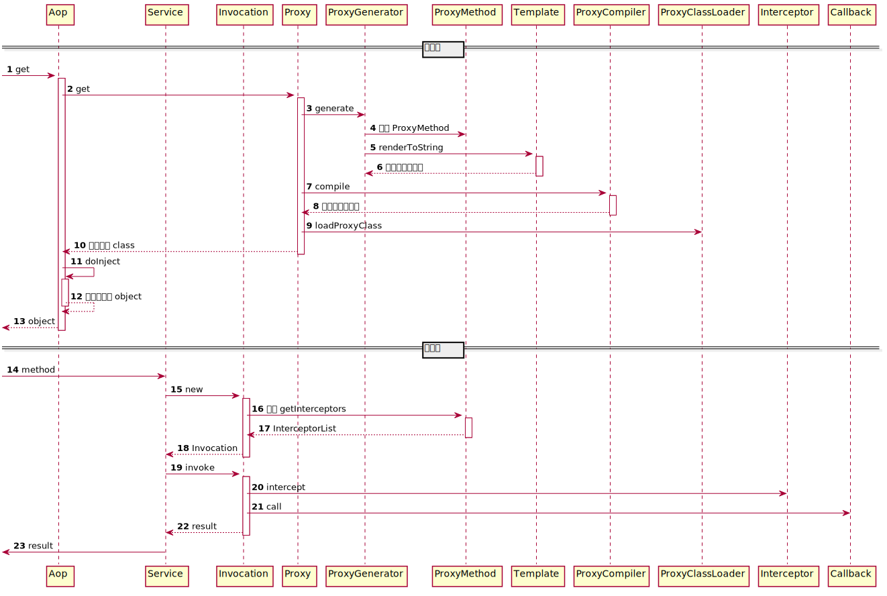

# 原理解析

## 1. 简介

本文介绍了 JFinal 框架中 AOP（面向切面编程）的实现原理和整体架构。

### 1.1. AOP 简介

AOP（Aspect-Oriented Programming，面向切面编程）是一种通过预编译方式和运行期间动态代理实现程序功能统一维护的技术。它允许将系统中的横切关注点（如日志、事务管理、权限控制等）与业务逻辑分离，增强代码的可维护性和可重用性。

传统的 AOP 实现通常需要引入大量复杂且冗余的概念，例如：Aspect（切面）、Advice（通知）、Joinpoint（连接点）、Pointcut（切入点）、Introduction（引入）、Weaving（织入）、Around（环绕通知）等。同时，还需要引入 IoC 容器，并配合大量的 XML 配置或注解来进行组件装配。

这种传统方式不仅学习成本高、开发效率低、开发体验差，而且还会影响系统性能，特别是在开发阶段可能导致项目启动缓慢，极大地影响开发效率。

JFinal 采用了极简化的 AOP 设计，专注于 AOP 最核心的目标，将概念减少到极致，仅有三个核心概念：`Interceptor`（拦截器）、`Before`（前置通知）、`Clear`（清除拦截器）。同时，无需引入 IoC 容器，也无需使用繁琐的 XML 配置。

### 1.2. 核心概念

JFinal 实现的 AOP 只有三个核心概念，理解和使用相对简单：

- **Interceptor（拦截器）**：用于拦截方法调用，并提供机会在方法的前后添加切面代码，实现 AOP 的核心功能。
- **Before（前置通知）**：用于配置拦截器的注解，可在类或方法级别进行配置，指定哪些拦截器应用于哪些类或方法。
- **Clear（清除拦截器）**：拦截器按照 Global（全局）、Routes（路由）、Class（类）、Method（方法）四个层次依次生效。`Clear` 注解用于清除自身所处层次以上层的拦截器。

### 1.3. 使用方式

使用 JFinal 的 AOP 只需三步：

1. 在方法上使用 `@AopBefore(InterceptorClass.class)` 注解，指定要应用的拦截器。
2. 在属性上使用 `@Inject` 注解，实现依赖注入。
3. 使用 `Aop.get()` 获取增强后的实例。

**示例代码：**

```java
// 主服务类
@Slf4j
public class Service {
    @Inject
    private OtherService otherService;

    @AopBefore(ServiceInterceptor.class)
    public void doIt() {
        log.info("doIt");
    }

    public static class ServiceInterceptor implements AopInterceptor {
        @Override
        public void intercept(AopAopInvocation inv) {
            log.info("before ServiceInterceptor");
            inv.invoke();
            log.info("after ServiceInterceptor");
        }
    }
}

// 被注入的服务类
@Slf4j
public class OtherService {
    @AopBefore(OtherInterceptor.class)
    public void doOther() {
        log.info("doOther");
    }

    public static class OtherInterceptor implements AopInterceptor {
        @Override
        public void intercept(AopAopInvocation inv) {
            log.info("before OtherInterceptor");
            inv.invoke();
            log.info("after OtherInterceptor");
        }
    }
}

// 测试类
public class AopDemo {
    public static void main(String[] args) {
        ProxyManager.me().setPrintGeneratedClassToConsole(true);
        Service service = Aop.get(Service.class);
        service.doIt();
    }
}
```

在上述代码中，我们：

- 使用了 `@AopBefore` 注解为方法配置了拦截器。
- 使用了 `@Inject` 注解实现了依赖注入。
- 通过 `Aop.get(Service.class)` 获取了增强后的 `Service` 实例。

## 2. 实现原理

### 2.1. JFinal 原生实现

JFinal 的原生 AOP 实现主要步骤如下（参见 `ProxyFactory`）：

1. **解析被增强类的 Class**：读取需要增强的类的元数据信息。
2. **生成增强类的 Java 代码**：根据模板生成包含切面逻辑的 Java 代码。
3. **编译生成的 Java 代码**：将生成的代码编译成字节码。
4. **加载增强后的 Class 文件**：将编译后的类加载到 JVM 中。
5. **反射生成增强类的实例**：使用反射创建增强类的对象。
6. **依赖注入**：根据 `@Inject` 注解对属性进行依赖注入。

关键步骤是根据模板生成被增强类的 Java 代码。生成的代码示例如下：

AopAopInvocation 构造方法

```java
public AopAopInvocation(Object target, Long proxyMethodKey, Callback callback, Object... args)
```

```java
package com.example.demo.jfinal;

import com.jfinal.aop.AopAopInvocation;

public class Service$$EnhancerByJFinal extends Service {
    @Override
    public void doIt() {
        AopAopInvocation inv = new AopAopInvocation(this, 1L,
            args -> {
                Service$$EnhancerByJFinal.super.doIt();
                return null;
            }
        );
        inv.invoke();
    }
}
```

可以看到，生成的增强类中构建了一个 `AopAopInvocation` 对象，并调用了其 `invoke()` 方法。实际上，所有的执行逻辑都封装在 `AopAopInvocation` 中，自动生成的增强类只是一个代理层。

### 2.2. CGLIB 实现

使用 CGLIB 实现 AOP 的原理相对简单，通过调用 CGLIB 提供的 API 即可：

```java
public <T> T get(Class<T> target) {
    return (T) net.sf.cglib.proxy.Enhancer.create(target, new CglibCallback());
}

// CglibProxyFactory 的核心就是调用 CGLIB 对目标类进行增强，切面逻辑在 CglibCallback 中实现。

/**
 * CglibCallback 实现方法拦截。
 */
class CglibCallback implements MethodInterceptor {
    public Object intercept(Object target, Method method, Object[] args, MethodProxy methodProxy) throws Throwable {
        // 1. 构建拦截器链
        MethodKey key = IntersCache.getMethodKey(targetClass, method);
        Interceptor[] inters = IntersCache.get(key);
        if (inters == null) {
            inters = interMan.buildServiceMethodInterceptor(targetClass, method);
            IntersCache.put(key, inters);
        }

        // 2. 封装 AopAopInvocation 并执行
        AopAopInvocation inv = new AopAopInvocation(target, method, inters,
            x -> methodProxy.invokeSuper(target, x),
            args
        );
        inv.invoke();
        return inv.getReturnValue();
    }
}
```

这段代码主要展示了如何使用 CGLIB 库创建一个代理对象，并通过 `CglibCallback` 类实现方法调用的拦截和处理。

可以看出，CGLIB 实现的增强逻辑与原生实现一致，都是构建 `AopAopInvocation` 并执行。不同之处在于：

- 原生实现中，通过 `ProxyMethod` 获取拦截器链。
- CGLIB 实现中，使用 `InterceptorManager` 构建拦截器链。

### 2.3. `AopAopInvocation` 实现织入逻辑

**初始化：**

```java
// 构造方法
public AopAopInvocation(Object target, Long proxyMethodKey, Callback callback) {
    this(target, proxyMethodKey, callback, NULL_ARGS);
}

public AopAopInvocation(Object target, Long proxyMethodKey, Callback callback, Object... args) {
    this.action = null;
    this.target = target;

    ProxyMethod proxyMethod = ProxyMethodCache.get(proxyMethodKey);
    this.method = proxyMethod.getMethod();
    this.inters = proxyMethod.getInterceptors();

    this.callback = callback;
    this.args = args;
}
```

在构造方法中，通过 `ProxyMethod` 获取了方法和对应的拦截器列表。这种设计思想是根据类和方法上的 `@AopBefore` 注解构建拦截器链。

**执行逻辑：**

```java
public void invoke() {
    if (index < inters.length) {
        inters[index++].intercept(this);
    } else if (index++ == inters.length) { // 确保 action 只执行一次
        try {
            // 执行原始方法
            if (action != null) {
                returnValue = action.getMethod().invoke(target, args);
            }
            // 执行回调
            else {
                returnValue = callback.call(args);
            }
        } catch (AopAopInvocationTargetException e) {
            Throwable t = e.getTargetException();
            if (t == null) {
                t = e;
            }
            throw t instanceof RuntimeException ? (RuntimeException) t : new RuntimeException(t);
        } catch (RuntimeException e) {
            throw e;
        } catch (Throwable t) {
            throw new RuntimeException(t);
        }
    }
}
```

执行逻辑相对简单：

- 如果存在拦截器，先逐个执行拦截器的 `intercept()` 方法。
- 拦截器执行完毕后，执行原始方法或回调。

这种链式调用的方式确保了拦截器能够在方法调用前后添加额外的逻辑，实现 AOP 的核心功能。

## 3. 时序图

  
_图 1：AOP 执行时序图_

### 配置态

1. **get 方法调用 (1-2)**：
   - `Aop` 层发起 `get` 方法调用，以获取增强后的 `Service` 对象实例。
2. **生成代理类 (3-10)**：

   - 调用 `Proxy` 模块进行代理类的生成。
     - **构建 `ProxyMethod` (4)**：`Proxy` 模块会根据目标类的方法创建 `ProxyMethod` 实例，包含方法的元数据和拦截器列表。
     - **生成字节码 (5-6)**：`ProxyGenerator` 利用模板生成包含切面逻辑的 Java 源代码并转换为字符串形式。
     - **编译生成的 Java 字节码 (7-8)**：`ProxyCompiler` 负责编译生成的 Java 源代码，将其转化为 JVM 可执行的字节码。
     - **加载增强类 (9)**：使用 `ProxyClassLoader` 将编译后的字节码加载到 JVM 中，生成增强后的代理类。
   - **得到增强后的类 (10)**：增强类生成后，将其返回给 `Aop`。

3. **依赖注入 (11-12)**：
   - `Aop` 调用 `doInject` 方法，对生成的代理对象进行依赖注入，将必要的依赖对象注入到对象中。
   - **注入完成的对象 (13)**：注入完成后，返回增强并完成注入的 `Service` 实例。

### 运行态

1. **方法调用 (14-15)**：
   - `Service` 实例调用某个业务方法，触发拦截器逻辑。
   - 生成增强对象并调用方法。
2. **获取拦截器链 (16-17)**：

   - 调用 `getInterceptors` 方法，获取应用于该方法的拦截器链列表。

3. **方法调用封装与执行 (18-19)**：

   - 构建 `AopInvocation` 实例，封装方法调用的信息和拦截器链。
   - 调用 `invoke` 方法，依次执行拦截器逻辑。

4. **执行拦截器 (20-21)**：

   - **intercept (20)**：每个拦截器依次执行，并在调用前后执行切面逻辑（如日志、权限检查等）。
   - **call 原始方法 (21)**：当所有拦截器执行完毕后，调用实际的业务方法。

5. **返回结果 (22-23)**：
   - 方法执行结束后，将执行结果返回给调用方。

### 总结

整个流程中，JFinal 的 AOP 通过生成代理类来增强对象，并在方法执行前后插入拦截器逻辑。配置态主要涉及生成和编译增强类，而运行态则主要是拦截器链的构建与执行，从而实现方法的前后切面逻辑。

这个设计极大地简化了 AOP 的实现过程，不需要复杂的 XML 配置和 IoC 容器支持，只需基于注解即可完成拦截器的配置与依赖注入，提升了开发体验和运行时性能。

## 4. 架构

### 整体架构

整个架构分为两层：`Aop` 层和 `Proxy` 层。

- **Proxy 层**：负责获取增强后的类对象，包括生成增强的 Java 代码、编译、加载类等。
- **Aop 层**：使用 `Proxy` 层增强后的代码，组装拦截器链，实现拦截逻辑。

  
_图 2：JFinal AOP 整体架构图_

### Proxy 模块

  
_图 3：Proxy 模块类图_

**类图说明：**

- **对外接口：**
  - `Proxy`：提供 `get` 方法，根据类获取增强后的实例。
- **内部实现：**
  - `ProxyFactory`：`Proxy` 接口的实现类。
- **配置类：**
  - `ProxyManager`：`Proxy` 模块的配置类。
- **功能实现类：**
  - `ProxyGenerator`：代码生成器，生成增强类的 Java 代码。
  - `ProxyCompiler`：代码编译器，编译生成的 Java 代码。
  - `ProxyClassLoader`：类加载器，加载编译后的类。
- **实体类：**
  - `ProxyClass`：保存被代理类的元信息。
  - `ProxyMethod`：保存被代理的方法和方法上的拦截器。
  - `ProxyMethodCache`：缓存 `ProxyMethod`，供 `AopAopInvocation` 根据 `proxyMethodKey` 获取。

### Aop 模块

  
_图 4：Aop 模块类图_

**类图说明：**

- **对外接口：**
  - `Aop`：
    - `get`：获取增强后的实例。
    - `inject`：注入依赖。
- **内部实现：**
  - `AopFactory`：`Aop` 接口的实现类。
- **配置类：**
  - `AopManager`：`Aop` 模块的配置类。
- **功能实现类：**
  - 利用 `Proxy` 模块的功能实现切面能力。
- **实体类：**
  - `AopAopInvocation`：封装一次方法调用，执行拦截器逻辑。
  - `Interceptor`：拦截器接口。
  - `InterceptorManager`：构建目标类的拦截器列表。

## 5. 总结

JFinal 的 AOP 实现核心在于构建 `AopAopInvocation`。通过生成并编译 Java 代码的方式生成增强类，或者使用 CGLIB 对目标类进行增强。

按照对外接口、配置类、接口实现类、功能实现类和实体类对 JFinal 的类进行分类，可以清晰地了解其整体架构。
