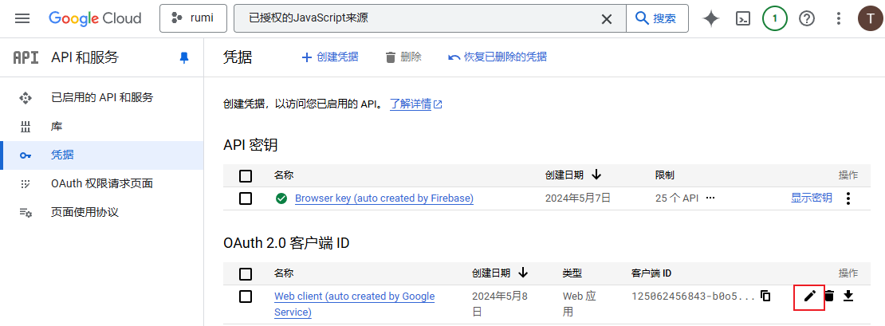
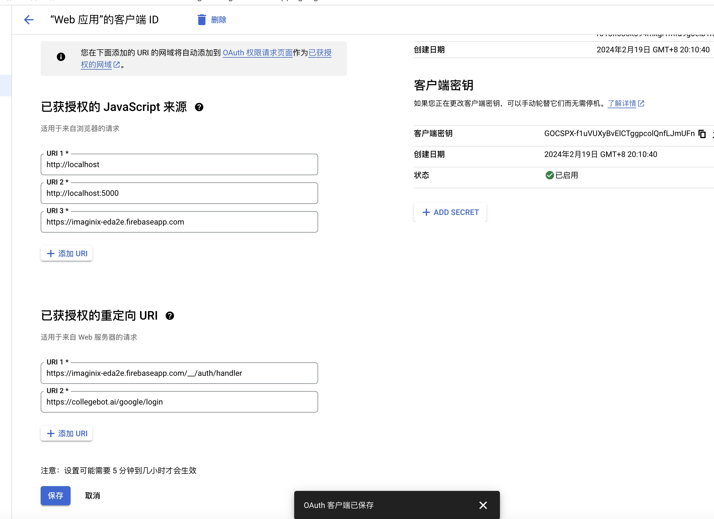

# Google 登录

[[toc]]
在实现 Google 登录时，后端必须提供必要的支持，用于与 Google OAuth 2.0 服务交互，完成授权码交换、用户信息获取以及后续 token 生成等操作。本文档详细描述了 Google 登录的整体流程，并给出了示例代码实现。

## 前置工作

1 设置 google key 安装 secret

1. **找到你的 GCP 项目**

   - 打开 [Google Cloud Console](https://console.cloud.google.com/) 并确保你选中了和 Firebase 同一个项目（通常和 Firebase 项目同名）。

2. **进入 APIs & Services -> Credentials**

   - 在左侧菜单中找到 “APIs & Services”，点击后再点击 “Credentials”（凭据）。
   - 在这里你会看到多个可能的 “OAuth 2.0 Client IDs”，需要找到和 Firebase 里对应的那个（一般 Firebase 会自动生成一个 “Web client (Auto-created for Firebase...）” 之类的名称）。



3. **编辑 OAuth 客户端 ID**
   - 选中对应的 OAuth Client ID，点击 “Edit OAuth Client”（编辑）。
   - 在 “Authorized redirect URIs” 处，**添加你前端代码实际使用的完整回调地址**。
     - 例如：`https://collegebot.ai/google/login`
     - 注意必须和你请求中的 `redirect_uri` 参数 **一字不差**（包括协议 `http/https`、域名、路径、端口、以及末尾斜杠等）。



## 登录流程

### 1. 是否需要后端支持？

**需要。**  
Google 登录流程不仅仅是前端跳转到 Google 授权页面，更需要后端参与以下操作：

- **授权码交换：** 前端在用户授权后会获得一个授权码（code），随后前端将该授权码发送给后端，由后端使用 `GOOGLE_CLIENT_ID` 和 `GOOGLE_CLIENT_SECRET` 与 Google 进行交互，交换出访问令牌（access token）以及用户信息。
- **用户信息处理：** 后端接收并解析从 Google 返回的用户信息，判断该用户是否已存在，如果不存在则创建新用户。
- **Token 签发：** 后端根据业务需求生成自己的 token 和 refresh token，用于后续认证和授权。

### 2. 前后端 Google 登录流程

整个登录流程主要包括以下步骤：

1. **前端发起登录请求：**  
   前端点击 Google 登录按钮后，将用户重定向至 Google 授权页面（传入必要的 `client_id`、`redirect_uri`、`scope`、`response_type` 等参数）。

```
https://accounts.google.com/o/oauth2/auth?response_type=code&client_id=125062456843-b0o5sp6cm0fff067lanph5i9uf1lih3l.apps.googleusercontent.com&redirect_uri=https%3A%2F%2Frumi-bdb43.firebaseapp.com%2F__%2Fauth%2Fhandler&state=AMbdmDkEVT5Bj0C_nXTrrL6_zmOE51bvsT_qPzj8WqXDx-XrP5yOsL4gWlO8VgWXeNws6jAhzoFjR0-eQgv4BaWcfN6HSTZoIlT_EZMvuUr-V4I_suq4_jV0RkmNg_eyYR28iaOXsJGrIoFcsN8c6DNiod8sKYVGigkU4tKaom08G1SeGJsTTHTWq0baflzsv0fxTskx8C3c8oxGEegdR_PSeOoRctXHZnf1wf6w3snuTv4lv0hyhqAR4QG1X9qa_BYdsDzvRkNqd5_9hwgEClewJN_m6Y0jEu5mjjcgedCfJNKhgfztV75V2zMamkynguqL3_U&scope=openid%20https%3A%2F%2Fwww.googleapis.com%2Fauth%2Fuserinfo.email%20profile
```

or

```
https://accounts.google.com/o/oauth2/auth?response_type=code&client_id=125062456843-b0o5sp6cm0fff067lanph5i9uf1lih3l.apps.googleusercontent.com&redirect_uri=https%3A%2F%2Fcollegebot.ai%2Fgoogle%2Flogin&state=AMbdmDkEVT5Bj0C_nXTrrL6_zmOE51bvsT_qPzj8WqXDx-XrP5yOsL4gWlO8VgWXeNws6jAhzoFjR0-eQgv4BaWcfN6HSTZoIlT_EZMvuUr-V4I_suq4_jV0RkmNg_eyYR28iaOXsJGrIoFcsN8c6DNiod8sKYVGigkU4tKaom08G1SeGJsTTHTWq0baflzsv0fxTskx8C3c8oxGEegdR_PSeOoRctXHZnf1wf6w3snuTv4lv0hyhqAR4QG1X9qa_BYdsDzvRkNqd5_9hwgEClewJN_m6Y0jEu5mjjcgedCfJNKhgfztV75V2zMamkynguqL3_U&scope=openid%20https%3A%2F%2Fwww.googleapis.com%2Fauth%2Fuserinfo.email%20profile
```

**参数说明：**

- **response_type=code**：表示授权后返回授权码。
- **client_id**：在 Google 开发者控制台获得的 Client ID。
- **redirect_uri**：用户授权后，Google 将重定向回的地址，此地址必须在 Google 控制台中预先配置。证书环境前端需要配置一个路由获取获取 google 的返回信息
- **state**：可选参数，用于防止 CSRF 攻击。前后端传递同一参数值，在授权后应返回该值。
- **scope**：授权请求的权限范围，此示例请求了 `openid`、`email`、`profile` 权限。多个权限之间使用 URL 编码的空格（%20）分隔。
- **context_ur**：可选参数，指定 context 地址。

2. **用户授权：**  
   用户在 Google 授权页面上同意授权后，Google 会重定向回预设的 `redirect_uri`，并在 URL 中附带授权码（code）。在 OAuth2.0 授权流程中，**code** 是一个临时的一次性授权码。当用户在 Google 授权页面上同意授权后，Google 会将这个授权码附加在重定向回应用预设的 `redirect_uri` 的 URL 中。开发者应用随后可以使用这个授权码去请求访问令牌（access token），以便获得用户数据访问的权限。这种机制确保了整个授权流程的安全性，因为授权码通常有较短的有效期且只能使用一次。在下面的地址中 code 是 4/0AQSTgQF78Xv7b8iw5VR5-9S4BHQy5O4BOJrhoocTYMRjVVOWUMj2ic6KiGTpKbo53gJblA

```
https://collegebot.ai/google/login?state=AMbdmDkEVT5Bj0C_nXTrrL6_zmOE51bvsT_qPzj8WqXDx-XrP5yOsL4gWlO8VgWXeNws6jAhzoFjR0-eQgv4BaWcfN6HSTZoIlT_EZMvuUr-V4I_suq4_jV0RkmNg_eyYR28iaOXsJGrIoFcsN8c6DNiod8sKYVGigkU4tKaom08G1SeGJsTTHTWq0baflzsv0fxTskx8C3c8oxGEegdR_PSeOoRctXHZnf1wf6w3snuTv4lv0hyhqAR4QG1X9qa_BYdsDzvRkNqd5_9hwgEClewJN_m6Y0jEu5mjjcgedCfJNKhgfztV75V2zMamkynguqL3_U&code=4%2F0AQSTgQF2VH6M7n9X3wCwLN59tQquq1Ml_tDkHCJYCx6YJIvtXV0CcEvaxgTZx6vLkHgH2g&scope=email+profile+openid+https%3A%2F%2Fwww.googleapis.com%2Fauth%2Fuserinfo.email+https%3A%2F%2Fwww.googleapis.com%2Fauth%2Fuserinfo.profile&authuser=0&prompt=none
```

- **state**：  
  这是一个由客户端生成的随机字符串，用来在 OAuth 授权流程中维护状态和防止 CSRF（跨站请求伪造）攻击。授权服务器在回调时会原样返回这个参数，客户端可以验证以确保请求没有被篡改。

- **code**：  
  这是 Google 授权后返回的授权码。客户端后续会用这个授权码向 Google 的 token 接口请求临时的访问令牌（access token），从而换取用户的相关信息。注意，这个授权码通常只能使用一次且有较短的有效期。

- **scope**：  
  列出了客户端请求访问用户数据时需要的权限范围。在这个例子中，包括了：

  - `email`：请求访问用户的电子邮件地址。
  - `profile`：请求访问用户的公开个人资料。
  - `openid`：请求 OpenID Connect 标准认证。
  - `https://www.googleapis.com/auth/userinfo.email` 与 `https://www.googleapis.com/auth/userinfo.profile`：也是用来获取用户邮箱和个人信息的 API 访问权限。  
    这些范围共同决定了应用可以访问的用户信息种类。

- **authuser**：  
  该参数通常用来指定用户在其 Google 账户中选择使用哪一个账号，尤其在用户同时登录多个 Google 账户时。值为 `0` 表示默认使用第一个账户。

- **prompt**：  
  这个参数用于控制用户在授权页面上是否需要看到同意提示。值为 `none` 表示如果用户已经登录且之前已授权，则不再弹出授权同意界面，直接返回授权码。

3. **授权码交换：**  
   前端将获取到的授权码和 redirect_uri 传递给后端，后端使用配置的 `GOOGLE_CLIENT_ID` 和 `GOOGLE_CLIENT_SECRET` 向 Google 服务器发起请求，交换出访问令牌（access token）以及用户信息。

获取 临时 访问令牌需要传递 redirect_uri 吗?
是的。在 OAuth2.0 授权流程中，当你用授权码交换临时访问令牌时，通常需要传递与最初请求时相同的 `redirect_uri`。这个参数用于验证请求的一致性，确保授权码和 token 请求都来源于同一个客户端应用程序。Google 的 OAuth2.0 规范也要求在 token 请求中包含该参数，以保证安全性。

4. **后端处理用户信息：**  
   后端根据 Google 返回的用户信息（如 email、用户 ID 等）判断该用户是否已存在：

   - 如果用户已存在，直接生成并返回认证 token。
   - 如果用户不存在，创建新的 Google 用户记录，再生成 token 返回给前端。

5. **返回认证结果：**  
   后端将生成的 token、refresh token（如有）以及用户标识返回给前端。

6. **首页：**
   前端跳转到首页,后续前端请求需要携带 token 来进行身份验证。

## 3. 配置文件

在配置文件中，需要提供 Google 的 Client ID 和 Client Secret，如下所示：

```properties
GOOGLE_CLIENT_ID=xx
GOOGLE_CLIENT_SECRET=xxx
```

请确保在生产环境中妥善保管这些敏感信息。

## 4. 代码实现

下面给出一个基于 Java 的简单示例代码，实现 Google 登录的后端支持。示例中包含两个主要部分：处理 Google 登录回调的 Handler，以及与 Google 进行交互的 Service 层代码。

### 4.1 路由配置

将 Google 登录的回调地址映射到相应的处理方法，例如：

```java
r.add("/api/v1/google/login", appUserGoogleHandler::login);
```

### 4.2 处理逻辑：Google 登录 Handler

```java
package com.litongjava.tio.boot.admin.handler;

import com.litongjava.jfinal.aop.Aop;
import com.litongjava.model.body.RespBodyVo;
import com.litongjava.tio.boot.admin.services.AppUserGoogleService;
import com.litongjava.tio.boot.http.TioRequestContext;
import com.litongjava.tio.http.common.HttpRequest;
import com.litongjava.tio.http.common.HttpResponse;

public class AppUserGoogleHandler {
  /**
   * 处理 Google 登录回调
   * 前端将获取的授权码通过 query 参数传递过来
   */
  public HttpResponse login(HttpRequest request) {
    // 获取授权码参数
    String code = request.getParameter("code");
    HttpResponse response = TioRequestContext.getResponse();

    // 获取 Google 登录服务实例
    AppUserGoogleService googleService = Aop.get(AppUserGoogleService.class);
    // 使用授权码处理登录流程
    RespBodyVo vo = googleService.loginWithGoogle(code);
    return response.setJson(vo);
  }
}
```

### 4.3 服务层实现：Google 登录 Service

```java
package com.litongjava.tio.boot.admin.services;

import com.jfinal.kit.Kv;
import com.litongjava.db.activerecord.Db;
import com.litongjava.model.body.RespBodyVo;
import com.litongjava.tio.boot.admin.vo.AppUser;
import com.litongjava.tio.utils.environment.EnvUtils;
import com.litongjava.tio.utils.jwt.JwtUtils;
import com.litongjava.tio.utils.snowflake.SnowflakeIdUtils;
import com.litongjava.tio.utils.http.HttpClientUtils; // 假设存在的 HTTP 客户端工具类

public class AppUserGoogleService {

  /**
   * 使用 Google 授权码进行登录
   */
  public RespBodyVo loginWithGoogle(String code) {
    // 从配置中读取 Google 的 Client ID 和 Client Secret
    String clientId = EnvUtils.get("GOOGLE_CLIENT_ID");
    String clientSecret = EnvUtils.get("GOOGLE_CLIENT_SECRET");

    // 构建请求 URL（Google 的 token 交换接口）
    String tokenUrl = "https://oauth2.googleapis.com/token";

    // 构建请求参数
    // 注意：具体参数请参考 Google OAuth 2.0 文档，示例中仅为参考
    Kv params = Kv.by("code", code)
                  .set("client_id", clientId)
                  .set("client_secret", clientSecret)
                  .set("redirect_uri", "https://yourdomain.com/api/v1/google/login")
                  .set("grant_type", "authorization_code");

    // 发起 HTTP 请求交换 token（示例代码，不同项目可能使用不同的 HTTP 工具）
    String tokenResponse = HttpClientUtils.post(tokenUrl, params);

    // 根据 tokenResponse 解析出 access token 与用户信息（需要根据实际返回格式解析）
    // 此处假设已经解析得到 Google 用户的唯一标识 googleId
    String googleId = parseGoogleId(tokenResponse);

    // 检查数据库中是否存在该用户
    AppUser appUser = Db.findById(AppUser.class, googleId);
    if (appUser == null) {
      // 用户不存在则创建新的 Google 用户
      long longId = SnowflakeIdUtils.id();
      String userId = longId + "";
      String insertSql = "INSERT INTO app_users (id,google_id) VALUES (?,?)";
      Db.updateBySql(insertSql, userId, googleId);
      appUser = new AppUser();
      appUser.setId(userId);
      appUser.setGoogleId(googleId);
    }

    // 生成系统内部 token，有效期 7 天（604800秒）
    Long timeout = EnvUtils.getLong("app.token.timeout", 604800L);
    Long tokenTimeout = System.currentTimeMillis() / 1000 + timeout;
    String token = JwtUtils.createToken(appUser.getId(), tokenTimeout);
    String refreshToken = JwtUtils.createRefreshToken(appUser.getId());

    Kv kv = Kv.by("user_id", appUser.getId())
               .set("token", token)
               .set("expires_in", tokenTimeout.intValue())
               .set("refresh_token", refreshToken);
    return RespBodyVo.ok(kv);
  }

  /**
   * 根据 tokenResponse 解析出 Google 用户唯一标识（示例实现）
   */
  private String parseGoogleId(String tokenResponse) {
    // 此处应解析 JSON，提取 Google 用户的唯一标识
    // 示例中直接返回模拟数据
    return "google_unique_id";
  }
}
```

**说明：**

- **配置读取：**  
  通过 `EnvUtils.get()` 获取配置文件中的 `GOOGLE_CLIENT_ID` 与 `GOOGLE_CLIENT_SECRET`。这确保了敏感信息不会硬编码在代码中。

- **授权码交换：**  
  使用 HTTP 客户端工具向 Google 的 token 接口发起请求。请求参数包括授权码、Client ID、Client Secret、redirect_uri 和 grant_type。实际实现中请参照 Google 的 [OAuth 2.0 文档](https://developers.google.com/identity/protocols/oauth2)进行完善。

- **用户信息处理：**  
  根据 Google 返回的数据解析出用户唯一标识（示例代码中通过 `parseGoogleId` 方法返回模拟数据），并检查该用户是否已存在；如果不存在则创建新的用户记录。

- **Token 签发：**  
  使用自定义的 `JwtUtils` 类生成系统内部 token 和 refresh token，并设置有效期。

## 5. 注意事项

- **安全性**

  - 请确保 HTTPS 通信，防止授权码和 token 在传输过程中被截获。
  - 对接 Google OAuth 时，务必校验返回的数据签名及 token 有效性。

- **错误处理**  
  示例代码省略了错误处理逻辑，实际生产环境中需要针对 HTTP 请求失败、授权码无效、用户信息解析失败等情况进行详细处理并返回适当的错误信息。

- **扩展性**  
  如果需要支持其他第三方登录（如 Facebook、GitHub 等），可以参考此实现方式进行扩展。

## 6. 总结

本文档详细描述了 Google 登录的整体流程、关键节点和后端支持逻辑。通过配置正确的 Client ID 与 Client Secret，前后端联动完成授权码交换与用户信息处理，系统能够实现 Google 登录并生成系统内部的认证 token，确保用户安全且便捷地登录系统。

---

以上即为 Google 登录的完整文档及代码实现示例，所有代码部分均保持原样未做修改。
