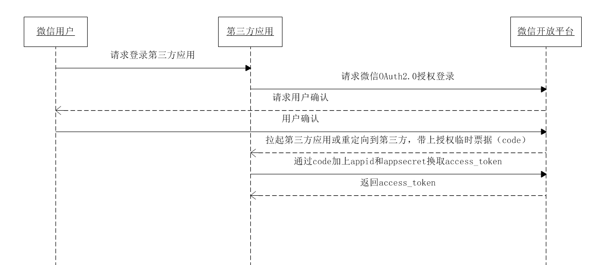

# 移动端微信登录

## 登录流程

现在 APP 这边调起 wechat 授权后 会得到一个 字符串 code APP 把这个字符串 code 通过接口传给后台服务器 后台服务器 通过逻辑代码 传参 微信开发者的 appid secret 和这个 code 请求固定地址 得到 access_token 和 openid 在请求固定地址 得到 授权登录微信的 用户信息


## 申请 appId and appSecret

## 将配置信息存入到数据库

将微信相关的配置信息存储在数据库表 `tio_boot_admin_system_constants_config` 中，`key` 为 `systemWechatOpenConfig`，配置示例如下：

```json
{
  "appId": "wx7xxxx",
  "appSecret": "55xxxx"
}
```

## 获取 code(微信授权码)

这部分由移动端完成,如果是服务端,可以采用下面的方式设置

### 1. 如何获取微信授权码 (`code`)？

微信授权码 (`code`) 是用户通过微信授权登录时由微信服务器颁发的临时凭证，通常通过以下流程获取：

1. **用户同意授权**：

   - 应用发起授权请求，微信客户端展示授权页面，用户选择是否同意授权。
   - 这一步通常通过微信提供的 OAuth 2.0 授权接口实现，常见的授权 URL 格式如下：
     ```
     https://open.weixin.qq.com/connect/oauth2/authorize?appid=APPID&redirect_uri=REDIRECT_URI&response_type=code&scope=SCOPE&state=STATE#wechat_redirect
     ```
   - 参数说明：
     - `appid`：应用的 AppID。
     - `redirect_uri`：授权完成后跳转的回调地址。
     - `response_type`：固定为 `code`。
     - `scope`：授权作用域，常见为 `snsapi_base`（静默授权）或 `snsapi_userinfo`（获取用户信息的授权）。
     - `state`：用于保持请求和回调的状态，防止 CSRF 攻击，微信会在回调时带上这个参数。

2. **用户确认授权后获取 `code`**：
   - 用户在微信中同意授权后，微信服务器会通过 `redirect_uri` 将 `code` 返回给应用，格式如下：
     ```
     https://your_redirect_uri?code=CODE&state=STATE
     ```
   - 应用通过解析回调 URL，可以获取到 `code` 参数。

### 2. 同一个用户对一个应用 `code` 是唯一的吗？

`code` 并不是唯一的，每次微信授权时生成的新 `code` 都是一次性且临时的，无法重复使用。同一个用户在同一个应用中进行多次授权登录，每次都会生成不同的 `code`。

因此，`code` 的特点如下：

- **一次性使用**：每个 `code` 只能使用一次，用于获取 `access_token`。
- **临时性**：`code` 有有效期，一旦过期则不能再使用。
- **不唯一**：同一个用户每次授权都会产生不同的 `code`，不会保持一致。

### 3. `code` 有有效期吗？

是的，`code` 是有有效期的，通常只有 **5 分钟** 的有效时间。过了这个时间，如果还没有使用这个 `code` 来获取 `access_token`，这个 `code` 就会失效。你需要引导用户重新发起授权以获得新的 `code`。

在微信授权过程中，使用 `code` 交换 `access_token` 必须在 `code` 失效前完成，一旦使用后或者有效期过后，`code` 就无法再次使用。

```java

```

```SystemWechatOpenConfig
import java.io.Serializable;

import lombok.AllArgsConstructor;
import lombok.Data;
import lombok.NoArgsConstructor;

@Data
@AllArgsConstructor
@NoArgsConstructor
public class SystemWechatOpenConfig implements Serializable {
  private static final long serialVersionUID = -1737909437135595915L;
  private String appId;// 应用id
  private String appSecret;// 应用key
}
```

ref
https://developers.weixin.qq.com/doc/oplatform/Website_App/WeChat_Login/Wechat_Login.html
