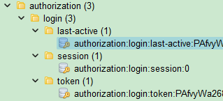

# `StpUtil.isLogin()` 源码解析

[[toc]]

在现代 Web 应用中，用户身份验证与会话管理是确保系统安全性和用户体验的重要组成部分。本文将深入解析 `StpUtil.isLogin()` 方法的源码，帮助开发者更好地理解其工作原理及实现细节。

## 方法概述

`StpUtil.isLogin()` 方法用于判断当前会话是否已经登录。该方法返回一个布尔值：如果已登录返回 `true`，否则返回 `false`。其实现过程涉及多个步骤，包括 token 解析、会话状态检查及活跃超时验证。

## 源码详解

### 1. `StpUtil.isLogin()` 方法

```java
public static boolean isLogin() {
    return stpLogic.isLogin();
}
```

`StpUtil.isLogin()` 是一个静态方法，主要作用是调用 `stpLogic` 对象的 `isLogin()` 方法，获取当前会话的登录状态。

### 2. `StpLogic.isLogin()` 方法

```java
public boolean isLogin() {
    // 判断条件：
    // 1、获取到的 loginId 不为 null，
    // 2、并且不在异常项集合里（此项在 getLoginIdDefaultNull() 方法里完成判断）
    return getLoginIdDefaultNull() != null;
}
```

`StpLogic.isLogin()` 方法通过调用 `getLoginIdDefaultNull()` 方法来获取当前会话的 `loginId`。如果 `loginId` 不为 `null`，则表示用户已登录；否则，用户未登录。

### 3. `getLoginIdDefaultNull()` 方法

```java
public Object getLoginIdDefaultNull() {

    // 1、先判断一下当前会话是否正在 [ 临时身份切换 ]，如果是则返回临时身份
    if(isSwitch()) {
        return getSwitchLoginId();
    }

    // 2、如果前端连 token 都没有提交，则直接返回 null
    String tokenValue = getTokenValue();
    if(tokenValue == null) {
        return null;
    }

    // 3、根据 token 找到对应的 loginId，如果 loginId 为 null 或者属于异常标记里面，均视为未登录，统一返回 null
    Object loginId = getLoginIdNotHandle(tokenValue);
    if(!isValidLoginId(loginId)) {
        return null;
    }

    // 4、如果 token 已被冻结，也返回 null
    if(getTokenActiveTimeoutByToken(tokenValue) == SaTokenDao.NOT_VALUE_EXPIRE) {
        return null;
    }

    // 5、执行到此，证明此 loginId 已经是个正常合法的账号id了，可以返回
    return loginId;
}
```

`getLoginIdDefaultNull()` 方法负责获取当前会话的 `loginId`，并进行一系列验证：

1. **临时身份切换检查**：如果当前会话正在进行临时身份切换（例如，管理员代替用户操作），则返回临时身份的 `loginId`。
2. **Token 检查**：如果前端未提交 token，则返回 `null`，表示未登录。
3. **Token 解析与验证**：根据 token 获取对应的 `loginId`，若 `loginId` 为 `null` 或属于异常标记，则视为未登录。
4. **Token 冻结检查**：如果 token 已被冻结（即超时），则返回 `null`。
5. **合法登录验证**：如果通过以上所有检查，说明 `loginId` 合法且会话有效，返回该 `loginId`。

### 4. `getTokenValue(boolean noPrefixThrowException)` 方法

```java
public String getTokenValue(boolean noPrefixThrowException){

    // 1、获取前端提交的 token（包含前缀值）
    String tokenValue = getTokenValueNotCut();

    // 2、如果全局配置打开了前缀模式，则二次处理一下
    String tokenPrefix = getConfigOrGlobal().getTokenPrefix();
    if(SaFoxUtil.isNotEmpty(tokenPrefix)) {

        // 情况2.1：如果提交的 token 为空，则转为 null
        if(SaFoxUtil.isEmpty(tokenValue)) {
            tokenValue = null;
        }

        // 情况2.2：如果 token 有值，但是并不是以指定的前缀开头
        else if(!tokenValue.startsWith(tokenPrefix + SaTokenConsts.TOKEN_CONNECTOR_CHAT)) {
            if(noPrefixThrowException) {
                throw NotLoginException.newInstance(loginType, NO_PREFIX, NO_PREFIX_MESSAGE + "，prefix=" + tokenPrefix, null).setCode(SaErrorCode.CODE_11017);
            } else {
                tokenValue = null;
            }
        }

        // 情况2.3：代码至此，说明 token 有值，且是以指定的前缀开头的，现在裁剪掉前缀
        else {
            tokenValue = tokenValue.substring(tokenPrefix.length() + SaTokenConsts.TOKEN_CONNECTOR_CHAT.length());
        }
    }

    // 3、返回
    return tokenValue;
}
```

`getTokenValue(boolean noPrefixThrowException)` 方法用于获取当前请求的 token 值，并根据配置处理 token 前缀：

1. **获取原始 Token**：从前端请求中获取包含前缀的 token。
2. **前缀处理**：
   - **无 Token 情况**：若 token 为空，返回 `null`。
   - **无效前缀**：若 token 不以指定前缀开头，根据参数决定是否抛出异常或将 token 置为 `null`。
   - **有效前缀**：若 token 以指定前缀开头，裁剪掉前缀部分，获取实际的 token 值。
3. **返回处理后的 Token**。

### 5. `getLoginIdNotHandle(String tokenValue)` 方法

```java
public String getLoginIdNotHandle(String tokenValue) {
    return getSaTokenDao().get(splicingKeyTokenValue(tokenValue));
}
```

该方法通过拼接 token 值生成对应的键，并从数据存储（如 Redis）中获取关联的 `loginId`。

### 6. `splicingKeyTokenValue(String tokenValue)` 方法

```java
public String splicingKeyTokenValue(String tokenValue) {
    return getConfigOrGlobal().getTokenName() + ":" + loginType + ":token:" + tokenValue;
}
```

此方法负责拼接 token 的键名，通常格式为 `tokenName:loginType:token:tokenValue`，用于在数据存储中查找对应的 `loginId`。

### 7. `getTokenActiveTimeoutByToken(String tokenValue)` 方法

```java
public long getTokenActiveTimeoutByToken(String tokenValue) {

    // 如果全局配置了永不冻结，则返回 -1
    if(!isOpenCheckActiveTimeout()) {
        return SaTokenDao.NEVER_EXPIRE;
    }

    // 如果提供的 token 为 null，则返回 -2
    if(SaFoxUtil.isEmpty(tokenValue)) {
        return SaTokenDao.NOT_VALUE_EXPIRE;
    }

    // ------ 开始查询

    // 1、获取 token 的最后活跃时间，13 位时间戳
    String key = splicingKeyLastActiveTime(tokenValue);
    String lastActiveTimeString = getSaTokenDao().get(key);

    // 2、如果查不到，返回 -2
    if(lastActiveTimeString == null) {
        return SaTokenDao.NOT_VALUE_EXPIRE;
    }

    // 3、计算最后活跃时间与当前时间的差值（单位：秒）
    SaValue2Box box = new SaValue2Box(lastActiveTimeString);
    long lastActiveTime = box.getValue1AsLong();
    long timeDiff = (System.currentTimeMillis() - lastActiveTime) / 1000;
    long allowTimeDiff = getTokenUseActiveTimeoutOrGlobalConfig(tokenValue);
    if(allowTimeDiff == SaTokenDao.NEVER_EXPIRE) {
        // 允许的时间差为 -1，代表永不冻结，直接返回 -1
        return SaTokenDao.NEVER_EXPIRE;
    }

    // 4、判断实际时间差是否超过允许的时间差
    long activeTimeout = allowTimeDiff - timeDiff;
    if(activeTimeout < 0) {
        return SaTokenDao.NOT_VALUE_EXPIRE;
    } else {
        return activeTimeout;
    }
}
```

`getTokenActiveTimeoutByToken(String tokenValue)` 方法用于获取指定 token 的剩余活跃有效期（以秒为单位）：

#### 1. 全局冻结配置检查

```java
if(!isOpenCheckActiveTimeout()) {
    return SaTokenDao.NEVER_EXPIRE;
}
```

- **逻辑说明**：
  - 如果系统全局配置了永不冻结（即不检查活跃超时），则直接返回 `SaTokenDao.NEVER_EXPIRE`（通常定义为 `-1`），表示 token 永远有效，不会因为活跃超时而失效。

#### 2. Token 存在性检查

```java
if(SaFoxUtil.isEmpty(tokenValue)) {
    return SaTokenDao.NOT_VALUE_EXPIRE;
}
```

- **逻辑说明**：
  - 如果提供的 `tokenValue` 为空，返回 `SaTokenDao.NOT_VALUE_EXPIRE`（通常定义为 `-2`），表示 token 未冻结或不存在。

#### 3. 最后活跃时间获取

```java
String key = splicingKeyLastActiveTime(tokenValue);
String lastActiveTimeString = getSaTokenDao().get(key);

if(lastActiveTimeString == null) {
    return SaTokenDao.NOT_VALUE_EXPIRE;
}
```

- **逻辑说明**：
  - 拼接获取 token 的最后活跃时间的键名。
  - 从数据存储中获取 token 的最后活跃时间字符串。
  - 如果获取不到（即 `lastActiveTimeString` 为 `null`），则返回 `SaTokenDao.NOT_VALUE_EXPIRE`，表示 token 未冻结或不存在。

#### 4. 时间差计算与验证

```java
SaValue2Box box = new SaValue2Box(lastActiveTimeString);
long lastActiveTime = box.getValue1AsLong();
long timeDiff = (System.currentTimeMillis() - lastActiveTime) / 1000;
long allowTimeDiff = getTokenUseActiveTimeoutOrGlobalConfig(tokenValue);
if(allowTimeDiff == SaTokenDao.NEVER_EXPIRE) {
    // 允许的时间差为 -1，代表永不冻结，直接返回 -1
    return SaTokenDao.NEVER_EXPIRE;
}

long activeTimeout = allowTimeDiff - timeDiff;
if(activeTimeout < 0) {
    return SaTokenDao.NOT_VALUE_EXPIRE;
} else {
    return activeTimeout;
}
```

- **逻辑说明**：

  1. **解析最后活跃时间**：
     - 将 `lastActiveTimeString` 转换为 `long` 类型的 `lastActiveTime`（毫秒级时间戳）。
  2. **计算时间差**：
     - 计算当前时间与最后活跃时间的差值 `timeDiff`（单位：秒）。
  3. **获取允许的时间差**：
     - 调用 `getTokenUseActiveTimeoutOrGlobalConfig(tokenValue)` 方法，获取允许的最大时间差 `allowTimeDiff`（单位：秒）。
  4. **检查是否设置为永不冻结**：

     ```java
     if(allowTimeDiff == SaTokenDao.NEVER_EXPIRE) {
         // 允许的时间差为 -1，代表永不冻结，直接返回 -1
         return SaTokenDao.NEVER_EXPIRE;
     }
     ```

     - **详细解释**：
       - 如果 `allowTimeDiff` 等于 `SaTokenDao.NEVER_EXPIRE`（即 `-1`），表示当前 token 被配置为永不冻结。
       - 在这种情况下，无需进一步计算活跃时间差，方法直接返回 `SaTokenDao.NEVER_EXPIRE`，确保 token 永远有效。

  5. **判断实际时间差是否超过允许的时间差**：
     - 计算剩余有效时间 `activeTimeout` = `allowTimeDiff` - `timeDiff`。
     - 如果 `activeTimeout` 小于 `0`，表示实际时间差已超过允许的时间差，返回 `SaTokenDao.NOT_VALUE_EXPIRE`，表示 token 已被冻结。
     - 否则，返回剩余有效时间 `activeTimeout`。

### 8. 辅助方法

#### `getTokenUseActiveTimeoutOrGlobalConfig(String tokenValue)`

```java
public long getTokenUseActiveTimeoutOrGlobalConfig(String tokenValue) {
    Long activeTimeout = getTokenUseActiveTimeout(tokenValue);
    if(activeTimeout == null) {
        return getConfigOrGlobal().getActiveTimeout();
    }
    return activeTimeout;
}
```

该方法获取指定 token 的 `activeTimeout` 值，如果不存在，则返回全局配置的 `activeTimeout`。

#### `getTokenUseActiveTimeout(String tokenValue)`

```java
public Long getTokenUseActiveTimeout(String tokenValue) {
    // 在未启用动态 activeTimeout 功能时，直接返回 null
    if(!getConfigOrGlobal().getDynamicActiveTimeout()) {
        return null;
    }

    // 先取出这个 token 的最后活跃时间值
    String key = splicingKeyLastActiveTime(tokenValue);
    String value = getSaTokenDao().get(key);

    // 解析，无值的情况下返回 null
    SaValue2Box box = new SaValue2Box(value);
    return box.getValue2AsLong(null);
}
```

此方法用于获取指定 token 在缓存中的 `activeTimeout` 值，支持动态配置。如果未启用动态 `activeTimeout` 功能，则返回 `null`。

## 代码片段详解

### 关键代码片段

```java
long allowTimeDiff = getTokenUseActiveTimeoutOrGlobalConfig(tokenValue);
if (allowTimeDiff == SaTokenDao.NEVER_EXPIRE) {
    // 允许的时间差为 -1，代表永不冻结，直接返回 -1
    return SaTokenDao.NEVER_EXPIRE;
}
```

### 详细解释

#### 1. 获取允许的时间差

```java
long allowTimeDiff = getTokenUseActiveTimeoutOrGlobalConfig(tokenValue);
```

- **方法调用**：

  - `getTokenUseActiveTimeoutOrGlobalConfig(tokenValue)` 方法用于获取指定 token 的 `activeTimeout` 值。
  - 如果该 token 没有单独配置 `activeTimeout`，则返回全局配置的 `activeTimeout` 值。

- **返回值**：
  - 返回值 `allowTimeDiff` 表示允许的最大时间差（即 token 最后活跃时间与当前时间之间允许的最大秒数差值）。
  - 该值可以是动态配置的，也可以是全局默认配置。

#### 2. 检查是否设置为永不冻结

```java
if (allowTimeDiff == SaTokenDao.NEVER_EXPIRE) {
    // 允许的时间差为 -1，代表永不冻结，直接返回 -1
    return SaTokenDao.NEVER_EXPIRE;
}
```

- **常量解释**：

  - `SaTokenDao.NEVER_EXPIRE` 通常被定义为 `-1`，表示 token 永不冻结，即 token 永远有效，不会因为活跃超时而失效。

- **逻辑说明**：
  - 如果 `allowTimeDiff` 等于 `SaTokenDao.NEVER_EXPIRE`（即 `-1`），意味着当前 token 被配置为永不冻结。
  - 在这种情况下，无需进一步计算活跃时间差，因为 token 永远有效。因此，方法直接返回 `SaTokenDao.NEVER_EXPIRE`，表示 token 处于永不冻结状态。

### 上下文中的作用

在整个 `getTokenActiveTimeoutByToken` 方法中，这段代码的作用是优化和简化逻辑：

1. **优化性能**：

   - 如果 token 被配置为永不冻结，那么无需进行后续的时间差计算和活跃状态检查，直接返回 `-1` 提高了执行效率。

2. **逻辑清晰**：
   - 通过提前检查是否为永不冻结的配置，可以明确 token 的状态，避免不必要的后续处理，使代码逻辑更加清晰和易于维护。

### 示例场景

假设系统中有两类 token：

1. **普通用户 token**：

   - 允许的活跃超时为 3600 秒（1 小时）。
   - 如果用户在最后一次活跃后超过 1 小时未进行任何操作，token 将被冻结，用户需要重新登录。

2. **管理员 token**：
   - 配置为永不冻结，即 `activeTimeout` 为 `-1`。
   - 无论管理员多久不活动，token 永远有效，确保管理员的会话不会被意外终止。

在上述场景中，当 `getTokenActiveTimeoutByToken` 方法处理管理员 token 时，会发现 `allowTimeDiff` 为 `-1`，然后直接返回 `-1`，无需进一步检查，从而确保管理员的会话始终有效。

## Redis 存储


Redis 数据库中 `satoken` 中的 `authorization` 结构及其 key 说明如下：

1. **`authorization:login:last-active:xxxx`**:

   - **作用**：存储指定 token（`xxxx`）的最后活跃时间。该值用于在 `StpUtil.isLogin()` 方法中验证会话是否已过期。
   - **用途**：在活跃超时检查中，此 key 用于计算当前时间与最后活跃时间之间的差值，确保 token 在规定的超时时间内被认为是活跃的。

2. **`authorization:login:session:0`**:

   - **作用**：用于存储当前用户的会话数据。会话数据通常包括用户信息、权限数据或其他会话相关内容。
   - **用途**：在 `StpUtil.isLogin()` 方法中，会从此 key 读取会话数据以判断用户的登录状态和会话的合法性。

3. **`authorization:login:token:xxxx`**:
   - **作用**：映射指定 token 值到 `loginId` 的存储。该 key 的值表示哪个 `loginId` 与该 token 相关联。
   - **用途**：在 `getLoginIdNotHandle()` 方法中，会从此 key 中获取 `loginId` 来判断用户是否已登录。通过 token 和 `loginId` 的映射，系统可以校验当前 token 的合法性。

## 总结

`StpUtil.isLogin()` 方法通过一系列的验证步骤，确保当前会话的合法性和有效性。主要流程包括：

1. **临时身份检查**：确保在身份切换期间的会话状态正确。
2. **Token 解析与验证**：确保请求中包含有效的 token，并且符合预设的前缀格式。
3. **活跃超时检查**：根据 token 的最后活跃时间和配置的超时策略，判断 token 是否仍然有效。

其中，`getTokenActiveTimeoutByToken` 方法在活跃超时检查中扮演了关键角色，通过精确的时间差计算和配置检查，确保 token 的有效性。特别是对永不冻结 token 的快速识别和处理，提升了方法的执行效率和系统的灵活性。

通过这些步骤，`StpUtil.isLogin()` 能够准确判断用户的登录状态，为应用的安全性提供可靠保障。开发者在使用时，可以根据具体需求调整配置，如 token 前缀、活跃超时策略等，以满足不同场景下的安全和性能要求。

如果您在实际应用中有更多需求或疑问，欢迎继续探讨和交流！
