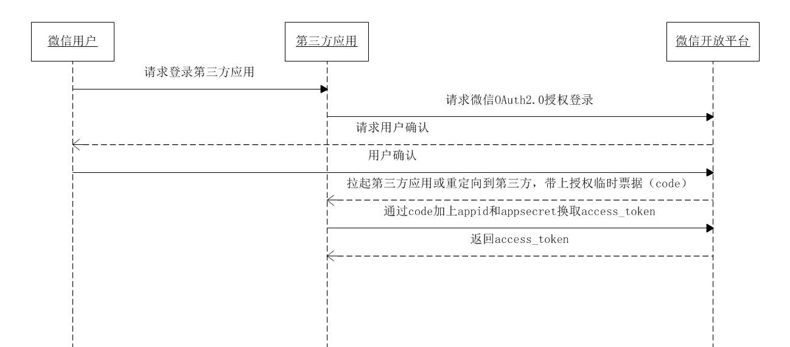

# 移动端微信登录实现指南

[[toc]]

## 登录流程概述

在移动端应用中，通过微信授权登录的流程如下：

1. **调起微信授权**：APP 调起微信客户端进行授权，用户同意后获取授权码 (`code`)。
2. **传递 `code` 给后台**：APP 将获取到的 `code` 通过接口传递给后台服务器。
3. **服务器交换 `code` 获取 `access_token` 和 `openid`**：后台服务器使用 `appid`、`secret` 和 `code` 向微信服务器请求，获取 `access_token` 和 `openid`。
4. **获取用户信息**：使用 `access_token` 和 `openid` 请求微信服务器，获取用户的详细信息。

下图展示了整个流程：



## 获取微信授权码 (`code`)

微信授权码 (`code`) 是用户通过微信授权登录时由微信服务器颁发的临时凭证。获取 `code` 的过程主要在移动端完成，但服务端也可以通过特定方式设置。

### 1. 获取微信授权码 (`code`) 的步骤

微信授权码 (`code`) 获取流程基于 OAuth 2.0 协议，具体步骤如下：

1. **用户同意授权**：

   - 应用发起授权请求，微信客户端展示授权页面，用户选择是否同意授权。
   - 通过微信提供的 OAuth 2.0 授权接口实现，典型的授权 URL 格式如下：

     ```
     https://open.weixin.qq.com/connect/oauth2/authorize?appid=APPID&redirect_uri=REDIRECT_URI&response_type=code&scope=SCOPE&state=STATE#wechat_redirect
     ```

   - **参数说明**：
     - `appid`：应用的 AppID（在微信开放平台申请）。
     - `redirect_uri`：授权完成后跳转的回调地址，需要进行 URL 编码。
     - `response_type`：固定为 `code`。
     - `scope`：授权作用域，常见值：
       - `snsapi_base`：静默授权，仅能获取用户的 `openid`。
       - `snsapi_userinfo`：弹出授权页面，可获取用户的详细信息。
     - `state`：自定义参数，用于保持请求和回调的状态，防止 CSRF 攻击，微信会在回调时带上这个参数。

2. **用户确认授权后获取 `code`**：

   - 用户在微信中同意授权后，微信服务器会通过 `redirect_uri` 将 `code` 返回给应用，格式如下：

     ```
     https://your_redirect_uri?code=CODE&state=STATE
     ```

   - 应用需要解析回调 URL，提取 `code` 参数。

### 2. 同一用户对一个应用的 `code` 是否唯一

`code` 并非唯一，每次用户授权登录时，微信都会生成一个新的、一次性使用的 `code`。具体特点如下：

- **一次性使用**：每个 `code` 只能使用一次，用于交换 `access_token`，重复使用将导致错误。
- **临时性**：`code` 有效期，通常为 **5 分钟**，过期后无法使用。
- **不唯一**：同一用户多次授权，每次生成不同的 `code`，不会重复。

因此，每次授权登录都需要使用最新生成的 `code`。

### 3. `code` 的有效期

`code` 有效期为 **5 分钟**，在此期间需要完成以下操作：

- 使用 `code` 向微信服务器请求 `access_token` 和 `openid`。
- 请求成功后，立即使用 `access_token` 获取用户信息。

如果超过有效期，`code` 将失效，需引导用户重新发起授权获取新的 `code`。

---

## 获取 access-token

```
https://api.weixin.qq.com/sns/oauth2/access_token?appid=APPID&secret=SECRET&code=CODE&grant_type=authorization_code
```

在成功获取 `access_token` 和 `openid` 后，可以进一步请求微信服务器获取用户的详细信息。根据请求结果，可能会得到以下响应：

### 失败时的响应

```json
{
  "errcode": 40029,
  "errmsg": "invalid code, rid: 671f18cb-3abf86e0-5c326ea1"
}
```

### 成功时的响应

```json
{
  "access_token": "85_BsrNgNL7cdqDegDu2r2wInW9_YdvJYyFH5VQ42Z4l1BQeQhB3Y2aFcAWknfpAjULtpGYBuC9j38TazTIAl0jAA1Z7g-nmsLJpUNSnDsj8-U",
  "expires_in": 7200,
  "refresh_token": "85_AIZ4NaZON5TPRU2111fRfzBFmcZ7wy4gVe37ImA5mwM5o6-_7iTUVFe5Pa7M6KbC4gd2wkcVu5ALUYISBfYcL87A1IbLJ1Ahltb6pchfI0o",
  "openid": "os6Do6fUAqSIMUmJ0JANXFepwQ-k",
  "scope": "snsapi_userinfo",
  "unionid": "oPd1e5_J9QMYOEEjWcCokg8GU59s"
}
```

### `openid` 和 `unionid` 的区别

- **openid**：

  - 用户在某个微信公众账号或小程序下的唯一标识。
  - 不同的公众号或小程序，`openid` 是不同的。
  - 主要用于区分同一应用内的不同用户。

- **unionid**：
  - 用户在微信开放平台下的唯一标识。
  - 当多个微信应用（如多个公众号、小程序）绑定到同一开放平台账号时，同一用户在这些应用下的 `unionid` 是相同的。
  - 适用于跨应用的用户身份关联和数据整合。

**总结**：

- 使用 `openid` 可以区分同一应用内的不同用户。
- 使用 `unionid` 可以在多个绑定到同一开放平台的应用之间识别同一用户。

如果需要整合多个应用的用户数据，建议使用 `unionid` 进行关联。

## 获取用户信息

```
https://api.weixin.qq.com/sns/userinfo?access_token=ACCESS_TOKEN&openid=OPENID&lang=zh_CN
```

获取到的用户信息 见 类 com.litongjava.wechat.model.WechatUserInfo

## 整合微信登录

整合微信登录涉及多个步骤，包括申请微信开发者资质、配置后台服务、实现登录逻辑等。以下是详细步骤：

### 1. 申请 AppID 和 AppSecret

在微信开放平台注册并创建应用，获取 `AppID` 和 `AppSecret`：

1. 访问 [微信开放平台](https://open.weixin.qq.com/)。
2. 注册并登录账号。
3. 创建新的应用（如移动应用）。
4. 获取 `AppID` 和 `AppSecret`，用于后续接口调用。

### 2. 将配置信息存入数据库

将微信相关的配置信息存储在数据库中，以便后续调用。假设使用的数据库表为 `tio_boot_admin_system_constants_config`，配置示例如下：

```json
{
  "appId": "wx7xxxx",
  "appSecret": "55xxxx"
}
```

- **表结构说明**：
  - `key`：配置的标识，这里为 `systemWechatOpenConfig`。
  - `value`：存储微信的 `appId` 和 `appSecret`。

### 3. 添加依赖

在项目的 `pom.xml` 文件中添加 `tio-wechat` 依赖，该依赖为封装好的微信登录工具类：

```xml
<dependency>
  <groupId>com.litongjava</groupId>
  <artifactId>tio-wechat</artifactId>
  <version>1.0.0</version>
</dependency>
```

### 4. 添加配置类

创建配置类 `WechatConfig`，用于初始化微信客户端：

```java
package com.enoleap.maliang.app.config;

import com.enoleap.maliang.app.dao.SystemConfigDao;
import com.litongjava.annotation.AConfiguration;
import com.litongjava.annotation.Initialization;
import com.litongjava.jfinal.aop.Aop;
import com.litongjava.wechat.client.Wechat;
import com.litongjava.wechat.client.WechatClient;
import com.litongjava.wechat.model.WechatOpenConfig;

import lombok.extern.slf4j.Slf4j;

@AConfiguration
@Slf4j
public class WechatConfig {

  @Initialization(priority = 101)
  public void config() {
    // 从数据库获取微信配置信息
    WechatOpenConfig systemWechatOpenConfig = Aop.get(SystemConfigDao.class).getSystemWechatOpenConfig();
    log.info("添加微信客户端配置: {}", systemWechatOpenConfig);

    // 初始化微信客户端
    WechatClient wechatClient = new WechatClient("main", systemWechatOpenConfig);
    Wechat.addClient(wechatClient);
  }
}
```

- **类说明**：
  - 使用 `@AConfiguration` 注解标识为配置类。
  - 使用 `@Initialization` 注解定义初始化方法，优先级设置为 `101`。
  - 从数据库中获取微信配置，并初始化 `WechatClient`。

### 5. 实现 WechatLoginService

创建 `WechatLoginService` 类，处理微信登录逻辑：

```java
package com.enoleap.maliang.app.services.wechat;

import com.enoleap.maliang.app.dao.SysUserInfoDao;
import com.enoleap.maliang.app.services.AuthService;
import com.enoleap.maliang.app.services.EmqxService;
import com.jfinal.kit.Kv;
import com.litongjava.db.activerecord.Db;
import com.litongjava.jfinal.aop.Aop;
import com.litongjava.model.body.RespBodyVo;
import com.litongjava.wechat.client.Wechat;
import com.litongjava.wechat.client.WechatClient;
import com.litongjava.wechat.model.WechatAccessToken;
import com.litongjava.wechat.model.WechatUserInfo;

import cn.hutool.core.util.RandomUtil;
import lombok.extern.slf4j.Slf4j;

@Slf4j
public class WechatLoginService {

  /**
   * 通过微信授权码登录
   * @param code 微信授权码
   * @return 登录响应结果
   */
  public RespBodyVo login(String code) {
    WechatClient wechatClient = Wechat.use();

    // 使用 code 获取 access_token
    WechatAccessToken accessToken = wechatClient.getAccessToken(code);
    if (accessToken == null) {
      return RespBodyVo.fail("获取 access_token 失败");
    }

    if (accessToken.getErrcode() != null) {
      return RespBodyVo.fail(accessToken.getErrmsg());
    }

    String openid = accessToken.getOpenid();

    // 判断用户是否存在
    String sql = "SELECT id FROM sys_user_info WHERE wx_open_id=? AND deleted=0";
    Long userId = Db.queryLong(sql, openid);

    AuthService authService = Aop.get(AuthService.class);

    if (userId != null) {
      // 用户已存在，执行登录
      Kv loginResult = authService.doLogin(userId);
      return RespBodyVo.ok(loginResult);
    } else {
      // 用户不存在，自动注册新用户
      log.info("注册新用户: {}", openid);
      String access_token = accessToken.getAccess_token();

      // 获取用户详细信息
      WechatUserInfo wechatUserInfo = wechatClient.getUserInfo(access_token, openid);

      // 保存用户信息到数据库
      SysUserInfoDao sysUserInfoDao = Aop.get(SysUserInfoDao.class);
      userId = sysUserInfoDao.saveByWechatInfo(wechatUserInfo);

      // 同步信息到 Emqx
      String randomUsername = RandomUtil.randomString(32);
      String randomPassword = RandomUtil.randomString(32);
      EmqxService emqxService = Aop.get(EmqxService.class);
      try {
        emqxService.addAuthUser(userId.toString(), randomUsername, randomPassword);
      } catch (Exception e) {
        log.error("同步用户信息到 Emqx 失败", e);
      }

      if (userId == null) {
        return RespBodyVo.fail("用户注册失败，请稍后再试。");
      }

      // 执行登录
      Kv loginResult = authService.doLogin(userId);
      return RespBodyVo.ok(loginResult);
    }
  }
}
```

- **方法说明**：

  - **login(String code)**：通过微信授权码 `code` 完成登录流程。
    - 获取 `access_token` 和 `openid`。
    - 判断用户是否已存在，存在则直接登录。
    - 不存在则自动注册新用户，并同步信息到 Emqx。
    - 最终返回登录结果。

- **异常处理**：
  - 获取 `access_token` 失败时返回失败响应。
  - 用户注册或同步失败时返回相应错误信息。

### 6. 接口层实现

在接口层实现微信登录的 API，调用 `WechatLoginService` 进行处理：

```java
public RespBodyVo loginByWechat(String code) {
  if (StrUtil.isBlank(code)) {
    return RespBodyVo.fail("授权码 (code) 不能为空");
  }
  return Aop.get(WechatLoginService.class).login(code);
}
```

- **方法说明**：
  - **loginByWechat(String code)**：接收微信授权码 `code`，调用 `WechatLoginService` 处理登录。
  - 参数校验：确保 `code` 不为空。

---

## 接口文档

### 微信登录接口

- **接口地址**：

  ```
  http://127.0.0.1/auth/loginByWechat
  ```

- **请求方式**：GET 或 POST

- **请求参数**：

  | 参数名 | 类型   | 必须 | 描述                |
  | ------ | ------ | ---- | ------------------- |
  | code   | String | 是   | 微信授权码 (`code`) |

- **示例请求**：

  ```
  http://127.0.0.1/auth/loginByWechat?code=091Tatml2H8qoe4S5Qml2svP1E3TatmP
  ```

---

## 参考文档

- [微信开放平台 - 微信登录](https://developers.weixin.qq.com/doc/oplatform/Website_App/WeChat_Login/Wechat_Login.html)
- [微信 OAuth 2.0 授权](https://developers.weixin.qq.com/doc/offiaccount/OA_Web_Apps/Wechat_webpage_authorization.html)
- [tio-wechat GitHub 仓库](https://github.com/litongjava/tio-wechat)

---

## 结语

至此，微信登录的整合已完成。通过本指南，您可以在移动端应用中实现微信授权登录功能，包括获取授权码、交换令牌、获取用户信息以及用户登录和注册流程的实现。如在实际操作中遇到问题，建议参考微信官方文档或相关技术社区寻求帮助。

---

**注意事项**：

1. **安全性**：

   - 确保 `appSecret` 不被泄露。
   - 使用 HTTPS 保护通信安全。
   - 防范 CSRF 攻击，合理使用 `state` 参数。

2. **错误处理**：

   - 对微信服务器返回的错误码进行详细处理，提升用户体验。
   - 日志记录异常情况，便于问题排查。

3. **用户体验**：

   - 优化授权页面，引导用户顺利完成授权。
   - 处理授权失败或取消的情况，提供友好的提示信息。

4. **数据存储**：
   - 合理存储和管理用户信息，遵守相关隐私政策和法规。

通过以上步骤和注意事项，您可以高效、安全地在移动端应用中集成微信登录功能，提升用户的登录体验。
