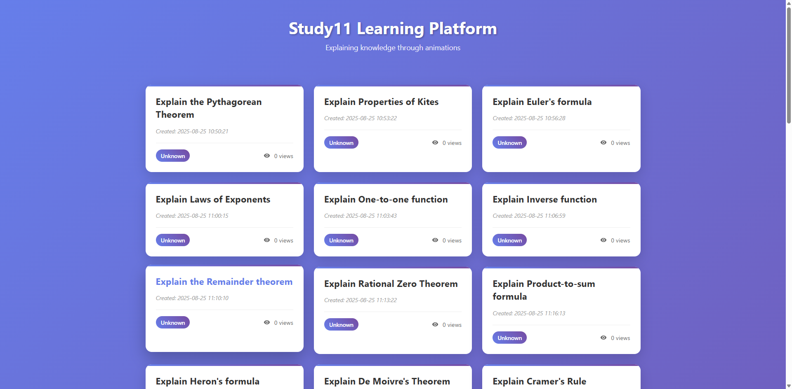

# Tio-Boot 整合 Java-DB 与 Enjoy 模板引擎示例

[[toc]]

本教程将详细介绍如何使用 **Tio-Boot** 框架，结合 **Java-DB（ActiveRecord）** 和 **Enjoy 模板引擎**，快速构建一个现代化的 Web 应用——“Study11 学习平台”。我们将从数据库设计、后端服务、模板渲染到前端展示，完整演示数据驱动页面的实现过程。

---

## 🎯 项目目标

创建一个名为 `Study11 Learning Platform` 的网站，用于展示数学/科学知识点动画教程。该平台具备以下功能：

- 数据库存储学习内容（主题、语言、浏览量等）
- 后端通过 Tio-Boot 处理请求
- 使用 Enjoy 模板引擎动态生成 HTML 页面
- 前端采用响应式设计，美观易用

最终效果如下图所示：



---

## 🧱 技术栈概览

| 组件 | 版本/说明 |
|------|---------|
| **Tio-Boot** | 高性能轻量级 Web 框架，基于 TIO 网络库 |
| **Java-DB** | Tio Boot 提供的 ORM 工具，简化数据库操作 |
| **Enjoy 模板引擎** | 支持中文表达式的高性能模板引擎 |
| **PostgreSQL / MySQL** | 示例使用 PostgreSQL 数据库 |

---

## 🔧 第一步：数据库设计

我们首先定义一张表来保存学习资源信息。

```sql
DROP TABLE IF EXISTS study11_html_code;

CREATE TABLE study11_html_code (
  id BIGINT PRIMARY KEY,
  topic VARCHAR(255) NOT NULL,
  "language" VARCHAR(50),
  view_count INT DEFAULT 0,
  "create_time" TIMESTAMP WITH TIME ZONE NOT NULL DEFAULT CURRENT_TIMESTAMP
);
```

> ✅ 注意：
> - `id` 为主键，建议使用自增或序列生成。
> - `"language"` 字段使用双引号以支持保留字。
> - `view_count` 记录浏览次数，初始为 0。
> - `create_time` 自动记录创建时间。

---

## 📁 第二步：项目结构

```
src/main/java/com/litongjava/study11/
├── config/
│   └── StudyEnjoyEngineConfig.java
├── handler/
│   └── IndexHandler.java
├── service/
│   └── IndexService.java
└── resources/enjoy-templates/
    └── index.html
```

---

## ⚙️ 第三步：配置 Enjoy 模板引擎

在 `StudyEnjoyEngineConfig.java` 中初始化模板引擎配置：

```java
package com.litongjava.study11.config;

import com.jfinal.template.Engine;
import com.litongjava.template.RowFieldGetter;

public class StudyEnjoyEngineConfig {

  private final String RESOURCE_BASE_PATH = "/enjoy-templates/";

  public void config() {
    Engine engine = Engine.use();
    engine.setBaseTemplatePath(RESOURCE_BASE_PATH);
    engine.setToClassPathSourceFactory(); // 使用类路径加载模板文件
    engine.setDevMode(true);              // 开发模式，支持热加载
    Engine.setFastMode(true);             // 启用极速模式，提升性能
    Engine.setChineseExpression(true);    // 支持中文变量名和表达式

    // 添加 Row 对象字段获取器，方便模板中访问 Row 数据
    Engine.addFieldGetterToFirst(new RowFieldGetter());
  }
}
```

> 💡 小贴士：
> - `setToClassPathSourceFactory()` 表示模板文件位于 `classpath:/enjoy-templates/`
> - `RowFieldGetter` 允许你在模板中直接访问 `item.topic` 而非 `item.get("topic")`

---

## 🔄 第四步：编写控制器（Handler）

`IndexHandler.java` 接收 HTTP 请求并返回渲染后的页面。

```java
package com.litongjava.study11.handler;

import com.litongjava.jfinal.aop.Aop;
import com.litongjava.study11.service.IndexService;
import com.litongjava.tio.boot.http.TioRequestContext;
import com.litongjava.tio.http.common.HttpRequest;
import com.litongjava.tio.http.common.HttpResponse;
import com.litongjava.tio.http.server.util.Resps;

public class IndexHandler {

  public HttpResponse index(HttpRequest request) {
    HttpResponse response = TioRequestContext.getResponse();
    IndexService indexService = Aop.get(IndexService.class);
    String html = indexService.index();
    Resps.html(response, html);
    return response;
  }
}
```

> ✅ 功能说明：
> - 使用 `Aop.get()` 获取 `IndexService` 实例
> - 调用 `index()` 方法获取 HTML 内容
> - 通过 `Resps.html()` 返回响应

---

## 🗃️ 第五步：数据查询与模板渲染

`IndexService.java` 负责从数据库读取数据，并调用模板引擎渲染。

```java
package com.litongjava.study11.service;

import java.util.List;

import com.jfinal.kit.Kv;
import com.litongjava.db.activerecord.Db;
import com.litongjava.db.activerecord.Row;
import com.litongjava.template.EnjoyTemplate;

public class IndexService {

  public String index() {
    List<Row> data = Db.find("SELECT id, topic, language, view_count, create_time " +
                             "FROM study11_html_code ORDER BY id");
    
    Kv kv = Kv.by("data", data);
    return EnjoyTemplate.renderToString("index.html", kv);
  }
}
```

> 🔍 解析：
> - 使用 `Db.find()` 查询所有记录
> - 将结果封装进 `Kv` 对象传给模板
> - 调用 `EnjoyTemplate.renderToString()` 渲染 HTML

---

## 🖼️ 第六步：HTML 模板设计

创建 `src/main/resources/enjoy-templates/index.html` 文件：

```html
<!DOCTYPE html>
<html lang="en">
<head>
  <meta charset="UTF-8">
  <meta name="viewport" content="width=device-width, initial-scale=1.0">
  <title>Study11 Learning Platform</title>
  <style>
    * {
      margin: 0;
      padding: 0;
      box-sizing: border-box;
    }

    body {
      font-family: 'Segoe UI', Tahoma, Geneva, Verdana, sans-serif;
      background: linear-gradient(135deg, #667eea 0%, #764ba2 100%);
      min-height: 100vh;
      padding: 20px;
    }

    .container {
      max-width: 1200px;
      margin: 0 auto;
    }

    .header {
      text-align: center;
      margin-bottom: 40px;
      padding: 20px;
    }

    .header h1 {
      color: white;
      font-size: 2.5rem;
      margin-bottom: 10px;
      text-shadow: 2px 2px 4px rgba(0,0,0,0.3);
    }

    .header p {
      color: rgba(255,255,255,0.9);
      font-size: 1.1rem;
      max-width: 600px;
      margin: 0 auto;
    }

    .content-grid {
      display: grid;
      grid-template-columns: repeat(auto-fit, minmax(350px, 1fr));
      gap: 25px;
      padding: 20px 0;
    }

    .card {
      background: white;
      border-radius: 15px;
      padding: 25px;
      box-shadow: 0 10px 30px rgba(0,0,0,0.15);
      transition: all 0.3s ease;
      cursor: pointer;
      position: relative;
      overflow: hidden;
    }

    .card:hover {
      transform: translateY(-5px);
      box-shadow: 0 15px 40px rgba(0,0,0,0.25);
    }

    .card::before {
      content: '';
      position: absolute;
      top: 0;
      left: 0;
      right: 0;
      height: 4px;
      background: linear-gradient(90deg, #667eea, #764ba2);
    }

    .card-title {
      font-size: 1.4rem;
      color: #333;
      margin-bottom: 15px;
      line-height: 1.4;
      transition: color 0.3s ease;
    }

    .card:hover .card-title {
      color: #667eea;
    }

    .card-meta {
      display: flex;
      justify-content: space-between;
      align-items: center;
      margin-top: 20px;
      padding-top: 15px;
      border-top: 1px solid #eee;
    }

    .card-language {
      background: linear-gradient(45deg, #667eea, #764ba2);
      color: white;
      padding: 6px 12px;
      border-radius: 20px;
      font-size: 0.85rem;
      font-weight: 500;
    }

    .card-views {
      color: #666;
      font-size: 0.9rem;
      display: flex;
      align-items: center;
      gap: 5px;
    }

    .card-time {
      color: #999;
      font-size: 0.85rem;
      margin-top: 8px;
      font-style: italic;
    }

    .empty-state {
      text-align: center;
      color: white;
      padding: 60px 20px;
      grid-column: 1 / -1;
    }

    .empty-state h2 {
      font-size: 1.5rem;
      margin-bottom: 10px;
    }

    @media (max-width: 768px) {
      .content-grid {
        grid-template-columns: 1fr;
        gap: 20px;
      }
      
      .header h1 {
        font-size: 2rem;
      }
      
      .card {
        padding: 20px;
      }
    }

    .view-icon {
      width: 16px;
      height: 16px;
      display: inline-block;
      vertical-align: middle;
      margin-right: 5px;
    }
  </style>
</head>
<body>
  <div class="container">
    <div class="header">
      <h1>Study11 Learning Platform</h1>
      <p>Explaining knowledge through animations</p>
    </div>

    <div class="content-grid">
      #if(data && data.size() > 0)
        #for(item : data)
          <div class="card" onclick="window.location.href='/preview/#(item.id)'">
            <h3 class="card-title">#(item.topic)</h3>
            <div class="card-time">Created: #date(item.create_time, "yyyy-MM-dd HH:mm:ss")</div>
            <div class="card-meta">
              <span class="card-language">#(item.language??"Unknown")</span>
              <span class="card-views">
                <svg class="view-icon" viewBox="0 0 24 24" fill="currentColor">
                  <path d="M12 4.5C7 4.5 2.73 7.61 1 12c1.73 4.39 6 7.5 11 7.5s9.27-3.11 11-7.5c-1.73-4.39-6-7.5-11-7.5zM12 17c-2.76 0-5-2.24-5-5s2.24-5 5-5 5 2.24 5 5-2.24 5-5 5zm0-8c-1.66 0-3 1.34-3 3s1.34 3 3 3 3-1.34 3-3-1.34-3-3-3z"/>
                </svg>
                #(item.view_count??0) views
              </span>
            </div>
          </div>
        #end
      #else
        <div class="empty-state">
          <h2>No Data Available</h2>
          <p>There is no learning content yet. Please check back later.</p>
        </div>
      #end
    </div>
  </div>

  <script>
    document.addEventListener('DOMContentLoaded', function() {
      const cards = document.querySelectorAll('.card');
      cards.forEach(card => {
        card.addEventListener('mouseenter', () => card.style.transform = 'translateY(-5px)');
        card.addEventListener('mouseleave', () => card.style.transform = 'translateY(0)');
      });
    });
  </script>
</body>
</html>
```

> ✅ 模板特性：
> - 使用 `#if`, `#for` 控制流程
> - `#date(...)` 格式化时间
> - `??` 防止空值异常
> - `onclick` 实现跳转预览页
> - 响应式布局适配移动端

---

## 🚀 第七步：启动应用

然后运行主类启动 Tio-Boot 应用。

访问地址：`http://localhost:8080/`

---

## ✅ 总结

通过本次实践，我们成功实现了：

- 使用 **Tio-Boot** 快速搭建 Web 服务
- 利用 **Java-DB** 完成数据库交互
- 结合 **Enjoy 模板引擎** 实现动态页面渲染
- 设计出美观且响应式的前端界面

这套技术组合非常适合中小规模项目的快速开发，尤其适用于内容型网站、教育平台、知识管理系统等场景。

---

📌 **关键词**：Tio-Boot, Java-DB, Enjoy, 模板引擎, 响应式设计, 数据驱动页面, 学习平台

--- 

✅ **完成！** 你现在可以基于此框架继续扩展更多功能，打造属于你的智能学习系统。