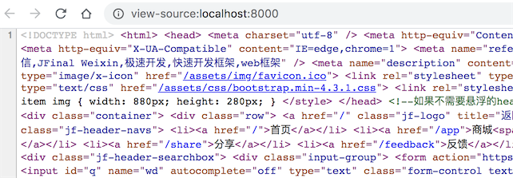
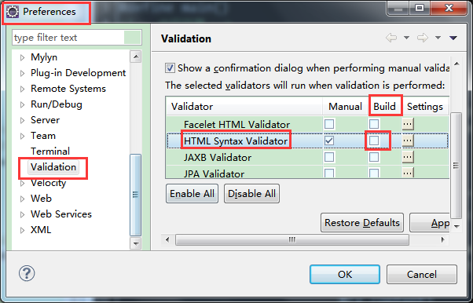

# 引擎配置

### 1､配置入口

Enjoy 引擎的配置入口统一在 Engine 类中。Engine 类中提供了一系列 setter 方法帮助引导配置，减少记忆负担，例如：

```
// 支持模板热加载，绝大多数生产环境下也建议配置成 true，除非是极端高性能的场景
engine.setDevMode(true);

// 添加共享模板函数
engine.addSharedFunction("_layout.html");

// 配置极速模式，性能提升 13%
Engine.setFastMode(true);

// jfinal 4.9.02 新增配置：支持中文表达式、中文变量名、中文方法名、中文模板函数名
Engine.setChineseExpression(true);
```

注意：engine.setToClassPathSourceFactory()、engine.setBaseTemplatePath(...)、engine.setDevMode(...) 这三个配置要放在最前面，因为后续的 engine.addSharedFunction(...) 等配置对前面三个配置有依赖。

jfinal 4.9 新增了 HTML 压缩功能，其配置如下：

```
// 开启 HTML 压缩功能，分隔字符参数可配置为：'\n' 与 ' '
engine.setCompressorOn(' ');
```

该功能对于超高并发访问的 web 应用会有益处，节约流量、提升效率。配置完以后生成的 html 内容如下所示：  


注意：该功能只支持 HTML 压缩，如果 HTML 中混杂着 javascript 脚本，且其中含有单行注释，或者某些语句缺少分号，则会引起错误，例如下面的 js 代码：

```
// 这里是 js 的注释
var s1 = "hello"
var s2 = "james"
s3 = s1 + s2
```

以上 js 代码中出现了单行注释，还出现了语句结尾缺少分号字符 ';' 的情况，带有这类情况的 HTML 模板，需要使用换行符作为压缩分隔符：

```
// 使用换行字符为分隔字符
engine.setCompressorOn('\n');
```

该配置与使用空格字符的压缩率是完全一样的，而且压缩出来的 HTML 可读性也更好，建议使用。如果 HTML 中混杂着 js 脚本，强烈建议使用该配置。

jfinal 4.9 新增 addEnum(...) 支持枚举类型

```
// 假定有如下枚举定义
public enum UserType {
    ADMIN,
    USER;

    public String hello() {
        return "hello";
    }
}

// 添加对该枚举的配置
engine.addEnum(UserType.class);


// 在模板中的使用方法如下
### 以下的对象 u 通过 Controller 中的 setAttr("u", UserType.ADMIN) 传递
#if(u == UserType.ADMIN)
    #(UserType.ADMIN)

    ### 以下两行代码演示直接方法调用
    #(UserType.ADMIN.hello())
#end
```

jfinal 4.9.02 新增配置，支持中文表达式、中文变量名、中文方法名、中文模板函数名

```
Engine.setChineseExpression(true);
```

### 2、配置多个 Engine 对象

由于 Enjoy 引擎被设计为多种用途，同一个项目中的不同模块可以使用不同的 Engine 对象，分别用于不同的用途，那么则需要分别配置，各个 engine 对象的配置彼此独立互不干扰。

例如 jfinal 中的 Controller.render(String) 以及 SQL 管理功能 Model.template(...)、Db.template(...)、Db.getSqlPara(...) 就分别使用了两个不同的 Engine 对象，所以这两个对象需要独立配置，并且配置的地点是完全不同的。

应用于 Controller.render(String) 的 Engine 对象的配置在 configEngine(Engine me) 中进行：

```
public void configEngine(Engine me) {
  // devMode 配置为 true，将支持模板实时热加载
  me.setDevMode(true);
}
```

应用于 SQL 管理的 Engine 对象的配置在 configPlugin(Plugins me) 中进行：

```
public void configPlugin(Plugins me) {
  ActiveRecordPlugin arp = new ActiveRecordPlugin(...);
  Engine engine = arp.getEngine();

  // 上面的代码获取到了用于 sql 管理功能的 Engine 对象，接着就可以开始配置了
  engine.setToClassPathSourceFactory();
  engine.addSharedMethod(new StrKit());

  me.add(arp);
}
```

常见错误：经常有同学在配置 SQL 管理的 Engine 对象时，是在 configEngine(Engine me) 中进行配置，造成配置错配的问题。
同理，自己创建出来的 Engine 对象也需要独立配置：

```
Engine engine = Engine.create("myEngine");
engine.setDevMode(true);
```

### 3、多 Engine 对象管理

使用 Engine.create(engineName) 创建的 engine 对象，可以在任意地方通过 Engine.use(engineName) 很方便获取，管理多个 engine 对象十分方便，例如：

```
// 创建一个 Engine 对象并进行配置
Engine forEmail = Engine.create("forEmail");
forEmail.addSharedMethod(EmailKit.class);
forEmail.addSharedFunction("email-function.txt");

// 创建另一个 Engine 对象并进行配置
Engine forWeixin = Engine.create("forWeixin");
forWeixin.addSharedMethod(WeixinKit.class);
forWeixin.addSharedFunction("weixin-function.txt");
    上面代码创建了两个 Engine 对象，并分别取名为 "forEmail" 与 "forWeixin"，随后就可以分别使用这两个 Engine 对象了：

// 使用名为 "forEmail" 的 engine 对象
String ret = Engine.use("forEmail").getTemplate("email-template.txt").renderToString(...);
System.out.print(ret);

// 使用名为 "forWeixin" 的 engine 对象
String ret = Engine.use("forWeixin").getTemplate("weixin-template.txt").renderToString(...);
System.out.print(ret);
```

如上代码所示，通过 Engine.use(...) 方法可以获取到 Engine.create(...) 创建的对象，既很方便独立配置，也很方便独立获取使用。

### 4､模板热加载配置

为了达到最高性能 Enjoy 引擎默认对模板解析结果进行缓存，所以模板被加载之后的修改不会生效，如果需要实时生效需要如下配置：

```
engine.setDevMode(true);
```

配置成 devMode 模式，开发环境下是提升开发效率必须的配置。

由于 Enjoy 的模板解析速度是 freemarker、velocity 这类模板引擎的 7 倍左右，并且模板解析前也会判断是否被修改，所以绝大部分情况下建议配置成热加载模式：setDevMode(true)，除非你的项目是极端高性能的应用场景。

### 5、共享模板函数配置

如果模板中通过 #define 指令定义了 template function，并且希望这些 template function 可以在其它模板中直接调用的话，可以进行如下配置：

```
// 添加共享函数，随后可在任意地方调用这些共享函数
me.addSharedFunction("/view/common/layout.html");
```

以上代码添加了一个共享函数模板文件 layout.html，这个文件中使用了#define 指令定义了 template function。通过上面的配置，可以在任意地方直接调用 layout.html 里头的 template function。

### 6、从 class path 和 jar 包加载模板配置

如果模板文件在项目的 class path 路径或者 jar 包之内（注意：maven 项目的 src/main/resources 也属于 class path），可以通过 me.setToClassPathSourceFactory() 以及 me.setBaseTemplatePath(null) 来实现，以下是代码示例：

```
public void configEngine(Engine me) {
   me.setDevMode(true);

   me.setBaseTemplatePath(null);
   me.setToClassPathSourceFactory();

   me.addSharedFunction("/view/common/layout.html");
}
```

Enjoy 引擎默认提供了 FileSourceFactory、与 ClassPathSourceFactory 来配置模板加载来源的策略，前者从文件系统中加载模板，后者从 class path 以及 jar 包加载模板。其中前者是默认配置，后者可通过 engine.setToClassPathSourceFactory() 进行配置。

还可以通过实现 ISourceFactory 接口，扩展出从任意来源加载模板的策略。然后通过 engine.setSourceFactory(...) 切换到自己扩展的策略上去。

还可以通过实现 ISource 接口，然后通过 engine.get(new MySource(...)) 去加载模板内容。目前已有用户实现 DbSource 从数据库加载模板的功能。

### 7、Eclipse 下开发

在 Eclipse 下开发时，可以将 Validation 配置中的 Html Syntax Validator 中的自动验证去除勾选，因为 eclipse 无法识别 Enjoy 使用的指令，从而会在指令下方显示黄色波浪线，影响美观。具体的配置方式见下图：  


配置完成后注意重启 eclipse 生效，这个操作不影响使用，仅为了代码美观，关爱处女座完美主义者。
