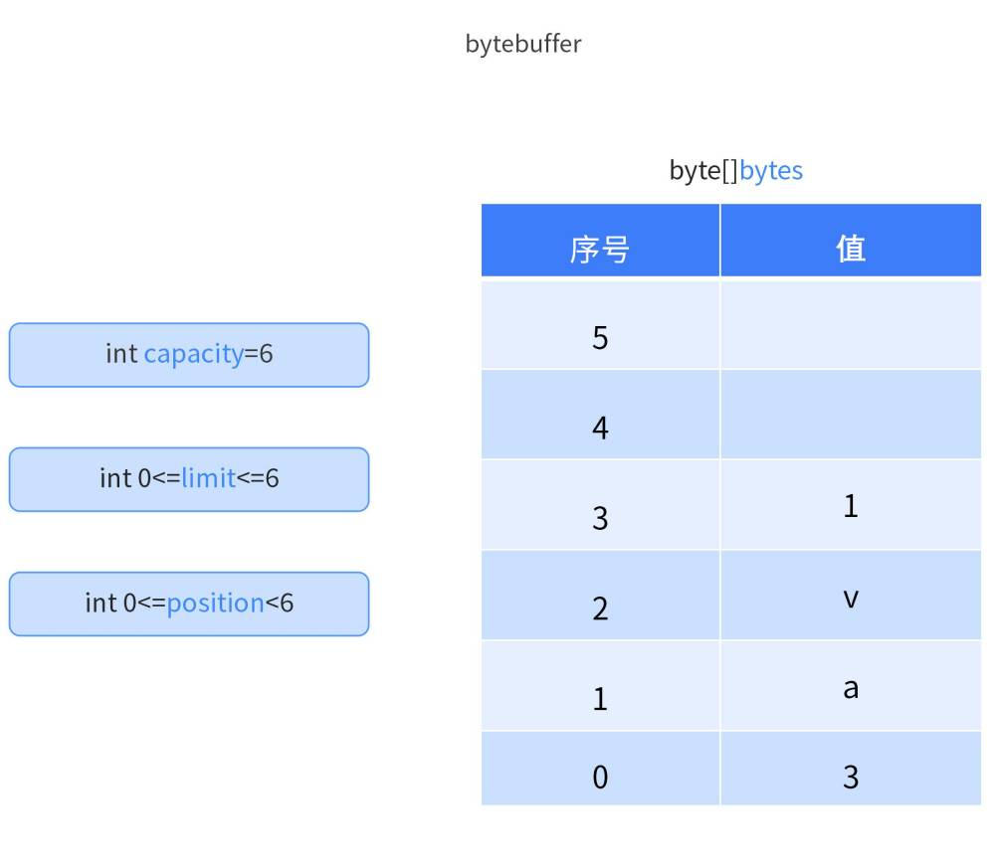
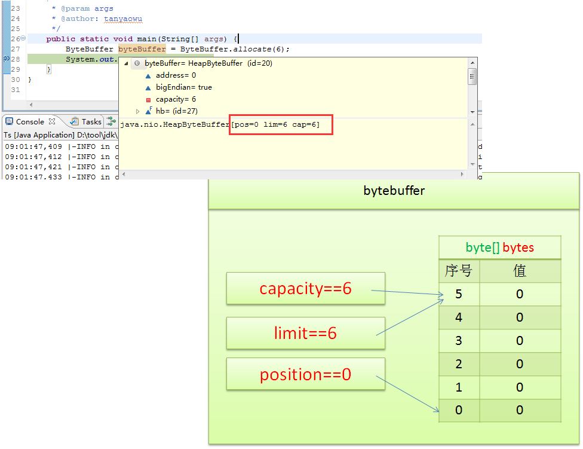
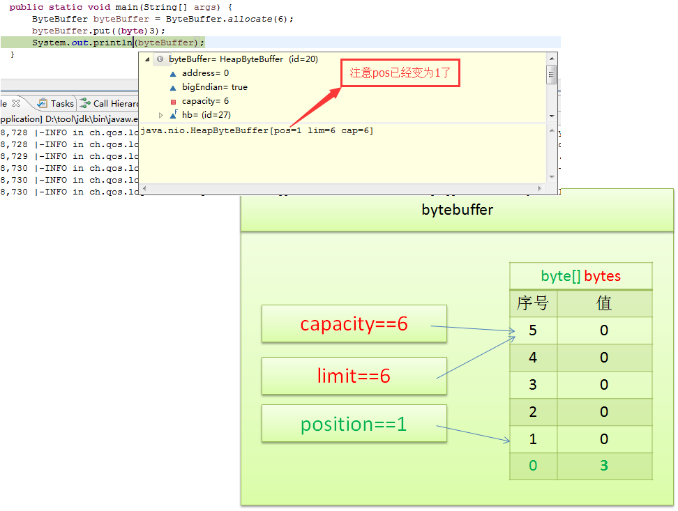
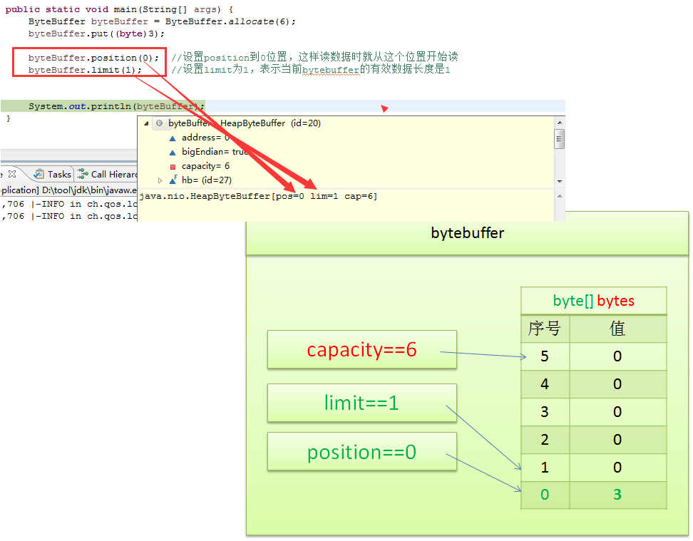
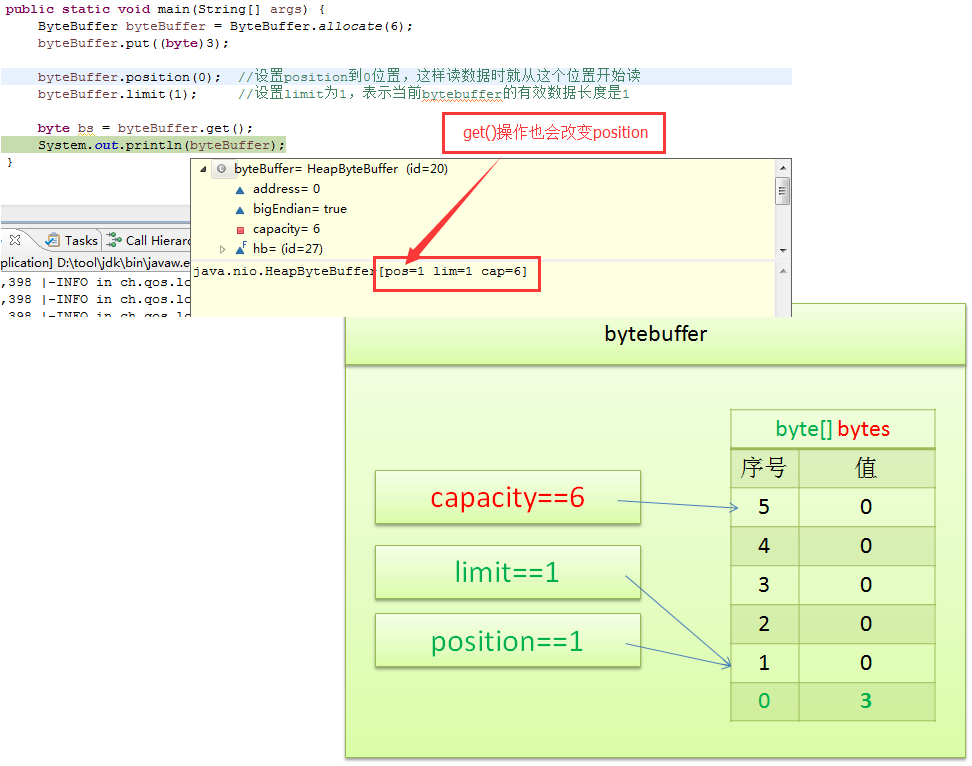

# ByteBuffer

## 简介

### 1. 什么是`ByteBuffer`

`ByteBuffer` 是 Java NIO（New Input/Output）库中的一个类，用于处理字节数据的缓冲区。它允许开发者以更高效的方式对字节流进行读写操作。与传统的 I/O 方式相比，`ByteBuffer` 不仅可以让程序更灵活地控制数据的读写，还可以通过直接访问底层内存，提升操作性能。

`ByteBuffer` 提供了三种不同的分配方式：

- **Heap Buffer**（堆内缓冲区）：使用 Java 堆内存分配。它与 JVM 的垃圾回收机制配合，容易管理但性能相对较低。
- **Direct Buffer**（直接缓冲区）：直接分配操作系统内存。由于跳过了 Java 的堆内存访问，直接缓冲区性能较高，适合与操作系统或硬件进行高频交互。
- **Mapped ByteBuffer**（内存映射缓冲区）：将文件的一部分或全部映射到内存中，允许通过内存来直接访问文件的内容。

### 2. `ByteBuffer` 是如何提升性能的

`ByteBuffer` 提升性能的方式主要体现在以下几个方面：

#### 1. **减少系统调用和复制操作**

在传统的 I/O 操作中，数据需要多次在用户空间和内核空间之间复制。例如，读取文件时，数据首先会从磁盘复制到内核空间，再从内核空间复制到用户空间。而 `ByteBuffer` 尤其是 **Direct Buffer**，通过直接分配系统内存，减少了这些额外的数据拷贝次数，减少了开销，从而提升了性能。

#### 2. **非阻塞 I/O**

`ByteBuffer` 是 Java NIO 的一部分，支持非阻塞 I/O 操作。在传统 I/O 中，当一个线程读取或写入数据时，通常会被阻塞，直到 I/O 操作完成为止。而使用 `ByteBuffer` 结合 `Selector`，线程可以同时处理多个 I/O 操作而不会被阻塞，从而提高系统的并发性和吞吐量。

#### 3. **零拷贝（Zero-Copy）技术**

对于 `MappedByteBuffer`（内存映射缓冲区），可以将文件直接映射到内存，通过内存访问来处理文件数据，这避免了传统 I/O 读写时需要通过多次内存拷贝的过程。此技术在处理大文件或频繁读写的场景中，极大地提升了性能。

#### 4. **缓存局部性优化**

`ByteBuffer` 提供了对内存区域的直接控制，可以精确地指定数据的读写位置、长度等。通过这些控制，`ByteBuffer` 有效利用 CPU 缓存，减少缓存不命中的开销。在高频率的小数据包传输的场景中，性能优势显著。

#### 5. **灵活的读写模式**

`ByteBuffer` 支持两种读写模式：

- **相对模式**：读写操作会自动更新位置指针。
- **绝对模式**：可以直接指定具体位置进行读写操作，避免了不必要的缓冲区重置操作。

这两种模式的结合，使得 `ByteBuffer` 在处理不同数据结构时能够灵活应对，减少了不必要的开销。

#### 6. **批量操作**

`ByteBuffer` 允许批量读写数据，例如 `put(byte[] src)` 和 `get(byte[] dst)` 方法，可以一次性处理多个字节。这种批量操作可以有效减少单次调用的开销，从而提高整体操作的效率。

### 性能提升示例代码

```java
import java.nio.ByteBuffer;
import java.nio.channels.FileChannel;
import java.io.RandomAccessFile;

public class ByteBufferExample {
    public static void main(String[] args) throws Exception {
        // 使用堆外内存直接缓冲区提升性能
        ByteBuffer directBuffer = ByteBuffer.allocateDirect(1024);
        RandomAccessFile file = new RandomAccessFile("test.txt", "rw");
        FileChannel fileChannel = file.getChannel();

        // 从文件读取数据到Direct Buffer中，减少了多次数据拷贝
        int bytesRead = fileChannel.read(directBuffer);
        while (bytesRead != -1) {
            directBuffer.flip();  // 切换为读模式
            while (directBuffer.hasRemaining()) {
                System.out.print((char) directBuffer.get());  // 打印数据
            }
            directBuffer.clear();  // 清除缓冲区，准备下次读写
            bytesRead = fileChannel.read(directBuffer);
        }
        file.close();
    }
}
```

通过`Direct Buffer`直接与文件系统交互，跳过了传统的内存复制流程，减少了系统调用次数，进而提升了性能。

### 总结

`ByteBuffer` 通过减少不必要的内存拷贝、支持非阻塞 I/O、批量操作以及利用直接缓冲区等方式，大大提升了数据读写的效率。特别是在高并发、大文件处理、网络通信等场景中，`ByteBuffer` 的性能优势尤为明显。

## ByteBuffer 入门示例

### `ByteBuffer`的关键属性

- **byte[] bytes**：这是底层数组，用来存储实际的字节数据。
- **capacity（容量）**：`ByteBuffer`的容量是底层字节数组的固定大小。一旦缓冲区分配完成，容量是不可改变的。
- **limit（限制）**：限制表示可以读取或写入的最大元素个数。初始情况下，limit 等于容量，但它可以在需要时修改，以限制有效数据范围。
- **position（位置）**：位置指针表示当前读取或写入数据的索引。每次写入或读取后，位置指针会自动向前移动。
  

### 创建`ByteBuffer`

要创建一个指定容量大小的`ByteBuffer`，可以使用`ByteBuffer.allocate(int capacity)`方法。例如：

```java
ByteBuffer byteBuffer = ByteBuffer.allocate(6);  // 创建一个容量为6的ByteBuffer
System.out.println(byteBuffer);  // 输出结果: java.nio.HeapByteBuffer[pos=0 lim=6 cap=6]
```

此时，缓冲区的容量`capacity`为 6，限制`limit`为 6，位置`position`为 0。


### 向`ByteBuffer`写入数据

使用`ByteBuffer.put(byte b)`方法可以将数据写入缓冲区：

```java
byteBuffer.put((byte) 3);  // 向ByteBuffer中写入字节值3
System.out.println(byteBuffer);  // 输出结果: java.nio.HeapByteBuffer[pos=1 lim=6 cap=6]
```

此时，`position`从 0 移动到 1，表示已写入一个字节，缓冲区的其他属性保持不变。


### 从`ByteBuffer`读取数据

在读取数据前，需要调整`position`和`limit`，确保读取的数据范围正确：

```java
byteBuffer.position(0);  // 设置position为0，准备从头读取
byteBuffer.limit(1);     // 设置limit为1，表示当前ByteBuffer的有效数据长度为1
```


接下来，可以使用`ByteBuffer.get()`方法读取数据：

```java
byte bs = byteBuffer.get();  // 读取一个字节
System.out.println(bs);      // 输出结果: 3
System.out.println(byteBuffer);  // 输出结果: java.nio.HeapByteBuffer[pos=1 lim=1 cap=6]
```

读取后，`position`自动更新为 1，`limit`和`capacity`保持不变。


### 完整代码示例

```java
import java.nio.ByteBuffer;

public class ByteBufferExample {
    public static void main(String[] args) {
        // 创建一个容量为6的ByteBuffer
        ByteBuffer byteBuffer = ByteBuffer.allocate(6);
        System.out.println("初始: " + byteBuffer);

        // 向ByteBuffer写入数据
        byteBuffer.put((byte) 3);
        System.out.println("写入数据后: " + byteBuffer);

        // 调整position和limit准备读取
        byteBuffer.position(0);
        byteBuffer.limit(1);
        System.out.println("准备读取数据: " + byteBuffer);

        // 读取数据
        byte bs = byteBuffer.get();
        System.out.println("读取的数据: " + bs);
        System.out.println("读取数据后: " + byteBuffer);
    }
}
```
