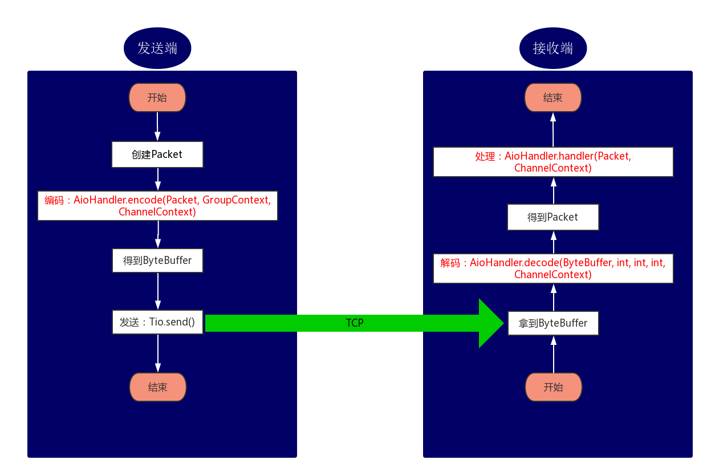

# t-io 消息处理流程

`t-io` 是一个高效的 Java 网络通信框架，它通过 `Packet`、`ChannelContext`、`AioHandler` 和 `AioListener` 等核心组件，处理 TCP 连接的数据收发和业务逻辑。以下是关于这些组件的详细介绍以及消息处理的过程。

## 1. Packet

`Packet` 是用于表示业务数据结构的类。在使用 `t-io` 时，通常会通过继承 `Packet` 类来实现自己的业务数据结构。你可以把 `Packet` 看作一个普通的 VO（Value Object）对象，用于传递数据。

> **注意**：建议不要直接使用 `Packet` 对象，而是继承 `Packet` 类来定义自己的数据结构。

## 2. ChannelContext

每当一个 TCP 连接建立时，`t-io` 框架会为该连接分配一个 `ChannelContext` 对象。`ChannelContext` 是该连接的上下文对象，保存了连接的各种状态信息，并在整个连接的生命周期内被用于处理和管理该连接的所有操作。

## 3. AioHandler

`AioHandler` 是处理消息的核心接口。当你使用 `t-io` 作为 TCP 客户端时，需要实现 `ClientAioHandler`；当你使用 `t-io` 作为 TCP 服务器时，需要实现 `ServerAioHandler`。`AioHandler` 接口定义了三个重要的方法：

- **`decode`**: 将 `ByteBuffer` 解码为业务需要的 `Packet` 对象。如果收到的数据不完整导致解码失败，可以返回 `null`，框架会自动将后续收到的数据与之前的数据进行拼接。
- **`encode`**: 将业务 `Packet` 对象编码为 `ByteBuffer`，以便发送到客户端或服务器。
- **`handler`**: 处理接收到的 `Packet` 对象，执行业务逻辑。

以下是 `AioHandler` 的接口定义示例：

```java
package com.litongjava.tio.core.intf;

import java.nio.ByteBuffer;
import com.litongjava.tio.core.ChannelContext;
import com.litongjava.tio.core.TioConfig;
import com.litongjava.tio.core.exception.TioDecodeException;

public interface AioHandler {

    Packet decode(ByteBuffer buffer, int limit, int position, int readableLength, ChannelContext channelContext) throws TioDecodeException;

    ByteBuffer encode(Packet packet, TioConfig tioConfig, ChannelContext channelContext);

    void handler(Packet packet, ChannelContext channelContext) throws Exception;
}
```

## 4. AioListener

`AioListener` 是监听消息处理的核心接口。当你使用 `t-io` 作为 TCP 客户端时，需要实现 `ClientAioListener`；当你使用 `t-io` 作为 TCP 服务器时，需要实现 `ServerAioListener`。它定义了处理连接和消息生命周期的各个回调方法，如连接建立、消息解码、消息发送、消息处理等。

以下是 `AioListener` 的接口定义示例：

```java
package com.litongjava.tio.core.intf;

import com.litongjava.tio.core.ChannelContext;

public interface AioListener {

    void onAfterConnected(ChannelContext channelContext, boolean isConnected, boolean isReconnect) throws Exception;

    void onAfterDecoded(ChannelContext channelContext, Packet packet, int packetSize) throws Exception;

    void onAfterReceivedBytes(ChannelContext channelContext, int receivedBytes) throws Exception;

    void onAfterSent(ChannelContext channelContext, Packet packet, boolean isSentSuccess) throws Exception;

    void onAfterHandled(ChannelContext channelContext, Packet packet, long cost) throws Exception;

    void onBeforeClose(ChannelContext channelContext, Throwable throwable, String remark, boolean isRemove) throws Exception;
}
```

## 5. 消息处理过程

每当一个 TCP 连接建立时，`t-io` 会为该连接分配一个 `ChannelContext` 对象。这个对象贯穿整个连接的生命周期，并在以下过程中被多次使用。



### 发送端消息处理过程

1. **创建 `Packet` 对象**: 构建一个要发送的 `Packet` 数据包，包含业务数据。
2. **编码**: 使用 `AioHandler.encode(Packet, GroupContext, ChannelContext)` 方法将 `Packet` 编码为 `ByteBuffer`，以便通过网络传输。
3. **发送数据**: 使用 `Tio.send()` 方法，将编码后的 `ByteBuffer` 通过 TCP 连接发送到接收端。

### 接收端消息处理过程

1. **接收数据**: 从 TCP 连接中接收到一个 `ByteBuffer`，包含了发送端传递的数据。
2. **解码**: 使用 `AioHandler.decode(ByteBuffer, int, int, int, ChannelContext)` 方法，将 `ByteBuffer` 解码为 `Packet` 对象。
3. **处理数据**: 使用 `AioHandler.handler(Packet, ChannelContext)` 方法，处理解码后的 `Packet` 对象，执行相应的业务逻辑。

### 详细过程说明

发送端和接收端的消息处理过程如图所示：

- 在发送端，创建 `Packet` 后，通过 `AioHandler.encode()` 方法将其编码为 `ByteBuffer`，然后使用 `Tio.send()` 方法发送给接收端。
- 在接收端，通过 `AioHandler.decode()` 方法将接收到的 `ByteBuffer` 解码为 `Packet`，再通过 `AioHandler.handler()` 方法进行业务逻辑处理。

### 总结

`t-io` 的消息处理过程依赖于 `Packet` 来封装业务数据，通过 `ChannelContext` 维护连接状态，使用 `AioHandler` 处理消息的编码、解码和业务逻辑，最终通过 `AioListener` 监听连接和消息的生命周期事件。整个流程简洁高效，适用于高性能的网络通信场景。

## 参考文献

[tiocloud 文档资料](https://www.tiocloud.com/doc/tio/?pageNumber=1)
