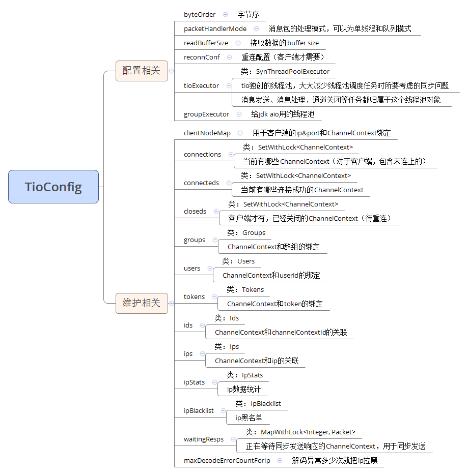

# `TioConfig`

## 场景介绍

在构建一个 TCP 服务器时，我们通常会先选择一个端口来监听客户端连接，然后创建多个线程池来执行相关任务，如消息发送、数据包解码、数据包处理等。此外，还需要维护与客户端连接相关的各种数据。为了实现与业务逻辑的互动，通常需要将客户端连接与业务数据绑定起来，例如将某个客户端绑定到一个群组、用户 ID、Token 等。

`TioConfig` 就是为了解决这些需求而设计的：它用于配置线程池、监听端口，并维护客户端连接的各种数据等。

`TioConfig` 是一个抽象类，根据使用场景的不同，需要实例化相应的子类：

- 如果你使用 `tio` 作为 TCP 客户端，则需要创建 `ClientTioConfig` 对象。
- 如果你使用 `tio` 作为 TCP 服务器，则需要创建 `ServerTioConfig` 对象。

一个 `ServerTioConfig` 对象对应一个监听端口。由于一个 JVM 实例可以监听多个端口，因此一个 JVM 中可以存在多个 `ServerTioConfig` 对象。

## 如何获取 `TioConfig`

### 方法 1：通过 `ChannelContext` 对象

如果你已经获取到 `ChannelContext` 对象，可以直接通过以下代码获取 `TioConfig`：

```java
TioConfig tioConfig = channelContext.tioConfig;
```

### 方法 2：通过 `TioBootServer` 对象

你也可以通过 `TioBootServer` 对象获取 `ServerTioConfig`，方法如下：

```java
ServerTioConfig serverTioConfig = TioBootServer.me().getServerTioConfig();
```

---

### TioConfig 组成部分

`TioConfig` 对象包含了大量信息，其主要组件如图所示。

图片展示了 `TioConfig` 的主要配置项和维护项，分为两大部分：

#### 1. 配置相关

- **byteOrder**: 字节序，用于指定数据的存储顺序。
- **packetHandlerMode**: 消息包的处理模式，支持单线程和队列模式。
- **readBufferSize**: 接收数据的缓冲区大小。
- **reconnConf**: 重连接配置，通常用于客户端配置。
- **tioExecutor**: `tio` 独立的线程池，用于消息发送、消息处理等任务的执行。
- **groupExecutor**: AIO 线程池，通常用于 AIO 模型下的组任务执行。
- **clientNodeMap**: 用于客户端 IP 和端口与 `ChannelContext` 之间的映射。

#### 2. 维护相关

- **connections**: 当前所有连接的 `ChannelContext` 集合。
- **connecteds**: 当前已成功连接的 `ChannelContext` 集合。
- **closeds**: 已经关闭的 `ChannelContext` 集合，供清理时使用。
- **groups**: 客户端 `ChannelContext` 与群组的绑定关系。
- **users**: 客户端 `ChannelContext` 与用户 ID (`userid`) 的绑定关系。
- **tokens**: 客户端 `ChannelContext` 与 Token 的绑定关系。
- **ids**: 客户端 `ChannelContext` 与 `ChannelContextId` 的绑定关系。
- **ips**: 客户端 `ChannelContext` 与 IP 地址的绑定关系。
- **ipStats**: IP 统计信息，用于记录每个 IP 的请求数等统计数据。
- **ipBlacklist**: IP 黑名单，记录被禁止访问的 IP 地址。
- **waitingResps**: 正在等待同步发送响应的 `ChannelContext` 集合，用于同步发送响应。
- **maxDecodeErrorCountForIp**: 解码异常多少次后将该 IP 列入黑名单。

这些配置项和维护项共同构成了 `TioConfig` 的核心功能，帮助开发者更好地管理和维护 TCP 连接及其相关数据。

## 参考文献

[tiocloud 文档资料](https://www.tiocloud.com/doc/tio/?pageNumber=1)
