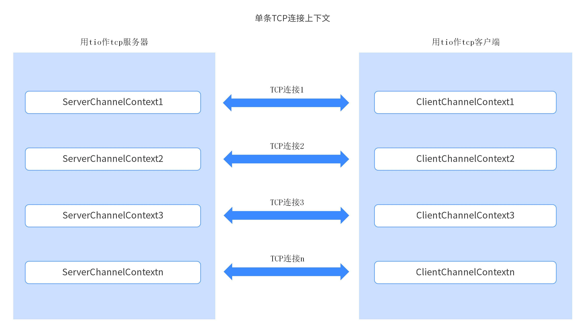
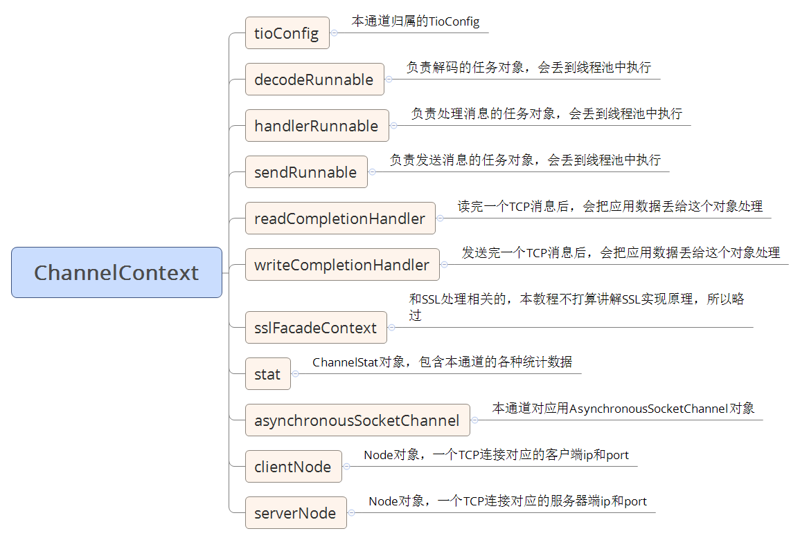

# ChannelContext

`ChannelContext` 对象是每个 TCP 连接建立后生成的一个关键对象。它是一个抽象类，具体取决于你是使用 `t-io` 作为 TCP 客户端还是作为 TCP 服务器。如果你使用 `t-io` 作为 TCP 客户端，那么你将获得一个 `ClientChannelContext` 对象；如果你使用 `t-io` 作为 TCP 服务器，那么你将获得一个 `ServerChannelContext` 对象。


## 业务数据与 TCP 连接的关联

用户可以通过 `ChannelContext` 对象将业务数据与 TCP 连接关联起来。这可以通过以下方法实现：

- **设置属性**：使用 `ChannelContext.set(String key, Object value)` 方法可以将业务数据存储在 `ChannelContext` 中。这个方法允许你在 `ChannelContext` 对象中保存任意键值对。

- **获取属性**：使用 `ChannelContext.get(String key)` 方法可以从 `ChannelContext` 对象中检索之前设置的属性。这提供了一种灵活的方式来在 `ChannelContext` 对象中管理与特定连接相关的业务数据。

## 常见绑定操作

然而，在实际开发中，更常用的方法是使用 `t-io` 提供的强大绑定功能。下面介绍了几种常见的绑定操作：

### 1. 绑定 `userid`

`Tio.bindUser(ChannelContext channelContext, String userid)` 允许你将 `userid` 与 `ChannelContext` 对象绑定起来。一旦绑定后，你可以通过 `userid` 来执行各种操作，例如：

- **获取某用户的 `ChannelContext` 集合**：使用 `Tio.getChannelContextsByUserid(TioConfig tioConfig, String userid)` 方法可以获取与某个 `userid` 绑定的所有 `ChannelContext` 对象的集合。

- **向某用户发送消息**：使用 `Tio.sendToUser(TioConfig tioConfig, String userid, Packet packet)` 方法可以向指定的 `userid` 发送消息。这种绑定和操作机制极大地简化了向特定用户发送消息的流程。

### 2. 绑定业务 ID (`bsId`)

你可以使用 `Tio.bindBsId(ChannelContext channelContext, String bsId)` 方法将一个业务 ID 与 `ChannelContext` 绑定。这在需要根据业务 ID 区分不同连接的场景中非常有用。

### 3. 绑定 Token

使用 `Tio.bindToken(ChannelContext channelContext, String token)` 方法，可以将一个 Token 与 `ChannelContext` 绑定。这通常用于安全验证或会话管理。

### 4. 绑定群组

`Tio.bindGroup(ChannelContext channelContext, String group)` 方法允许你将 `ChannelContext` 绑定到一个群组。绑定后，你可以通过群组 ID 向群组内的所有连接发送广播消息。

### 5. 获取用户 Id

channelContext 中包含了 userid 字段,类型是 String

```
channelContext.userid;
```

### 6. 判断某个用户是否在线

要判断某个用户是否在线，可以使用 `Tio` 工具类提供的方法 `getByUserid`。该方法根据 `userId` 获取与之绑定的所有 `ChannelContext`。如果返回的集合不为空，则说明该用户当前有活跃的连接，即在线状态。

```
/**
 * 判断指定的 userId 是否在线
 *
 * @param userId 用户ID
 * @return 如果在线返回 true，否则返回 false
 */
public boolean isUserOnline(String userId) {
    SetWithLock<ChannelContext> channelContexts = Tio.getByUserid(tioConfig, userId);
    return channelContexts != null && !channelContexts.isEmpty();
}
```

## ChannelContext 组成部分

第一张图片展示了 `ChannelContext` 的各个组成部分，并简要描述了每个部分的作用。以下是对图片中各部分的解释：


1. **tioConfig**

   - **描述**：`ChannelContext` 所属的 `TioConfig` 配置对象。`TioConfig` 是整个 `t-io` 框架的核心配置类，包含了与服务器或客户端相关的全局配置信息。

2. **decodeRunnable**

   - **描述**：负责解码的任务对象。当收到数据后，这个任务会被分派到线程池中执行。它的主要作用是将接收到的字节数据解析成应用程序能够理解的消息对象。

3. **handlerRunnable**

   - **描述**：负责处理消息的任务对象。解码后的消息会交由这个任务对象进行进一步处理，如业务逻辑的执行。这个任务同样会被分派到线程池中执行。

4. **sendRunnable**

   - **描述**：负责发送消息的任务对象。这个对象会将应用程序生成的消息转换成字节数据并通过 TCP 连接发送出去。同样，这个任务会被分派到线程池中执行。

5. **readCompletionHandler**

   - **描述**：读取完成 TCP 消息后，该对象会处理从网络中接收到的数据。当一个 TCP 消息被完整读取后，这个处理器会接管数据的处理逻辑。

6. **writeCompletionHandler**

   - **描述**：发送完成 TCP 消息后，该对象会处理应用程序发送的数据。当一个 TCP 消息被完整发送后，这个处理器会处理后续的逻辑，如资源的释放或记录日志。

7. **sslFacadeContext**

   - **描述**：与 SSL 处理相关的上下文。此部分用于处理 SSL/TLS 加密连接，但图片中并未深入讲解 SSL 实现的具体原理。

8. **stat**

   - **描述**：一个 `ChannelStat` 对象，用于包含该通道的各种统计数据，如发送和接收的字节数、消息数等。这有助于监控和分析连接的性能表现。

9. **asynchronousSocketChannel**

   - **描述**：本通道对应的 `AsynchronousSocketChannel` 对象，这是 Java NIO 提供的异步套接字通道，用于非阻塞 I/O 操作。

10. **clientNode**

    - **描述**：表示一个 TCP 连接对应的客户端的 IP 地址和端口。这有助于标识和区分不同的客户端连接。

11. **serverNode**
    - **描述**：表示一个 TCP 连接对应的服务器端的 IP 地址和端口。对于服务器应用来说，这个对象可以用于区分不同的服务器接口或端口。

## 总结

`ChannelContext` 对象是 `t-io` 框架中用于管理和操作 TCP 连接的核心对象。通过将业务数据、用户 ID、业务 ID、Token、群组等与 `ChannelContext` 绑定，`t-io` 提供了强大且灵活的连接管理和消息分发功能。这些绑定操作不仅简化了开发工作，还提高了系统的可维护性和扩展性。

希望这段文档能帮助你更好地理解 `ChannelContext` 对象的使用。

## 参考文献

[tiocloud 文档资料](https://www.tiocloud.com/doc/tio/?pageNumber=1)
