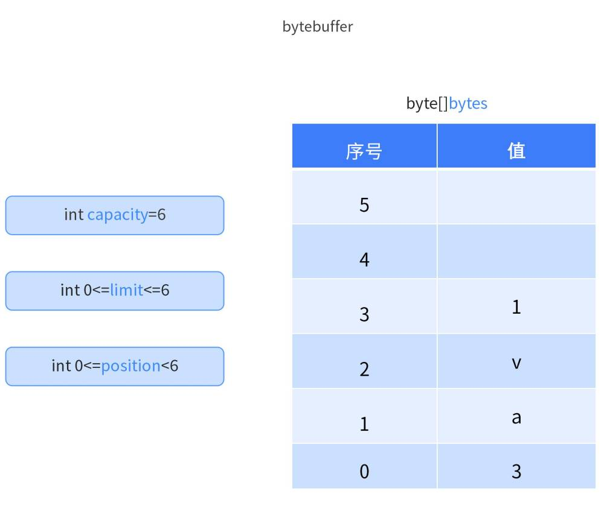
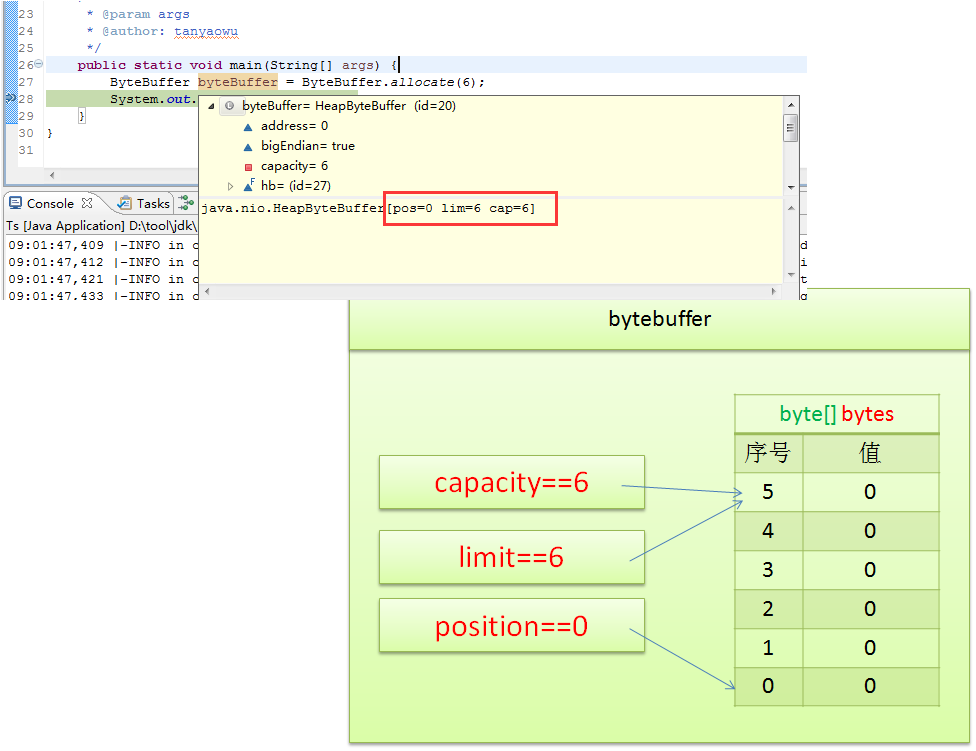
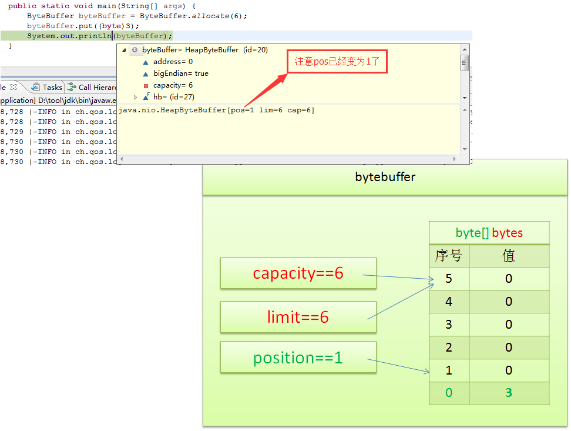
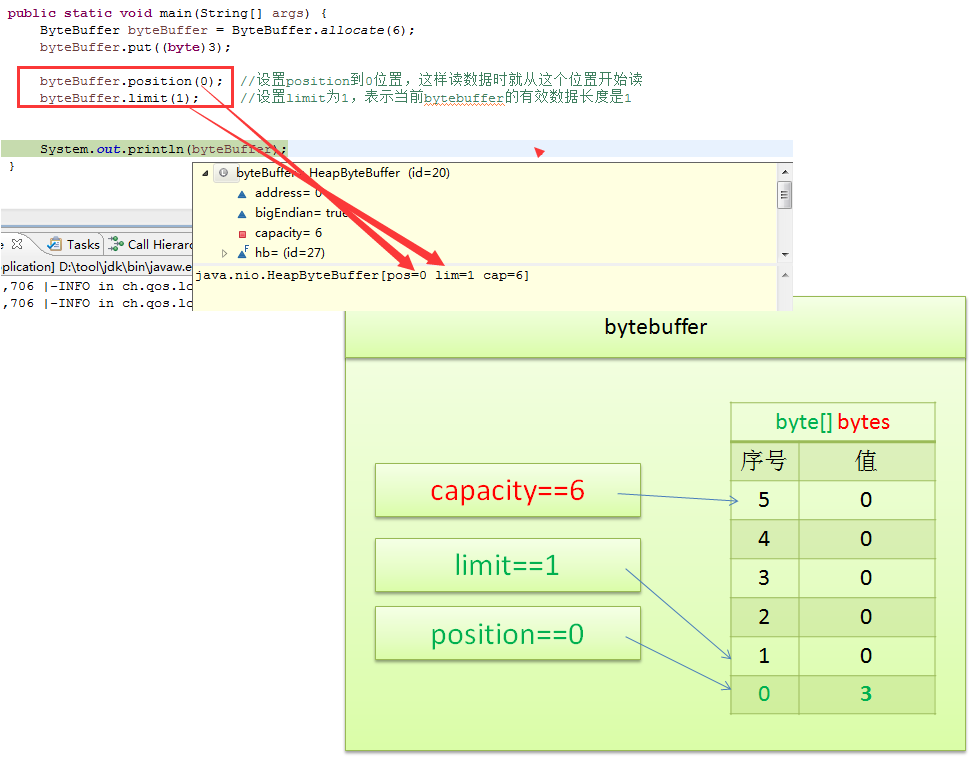
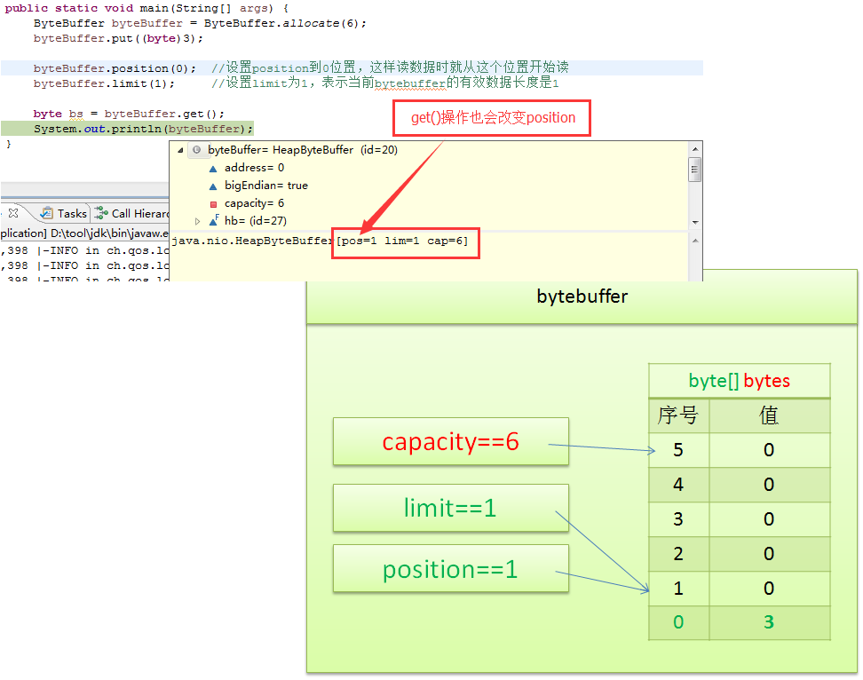

# ByteBuffer

## 简介

### 1. 什么是`ByteBuffer`

`ByteBuffer` 是 Java NIO（New Input/Output）库中的一个类，用于处理字节数据的缓冲区。它允许开发者以更高效的方式对字节流进行读写操作。与传统的 I/O 方式相比，`ByteBuffer` 不仅可以让程序更灵活地控制数据的读写，还可以通过直接访问底层内存，提升操作性能。

`ByteBuffer` 提供了三种不同的分配方式：

- **Heap Buffer**（堆内缓冲区）：使用 Java 堆内存分配。它与 JVM 的垃圾回收机制配合，容易管理但性能相对较低。
- **Direct Buffer**（直接缓冲区）：直接分配操作系统内存。由于跳过了 Java 的堆内存访问，直接缓冲区性能较高，适合与操作系统或硬件进行高频交互。
- **Mapped ByteBuffer**（内存映射缓冲区）：将文件的一部分或全部映射到内存中，允许通过内存来直接访问文件的内容。


## ByteBuffer 入门示例

### `ByteBuffer`的关键属性

- **byte[] bytes**：这是底层数组，用来存储实际的字节数据。
- **capacity（容量）**：`ByteBuffer`的容量是底层字节数组的固定大小。一旦缓冲区分配完成，容量是不可改变的。
- **limit（限制）**：限制表示可以读取或写入的最大元素个数。初始情况下，limit 等于容量，但它可以在需要时修改，以限制有效数据范围。
- **position（位置）**：位置指针表示当前读取或写入数据的索引。每次写入或读取后，位置指针会自动向前移动。
  

### 创建`ByteBuffer`

要创建一个指定容量大小的`ByteBuffer`，可以使用`ByteBuffer.allocate(int capacity)`方法。例如：

```java
ByteBuffer byteBuffer = ByteBuffer.allocate(6);  // 创建一个容量为6的ByteBuffer
System.out.println(byteBuffer);  // 输出结果: java.nio.HeapByteBuffer[pos=0 lim=6 cap=6]
```

此时，缓冲区的容量`capacity`为 6，限制`limit`为 6，位置`position`为 0。


### 向`ByteBuffer`写入数据

使用`ByteBuffer.put(byte b)`方法可以将数据写入缓冲区：

```java
byteBuffer.put((byte) 3);  // 向ByteBuffer中写入字节值3
System.out.println(byteBuffer);  // 输出结果: java.nio.HeapByteBuffer[pos=1 lim=6 cap=6]
```

此时，`position`从 0 移动到 1，表示已写入一个字节，缓冲区的其他属性保持不变。


### 从`ByteBuffer`读取数据

在读取数据前，需要调整`position`和`limit`，确保读取的数据范围正确：

```java
byteBuffer.position(0);  // 设置position为0，准备从头读取
byteBuffer.limit(1);     // 设置limit为1，表示当前ByteBuffer的有效数据长度为1
```


接下来，可以使用`ByteBuffer.get()`方法读取数据：

```java
byte bs = byteBuffer.get();  // 读取一个字节
System.out.println(bs);      // 输出结果: 3
System.out.println(byteBuffer);  // 输出结果: java.nio.HeapByteBuffer[pos=1 lim=1 cap=6]
```

读取后，`position`自动更新为 1，`limit`和`capacity`保持不变。


在使用 `ByteBuffer` 时，通常需要进行 `flip()` 操作来准备从缓冲区中读取数据。`flip()` 会将 `limit` 设置为当前的 `position`，并将 `position` 重置为 0，准备从头读取数据。同时，还可以使用 `hasRemaining()` 方法来检查是否还有数据可以读取。

### 使用 `flip()` 和 `hasRemaining()` 读取数据

#### 完整的示例代码：

```java
import java.nio.ByteBuffer;

public class ByteBufferExample {
    public static void main(String[] args) {
        // 创建一个容量为6的ByteBuffer
        ByteBuffer byteBuffer = ByteBuffer.allocate(6);
        System.out.println("初始: " + byteBuffer);

        // 向ByteBuffer写入数据
        byteBuffer.put((byte) 3);
        byteBuffer.put((byte) 5);
        byteBuffer.put((byte) 7);
        System.out.println("写入数据后: " + byteBuffer);

        // 使用flip()准备从ByteBuffer中读取数据
        byteBuffer.flip();
        System.out.println("调用flip()后: " + byteBuffer);

        // 使用hasRemaining()方法读取数据
        while (byteBuffer.hasRemaining()) {
            byte b = byteBuffer.get();
            System.out.println("读取的数据: " + b);
        }
        System.out.println("读取数据后: " + byteBuffer);

        // 重置缓冲区以供下次写入操作
        byteBuffer.clear();
        System.out.println("调用clear()后: " + byteBuffer);
    }
}
```

#### 代码说明

1. **写入数据**：我们向 `ByteBuffer` 中依次写入了三个字节：`3`, `5`, `7`。写入操作会更新 `position` 值。
2. **调用 `flip()`**：`flip()` 将 `position` 设置为 0，`limit` 设置为当前 `position` 的值，准备读取数据。
3. **读取数据**：使用 `hasRemaining()` 检查缓冲区中是否还有未读的数据，然后依次调用 `get()` 方法读取数据。
4. **调用 `clear()`**：`clear()` 方法将 `position` 重置为 0，并将 `limit` 设置为 `capacity`，准备进行新的写入操作。

#### 输出结果

```java
初始: java.nio.HeapByteBuffer[pos=0 lim=6 cap=6]
写入数据后: java.nio.HeapByteBuffer[pos=3 lim=6 cap=6]
调用flip()后: java.nio.HeapByteBuffer[pos=0 lim=3 cap=6]
读取的数据: 3
读取的数据: 5
读取的数据: 7
读取数据后: java.nio.HeapByteBuffer[pos=3 lim=3 cap=6]
调用clear()后: java.nio.HeapByteBuffer[pos=0 lim=6 cap=6]
```

#### 总结

1. `flip()` 是准备从缓冲区读取数据的关键方法。
2. `hasRemaining()` 在读取数据时检查是否有更多数据可读。
3. `clear()` 用于重置缓冲区，准备进行下一次写入。

这套方法能够很好地在 `ByteBuffer` 中进行写入和读取操作。

## `ByteBuffer` 是如何提升性能的

### `ByteBuffer` 提升性能的方式主要体现在以下几个方面：

#### 1. **减少系统调用和复制操作**

在传统的 I/O 操作中，数据需要多次在用户空间和内核空间之间复制。例如，读取文件时，数据首先会从磁盘复制到内核空间，再从内核空间复制到用户空间。而 `ByteBuffer` 尤其是 **Direct Buffer**，通过直接分配系统内存，减少了这些额外的数据拷贝次数，减少了开销，从而提升了性能。

#### 2. **非阻塞 I/O**

`ByteBuffer` 是 Java NIO 的一部分，支持非阻塞 I/O 操作。在传统 I/O 中，当一个线程读取或写入数据时，通常会被阻塞，直到 I/O 操作完成为止。而使用 `ByteBuffer` 结合 `Selector`，线程可以同时处理多个 I/O 操作而不会被阻塞，从而提高系统的并发性和吞吐量。

#### 3. **零拷贝（Zero-Copy）技术**

对于 `MappedByteBuffer`（内存映射缓冲区），可以将文件直接映射到内存，通过内存访问来处理文件数据，这避免了传统 I/O 读写时需要通过多次内存拷贝的过程。此技术在处理大文件或频繁读写的场景中，极大地提升了性能。

#### 4. **缓存局部性优化**

`ByteBuffer` 提供了对内存区域的直接控制，可以精确地指定数据的读写位置、长度等。通过这些控制，`ByteBuffer` 有效利用 CPU 缓存，减少缓存不命中的开销。在高频率的小数据包传输的场景中，性能优势显著。

#### 5. **灵活的读写模式**

`ByteBuffer` 支持两种读写模式：

- **相对模式**：读写操作会自动更新位置指针。
- **绝对模式**：可以直接指定具体位置进行读写操作，避免了不必要的缓冲区重置操作。

这两种模式的结合，使得 `ByteBuffer` 在处理不同数据结构时能够灵活应对，减少了不必要的开销。

#### 6. **批量操作**

`ByteBuffer` 允许批量读写数据，例如 `put(byte[] src)` 和 `get(byte[] dst)` 方法，可以一次性处理多个字节。这种批量操作可以有效减少单次调用的开销，从而提高整体操作的效率。

### 性能提升示例代码

```java
import java.nio.ByteBuffer;
import java.nio.channels.FileChannel;
import java.io.RandomAccessFile;

public class ByteBufferExample {
    public static void main(String[] args) throws Exception {
        // 使用堆外内存直接缓冲区提升性能
        ByteBuffer directBuffer = ByteBuffer.allocateDirect(1024);
        RandomAccessFile file = new RandomAccessFile("test.txt", "rw");
        FileChannel fileChannel = file.getChannel();

        // 从文件读取数据到Direct Buffer中，减少了多次数据拷贝
        int bytesRead = fileChannel.read(directBuffer);
        while (bytesRead != -1) {
            directBuffer.flip();  // 切换为读模式
            while (directBuffer.hasRemaining()) {
                System.out.print((char) directBuffer.get());  // 打印数据
            }
            directBuffer.clear();  // 清除缓冲区，准备下次读写
            bytesRead = fileChannel.read(directBuffer);
        }
        file.close();
    }
}
```

通过`Direct Buffer`直接与文件系统交互，跳过了传统的内存复制流程，减少了系统调用次数，进而提升了性能。


`ByteBuffer` 通过减少不必要的内存拷贝、支持非阻塞 I/O、批量操作以及利用直接缓冲区等方式，大大提升了数据读写的效率。特别是在高并发、大文件处理、网络通信等场景中，`ByteBuffer` 的性能优势尤为明显。

### ByteBuffer常见问题
### **ByteBuffer如何关闭？需要手动关闭吗？**

`ByteBuffer`（包括堆外内存的直接缓冲区）不需要显式关闭。它们会由垃圾回收机制自动处理，但对于 `ByteBuffer.allocateDirect` 创建的直接缓冲区，释放内存的时机并不一定是及时的，因为它们不受 JVM 堆内存的控制。Java 1.8 中没有直接提供手动释放 `ByteBuffer` 的 API，但可以通过调用 `sun.misc.Cleaner` 或 `sun.nio.ch.DirectBuffer` 的 `cleaner().clean()` 方法间接地释放堆外内存。然而，这种方法依赖于非公开的内部 API，不推荐使用。

从 Java 9 开始，可以使用 `java.nio.Buffer` 的 `cleaner` 方法来手动清理直接缓冲区，但这需要使用反射，并不常见。

因此，一般情况下不需要手动关闭 `ByteBuffer`，但如果使用了直接缓冲区并且内存压力较大，可能需要通过垃圾回收或反射手动触发清理。

### **`file.close`之后 `ByteBuffer` 中的数据还存在吗？**

当 `file.close()` 被调用时，它会关闭文件通道，但 `ByteBuffer` 中的数据仍然存在。`ByteBuffer` 是内存中的缓冲区，关闭文件不会影响 `ByteBuffer` 中已读取或写入的数据。然而，如果 `ByteBuffer` 是直接缓冲区（即 `allocateDirect` 创建的），其内存将在合适的时机由垃圾回收器释放。关闭文件并不会自动清理或释放 `ByteBuffer`。

### **如何一次性读取 `ByteBuffer` 中的所有数据？**

可以使用 `ByteBuffer` 的 `flip()` 方法将缓冲区从写模式切换到读模式，然后使用 `remaining()` 方法查看缓冲区中有多少数据未读出。之后，可以通过 `get()` 方法或一次性将所有数据读到 `byte[]` 数组中。

```java
// 将 ByteBuffer 中的所有数据一次性读取到字节数组中
directBuffer.flip();  // 切换为读模式
byte[] data = new byte[directBuffer.remaining()];  // 创建与剩余数据大小相等的字节数组
directBuffer.get(data);  // 将数据读入字节数组

// 将字节数组转换为字符串或其他格式
String content = new String(data);
System.out.println(content);  // 打印所有数据
```

这样可以确保一次性读取 `ByteBuffer` 中的所有数据，并将其转换为需要的格式。

### allocateDirect 创建的内存最终会释放吗?
`ByteBuffer.allocateDirect()` 创建的堆外内存最终会被释放，但它的释放是通过垃圾回收机制间接触发的，且时机并不总是及时。

#### 具体解释：
- **`allocateDirect` 创建的堆外内存**：这是 JVM 通过 `sun.misc.Unsafe` API 分配的内存，它不在 JVM 堆上，因此不受 JVM 堆内存的直接控制。
- **释放时机**：当 `DirectByteBuffer` 对象不再被引用时，JVM 的垃圾回收器会回收 `DirectByteBuffer` 对象本身，但堆外内存的释放需要 `DirectByteBuffer` 对象的 `Cleaner`（清理器）来执行，这个清理过程是由垃圾回收器在未来的某个时刻触发的。

#### 问题点：
- **非及时释放**：由于堆外内存的回收依赖于垃圾回收器，而垃圾回收器通常优先处理堆内存，因此堆外内存的释放可能会延迟。特别是在高频率地分配和释放堆外内存时，可能会导致内存压力增加。
- **手动释放方式（不推荐）**：在早期版本的 Java 中（如 1.8），可以通过反射访问内部的 `sun.misc.Cleaner` 来手动调用清理器释放内存，但这是依赖于非公开 API 的方式，不推荐使用。在 Java 9+ 中，使用这种方式变得更加困难，Java 更倾向于让用户通过明确的生命周期管理避免过度依赖堆外内存。

#### 结论：
- **最终会释放**：`DirectByteBuffer` 创建的堆外内存最终会被释放，但它的释放时机依赖于垃圾回收器，不一定是即时的。如果频繁使用堆外内存且释放不及时，可能会导致内存不足的问题。
- **推荐方案**：如果应用对内存使用非常敏感，建议避免频繁分配和释放直接缓冲区，或者通过优化 JVM 的垃圾回收策略来提高堆外内存的释放效率。如果堆外内存占用较多，可以考虑更长时间持有缓冲区，减少分配和回收的频率。

## ByteBuffer示例 

### 缓存文件到内存中
使用 `ByteBuffer` 读取指定目录下的所有文件数据并将其存储在内存中，然后在需要获取文件内容时直接从内存中获取，可以通过以下几个步骤实现：

1. **读取目录下所有文件并存入内存**：使用 `ByteBuffer` 读取每个文件的内容，并将其缓存到内存中（例如 `Map<String, ByteBuffer>`，其中 key 为文件名，value 为文件数据）。
   
2. **从内存中获取文件内容**：每次读取文件时，直接从缓存的 `ByteBuffer` 中提取数据。

#### 是否使用 `ByteBuffer` 是最优解？
- 使用 `ByteBuffer` 是一种较为高效的方式，尤其是直接缓冲区（`allocateDirect`）能减少内存拷贝。
- 如果数据量较大且频繁访问，使用内存映射文件 (`MappedByteBuffer`) 可能是更优的选择，它可以将文件的一部分映射到内存中，提升大文件的读取速度。
- 对于小文件，使用 `ByteBuffer` 结合内存缓存是合理的选择。

#### 示例代码：

```java
import java.io.IOException;
import java.nio.ByteBuffer;
import java.nio.channels.FileChannel;
import java.nio.file.*;
import java.util.HashMap;
import java.util.Map;

public class FileCacheExample {
    
    // 缓存文件内容的 Map，key 是文件路径，value 是文件内容的 ByteBuffer
    private Map<String, ByteBuffer> fileCache = new HashMap<>();

    // 读取指定目录下的所有文件，并将其内容存储到内存中
    public void loadDirectoryToMemory(String dirPath) throws IOException {
        Path directory = Paths.get(dirPath);
        DirectoryStream<Path> stream = Files.newDirectoryStream(directory);
        
        for (Path filePath : stream) {
            if (Files.isRegularFile(filePath)) {
                // 读取文件内容到 ByteBuffer 中
                try (FileChannel fileChannel = FileChannel.open(filePath, StandardOpenOption.READ)) {
                    ByteBuffer buffer = ByteBuffer.allocateDirect((int) fileChannel.size());
                    fileChannel.read(buffer);
                    buffer.flip();  // 切换到读模式
                    fileCache.put(filePath.toString(), buffer);  // 将文件内容缓存
                }
            }
        }
    }

    // 从内存中获取文件内容
    public String getFileContent(String filePath) {
        ByteBuffer buffer = fileCache.get(filePath);
        if (buffer != null) {
            // 将 ByteBuffer 中的数据读取为字符串
            byte[] bytes = new byte[buffer.remaining()];
            buffer.get(bytes);  // 将数据读到 byte 数组
            buffer.rewind();  // 重置 buffer 为初始状态，方便下次读取
            return new String(bytes);
        }
        return null;
    }

    public static void main(String[] args) throws IOException {
        FileCacheExample example = new FileCacheExample();
        
        // 指定要加载的目录
        String directoryPath = "testDir";
        example.loadDirectoryToMemory(directoryPath);
        
        // 从缓存中获取文件内容
        String filePath = "testDir/test.txt";
        String content = example.getFileContent(filePath);
        if (content != null) {
            System.out.println("File Content:");
            System.out.println(content);
        } else {
            System.out.println("File not found in cache.");
        }
    }
}
```

#### 代码说明：

1. **读取目录下的所有文件**：
   - 使用 `Files.newDirectoryStream()` 遍历指定目录下的所有文件。
   - 对于每个文件，使用 `FileChannel` 和 `ByteBuffer` 读取文件内容，并存入 `fileCache` 中（`Map<String, ByteBuffer>`）。
   
2. **从内存中获取文件内容**：
   - 从 `fileCache` 中找到对应的 `ByteBuffer`。
   - 使用 `get()` 方法将 `ByteBuffer` 中的数据读取出来，转换为字符串。
   - 调用 `rewind()` 方法重置 `ByteBuffer`，以便下次读取。

#### 进一步优化：
- 如果文件非常大，可以考虑使用 `MappedByteBuffer`，将文件映射到内存中，而不是将整个文件内容加载到堆外内存。
  
- **示例**：使用 `MappedByteBuffer` 的代码可以这样改进：
  
```java
MappedByteBuffer buffer = fileChannel.map(FileChannel.MapMode.READ_ONLY, 0, fileChannel.size());
```

这种方式对非常大的文件（比如 GB 级别的文件）会更高效。

#### 总结：
- 使用 `ByteBuffer` 是读取文件到内存并缓存的有效方式。
- 对于大文件，可以使用 `MappedByteBuffer` 来提高性能。
- `ByteBuffer` 提供了高效的内存管理和数据处理方式，特别是在处理较大文件或频繁访问时。