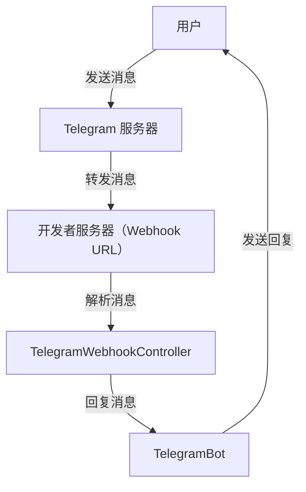

# Telegram

## 简介

`tio-utils` 内置了 Telegram 工具类，允许用户方便地将消息发送到 Telegram 群组。本文档将详细介绍如何创建 Telegram Bot、获取群组 Chat ID、使用 Java 代码发送消息，以及将其集成到 Tio-Boot 项目中。此外，还将介绍如何使用 `tio-utils` 内置的 `TelegramBot` 接收并回复用户消息。

[[toc]]

---

## 1. 创建 Telegram Bot

要在 Telegram 中使用 Bot 功能，首先需要创建一个 Telegram Bot 并获取其 API Token。以下是创建步骤：

1. **与 `@BotFather` 对话**  
   在 Telegram 上搜索并与 `@BotFather` 进行对话，这是 Telegram 官方用于管理 Bot 的工具。

2. **创建新 Bot**  
   输入命令 `/newbot`，然后按照提示输入 Bot 的名称和用户名。用户名必须以 `bot` 结尾，例如 `my_new_bot`。

3. **获取 API Token**  
   创建完成后，`@BotFather` 会回复类似以下的信息：

   ```plaintext
   Done! Congratulations on your new bot. You will find it at t.me/your_bot_name.
   Use this token to access the HTTP API:
   <YourBotToken>
   Keep your token secure and store it safely, it can be used by anyone to control your bot.
   ```

   请妥善记录并保管这个 Bot API Token，避免泄露，以防被他人滥用。

---

## 2. 获取群组的 Chat ID

为了向特定群组发送消息，需要获取该群组的 Chat ID。以下是获取步骤：

1. **将 Bot 添加到群组**  
   将刚创建的 Bot 添加到目标 Telegram 群组中，并确保其拥有发送消息的权限。

2. **获取最新的消息更新**  
   通过访问以下 URL，获取 Bot 的最新消息更新：

   ```
   https://api.telegram.org/bot<YourBotToken>/getUpdates
   ```

   将 `<YourBotToken>` 替换为你的 Bot API Token。

3. **提取 Chat ID**  
   在返回的 JSON 数据中，找到 `chat.id` 对应的值并记录下来。例如：

   ```json
   {
     "ok": true,
     "result": [
       {
         "update_id": 123456789,
         "message": {
           "message_id": 1,
           "from": {
             "id": 12345678,
             "is_bot": false,
             "first_name": "John",
             "username": "john_doe"
           },
           "chat": {
             "id": -987654321,
             "title": "MyGroup",
             "type": "group",
             "all_members_are_administrators": true
           },
           "date": 1624081865,
           "text": "Hello @your_bot_name",
           "entities": [
             {
               "offset": 0,
               "length": 19,
               "type": "mention"
             }
           ]
         }
       }
     ]
   }
   ```

   在此示例中，`chat.id` 为 `-987654321`。

### 如果未获取到 `chat.id`，请按以下步骤解决：

1. **在群组中发送一条消息并 @ 提到您的 Bot**  
   例如，发送 `@YourBotUsername 测试消息`。

2. **再次调用 `getUpdates`**  
   重新访问 `https://api.telegram.org/bot<YourBotToken>/getUpdates`，查看返回结果中是否包含您发送的消息。如果有，您应该能看到 `chat` 对象中的 `chat.id` 信息。

3. **检查 Bot 的权限和隐私设置**  
   如果仍未获取到 `chat.id`，请尝试禁用 Bot 的隐私模式：

   - 在 `@BotFather` 对话中发送 `/mybots`。
   - 选择您的 Bot。
   - 选择 `Bot Settings`。
   - 选择 `Group Privacy`。
   - 将隐私模式设置为 `Disabled`，这样 Bot 就可以接收到群组中的所有消息。

---

## 3. 使用 Java 代码发送消息

以下是使用 Java 代码向 Telegram 群组发送消息的示例代码：

```java
package com.litongjava.tio.utils.telegram;

import org.junit.Test;
import com.litongjava.tio.utils.http.ResponseVo;
import com.litongjava.tio.utils.json.JsonUtils;

public class TelegramTest {

  // Telegram Bot Token
  String BOT_TOKEN = "xxx";
  // Telegram Chat ID
  String CHAT_ID = "xxx";

  @Test
  public void testSend() {
    // 创建一个 Telegram bot 实例
    TelegramBot bot = new TelegramBot("mainBot", BOT_TOKEN);
    // 将 bot 添加到 Telegram 管理类中
    Telegram.addBot(bot);

    // 使用主 bot 发送消息
    ResponseVo responseVo = Telegram.use().sendMessage(CHAT_ID, "Hello, Telegram Group!");
    System.out.println(JsonUtils.toJson(responseVo));
  }

  @Test
  public void testFull() {
    // 创建一个 Telegram bot 实例
    TelegramBot bot = new TelegramBot("mainBot", BOT_TOKEN);
    // 将 bot 添加到 Telegram 管理类中
    Telegram.addBot(bot);

    // 可选：设置为主 bot（如果只使用一个 bot，可以省略这一步）
    Telegram.setMainBot("mainBot");

    // 使用主 bot 发送消息
    Telegram.use().sendMessage(CHAT_ID, "Hello, Telegram Group!");

    // 另外，您可以这样配置并发送消息：
    Telegram.config(botConfig -> botConfig.withToken("BOT_TOKEN"));
    Telegram.use().sendMessage(CHAT_ID, "Hello from another bot");
  }
}
```

### 代码说明

- **TelegramBot 实例化**  
  创建一个 `TelegramBot` 实例时，需要提供一个唯一标识符（如 `"mainBot"`）和 Bot Token。

- **添加 Bot 到管理类**  
  通过 `Telegram.addBot(bot)` 将 Bot 添加到管理类中，以便后续使用。

- **发送消息**  
  使用 `Telegram.use().sendMessage(CHAT_ID, "消息内容")` 方法发送消息到指定的群组。

- **配置多个 Bots（可选）**  
  如果需要使用多个 Bots，可以通过不同的配置发送消息。

---

## 4. 集成到 Tio-Boot

将 Telegram 功能集成到 Tio-Boot 项目中，可以通过配置类和 Controller 来实现。以下是详细步骤：

### 配置类

创建一个配置类，用于初始化 Telegram Bot：

```java
package com.litongjava.telegram.bot.config;
import com.litongjava.annotation.AConfiguration;
import com.litongjava.annotation.Initialization;
import com.litongjava.tio.boot.server.TioBootServer;
import com.litongjava.tio.utils.telegram.Telegram;
import com.litongjava.tio.utils.telegram.TelegramBot;

@AConfiguration
public class TelegramNotificationConfig {
  public static final String BOT_TOKEN = "xxx";
  public static final String CHAT_ID = "xxx";

  @Initialization
  public void config() {
    // 创建一个 Telegram bot 实例
    TelegramBot bot = new TelegramBot(BOT_TOKEN);
    // 将 bot 添加到 Telegram 管理类中
    Telegram.addBot(bot);

    // 添加销毁方法，确保在应用关闭时清理资源
    HookCan.me().addDestroyMethod(() -> {
      Telegram.clearBot();
    });
  }
}

```

### Controller

创建一个 Controller，用于接收 API 请求并发送 Telegram 消息：

```java
package com.litongjava.telegram.bot.controller;
import com.litongjava.annotation.RequestPath;
import com.litongjava.model.http.response.ResponseVo;
import com.litongjava.telegram.bot.config.TelegramNotificationConfig;
import com.litongjava.tio.boot.http.TioRequestContext;
import com.litongjava.tio.http.common.HttpResponse;
import com.litongjava.tio.utils.telegram.Telegram;

@RequestPath("/api/v1/alarm")
public class AlarmController {
  public HttpResponse send(String text) {

    // 使用主 bot 发送消息
    ResponseVo responseVo = Telegram.use().sendMessage(TelegramNotificationConfig.CHAT_ID, text);
    String body = responseVo.getBodyString();
    int code = responseVo.getCode();

    HttpResponse response = TioRequestContext.getResponse();
    response.setStatus(code);
    response.setString(body);
    return response;
  }
}

```

### 返回的数据

调用成功后，Telegram API 会返回如下数据：

```json
{
  "ok": true,
  "result": {
    "message_id": 7,
    "from": {
      "id": 7494961012,
      "is_bot": true,
      "first_name": "xx",
      "username": "xxx"
    },
    "chat": {
      "id": -4588913307,
      "title": "报警",
      "type": "group",
      "all_members_are_administrators": true
    },
    "date": 1724125945,
    "text": "text from api"
  }
}
```

---

## 5. 使用 `tio-utils` 内置的 `TelegramBot` 回答用户发送的消息

本文档进一步指导开发者如何使用 `tio-utils` 库中的内置 `TelegramBot` 来接收并回复用户通过 Telegram 发送的消息。内容涵盖消息流程、Webhook 的设置与处理，以及相关代码的详细解释。

### 项目概述

`TelegramBot` 是 `tio-utils` 库中的一个工具类，旨在简化与 Telegram Bot API 的交互。通过设置 Webhook，开发者可以实时接收用户发送的消息，并进行相应的处理和回复。本项目演示了如何配置和使用 `TelegramBot` 来实现这一功能。

### 消息流程

整个消息处理流程如下：

1. **用户发送消息**：用户通过 Telegram 客户端向 Bot 发送消息。
2. **Telegram 服务器转发消息**：Telegram 服务器将用户的消息通过 Webhook URL 转发到开发者配置的服务器。
3. **服务器接收并处理消息**：服务器的 Webhook 接口接收到消息后，解析内容，并通过 `TelegramBot` 回复用户。
4. **用户收到回复**：用户在 Telegram 客户端看到 Bot 的回复消息。



_示意图：用户 → Telegram 服务器 → 开发者服务器 → 用户_

### 设置 Webhook

要使 Telegram 知道将消息转发到哪里，需要设置 Webhook。以下是设置 Webhook 的步骤和示例代码。

#### 示例代码

```java
package com.litongjava.gpt.translator.services;

import org.junit.Test;

import com.litongjava.model.http.response.ResponseVo;
import com.litongjava.tio.utils.json.JsonUtils;
import com.litongjava.tio.utils.telegram.TelegramBot;

public class TelegramBotTest {

  @Test
  public void test() {
    String token = "YOUR_TELEGRAM_BOT_TOKEN"; // 替换为你的 Telegram Bot Token
    String webHook = "https://your-domain.com/telegram/webhook"; // 替换为你的 Webhook URL
    TelegramBot telegramBot = new TelegramBot("main", token);

    // 设置 Webhook
    ResponseVo setWebhook = telegramBot.setWebhook(webHook);
    System.out.println("Set Webhook Response: " + JsonUtils.toJson(setWebhook));

    // 获取 Webhook 信息
    ResponseVo webhookInfo = telegramBot.getWebhookInfo();
    System.out.println("Webhook Info: " + JsonUtils.toJson(webhookInfo));

    // 删除 Webhook（如果需要）
    // ResponseVo deleteWebhook = telegramBot.deleteWebhook();
    // System.out.println("Delete Webhook Response: " + JsonUtils.toJson(deleteWebhook));
  }

}
```

#### 运行结果示例

```json
{
  "bytes": null,
  "headers": null,
  "body": "{\"ok\":true,\"result\":true,\"description\":\"Webhook was set\"}",
  "ok": true,
  "code": 200
}
{
  "bytes": null,
  "headers": null,
  "body": "{\"ok\":true,\"result\":{\"url\":\"https://your-domain.com/telegram/webhook\",\"has_custom_certificate\":false,\"pending_update_count\":0,\"max_connections\":40,\"ip_address\":\"66.241.124.xxxx\"}}",
  "ok": true,
  "code": 200
}
{
  "bytes": null,
  "headers": null,
  "body": "{\"ok\":true,\"result\":true,\"description\":\"Webhook was deleted\"}",
  "ok": true,
  "code": 200
}
```

#### 步骤说明

1. **替换 Token 和 Webhook URL**  
   将 `YOUR_TELEGRAM_BOT_TOKEN` 替换为你从 [BotFather](https://t.me/BotFather) 获取的 Telegram Bot Token，将 `https://your-domain.com/telegram/webhook` 替换为你服务器上用于接收 Webhook 请求的 URL。

2. **设置 Webhook**  
   调用 `setWebhook` 方法，将 Webhook URL 注册到 Telegram 服务器。

3. **验证设置**  
   通过 `getWebhookInfo` 方法验证 Webhook 是否设置成功。

4. **可选操作**  
   如需删除现有 Webhook，可调用 `deleteWebhook` 方法。

### 处理 Webhook 请求

设置好 Webhook 后，Telegram 会将用户的消息推送到指定的 URL。接下来，需要在服务器端编写处理 Webhook 请求的代码。

#### 示例代码

##### 配置类

```java
import com.litongjava.jfinal.aop.annotation.AConfiguration;
import com.litongjava.jfinal.aop.annotation.AInitialization;
import com.litongjava.tio.boot.server.TioBootServer;
import com.litongjava.tio.utils.telegram.Telegram;
import com.litongjava.tio.utils.telegram.TelegramBot;

@AConfiguration
public class TelegramConfig {
  public static final String BOT_TOKEN = "YOUR_TELEGRAM_BOT_TOKEN";

  @Initialization
  public void config() {
    // 创建一个 Telegram bot 实例
    TelegramBot bot = new TelegramBot(BOT_TOKEN);
    // 将 bot 添加到 Telegram 管理类中
    Telegram.addBot(bot);

    // 添加销毁方法，确保在应用关闭时清理资源
    HookCan.me().addDestroyMethod(() -> {
      Telegram.clearBot();
    });
  }
}
```

##### Webhook Controller

```java
package com.litongjava.gpt.translator.controller;

import com.alibaba.fastjson2.JSONObject;
import com.litongjava.tio.boot.http.TioRequestContext;
import com.litongjava.tio.http.common.HttpRequest;
import com.litongjava.tio.http.common.HttpResponse;
import com.litongjava.annotation.RequestPath;
import com.litongjava.tio.utils.json.FastJson2Utils;
import com.litongjava.tio.utils.telegram.Telegram;

import lombok.extern.slf4j.Slf4j;

@RequestPath("/telegram")
@Slf4j
public class TelegramWebhookController {

  /**
   * 处理 Telegram 的 Webhook 请求
   *
   * @param request HTTP 请求对象
   * @return HTTP 响应对象
   */
  @RequestPath("/webhook")
  public HttpResponse handleTelegramWebhook(HttpRequest request) {
    String bodyString = request.getBodyString();
    log.info("收到的 Webhook 消息: {}", bodyString);

    JSONObject jsonObject = FastJson2Utils.parseObject(bodyString);
    JSONObject message = jsonObject.getJSONObject("message");

    if (message != null) {
      JSONObject chat = message.getJSONObject("chat");
      String chatId = chat.getString("id");

      String text = message.getString("text");
      log.info("来自 chat_id {} 的消息: {}", chatId, text);

      // 回复用户消息
      Telegram.use().sendMessage(chatId.toString(), "你发送了: " + text);
    } else {
      log.warn("未解析到 message 对象");
    }

    // 返回一个成功的响应
    HttpResponse response = TioRequestContext.getResponse();
    response.setStatus(200);
    response.setString("OK");
    return response;
  }
}
```

#### Webhook 请求示例

当用户发送消息 "hi" 给 Bot 时，Telegram 会发送如下的 JSON 数据到 Webhook URL：

```json
{
  "update_id": 394822149,
  "message": {
    "message_id": 3,
    "from": {
      "id": 6276672963,
      "is_bot": false,
      "first_name": "xxx",
      "username": "xxx",
      "language_code": "zh-hans"
    },
    "chat": {
      "id": 6276672963,
      "first_name": "xxx",
      "username": "xxx",
      "type": "private"
    },
    "date": 1726899704,
    "text": "hi"
  }
}
```

### 处理逻辑说明

1. **接收请求**  
   `handleTelegramWebhook` 方法接收来自 Telegram 的 HTTP POST 请求。

2. **解析消息**  
   使用 `FastJson2Utils` 解析请求体中的 JSON 数据，提取 `message` 对象。

3. **提取关键信息**

   - **chat_id**：用于标识消息的聊天对象，可以是个人用户或群组。
   - **text**：用户发送的消息内容。

4. **回复消息**  
   通过 `Telegram.use().sendMessage` 方法，将处理后的消息发送回用户。

5. **返回响应**  
   返回一个 HTTP 200 响应，表示已成功处理请求。

### 代码详解

#### `TelegramBotTest` 类

该类用于测试和设置 Telegram Bot 的 Webhook。

- **构造方法**：

  ```java
  TelegramBot telegramBot = new TelegramBot("main", token);
  ```

  - `"main"`：表示使用的配置文件或环境，可根据实际情况调整。
  - `token`：Telegram Bot 的唯一标识符，从 BotFather 获取。

- **设置 Webhook**：

  ```java
  ResponseVo setWebhook = telegramBot.setWebhook(webHook);
  ```

  - `setWebhook` 方法向 Telegram 服务器注册 Webhook URL。

- **获取 Webhook 信息**：

  ```java
  ResponseVo webhookInfo = telegramBot.getWebhookInfo();
  ```

  - `getWebhookInfo` 方法获取当前 Webhook 的配置信息，验证是否设置成功。

- **删除 Webhook**（可选）：

  ```java
  ResponseVo deleteWebhook = telegramBot.deleteWebhook();
  ```

  - `deleteWebhook` 方法用于删除现有的 Webhook 配置。

#### `TelegramWebhookController` 类

该类负责处理 Telegram 发送到 Webhook 的请求，并回复用户消息。

- **注解说明**：

  - `@RequestPath("/telegram")`：定义该控制器处理的基础路径。
  - `@Slf4j`：引入日志功能，便于调试和记录日志。

- **`handleTelegramWebhook` 方法**：

  ```java
  @RequestPath("/webhook")
  public HttpResponse handleTelegramWebhook(HttpRequest request) { ... }
  ```

  - **路径**：`/telegram/webhook`，即 Webhook URL 的具体路径部分。
  - **参数**：`HttpRequest` 对象，包含了 HTTP 请求的所有信息。
  - **返回值**：`HttpResponse` 对象，用于响应 Telegram 服务器。

- **处理流程**：

  1. **获取请求体**：

     ```java
     String bodyString = request.getBodyString();
     ```

     获取完整的请求体字符串，用于后续解析。

  2. **日志记录**：

     ```java
     log.info("收到的 Webhook 消息: {}", bodyString);
     ```

     记录收到的原始消息，便于调试和监控。

  3. **解析 JSON**：

     ```java
     JSONObject jsonObject = FastJson2Utils.parseObject(bodyString);
     JSONObject message = jsonObject.getJSONObject("message");
     ```

     将 JSON 字符串解析为 `JSONObject`，提取 `message` 对象。

  4. **提取 `chat_id` 和 `text`**：

     ```java
     JSONObject chat = message.getJSONObject("chat");
     String chatId = chat.getString("id");
     String text = message.getString("text");
     ```

     - `chat_id`：用于标识用户或群组。
     - `text`：用户发送的具体消息内容。

  5. **回复用户**：

     ```java
     Telegram.use().sendMessage(chatId.toString(), "你发送了: " + text);
     ```

     使用 `TelegramBot` 发送消息回用户，内容为用户发送的消息内容的回显。

  6. **返回响应**：

     ```java
     HttpResponse response = TioRequestContext.getResponse();
     response.setStatus(200);
     response.setString("OK");
     return response;
     ```

     返回一个 HTTP 200 响应，表示已成功处理请求。

---

### 测试与验证

1. **启动服务器**  
   确保你的服务器已启动，并且 Webhook URL 可被 Telegram 服务器访问。

2. **设置 Webhook**  
   运行 `TelegramBotTest` 类中的 `test` 方法，设置 Webhook。

3. **发送消息**  
   通过 Telegram 客户端向你的 Bot 发送消息，如 "hi"。

4. **观察回复**  
   应收到 Bot 回复的消息 "你发送了: hi"。

5. **检查日志**  
   服务器日志中应记录收到的原始消息和处理过程。

### 注意事项

- **SSL 证书**  
  Telegram 要求 Webhook URL 必须使用 HTTPS，并且具备有效的 SSL 证书。确保你的服务器配置了正确的 SSL 证书。

- **公网访问**  
  确保你的 Webhook URL 对 Telegram 服务器可访问。如果你在本地开发，可以使用工具如 [ngrok](https://ngrok.com/) 暴露本地端口。

- **Token 保密**  
  切勿将 Telegram Bot Token 泄露给他人，避免被滥用。

- **处理多种消息类型**  
  上述示例仅处理文本消息，实际应用中可能需要处理图片、视频等多种消息类型，需根据 Telegram Bot API 文档进行扩展。

- **错误处理**  
  在实际项目中，应添加更多的错误处理逻辑，如处理缺失字段、异常情况等，提升系统的健壮性。

### 常见问题

#### 1. Webhook 设置失败，返回错误信息

**解决方案**：

- 确认 Webhook URL 使用的是 HTTPS，且 SSL 证书有效。
- 检查服务器是否能够被 Telegram 服务器访问，可以使用工具如 `curl` 测试。
- 确认 Bot Token 是否正确，且 Bot 未被禁用或删除。

#### 2. 收不到 Telegram 发送的消息

**解决方案**：

- 检查 Webhook 是否正确设置，可以通过 `getWebhookInfo` 方法查看当前配置。
- 查看服务器日志，确认是否有收到 Telegram 的请求。
- 确认服务器防火墙或安全组设置，确保 Telegram 的 IP 地址未被阻挡。

#### 3. Bot 回复延迟或不回复

**解决方案**：

- 确认服务器处理 Webhook 请求的逻辑无误，且回复操作成功。
- 检查网络状况，确保服务器与 Telegram 服务器之间的连接稳定。
- 查看 Telegram Bot API 的使用限制，避免频繁请求导致被暂时封禁。

---

## 6. 总结

通过以上步骤，您可以轻松地在 Java 项目中集成 Telegram 机器人功能，实现向群组发送消息以及接收并回复用户消息的功能。结合 Telegram 的强大 API，您可以进一步扩展机器人的功能，以满足更多业务需求。以下是关键要点的回顾：

- **创建 Bot 并获取 Token**：通过 `@BotFather` 创建 Bot 并获取 API Token。
- **获取群组 Chat ID**：将 Bot 添加到群组并通过 `getUpdates` 获取 Chat ID。
- **发送消息**：使用 Java 代码，通过 `tio-utils` 的 `TelegramBot` 发送消息。
- **设置 Webhook**：配置 Webhook URL，使 Telegram 能将用户消息转发到您的服务器。
- **处理 Webhook 请求**：编写 Controller 接收和处理来自 Telegram 的消息，并进行回复。

通过以上步骤，您可以实现 Telegram 机器人的基本功能，并根据实际需求进行功能扩展和优化。如有更多问题，建议参考 [Telegram Bot API 官方文档](https://core.telegram.org/bots/api) 或联系相关技术支持。
