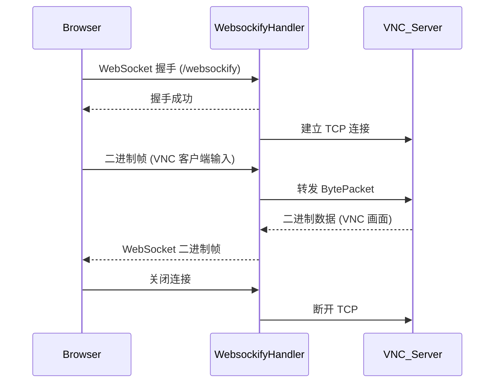

# 消息转发

## 1.tio‑websockify 消息转发服务文档

### 1、项目简介

`tio-websockify` 是一个基于 T‑io 框架的 WebSocket → TCP 转发代理，旨在将来自浏览器的 WebSocket 帧实时转发到后端 TCP 服务（如 VNC Server），并将后端返回的二进制数据封装成 WebSocket 帧回传给前端。

* **核心功能**

  1. 在 WebSocket 握手完成后，主动建立到目标 TCP 服务（VNC Server）的连接；
  2. 接收前端发送的 WebSocket 二进制数据并写入 TCP；
  3. 接收 TCP 返回的原始字节流并以 WebSocket 二进制帧形式推送给前端；
  4. WebSocket 断开时自动关闭对应的 TCP 连接。

### 2、目录结构

```
src/main/java
├─ com.litongjava.websockify.config
│   └─ WebHelloConfig.java         # 启动配置：注册 WebSocket 路由
├─ com.litongjava.websockify.handler
│   ├─ IndexHandler.java           # （可选）首页或测试 Handler
│   ├─ WebsockifyHandler.java      # WebSocket 接入、消息转发核心逻辑
│   └─ TcpRelayClientHandler.java  # TCP 客户端收发处理逻辑
```

### 3、配置说明

在 `app.properties`（或环境变量）中，需配置目标 TCP 服务地址：

```properties
vnc-server=目标主机:端口      # 例如：vnc-server=192.168.1.100:5900
```

> **注意**：`vnc-server` 参数由 `WebsockifyHandler.onAfterHandshaked(...)` 中通过 `EnvUtils.getStr("vnc-server")` 读取。

### 4、使用步骤

1. **启动服务**
   按照常规T‑io Boot Server 启动方式运行主类。
2. **建立 WebSocket 连接**
   客户端向 `ws://<host>:<port>/websockify` 发起 WebSocket 握手。
3. **TCP 连接建立**
   握手成功后，`WebsockifyHandler` 会根据 `vnc-server` 配置自动与 VNC Server 建立 TCP 连接，并在 `wsCtx` 上存储对应的客户端上下文。
4. **消息转发**

   * **前端 → 后端**
     `onBytes(...)` 中，将接收到的 WebSocket 二进制帧封装成 `BytePacket`，通过 `Tio.send(tcpCtx, packet)` 发往 TCP 服务。
   * **后端 → 前端**
     `TcpRelayClientHandler.handler(...)` 中，将从 TCP 服务读到的原始字节数组包装为 `WebSocketResponse.fromBytes(...)`，通过 `Tio.send(wsCtx, wsResp)` 转发回前端。
5. **连接关闭**
   当 WebSocket 断开时，`onClose(...)` 会调用 `Tio.close(tcpCtx, "WS closed")` 断开对应的 TCP 连接，避免资源泄漏。

### 5、核心类说明

#### 1. `WebsockifyHandler`

* **onAfterHandshaked**

  * 从环境变量读取 `vnc-server`，解析主机和端口
  * 创建 `TioClient` 并连接到 VNC Server
  * 将得到的 `ClientChannelContext` 挂载到 `wsCtx`
* **onBytes**

  * 接收前端二进制，转发至 TCP
* **onClose**

  * WebSocket 关闭时断开 TCP
* **onText**

  * （可选）接收文本帧并回显

#### 2. `TcpRelayClientHandler`

* **decode/encode**

  * 将 `ByteBuffer` 与自定义 `BytePacket` 相互转换
* **handler**

  * 将 TCP 读到的字节数组转为 `WebSocketResponse` 并发送至前端

### 6、示例流程图




## 2. 代码

### TcpRelayClientHandler
```java
package com.litongjava.websockify.handler;

import java.nio.ByteBuffer;

import com.litongjava.aio.BytePacket;
import com.litongjava.aio.Packet;
import com.litongjava.tio.client.intf.ClientAioHandler;
import com.litongjava.tio.core.ChannelContext;
import com.litongjava.tio.core.Tio;
import com.litongjava.tio.core.TioConfig;
import com.litongjava.tio.websocket.common.WebSocketResponse;

public class TcpRelayClientHandler implements ClientAioHandler {

  private final ChannelContext wsCtx;

  public TcpRelayClientHandler(ChannelContext wsCtx) {
    this.wsCtx = wsCtx;
  }

  @Override
  public Packet decode(ByteBuffer buffer, int limit, int position, int readableLength, ChannelContext ctx) {
    byte[] bs = new byte[readableLength];
    buffer.get(bs);
    return new BytePacket(bs);
  }

  @Override
  public ByteBuffer encode(Packet packet, TioConfig tioConfig, ChannelContext ctx) {
    BytePacket pkt = (BytePacket) packet;
    byte[] body = pkt.getBytes();
    ByteBuffer buf = ByteBuffer.allocate(body.length);
    buf.order(tioConfig.getByteOrder());
    buf.put(body);
    return buf;
  }

  @Override
  public void handler(Packet packet, ChannelContext tcpCtx) throws Exception {
    // 从 VNC Server 读到 bytes，转发为 WebSocket 二进制帧
    byte[] bs = ((BytePacket) packet).getBytes();
    WebSocketResponse wsResp = WebSocketResponse.fromBytes(bs);
    // 注意：不要走 Tio.send(tcpCtx)，而要把 WS context 传给它
    Tio.send(wsCtx, wsResp);
  }

  @Override
  public Packet heartbeatPacket(ChannelContext channelContext) {
    return null;
  }
}
```
### WebsockifyHandler
```java
package com.litongjava.websockify.handler;

import com.litongjava.aio.BytePacket;
import com.litongjava.tio.client.ClientChannelContext;
import com.litongjava.tio.client.ClientTioConfig;
import com.litongjava.tio.client.ReconnConf;
import com.litongjava.tio.client.TioClient;
import com.litongjava.tio.client.intf.ClientAioHandler;
import com.litongjava.tio.core.ChannelContext;
import com.litongjava.tio.core.Node;
import com.litongjava.tio.core.Tio;
import com.litongjava.tio.http.common.HttpRequest;
import com.litongjava.tio.http.common.HttpResponse;
import com.litongjava.tio.utils.environment.EnvUtils;
import com.litongjava.tio.websocket.common.WebSocketRequest;
import com.litongjava.tio.websocket.common.WebSocketResponse;
import com.litongjava.tio.websocket.common.WebSocketSessionContext;
import com.litongjava.tio.websocket.server.handler.IWebSocketHandler;

import lombok.extern.slf4j.Slf4j;

@Slf4j
public class WebsockifyHandler implements IWebSocketHandler {
  public static final String CHARSET = "utf-8";

  // 在 ChannelContext 上挂一个 key，用来保存对应的 TCP 客户端
  private static final String ATTR_TCP_CLIENT = "tcpClientCtx";

  @Override
  public void onAfterHandshaked(HttpRequest req, HttpResponse resp, ChannelContext wsCtx) throws Exception {
    // 从配置或 URL 参数里拿到要连接的 VNC 服务地址和端口
    String vncServer = EnvUtils.getStr("vnc-server");
    log.info("vnc-server:{}", vncServer);
    if (vncServer == null) {
      log.error("vnc-server can not be empty");
      return;
    }
    String[] split = vncServer.split(":");
    String host = split[0];
    int port = Integer.valueOf(split[1]);

    // 1. 构造并连接到 VNC Server 的 TIO 客户端
    Node node = new Node(host, port);
    ClientAioHandler tcpHandler = new TcpRelayClientHandler(wsCtx);
    ClientTioConfig cfg = new ClientTioConfig(tcpHandler, null, new ReconnConf(0L));
    cfg.setName("vnc-relay");
    TioClient tcpClient = new TioClient(cfg);
    ClientChannelContext tcpCtx = tcpClient.connect(node);

    // 2. 保存到 WS 会话上下文，以便 onBytes/onClose 时能取到
    wsCtx.setAttribute(ATTR_TCP_CLIENT, tcpCtx);

    log.info("已为 WS [{}] 建立到 {}:{} 的 TCP 连接 {}", wsCtx.getId(), host, port, tcpCtx);
  }

  @Override
  public Object onBytes(WebSocketRequest wsReq, byte[] data, ChannelContext wsCtx) throws Exception {
    // 收到 WebSocket 的二进制数据，转发给 TCP 
    ClientChannelContext tcpCtx = (ClientChannelContext) wsCtx.getAttribute(ATTR_TCP_CLIENT);
    if (tcpCtx != null && !tcpCtx.isClosed) {
      // T-io 里我们把字节包裹成 Packet 发出去
      Tio.send(tcpCtx, new BytePacket(data));
    }
    return null;
  }

  @Override
  public Object onClose(WebSocketRequest wsReq, byte[] bytes, ChannelContext wsCtx) throws Exception {
    // WS 关闭时，也断开到 TCP 的连接
    ClientChannelContext tcpCtx = (ClientChannelContext) wsCtx.getAttribute(ATTR_TCP_CLIENT);
    if (tcpCtx != null) {
      Tio.close(tcpCtx, "WS closed");
    }

    return null;
  }

  @Override
  public HttpResponse handshake(HttpRequest httpRequest, HttpResponse httpResponse, ChannelContext channelContext) throws Exception {
    return httpResponse;
  }

  @Override
  public Object onText(WebSocketRequest wsRequest, String text, ChannelContext channelContext) throws Exception {
    WebSocketSessionContext wsSessionContext = (WebSocketSessionContext) channelContext.get();
    String path = wsSessionContext.getHandshakeRequest().getRequestLine().path;
    log.info("路径：{}，收到消息：{}", path, text);

    String message = "{user_id:'" + channelContext.userId + "',message:'" + text + "'}";
    WebSocketResponse wsResponse = WebSocketResponse.fromText(message, CHARSET);
    // 发送消息
    Tio.send(channelContext, wsResponse);
    return null; // 不需要额外的返回值
  }

}
```
### WebHelloConfig
```java
package com.litongjava.websockify.config;

import com.litongjava.context.BootConfiguration;
import com.litongjava.tio.boot.server.TioBootServer;
import com.litongjava.tio.boot.websocket.WebSocketRouter;
import com.litongjava.tio.http.server.router.HttpRequestRouter;
import com.litongjava.websockify.handler.IndexHandler;
import com.litongjava.websockify.handler.WebsockifyHandler;

public class WebHelloConfig implements BootConfiguration {

  public void config() {
    WebSocketRouter router = TioBootServer.me().getWebSocketRouter();
    router.add("/websockify", new WebsockifyHandler());
  }
}

```
---

以上即为 `tio-websockify` 消息转发服务的完整文档，如有疑问或建议，欢迎反馈！
开源地址https://github.com/litongjava/tio-websockify


