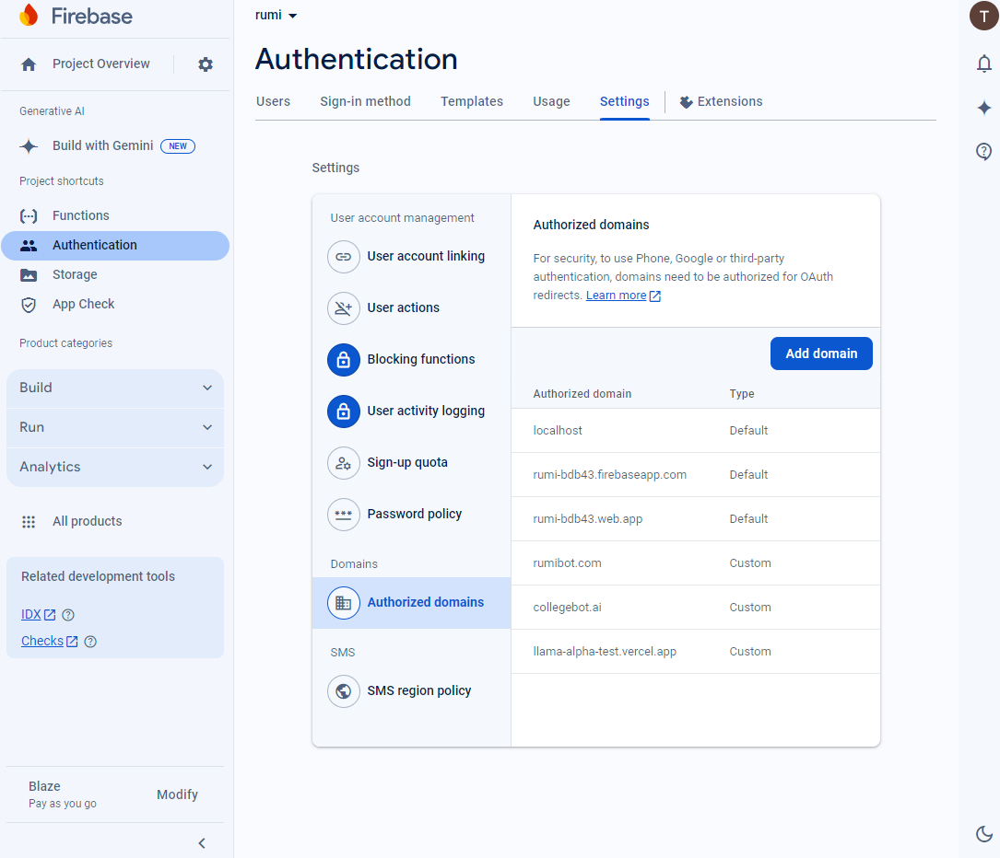

# 用户认证

## 简介

本文档概述了 基于 Firebase Auth 平台的用户认证系统的设计与实现。系统提供用户注册和登录功能，利用 Firebase Authentication 来实现安全的用户管理和邮箱验证。本指南旨在为开发人员和相关人员提供详细的实现说明，帮助他们了解、实现并与提供的认证服务进行交互。

---

## 需求

用户认证系统需满足以下需求：

1. **用户注册**：

   - 用户可以通过邮箱和密码注册。
   - 支持两类用户：学生（`user_type = 0`）和教授（`user_type = 1`）。
   - 注册成功后发送邮箱验证链接。

2. **用户登录**：

   - 用户可以通过已注册的邮箱和密码登录。
   - 通过 Firebase Authentication 验证用户身份。
   - 登录成功后返回 `idToken` 以供会话管理。
   - 正确处理未验证邮箱的用户。

3. **前后端集成**：
   - 提供清晰的 API 接口供前端调用。
   - 确保前后端通信安全。

---

## API 设计

### 1. 注册接口 (`/api/v1/user/register`)

#### 1.1 前端请求

当用户提交注册信息时，前端将用户的邮箱、密码和用户类型发送给后端，后端负责处理注册逻辑并发送邮箱验证链接。

**请求参数**：

- `email` (string): 用户的邮箱地址。
- `password` (string): 用户的密码。
- `user_type` (integer): 用户类型（`0` 表示学生，`1` 表示教授）。

**请求示例**：

```http
POST /api/v1/user/register
Content-Type: application/json

{
  "email": "user@example.com",
  "password": "userpassword",
  "user_type": 1
}
```

#### 1.2 后端处理逻辑

收到注册请求后，后端执行以下步骤：

1. **输入验证**：

   - 使用 `EmailValidator` 验证邮箱格式。
   - 使用 `PasswordValidator` 验证密码强度。
   - 检查是否提供 `user_type` 参数。
   - 检查邮箱是否已被注册。

2. **创建用户**：

   - 使用 Firebase Authentication 的 `createUserWithEmailAndPassword()` 方法创建用户。
   - 在数据库中存储用户信息，包括用户类型。

3. **发送邮箱验证**：
   - 使用 Firebase 的 `generateEmailVerificationLink()` 生成邮箱验证链接。
   - 使用 `EmailService` 发送验证邮件。

**后端响应示例**：

```json
{
  "data": null,
  "ok": true,
  "msg": null,
  "code": 1
}
```

#### 1.3 前端处理逻辑

前端接收到成功的响应后应：

- 提示用户验证邮件已发送。
- 引导用户检查邮箱并完成验证。

用户点击邮箱中的链接完成邮件验证,验证成功有跳转到前端的登录界面

### 2. 登录接口 (`/api/v1/user/login`)

#### 2.1 前端请求

当用户提交登录信息时，前端将用户的邮箱和密码发送到后端。后端验证用户身份后返回 `idToken`，前端使用该 token 同步 Firebase 的认证状态。

**请求参数**：

- `email` (string): 用户的邮箱地址。
- `password` (string): 用户的密码。

**请求示例**：

```http
POST /api/v1/user/login
Content-Type: application/json

{
  "email": "user@example.com",
  "password": "userpassword"
}
```

#### 2.2 后端处理逻辑

后端执行以下步骤：

1. **用户验证**：

   - 验证用户的邮箱和密码是否匹配。
   - 检查用户的邮箱是否已验证。

2. **生成 Token**：

   - 使用 Firebase 生成用户的自定义 token (`idToken`)，并附加额外的声明（如 `user_type`）。

3. **构造响应**：
   - 返回 token 及相关状态信息给前端。

**后端响应参数**：

- `token` (string): 返回给前端的 Firebase `idToken`。
- `code` (integer): 状态码（`1` 表示成功）。
- `msg` (string): 状态消息（成功时为 `null`）。
- `ok` (boolean): 操作状态（`true` 表示成功）。

**后端响应示例（登录成功）**：

```json
{
  "data": {
    "token": "eyJhbGciOiJSUzI1NiJ9..."
  },
  "code": 1,
  "msg": null,
  "ok": true
}
```

#### 2.3 前端处理逻辑

前端收到 `idToken` 后使用该 token 登录并同步 Firebase 认证状态：

```javascript
const idToken = "后端返回的idToken";

firebase
  .auth()
  .signInWithCustomToken(idToken)
  .then((userCredential) => {
    // 登录成功，处理用户信息
    const user = firebase.auth().currentUser;
    console.log("用户信息:", user);
  })
  .catch((error) => {
    console.error("登录失败：", error);
  });
```

---

## 代码

### 1. 注册服务 (`UserRegisterService`)

#### 概述

`UserRegisterService` 类负责处理用户注册逻辑，包括输入验证、用户创建、邮箱验证链接发送等功能。

#### 关键组件

- **输入验证**：

  - 使用 `EmailValidator` 验证邮箱格式。
  - 使用 `PasswordValidator` 验证密码强度。
  - 检查 `user_type` 是否有效。
  - 检查邮箱是否已在数据库中注册。

- **用户创建**：

  - 使用 Firebase Authentication 的 `CreateRequest` 创建用户。
  - 在数据库中存储用户信息，包括 `user_type`。

- **邮箱验证**：
  - 使用 `FirebaseAuth` 生成邮箱验证链接。
  - 使用 `EmailService` 发送验证邮件。

#### 代码亮点

- **验证逻辑**：

```java
import java.util.ArrayList;
import java.util.List;

import com.google.firebase.auth.ActionCodeSettings;
import com.google.firebase.auth.ActionCodeSettings.Builder;
import com.google.firebase.auth.FirebaseAuth;
import com.google.firebase.auth.FirebaseAuthException;
import com.google.firebase.auth.UserRecord;
import com.google.firebase.auth.UserRecord.CreateRequest;
import com.litongjava.db.activerecord.Db;
import com.litongjava.jfinal.aop.Aop;
import com.litongjava.model.body.RespBodyVo;
import com.litongjava.model.validate.ValidateResult;
import com.litongjava.open.chat.constants.TableNames;
import com.litongjava.open.chat.dao.CollegeCoursesUsersDao;
import com.litongjava.open.chat.model.UserRegisterVo;
import com.litongjava.open.chat.services.email.EmailService;
import com.litongjava.tio.utils.validator.EmailValidator;
import com.litongjava.tio.utils.validator.PasswordValidator;

public class UserRegisterService {

public RespBodyVo register(UserRegisterVo vo, String origin) {
List<ValidateResult> validateResults = new ArrayList<>();
String email = vo.getEmail();
String password = vo.getPassword();
Integer user_type = vo.getUser_type();
boolean validate = EmailValidator.validate(email);

    boolean ok = true;
    if (!validate) {
      ValidateResult validateResult = ValidateResult.by("eamil", "Failed to valiate email:" + email);
      validateResults.add(validateResult);
      ok = false;
    }
    validate = PasswordValidator.validate(password);
    if (!validate) {
      ValidateResult validateResult = ValidateResult.by("password", "Failed to valiate password:" + password);
      validateResults.add(validateResult);
      ok = false;
    }

    if (user_type == null) {
      ValidateResult validateResult = ValidateResult.by("user_type", "user_type can not be empty");
      validateResults.add(validateResult);
      ok = false;
    }
    boolean exists = Db.exists(TableNames.college_courses_users, "user_email", email);
    if (exists) {
      ValidateResult validateResult = ValidateResult.by("eamil", "Eamil already taken" + email);
      validateResults.add(validateResult);
    }
    if (!ok) {
      return RespBodyVo.failData(validateResults);
    }

    FirebaseAuth auth = FirebaseAuth.getInstance();
    CreateRequest createVo = new CreateRequest();
    createVo.setEmail(email);
    createVo.setPassword(password);
    UserRecord userRecord = null;
    try {
      userRecord = auth.createUser(createVo);
    } catch (FirebaseAuthException e) {
      e.printStackTrace();
      return RespBodyVo.fail(e.getMessage());
    }

    String uid = userRecord.getUid();
    ok = Aop.get(CollegeCoursesUsersDao.class).createUser(uid, email, password, user_type);
    if (!ok) {
      return RespBodyVo.fail("Failed to create user");
    }

    String url = origin + "/auth/login?role=";
    if (user_type == 0) {
      url += "instructor";
    } else {
      url += "student";
    }

    Builder builder = ActionCodeSettings.builder().setUrl(url) // 验证后跳转的URL
        .setHandleCodeInApp(false); // 设置为false，因为这是Web应用，不是移动应用

    ActionCodeSettings actionCodeSettings = null;
    try {
      actionCodeSettings = builder.build();
    } catch (Exception e) {
      return RespBodyVo.fail(e.getMessage());
    }

    String emailVerificationLink = null;
    try {
      emailVerificationLink = auth.generateEmailVerificationLink(email, actionCodeSettings);
    } catch (FirebaseAuthException e) {
      e.printStackTrace();
      return RespBodyVo.fail(e.getMessage());
    }
    ok = Aop.get(EmailService.class).sendVerificationLink(email, origin, emailVerificationLink);
    if (!ok) {
      return RespBodyVo.fail("Failed to send email");
    }
    return RespBodyVo.ok();

}

```

### 2. 邮件服务

(`EmailService`)

#### 概述

`EmailService` 类负责将邮箱验证链接发送到用户的邮箱。

#### 关键组件

- **模板渲染**：

- 使用 JFinal 的模板引擎从 `register_mail.txt` 中渲染邮件内容。

- **邮件发送**：
- 使用 `EMailUtils` 发送邮件。

#### 代码亮点

- **渲染邮件内容**：

```java
import com.jfinal.kit.Kv;
import com.jfinal.template.Engine;
import com.jfinal.template.Template;
import com.litongjava.tio.utils.email.EMailUtils;

public class EmailService {

  public boolean sendVerificationLink(String email, String origin, String emailVerificationLink) {
    Template template = Engine.use().getTemplate("register_mail.txt");
    String content = template.renderToString(Kv.by("link", emailVerificationLink));
    try {
      EMailUtils.send(email, "College Bot AI Email Verification", content);
      return true;
    } catch (Exception e) {
      e.printStackTrace();
    }
    return false;
  }
}
```

- **邮件模板 (`register_mail.txt`)**：

  ```
  Dear User,

  Thank you for signing up for 基于Firebase Auth!

  Please verify your email address by clicking the link below:
  #(link)

  This will ensure your account is secure and fully activated.

  If you did not request this verification, please disregard this email.

  Best regards,
  The 基于Firebase Auth Team
  ```

### 3. 登录服务 (`UserLoginService`)

#### 概述

`UserLoginService` 类负责处理用户登录验证，并在成功登录后生成自定义 token 供前端使用。

#### 关键组件

- **用户验证**：

  - 验证用户邮箱和密码是否匹配。
  - 检查用户邮箱是否已验证。

- **生成 Token**：

  - 生成带有额外声明（如 `user_type`）的 Firebase 自定义 token。

- **响应处理**：
  - 返回 token 及状态信息给前端。

#### 代码亮点

```java
import java.util.HashMap;
import java.util.Map;

import com.google.firebase.auth.FirebaseAuth;
import com.google.firebase.auth.FirebaseAuthException;
import com.jfinal.kit.Kv;
import com.litongjava.db.activerecord.Record;
import com.litongjava.jfinal.aop.Aop;
import com.litongjava.model.body.RespBodyVo;
import com.litongjava.open.chat.dao.CollegeCoursesUsersDao;
import com.litongjava.open.chat.model.UserRegisterVo;

public class UserLoginService {

  public RespBodyVo login(UserRegisterVo vo) {
    String email = vo.getEmail();
    String password = vo.getPassword();

    Record record = Aop.get(CollegeCoursesUsersDao.class).login(email, password);
    if (record == null) {
      return RespBodyVo.fail("username or password is not correct");
    }

    String uid = record.getStr("id");
    Integer user_type = record.getInt("user_type");
    String customToken = null;
    try {
      Map<String, Object> additionalClaims = new HashMap<>();
      additionalClaims.put("user_type", user_type);
      customToken = FirebaseAuth.getInstance().createCustomToken(uid, additionalClaims);
    } catch (FirebaseAuthException e) {
      e.printStackTrace();
      return RespBodyVo.fail(e.getMessage());
    }
    return RespBodyVo.ok(Kv.by("token", customToken));
  }
}

```

---

## 测试

### 1. 注册服务测试 (`UserRegisterServiceTest`)

#### 目的

测试注册逻辑，确保用户能够正确注册并收到验证邮件。

#### 测试代码

```java
import org.junit.Test;

import com.litongjava.jfinal.aop.Aop;
import com.litongjava.model.body.RespBodyVo;
import com.litongjava.open.chat.config.DbConfig;
import com.litongjava.open.chat.config.EnjoyEngineConfig;
import com.litongjava.open.chat.config.FirebaseAppConfiguration;
import com.litongjava.open.chat.model.UserRegisterVo;
import com.litongjava.tio.utils.environment.EnvUtils;
import com.litongjava.tio.utils.json.JsonUtils;

public class UserRegisterServiceTest {

  @Test
  public void testRegistration() {
    // 加载环境配置
    EnvUtils.load();
    new DbConfig().config();
    new FirebaseAppConfiguration().config();
    new EnjoyEngineConfig().config();

    // 初始化服务
    UserRegisterService userRegisterService = Aop.get(UserRegisterService.class);

    // 创建测试用户
    UserRegisterVo userRegisterVo = new UserRegisterVo();
    userRegisterVo.setEmail("testuser@example.com")
                  .setPassword("TestPassword123")
                  .setUser_type(0);

    // 注册用户
    RespBodyVo response = userRegisterService.register(userRegisterVo, "http://localhost:3000");

    // 输出响应结果
    System.out.println(JsonUtils.toJson(response));
  }
}
```

### 2. 登录服务测试 (`UserLoginServiceTest`)

#### 目的

测试登录功能，确保用户能够验证身份并获得自定义 token。

#### 测试代码

```java
import com.litongjava.jfinal.aop.Aop;
import com.litongjava.model.body.RespBodyVo;
import com.litongjava.open.chat.config.DbConfig;
import com.litongjava.open.chat.config.FirebaseAppConfiguration;
import com.litongjava.open.chat.model.UserRegisterVo;
import com.litongjava.tio.utils.environment.EnvUtils;
import com.litongjava.tio.utils.json.JsonUtils;

public class UserLoginServiceTest {

  @Test
  public void testLogin() {
    // 加载环境配置
    EnvUtils.load();
    new DbConfig().config();
    new FirebaseAppConfiguration().config();

    // 初始化服务
    UserLoginService userLoginService = Aop.get(UserLoginService.class);

    // 创建登录信息
    UserRegisterVo userRegisterVo = new UserRegisterVo();
    userRegisterVo.setEmail("testuser@example.com")
                  .setPassword("TestPassword123");

    // 登录用户
    RespBodyVo response = userLoginService.login(userRegisterVo);

    // 输出响应结果
    System.out.println(JsonUtils.toJson(response));
  }
}
```

---

## 结论

本用户认证系统提供了稳健的注册和登录功能，借助 Firebase Authentication 实现安全的用户管理和邮箱验证。服务包含详细的验证、错误处理及前端集成点。通过本文档，开发人员可以全面了解并高效利用该认证服务，确保 基于 Firebase Auth 平台用户的安全和顺畅体验。

## 错误记录

### UNAUTHORIZED_DOMAIN : Domain not whitelisted by project

生成邮件时出现下的错误

```json
{
  "error": {
    "code": 400,
    "message": "UNAUTHORIZED_DOMAIN : Domain not whitelisted by project",
    "errors": [
      {
        "message": "UNAUTHORIZED_DOMAIN : Domain not whitelisted by project",
        "domain": "global",
        "reason": "invalid"
      }
    ]
  }
}
```

添加域名授权

