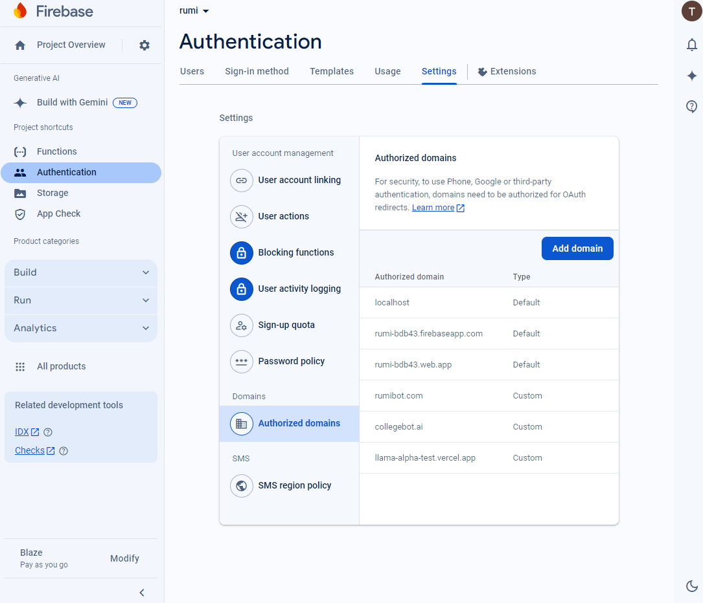

# 登录注册

## 简介

本文档概述了基于 Firebase Auth 平台的用户认证系统的设计与实现。系统提供用户注册、登录、密码重置功能，利用 Firebase Authentication 实现安全的用户管理和邮箱验证。本指南旨在为开发人员和相关人员提供详细的实现说明，帮助他们了解、实现并与提供的认证服务进行交互。

---

## 需求

用户认证系统需满足以下需求：

1. **用户注册**：

   - 用户可以通过邮箱和密码注册。
   - 支持两类用户：学生（`user_type = 0`）和教授（`user_type = 1`）。
   - 注册成功后发送邮箱验证链接。

2. **用户登录**：

   - 用户可以通过已注册的邮箱和密码登录。
   - 通过 Firebase Authentication 验证用户身份。
   - 登录成功后返回 `idToken` 以供会话管理。
   - 正确处理未验证邮箱的用户。

3. **密码重置**：

   - 用户可以请求重置密码，系统发送验证码到用户邮箱。
   - 用户通过验证码和新密码完成密码重置。

4. **前后端集成**：

   - 提供清晰的 API 接口供前端调用。
   - 确保前后端通信安全。

---

## API 设计

本文档定义了四个主要的 API 接口：

1. **注册接口** (`/api/v1/user/register`)
2. **登录接口** (`/api/v1/user/login`)
3. **发送重置密码验证码接口** (`/api/v1/user/sendResetCode`)
4. **重置密码接口** (`/api/v1/user/reset`)

### 1. 注册接口 (`/api/v1/user/register`)

#### 1.1 前端请求

当用户提交注册信息时，前端将用户的邮箱、密码和用户类型发送给后端，后端负责处理注册逻辑并发送邮箱验证链接。

**请求参数**：

- `email` (string): 用户的邮箱地址。
- `password` (string): 用户的密码。
- `user_type` (integer): 用户类型（`0` 表示学生，`1` 表示教授）。

**请求示例**：

```http
POST /api/v1/user/register
Content-Type: application/json

{
  "email": "user@example.com",
  "password": "userpassword",
  "user_type": 1
}
```

#### 1.2 后端处理逻辑

收到注册请求后，后端执行以下步骤：

1. **输入验证**：

   - 使用 `EmailValidator` 验证邮箱格式。
   - 使用 `PasswordValidator` 验证密码强度。
   - 检查是否提供 `user_type` 参数。
   - 检查邮箱是否已被注册。

2. **创建用户**：

   - 使用 Firebase Authentication 的 `createUserWithEmailAndPassword()` 方法创建用户。
   - 在数据库中存储用户信息，包括用户类型。

3. **发送邮箱验证**：

   - 使用 Firebase 的 `generateEmailVerificationLink()` 生成邮箱验证链接。
   - 使用 `EmailService` 发送验证邮件。

**后端响应示例**：

```json
{
  "data": null,
  "ok": true,
  "msg": null,
  "code": 1
}
```

#### 1.3 前端处理逻辑

前端接收到成功的响应后应：

- 提示用户验证邮件已发送。
- 引导用户检查邮箱并完成验证。

用户点击邮箱中的链接完成邮件验证，验证成功后跳转到前端的登录界面。

### 2. 登录接口 (`/api/v1/user/login`)

#### 2.1 前端请求

当用户提交登录信息时，前端将用户的邮箱和密码发送到后端。后端验证用户身份后返回 `idToken`，前端使用该 token 同步 Firebase 的认证状态。

**请求参数**：

- `email` (string): 用户的邮箱地址。
- `password` (string): 用户的密码。

**请求示例**：

```http
POST /api/v1/user/login
Content-Type: application/json

{
  "email": "user@example.com",
  "password": "userpassword"
}
```

#### 2.2 后端处理逻辑

后端执行以下步骤：

1. **用户验证**：

   - 验证用户的邮箱和密码是否匹配。
   - 检查用户的邮箱是否已验证。

2. **生成 Token**：

   - 使用 Firebase 生成用户的自定义 token (`idToken`)，并附加额外的声明（如 `user_type`）。

3. **构造响应**：

   - 返回 token 及相关状态信息给前端。

**后端响应参数**：

- `token` (string): 返回给前端的 Firebase `idToken`。
- `code` (integer): 状态码（`1` 表示成功）。
- `msg` (string): 状态消息（成功时为 `null`）。
- `ok` (boolean): 操作状态（`true` 表示成功）。

**后端响应示例（登录成功）**：

```json
{
  "data": {
    "token": "eyJhbGciOiJSUzI1NiJ9..."
  },
  "code": 1,
  "msg": null,
  "ok": true
}
```

#### 2.3 前端处理逻辑

前端收到 `idToken` 后使用该 token 登录并同步 Firebase 认证状态：

```javascript
const idToken = "后端返回的idToken";

firebase
  .auth()
  .signInWithCustomToken(idToken)
  .then((userCredential) => {
    // 登录成功，处理用户信息
    const user = firebase.auth().currentUser;
    console.log("用户信息:", user);
  })
  .catch((error) => {
    console.error("登录失败：", error);
  });
```

### 3. 发送重置密码验证码接口 (`/api/v1/user/sendResetCode`)

#### 3.1 前端请求

当用户请求重置密码时，前端将用户的邮箱发送到后端，后端生成验证码并发送到用户邮箱。

**请求参数**：

- `email` (string): 用户的邮箱地址。

**请求示例**：

```http
POST /api/v1/user/sendResetCode
Content-Type: application/json

{
  "email": "user@example.com"
}
```

#### 3.2 后端处理逻辑

后端执行以下步骤：

1. **请求频率限制**：

   - 检查用户是否在规定时间内（如 60 秒）已请求过验证码，防止滥用。

2. **生成验证码**：

   - 生成一个 6 位随机数字验证码。

3. **存储验证码**：

   - 将验证码与用户邮箱存储在数据库中，并记录生成时间。

4. **发送验证码邮件**：

   - 使用 `EmailService` 发送包含验证码的邮件给用户。

**后端响应示例**：

```json
{
  "data": null,
  "ok": true,
  "msg": null,
  "code": 1
}
```

#### 3.3 前端处理逻辑

前端接收到成功的响应后应：

- 提示用户验证码已发送至邮箱。
- 引导用户检查邮箱并输入验证码完成密码重置。

### 4. 重置密码接口 (`/api/v1/user/reset`)

#### 4.1 前端请求

当用户提交重置密码信息时，前端将用户的邮箱、验证码和新密码发送到后端，后端验证验证码并更新密码。

**请求参数**：

- `email` (string): 用户的邮箱地址。
- `code` (integer): 验证码。
- `password` (string): 新密码。

**请求示例**：

```http
POST /api/v1/user/reset
Content-Type: application/json

{
  "email": "user@example.com",
  "code": 123456,
  "password": "newpassword123"
}
```

#### 4.2 后端处理逻辑

后端执行以下步骤：

1. **验证验证码**：

   - 检查提供的验证码是否与存储的验证码匹配，并且未过期。

2. **更新密码**：

   - 使用 Firebase Authentication 更新用户的密码。
   - 更新数据库中的密码哈希。

3. **清除验证码**：

   - 从数据库中删除已使用的验证码，防止重复使用。

**后端响应示例**：

```json
{
  "data": null,
  "ok": true,
  "msg": null,
  "code": 1
}
```

#### 4.3 前端处理逻辑

前端接收到成功的响应后应：

- 提示用户密码已成功重置。
- 引导用户使用新密码登录。

---

## 数据库设计

```sql
CREATE TABLE "public"."max_blog_users" (
  "id" VARCHAR PRIMARY KEY,                      -- 用户唯一标识 (对应 uid)
  "email" VARCHAR NOT NULL UNIQUE,               -- 用户邮箱
  "email_verified" BOOLEAN DEFAULT FALSE,        -- 邮箱是否已验证
  "display_name" VARCHAR,                        -- 用户显示名称
  bio TEXT,
  "photo_url" VARCHAR,                           -- 用户头像 URL
  "phone_number" VARCHAR,                        -- 用户电话号码
  "disabled" BOOLEAN DEFAULT FALSE,              -- 用户是否已禁用
  "birthday" TIMESTAMPTZ,                        -- 用户生日 (可选)
  "coin" BIGINT DEFAULT 0,                       -- 用户金币数量
  "invited_by_user_id" VARCHAR,                  -- 邀请人的用户 ID
  "platform" VARCHAR,                            -- 用户注册的平台
  "third_platform_url" VARCHAR,                  -- 第三方平台的 URL
  "school_id" BIGINT,                            -- 学校 ID (可选字段)
  "user_type" INT DEFAULT 0,                     -- 用户类型 (如 0: 普通用户, 1: 管理员等)
  "password_salt" VARCHAR,                       -- 密码加盐 (用于存储加密的密码相关信息)
  "password_hash" VARCHAR,                       -- 密码哈希值
  "tokens_valid_after_time" TIMESTAMP,           -- 标记 Token 失效时间
  provider_data JSONB DEFAULT '[]',              -- 提供信息，存储为 JSON 格式
  "mfa_info" JSONB DEFAULT '[]',                 -- 多因素认证信息，存储为 JSON 格式
  "metadata" JSONB DEFAULT '{}',                  -- 用户元数据 (如创建时间、最后登录时间)
  "remark" VARCHAR,                              -- 备注信息
  "creator" VARCHAR DEFAULT ''::character varying, -- 创建人
  "create_time" TIMESTAMPTZ NOT NULL DEFAULT CURRENT_TIMESTAMP, -- 创建时间
  "updater" VARCHAR DEFAULT ''::character varying, -- 更新人
  "update_time" TIMESTAMPTZ NOT NULL DEFAULT CURRENT_TIMESTAMP, -- 更新时间
  "deleted" SMALLINT NOT NULL DEFAULT 0,         -- 逻辑删除标识 (0: 未删除, 1: 已删除)
  "tenant_id" BIGINT NOT NULL DEFAULT 0         -- 租户 ID (支持多租户架构)
);

CREATE TABLE "public"."rumi_reset_password_code" (
  "email" varchar NOT NULL PRIMARY KEY,
  "code" int,
  create_time TIMESTAMP WITHOUT TIME ZONE NOT NULL DEFAULT CURRENT_TIMESTAMP
);
```

---

## DAO

### `MaxBlogUserDao`

```java
package com.litongjava.max.blog.dao;

import com.litongjava.db.activerecord.Db;
import com.litongjava.db.activerecord.Row;
import com.litongjava.max.blog.consts.TableNames;
import com.litongjava.tio.utils.encoder.Sha1Utils;

public class MaxBlogUserDao {

  public boolean createUser(String uid, String email, String password, Integer user_type) {
    byte[] sha1 = Sha1Utils.SHA1(password);
    password = new String(sha1);
    Row row = Row.by("id", uid)
                          .set("email", email)
                          .set("password_hash", password)
                          .set("user_type", user_type);
    return Db.save(TableNames.max_blog_users, row);
  }

  public Row login(String email, String password) {
    byte[] sha1 = Sha1Utils.SHA1(password);
    password = new String(sha1);
    String sql = String.format("SELECT id, user_type FROM %s WHERE email=? AND password_hash=?", TableNames.max_blog_users);
    return Db.findFirst(sql, email, password);
  }

  public String getUidByEmail(String email) {
    String sql = String.format("SELECT id FROM %s WHERE email=?", TableNames.max_blog_users);
    return Db.queryStr(sql, email);
  }

  public int updatePassword(String email, String password) {
    byte[] sha1 = Sha1Utils.SHA1(password);
    password = new String(sha1);
    String sql = String.format("UPDATE %s SET password_hash = ? WHERE email = ?", TableNames.max_blog_users);
    return Db.updateBySql(sql, password, email);
  }
}
```

### `ResetPasswordCodeDao`

```java
package com.litongjava.open.chat.dao;

import com.litongjava.db.activerecord.Db;
import com.litongjava.db.activerecord.Row;
import com.litongjava.open.chat.constants.TableNames;
import com.litongjava.tio.utils.hutool.RandomUtils;

public class ResetPasswordCodeDao {

  public Integer getCode(String email, Long seconds) {
    String sql = String.format(
        "SELECT code FROM %s WHERE email = ? AND create_time > NOW() - INTERVAL '%d seconds'",
        TableNames.rumi_reset_password_code, seconds);
    return Db.queryInt(sql, email);
  }

  public Integer newCode(String email) {
    int code = RandomUtils.nextInt(100000, 999999);

    Db.tx(() -> {
      Db.deleteById(TableNames.rumi_reset_password_code, "email", email);
      Row row = Row.by("email", email).set("code", code);
      return Db.save(TableNames.rumi_reset_password_code, row);
    });
    return code;
  }

  public boolean validateCode(String email, Integer code) {
    String sql = String.format("SELECT COUNT(1) FROM %s WHERE email=? AND code=?", TableNames.rumi_reset_password_code);
    boolean exists = Db.existsBySql(sql, email, code);
    if (exists) {
      sql = String.format("DELETE FROM %s WHERE email=? AND code=?", TableNames.rumi_reset_password_code);
      Db.delete(sql, email, code);
      return true;
    }
    return false;
  }
}
```

---

## 发送邮件

### 邮件服务 (`EmailService`)

```java
package com.litongjava.max.blog.service;

import com.jfinal.kit.Kv;
import com.jfinal.template.Engine;
import com.jfinal.template.Template;
import com.litongjava.max.blog.utils.MailJetUtils;
import com.mailjet.client.MailjetResponse;

import lombok.extern.slf4j.Slf4j;

@Slf4j
public class EmailService {

  public boolean sendVerificationLink(String email, String origin, String link) {

    // 加载邮件模板
    Template template = Engine.use().getTemplate("register_mail.txt");

    String content = template.renderToString(Kv.by("link", link));

    // 从邮箱地址中提取用户名作为收件人姓名
    String name = email.split("@")[0];

    String subject = "College Bot AI 邮箱验证";
    // 发送文本格式的验证邮件
    try {
      MailjetResponse response = MailJetUtils.sendText(name, email, subject, content);
      int status = response.getStatus();
      if (status == 200) {
        return true;
      } else {
        log.error(response.getRawResponseContent());
        return false;
      }

    } catch (Exception e) {
      log.error("发送验证邮件失败", e);
      return false;
    }
  }

  public boolean sendVerificationCode(String email, Integer code) {
    Template template = Engine.use().getTemplate("reset_mail.txt");
    String content = template.renderToString(Kv.by("code", code));
    // 从邮箱地址中提取用户名作为收件人姓名
    String name = email.split("@")[0];

    String subject = "College Bot AI 密码重置验证码";
    try {
      MailJetUtils.sendText(name, email, subject, content);
      return true;
    } catch (Exception e) {
      log.error("发送重置密码验证码失败", e);
      return false;
    }
  }
}
```

### 邮件模板

#### 注册邮件模板 (`register_mail.txt`)

```
亲爱的用户，

感谢您注册 College Bot AI！

请点击以下链接验证您的邮箱地址：
#(link)

这将确保您的账户安全并完全激活。

如果您未请求此验证，请忽略此邮件。

此致，
College Bot AI 团队
```

#### 重置密码验证码邮件模板 (`reset_mail.txt`)

```
亲爱的用户，

我们收到您请求重置 College Bot AI 账户密码的请求。

请使用以下验证码重置您的密码：
#(code)

如果您未请求重置密码，请忽略此邮件或联系支持团队。

此致，
College Bot AI 团队
```

### 模板引擎配置

```java
package com.litongjava.open.chat.config;

import com.jfinal.template.Engine;
import com.litongjava.tio.utils.environment.EnvUtils;

public class EnjoyEngineConfig {

  private final String RESOURCE_BASE_PATH = "/enjoy-templates/";

  public void config() {
    Engine engine = Engine.use();
    engine.setBaseTemplatePath(RESOURCE_BASE_PATH);
    engine.setToClassPathSourceFactory();
    if (EnvUtils.isDev()) {
      // 支持模板热加载，绝大多数生产环境下也建议配置成 true，除非是极端高性能的场景
      engine.setDevMode(true);
    }

    // 配置极速模式，性能提升 13%
    Engine.setFastMode(true);
    // jfinal 4.9.02 新增配置：支持中文表达式、中文变量名、中文方法名、中文模板函数名
    Engine.setChineseExpression(true);
  }

}
```

---

## Controller

```java
package com.litongjava.max.blog.controller;

import com.litongjava.annotation.RequestPath;
import com.litongjava.jfinal.aop.Aop;
import com.litongjava.max.blog.service.UserLoginService;
import com.litongjava.max.blog.service.UserPasswordService;
import com.litongjava.max.blog.service.UserRegisterService;
import com.litongjava.max.blog.vo.UserRegisterVo;
import com.litongjava.max.blog.vo.UserResetVo;
import com.litongjava.model.body.RespBodyVo;
import com.litongjava.tio.boot.http.TioRequestContext;

@RequestPath("/api/v1/user")
public class ApiV1UserController {

  /**
   * 用户注册
   */
  public RespBodyVo register(UserRegisterVo vo) {
    String origin = TioRequestContext.getRequest().getHeader("origin");
    return Aop.get(UserRegisterService.class).register(vo, origin);
  }

  /**
   * 用户登录
   */
  public RespBodyVo login(UserRegisterVo vo) {
    return Aop.get(UserLoginService.class).login(vo);
  }

  /**
   * 发送重置密码验证码
   */
  public RespBodyVo sendResetCode(String email) {
    return Aop.get(UserPasswordService.class).sendResetCode(email);
  }

  /**
   * 重置密码
   */
  public RespBodyVo reset(UserResetVo vo) {
    return Aop.get(UserPasswordService.class).reset(vo);
  }
}
```

---

## Interceptor

```java
import com.litongjava.annotation.AConfiguration;
import com.litongjava.annotation.Initialization;
import com.litongjava.max.blog.inteceptor.AuthInterceptor;
import com.litongjava.tio.boot.http.interceptor.HttpInteceptorConfigure;
import com.litongjava.tio.boot.http.interceptor.HttpInterceptorModel;
import com.litongjava.tio.boot.server.TioBootServer;
import com.litongjava.tio.http.server.intf.HttpRequestInterceptor;

@AConfiguration
public class InterceptorConfiguration {

  @Initialization
  public void config() {
    HttpRequestInterceptor authTokenInterceptor = new AuthInterceptor();
    HttpInterceptorModel model = new HttpInterceptorModel();
    model.setInterceptor(authTokenInterceptor);
    model.addBlockUrl("/**"); // 拦截所有路由
    model.addAllowUrls(
      "",
      "/",
      "/api/v1/user/register",
      "/api/v1/user/login",
      "/api/v1/user/sendResetCode",
      "/api/v1/user/reset"
    );

    HttpInteceptorConfigure serverInteceptorConfigure = new HttpInteceptorConfigure();
    serverInteceptorConfigure.add(model);
    TioBootServer.me().setHttpInteceptorConfigure(serverInteceptorConfigure);
  }
}
```

---

## 注册服务 (`UserRegisterService`)

### 概述

`UserRegisterService` 类负责处理用户注册逻辑，包括输入验证、用户创建、邮箱验证链接发送等功能。

### 业务逻辑

- **输入验证**：

  - 使用 `EmailValidator` 验证邮箱格式。
  - 使用 `PasswordValidator` 验证密码强度。
  - 检查 `user_type` 是否有效。
  - 检查邮箱是否已在数据库中注册。

- **用户创建**：

  - 使用 Firebase Authentication 的 `CreateRequest` 创建用户。
  - 在数据库中存储用户信息，包括 `user_type`。

- **邮箱验证**：

  - 使用 `FirebaseAuth` 生成邮箱验证链接。
  - 使用 `EmailService` 发送验证邮件。

### 代码实现

#### 用户注册请求对象 (`UserRegisterVo`)

```java
package com.litongjava.open.chat.model;

import lombok.AllArgsConstructor;
import lombok.Data;
import lombok.NoArgsConstructor;
import lombok.experimental.Accessors;

@Data
@NoArgsConstructor
@AllArgsConstructor
@Accessors(chain=true)
public class UserRegisterVo {
  private String email;
  private String password;
  private Integer user_type;
}
```

#### 注册逻辑

```java
package com.litongjava.max.blog.service;

import java.util.ArrayList;
import java.util.List;

import com.google.firebase.auth.ActionCodeSettings;
import com.google.firebase.auth.FirebaseAuth;
import com.google.firebase.auth.FirebaseAuthException;
import com.google.firebase.auth.UserRecord;
import com.google.firebase.auth.UserRecord.CreateRequest;
import com.litongjava.db.activerecord.Db;
import com.litongjava.jfinal.aop.Aop;
import com.litongjava.max.blog.consts.TableNames;
import com.litongjava.max.blog.dao.MaxBlogUserDao;
import com.litongjava.max.blog.vo.UserRegisterVo;
import com.litongjava.model.body.RespBodyVo;
import com.litongjava.model.validate.ValidateResult;
import com.litongjava.tio.utils.hutool.StrUtil;
import com.litongjava.tio.utils.validator.EmailValidator;
import com.litongjava.tio.utils.validator.PasswordValidator;

public class UserRegisterService {

  public RespBodyVo register(UserRegisterVo vo, String origin) {
    List<ValidateResult> validateResults = new ArrayList<>();
    String email = vo.getEmail();
    String password = vo.getPassword();
    Integer user_type = vo.getUser_type();
    boolean validate = EmailValidator.validate(email);

    boolean ok = true;
    if (StrUtil.isEmpty(origin)) {
      ValidateResult validateResult = ValidateResult.by("origin", "Failed to validate origin: " + origin);
      validateResults.add(validateResult);
      ok = false;
    }
    if (!validate) {
      ValidateResult validateResult = ValidateResult.by("email", "Invalid email format: " + email);
      validateResults.add(validateResult);
      ok = false;
    }
    validate = PasswordValidator.validate(password);
    if (!validate) {
      ValidateResult validateResult = ValidateResult.by("password", "Password does not meet strength requirements.");
      validateResults.add(validateResult);
      ok = false;
    }

    if (user_type == null || (user_type != 0 && user_type != 1)) {
      ValidateResult validateResult = ValidateResult.by("user_type", "Invalid user type.");
      validateResults.add(validateResult);
      ok = false;
    }

    if (!ok) {
      return RespBodyVo.failData(validateResults);
    }

    boolean exists = Db.exists(TableNames.max_blog_users, "email", email);
    if (exists) {
      ValidateResult validateResult = ValidateResult.by("email", "Email already taken: " + email);
      validateResults.add(validateResult);
      return RespBodyVo.failData(validateResults);
    }

    FirebaseAuth auth = FirebaseAuth.getInstance();
    CreateRequest createVo = new CreateRequest();
    createVo.setEmail(email);
    createVo.setPassword(password);
    UserRecord userRecord = null;
    try {
      userRecord = auth.createUser(createVo);
    } catch (FirebaseAuthException e) {
      e.printStackTrace();
      return RespBodyVo.fail(e.getMessage());
    }

    String url = origin + "/auth/login";

    ActionCodeSettings actionCodeSettings = ActionCodeSettings.builder()
        .setUrl(url) // 验证后跳转的URL
        .setHandleCodeInApp(false) // 设置为false，因为这是Web应用，不是移动应用
        .build();

    String emailVerificationLink = null;
    try {
      emailVerificationLink = auth.generateEmailVerificationLink(email, actionCodeSettings);
    } catch (FirebaseAuthException e) {
      e.printStackTrace();
      return RespBodyVo.fail(e.getMessage());
    }
    String uid = userRecord.getUid();
    ok = Aop.get(EmailService.class).sendVerificationLink(email, origin, emailVerificationLink);
    if (!ok) {
      try {
        auth.deleteUser(uid);
      } catch (FirebaseAuthException e) {
        e.printStackTrace();
      }
      return RespBodyVo.fail("Failed to send verification email.");
    }

    ok = Aop.get(MaxBlogUserDao.class).createUser(uid, email, password, user_type);
    if (!ok) {
      return RespBodyVo.fail("Failed to create user.");
    }
    return RespBodyVo.ok();
  }
}
```

---

## 登录服务 (`UserLoginService`)

### 概述

`UserLoginService` 类负责处理用户登录验证，并在成功登录后生成自定义 token 供前端使用。

### 业务逻辑

- **用户验证**：

  - 验证用户邮箱和密码是否匹配。
  - 检查用户邮箱是否已验证。

- **生成 Token**：

  - 生成带有额外声明（如 `user_type`）的 Firebase 自定义 token。

- **响应处理**：

  - 返回 token 及状态信息给前端。

### 代码实现

```java
package com.litongjava.max.blog.service;

import java.util.HashMap;
import java.util.Map;

import com.google.firebase.auth.FirebaseAuth;
import com.google.firebase.auth.FirebaseAuthException;
import com.litongjava.db.activerecord.Row;
import com.litongjava.jfinal.aop.Aop;
import com.litongjava.model.body.RespBodyVo;
import com.litongjava.max.blog.dao.MaxBlogUserDao;
import com.litongjava.max.blog.vo.UserRegisterVo;

public class UserLoginService {

  public RespBodyVo login(UserRegisterVo vo) {
    String email = vo.getEmail();
    String password = vo.getPassword();

    // 验证用户邮箱和密码
    Row row = Aop.get(MaxBlogUserDao.class).login(email, password);
    if (row == null) {
      return RespBodyVo.fail("用户名或密码不正确。");
    }

    String uid = row.getStr("id");
    Integer user_type = row.getInt("user_type");

    // 检查邮箱是否已验证
    boolean emailVerified = checkEmailVerified(uid);
    if (!emailVerified) {
      return RespBodyVo.fail("邮箱未验证，请先验证邮箱。");
    }

    String customToken = null;
    try {
      Map<String, Object> additionalClaims = new HashMap<>();
      additionalClaims.put("user_type", user_type);
      customToken = FirebaseAuth.getInstance().createCustomToken(uid, additionalClaims);
    } catch (FirebaseAuthException e) {
      e.printStackTrace();
      return RespBodyVo.fail(e.getMessage());
    }
    return RespBodyVo.ok(Kv.by("token", customToken));
  }

  /**
   * 检查用户邮箱是否已验证
   */
  private boolean checkEmailVerified(String uid) {
    try {
      com.google.firebase.auth.UserRecord userRecord = FirebaseAuth.getInstance().getUser(uid);
      return userRecord.isEmailVerified();
    } catch (FirebaseAuthException e) {
      e.printStackTrace();
      return false;
    }
  }
}
```

---

## 重置密码服务 (`UserPasswordService`)

### 概述

`UserPasswordService` 类负责处理密码重置请求，包括发送验证码和更新密码。

### 业务逻辑

- **发送验证码**：

  - 生成并发送验证码到用户邮箱。
  - 限制验证码请求频率。

- **重置密码**：

  - 验证用户提供的验证码。
  - 更新 Firebase Authentication 中的用户密码。
  - 更新数据库中的密码哈希。

### 代码实现

#### 重置密码请求对象 (`UserResetVo`)

```java
package com.litongjava.open.chat.model;

import lombok.AllArgsConstructor;
import lombok.Data;
import lombok.NoArgsConstructor;
import lombok.experimental.Accessors;

@Data
@NoArgsConstructor
@AllArgsConstructor
@Accessors(chain = true)
public class UserResetVo {
  private String email;
  private String password;
  private Integer code;
}
```

#### 重置密码逻辑

```java
package com.litongjava.open.chat.services.user;

import com.google.firebase.auth.FirebaseAuth;
import com.google.firebase.auth.FirebaseAuthException;
import com.google.firebase.auth.UserRecord.UpdateRequest;
import com.litongjava.jfinal.aop.Aop;
import com.litongjava.model.body.RespBodyVo;
import com.litongjava.max.blog.dao.MaxBlogUserDao;
import com.litongjava.open.chat.dao.ResetPasswordCodeDao;
import com.litongjava.open.chat.model.UserResetVo;
import com.litongjava.max.blog.service.EmailService;

public class UserPasswordService {

  /**
   * 发送重置密码验证码
   */
  public RespBodyVo sendResetCode(String email) {
    // 检查是否在60秒内已请求过
    Integer existingCode = Aop.get(ResetPasswordCodeDao.class).getCode(email, 60L);
    if (existingCode != null) {
      return RespBodyVo.fail("请在60秒后重试。");
    }
    // 生成新验证码
    Integer code = Aop.get(ResetPasswordCodeDao.class).newCode(email);
    // 发送验证码邮件
    boolean emailSent = Aop.get(EmailService.class).sendVerificationCode(email, code);
    if (!emailSent) {
      return RespBodyVo.fail("发送验证码失败，请稍后重试。");
    }
    return RespBodyVo.ok();
  }

  /**
   * 重置密码
   */
  public RespBodyVo reset(UserResetVo vo) {
    String email = vo.getEmail();
    String password = vo.getPassword();
    Integer code = vo.getCode();

    // 验证验证码
    boolean isValid = Aop.get(ResetPasswordCodeDao.class).validateCode(email, code);
    if (!isValid) {
      return RespBodyVo.fail("验证码不正确或已过期。");
    }

    // 获取用户UID
    String uid = Aop.get(MaxBlogUserDao.class).getUidByEmail(email);
    if (uid == null) {
      return RespBodyVo.fail("未找到对应的用户邮箱。");
    }

    // 更新数据库中的密码哈希
    boolean dbUpdated = Aop.get(MaxBlogUserDao.class).updatePassword(email, password);
    if (!dbUpdated) {
      return RespBodyVo.fail("更新密码失败。");
    }

    // 更新 Firebase Authentication 中的密码
    FirebaseAuth auth = FirebaseAuth.getInstance();
    UpdateRequest requestVo = new UpdateRequest(uid);
    requestVo.setPassword(password);
    try {
      auth.updateUser(requestVo);
    } catch (FirebaseAuthException e) {
      e.printStackTrace();
      return RespBodyVo.fail("更新密码失败：" + e.getMessage());
    }
    return RespBodyVo.ok();
  }
}
```

---

## 测试

### 1. 注册服务测试 (`UserRegisterServiceTest`)

#### 目的

测试注册逻辑，确保用户能够正确注册并收到验证邮件。

#### 测试代码

```java
import org.junit.Test;

import com.litongjava.jfinal.aop.Aop;
import com.litongjava.model.body.RespBodyVo;
import com.litongjava.open.chat.config.DbConfig;
import com.litongjava.open.chat.config.EnjoyEngineConfig;
import com.litongjava.open.chat.config.FirebaseAppConfiguration;
import com.litongjava.open.chat.model.UserRegisterVo;
import com.litongjava.tio.utils.environment.EnvUtils;
import com.litongjava.tio.utils.json.JsonUtils;

public class UserRegisterServiceTest {

  @Test
  public void testRegistration() {
    // 加载环境配置
    EnvUtils.load();
    new DbConfig().config();
    new FirebaseAppConfiguration().config();
    new EnjoyEngineConfig().config();

    // 初始化服务
    UserRegisterService userRegisterService = Aop.get(UserRegisterService.class);

    // 创建测试用户
    UserRegisterVo userRegisterVo = new UserRegisterVo();
    userRegisterVo.setEmail("testuser@example.com")
                  .setPassword("TestPassword123")
                  .setUser_type(0);

    // 注册用户
    RespBodyVo response = userRegisterService.register(userRegisterVo, "http://localhost:3000");

    // 输出响应结果
    System.out.println(JsonUtils.toJson(response));
  }
}
```

### 2. 登录服务测试 (`UserLoginServiceTest`)

#### 目的

测试登录功能，确保用户能够验证身份并获得自定义 token。

#### 测试代码

```java
import org.junit.Test;

import com.litongjava.jfinal.aop.Aop;
import com.litongjava.model.body.RespBodyVo;
import com.litongjava.open.chat.config.DbConfig;
import com.litongjava.open.chat.config.EnjoyEngineConfig;
import com.litongjava.open.chat.config.FirebaseAppConfiguration;
import com.litongjava.max.blog.service.UserLoginService;
import com.litongjava.max.blog.vo.UserRegisterVo;
import com.litongjava.tio.utils.environment.EnvUtils;
import com.litongjava.tio.utils.json.JsonUtils;

public class UserLoginServiceTest {

  @Test
  public void testLogin() {
    // 加载环境配置
    EnvUtils.load();
    new DbConfig().config();
    new FirebaseAppConfiguration().config();
    new EnjoyEngineConfig().config();

    // 初始化服务
    UserLoginService userLoginService = Aop.get(UserLoginService.class);

    // 创建登录信息
    UserRegisterVo userRegisterVo = new UserRegisterVo();
    userRegisterVo.setEmail("testuser@example.com")
                  .setPassword("TestPassword123");

    // 登录用户
    RespBodyVo response = userLoginService.login(userRegisterVo);

    // 输出响应结果
    System.out.println(JsonUtils.toJson(response));
  }
}
```

### 3. 重置密码服务测试 (`UserPasswordServiceTest`)

#### 目的

测试重置密码功能，确保用户能够正确请求验证码并重置密码。

#### 测试代码

```java
import org.junit.Test;

import com.litongjava.jfinal.aop.Aop;
import com.litongjava.model.body.RespBodyVo;
import com.litongjava.open.chat.config.DbConfig;
import com.litongjava.open.chat.config.EnjoyEngineConfig;
import com.litongjava.open.chat.config.FirebaseAppConfiguration;
import com.litongjava.open.chat.model.UserResetVo;
import com.litongjava.open.chat.services.user.UserPasswordService;
import com.litongjava.tio.utils.environment.EnvUtils;
import com.litongjava.tio.utils.json.JsonUtils;

public class UserPasswordServiceTest {

  @Test
  public void testSendResetCode() {
    // 加载环境配置
    EnvUtils.load();
    new DbConfig().config();
    new FirebaseAppConfiguration().config();
    new EnjoyEngineConfig().config();

    // 初始化服务
    UserPasswordService userPasswordService = Aop.get(UserPasswordService.class);

    // 发送重置密码验证码
    String email = "testuser@example.com";
    RespBodyVo response = userPasswordService.sendResetCode(email);

    // 输出响应结果
    System.out.println(JsonUtils.toJson(response));
  }

  @Test
  public void testResetPassword() {
    // 加载环境配置
    EnvUtils.load();
    new DbConfig().config();
    new FirebaseAppConfiguration().config();
    new EnjoyEngineConfig().config();

    // 初始化服务
    UserPasswordService userPasswordService = Aop.get(UserPasswordService.class);

    // 创建重置密码信息
    UserResetVo userResetVo = new UserResetVo();
    userResetVo.setEmail("testuser@example.com")
               .setPassword("NewPassword123")
               .setCode(123456); // 替换为实际收到的验证码

    // 重置密码
    RespBodyVo response = userPasswordService.reset(userResetVo);

    // 输出响应结果
    System.out.println(JsonUtils.toJson(response));
  }
}
```

---

## 错误记录

### UNAUTHORIZED_DOMAIN : Domain not whitelisted by project

生成邮件时出现的错误：

```json
{
  "error": {
    "code": 400,
    "message": "UNAUTHORIZED_DOMAIN : Domain not whitelisted by project",
    "errors": [
      {
        "message": "UNAUTHORIZED_DOMAIN : Domain not whitelisted by project",
        "domain": "global",
        "reason": "invalid"
      }
    ]
  }
}
```

**解决方法**：

添加域名授权：

1. 登录 Firebase 控制台。
2. 导航到 **Authentication** 部分。
3. 选择 **设置** 标签。
4. 在 **授权域名** 部分，添加您的前端应用域名（如 `localhost`、`yourdomain.com`）。
5. 保存更改。

添加域名授权


---

## 结论

本用户认证系统提供了稳健的注册、登录和密码重置功能，借助 Firebase Authentication 实现安全的用户管理和邮箱验证。服务包含详细的验证、错误处理及前端集成点。通过本文档，开发人员可以全面了解并高效利用该认证服务，确保基于 Firebase Auth 平台用户的安全和顺畅体验。
