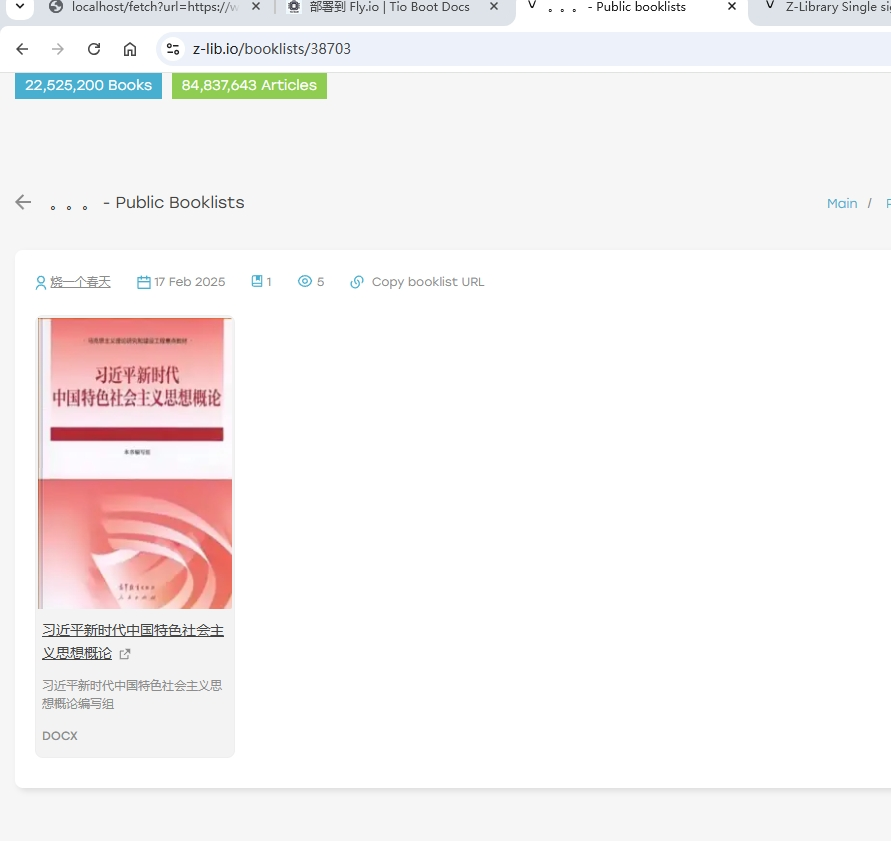
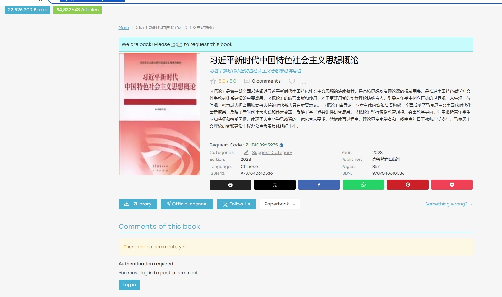

# 爬取 z-lib.io 数据

本文将详细介绍如何对 z‑lib.io 进行数据爬取，将关键数据入库，并利用 PostgreSQL 的全文检索功能对书名、作者、出版社、备注等字段建立搜索索引。内容包括网站数据分析、数据表设计、全文检索字段维护（手动更新和触发器自动更新）、以及使用 Java 与 Jsoup 爬取网页、解析数据并批量插入数据库的完整示例代码。

---

## 1. 目标网站数据分析

在正式编写爬虫之前，我们需要对目标网站的 HTML 结构进行详细分析，确定各个关键字段所在的位置及其解析方法。以下内容展示了页面中的部分示例代码及说明：

### 1.1 页面示例

- **书单页面示例**：  
  URL：[https://z-lib.io/booklists](https://z-lib.io/booklists)  
  

- **单本书页面示例**：  
  URL：[https://z-lib.io/book/17617977](https://z-lib.io/book/17617977)  
  

### 1.2 目标数据及 HTML 分析

通过分析示例页面，可以获得以下关键信息：

1. **Request Code**

   - **页面位置**：
     ```html
     Request Code : <span id="reqcode" class="text-success">ZLIBIO3965975</span>
     ```
   - **说明**：该字段用于唯一标识页面中提到的请求码，解析时使用 `#reqcode` 选择器获取内容。

2. **书名 (title)**

   - **页面位置**：
     ```html
     <h1 itemprop="name">习近平新时代中国特色社会主义思想概论</h1>
     ```
   - **说明**：书名位于 `<h1>` 标签中，通过 `h1[itemprop=name]` 选择器获取文本内容。

3. **作者 (author)**

   - **页面位置**：
     ```html
     <a class="color1" ... itemprop="author">习近平新时代中国特色社会主义思想概论编写组</a>
     ```
   - **说明**：作者信息通过 `[itemprop=author]` 选择器获取，包含完整的作者描述。

4. **出版社 (publisher)**

   - **页面位置**：
     ```html
     <div class="bookProperty property_publisher">
       <div class="property_label">Publisher:</div>
       <div class="property_value">高等教育出版社</div>
     </div>
     ```
   - **说明**：使用 `.bookProperty.property_publisher .property_value` 选择器获取出版社名称。

5. **出版年份 (publish_year)**

   - **页面位置**：
     ```html
     <div class="bookProperty property_year">
       <div class="property_label">Year:</div>
       <div class="property_value">2023</div>
     </div>
     ```
   - **说明**：通过 `.bookProperty.property_year .property_value` 选择器获取年份，需转换为数字。

6. **页数 (pages)**

   - **页面位置**：
     ```html
     <div class="bookProperty property_pages">
       <div class="property_label">Pages:</div>
       <div class="property_value">
         <span title="Pages paperback">367</span>
       </div>
     </div>
     ```
   - **说明**：利用 `.bookProperty.property_pages .property_value` 选择器，进一步提取 `<span>` 内的数字。

7. **语言 (language)**

   - **页面位置**：
     ```html
     <div class="bookProperty property_language">
       <div class="property_label">Language:</div>
       <div class="property_value text-capitalize">chinese</div>
     </div>
     ```
   - **说明**：通过 `.bookProperty.property_language .property_value` 获取语言信息。

8. **分类 (category)**

   - **页面位置**：  
     页面中虽然显示 “Categories:”，但示例页面中可能没有实际分类值（有时仅出现 “Suggest Category” 按钮）。
   - **说明**：根据页面实际情况存储为空字符串或设为 `N/A`。

9. **官方渠道 (official_channel)**

   - **页面位置**：
     ```html
     <a class="btn btn-primary dlButton addDownloadedBook" href="https://t.me/Zlib_IO" ...> Official channel </a>
     ```
   - **说明**：可以选择保存链接 `https://t.me/Zlib_IO` 或按钮文字 `Official channel`。

10. **装帧形式 (paperback)**

    - **页面位置**：
      ```html
      <button type="button" class="btn btn-default dropdown-toggle button-paperback" ...>
        Paperback <span class="caret"></span>
      </button>
      ```
    - **说明**：按钮文本为 `Paperback`。

11. **浏览次数 (view_count)**

    - **说明**：页面中未直接提供浏览次数，通常设定为 `0`。

12. **评论数量 (comment_count)**

    - **页面位置**：
      ```html
      <div class="book-comments-info">0 comments</div>
      ```
    - **说明**：通过 `.book-comments-info` 获取文本，并提取其中的数字。

13. **文件信息 (files)**

    - **说明**：一般用于存储封面图片、附件等信息，格式采用 JSON。

14. **来源 URL (source_url)**

    - **页面位置**：
      ```html
      <link rel="canonical" href="https://z-lib.io/book/17617977" />
      ```
    - **说明**：可直接使用当前 URL 作为数据来源。

15. **额外信息：ISBN 信息**
    - **页面位置**：
      ```html
      <div class="bookProperty property_isbn">
        <div class="property_label">ISBN 10:</div>
        <div class="property_value">0143469134</div>
      </div>
      <div class="bookProperty property_isbn">
        <div class="property_label">ISBN 13:</div>
        <div class="property_value">9780143469131</div>
      </div>
      ```
    - **说明**：可通过遍历 `div.bookProperty.property_isbn` 区块，依据 label 内容判断获取 ISBN 10、ISBN 13 或综合的 ISBN 信息。

通过以上 HTML 分析，我们可以为每个字段确定对应的 CSS 选择器和解析规则，从而在代码中准确提取数据。

---

## 2. 数据表设计

### 2.1 创建数据表

我们在数据库中创建一张 `mc_books` 表，设计时除了书籍基本信息外，还需要为全文检索预留一个 `tsvector` 类型字段（如 `fts` 字段），便于组合多个字段（如书名、作者、出版社、描述）生成全文检索向量。

```sql
DROP TABLE IF EXISTS mc_books;
CREATE TABLE mc_books (
    ID BIGINT NOT NULL PRIMARY KEY,
    request_code VARCHAR(64), -- 页面中提到的“请求码”
    title VARCHAR(2048) NOT NULL, -- 书名
    description TEXT,
    author VARCHAR(2048), -- 作者
    rating VARCHAR(2048),
    publisher VARCHAR(2048), -- 出版社
    publish_year INT, -- 出版年份
    pages INT, -- 页数
    language VARCHAR(64), -- 语言
    category VARCHAR(128), -- 分类（如政治、思想理论等）
    view_count INT DEFAULT 0, -- 浏览次数
    isbn_10 VARCHAR(256),
    isbn_13 VARCHAR(256),
    isbn VARCHAR(256),
    comment_count INT DEFAULT 0, -- 评论数量
    files JSON, -- 文件信息（JSON 格式）
    source_url VARCHAR(256), -- 来源 URL
    fts tsvector, -- 全文检索字段
    -- 以下为基础字段
    remark VARCHAR(256),
    creator VARCHAR(64) DEFAULT '',
    create_time TIMESTAMP WITH TIME ZONE NOT NULL DEFAULT CURRENT_TIMESTAMP,
    updater VARCHAR(64) DEFAULT '',
    update_time TIMESTAMP WITH TIME ZONE NOT NULL DEFAULT CURRENT_TIMESTAMP,
    deleted SMALLINT DEFAULT 0,
    tenant_id BIGINT NOT NULL DEFAULT 0
);
```

### 2.2 手动维护 `fts` 字段

如果希望在插入或更新时由应用层计算 `tsvector` 值，可以使用 PostgreSQL 的 `to_tsvector` 函数，示例如下（以英文分词为例；中文需要额外安装中文分词插件或使用第三方分词库）：

```sql
UPDATE public.mc_books
SET fts = to_tsvector('english',
    coalesce(title, '') || ' ' ||
    coalesce(author, '') || ' ' ||
    coalesce(publisher, '') || ' ' ||
    coalesce(description, '')
);
```

这样，我们将 `title`、`author`、`publisher`、`description` 等字段组合起来生成全文检索向量。

### 2.3 使用触发器自动维护 `fts` 字段

为了避免每次手动更新，我们可以利用 PostgreSQL 的触发器，在每次插入或更新时自动维护 `fts` 字段。具体步骤如下：

1. **创建更新函数**：在函数中调用 `to_tsvector` 对新数据生成检索向量。

2. **创建触发器**：在 `mc_books` 表上创建触发器，使其在 `INSERT` 或 `UPDATE` 操作前自动调用更新函数。

示例代码：

```sql
-- 1. 创建更新 FTS 的函数
CREATE OR REPLACE FUNCTION mc_books_fts_update() RETURNS trigger AS $$
BEGIN
    NEW.fts := to_tsvector('english',
        coalesce(NEW.title, '') || ' ' ||
        coalesce(NEW.author, '') || ' ' ||
        coalesce(NEW.publisher, '') || ' ' ||
        coalesce(NEW.description, '')
    );
    RETURN NEW;
END;
$$ LANGUAGE plpgsql;

-- 2. 在 mc_books 表上创建触发器
CREATE TRIGGER trg_mc_books_fts_update
BEFORE INSERT OR UPDATE
    ON public.mc_books
    FOR EACH ROW
    EXECUTE PROCEDURE mc_books_fts_update();
```

这样，每次执行 `INSERT` 或 `UPDATE` 时，`fts` 字段都会自动更新，无需额外手动维护。

### 2.4 创建全文检索索引

为了提高查询效率，我们在 `fts` 字段上建立 GIN 索引：

```sql
CREATE INDEX idx_mc_books_fts ON public.mc_books USING GIN (fts);
```

查询示例（使用全文检索语法）：

```sql
SELECT *
FROM public.mc_books
WHERE fts @@ to_tsquery('english', 'My & Teacher');
```

**注意**：如果使用中文分词，需在 `to_tsvector` 和 `to_tsquery` 时指定相应的中文分词器（如 `zhparser`），并做好额外插件配置。

---

## 3. 爬取网站数据

在本节中，我们使用 Java 语言配合 Jsoup 解析 HTML 数据，并利用 OkHttp 进行 HTTP 请求。下面给出完整代码示例，包含两部分：

- 一份示例代码用于解析关键字段并打印（供调试参考）
- 一份示例代码实现将爬取的数据插入到 PostgreSQL 数据库中

### 3.1 使用 Jsoup 解析示例（打印数据）

下面代码通过遍历页面 `id`，构造 URL，然后使用 Jsoup 解析 HTML 页面，从中提取各个字段的数据。

```java
package com.litongjava.book.spider.services;

import java.io.IOException;
import java.util.ArrayList;
import java.util.List;

import org.jsoup.Jsoup;
import org.jsoup.nodes.Document;
import org.jsoup.nodes.Element;
import org.jsoup.select.Elements;

import com.litongjava.tio.utils.http.OkHttpClientPool;

import lombok.extern.slf4j.Slf4j;
import okhttp3.Call;
import okhttp3.Request;
import okhttp3.Response;

@Slf4j
public class BookSpider {
  // 模拟浏览器请求头，防止被反爬虫机制拦截
  String userAgent = "Mozilla/5.0 (Windows NT 10.0; Win64; x64) AppleWebKit/537.36 (KHTML, like Gecko) Chrome/127.0.0.0 Safari/537.36";
  // URL 模板，根据 id 替换
  String urlTemplate = "https://z-lib.io/book/%d";

  public void index() {
    // 可根据实际需求调整最大 id
    int max = 100;
    for (int i = 1; i < max; i++) {
      fetch(i);
    }
  }

  public void fetch(int i) {
    String url = String.format(urlTemplate, i);

    Request request = new Request.Builder().url(url)
        .get()
        .addHeader("User-Agent", userAgent)
        .addHeader("Accept", "*/*")
        .addHeader("Host", "z-lib.io")
        .addHeader("Connection", "keep-alive")
        .build();

    Call newCall = OkHttpClientPool.get3600HttpClient().newCall(request);
    String htmlContent = null;
    int code = 0;
    try (Response response = newCall.execute()) {
      code = response.code();
      htmlContent = response.body().string();
    } catch (IOException e) {
      e.printStackTrace();
      return;
    }

    if (code == 200) {
      Document doc = Jsoup.parse(htmlContent, "UTF-8");

      // 1. Request Code
      Element reqcodeEl = doc.selectFirst("#reqcode");
      String requestCode = reqcodeEl != null ? reqcodeEl.text() : "";

      // 2. Title
      Element titleEl = doc.selectFirst("h1[itemprop=name]");
      String title = titleEl != null ? titleEl.text() : "";

      // 3. Author
      Element authorEl = doc.selectFirst("[itemprop=author]");
      String author = authorEl != null ? authorEl.text() : "";

      // 4. Description
      Element bookDescriptionBox = doc.getElementById("bookDescriptionBox");
      String description = bookDescriptionBox != null ? bookDescriptionBox.html() : "";

      // 5. Publisher
      Element publisherEl = doc.selectFirst(".bookProperty.property_publisher .property_value");
      String publisher = publisherEl != null ? publisherEl.text() : "";

      // 6. Year
      Element yearEl = doc.selectFirst(".bookProperty.property_year .property_value");
      int publishYear = 0;
      if (yearEl != null) {
        try {
          publishYear = Integer.parseInt(yearEl.text().trim());
        } catch (NumberFormatException e) {
          // 若内容不是纯数字，则 publishYear 保持为 0
        }
      }

      // 7. Pages
      Element pagesEl = doc.selectFirst(".bookProperty.property_pages .property_value");
      int pages = 0;
      if (pagesEl != null) {
        String pagesText = pagesEl.text();
        try {
          pages = Integer.parseInt(pagesText.trim());
        } catch (NumberFormatException e) {
          // 转换失败时保持 pages = 0
        }
      }

      // 8. Language
      Element langEl = doc.selectFirst(".bookProperty.property_language .property_value");
      String language = langEl != null ? langEl.text() : "";

      // 9. Category
      Element categoryEl = doc.selectFirst(".bookProperty.property_categories .property_value");
      String category = categoryEl != null ? categoryEl.text() : "";

      // 10. Paperback 下的链接（如 Amazon、Barnes & Noble 等）
      Elements paperbackLinks = doc.select(".menu-content.menu-content_paperback .menu-row a.menu__link_paperback");
      List<String> paperbackLinkList = new ArrayList<>();
      for (Element link : paperbackLinks) {
        String linkHref = link.attr("href");
        String linkText = link.text(); // 例如 "Amazon", "Barnes & Noble", "Bookshop.org"
        paperbackLinkList.add(linkText + " => " + linkHref);
      }

      // 11. view_count —— 网页未提供，设定为 0
      int viewCount = 0;

      // 12. comment_count
      Element commentCountEl = doc.selectFirst(".book-comments-info");
      int commentCount = 0;
      if (commentCountEl != null) {
        String text = commentCountEl.text(); // 例如 "0 comments"
        text = text.replaceAll("\\D+", ""); // 去除非数字字符
        try {
          commentCount = Integer.parseInt(text);
        } catch (NumberFormatException e) {
          // 转换失败时保持 commentCount = 0
        }
      }

      // 13. Rating（示例只取 interestScore）
      Element ratingDetail = doc.selectFirst(".book-rating-detail");
      String interestScore = null;
      if (ratingDetail != null) {
        Element interestEl = ratingDetail.selectFirst(".book-rating-interest-score");
        interestScore = interestEl != null ? interestEl.text() : "";
      }

      // 14. source_url（取当前 url）
      String sourceUrl = url;

      // 15. 封面图片 URL
      Element coverImgEl = doc.selectFirst(".details-book-cover-content img");
      String coverImgUrl = coverImgEl != null ? coverImgEl.attr("src") : "";

      // 16. 获取 ISBN 10、ISBN 13、ISBN
      String isbn10 = "";
      String isbn13 = "";
      String isbn = "";

      Elements isbnProps = doc.select("div.bookProperty.property_isbn");
      for (Element e : isbnProps) {
        Element labelEl = e.selectFirst(".property_label");
        Element valEl = e.selectFirst(".property_value");
        if (labelEl == null || valEl == null) {
          continue;
        }
        String labelText = labelEl.text().trim();
        String valueText = valEl.text().trim();
        // 根据 label 判断具体类型
        if (labelText.contains("ISBN 10")) {
          isbn10 = valueText; // 例如 "0143469134"
        } else if (labelText.contains("ISBN 13")) {
          isbn13 = valueText; // 例如 "9780143469131"
        } else if (labelText.equals("ISBN:") || labelText.contains("ISBN")) {
          // 可能为 "9780143469131, 0143469134"
          isbn = valueText;
        }
      }

      // 打印结果
      System.out.println("== Book Info ==");
      System.out.println("requestCode  : " + requestCode);
      System.out.println("title        : " + title);
      System.out.println("description  : " + description);
      System.out.println("author       : " + author);
      System.out.println("rating       : " + interestScore);
      System.out.println("publisher    : " + publisher);
      System.out.println("publishYear  : " + publishYear);
      System.out.println("pages        : " + pages);
      System.out.println("language     : " + language);
      System.out.println("category     : " + category);
      System.out.println("viewCount    : " + viewCount);
      System.out.println("commentCount : " + commentCount);
      System.out.println("sourceUrl    : " + sourceUrl);
      System.out.println("coverImgUrl  : " + coverImgUrl);

      // 打印 paperbackLinks 信息
      System.out.println("== Paperback Links ==");
      for (String linkInfo : paperbackLinkList) {
        System.out.println("   " + linkInfo);
      }

      // 打印 ISBN 信息
      System.out.println("ISBN 10: " + isbn10);
      System.out.println("ISBN 13: " + isbn13);
      System.out.println("ISBN   : " + isbn);

    } else {
      // 非 200 状态码，根据需求进行处理
      System.out.println("HTTP status != 200, code=" + code + ", url=" + url);
    }
  }
}
```

### 3.2 插入数据库示例

在实际应用中，我们会将解析到的数据组装成数据库记录，并批量插入到 `mc_books` 表中。下面是完整示例代码，采用 JFinal 的 ActiveRecord 框架（或你项目中对应的数据库操作工具），通过 OkHttp 抓取网页数据，并将数据以 `Row` 的形式保存到数据库。

```java
package com.litongjava.book.spider.services;

import java.io.IOException;
import java.util.ArrayList;
import java.util.List;

import org.jsoup.Jsoup;
import org.jsoup.nodes.Document;
import org.jsoup.nodes.Element;
import org.jsoup.select.Elements;
import org.postgresql.util.PGobject;

import com.jfinal.kit.Kv;
import com.litongjava.db.activerecord.Db;
import com.litongjava.db.activerecord.Row;
import com.litongjava.kit.PgObjectUtils;
import com.litongjava.tio.utils.http.OkHttpClientPool;
import com.litongjava.tio.utils.json.JsonUtils;

import lombok.extern.slf4j.Slf4j;
import okhttp3.Call;
import okhttp3.Request;
import okhttp3.Response;

@Slf4j
public class BookSpider {
  // 模拟浏览器 UA 信息
  String userAgent = "Mozilla/5.0 (Windows NT 10.0; Win64; x64) AppleWebKit/537.36 (KHTML, like Gecko) Chrome/127.0.0.0 Safari/537.36";
  // URL 模板，根据 id 替换
  String urlTemplate = "https://z-lib.io/book/%d";

  public void index() {
    // 根据需要设置最大 id，此处示例用较大值
    int max = 22525200;
    // 临时存储待插入的 Row 集合
    List<Row> rows = new ArrayList<>();
    for (int i = 1; i < max; i++) {
      log.info("fetch:{}", i);
      // 如果数据库中不存在此 id 的记录，则进行爬取
      if (!Db.exists("mc_books", "id", i)) {
        Row row = fetch(i);
        if (row != null) {
          rows.add(row);
        }
        try {
          // 为防止访问太频繁，加上适当延时
          Thread.sleep(500);
        } catch (InterruptedException e) {
          e.printStackTrace();
        }
        // 每批次达到一定数量后，执行批量保存
        if (rows.size() > 10) {
          Db.batchSave("mc_books", rows, rows.size());
          rows.clear();
        }
      }
    }
  }

  public Row fetch(int i) {
    String url = String.format(urlTemplate, i);

    Request request = new Request.Builder().url(url)
        .get()
        .addHeader("User-Agent", userAgent)
        .addHeader("Accept", "*/*")
        .addHeader("Host", "z-lib.io")
        .addHeader("Connection", "keep-alive")
        .build();

    Call newCall = OkHttpClientPool.get3600HttpClient().newCall(request);
    String htmlContent = null;
    int code = 0;
    try (Response response = newCall.execute()) {
      code = response.code();
      htmlContent = response.body().string();
    } catch (IOException e) {
      e.printStackTrace();
      return null;
    }

    if (code == 200) {
      Document doc = Jsoup.parse(htmlContent, "UTF-8");

      // 1. Request Code
      Element reqcodeEl = doc.selectFirst("#reqcode");
      String requestCode = reqcodeEl != null ? reqcodeEl.text() : "";

      // 2. Title
      Element titleEl = doc.selectFirst("h1[itemprop=name]");
      String title = titleEl != null ? titleEl.text() : "";

      // 3. Author
      Element authorEl = doc.selectFirst("[itemprop=author]");
      String author = authorEl != null ? authorEl.text() : "";

      // 4. Description
      Element bookDescriptionBox = doc.getElementById("bookDescriptionBox");
      String description = bookDescriptionBox != null ? bookDescriptionBox.html() : "";

      // 5. Publisher
      Element publisherEl = doc.selectFirst(".bookProperty.property_publisher .property_value");
      String publisher = publisherEl != null ? publisherEl.text() : "";

      // 6. Year
      Element yearEl = doc.selectFirst(".bookProperty.property_year .property_value");
      int publishYear = 0;
      if (yearEl != null) {
        try {
          publishYear = Integer.parseInt(yearEl.text().trim());
        } catch (NumberFormatException e) {
          // 如果抓取到的内容不是纯数字，则保持 publishYear=0
        }
      }

      // 7. Pages
      Element pagesEl = doc.selectFirst(".bookProperty.property_pages .property_value");
      int pages = 0;
      if (pagesEl != null) {
        String pagesText = pagesEl.text();
        try {
          pages = Integer.parseInt(pagesText.trim());
        } catch (NumberFormatException e) {
          // 转换失败时保持 pages = 0
        }
      }

      // 8. Language
      Element langEl = doc.selectFirst(".bookProperty.property_language .property_value");
      String language = langEl != null ? langEl.text() : "";

      // 9. Category
      Element categoryEl = doc.selectFirst(".bookProperty.property_categories .property_value");
      String category = categoryEl != null ? categoryEl.text() : "";

      // 10. Paperback 下的链接（本示例暂不做详细处理）
      // 注释代码如需要可参考上面示例

      // 11. view_count —— 网页未提供，设定为 0
      int viewCount = 0;

      // 12. comment_count
      Element commentCountEl = doc.selectFirst(".book-comments-info");
      int commentCount = 0;
      if (commentCountEl != null) {
        String text = commentCountEl.text(); // 例如 "0 comments"
        text = text.replaceAll("\\D+", ""); // 去除非数字字符
        try {
          commentCount = Integer.parseInt(text);
        } catch (NumberFormatException e) {
          // 保持 commentCount = 0
        }
      }

      // 13. Rating（示例只取 interestScore）
      Element ratingDetail = doc.selectFirst(".book-rating-detail");
      String interestScore = null;
      if (ratingDetail != null) {
        Element interestEl = ratingDetail.selectFirst(".book-rating-interest-score");
        interestScore = interestEl != null ? interestEl.text() : "";
      }

      // 14. source_url —— 使用当前 url 作为来源
      String sourceUrl = url;

      // 15. 封面图片 URL
      Element coverImgEl = doc.selectFirst(".details-book-cover-content img");
      String coverImgUrl = coverImgEl != null ? coverImgEl.attr("src") : null;

      // 16. 获取 ISBN 10、ISBN 13、ISBN
      String isbn10 = "";
      String isbn13 = "";
      String isbn = "";

      Elements isbnProps = doc.select("div.bookProperty.property_isbn");
      for (Element e : isbnProps) {
        Element labelEl = e.selectFirst(".property_label");
        Element valEl = e.selectFirst(".property_value");
        if (labelEl == null || valEl == null) {
          continue;
        }
        String labelText = labelEl.text().trim();
        String valueText = valEl.text().trim();
        if (labelText.contains("ISBN 10")) {
          isbn10 = valueText;
        } else if (labelText.contains("ISBN 13")) {
          isbn13 = valueText;
        } else if (labelText.equals("ISBN:") || labelText.contains("ISBN")) {
          isbn = valueText;
        }
      }

      // 将解析到的字段组装成 Row
      Row row = new Row();
      row.set("id", Long.valueOf(i))
         .set("request_code", requestCode)
         .set("title", title)
         .set("description", description)
         .set("author", author)
         .set("rating", interestScore)
         .set("publisher", publisher)
         .set("publish_year", publishYear)
         .set("pages", pages)
         .set("language", language)
         .set("category", category)
         .set("view_count", viewCount)
         .set("isbn_10", isbn10)
         .set("isbn_13", isbn13)
         .set("isbn", isbn)
         .set("comment_count", commentCount)
         .set("source_url", sourceUrl);

      // 如果封面图片 URL 不为空，则将其存储在 files 字段（JSON 格式）
      if (coverImgUrl != null) {
        Kv kv = Kv.by("url", coverImgUrl);
        List<Kv> kvs = new ArrayList<Kv>();
        kvs.add(kv);
        String json = JsonUtils.toJson(kvs);
        PGobject pgObject = PgObjectUtils.json(json);
        row.set("files", pgObject);
      }

      return row;
    } else {
      log.info("HTTP status != 200, code=" + code + ", url=" + url);
      return null;
    }
  }
}
```

---

## 4. 总结

1. **网页数据分析**：

   - 通过查看页面源代码，确定数据所在的 HTML 标签与类名。
   - 根据页面示例，使用如 `selectFirst`、`select` 等 CSS 选择器提取数据，例如：
     - `#reqcode` 获取请求码
     - `h1[itemprop=name]` 获取书名
     - `[itemprop=author]` 获取作者
     - `.bookProperty.property_publisher .property_value` 获取出版社
     - 依此类推……

2. **数据表设计**：

   - 建表时为需要全文检索的字段预留 `tsvector` 类型字段。
   - 既可以在应用层手动维护 `fts` 字段，也可以通过触发器自动更新。

3. **全文检索配置**：

   - 使用 `to_tsvector` 生成检索向量，并在 `fts` 字段上建立 GIN 索引。
   - 查询时利用 `@@ to_tsquery('english', '查询关键词')` 实现全文检索。
   - 中文全文检索需额外配置中文分词插件（如 `zhparser`）。

4. **爬虫实现**：

   - 使用 OkHttp 获取网页内容，通过 Jsoup 解析 HTML 并提取数据。
   - 处理数字数据时需注意异常处理，如解析年份、页数、评论数量时可能遇到格式问题。
   - 部分字段（如 view_count）网页未提供，根据实际需求设定默认值。

5. **入库操作**：

   - 利用批量插入提高数据保存效率。
   - 防止重复抓取时，可先查询数据库中是否已存在记录。

6. **其他注意事项**：
   - 目标站点可能存在反爬机制，可通过延时、UA 伪装、代理等方式应对。
   - 网页结构若发生变化，解析逻辑需要适时调整，建议做好异常处理。

---

通过本文的介绍与完整示例代码，你可以实现对 z‑lib.io 网站数据的全量爬取，并利用 PostgreSQL 的全文检索功能为搜索需求提供支持。希望本篇文档能为你的项目提供参考和帮助。
