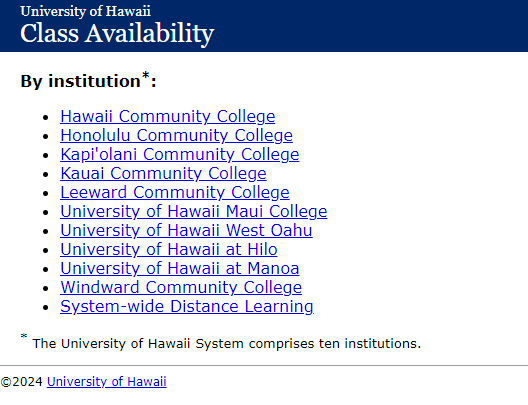
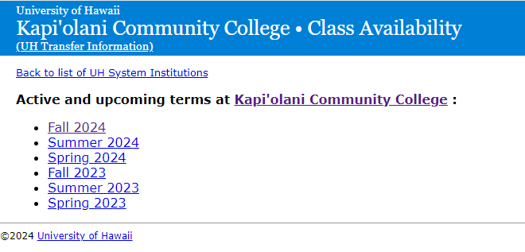
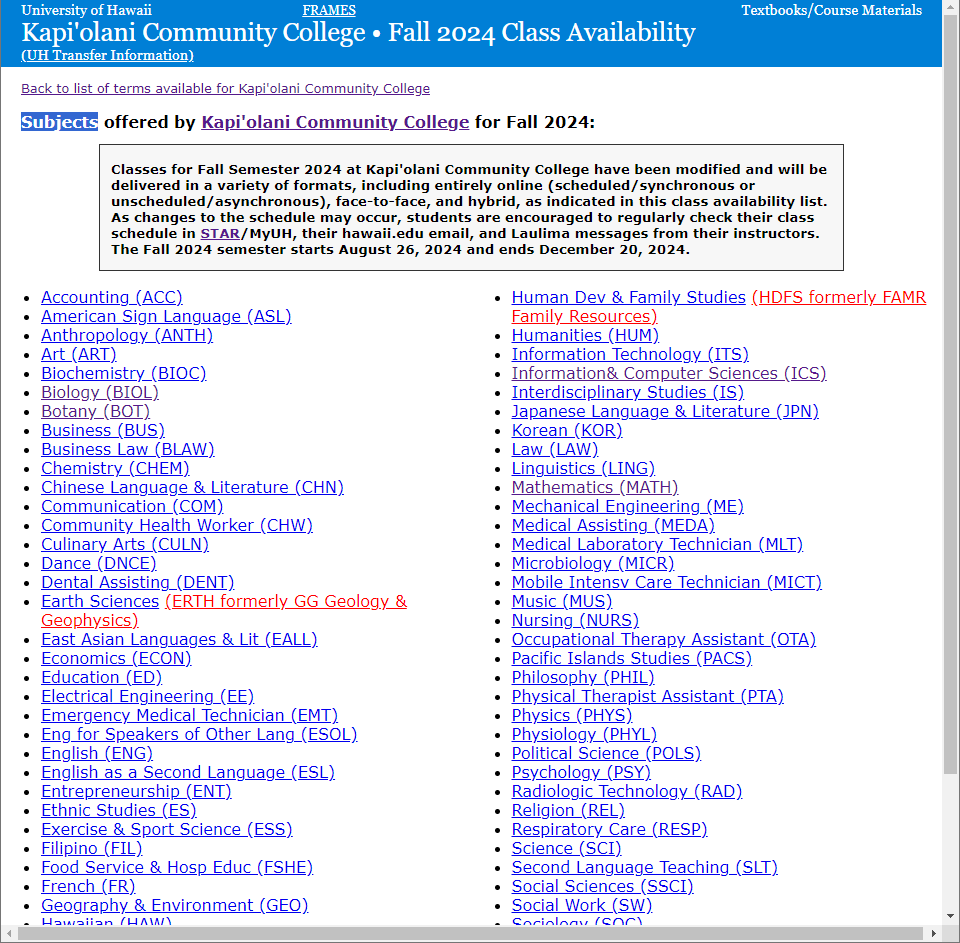
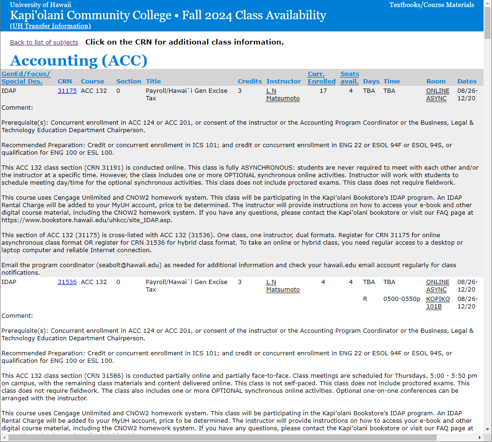

# WebMagic 示例：爬取学校课程数据

目标是使用 WebMagic 框架构建一个完整的爬虫示例，从夏威夷大学的课程数据网页中自动提取并存储课程相关信息到数据库中。整个过程包括以下几个关键步骤：

1. **数据分析**：分析目标网页的 HTML 结构，确定需要爬取的内容及其位置，例如机构列表、学期信息、学科列表、课程详细信息等。

2. **数据库表设计**：为每个爬取的数据类型（机构、学期、学科、课程）创建数据库表，用于存储爬取到的信息。

3. **爬虫程序编写**：利用 WebMagic 框架，编写不同的 `PageProcessor` 和 `Pipeline` 类来实现对目标网页的爬取和数据存储。每个爬虫程序针对特定的数据类型，如机构、学期、学科和课程，分别进行编写。

4. **数据存储**：将爬取的数据通过 `Pipeline` 存入预先设计的数据库表中，实现对机构、学期、学科、课程等多层次信息的存储。

5. **测试**：通过测试程序验证爬虫的功能，确保爬取的数据能够正确地提取和存储。

## 1. 爬取目标：`institution`

### 1. 网页数据分析

目标网页：https://www.sis.hawaii.edu/uhdad/avail.classes

**网页的 HTML 结构**如下所示：

```html
<body>
  <div class="header">
    <p class="system">
      <a href="./avail.classes" class="system_link">University of Hawaii</a>
    </p>
    <p class="institution">
      <a href="./avail.classes" class="title_link">Class Availability</a>
    </p>
  </div>
  <div class="bodydiv">
    <p><b>By institution<sup>*</sup>:</b></p>
    <ul class="institutions">
      <li class="HAW">
        <a href="./avail.classes?i=HAW">Hawaii Community College</a>
      </li>
      <li class="HON">
        <a href="./avail.classes?i=HON">Honolulu Community College</a>
      </li>
      <li class="KAP">
        <a href="./avail.classes?i=KAP">Kapi'olani Community College</a>
      </li>
      <li class="KAU">
        <a href="./avail.classes?i=KAU">Kauai Community College</a>
      </li>
      <li class="LEE">
        <a href="./avail.classes?i=LEE">Leeward Community College</a>
      </li>
      <li class="MAU">
        <a href="./avail.classes?i=MAU">University of Hawaii Maui College</a>
      </li>
      <li class="WOA">
        <a href="./avail.classes?i=WOA">University of Hawaii West Oahu</a>
      </li>
      <li class="HIL">
        <a href="./avail.classes?i=HIL">University of Hawaii at Hilo</a>
      </li>
      <li class="MAN">
        <a href="./avail.classes?i=MAN">University of Hawaii at Manoa</a>
      </li>
      <li class="WIN">
        <a href="./avail.classes?i=WIN">Windward Community College</a>
      </li>
      <li class="SYS">
        <a href="https://www.uhonline.hawaii.edu/courses/">System-wide Distance Learning</a>
      </li>
    </ul>
    <p style="font-size: small"><sup>*</sup> The University of Hawaii System comprises ten institutions.</p>
  </div>
  <div class="footer">
    <hr size="1" width="100%" />
    <p class="copyright">&copy;2024 <a href="http://www.hawaii.edu/">University of Hawaii</a></p>
    <p class="updated">Updated: 09/13/2024 02:52:44 PM HST</p>
  </div>
</body>
```

**数据分析**：

- 目标数据位于 `<ul class="institutions">` 标签内的 `<li>` 标签中，每个 `<li>` 标签包含一个 `<a>` 标签，链接表示机构代码 (`abbr_name`)，文本内容为机构名称 (`name`)。
- 链接的 `href` 属性的格式为 `./avail.classes?i=机构代码`，我们需要解析这个链接以提取机构代码。

### 2. 创建数据库表

首先，创建用于存储爬取数据的数据库表 `spider_us_hi_uh_institution`。SQL 语句如下：

```sql
DROP TABLE IF EXISTS "spider_us_hi_uh_institution";
CREATE TABLE "spider_us_hi_uh_institution" (
  "id" "pg_catalog"."int8" NOT NULL PRIMARY KEY,
  "abbr_name" "pg_catalog"."varchar" COLLATE "pg_catalog"."default",
  "name" "pg_catalog"."varchar" COLLATE "pg_catalog"."default",
  "creator" "pg_catalog"."varchar" COLLATE "pg_catalog"."default",
  "create_time" "pg_catalog"."timestamp",
  "updater" "pg_catalog"."varchar" COLLATE "pg_catalog"."default",
  "update_time" "pg_catalog"."timestamp",
  "deleted" "pg_catalog"."int2" DEFAULT 0,
  "tenant_id" "pg_catalog"."int8" DEFAULT 1
);
```

### 3. 编写爬虫程序

#### 1 创建 `PageProcessor` 进行网页解析

`PageProcessor` 是 WebMagic 框架中用于定义网页抓取和解析逻辑的接口。这里我们创建一个 `InstitutionProcessor` 类：

```java
import java.util.List;
import us.codecraft.webmagic.Page;
import us.codecraft.webmagic.Site;
import us.codecraft.webmagic.processor.PageProcessor;

public class InstitutionProcessor implements PageProcessor {

  private Site site = Site.me().setRetryTimes(3).setSleepTime(10000);

  @Override
  public void process(Page page) {
    // 定义用于解析机构列表的 CSS 选择器
    String selector = "ul.institutions li a";

    // 从页面中提取链接和文本
    List<String> links = page.getHtml().css(selector, "href").all();
    List<String> names = page.getHtml().css(selector, "text").all();

    // 将提取到的数据保存到 ResultItems 中
    page.putField("links", links);
    page.putField("names", names);
  }

  @Override
  public Site getSite() {
    return site;
  }
}
```

**代码分析**：

1. **`process` 方法**：核心方法，负责从页面中提取数据。

   - 使用 CSS 选择器 `"ul.institutions li a"` 来定位机构列表的链接。
   - `links` 提取所有链接的 `href` 属性，`names` 提取链接文本（即机构名称）。
   - 使用 `page.putField` 方法将提取到的数据存储在 `ResultItems` 对象中，以便后续处理。

2. **`getSite` 方法**：配置爬虫的站点设置，例如重试次数和请求间隔时间。

#### 2 创建 `Pipeline` 将数据存入数据库

`Pipeline` 用于处理从页面提取的数据，这里我们将数据存入数据库：

```java
import java.util.List;
import com.litongjava.data.utils.SnowflakeIdGenerator;
import com.litongjava.jfinal.plugin.activerecord.Db;
import com.litongjava.jfinal.plugin.activerecord.Row;
import lombok.extern.slf4j.Slf4j;
import us.codecraft.webmagic.ResultItems;
import us.codecraft.webmagic.Task;
import us.codecraft.webmagic.pipeline.Pipeline;

@Slf4j
public class InstitutionPipeline implements Pipeline {

  @Override
  public void process(ResultItems resultItems, Task task) {
    List<String> links = resultItems.get("links");
    List<String> names = resultItems.get("names");

    // 插入数据库
    for (int i = 0; i < links.size(); i++) {
      String link = links.get(i);
      String[] split = link.split("=");
      if (split.length < 2) {
        continue;
      }
      String abbrName = split[1];
      Integer count = Db.queryInt("select count(1) from spider_us_hi_uh_institution where abbr_name=?", abbrName);

      if (count > 0) {
        continue; // 如果数据库中已存在相同的机构代码，则跳过
      } else {
        Row row = new Row();
        row.put("id", new SnowflakeIdGenerator(0, 0).generateId());
        row.put("abbr_name", abbrName);
        row.put("name", names.get(i));
        boolean saved = Db.save("spider_us_hi_uh_institution", row);
        log.info("Saved {},{}", abbrName, saved);
      }
    }
  }
}
```

**代码分析**：

1. **`process` 方法**：负责将 `ResultItems` 中的数据存入数据库。
   - 从 `ResultItems` 对象中获取链接和名称。
   - 通过链接解析机构的简称 `abbrName`。
   - 检查数据库中是否已存在该机构，如不存在，则插入新记录。
   - 使用 `SnowflakeIdGenerator` 生成唯一 ID 并保存到 `spider_us_hi_uh_institution` 表中。

#### 3 创建爬虫服务

创建 `SpiderInstitutionService` 类来启动爬虫：

```java
import us.codecraft.webmagic.Spider;

public class SpiderInstitutionService {

  public void index() {
    String url = "https://www.sis.hawaii.edu/uhdad/avail.classes";
    Spider.create(new InstitutionProcessor())
        // 添加目标 URL
        .addUrl(url)
        // 添加 Pipeline
        .addPipeline(new InstitutionPipeline())
        // 启用 5 个线程并运行爬虫
        .thread(5).run();
  }
}
```

#### 4 测试程序

编写测试程序来验证爬虫的功能：

```java
import java.util.List;
import org.junit.Test;
import com.litongjava.db.activerecord.Db;
import com.litongjava.db.activerecord.Row;
import com.litongjava.jfinal.aop.Aop;
import com.litongjava.open.chat.config.DbConfig;
import com.litongjava.table

.utils.MarkdownTableUtils;
import com.litongjava.tio.utils.environment.EnvUtils;

public class SpiderInstitutionServiceTest {

  @Test
  public void test() {
    EnvUtils.load();
    new DbConfig().config();
    Aop.get(SpiderInstitutionService.class).index();
  }

  @Test
  public void findAll() {
    EnvUtils.load();
    new DbConfig().config();
    List<Row> all = Db.findAll("spider_us_hi_uh_institution");
    System.out.println(MarkdownTableUtils.to(all));
  }
}
```

### 4. 数据预览

爬取结果示例：
| id | abbr_name | name | creator | create_time | updater | update_time | deleted | tenant_id |
| --- | --- | --- | --- | --- | --- | --- | --- | --- |
| 424467593466740736 | HAW | Hawaii Community College | NULL | NULL | NULL | NULL | 0 | 1 |
| 424467593504489472 | HON | Honolulu Community College | NULL | NULL | NULL | NULL | 0 | 1 |
| 424467593521266688 | KAP | Kapi'olani Community College | NULL | NULL | NULL | NULL | 0 | 1 |
| 424467593542238208 | KAU | Kauai Community College | NULL | NULL | NULL | NULL | 0 | 1 |
| 424467593563209728 | LEE | Leeward Community College | NULL | NULL | NULL | NULL | 0 | 1 |
| 424467593579986944 | MAU | University of Hawaii Maui College | NULL | NULL | NULL | NULL | 0 | 1 |
| 424467593596764160 | WOA | University of Hawaii West Oahu | NULL | NULL | NULL | NULL | 0 | 1 |
| 424467593617735680 | HIL | University of Hawaii at Hilo | NULL | NULL | NULL | NULL | 0 | 1 |
| 424467593634512896 | MAN | University of Hawaii at Manoa | NULL | NULL | NULL | NULL | 0 | 1 |
| 424467593647095808 | WIN | Windward Community College | NULL | NULL | NULL | NULL | 0 | 1 |

通过上述步骤，我们成功创建了一个完整的 WebMagic 爬虫示例，可以从网页中提取学校数据并将其存入数据库。

## 2. 爬取目标：`semester`

### 2.1 网页数据分析

目标网页：https://www.sis.hawaii.edu/uhdad/avail.classes?i=KAP


**网页结构**：

```html
<body>
  <div class="header">
    <p class="system">
      <a href="./avail.classes" class="system_link">University of Hawaii</a>
      <a
        href="https://hawaii-kapiolani.verbacompare.com/"
        target="_blank"
        class="book_link"
        style="color: white; text-decoration: none; float: right"
        >Textbooks/Course Materials</a
      >
    </p>
    <p class="institution">
      <a href="./avail.classes?i=KAP" class="title_link">Kapi'olani Community College</a>
      &#149; Class Availability
    </p>
    <p class="transfer-info">
      <a href="http://www.hawaii.edu/admissions/transfers.html">(UH Transfer Information)</a>
    </p>
  </div>
  <p class="backlink">
    <a href="https://www.hawaii.edu/myuhinfo/class-availability/">Back to list of UH System Institutions</a>
  </p>
  <div class="bodydiv">
    <p>
      <b>Active and upcoming terms at <a href="./avail.classes?i=KAP">Kapi'olani Community College</a>:</b>
    </p>
    <ul class="terms">
      <li><a href="./avail.classes?i=KAP&t=202510">Fall 2024</a></li>
      <li><a href="./avail.classes?i=KAP&t=202440">Summer 2024</a></li>
      <li><a href="./avail.classes?i=KAP&t=202430">Spring 2024</a></li>
      <li><a href="./avail.classes?i=KAP&t=202410">Fall 2023</a></li>
      <li><a href="./avail.classes?i=KAP&t=202340">Summer 2023</a></li>
      <li><a href="./avail.classes?i=KAP&t=202330">Spring 2023</a></li>
    </ul>
  </div>
  <div class="footer">
    <hr size="1" width="100%" />
    <p class="copyright">&copy;2024 <a href="http://www.hawaii.edu/">University of Hawaii</a></p>
    <p class="updated">Updated: 09/13/2024 02:54:37 PM HST</p>
  </div>
</body>
```

**数据分析**：

- 目标数据位于 `<ul class="terms">` 标签内的 `<li>` 标签中，每个 `<li>` 标签包含一个 `<a>` 标签，链接表示学期（`t` 值），文本内容为学期名称（例如 "Fall 2024"）。
- 链接的 `href` 属性格式为 `./avail.classes?i=机构代码&t=学期编号`，我们需要解析这个链接以提取学期编号 `t` 和机构代码 `i`。

### 2.2 创建数据库表

首先，创建用于存储爬取数据的数据库表 `spider_us_hi_uh_semester`。SQL 语句如下：

```sql
DROP TABLE IF EXISTS "spider_us_hi_uh_semester";
CREATE TABLE "public"."spider_us_hi_uh_semester" (
  "id" "pg_catalog"."int8" NOT NULL PRIMARY KEY,
  "institution_id" "pg_catalog"."int8",
  "name" "pg_catalog"."varchar" COLLATE "pg_catalog"."default",
  "t" "pg_catalog"."int4",
  "creator" "pg_catalog"."varchar" COLLATE "pg_catalog"."default",
  "create_time" "pg_catalog"."timestamp",
  "updater" "pg_catalog"."varchar" COLLATE "pg_catalog"."default",
  "update_time" "pg_catalog"."timestamp",
  "deleted" "pg_catalog"."int2" DEFAULT 0,
  "tenant_id" "pg_catalog"."int8" DEFAULT 1
);
```

该表用于存储学期信息，包括学期 ID、机构 ID、学期名称和学期编号等。

### 2.3 编写爬虫程序

#### 1 创建 `PageProcessor` 进行网页解析

`PageProcessor` 是 WebMagic 中的接口，用于定义爬取逻辑。我们将创建 `SemesterProcessor` 类：

```java
package com.litongjava.open.chat.spider.uh.semester;

import java.util.List;
import us.codecraft.webmagic.Page;
import us.codecraft.webmagic.Site;
import us.codecraft.webmagic.processor.PageProcessor;

public class SemesterProcessor implements PageProcessor {
  private Site site = Site.me().setRetryTimes(3).setSleepTime(10000);

  @Override
  public void process(Page page) {
    String selector = "ul.terms li a";
    List<String> links = page.getHtml().css(selector, "href").all();
    List<String> names = page.getHtml().css(selector, "text").all();

    page.putField("links", links);
    page.putField("names", names);
  }

  @Override
  public Site getSite() {
    return site;
  }
}
```

**代码分析**：

1. **`process` 方法**：负责从网页中提取数据。

   - 使用 CSS 选择器 `"ul.terms li a"` 来定位学期列表的链接。
   - `links` 提取所有链接的 `href` 属性，`names` 提取链接文本（即学期名称）。
   - 使用 `page.putField` 方法将提取到的学期链接和名称存储在 `ResultItems` 对象中，供后续 `Pipeline` 处理。

2. **`getSite` 方法**：配置爬虫的站点设置，例如重试次数和请求间隔时间。

#### 2 创建 `Pipeline` 将数据存入数据库

`Pipeline` 用于处理 `PageProcessor` 中提取的数据，这里我们将数据存入数据库：

```java
package com.litongjava.open.chat.spider.uh.semester;

import java.util.ArrayList;
import java.util.List;
import java.util.regex.Matcher;
import java.util.regex.Pattern;
import com.litongjava.db.activerecord.Db;
import com.litongjava.db.activerecord.Row;
import com.litongjava.tio.utils.mcid.McIdUtils;
import lombok.SneakyThrows;
import lombok.extern.slf4j.Slf4j;
import us.codecraft.webmagic.ResultItems;
import us.codecraft.webmagic.Task;
import us.codecraft.webmagic.pipeline.Pipeline;

@Slf4j
public class SemesterPipeline implements Pipeline {
  String pattern = "i=(\\w+)&t=(\\d+)";
  String tableName = "spider_us_hi_uh_semester";
  private List<Row> records;

  public SemesterPipeline(List<Row> records) {
    this.records = records;
  }

  @SneakyThrows
  @Override
  public void process(ResultItems resultItems, Task task) {
    List<String> links = resultItems.get("links");
    List<String> names = resultItems.get("names");

    int size = links.size();
    List<Row> saveRecords = new ArrayList<>(size);
    Pattern compiledPattern = Pattern.compile(pattern);

    for (int i = 0; i < size; i++) {
      String uri = links.get(i);
      String abbrName = null;
      Integer t = null;

      Matcher matcher = compiledPattern.matcher(uri);

      if (matcher.find()) {
        abbrName = matcher.group(1);
        t = Integer.parseInt(matcher.group(2));
      } else {
        log.info("没有匹配的值 skip:{}", i);
        continue;
      }

      Long institutionId = getInstitutionId(abbrName);
      Row row = new Row();
      row.put("id", McIdUtils.id());
      row.put("institution_id", institutionId);
      row.put("name", names.get(i));
      row.put("t", t);
      saveRecords.add(row);
    }

    Db.tx(() -> {
      Db.delete("truncate table " + tableName);
      Db.batchSave(tableName, saveRecords, saveRecords.size());
      return true;
    });
  }

  private Long getInstitutionId(String abbrName) {
    for (Row row : records) {
      if (row.get("abbr_name").equals(abbrName)) {
        return row.getLong("id");
      }
    }
    return null;
  }
}
```

**代码分析**：

1. **正则表达式**：`pattern` 用于从链接中提取机构代码 `abbrName` 和学期编号 `t`。
2. **`process` 方法**：将学期数据解析后存入数据库。
   - 从 `ResultItems` 获取链接和名称列表。
   - 使用正则表达式从链接中提取机构代码和学期编号。
   - 调用 `getInstitutionId` 方法获取机构 ID。
   - 构建 `Row` 对象，将学期数据存入 `spider_us_hi_uh_semester` 表中。
   - 使用 `Db.tx` 执行数据库事务，确保数据一致性。

#### 3 创建爬虫服务

创建 `Spider

SemesterService` 类来运行爬虫：

```java
package com.litongjava.open.chat.spider.uh.semester;

import java.util.List;
import com.litongjava.db.activerecord.Db;
import com.litongjava.db.activerecord.Row;
import us.codecraft.webmagic.Spider;

public class SpiderSemesterService {
  public void index() {
    List<Row> all = Db.findAll("spider_us_hi_uh_institution");
    String url = "https://www.sis.hawaii.edu/uhdad/avail.classes?i=KAP";
    Spider.create(new SemesterProcessor())
        .addUrl(url)
        .addPipeline(new SemesterPipeline(all))
        .thread(5).run();
  }
}
```

#### 4. 测试程序

编写测试程序来验证爬虫的功能：

```java
package com.litongjava.open.chat.spider.uh.semester;

import java.util.List;
import org.junit.Test;
import com.litongjava.db.activerecord.Db;
import com.litongjava.db.activerecord.Row;
import com.litongjava.jfinal.aop.Aop;
import com.litongjava.open.chat.config.DbConfig;
import com.litongjava.table.utils.MarkdownTableUtils;
import com.litongjava.tio.utils.environment.EnvUtils;

public class SpiderSemesterServiceTest {

  @Test
  public void test() {
    EnvUtils.load();
    new DbConfig().config();
    Aop.get(SpiderSemesterService.class).index();
  }

  @Test
  public void findAll() {
    EnvUtils.load();
    new DbConfig().config();
    List<Row> all = Db.findAll("spider_us_hi_uh_semester");
    System.out.println(MarkdownTableUtils.to(all));
  }
}
```

### 4. 数据示例

| id               | institution_id     | name        | t      | creator | create_time | updater | update_time | deleted | tenant_id |
| ---------------- | ------------------ | ----------- | ------ | ------- | ----------- | ------- | ----------- | ------- | --------- |
| 7070836632642528 | 424467593521266688 | Fall 2024   | 202510 | NULL    | NULL        | NULL    | NULL        | 0       | 1         |
| 7070836632642529 | 424467593521266688 | Summer 2024 | 202440 | NULL    | NULL        | NULL    | NULL        | 0       | 1         |
| 7070836632642530 | 424467593521266688 | Spring 2024 | 202430 | NULL    | NULL        | NULL    | NULL        | 0       | 1         |
| 7070836632642531 | 424467593521266688 | Fall 2023   | 202410 | NULL    | NULL        | NULL    | NULL        | 0       | 1         |
| 7070836632642532 | 424467593521266688 | Summer 2023 | 202340 | NULL    | NULL        | NULL    | NULL        | 0       | 1         |
| 7070836632642533 | 424467593521266688 | Spring 2023 | 202330 | NULL    | NULL        | NULL    | NULL        | 0       | 1         |

通过上述步骤，我们成功创建了一个完整的 WebMagic 爬虫示例，能够从网页中提取学期数据并存入数据库。

## 3. Subjects

### 1 网页数据分析

https://www.sis.hawaii.edu/uhdad/avail.classes?i=KAP&t=202510


```html
<body>
  <div class="header">
    <p class="system">
      <a href="./avail.classes" class="system_link">University of Hawaii</a>
      &nbsp;&nbsp;&nbsp;&nbsp;
      <a href="./avail.classes?i=KAP&t=202510&frames=i" class="no_frames">FRAMES</a>
      <a
        href="https://hawaii-kapiolani.verbacompare.com/"
        target="_blank"
        class="book_link,"
        style="color: white; text-decoration: none; float: right"
        >Textbooks/Course Materials</a
      >
    </p>
    <p class="institution">
      <a href="./avail.classes?i=KAP" class="title_link">Kapi'olani Community College</a>
      &#149; Fall 2024 Class Availability
    </p>
    <p class="transfer-info">
      <a href="http://www.hawaii.edu/admissions/transfers.html">(UH Transfer Information)</a>
    </p>
  </div>
  <p class="backlink">
    <a href="./avail.classes?i=KAP">Back to list of terms available for Kapi'olani Community College</a>
  </p>
  <div class="bodydiv">
    <p style="margin-bottom: 0">
      <b
        >Subjects offered by
        <a href="./avail.classes?i=KAP">Kapi'olani Community College</a>
        for Fall 2024:</b
      >
    </p>
    <div
      style="border: 1px solid #333; background-color: #f7f7f7; font-size: smaller; padding: 0.2em 0.8em 0; width: 80%; margin-top: 1em; margin-left: auto; margin-right: auto;"
    >
      <span class="infotext">
        <p>
          <b
            >Classes for Fall Semester 2024 at Kapi'olani Community College have been modified and will be delivered in
            a variety of formats, including entirely online (scheduled/synchronous or unscheduled/asynchronous),
            face-to-face, and hybrid, as indicated in this class availability list. As changes to the schedule may
            occur, students are encouraged to regularly check their class schedule in
            <a href="https://www.star.hawaii.edu/studentinterface/" target="_blank">STAR</a>/MyUH, their hawaii.edu
            email, and Laulima messages from their instructors. The Fall 2024 semester starts August 26, 2024 and ends
            December 20, 2024.</b
          >
        </p></span
      >
    </div>
  </div>
  <!-- bodydiv -->
  <div class="columns">
    <div class="leftcolumn">
      <ul class="subjects">
        <li>
          <a href="./avail.classes?i=KAP&t=202510&s=ACC">Accounting (ACC)</a>
        </li>
        <li>
          <a href="./avail.classes?i=KAP&t=202510&s=ASL">American Sign Language (ASL)</a>
        </li>
        <li>
          <a href="./avail.classes?i=KAP&t=202510&s=ANTH">Anthropology (ANTH)</a>
        </li>
        <li>
          <a href="./avail.classes?i=KAP&t=202510&s=ART">Art (ART)</a>
        </li>
        <li>
          <a href="./avail.classes?i=KAP&t=202510&s=BIOC">Biochemistry (BIOC)</a>
        </li>
        <li>
          <a href="./avail.classes?i=KAP&t=202510&s=BIOL">Biology (BIOL)</a>
        </li>
        <li>
          <a href="./avail.classes?i=KAP&t=202510&s=BOT">Botany (BOT)</a>
        </li>
        <li>
          <a href="./avail.classes?i=KAP&t=202510&s=BUS">Business (BUS)</a>
        </li>
        <li>
          <a href="./avail.classes?i=KAP&t=202510&s=BLAW">Business Law (BLAW)</a>
        </li>
        <li>
          <a href="./avail.classes?i=KAP&t=202510&s=CHEM">Chemistry (CHEM)</a>
        </li>
        <li>
          <a href="./avail.classes?i=KAP&t=202510&s=CHN">Chinese Language & Literature (CHN)</a>
        </li>
        <li>
          <a href="./avail.classes?i=KAP&t=202510&s=COM">Communication (COM)</a>
        </li>
        <li>
          <a href="./avail.classes?i=KAP&t=202510&s=CHW">Community Health Worker (CHW)</a>
        </li>
        <li>
          <a href="./avail.classes?i=KAP&t=202510&s=CULN">Culinary Arts (CULN)</a>
        </li>
        <li>
          <a href="./avail.classes?i=KAP&t=202510&s=DNCE">Dance (DNCE)</a>
        </li>
        <li>
          <a href="./avail.classes?i=KAP&t=202510&s=DENT">Dental Assisting (DENT)</a>
        </li>
        <li>
          <a href="./avail.classes?i=KAP&t=202510&s=ERTH">Earth Sciences</a>
          <a href="./avail.classes?i=KAP&t=202510&s=ERTH" style="color: red;">
            (ERTH formerly GG Geology &amp; Geophysics)</a
          >
        </li>
        <li>
          <a href="./avail.classes?i=KAP&t=202510&s=EALL">East Asian Languages & Lit (EALL)</a>
        </li>
        <li>
          <a href="./avail.classes?i=KAP&t=202510&s=ECON">Economics (ECON)</a>
        </li>
        <li>
          <a href="./avail.classes?i=KAP&t=202510&s=ED">Education (ED)</a>
        </li>
        <li>
          <a href="./avail.classes?i=KAP&t=202510&s=EE">Electrical Engineering (EE)</a>
        </li>
        <li>
          <a href="./avail.classes?i=KAP&t=202510&s=EMT">Emergency Medical Technician (EMT)</a>
        </li>
        <li>
          <a href="./avail.classes?i=KAP&t=202510&s=ESOL">Eng for Speakers of Other Lang (ESOL)</a>
        </li>
        <li>
          <a href="./avail.classes?i=KAP&t=202510&s=ENG">English (ENG)</a>
        </li>
        <li>
          <a href="./avail.classes?i=KAP&t=202510&s=ESL">English as a Second Language (ESL)</a>
        </li>
        <li>
          <a href="./avail.classes?i=KAP&t=202510&s=ENT">Entrepreneurship (ENT)</a>
        </li>
        <li>
          <a href="./avail.classes?i=KAP&t=202510&s=ES">Ethnic Studies (ES)</a>
        </li>
        <li>
          <a href="./avail.classes?i=KAP&t=202510&s=ESS">Exercise & Sport Science (ESS)</a>
        </li>
        <li>
          <a href="./avail.classes?i=KAP&t=202510&s=FIL">Filipino (FIL)</a>
        </li>
        <li>
          <a href="./avail.classes?i=KAP&t=202510&s=FSHE">Food Service & Hosp Educ (FSHE)</a>
        </li>
        <li>
          <a href="./avail.classes?i=KAP&t=202510&s=FR">French (FR)</a>
        </li>
        <li>
          <a href="./avail.classes?i=KAP&t=202510&s=GEO">Geography & Environment (GEO)</a>
        </li>
        <li>
          <a href="./avail.classes?i=KAP&t=202510&s=HAW">Hawaiian (HAW)</a>
        </li>
        <li>
          <a href="./avail.classes?i=KAP&t=202510&s=HWST">Hawaiian Studies (HWST)</a>
        </li>
        <li>
          <a href="./avail.classes?i=KAP&t=202510&s=HLTH">Health (HLTH)</a>
        </li>
        <li>
          <a href="./avail.classes?i=KAP&t=202510&s=HIST">History (HIST)</a>
        </li>
        <li>
          <a href="./avail.classes?i=KAP&t=202510&s=HOST">Hospitality & Tourism (HOST)</a>
        </li>
      </ul>
    </div>
    <div class="rightcolumn">
      <ul class="subjects">
        <li>
          <a href="./avail.classes?i=KAP&t=202510&s=HDFS">Human Dev & Family Studies</a>
          <a href="./avail.classes?i=KAP&t=202510&s=HDFS" style="color: red;"> (HDFS formerly FAMR Family Resources)</a>
        </li>
        <li>
          <a href="./avail.classes?i=KAP&t=202510&s=HUM">Humanities (HUM)</a>
        </li>
        <li>
          <a href="./avail.classes?i=KAP&t=202510&s=ITS">Information Technology (ITS)</a>
        </li>
        <li>
          <a href="./avail.classes?i=KAP&t=202510&s=ICS">Information& Computer Sciences (ICS)</a>
        </li>
        <li>
          <a href="./avail.classes?i=KAP&t=202510&s=IS">Interdisciplinary Studies (IS)</a>
        </li>
        <li>
          <a href="./avail.classes?i=KAP&t=202510&s=JPN">Japanese Language & Literature (JPN)</a>
        </li>
        <li>
          <a href="./avail.classes?i=KAP&t=202510&s=KOR">Korean (KOR)</a>
        </li>
        <li>
          <a href="./avail.classes?i=KAP&t=202510&s=LAW">Law (LAW)</a>
        </li>
        <li>
          <a href="./avail.classes?i=KAP&t=202510&s=LING">Linguistics (LING)</a>
        </li>
        <li>
          <a href="./avail.classes?i=KAP&t=202510&s=MATH">Mathematics (MATH)</a>
        </li>
        <li>
          <a href="./avail.classes?i=KAP&t=202510&s=ME">Mechanical Engineering (ME)</a>
        </li>
        <li>
          <a href="./avail.classes?i=KAP&t=202510&s=MEDA">Medical Assisting (MEDA)</a>
        </li>
        <li>
          <a href="./avail.classes?i=KAP&t=202510&s=MLT">Medical Laboratory Technician (MLT)</a>
        </li>
        <li>
          <a href="./avail.classes?i=KAP&t=202510&s=MICR">Microbiology (MICR)</a>
        </li>
        <li>
          <a href="./avail.classes?i=KAP&t=202510&s=MICT">Mobile Intensv Care Technician (MICT)</a>
        </li>
        <li>
          <a href="./avail.classes?i=KAP&t=202510&s=MUS">Music (MUS)</a>
        </li>
        <li>
          <a href="./avail.classes?i=KAP&t=202510&s=NURS">Nursing (NURS)</a>
        </li>
        <li>
          <a href="./avail.classes?i=KAP&t=202510&s=OTA">Occupational Therapy Assistant (OTA)</a>
        </li>
        <li>
          <a href="./avail.classes?i=KAP&t=202510&s=PACS">Pacific Islands Studies (PACS)</a>
        </li>
        <li>
          <a href="./avail.classes?i=KAP&t=202510&s=PHIL">Philosophy (PHIL)</a>
        </li>
        <li>
          <a href="./avail.classes?i=KAP&t=202510&s=PTA">Physical Therapist Assistant (PTA)</a>
        </li>
        <li>
          <a href="./avail.classes?i=KAP&t=202510&s=PHYS">Physics (PHYS)</a>
        </li>
        <li>
          <a href="./avail.classes?i=KAP&t=202510&s=PHYL">Physiology (PHYL)</a>
        </li>
        <li>
          <a href="./avail.classes?i=KAP&t=202510&s=POLS">Political Science (POLS)</a>
        </li>
        <li>
          <a href="./avail.classes?i=KAP&t=202510&s=PSY">Psychology (PSY)</a>
        </li>
        <li>
          <a href="./avail.classes?i=KAP&t=202510&s=RAD">Radiologic Technology (RAD)</a>
        </li>
        <li>
          <a href="./avail.classes?i=KAP&t=202510&s=REL">Religion (REL)</a>
        </li>
        <li>
          <a href="./avail.classes?i=KAP&t=202510&s=RESP">Respiratory Care (RESP)</a>
        </li>
        <li>
          <a href="./avail.classes?i=KAP&t=202510&s=SCI">Science (SCI)</a>
        </li>
        <li>
          <a href="./avail.classes?i=KAP&t=202510&s=SLT">Second Language Teaching (SLT)</a>
        </li>
        <li>
          <a href="./avail.classes?i=KAP&t=202510&s=SSCI">Social Sciences (SSCI)</a>
        </li>
        <li>
          <a href="./avail.classes?i=KAP&t=202510&s=SW">Social Work (SW)</a>
        </li>
        <li>
          <a href="./avail.classes?i=KAP&t=202510&s=SOC">Sociology (SOC)</a>
        </li>
        <li>
          <a href="./avail.classes?i=KAP&t=202510&s=SPAN">Spanish (SPAN)</a>
        </li>
        <li>
          <a href="./avail.classes?i=KAP&t=202510&s=SP">Speech (SP)</a>
        </li>
        <li>
          <a href="./avail.classes?i=KAP&t=202510&s=THEA">Theatre (THEA)</a>
        </li>
        <li>
          <a href="./avail.classes?i=KAP&t=202510&s=WS">Women's Studies (WS)</a>
        </li>
      </ul>
    </div>
    <!-- rightcolumn -->
  </div>
  <!-- to hold columns -->
  <div class="footer">
    <!-- footer div 1 -->
    <p align="center">
      <a href="./avail.classes?i=KAP&t=202510&frames=i">VIEW USING FRAMES</a>
    </p>
  </div>
  <!-- footer div 1 -->
  <div class="footer">
    <hr size="1" width="100%" />
    <p class="copyright">&copy;2024 <a href="http://www.hawaii.edu/">University of Hawaii</a></p>
    <p class="updated">Updated: 09/13/2024 02:56:29 PM HST</p>
  </div>
</body>
```

**网页结构**：

```html
<body>
  <div class="header">
    <!-- 头部包含学校名称和导航链接 -->
  </div>
  <div class="bodydiv">
    <p style="margin-bottom: 0">
      <b>Subjects offered by Kapi'olani Community College for Fall 2024:</b>
    </p>
    <!-- 网页主体内容 -->
  </div>
  <div class="columns">
    <!-- 左侧学科列表 -->
    <div class="leftcolumn">
      <ul class="subjects">
        <li><a href="./avail.classes?i=KAP&t=202510&s=ACC">Accounting (ACC)</a></li>
        <!-- 其他学科 -->
      </ul>
    </div>
    <!-- 右侧学科列表 -->
    <div class="rightcolumn">
      <ul class="subjects">
        <li><a href="./avail.classes?i=KAP&t=202510&s=HDFS">Human Dev & Family Studies</a></li>
        <!-- 其他学科 -->
      </ul>
    </div>
  </div>
  <!-- 底部版权和更新时间信息 -->
</body>
```

**数据分析**：

- 目标数据位于 `<ul class="subjects">` 标签内，每个 `<li>` 标签包含一个 `<a>` 标签，链接表示学科代码 (`s`)，文本内容为学科名称 (`name`)。
- 链接的 `href` 属性格式为 `./avail.classes?i=KAP&t=202510&s=学科代码`，我们需要解析这个链接以提取学科代码和对应的学期信息。

### 2 创建数据表

首先，创建用于存储爬取数据的数据库表 `spider_us_hi_uh_subject`。SQL 语句如下：
该表用于存储学科信息，包括学科 ID、学期 ID、学科名称和学科代码等。

```sql
DROP TABLE IF EXISTS "public"."spider_us_hi_uh_subject";
CREATE TABLE "public"."spider_us_hi_uh_subject" (
  "id" "pg_catalog"."int8" NOT NULL primary key,
  "semester_id" "pg_catalog"."int8",
  "name" "pg_catalog"."varchar" COLLATE "pg_catalog"."default",
  "s" "pg_catalog"."varchar" COLLATE "pg_catalog"."default",
  "creator" "pg_catalog"."varchar" COLLATE "pg_catalog"."default",
  "create_time" "pg_catalog"."timestamp",
  "updater" "pg_catalog"."varchar" COLLATE "pg_catalog"."default",
  "update_time" "pg_catalog"."timestamp",
  "deleted" "pg_catalog"."int2" DEFAULT 0,
  "tenant_id" "pg_catalog"."int8" DEFAULT 1
);
```

### 3 编写程序

#### 1 创建 `PageProcessor` 进行网页解析

`PageProcessor` 是 WebMagic 框架中用于定义网页抓取和解析逻辑的接口。这里我们创建一个 `SubjectProcessor` 类：

```java
package com.litongjava.open.chat.spider.uh.subject;

import us.codecraft.webmagic.Page;
import us.codecraft.webmagic.Site;
import us.codecraft.webmagic.processor.PageProcessor;

import java.util.List;

/**
 * Created by litonglinux@qq.com on 2023/6/20_7:05
 */
public class SubjectProcessor implements PageProcessor {
  private Site site = Site.me().setRetryTimes(3).setSleepTime(10000);

  @Override
  public void process(Page page) {
    String selector = "ul.subjects li a";
    List<String> links = page.getHtml().css(selector, "href").all();
    List<String> names = page.getHtml().css(selector, "text").all();

    page.putField("links", links);
    page.putField("names", names);

  }

  @Override
  public Site getSite() {
    return site;
  }
}
```

**代码分析**：

1. **`process` 方法**：核心方法，负责从页面中提取数据。

   - 使用 CSS 选择器 `"ul.subjects li a"` 来定位学科列表的链接。
   - `links` 提取所有链接的 `href` 属性，`names` 提取链接文本（即学科名称）。
   - 使用 `page.putField` 方法将提取到的数据存储在 `ResultItems` 对象中，以便后续处理。

2. **`getSite` 方法**：配置爬虫的站点设置，例如重试次数和请求间隔时间。

#### 2 创建 `Pipeline` 将数据存入数据库

`Pipeline` 用于处理从页面提取的数据，这里我们将数据存入数据库：

```java
package com.litongjava.open.chat.spider.uh.subject;

import java.util.ArrayList;
import java.util.List;
import java.util.regex.Matcher;
import java.util.regex.Pattern;

import com.litongjava.db.activerecord.Db;
import com.litongjava.db.activerecord.Row;
import com.litongjava.tio.utils.mcid.McIdUtils;

import lombok.SneakyThrows;
import lombok.extern.slf4j.Slf4j;
import us.codecraft.webmagic.ResultItems;
import us.codecraft.webmagic.Task;
import us.codecraft.webmagic.pipeline.Pipeline;

/**
 * Created by litonglinux@qq.com on 2023/6/20_7:05
 */
@Slf4j
public class SubjectPipeline implements Pipeline {

  String pattern = "i=(.*?)&t=(.*?)&s=(.*)";
  String tableName = "spider_us_hi_uh_subject";

  private List<Row> records;

  public SubjectPipeline(List<Row> records) {
    this.records = records;
  }

  @SneakyThrows
  @Override
  public void process(ResultItems resultItems, Task task) {
    // https://www.sis.hawaii.edu/uhdad/avail.classes?i=KAP&t=202410&s=ACC
    List<String> links = resultItems.get("links");
    List<String> names = resultItems.get("names");

    List<Row> saveRecords = new ArrayList<>();
    int size = links.size();
    Pattern compiledPattern = Pattern.compile(pattern);
    for (int i = 0; i < size; i++) {
      String uri = links.get(i);
      String name = names.get(i);
      //String abbrName = null;
      String t = null;
      String s = null;

      Matcher matcher = compiledPattern.matcher(uri);

      if (matcher.find()) {
        //abbrName = matcher.group(1);
        t = matcher.group(2);
        s = matcher.group(3);

      } else {
        log.info("没有匹配的值 skip:{}", i);
        continue;
      }

      Long semesterId = getSemesterId(t);

      Row row = new Row();
      row.put("id", McIdUtils.id());
      row.put("semester_id", semesterId);
      row.put("name", name);
      row.put("s", s);
      saveRecords.add(row);
    }
    Db.tx(() -> {
      Db.delete("truncate table " + tableName);
      Db.batchSave(tableName, saveRecords, saveRecords.size());
      return true;
    });
  }

  private Long getSemesterId(String t) {
    for (Row row : records) {
      if (row.getStr("t").equals(t)) {
        return row.getLong("id");
      }
    }
    return null;
  }

}
```

**代码分析**：

1. **正则表达式**：`pattern` 用于从链接中提取机构代码 `i`、学期编号 `t` 和学科代码 `s`。
2. **`process` 方法**：将学科数据解析后存入数据库。
   - 从 `ResultItems` 获取链接和名称列表。
   - 使用正则表达式从链接中提取学期编号和学科代码。
   - 调用 `getSemesterId` 方法获取学期 ID。
   - 构建 `Row` 对象，将学科数据存入 `spider_us_hi_uh_subject` 表中。
   - 使用 `Db.tx` 执行数据库事务，确保数据一致性。

#### 3 创建爬虫服务

创建 `SpiderSubjectService` 类来运行爬虫：

```java
package com.litongjava.open.chat.spider.uh.subject;

import java.util.List;

import com.litongjava.db.activerecord.Db;
import com.litongjava.db.activerecord.Row;

import us.codecraft.webmagic.Spider;

public class SpiderSubjectService {

  public void index() {
    List<Row> all = Db.findAll("spider_us_hi_uh_semester");
    String url = "https://www.sis.hawaii.edu/uhdad/avail.classes?i=KAP&t=202510";
    Spider.create(new SubjectProcessor())
        // url
        .addUrl(url).addPipeline(new SubjectPipeline(all))
        //
        .thread(5).run();
  }

}

```

#### 4. 测试程序

编写测试程序来验证爬虫的功能：

```java
package com.litongjava.open.chat.spider.uh.subject;

import java.util.List;

import org.junit.Test;

import com.litongjava.db.activerecord.Db;
import com.litongjava.db.activerecord.Row;
import com.litongjava.jfinal.aop.Aop;
import com.litongjava.open.chat.config.DbConfig;
import com.litongjava.table.utils.MarkdownTableUtils;
import com.litongjava.tio.utils.environment.EnvUtils;

public class SpiderSubjectServiceTest {

  @Test
  public void test() {
    EnvUtils.load();
    new DbConfig().config();
    Aop.get(SpiderSubjectService.class).index();
  }

  @Test
  public void findAll() {
    EnvUtils.load();
    new DbConfig().config();
    List<Row> all = Db.findAll("spider_us_hi_uh_subject");
    System.out.println(MarkdownTableUtils.to(all));
  }

}
```

### 4 数据示例

| id               | semester_id      | name                                    | s    | creator | create_time | updater | update_time | deleted | tenant_id |
| ---------------- | ---------------- | --------------------------------------- | ---- | ------- | ----------- | ------- | ----------- | ------- | --------- |
| 7070842163735376 | 7070836632642528 | Accounting (ACC)                        | ACC  | NULL    | NULL        | NULL    | NULL        | 0       | 1         |
| 7070842163735377 | 7070836632642528 | American Sign Language (ASL)            | ASL  | NULL    | NULL        | NULL    | NULL        | 0       | 1         |
| 7070842163735378 | 7070836632642528 | Anthropology (ANTH)                     | ANTH | NULL    | NULL        | NULL    | NULL        | 0       | 1         |
| 7070842163735379 | 7070836632642528 | Art (ART)                               | ART  | NULL    | NULL        | NULL    | NULL        | 0       | 1         |
| 7070842163735380 | 7070836632642528 | Biochemistry (BIOC)                     | BIOC | NULL    | NULL        | NULL    | NULL        | 0       | 1         |
| 7070842163735381 | 7070836632642528 | Biology (BIOL)                          | BIOL | NULL    | NULL        | NULL    | NULL        | 0       | 1         |
| 7070842163735382 | 7070836632642528 | Botany (BOT)                            | BOT  | NULL    | NULL        | NULL    | NULL        | 0       | 1         |
| 7070842163735383 | 7070836632642528 | Business (BUS)                          | BUS  | NULL    | NULL        | NULL    | NULL        | 0       | 1         |
| 7070842163735384 | 7070836632642528 | Business Law (BLAW)                     | BLAW | NULL    | NULL        | NULL    | NULL        | 0       | 1         |
| 7070842163735385 | 7070836632642528 | Chemistry (CHEM)                        | CHEM | NULL    | NULL        | NULL    | NULL        | 0       | 1         |
| 7070842163735386 | 7070836632642528 | Chinese Language & Literature (CHN)     | CHN  | NULL    | NULL        | NULL    | NULL        | 0       | 1         |
| 7070842163735387 | 7070836632642528 | Communication (COM)                     | COM  | NULL    | NULL        | NULL    | NULL        | 0       | 1         |
| 7070842163735388 | 7070836632642528 | Community Health Worker (CHW)           | CHW  | NULL    | NULL        | NULL    | NULL        | 0       | 1         |
| 7070842163735389 | 7070836632642528 | Culinary Arts (CULN)                    | CULN | NULL    | NULL        | NULL    | NULL        | 0       | 1         |
| 7070842163735390 | 7070836632642528 | Dance (DNCE)                            | DNCE | NULL    | NULL        | NULL    | NULL        | 0       | 1         |
| 7070842163735391 | 7070836632642528 | Dental Assisting (DENT)                 | DENT | NULL    | NULL        | NULL    | NULL        | 0       | 1         |
| 7070842163739472 | 7070836632642528 | Earth Sciences                          | ERTH | NULL    | NULL        | NULL    | NULL        | 0       | 1         |
| 7070842163739473 | 7070836632642528 | (ERTH formerly GG Geology & Geophysics) | ERTH | NULL    | NULL        | NULL    | NULL        | 0       | 1         |
| 7070842163739474 | 7070836632642528 | East Asian Languages & Lit (EALL)       | EALL | NULL    | NULL        | NULL    | NULL        | 0       | 1         |
| 7070842163739475 | 7070836632642528 | Economics (ECON)                        | ECON | NULL    | NULL        | NULL    | NULL        | 0       | 1         |
| 7070842163739476 | 7070836632642528 | Education (ED)                          | ED   | NULL    | NULL        | NULL    | NULL        | 0       | 1         |
| 7070842163739477 | 7070836632642528 | Electrical Engineering (EE)             | EE   | NULL    | NULL        | NULL    | NULL        | 0       | 1         |
| 7070842163739478 | 7070836632642528 | Emergency Medical Technician (EMT)      | EMT  | NULL    | NULL        | NULL    | NULL        | 0       | 1         |
| 7070842163739479 | 7070836632642528 | Eng for Speakers of Other Lang (ESOL)   | ESOL | NULL    | NULL        | NULL    | NULL        | 0       | 1         |
| 7070842163739480 | 7070836632642528 | English (ENG)                           | ENG  | NULL    | NULL        | NULL    | NULL        | 0       | 1         |
| 7070842163739481 | 7070836632642528 | English as a Second Language (ESL)      | ESL  | NULL    | NULL        | NULL    | NULL        | 0       | 1         |
| 7070842163739482 | 7070836632642528 | Entrepreneurship (ENT)                  | ENT  | NULL    | NULL        | NULL    | NULL        | 0       | 1         |
| 7070842163739483 | 7070836632642528 | Ethnic Studies (ES)                     | ES   | NULL    | NULL        | NULL    | NULL        | 0       | 1         |
| 7070842163739484 | 7070836632642528 | Exercise & Sport Science (ESS)          | ESS  | NULL    | NULL        | NULL    | NULL        | 0       | 1         |
| 7070842163739485 | 7070836632642528 | Filipino (FIL)                          | FIL  | NULL    | NULL        | NULL    | NULL        | 0       | 1         |
| 7070842163739486 | 7070836632642528 | Food Service & Hosp Educ (FSHE)         | FSHE | NULL    | NULL        | NULL    | NULL        | 0       | 1         |
| 7070842163739487 | 7070836632642528 | French (FR)                             | FR   | NULL    | NULL        | NULL    | NULL        | 0       | 1         |
| 7070842163751760 | 7070836632642528 | Geography & Environment (GEO)           | GEO  | NULL    | NULL        | NULL    | NULL        | 0       | 1         |
| 7070842163751761 | 7070836632642528 | Hawaiian (HAW)                          | HAW  | NULL    | NULL        | NULL    | NULL        | 0       | 1         |
| 7070842163751762 | 7070836632642528 | Hawaiian Studies (HWST)                 | HWST | NULL    | NULL        | NULL    | NULL        | 0       | 1         |
| 7070842163751763 | 7070836632642528 | Health (HLTH)                           | HLTH | NULL    | NULL        | NULL    | NULL        | 0       | 1         |
| 7070842163751764 | 7070836632642528 | History (HIST)                          | HIST | NULL    | NULL        | NULL    | NULL        | 0       | 1         |
| 7070842163751765 | 7070836632642528 | Hospitality & Tourism (HOST)            | HOST | NULL    | NULL        | NULL    | NULL        | 0       | 1         |
| 7070842163751766 | 7070836632642528 | Human Dev & Family Studies              | HDFS | NULL    | NULL        | NULL    | NULL        | 0       | 1         |
| 7070842163751767 | 7070836632642528 | (HDFS formerly FAMR Family Resources)   | HDFS | NULL    | NULL        | NULL    | NULL        | 0       | 1         |
| 7070842163751768 | 7070836632642528 | Humanities (HUM)                        | HUM  | NULL    | NULL        | NULL    | NULL        | 0       | 1         |
| 7070842163751769 | 7070836632642528 | Information Technology (ITS)            | ITS  | NULL    | NULL        | NULL    | NULL        | 0       | 1         |
| 7070842163751770 | 7070836632642528 | Information& Computer Sciences (ICS)    | ICS  | NULL    | NULL        | NULL    | NULL        | 0       | 1         |
| 7070842163751771 | 7070836632642528 | Interdisciplinary Studies (IS)          | IS   | NULL    | NULL        | NULL    | NULL        | 0       | 1         |
| 7070842163751772 | 7070836632642528 | Japanese Language & Literature (JPN)    | JPN  | NULL    | NULL        | NULL    | NULL        | 0       | 1         |
| 7070842163751773 | 7070836632642528 | Korean (KOR)                            | KOR  | NULL    | NULL        | NULL    | NULL        | 0       | 1         |
| 7070842163751774 | 7070836632642528 | Law (LAW)                               | LAW  | NULL    | NULL        | NULL    | NULL        | 0       | 1         |
| 7070842163751775 | 7070836632642528 | Linguistics (LING)                      | LING | NULL    | NULL        | NULL    | NULL        | 0       | 1         |
| 7070842163755856 | 7070836632642528 | Mathematics (MATH)                      | MATH | NULL    | NULL        | NULL    | NULL        | 0       | 1         |
| 7070842163755857 | 7070836632642528 | Mechanical Engineering (ME)             | ME   | NULL    | NULL        | NULL    | NULL        | 0       | 1         |
| 7070842163755858 | 7070836632642528 | Medical Assisting (MEDA)                | MEDA | NULL    | NULL        | NULL    | NULL        | 0       | 1         |
| 7070842163755859 | 7070836632642528 | Medical Laboratory Technician (MLT)     | MLT  | NULL    | NULL        | NULL    | NULL        | 0       | 1         |
| 7070842163755860 | 7070836632642528 | Microbiology (MICR)                     | MICR | NULL    | NULL        | NULL    | NULL        | 0       | 1         |
| 7070842163755861 | 7070836632642528 | Mobile Intensv Care Technician (MICT)   | MICT | NULL    | NULL        | NULL    | NULL        | 0       | 1         |
| 7070842163755862 | 7070836632642528 | Music (MUS)                             | MUS  | NULL    | NULL        | NULL    | NULL        | 0       | 1         |
| 7070842163755863 | 7070836632642528 | Nursing (NURS)                          | NURS | NULL    | NULL        | NULL    | NULL        | 0       | 1         |
| 7070842163755864 | 7070836632642528 | Occupational Therapy Assistant (OTA)    | OTA  | NULL    | NULL        | NULL    | NULL        | 0       | 1         |
| 7070842163755865 | 7070836632642528 | Pacific Islands Studies (PACS)          | PACS | NULL    | NULL        | NULL    | NULL        | 0       | 1         |
| 7070842163755866 | 7070836632642528 | Philosophy (PHIL)                       | PHIL | NULL    | NULL        | NULL    | NULL        | 0       | 1         |
| 7070842163755867 | 7070836632642528 | Physical Therapist Assistant (PTA)      | PTA  | NULL    | NULL        | NULL    | NULL        | 0       | 1         |
| 7070842163755868 | 7070836632642528 | Physics (PHYS)                          | PHYS | NULL    | NULL        | NULL    | NULL        | 0       | 1         |
| 7070842163755869 | 7070836632642528 | Physiology (PHYL)                       | PHYL | NULL    | NULL        | NULL    | NULL        | 0       | 1         |
| 7070842163755870 | 7070836632642528 | Political Science (POLS)                | POLS | NULL    | NULL        | NULL    | NULL        | 0       | 1         |
| 7070842163755871 | 7070836632642528 | Psychology (PSY)                        | PSY  | NULL    | NULL        | NULL    | NULL        | 0       | 1         |
| 7070842163759952 | 7070836632642528 | Radiologic Technology (RAD)             | RAD  | NULL    | NULL        | NULL    | NULL        | 0       | 1         |
| 7070842163759953 | 7070836632642528 | Religion (REL)                          | REL  | NULL    | NULL        | NULL    | NULL        | 0       | 1         |
| 7070842163759954 | 7070836632642528 | Respiratory Care (RESP)                 | RESP | NULL    | NULL        | NULL    | NULL        | 0       | 1         |
| 7070842163759955 | 7070836632642528 | Science (SCI)                           | SCI  | NULL    | NULL        | NULL    | NULL        | 0       | 1         |
| 7070842163759956 | 7070836632642528 | Second Language Teaching (SLT)          | SLT  | NULL    | NULL        | NULL    | NULL        | 0       | 1         |
| 7070842163759957 | 7070836632642528 | Social Sciences (SSCI)                  | SSCI | NULL    | NULL        | NULL    | NULL        | 0       | 1         |
| 7070842163759958 | 7070836632642528 | Social Work (SW)                        | SW   | NULL    | NULL        | NULL    | NULL        | 0       | 1         |
| 7070842163759959 | 7070836632642528 | Sociology (SOC)                         | SOC  | NULL    | NULL        | NULL    | NULL        | 0       | 1         |
| 7070842163759960 | 7070836632642528 | Spanish (SPAN)                          | SPAN | NULL    | NULL        | NULL    | NULL        | 0       | 1         |
| 7070842163759961 | 7070836632642528 | Speech (SP)                             | SP   | NULL    | NULL        | NULL    | NULL        | 0       | 1         |
| 7070842163759962 | 7070836632642528 | Theatre (THEA)                          | THEA | NULL    | NULL        | NULL    | NULL        | 0       | 1         |
| 7070842163759963 | 7070836632642528 | Women's Studies (WS)                    | WS   | NULL    | NULL        | NULL    | NULL        | 0       | 1         |

通过上述步骤，我们成功创建了一个完整的 WebMagic 爬虫示例，可以从网页中提取学科数据并将其存入数据库。

## 4 course

course 是我们要爬取的主要数据

### 1 网页数据分析

**目标网页**： https://www.sis.hawaii.edu/uhdad/avail.classes?i=KAP&t=202510&s=ACC

该网页展示了 Kapi'olani Community College 在 2024 年秋季学期（`t=202510`）的会计课程（`s=ACC`）。网页包含的课程数据详细信息包括课程编号（CRN）、课程名称、学分、讲师、上课时间、地点、可用座位数等。



```html
<body>
  <div class="header">
    <p class="system">
      <a href="./avail.classes" class="system_link">University of Hawaii</a>
      <a
        href="https://hawaii-kapiolani.verbacompare.com/"
        target="_blank"
        class="book_link,"
        style="color: white; text-decoration: none; float: right"
        >Textbooks/Course Materials</a
      >
    </p>
    <p class="institution">
      <a href="./avail.classes?i=KAP" class="title_link">Kapi'olani Community College</a>
      &#149; Fall 2024 Class Availability
    </p>
    <p class="transfer-info">
      <a href="http://www.hawaii.edu/admissions/transfers.html">(UH Transfer Information)</a>
    </p>
  </div>
  <div class="header2">
    <p class="backlink">
      <a href="./avail.classes?i=KAP&t=202510">Back to list of subjects</a>
      <b><big>&nbsp;&nbsp;Click on the CRN for additional class information.</big></b>
    </p>
  </div>
  <!-- header2 -->
  <h1>Accounting (ACC)</h1>
  <!-- f_listcrse called for i: 'KAP t: '202510' -->
  <!-- uh_avail_inst_rec.inst_desc: 'Kapi'olani Community College' -->
  <!-- SCRIPT_NAME: /uhdad -->
  <!-- PATH_INFO: /avail.classes -->
  <!-- VPDI DUMP -->
  <!-- session_user: WWW_USER -->
  <!-- sessionid: 304863132 -->
  <!-- type_context: CC -->
  <!-- code_context: ALLQ -->
  <!-- lmod_context:  -->
  <!-- inst_code: MAU -->
  <!-- multi_context: OVERRIDE -->
  <!-- proc_context: MAN -->
  <!-- hierarchy_context: RESTRICT -->
  <!-- primary_context:  -->
  <!-- secondary_context:  -->
  <!-- current_inst_code: MAN -->
  <!-- sect_rec: i 'KAP', term: '202510', ssbsect_crn: '31175', ssrmeet: '31175' -->
  <!-- pt. a -->
  <!-- pt. b -->
  <!-- pt. c -->
  <!-- pt. d -->
  <!-- pt. e -->
  <table class="listOfClasses" border="0" cellpadding="2" cellspacing="0" width="100%">
    <!-- pt. f -->
    <!-- uh_avail_inst_rec.show_enrl = Y -->
    <thead>
      <tr style="background:#D4D4D4;">
        <th>
          <abbr title="Requirements & Designation Codes (see legend below)">GenEd/Focus/<br />Special Des.</abbr>
        </th>
        <th>CRN</th>
        <th>Course</th>
        <th>Section</th>
        <th>Title</th>
        <th>Credits</th>
        <th>Instructor</th>
        <th>
          <abbr title="Currently Enrolled">Curr.<br />Enrolled</abbr>
        </th>
        <th>
          <abbr title="Number of seats still available">Seats<br />avail.</abbr>
        </th>
        <th>Days</th>
        <th>Time</th>
        <th>Room</th>
        <th>Dates</th>
      </tr>
    </thead>
    <!-- pt. g -->
    <tr class="odd">
      <td class="default">IDAP</td>
      <!-- pt. h -->
      <td class="default"><a href="./avail.class?i=KAP&t=202510&c=31175">31175</a></td>
      <td nowrap="nowrap" class="default">ACC 132</td>
      <td class="default">0</td>
      <!-- ssrmeet_array_length = 0 -->
      <!-- ssrmeet_array_length = 1 -->
      <!-- comment_text=Comment:<br><br>Prerequisite(s): Concurrent enrollment in ACC 124 or ACC 201, or consent of the instructor or the Accounting Program Coordinator or the Business, Legal & Technology Education Department Chairperson. <br><br>Recommended Preparation: Credit or concurrent enrollment in ICS 101; and credit or concurrent enrollment in ENG 22 or ESOL 94F or ESOL 94S, or qualification for ENG 100 or ESL 100.<br><br>This ACC 132 class section (CRN 31191) is conducted online. This class is fully ASYNCHRONOUS: students are never required to meet with each other and/or the instructor at a specific time. However, the class includes one or more OPTIONAL synchronous online activities. Instructor will work with students to schedule meeting day/time for the optional synchronous activities. This class does not include proctored exams.  This class does not require fieldwork.<br><br>This course uses Cengage Unlimited and CNOW2 homework system.  This class will be participating in the Kapi’olani Bookstore’s IDAP program. An IDAP Rental Charge will be added to your MyUH account, price to be determined.  The instructor will provide instructions on how to access your e-book and other digital course material, including the CNOW2 homework system.  If you have any questions, please contact the Kapi’olani bookstore or visit our FAQ page at https://www.bookstore.hawaii.edu/uhkcc/site_IDAP.asp. <br><br>This section of ACC 132 (31175) is cross-listed with ACC 132 (31536). One class, one instructor, dual formats.  Register for CRN 31175 for online asynchronous class format OR register for CRN 31536 for hybrid class format.  To take an online or hybrid class, you need regular access to a desktop or laptop computer and reliable Internet connection.<br><br>Email the program coordinator (seabolt@hawaii.edu) as needed for additional information and check your hawaii.edu email account regularly for class notifications. -->
      <td class="default">Payroll/Hawai`i Gen Excise Tax</td>
      <td class="default">3</td>
      <td class="default">
        <abbr title="Leanne N Matsumoto"><span class="abbr" title="Leanne N Matsumoto">L N Matsumoto</span></abbr>
      </td>
      <td class="default" align="center">17</td>
      <td class="default" align="center">4</td>
      <td class="default">TBA</td>
      <td class="default">TBA</td>
      <td class="default">
        <abbr title="Online Online Asynchronous"
          ><span class="abbr" title="Online Online Asynchronous">ONLINE ASYNC</span></abbr
        >
      </td>
      <td class="default">08/26-12/20</td>
    </tr>
    <tr class="odd">
      <td colspan="13">
        Comment:<br /><br />Prerequisite(s): Concurrent enrollment in ACC 124 or ACC 201, or consent of the instructor
        or the Accounting Program Coordinator or the Business, Legal & Technology Education Department Chairperson.
        <br /><br />Recommended Preparation: Credit or concurrent enrollment in ICS 101; and credit or concurrent
        enrollment in ENG 22 or ESOL 94F or ESOL 94S, or qualification for ENG 100 or ESL 100.<br /><br />This ACC 132
        class section (CRN 31191) is conducted online. This class is fully ASYNCHRONOUS: students are never required to
        meet with each other and/or the instructor at a specific time. However, the class includes one or more OPTIONAL
        synchronous online activities. Instructor will work with students to schedule meeting day/time for the optional
        synchronous activities. This class does not include proctored exams. This class does not require fieldwork.<br /><br />This
        course uses Cengage Unlimited and CNOW2 homework system. This class will be participating in the Kapi’olani
        Bookstore’s IDAP program. An IDAP Rental Charge will be added to your MyUH account, price to be determined. The
        instructor will provide instructions on how to access your e-book and other digital course material, including
        the CNOW2 homework system. If you have any questions, please contact the Kapi’olani bookstore or visit our FAQ
        page at https://www.bookstore.hawaii.edu/uhkcc/site_IDAP.asp. <br /><br />This section of ACC 132 (31175) is
        cross-listed with ACC 132 (31536). One class, one instructor, dual formats. Register for CRN 31175 for online
        asynchronous class format OR register for CRN 31536 for hybrid class format. To take an online or hybrid class,
        you need regular access to a desktop or laptop computer and reliable Internet connection.<br /><br />Email the
        program coordinator (seabolt@hawaii.edu) as needed for additional information and check your hawaii.edu email
        account regularly for class notifications.
      </td>
    </tr>
    <!-- sect_rec: i 'KAP', term: '202510', ssbsect_crn: '31536', ssrmeet: '31536' -->
    <!-- pt. a -->
    <!-- pt. b -->
    <!-- pt. c -->
    <!-- pt. d -->
    <!-- pt. e -->
    <!-- pt. f -->
    <!-- pt. g -->
    <tr>
      <td class="default">IDAP</td>
      <!-- pt. h -->
      <td class="default"><a href="./avail.class?i=KAP&t=202510&c=31536">31536</a></td>
      <td nowrap="nowrap" class="default">ACC 132</td>
      <td class="default">0</td>
      <!-- ssrmeet_array_length = 0 -->
      <!-- ssrmeet_array_length = 1 -->
      <!-- ssrmeet_array_length = 2 -->
      <!-- comment_text=Comment:<br><br>Prerequisite(s): Concurrent enrollment in ACC 124 or ACC 201, or consent of the instructor or the Accounting Program Coordinator or the Business, Legal & Technology Education Department Chairperson. <br><br>Recommended Preparation: Credit or concurrent enrollment in ICS 101; and credit or concurrent enrollment in ENG 22 or ESOL 94F or ESOL 94S, or qualification for ENG 100 or ESL 100.<br><br>This ACC 132 class section (CRN 31586) is conducted partially online and partially face-to-face. Class meetings are scheduled for Thursdays, 5:00 - 5:50 pm on campus, with the remaining class materials and content delivered online. This class is not self-paced. This class does not include proctored exams. This class does not require fieldwork. The class also includes one or more OPTIONAL synchronous online activities. Optional one-on-one conferences can be arranged with the instructor. <br><br>This course uses Cengage Unlimited and CNOW2 homework system. This class will be participating in the Kapi’olani Bookstore’s IDAP program. An IDAP Rental Charge will be added to your MyUH account, price to be determined.  The instructor will provide instructions on how to access your e-book and other digital course material, including the CNOW2 homework system.  If you have any questions, please contact the Kapi’olani bookstore or visit our FAQ page at https://www.bookstore.hawaii.edu/uhkcc/site_IDAP.asp. <br><br>This section of ACC 132 (31536) is cross listed with ACC 132 (31175). One class, one instructor, dual formats.  Register for CRN 31175 for online asynchronous class format OR register for CRN 31536 for hybrid class format.  To take an online or hybrid class, you need regular access to a desktop or laptop computer and reliable Internet connection.<br><br>Email the program coordinator (seabolt@hawaii.edu) as needed for additional information and check your hawaii.edu email account regularly for class notifications. -->
      <td class="default">Payroll/Hawai`i Gen Excise Tax</td>
      <td class="default">3</td>
      <td class="default">
        <abbr title="Leanne N Matsumoto"><span class="abbr" title="Leanne N Matsumoto">L N Matsumoto</span></abbr>
      </td>
      <td class="default" align="center">4</td>
      <td class="default" align="center">4</td>
      <td class="default">TBA</td>
      <td class="default">TBA</td>
      <td class="default">
        <abbr title="Online Online Asynchronous"
          ><span class="abbr" title="Online Online Asynchronous">ONLINE ASYNC</span></abbr
        >
      </td>
      <td class="default">08/26-12/20</td>
    </tr>
    <tr>
      <td class="default">&nbsp;</td>
      <td class="default">&nbsp;</td>
      <td class="default">&nbsp;</td>
      <td class="default">&nbsp;</td>
      <td class="default">&nbsp;</td>
      <td class="default">&nbsp;</td>
      <td class="default">&nbsp;</td>
      <td class="default">&nbsp;</td>
      <td class="default">&nbsp;</td>
      <td class="default">R</td>
      <td nowrap="nowrap" class="default">0500-<spacer />0550p</td>
      <td class="default">
        <abbr title="Kopiko Room 101B"><span class="abbr" title="Kopiko Room 101B">KOPIKO 101B</span></abbr>
      </td>
      <td class="default">08/26-12/20</td>
    </tr>
    <tr>
      <td colspan="13">
        Comment:<br /><br />Prerequisite(s): Concurrent enrollment in ACC 124 or ACC 201, or consent of the instructor
        or the Accounting Program Coordinator or the Business, Legal & Technology Education Department Chairperson.
        <br /><br />Recommended Preparation: Credit or concurrent enrollment in ICS 101; and credit or concurrent
        enrollment in ENG 22 or ESOL 94F or ESOL 94S, or qualification for ENG 100 or ESL 100.<br /><br />This ACC 132
        class section (CRN 31586) is conducted partially online and partially face-to-face. Class meetings are scheduled
        for Thursdays, 5:00 - 5:50 pm on campus, with the remaining class materials and content delivered online. This
        class is not self-paced. This class does not include proctored exams. This class does not require fieldwork. The
        class also includes one or more OPTIONAL synchronous online activities. Optional one-on-one conferences can be
        arranged with the instructor. <br /><br />This course uses Cengage Unlimited and CNOW2 homework system. This
        class will be participating in the Kapi’olani Bookstore’s IDAP program. An IDAP Rental Charge will be added to
        your MyUH account, price to be determined. The instructor will provide instructions on how to access your e-book
        and other digital course material, including the CNOW2 homework system. If you have any questions, please
        contact the Kapi’olani bookstore or visit our FAQ page at https://www.bookstore.hawaii.edu/uhkcc/site_IDAP.asp.
        <br /><br />This section of ACC 132 (31536) is cross listed with ACC 132 (31175). One class, one instructor,
        dual formats. Register for CRN 31175 for online asynchronous class format OR register for CRN 31536 for hybrid
        class format. To take an online or hybrid class, you need regular access to a desktop or laptop computer and
        reliable Internet connection.<br /><br />Email the program coordinator (seabolt@hawaii.edu) as needed for
        additional information and check your hawaii.edu email account regularly for class notifications.
      </td>
    </tr>
    <!-- sect_rec: i 'KAP', term: '202510', ssbsect_crn: '31536', ssrmeet: '31536' -->
    <!-- sect_rec: i 'KAP', term: '202510', ssbsect_crn: '31465', ssrmeet: '31465' -->
    <!-- pt. a -->
    <!-- pt. b -->
    <!-- pt. c -->
    <!-- pt. d -->
    <!-- pt. e -->
    <!-- pt. f -->
    <!-- pt. g -->
    <tr class="odd">
      <td class="default">IDAP</td>
      <!-- pt. h -->
      <td class="default"><a href="./avail.class?i=KAP&t=202510&c=31465">31465</a></td>
      <td nowrap="nowrap" class="default">ACC 134</td>
      <td class="default">0</td>
      <!-- ssrmeet_array_length = 0 -->
      <!-- ssrmeet_array_length = 1 -->
      <!-- comment_text=Comment:<br><br>Prerequisite(s): Qualification for ENG 22 or ESOL 94F or ESOL 94S or qualification for an equivalent course, or consent of the instructor or the Accounting Program Coordinator or the Business, Legal & Technology Education Department Chairperson.<br><br>Recommended Preparation: Credit or concurrent enrollment in ICS 101. <br><br>This ACC 134 class section (CRN 31507) is conducted online. This class is fully ASYNCHRONOUS: students are never required to meet with each other and/or the instructor at a specific time. However, the class includes one or more OPTIONAL synchronous online activities. Instructor will work with students to schedule meeting day/time for the optional synchronous activities. This class does not include proctored exams.  This class does not require fieldwork.<br><br>This course uses Cengage Unlimited and CNOW2 homework system.  This class will be participating in the Kapi’olani Bookstore’s IDAP program. An IDAP Rental Charge will be added to your MyUH account, price to be determined.  The instructor will provide instructions on how to access your e-book and other digital course material, including the CNOW2 homework system.  If you have any questions, please contact the Kapi’olani bookstore or visit our FAQ page at https://www.bookstore.hawaii.edu/uhkcc/site_IDAP.asp. <br><br>This section of ACC 134 (31465) is cross-listed with ACC 134 (31537). One class, one instructor, dual formats.  Register for CRN 31465 for online asynchronous class format OR register for CRN 31537 for hybrid class format.  To take an online or hybrid class, you need regular access to a desktop or laptop computer and a reliable Internet connection.<br><br>Email the program coordinator (seabolt@hawaii.edu) as needed for additional information and check your hawaii.edu email account regularly for class notifications. -->
      <td class="default">Individual Income Tax Prep</td>
      <td class="default">3</td>
      <td class="default">
        <abbr title="Roy Y Kamida"><span class="abbr" title="Roy Y Kamida">R Y Kamida</span></abbr>
      </td>
      <td class="default" align="center">17</td>
      <td class="default" align="center">3</td>
      <td class="default">TBA</td>
      <td class="default">TBA</td>
      <td class="default">
        <abbr title="Online Online Asynchronous"
          ><span class="abbr" title="Online Online Asynchronous">ONLINE ASYNC</span></abbr
        >
      </td>
      <td class="default">08/26-12/20</td>
    </tr>
    <tr class="odd">
      <td colspan="13">
        Comment:<br /><br />Prerequisite(s): Qualification for ENG 22 or ESOL 94F or ESOL 94S or qualification for an
        equivalent course, or consent of the instructor or the Accounting Program Coordinator or the Business, Legal &
        Technology Education Department Chairperson.<br /><br />Recommended Preparation: Credit or concurrent enrollment
        in ICS 101. <br /><br />This ACC 134 class section (CRN 31507) is conducted online. This class is fully
        ASYNCHRONOUS: students are never required to meet with each other and/or the instructor at a specific time.
        However, the class includes one or more OPTIONAL synchronous online activities. Instructor will work with
        students to schedule meeting day/time for the optional synchronous activities. This class does not include
        proctored exams. This class does not require fieldwork.<br /><br />This course uses Cengage Unlimited and CNOW2
        homework system. This class will be participating in the Kapi’olani Bookstore’s IDAP program. An IDAP Rental
        Charge will be added to your MyUH account, price to be determined. The instructor will provide instructions on
        how to access your e-book and other digital course material, including the CNOW2 homework system. If you have
        any questions, please contact the Kapi’olani bookstore or visit our FAQ page at
        https://www.bookstore.hawaii.edu/uhkcc/site_IDAP.asp. <br /><br />This section of ACC 134 (31465) is
        cross-listed with ACC 134 (31537). One class, one instructor, dual formats. Register for CRN 31465 for online
        asynchronous class format OR register for CRN 31537 for hybrid class format. To take an online or hybrid class,
        you need regular access to a desktop or laptop computer and a reliable Internet connection.<br /><br />Email the
        program coordinator (seabolt@hawaii.edu) as needed for additional information and check your hawaii.edu email
        account regularly for class notifications.
      </td>
    </tr>
    <!-- sect_rec: i 'KAP', term: '202510', ssbsect_crn: '31537', ssrmeet: '31537' -->
    <!-- pt. a -->
    <!-- pt. b -->
    <!-- pt. c -->
    <!-- pt. d -->
    <!-- pt. e -->
    <!-- pt. f -->
    <!-- pt. g -->
    <tr></tr>
  </table>
</body>
```

**网页的 HTML 结构**：

```html
<body>
  <div class="header">
    <!-- 包含学校名称和导航链接 -->
  </div>
  <div class="header2">
    <!-- 提供返回课程列表的链接 -->
  </div>
  <h1>Accounting (ACC)</h1>
  <table class="listOfClasses" border="0" cellpadding="2" cellspacing="0" width="100%">
    <thead>
      <!-- 表头，定义了课程信息的各个字段 -->
    </thead>
    <tr class="odd">
      <!-- 表格行，每一行代表一门课程，包括课程编号、名称、讲师、时间等信息 -->
    </tr>
    <tr class="odd">
      <!-- 有些行包含课程的详细信息，如备注或先决条件 -->
    </tr>
  </table>
</body>
```

**数据分析**：

- **表格**：课程信息位于 `<table class="listOfClasses">` 表格中，每个 `<tr>` 表格行表示一门课程的信息。
- **课程详情**：包括课程编号（CRN）、课程名称、学分、讲师、上课时间、地点等。
- **特殊情况**：有的课程包含额外的备注信息，通常位于独立的 `<tr>` 元素中，与课程信息不同。

### 2. 创建数据库表

首先，创建数据库表 `spider_us_hi_uh_course` 用于存储爬取的课程数据，SQL 语句如下：

```sql
DROP TABLE IF EXISTS "spider_us_hi_uh_course";
CREATE TABLE "spider_us_hi_uh_course" (
  "id" "pg_catalog"."int8" NOT NULL PRIMARY KEY,
  "institution" "pg_catalog"."varchar" COLLATE "pg_catalog"."default",
  "term" "pg_catalog"."varchar" COLLATE "pg_catalog"."default",
  "subject_abbr" "pg_catalog"."varchar" COLLATE "pg_catalog"."default",
  "subject_name" "pg_catalog"."varchar" COLLATE "pg_catalog"."default",
  "focus_on" "pg_catalog"."varchar" COLLATE "pg_catalog"."default",
  "crn" "pg_catalog"."varchar" COLLATE "pg_catalog"."default",
  "course" "pg_catalog"."varchar" COLLATE "pg_catalog"."default",
  "section" "pg_catalog"."varchar" COLLATE "pg_catalog"."default",
  "title" "pg_catalog"."varchar" COLLATE "pg_catalog"."default",
  "credits" "pg_catalog"."varchar" COLLATE "pg_catalog"."default",
  "instructor" "pg_catalog"."varchar" COLLATE "pg_catalog"."default",
  "curr_enrolled" "pg_catalog"."varchar" COLLATE "pg_catalog"."default",
  "seats_avail" "pg_catalog"."varchar" COLLATE "pg_catalog"."default",
  "curr_waitlisted" "pg_catalog"."varchar" COLLATE "pg_catalog"."default",
  "wait_avail" "pg_catalog"."varchar" COLLATE "pg_catalog"."default",
  "days" "pg_catalog"."varchar" COLLATE "pg_catalog"."default",
  "time" "pg_catalog"."varchar" COLLATE "pg_catalog"."default",
  "room" "pg_catalog"."varchar" COLLATE "pg_catalog"."default",
  "dates" "pg_catalog"."varchar" COLLATE "pg_catalog"."default",
  "details_url" "pg_catalog"."varchar" COLLATE "pg_catalog"."default",
  "sources_url" "pg_catalog"."varchar" COLLATE "pg_catalog"."default",
  "remark" "pg_catalog"."text" COLLATE "pg_catalog"."default",
  "creator" "pg_catalog"."varchar" COLLATE "pg_catalog"."default",
  "create_time" "pg_catalog"."timestamp",
  "updater" "pg_catalog"."varchar" COLLATE "pg_catalog"."default",
  "update_time" "pg_catalog"."timestamp",
  "deleted" "pg_catalog"."int2" DEFAULT 0,
  "tenant_id" "pg_catalog"."int8" DEFAULT 1
);
```

该表用于存储课程的详细信息，包括机构、学期、课程编号、讲师、时间、地点等。

### 3. 编写爬虫程序

#### 1 创建 `PageProcessor` 进行网页解析

`PageProcessor` 是 WebMagic 框架中用于定义网页抓取和解析逻辑的接口。这里我们创建一个 `KapCourseProcessor` 类：

```java
package com.litongjava.open.chat.spider.uh.course;

import java.util.ArrayList;
import java.util.HashMap;
import java.util.List;
import java.util.Map;

import org.jsoup.nodes.Element;
import org.jsoup.select.Elements;

import com.litongjava.tio.utils.hutool.StrUtil;

import lombok.extern.slf4j.Slf4j;
import us.codecraft.webmagic.Page;
import us.codecraft.webmagic.Site;
import us.codecraft.webmagic.processor.PageProcessor;


@Slf4j
public class KapCourseProcessor implements PageProcessor {
  private Site site = Site.me().setRetryTimes(3).setSleepTime(10000);


  @Override
  public void process(Page page) {
    Elements rows = page.getHtml().getDocument().select("table.listOfClasses > tbody > tr");
    String sourceUrl = page.getUrl().toString();

    List<Map<String, Object>> dataList = new ArrayList<>();
    int rowSize = rows.size();
    log.info("row size:{}", rowSize);
    for (int i = 0; i < rowSize; i++) {
      Element row = rows.get(i);
      Elements columns = row.select("td");

      int size = columns.size(); // 正常请求下值是15
      if (size == 15) {
        i = canEnrolled(i, row, columns, sourceUrl, dataList);
      }
      if (size == 13) {
        i = canNotEnrolled(i, row, columns, sourceUrl, dataList);
      }
    }
    page.putField("dataList", dataList);
    log.info("dataList size:{}", dataList.size());

  }

  /**
   * can not be Enrolled columns is 13
   */
  private int canNotEnrolled(int i, Element row, Elements columns, String sourceUrl, List<Map<String, Object>> dataList) {
    String focusOn = columns.get(0).text().trim();
    String crn = columns.get(1).text().trim();
    String course = columns.get(2).text().trim();
    String section = columns.get(3).text().trim();
    String title = columns.get(4).text().trim();
    String credits = columns.get(5).text().trim();
    String instructor = columns.get(6).text().trim();
    String currEnrolled = columns.get(7).text().trim();
    String seatsAvail = columns.get(8).text().trim();
    String days = columns.get(9).text().trim();
    String time = columns.get(10).text().trim();
    String room = columns.get(11).text().trim();
    String dates = columns.get(12).text().trim();
    String detailsUrl = columns.get(1).select("a").attr("href").trim();

    Map<String, Object> dataMap = new HashMap<>();
    dataMap.put("focus_on", focusOn);
    dataMap.put("crn", crn);
    dataMap.put("course", course);
    dataMap.put("section", section);
    dataMap.put("title", title);
    dataMap.put("credits", credits);
    dataMap.put("instructor", instructor);
    dataMap.put("curr_enrolled", currEnrolled);
    dataMap.put("seats_avail", seatsAvail);
    dataMap.put("days", days);
    dataMap.put("time", time);
    dataMap.put("room", room);
    dataMap.put("dates", dates);
    dataMap.put("details_url", detailsUrl);
    dataMap.put("sources_url", sourceUrl);
    dataList.add(dataMap);

    Element nextRow = row.nextElementSibling();
    if (nextRow != null) {
      Elements nextRowTds = nextRow.select("td");
      if (nextRowTds.size() == 15) {
        //下一行仍然是课程数据,不是Prerequisite(s)数据
        String nextFocusOn = nextRowTds.get(0).text().trim();
        nextFocusOn = ifNull(nextFocusOn, focusOn);
        String nextCrn = nextRowTds.get(1).text().trim();
        nextCrn = ifNull(nextCrn, crn);
        String nextCourse = nextRowTds.get(2).text().trim();
        nextCourse = ifNull(nextCourse, course);
        String nextSection = nextRowTds.get(3).text().trim();
        nextSection = ifNull(nextSection, section);
        String nextTitle = nextRowTds.get(4).text().trim();
        nextTitle = ifNull(nextTitle, title);
        String nextCredits = nextRowTds.get(5).text().trim();
        nextCredits = ifNull(nextCredits, credits);
        String nextInstructor = nextRowTds.get(6).text().trim();
        nextInstructor = ifNull(nextInstructor, instructor);
        String nextCurrEnrolled = nextRowTds.get(7).text().trim();
        nextCurrEnrolled = ifNull(nextCurrEnrolled, currEnrolled);
        String nextSeatsAvail = nextRowTds.get(8).text().trim();
        nextSeatsAvail = ifNull(nextSeatsAvail, seatsAvail);
        String nextDays = nextRowTds.get(9).text().trim();
        nextDays = ifNull(nextDays, days);
        String nextTime = nextRowTds.get(10).text().trim();
        nextTime = ifNull(nextTime, time);
        String nextRoom = nextRowTds.get(11).text().trim();
        nextRoom = ifNull(nextRoom, room);
        String nextDates = nextRowTds.get(12).text().trim();
        nextDates = ifNull(nextDates, dates);

        Map<String, Object> nextRowMap = new HashMap<>();
        nextRowMap.put("focus_on", nextFocusOn);
        nextRowMap.put("crn", nextCrn);
        nextRowMap.put("course", nextCourse);
        nextRowMap.put("section", nextSection);
        nextRowMap.put("title", nextTitle);
        nextRowMap.put("credits", nextCredits);
        nextRowMap.put("instructor", nextInstructor);
        nextRowMap.put("curr_enrolled", nextCurrEnrolled);
        nextRowMap.put("seats_avail", nextSeatsAvail);
        nextRowMap.put("days", nextDays);
        nextRowMap.put("time", nextTime);
        nextRowMap.put("room", nextRoom);
        nextRowMap.put("dates", nextDates);
        nextRowMap.put("details_url", detailsUrl);
        nextRowMap.put("sources_url", sourceUrl);
        dataList.add(nextRowMap);
        i = i + 2;
      } else {
        //跳过下一行
        String html = nextRowTds.first().html();
        dataMap.put("remark", html);
        i++;
      }

    }
    return i;
  }

  /**
   * can be Enrolled columns is 15
   */
  private int canEnrolled(int i, Element row, Elements columns, String sourceUrl, List<Map<String, Object>> dataList) {
    String focusOn = columns.get(0).text().trim();
    String crn = columns.get(1).text().trim();
    String course = columns.get(2).text().trim();
    String section = columns.get(3).text().trim();
    String title = columns.get(4).text().trim();
    String credits = columns.get(5).text().trim();
    String instructor = columns.get(6).text().trim();
    String currEnrolled = columns.get(7).text().trim();
    String seatsAvail = columns.get(8).text().trim();
    String currWaitlisted = columns.get(9).text().trim();
    String waitAvail = columns.get(10).text().trim();
    String days = columns.get(11).text().trim();
    String time = columns.get(12).text().trim();
    String room = columns.get(13).text().trim();
    String detailsUrl = columns.get(1).select("a").attr("href").trim();
    String dates = columns.get(14).text().trim();

    Map<String, Object> dataMap = new HashMap<>();
    dataMap.put("focus_on", focusOn);
    dataMap.put("crn", crn);
    dataMap.put("course", course);
    dataMap.put("section", section);
    dataMap.put("title", title);
    dataMap.put("credits", credits);
    dataMap.put("instructor", instructor);
    dataMap.put("curr_enrolled", currEnrolled);
    dataMap.put("seats_avail", seatsAvail);
    dataMap.put("curr_waitlisted", currWaitlisted);
    dataMap.put("wait_avail", waitAvail);
    dataMap.put("days", days);
    dataMap.put("time", time);
    dataMap.put("room", room);
    dataMap.put("dates", dates);
    dataMap.put("details_url", detailsUrl);
    dataMap.put("sources_url", sourceUrl);
    dataList.add(dataMap);

    Element nextRow = row.nextElementSibling();
    if (nextRow != null) {
      Elements nextRowTds = nextRow.select("td");
      if (nextRowTds.size() == 15) {
        //下一行仍然是课程数据,不是Prerequisite(s)数据
        String nextFocusOn = nextRowTds.get(0).text().trim();
        nextFocusOn = ifNull(nextFocusOn, focusOn);
        String nextCrn = nextRowTds.get(1).text().trim();
        nextCrn = ifNull(nextCrn, crn);
        String nextCourse = nextRowTds.get(2).text().trim();
        nextCourse = ifNull(nextCourse, course);
        String nextSection = nextRowTds.get(3).text().trim();
        nextSection = ifNull(nextSection, section);
        String nextTitle = nextRowTds.get(4).text().trim();
        nextTitle = ifNull(nextTitle, title);
        String nextCredits = nextRowTds.get(5).text().trim();
        nextCredits = ifNull(nextCredits, credits);
        String nextInstructor = nextRowTds.get(6).text().trim();
        nextInstructor = ifNull(nextInstructor, instructor);
        String nextCurrEnrolled = nextRowTds.get(7).text().trim();
        nextCurrEnrolled = ifNull(nextCurrEnrolled, currEnrolled);
        String nextSeatsAvail = nextRowTds.get(8).text().trim();
        nextSeatsAvail = ifNull(nextSeatsAvail, seatsAvail);
        String nextCurrWaitlisted = nextRowTds.get(9).text().trim();
        nextCurrWaitlisted = ifNull(nextCurrWaitlisted, currWaitlisted);
        String nextWaitAvail = nextRowTds.get(10).text().trim();
        nextWaitAvail = ifNull(nextWaitAvail, waitAvail);
        String nextDays = nextRowTds.get(11).text().trim();
        nextDays = ifNull(nextDays, days);
        String nextTime = nextRowTds.get(12).text().trim();
        nextTime = ifNull(nextTime, time);
        String nextRoom = nextRowTds.get(13).text().trim();
        nextRoom = ifNull(nextRoom, room);
        String nextDates = nextRowTds.get(14).text().trim();
        nextDates = ifNull(nextDates, dates);

        Map<String, Object> nextRowMap = new HashMap<>();
        nextRowMap.put("focus_on", nextFocusOn);
        nextRowMap.put("crn", nextCrn);
        nextRowMap.put("course", nextCourse);
        nextRowMap.put("section", nextSection);
        nextRowMap.put("title", nextTitle);
        nextRowMap.put("credits", nextCredits);
        nextRowMap.put("instructor", nextInstructor);
        nextRowMap.put("curr_enrolled", nextCurrEnrolled);
        nextRowMap.put("seats_avail", nextSeatsAvail);
        nextRowMap.put("curr_waitlisted", nextCurrWaitlisted);
        nextRowMap.put("wait_avail", nextWaitAvail);
        nextRowMap.put("days", nextDays);
        nextRowMap.put("time", nextTime);
        nextRowMap.put("room", nextRoom);
        nextRowMap.put("dates", nextDates);
        nextRowMap.put("details_url", detailsUrl);
        nextRowMap.put("sources_url", sourceUrl);
        dataList.add(nextRowMap);
        i = i + 2;
      } else {
        //跳过下一行
        String html = nextRowTds.first().html();
        dataMap.put("remark", html);
        i++;
      }

    }
    return i;
  }

  private String ifNull(String source, String defaultValue) {
    if (StrUtil.notBlank(source)) {
      source = defaultValue;
    }
    return source;
  }

  @Override
  public Site getSite() {
    return site;
  }
}
```

**代码分析**：

##### 1 process and getSite

1. **`process` 方法**：负责从页面中提取课程数据。

   - 使用 `Jsoup` 提取表格行 `<tr>` 元素列表。
   - 遍历每一行，检查 `<td>` 元素的数量来区分课程数据和备注数据。
   - 当 `td` 元素数量为 15 时，调用 `canEnrolled` 方法处理可以注册的课程。
   - 当 `td` 元素数量为 13 时，调用 `canNotEnrolled` 方法处理不可注册的课程。
   - 使用 `page.putField` 将解析结果存储在 `ResultItems` 对象中，供后续处理。

2. **`getSite` 方法**：配置爬虫的站点设置，例如重试次数和请求间隔时间。

##### 2 `canEnrolled` 和 `canNotEnrolled` 方法

这两个方法用于解析不同类型的课程数据：

- **`canEnrolled`**：解析可注册课程的数据，包括课程编号、名称、学分、讲师、上课时间等。
- **`canNotEnrolled`**：解析不可注册课程的数据，类似于 `canEnrolled`，但不包含等待列表信息。

```java
private int canEnrolled(int i, Element row, Elements columns, String sourceUrl, List<Map<String, Object>> dataList) {
  String focusOn = columns.get(0).text().trim();
  String crn = columns.get(1).text().trim();
  // 省略其他字段解析

  Map<String, Object> dataMap = new HashMap<>();
  dataMap.put("focus_on", focusOn);
  dataMap.put("crn", crn);
  // 省略其他字段添加

  dataList.add(dataMap);

  // 处理下一行的备注信息
  Element nextRow = row.nextElementSibling();
  if (nextRow != null) {
    Elements nextRowTds = nextRow.select("td");
    if (nextRowTds.size() != 15) {
      String html = nextRowTds.first().html();
      dataMap.put("remark", html);
      i++;
    }
  }
  return i;
}
```

- **数据处理**：从 `<td>` 元素中提取课程数据，放入 `dataMap`。
- **备注信息**：检查下一行是否包含备注信息，如果是，将备注信息添加到 `dataMap` 中。

#### 2 创建 `Pipeline` 将数据存入数据库

`Pipeline` 用于处理提取的数据并将其存储

到数据库中：

```java
import java.util.ArrayList;
import java.util.List;
import java.util.Map;
import java.util.regex.Matcher;
import java.util.regex.Pattern;

import com.litongjava.db.activerecord.Db;
import com.litongjava.db.activerecord.Row;
import com.litongjava.tio.utils.mcid.McIdUtils;

import lombok.SneakyThrows;
import lombok.extern.slf4j.Slf4j;
import us.codecraft.webmagic.ResultItems;
import us.codecraft.webmagic.Task;
import us.codecraft.webmagic.pipeline.Pipeline;

/**
 * Created by litonglinux@qq.com on 2023/6/20_7:05
 */
@Slf4j
public class KapCoursePipeline implements Pipeline {

  String regex = "i=(\\w+)&t=(\\w+)&s=(\\w+)";
  String tableName = "spider_us_hi_uh_course";
  String deleteCoursesql = String.format("delete from %s where institution=? and term=? and subject_abbr=? and deleted=0", tableName);

  List<Row> records;

  public KapCoursePipeline(List<Row> records) {
    this.records = records;
  }

  @SneakyThrows
  @Override
  public void process(ResultItems resultItems, Task task) {
    List<Map<String, Object>> dataList = resultItems.get("dataList");

    Pattern pattern = Pattern.compile(regex);

    // 删除旧数据
    if (dataList.size() > 0) {
      Map<String, Object> courseMap = dataList.get(0);
      Object crn = courseMap.get("crn");
      Object sourcesUrl = courseMap.get("sources_url");
      String institutionName = null;
      String termName = null;
      String subjectName = null;

      Matcher matcher = pattern.matcher((String) sourcesUrl);

      if (matcher.find()) {
        institutionName = matcher.group(1);
        termName = matcher.group(2);
        subjectName = matcher.group(3);
      }

      String semesterName = getSemesterName(termName);
      log.info("i:{},t:{},s:{},semesterName:{},crn:{}", institutionName, termName, subjectName, semesterName, crn);
      // 删除旧数据
      Db.delete(deleteCoursesql, institutionName, semesterName, subjectName);
    }

    List<Row> saveRecords = new ArrayList<>();

    // 提取数据并插入
    for (Map<String, Object> courseMap : dataList) {
      Object crn = courseMap.get("crn");
      Object sourcesUrl = courseMap.get("sources_url");
      String i = null;
      String t = null;
      String s = null;

      Matcher matcher = pattern.matcher((String) sourcesUrl);

      if (matcher.find()) {
        i = matcher.group(1);
        t = matcher.group(2);
        s = matcher.group(3);
      }

      String semesterName = getSemesterName(t);
      log.info("i:{},t:{},s:{},semesterName:{},crn:{}", i, t, s, semesterName, crn);

      Row row = new Row();
      row.put("id", McIdUtils.id());
      row.put("institution", i);
      row.put("term", semesterName);
      row.put("subject_abbr", s);
      row.setColumns(courseMap);
      saveRecords.add(row);
    }

    Db.tx(() -> {
      Db.delete("truncate table " + tableName);
      Db.batchSave(tableName, saveRecords, saveRecords.size());
      return true;
    });
  }

  private String getSemesterName(String t) {
    for (Row row : records) {
      if (row.getStr("t").equals(t)) {
        return row.getStr("name");
      }
    }
    return null;
  }
}
```

**代码分析**：

1. **`process` 方法**：负责将 `ResultItems` 中的课程数据保存到数据库中。
   - 遍历 `dataList`，为每条数据创建一个 `Row` 对象并设置字段。
   - 使用 `Db.batchSave` 批量保存数据到 `spider_us_hi_uh_course` 表中。

#### 4. 运行爬虫服务

创建 `KapCourseService` 类来启动爬虫：

```java
package com.litongjava.open.chat.spider.uh.course;

import java.util.List;
import com.litongjava.db.activerecord.Db;
import com.litongjava.db.activerecord.Row;
import us.codecraft.webmagic.Spider;

public class KapCourseService {

  public void index() {
    List<Row> all = Db.findAll("spider_us_hi_uh_semester");
    String url = "https://www.sis.hawaii.edu/uhdad/avail.classes?i=KAP&t=202510&s=ACC";
    int threadNum = 1;
    Spider.create(new KapCourseProcessor())
      .addUrl(url)
      .addPipeline(new KapCoursePipeline(all))
      .thread(threadNum).run();
  }
}
```

#### 5. 测试程序

编写测试程序来验证爬虫的功能：

```java
package com.litongjava.open.chat.spider.uh.course;

import java.util.List;
import org.junit.Test;
import com.litongjava.db.activerecord.Db;
import com.litongjava.db.activerecord.Row;
import com.litongjava.jfinal.aop.Aop;
import com.litongjava.open.chat.config.DbConfig;
import com.litongjava.table.utils.MarkdownTableUtils;
import com.litongjava.tio.utils.environment.EnvUtils;

public class KapCourseServiceTest {

  @Test
  public void test() {
    EnvUtils.load();
    new DbConfig().config();
    Aop.get(KapCourseService.class).index();
  }

  @Test
  public void findAll() {
    EnvUtils.load();
    new DbConfig().config();
    List<Row> all = Db.findAll("spider_us_hi_uh_course");
    System.out.println(MarkdownTableUtils.to(all));
  }
}
```

### 4 数据示例

通过上述步骤，我们成功创建了一个完整的 WebMagic 爬虫示例，可以从网页中提取课程数据并将其存入数据库。,数据如下
| id | institution | term | subject_abbr | subject_name | focus_on | crn | course | section | title | credits | instructor | curr_enrolled | seats_avail | curr_waitlisted | wait_avail | days | time | room | dates | details_url | sources_url | remark | creator | create_time | updater | update_time | deleted | tenant_id |
| ---------------- | ----------- | --------- | ------------ | ------------ | -------- | ----- | ------- | ------- | ------------------------------ | ------- | ------------- | ------------- | ----------- | --------------- | ---------- | ---- | ---- | ------------ | ----------- | ------------------------------------ | ------------------------------------------------------------------- | ---------------- | ------- | ----------- | ------- | ----------- | ------- | --------- |
| 7070851012184720 | KAP | Fall 2024 | ACC | NULL | IDAP | 31175 | ACC 132 | 0 | Payroll/Hawai`i Gen Excise Tax | 3 | L N Matsumoto | 17 | 4 | NULL | NULL | TBA | TBA | ONLINE ASYNC | 08/26-12/20 | ./avail.class?i=KAP&t=202510&c=31175 | https://www.sis.hawaii.edu/uhdad/avail.classes?i=KAP&t=202510&s=ACC | Comment:<br><br> |

Prerequisite(s): Concurrent enrollment in ACC 124 or ACC 201, or consent of the instructor or the Accounting Program Coordinator or the Business, Legal &amp; Technology Education Department Chairperson. <br><br>
Recommended Preparation: Credit or concurrent enrollment in ICS 101; and credit or concurrent enrollment in ENG 22 or ESOL 94F or ESOL 94S, or qualification for ENG 100 or ESL 100.<br><br>
This ACC 132 class section (CRN 31191) is conducted online. This class is fully ASYNCHRONOUS: students are never required to meet with each other and/or the instructor at a specific time. However, the class includes one or more OPTIONAL synchronous online activities. Instructor will work with students to schedule meeting day/time for the optional synchronous activities. This class does not include proctored exams. This class does not require fieldwork.<br><br>
This course uses Cengage Unlimited and CNOW2 homework system. This class will be participating in the Kapi’olani Bookstore’s IDAP program. An IDAP Rental Charge will be added to your MyUH account, price to be determined. The instructor will provide instructions on how to access your e-book and other digital course material, including the CNOW2 homework system. If you have any questions, please contact the Kapi’olani bookstore or visit our FAQ page at https://www.bookstore.hawaii.edu/uhkcc/site_IDAP.asp. <br><br>
This section of ACC 132 (31175) is cross-listed with ACC 132 (31536). One class, one instructor, dual formats. Register for CRN 31175 for online asynchronous class format OR register for CRN 31536 for hybrid class format. To take an online or hybrid class, you need regular access to a desktop or laptop computer and reliable Internet connection.<br><br>
Email the program coordinator (seabolt@hawaii.edu) as needed for additional information and check your hawaii.edu email account regularly for class notifications. | NULL | NULL | NULL | NULL | 0 | 1 |
| 7070851012184721 | KAP | Fall 2024 | ACC | NULL | IDAP | 31536 | ACC 132 | 0 | Payroll/Hawai`i Gen Excise Tax | 3 | L N Matsumoto | 4 | 4 | NULL | NULL | TBA | TBA | ONLINE ASYNC | 08/26-12/20 | ./avail.class?i=KAP&t=202510&c=31536 | https://www.sis.hawaii.edu/uhdad/avail.classes?i=KAP&t=202510&s=ACC | &nbsp; | NULL | NULL | NULL | NULL | 0 | 1 |
| 7070851012192912 | KAP | Fall 2024 | ACC | NULL | IDAP | 31465 | ACC 134 | 0 | Individual Income Tax Prep | 3 | R Y Kamida | 17 | 3 | NULL | NULL | TBA | TBA | ONLINE ASYNC | 08/26-12/20 | ./avail.class?i=KAP&t=202510&c=31465 | https://www.sis.hawaii.edu/uhdad/avail.classes?i=KAP&t=202510&s=ACC | Comment:<br><br>
Prerequisite(s): Qualification for ENG 22 or ESOL 94F or ESOL 94S or qualification for an equivalent course, or consent of the instructor or the Accounting Program Coordinator or the Business, Legal &amp; Technology Education Department Chairperson.<br><br>
Recommended Preparation: Credit or concurrent enrollment in ICS 101. <br><br>
This ACC 134 class section (CRN 31507) is conducted online. This class is fully ASYNCHRONOUS: students are never required to meet with each other and/or the instructor at a specific time. However, the class includes one or more OPTIONAL synchronous online activities. Instructor will work with students to schedule meeting day/time for the optional synchronous activities. This class does not include proctored exams. This class does not require fieldwork.<br><br>
This course uses Cengage Unlimited and CNOW2 homework system. This class will be participating in the Kapi’olani Bookstore’s IDAP program. An IDAP Rental Charge will be added to your MyUH account, price to be determined. The instructor will provide instructions on how to access your e-book and other digital course material, including the CNOW2 homework system. If you have any questions, please contact the Kapi’olani bookstore or visit our FAQ page at https://www.bookstore.hawaii.edu/uhkcc/site_IDAP.asp. <br><br>
This section of ACC 134 (31465) is cross-listed with ACC 134 (31537). One class, one instructor, dual formats. Register for CRN 31465 for online asynchronous class format OR register for CRN 31537 for hybrid class format. To take an online or hybrid class, you need regular access to a desktop or laptop computer and a reliable Internet connection.<br><br>
Email the program coordinator (seabolt@hawaii.edu) as needed for additional information and check your hawaii.edu email account regularly for class notifications. | NULL | NULL | NULL | NULL | 0 | 1 |
