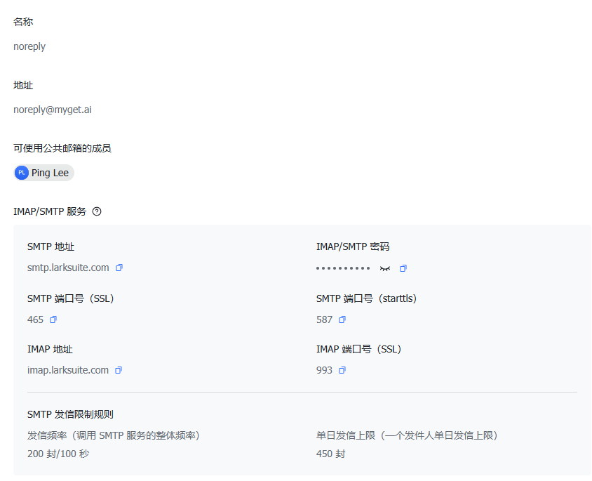

# 集成 Lark Mail 实现邮件发送

[[toc]]
本文档介绍如何基于 Lark Mail 实现邮件发送功能。通过继承 Lark Mail 接口并调用内部封装的邮件发送工具，我们可以方便地对接 [smtp.larksuite.com](smtp.larksuite.com) 的 SMTP 服务，实现邮件发送。下面将详细介绍如何在项目中集成及使用这一功能。

---

## 1. 环境准备与账号配置

在使用 Lark Mail 发送邮件之前，首先需要登录 [larkadmin.larksuite.com](https://larksuite.com) 进行公共邮箱的创建配置。步骤如下：

1. 登录 larkadmin.larksuite.com 后，进入 **邮箱** 模块；
2. 在 **地址管理** 中选择 **公共邮箱**；
3. 点击 **创建公共邮箱** 并完成邮箱创建。

创建成功后，会显示如下信息：

- **SMTP 地址**：smtp.larksuite.com
- **IMAP/SMTP 密码**：（用于认证）
- **SMTP 端口号（SSL）**：465
- **SMTP 端口号（starttls）**：587
- **IMAP 地址**：imap.larksuite.com
- **IMAP 端口号（SSL）**：993

此外，Lark Mail 对发信有一定限制：

- 发信频率：200 封/100 秒
- 单日发信上限：450 封

下图展示了公共邮箱的配置信息：  


---

## 2. 邮箱服务配置说明

在集成过程中，需要根据 Lark Mail 的配置参数设置邮件服务器相关属性。主要包括：

- **SMTP 服务器地址**：配置为 `smtp.larksuite.com`
- **SMTP 端口号**：根据使用的传输协议，SSL 使用 465，STARTTLS 使用 587
- **认证信息**：包括用户名、密码及发信邮箱地址
- **传输协议**：通常为 `smtp`，同时需要设置 SSL 的相关属性以确保安全连接

这些配置将通过环境变量进行加载，方便在不同环境下灵活配置。

---

## 3. 集成步骤与代码说明

接下来介绍如何使用 Java 代码实现对 Lark Mail 的封装以及调用内置的 email 框架发送邮件。

### 3.1 添加依赖

首先在项目中添加邮件发送所需的依赖，本例使用 JavaMail 库：

```xml
<dependency>
  <groupId>com.sun.mail</groupId>
  <artifactId>javax.mail</artifactId>
  <version>1.6.2</version>
</dependency>
```

这一步确保项目能够使用 JavaMail API 发送邮件。

### 3.2 实现邮件发送类

我们创建一个 `LarkSuitMail` 类，实现 `EMail` 接口，封装了邮件发送的逻辑。该类主要完成以下工作：

- 从环境变量中获取 SMTP 主机、协议、端口、用户名、密码和发信邮箱等参数；
- 设置 JavaMail 所需的属性，如主机、协议、端口和 SSL 配置；
- 调用工具类 `EMailSendUtils.send(...)` 完成邮件发送。

```java
package com.litongjava.open.chat.mail;

import java.util.Properties;
import com.litongjava.tio.utils.email.EMail;
import com.litongjava.tio.utils.email.EMailSendUtils;
import com.litongjava.tio.utils.environment.EnvUtils;

public class LarkSuitMail implements EMail {

  /**
   * 发送邮件
   * @param to 收件人
   * @param subject 邮件主题
   * @param content 邮件内容
   * @param isDebug 是否开启调试模式
   */
  public void send(String to, String subject, String content, boolean isDebug) {
    String smptHost = EnvUtils.get("lark.mail.host");
    String mailTransportProtocol = EnvUtils.get("lark.mail.protocol");

    Integer smtpPort = EnvUtils.getInt("lark.mail.smpt.port");
    String user = EnvUtils.get("lark.mail.user");
    String password = EnvUtils.get("lark.mail.password");
    String from = EnvUtils.get("lark.mail.from");

    Properties prop = new Properties();
    // 邮件服务器
    prop.setProperty("mail.host", smptHost);
    // 传输协议
    prop.setProperty("mail.transport.protocol", mailTransportProtocol);
    // 开启验证
    prop.setProperty("mail.smtp.auth", "true");
    // 设置端口
    prop.setProperty("mail.smtp.port", smtpPort + "");
    // 配置 SSL 相关属性
    prop.setProperty("mail.smtp.socketFactory.class", "javax.net.ssl.SSLSocketFactory");
    prop.setProperty("mail.smtp.socketFactory.fallback", "false");
    prop.setProperty("mail.smtp.socketFactory.port", smtpPort + "");

    EMailSendUtils.send(to, subject, content, isDebug, smptHost, smtpPort, user, password, from, prop);
  }
}
```

### 3.3 工厂模式封装

为了使邮件发送类的调用更加灵活，采用工厂模式封装。通过实现 `IEMailFactory` 接口，我们可以统一管理邮件发送实例的获取：

```java
package com.litongjava.open.chat.mail;

import com.litongjava.tio.utils.email.EMail;
import com.litongjava.tio.utils.email.IEMailFactory;

public class LarkSuitMailFactory implements IEMailFactory {

  @Override
  public EMail getMail() {
    return new LarkSuitMail();
  }
}
```

### 3.4 工具类封装

为了简化调用，在 `LarkSuitEmailUtils` 类中对外提供了静态方法，使得在其他模块中调用邮件发送时无需关心具体实现细节：

```java
package com.litongjava.open.chat.mail;

import com.litongjava.tio.utils.email.EMail;
import com.litongjava.tio.utils.email.IEMailFactory;

public class LarkSuitEmailUtils {

  public static final LarkSuitMailFactory larkSuitMailFactory = new LarkSuitMailFactory();

  /**
   * 发送邮件（支持调试模式）
   * @param to 收件人
   * @param subject 邮件主题
   * @param content 邮件内容
   * @param isDebug 是否开启调试模式
   */
  public static void send(String to, String subject, String content, boolean isDebug) {
    larkSuitMailFactory.getMail().send(to, subject, content, isDebug);
  }

  /**
   * 发送邮件（默认非调试模式）
   * @param to 收件人
   * @param subject 邮件主题
   * @param content 邮件内容
   */
  public static void send(String to, String subject, String content) {
    larkSuitMailFactory.getMail().send(to, subject, content, false);
  }
}
```

### 3.5 测试发送邮件

最后，通过单元测试验证邮件发送功能是否正常。测试类加载环境变量后调用工具类发送邮件：

```java
package com.litongjava.open.chat.mail;

import org.junit.Test;
import com.litongjava.tio.utils.environment.EnvUtils;

public class LarkSuitEmailUtilsTest {

  @Test
  public void test() {
    EnvUtils.load();
    LarkSuitEmailUtils.send("litongjava001@gmail.com", "你好", "你好,你的验证码是1234");
  }
}
```

在测试时，请确保环境变量已正确配置，例如 `lark.mail.host`、`lark.mail.protocol`、`lark.mail.smpt.port`、`lark.mail.user`、`lark.mail.password` 和 `lark.mail.from` 等。

---

### 3.6. 总结

本文档详细介绍了如何集成 Lark Mail 邮件发送功能。主要步骤包括：

- 在 Lark Suite 后台创建并获取公共邮箱配置信息；
- 添加 JavaMail 依赖；
- 通过继承接口实现邮件发送逻辑；
- 利用工厂模式及工具类对邮件发送功能进行封装，使调用变得简单；
- 通过单元测试验证邮件发送流程是否正常。

通过以上步骤，您可以将 Lark Mail 集成到项目中，便捷地实现邮件发送功能，并可根据业务需要进一步扩展和定制。

## 4. 复用连接

在在上面使用 Lark Mail 发送邮件时，如果每次发送邮件都新建一次 SMTP 连接，会导致建立连接和 SSL 握手的耗时累积，进而可能出现发送一份邮件需要 30 秒以上的情况。为了解决这一问题，我们可以通过复用连接的方式，避免每次都重新建立连接，从而提升发送速度。

本文将介绍如何修改 LarkSuitMail，实现连接复用的功能，并展示如何在系统启动时进行配置，以及后续如何调用发送邮件的工具类。

---

### 4.1. 复用连接的原理

在传统的邮件发送流程中，每次调用发送方法时都会创建新的 Session 和 Transport 对象，并建立 SMTP 连接。这样会导致大量重复的 SSL 握手和连接建立操作，明显影响发送速度。  
通过复用连接，我们只在程序启动时建立一次 SMTP 连接，后续发送邮件时直接复用该连接，只有在连接断开时才进行重连。这样可以显著减少重复建立连接的开销，特别适用于频繁发送邮件的场景。

---

### 4.2. 修改后的代码实现

下面给出经过改造后，实现连接复用的代码示例。

#### 4.2.1 LarkSuitMail 类

```java
package com.litongjava.open.chat.mail;

import java.util.Properties;
import javax.mail.Message;
import javax.mail.Session;
import javax.mail.Transport;
import javax.mail.internet.InternetAddress;
import javax.mail.internet.MimeMessage;
import com.litongjava.tio.utils.environment.EnvUtils;

public class LarkSuitMail {

  private Session session;
  private Transport transport;
  private Properties prop;

  // 连接参数，从环境变量中读取
  private String mailHost;
  private Integer smtpPort;
  private String user;
  private String password;
  private String from;
  private String mailTransportProtocol;

  public LarkSuitMail() {
    // 初始化连接参数
    mailHost = EnvUtils.get("lark.mail.host");
    mailTransportProtocol = EnvUtils.get("lark.mail.protocol");
    smtpPort = EnvUtils.getInt("lark.mail.smpt.port");
    user = EnvUtils.get("lark.mail.user");
    password = EnvUtils.get("lark.mail.password");
    from = EnvUtils.get("lark.mail.from");

    // 设置邮件属性
    prop = new Properties();
    prop.setProperty("mail.host", mailHost);
    prop.setProperty("mail.transport.protocol", mailTransportProtocol);
    prop.setProperty("mail.smtp.auth", "true");
    prop.setProperty("mail.smtp.port", smtpPort.toString());
    prop.setProperty("mail.smtp.socketFactory.class", "javax.net.ssl.SSLSocketFactory");
    prop.setProperty("mail.smtp.socketFactory.fallback", "false");
    prop.setProperty("mail.smtp.socketFactory.port", smtpPort.toString());

    // 创建 Session
    session = Session.getInstance(prop);

    // 初次建立连接
    try {
      transport = session.getTransport();
      transport.connect(mailHost, smtpPort, user, password);
    } catch (Exception e) {
      e.printStackTrace();
    }
  }

  /**
   * 发送邮件，复用已建立的连接
   * @param to 收件人
   * @param subject 邮件主题
   * @param content 邮件内容
   * @param isDebug 是否开启调试模式
   */
  public synchronized void send(String to, String subject, String content, boolean isDebug) {
    // 设置调试模式
    session.setDebug(isDebug);
    MimeMessage message = new MimeMessage(session);
    try {
      // 如果连接断开，重新连接
      if (transport == null || !transport.isConnected()) {
        transport = session.getTransport();
        transport.connect(mailHost, smtpPort, user, password);
      }
      // 设置邮件信息
      message.setFrom(new InternetAddress(from));
      message.setRecipient(Message.RecipientType.TO, new InternetAddress(to));
      message.setSubject(subject);
      message.setText(content);

      // 复用 transport 发送邮件
      transport.sendMessage(message, message.getAllRecipients());
    } catch (Exception e) {
      e.printStackTrace();
    }
  }

  /**
   * 关闭 SMTP 连接，可在应用退出时调用
   */
  public synchronized void close() {
    if (transport != null && transport.isConnected()) {
      try {
        transport.close();
      } catch (Exception e) {
        e.printStackTrace();
      }
    }
  }
}
```

**说明：**

- 在构造函数中，从环境变量中读取 SMTP 配置参数，并设置邮件属性。
- 通过 `Session.getInstance(prop)` 创建 Session 后，首次建立 SMTP 连接。
- 在 `send()` 方法中，首先检查当前连接状态，如断开则重新建立连接，然后利用同一个 Transport 对象发送邮件。
- `synchronized` 关键字保证多线程环境下的线程安全（单连接模式下建议使用）。
- 提供 `close()` 方法，在系统关闭或空闲时主动关闭连接。

#### 4.2.2 LarkSuitEmailUtils 工具类

为了简化邮件发送调用，我们封装一个工具类：

```java
package com.litongjava.open.chat.mail;

public class LarkSuitEmailUtils {

  public static LarkSuitMail mail;

  public static void setMail(LarkSuitMail mail) {
    LarkSuitEmailUtils.mail = mail;
  }

  /**
   * 发送邮件，支持调试模式
   * @param to 收件人
   * @param subject 邮件主题
   * @param content 邮件内容
   * @param isDebug 是否开启调试模式
   */
  public static void send(String to, String subject, String content, boolean isDebug) {
    mail.send(to, subject, content, isDebug);
  }

  /**
   * 发送邮件，默认非调试模式
   * @param to 收件人
   * @param subject 邮件主题
   * @param content 邮件内容
   */
  public static void send(String to, String subject, String content) {
    mail.send(to, subject, content, false);
  }
}
```

#### 4.2.3 配置类 LarkSuitMailConfig

在程序启动时，通过配置类来初始化 SMTP 连接，并设置销毁方法，以便程序退出时关闭连接：

```java
package com.litongjava.open.chat.config;

import com.litongjava.hook.HookCan;
import com.litongjava.open.chat.mail.LarkSuitEmailUtils;
import com.litongjava.open.chat.mail.LarkSuitMail;

public class LarkSuitMailConfig {

  public void config() {
    LarkSuitMail larkSuitMail = new LarkSuitMail();
    LarkSuitEmailUtils.setMail(larkSuitMail);
    HookCan.me().addDestroyMethod(larkSuitMail::close);
  }
}
```

#### 4.2.4 测试示例

通过单元测试类验证邮件发送功能。测试时可发送多封邮件，验证连接复用的效果：

```java
package com.litongjava.open.chat.mail;

import org.junit.Test;
import com.litongjava.open.chat.config.LarkSuitMailConfig;
import com.litongjava.tio.utils.environment.EnvUtils;

public class LarkSuitEmailUtilsTest {

  @Test
  public void test() {
    EnvUtils.load();
    new LarkSuitMailConfig().config();
    LarkSuitEmailUtils.send("litongjava001@gmail.com", "你好", "你好,你的验证码是1234");
    LarkSuitEmailUtils.send("litongjava001@gmail.com", "你好", "你好,你的验证码是12346");
  }
}
```

---

### 4.3. 使用说明

1. **环境配置**  
   请确保在运行前已经设置好以下环境变量：

   - `lark.mail.host`：SMTP 服务器地址（如 smtp.larksuite.com）
   - `lark.mail.protocol`：传输协议（通常为 smtp）
   - `lark.mail.smpt.port`：SMTP 端口（SSL 一般为 465）
   - `lark.mail.user`：SMTP 用户名
   - `lark.mail.password`：SMTP 密码
   - `lark.mail.from`：发件邮箱地址

2. **启动时配置**  
   在应用启动时调用 `LarkSuitMailConfig.config()` 初始化 SMTP 连接并注册销毁钩子，确保程序退出时能自动关闭连接。

3. **发送邮件**  
   通过 `LarkSuitEmailUtils.send(...)` 方法发送邮件，系统会自动复用已建立的 SMTP 连接，提升邮件发送速度。

---

### 4.4. 总结

本文档介绍了如何通过复用 SMTP 连接的方式，避免每次发送邮件都重新建立连接所导致的高延迟问题。通过修改 LarkSuitMail 类，使其在初始化时建立连接，并在每次发送邮件前检查连接状态，从而实现高效的连接复用。同时，还提供了配置类和工具类，方便在系统启动时统一初始化和管理 SMTP 连接。  
这种方式在频繁发送邮件的场景下能够显著降低连接建立的开销，提高整体邮件发送效率。
