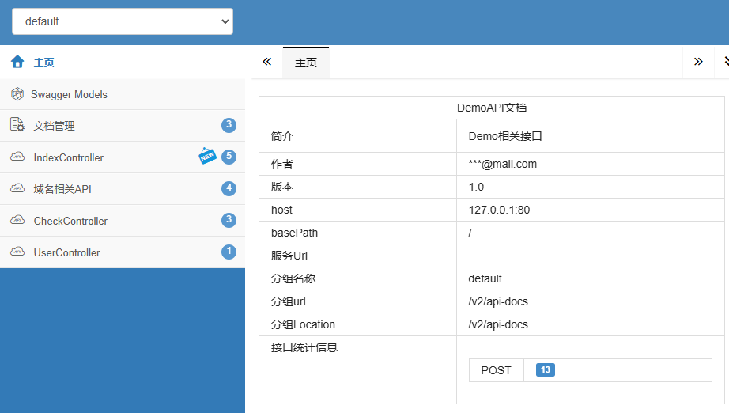
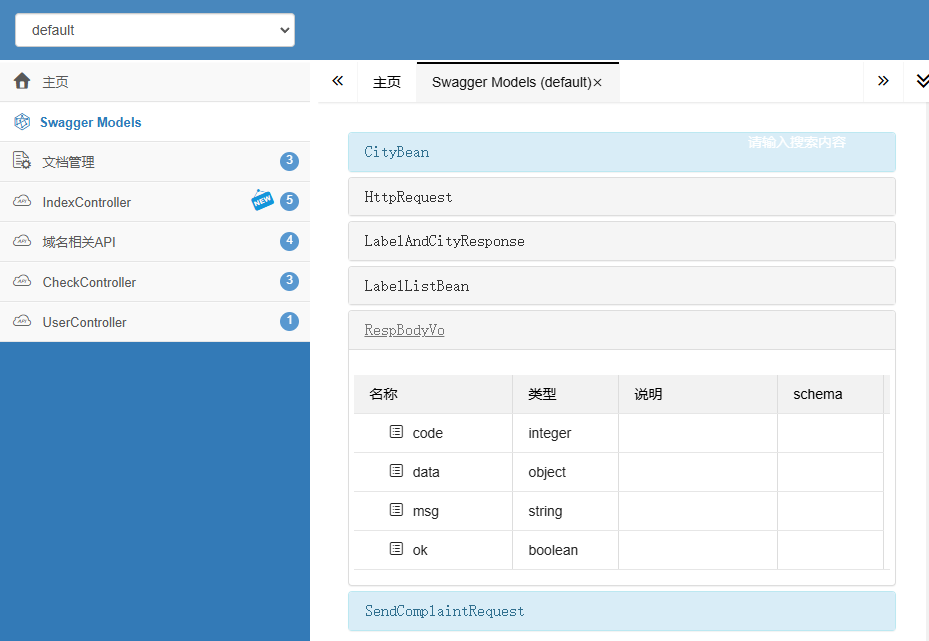
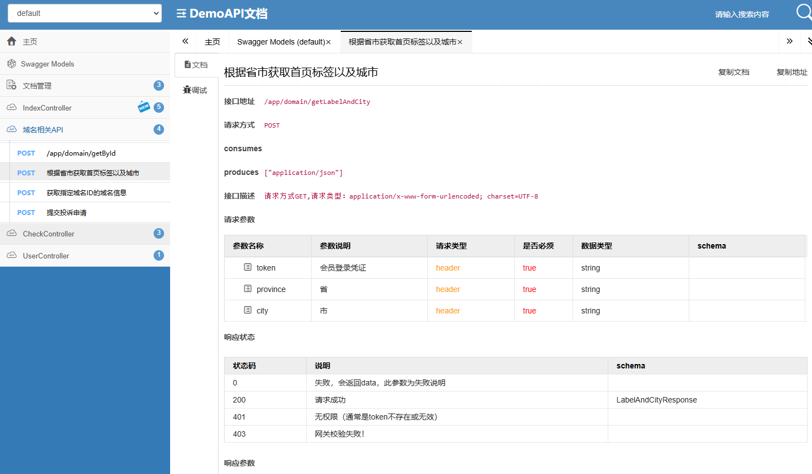
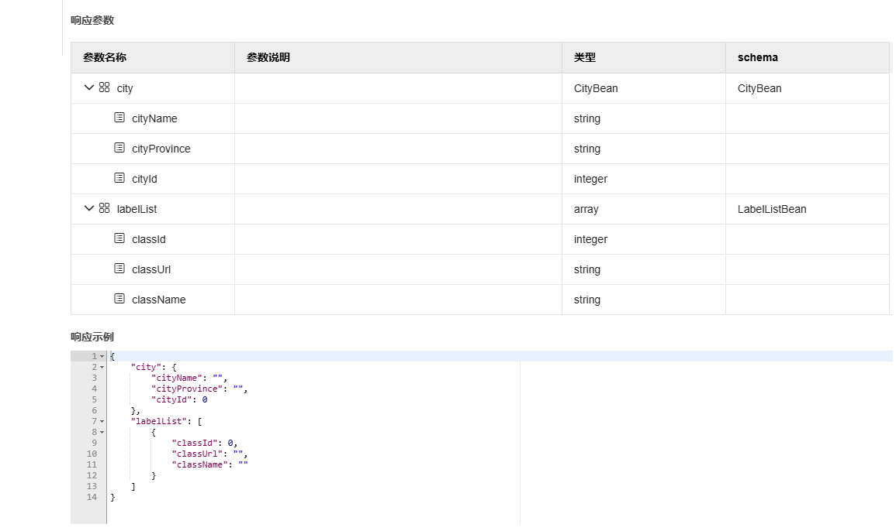
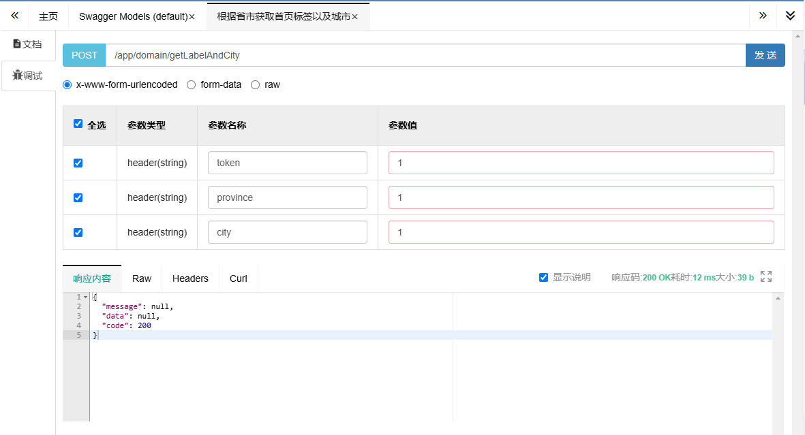

# Swagger

在现代 Web 应用开发中，API 文档的自动化生成是提高开发效率和维护性的重要手段。Swagger 作为一种广泛使用的 API 文档生成工具，与 Tio-Boot 框架的集成能够为开发者提供便捷的接口文档管理。本文将详细介绍如何在 Tio-Boot 项目中集成 Swagger，包括依赖添加、配置设置、代码实现及相关组件的讲解。

## 目录

1. [前言](#前言)
2. [添加依赖](#添加依赖)
3. [配置 Swagger](#配置-swagger)
4. [实现 Handlers](#实现-handlers)
5. [定义实体类](#定义实体类)
6. [编写 Controller](#编写-controller)
7. [Swagger 规范](#swagger-规范)
8. [关键类讲解](#关键类讲解)
   - [SwaggerResourceHandler](#swaggerresourcehandler)
   - [WebjarHandler](#webjarhandler)
   - [SwaggerV2ApiDocsHandler](#swaggerv2apidocshandler)
9. [整合完成后的访问测试](#整合完成后的访问测试)
10. [总结](#总结)

## 前言

Swagger 提供了一套完整的解决方案，用于描述、消费和可视化 RESTful Web 服务。通过与 Tio-Boot 的集成，开发者可以轻松生成和维护 API 文档，提升团队协作效率。本教程将带领你一步步完成 Swagger 在 Tio-Boot 项目中的集成。

## 添加依赖

首先，在项目的 `pom.xml` 文件中添加必要的 Swagger 相关依赖。以下是需要添加的三个主要依赖：

```xml
<dependency>
  <groupId>io.springfox</groupId>
  <artifactId>springfox-core</artifactId>
  <version>2.9.2</version>
</dependency>

<dependency>
  <groupId>io.swagger</groupId>
  <artifactId>swagger-annotations</artifactId>
  <version>1.5.20</version>
</dependency>

<dependency>
  <groupId>com.github.xiaoymin</groupId>
  <artifactId>swagger-bootstrap-ui</artifactId>
  <version>1.9.6</version>
</dependency>
```

这些依赖分别提供了 Swagger 的核心功能、注解支持以及美观的 UI 界面。

## 配置 Swagger

接下来，需要在项目中进行 Swagger 的配置。创建一个新的配置类 `SwaggerConfiguration`，并添加以下内容：

```java
package com.litongjava.tio.web.hello.config;

import com.litongjava.annotation.AConfiguration;
import com.litongjava.annotation.Initialization;
import com.litongjava.tio.boot.http.handler.common.WebjarHandler;
import com.litongjava.tio.boot.server.TioBootServer;
import com.litongjava.tio.boot.swagger.SwaggerResourceHandler;
import com.litongjava.tio.boot.swagger.SwaggerV2ApiDocsHandler;
import com.litongjava.tio.boot.swagger.TioSwaggerV2Config;
import com.litongjava.tio.http.server.router.HttpRequestRouter;
import com.litongjava.tio.web.hello.controller.SwaggerUiHandler;

import springfox.documentation.builders.ApiInfoBuilder;
import springfox.documentation.service.ApiInfo;

@AConfiguration
public class SwaggerConfiguration {

  @Initialization
  public void config() {
    TioBootServer server = TioBootServer.me();

    @SuppressWarnings("deprecation")
    ApiInfo appInfo = new ApiInfoBuilder().title("DemoAPI文档")
        //
        .description("Demo相关接口")
        //
        .contact("***@mail.com").version("1.0").build();

    TioSwaggerV2Config tioSwaggerV2Config = new TioSwaggerV2Config();
    tioSwaggerV2Config.setApiInfo(appInfo);
    tioSwaggerV2Config.setEnable(true);

    server.setSwaggerV2Config(tioSwaggerV2Config);

    HttpRequestRouter requestRouter = server.getRequestRouter();

    if (requestRouter != null) {
      SwaggerUiHandler swggerUiHander = new SwaggerUiHandler();
      requestRouter.add("/doc.html", swggerUiHander::html);
      WebjarHandler webjarHandler = new WebjarHandler();
      requestRouter.add("/webjars/**", webjarHandler::index);

      SwaggerResourceHandler swaggerResourceHandler = new SwaggerResourceHandler();
      requestRouter.add("/swagger-resources", swaggerResourceHandler::index);
      requestRouter.add("/swagger-resources/configuration/ui", swaggerResourceHandler::configurationUi);

      SwaggerV2ApiDocsHandler swaggerV2ApiDocsHandler = new SwaggerV2ApiDocsHandler();
      requestRouter.add("/v2/api-docs", swaggerV2ApiDocsHandler::index);
    }
  }
}
```

### 代码讲解

- **@AConfiguration**: 标识这是一个配置类。
- **@Initialization**: 指定 `config` 方法在初始化时执行。
- **ApiInfo**: 用于定义 API 的基本信息，如标题、描述、联系人和版本。
- **TioSwaggerV2Config**: 配置 Swagger 的启用状态和 API 信息。
- **HttpRequestRouter**: 用于路由 Swagger 相关的请求到相应的处理器。

配置 Interceptor 允许请求

```
model.addAllowUrls("/doc.html", "/webjars/**", "/swagger-resources", "/swagger-resources/configuration/ui", "/v2/api-docs");
```

## 实现 Handlers

为了正确处理 Swagger 的相关请求，需要实现特定的处理器。以下是 `SwaggerUiHandler` 的实现：

```java
package com.litongjava.tio.web.hello.controller;

import java.net.URL;

import com.litongjava.tio.boot.http.TioRequestContext;
import com.litongjava.tio.boot.utils.HttpBasicAuthUtils;
import com.litongjava.tio.http.common.HttpRequest;
import com.litongjava.tio.http.common.HttpResponse;
import com.litongjava.tio.http.server.util.Resps;
import com.litongjava.tio.utils.hutool.FileUtil;
import com.litongjava.tio.utils.hutool.ResourceUtil;

import lombok.extern.slf4j.Slf4j;

@Slf4j
public class SwaggerUiHandler {

  public HttpResponse html(HttpRequest request) throws Exception {
    String authorization = request.getHeader("authorization");
    if (!HttpBasicAuthUtils.authenticate(authorization, "admin", "admin")) {
      HttpResponse response = TioRequestContext.getResponse();
      response.setStatus(401);
      response.addHeader("WWW-Authenticate", "Basic realm=\"Access to the site\"");
      return response;
    }
    // 获取 META-INF 目录下的 doc.html 文件内容
    String path = "META-INF/resources/doc.html";
    URL resource = ResourceUtil.getResource(path);
    HttpResponse response = TioRequestContext.getResponse();

    String html = null;
    if (resource == null) {
      log.error("resouce is empty:{}", path);
      html = "resource is empty";
    } else {
      html = FileUtil.readString(resource).toString();
    }
    return Resps.html(response, html);
  }
}
```

### 代码讲解

- **身份验证**: 通过 `HttpBasicAuthUtils` 对请求头中的 `authorization` 进行基本认证，确保只有授权用户才能访问文档页面。
- **资源获取**: 从 `META-INF/resources` 目录下加载 `doc.html` 文件，该文件是 Swagger UI 的入口页面。
- **响应生成**: 根据资源是否存在，生成相应的 HTML 响应。

## 定义实体类

为了更好地描述 API 请求和响应的数据结构，需要使用 Swagger 的注解来定义实体类。以下是两个示例：

### `SendComplaintRequest` 实体类

```java
package com.litongjava.tio.web.hello.model;

import io.swagger.annotations.ApiModel;
import io.swagger.annotations.ApiModelProperty;

import java.util.List;

@ApiModel(value = "投诉意见入参")
public class SendComplaintRequest {
  @ApiModelProperty(value = "0=投诉用户 1=平台功能")
  public String complaintsType;
  @ApiModelProperty(value = "内容描述")
  public String complaintsNote;
  @ApiModelProperty(value = "图片视频")
  public List<String> complaintsImg;
  @ApiModelProperty(value = "联系方式")
  public String complaintsContact;
}
```

### `LabelAndCityResponse` 实体类

```java
package com.litongjava.tio.web.hello.model;

import io.swagger.annotations.ApiModel;
import io.swagger.annotations.ApiModelProperty;

import java.util.List;

@ApiModel(value = "城市和分类信息出参")
public class LabelAndCityResponse {

  @ApiModelProperty(value = "城市信息")
  public CityBean city;
  @ApiModelProperty(value = "首页分类信息")
  public List<LabelListBean> labelList;

  public static class CityBean {
    /**
     * cityName : 成都市
     * cityProvince : 四川省
     * cityId : 1
     */
    @ApiModelProperty(value = "城市名称")
    public String cityName;
    @ApiModelProperty(value = "归属省份")
    public String cityProvince;
    @ApiModelProperty(value = "城市ID")
    public int cityId;
  }

  public static class LabelListBean {
    @ApiModelProperty(value = "分类ID")
    public int classId;
    @ApiModelProperty(value = "路由URL")
    public String classUrl;
    @ApiModelProperty(value = "分类名称")
    public String className;

  }
}
```

### 代码讲解

- **@ApiModel**: 用于描述实体类的整体信息。
- **@ApiModelProperty**: 用于描述类中各个字段的详细信息，如字段含义、数据类型等。

## 编写 Controller

在 Controller 中，通过 Swagger 的注解来描述各个接口的详细信息。以下是 `AppDomainController` 的示例：

```java
package com.litongjava.tio.web.hello.controller;

import com.litongjava.annotation.GatewayCheck;
import com.litongjava.annotation.RequestPath;
import com.litongjava.model.body.RespBodyVo;
import com.litongjava.model.result.ResultVo;
import com.litongjava.tio.web.hello.model.LabelAndCityResponse;
import com.litongjava.tio.web.hello.model.SendComplaintRequest;

import io.swagger.annotations.Api;
import io.swagger.annotations.ApiImplicitParam;
import io.swagger.annotations.ApiImplicitParams;
import io.swagger.annotations.ApiOperation;
import io.swagger.annotations.ApiResponse;
import io.swagger.annotations.ApiResponses;

@Api(tags = "域名相关API")
@RequestPath("/app/domain")
public class AppDomainController {

  /**
   * 获取指定域名ID的域名信息
   *
   * @return
   */
  // paramType "query", "path", "header"
  @GatewayCheck(checkAdminToken = false, checkUserToken = false)
  @RequestPath("/selectLrbAppDomainById")
  @ApiOperation(value = "获取指定域名ID的域名信息", notes = "请求方式GET,请求类型：application/x-www-form-urlencoded; charset=UTF-8")
  @ApiImplicitParams({
      //
      @ApiImplicitParam(value = "平台管理员登录凭证", name = "token", paramType = "header", required = true),
      //
      @ApiImplicitParam(value = "时间戳", name = "timestamp", paramType = "header", required = true),
      //
      @ApiImplicitParam(value = "管理员令牌(前端heAppDomainer携带管理员令牌，暂时通过接口文档里面的申请令牌接口获取！)",
          //
          name = "AppDomainministratorToken", paramType = "query", required = true),
      //
      @ApiImplicitParam(value = "域名ID", name = "AppDomainId", paramType = "query", required = true), })

  @ApiResponses({
      //
      @ApiResponse(code = 200, message = "请求成功"),
      //
      @ApiResponse(code = 0, message = "失败，会返回data，此参数为失败说明"),
      //
      @ApiResponse(code = 401, message = "无权限（通常是token不存在或无效）"),
      //
      @ApiResponse(code = 403, message = "网关校验失败！"),
      //
      @ApiResponse(code = 405, message = "管理员令牌校验失败（前端直接跳转一个友好的404页面）！"), })

  RespBodyVo selectLrbAppDomainById() {
    return RespBodyVo.ok();
  }

  RespBodyVo getById(Long id) {
    return RespBodyVo.ok();
  }

  @GatewayCheck(checkUserToken = false)
  @ApiOperation(value = "提交投诉申请", notes = "请求方式POST,请求类型：application/json; charset=UTF-8")
  @ApiImplicitParams({
      //
      @ApiImplicitParam(value = "登录凭证", name = "token", paramType = "header", required = true), })
  @ApiResponses({
      //
      @ApiResponse(code = 200, message = "请求成功"),
      //
      @ApiResponse(code = 0, message = "失败，会返回data，此参数为失败说明"),
      //
      @ApiResponse(code = 401, message = "无权限（通常是token不存在或无效）"),
      //
      @ApiResponse(code = 403, message = "网关校验失败！"), })
  ResultVo sendComplaint(SendComplaintRequest complaintRequest) {
    return ResultVo.ok();
  }

  @GatewayCheck(checkUserToken = false)
  @ApiOperation(value = "根据省市获取首页标签以及城市", notes = "请求方式GET,请求类型：application/x-www-form-urlencoded; charset=UTF-8")
  @ApiImplicitParams({
      //
      @ApiImplicitParam(value = "会员登录凭证", name = "token", paramType = "header", required = true),
      //
      @ApiImplicitParam(value = "省", name = "province", paramType = "header", required = true),
      //
      @ApiImplicitParam(value = "市", name = "city", paramType = "header", required = true), })
  @ApiResponses({
      //
      @ApiResponse(code = 200, message = "请求成功", response = LabelAndCityResponse.class),
      //
      @ApiResponse(code = 0, message = "失败，会返回data，此参数为失败说明"),
      //
      @ApiResponse(code = 401, message = "无权限（通常是token不存在或无效）"),
      //
      @ApiResponse(code = 403, message = "网关校验失败！"), })
  ResultVo getLabelAndCity() {
    return ResultVo.ok();
  }
}
```

### 代码讲解

- **@Api**: 用于对整个 Controller 进行描述，`tags` 用于分类。
- **@ApiOperation**: 描述具体的接口功能和备注信息。
- **@ApiImplicitParams** 和 **@ApiImplicitParam**: 描述接口的请求参数，包括参数名称、类型、是否必填等。
- **@ApiResponses** 和 **@ApiResponse**: 描述接口的响应情况，包括响应码和对应的描述。
- **@GatewayCheck** 和 **@RequestPath**: 自定义注解，用于网关校验和请求路径映射。

## Swagger 规范

为了确保 API 文档的统一性和可读性，遵循 Swagger 规范至关重要。以下是一些关键的 Swagger 规范要点：

1. **统一的 API 描述**: 使用 `@Api` 和 `@ApiOperation` 注解对 API 进行分类和描述，确保每个接口都有清晰的功能说明。
2. **详细的参数说明**: 通过 `@ApiImplicitParam` 注解详细描述每个请求参数，包括参数名称、类型、位置（header、query、path 等）、是否必填及其含义。
3. **响应状态码**: 使用 `@ApiResponses` 和 `@ApiResponse` 注解明确描述接口的不同响应状态及其含义，帮助前端开发者快速理解接口行为。
4. **数据模型定义**: 使用 `@ApiModel` 和 `@ApiModelProperty` 注解定义请求和响应的数据结构，确保数据传输的一致性和准确性。
5. **安全性描述**: 对于需要认证的接口，通过描述认证方式（如 Basic Auth、Bearer Token）提升 API 文档的安全性和实用性。

遵循上述规范，可以生成结构清晰、易于理解和维护的 API 文档。

## 关键类讲解

在 Swagger 与 Tio-Boot 集成过程中，`SwaggerResourceHandler`、`WebjarHandler` 和 `SwaggerV2ApiDocsHandler` 是三个内置的重要类，负责处理不同类型的 Swagger 请求。以下是对这三个类的详细讲解：

### SwaggerResourceHandler

`SwaggerResourceHandler` 负责处理 Swagger 资源的相关请求，包括 Swagger 配置和资源列表的获取。

- **主要功能**:
  - 提供 Swagger UI 所需的资源列表。
  - 配置 Swagger UI 的相关参数，如 API 文档的地址、Swagger 版本等。
- **关键方法**:
  - `index()`: 返回 Swagger 资源的列表，用于 Swagger UI 加载接口文档。
  - `configurationUi()`: 提供 Swagger UI 的配置文件，定义 Swagger UI 的行为和显示方式。

### WebjarHandler

`WebjarHandler` 主要用于处理 Webjar 中的静态资源请求，如 CSS、JS 和图片等资源文件。

- **主要功能**:
  - 提供 Swagger UI 所需的静态资源文件。
  - 确保 Swagger UI 的界面能够正确加载和显示。
- **关键方法**:
  - `index()`: 根据请求路径返回对应的静态资源文件，支持多种资源文件的加载。

### SwaggerV2ApiDocsHandler

`SwaggerV2ApiDocsHandler` 负责提供 Swagger 2.0 版本的 API 文档。

- **主要功能**:
  - 生成并提供符合 Swagger 2.0 规范的 API 文档。
  - 支持动态生成 API 文档，反映最新的接口定义。
- **关键方法**:
  - `index()`: 返回 Swagger 2.0 规范的 API 文档，供 Swagger UI 解析和展示。

通过这三个处理器，Swagger 可以完整地提供接口文档的生成、资源加载和动态更新功能，确保开发者能够高效地使用 Swagger 进行 API 文档管理。

## 整合完成后的访问测试

在完成上述步骤后，可以通过访问以下地址来查看生成的 API 文档：

```
http://localhost/doc.html
```

访问时需要输入用户名和密码（默认 `admin/admin`）。登录后，您将看到如下界面：



Swagger UI 将展示所有定义的 API 接口和模型，支持在线测试和文档查看。



选择具体的接口后，可以查看详细的参数说明和响应示例：



此外，Swagger 还提供了在线测试功能，方便开发者快速验证接口的正确性：



## 总结

通过本文的介绍，您已经掌握了在 Tio-Boot 项目中集成 Swagger 的完整流程，包括依赖添加、配置设置、代码实现及关键组件的讲解。集成 Swagger 不仅能够提高 API 文档的可维护性和可读性，还能提升团队协作效率，为项目的持续发展奠定坚实基础。

希望本文对您在项目中集成 Swagger 提供了有价值的指导和帮助。如有任何问题或建议，欢迎在评论区交流探讨。
