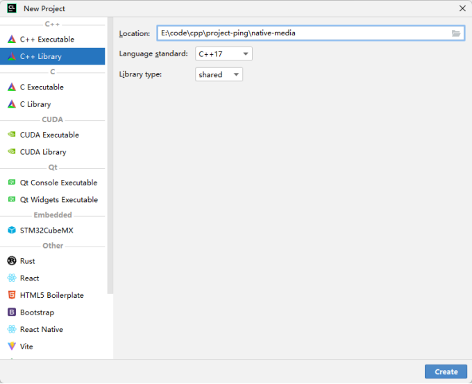
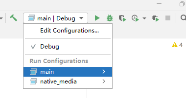

# JNI 入门示例

[[toc]]

在开发 Android 或 Java 项目时，为了复用现有的 C/C++ 代码，我们通常会使用 C/C++ 开发一部分核心功能。JNI（Java Native Interface）作为 JVM 与 C/C++ 代码交互的桥梁，提供了这种跨语言调用能力。本文以一个简单的 “Hello JNI” 示例为例，讲解如何搭建环境、生成 JNI 头文件、编译 C/C++ 代码，并在 Java 中加载动态库。文中同时附上详细解释和背后的原理讲解。

---

## 目录结构及基本准备

首先，在 Java 工程下新建两个目录：

- **jni**：用于存放生成的 JNI 头文件。
- **lib**：用于存放 C/C++ 编译生成的动态库文件。

在 Java 项目中，定义一个 native 方法，例如：

```java
package com.litongjava.media;

public class NativeMedia {
  public static native String[] splitMp3(String srcPath, long size);
}
```

### 生成 JNI 头文件

使用 `javah` 工具生成 JNI 头文件，执行命令如下（注意调整 JDK 路径和 classpath）：

```
D:\java\jdk1.8.0_121\bin\javah -J-Dfile.encoding=UTF-8 -d jni -classpath src\main\java com.litongjava.media.NativeMedia
```

生成的文件为：

```
jni/com_litongjava_media_NativeMedia.h
```

---

## 创建 C/C++ 工程

使用 CLion 新建项目（项目名称可自定义，这里命名为 native_media），设置如下：

- **Language standard**：选择任一标准均可。
- **Library type**：选择 **shared**（动态库）。



项目的完整目录结构如下：

```
├── jni
│   ├── com_litongjava_media_NativeMedia.h
├── src
│   ├── CMakeLists.txt
│   ├── native_media.c
│   ├── native_media_main.c
```

其中：

- **jni** 目录为 javah 工具生成的头文件存放位置。
- **src** 目录为源码存放位置。

### 根目录下的 CMakeLists.txt

根 CMakeLists.txt 配置项目全局信息，查找 JNI 依赖，并包含头文件目录，内容如下：

```cmake
cmake_minimum_required(VERSION 3.27)
project(native_media)

set(CMAKE_CXX_STANDARD 17)

find_package(JNI REQUIRED)
message(STATUS "JNI_INCLUDE_DIRS = ${JNI_INCLUDE_DIRS}")
message(STATUS "JNI_LIBRARIES = ${JNI_LIBRARIES}")
include_directories(${JNI_INCLUDE_DIRS})

include_directories(jni)
add_subdirectory(src)
```

### src 目录下的 CMakeLists.txt

该文件指定需要编译的源文件，并生成动态库：

```cmake
add_library(native_media SHARED native_media.c)
```

---

## 编写 JNI 代码

### native_media.c

在 C 代码中，实现 JNI 接口函数。函数名称与 JNI 头文件中声明一致，示例如下：

```cpp
#include "com_litongjava_media_NativeMedia.h"
#include <jni.h>
#include <stdio.h>

JNIEXPORT jobjectArray JNICALL
Java_com_litongjava_media_NativeMedia_splitMp3(JNIEnv *env, jclass clazz, jstring srcPath, jlong size) {
  printf("Hello JNI!\n");

  jclass stringClass = (*env)->FindClass(env, "java/lang/String");
  if (stringClass == NULL) {
    return NULL;
  }
  jobjectArray result = (*env)->NewObjectArray(env, 0, stringClass, NULL);
  return result;
}
```

### native_media_main.c

为了测试 JNI 函数，可以编写一个 main 函数调用该接口（注意：在实际项目中，JNI 方法一般由 JVM 调用，而此处仅用于验证输出）：

```cpp
#include <jni.h>
#include <stdio.h>
#include "com_litongjava_media_NativeMedia.h"

int main() {
  JavaVM *jvm;
  JNIEnv *env;
  JavaVMInitArgs vm_args;
  JavaVMOption options[1];

  // 设置 JVM 参数，例如 classpath
  options[0].optionString = "-Djava.class.path=.";
  vm_args.version = JNI_VERSION_1_8;
  vm_args.nOptions = 1;
  vm_args.options = options;
  vm_args.ignoreUnrecognized = JNI_FALSE;

  // 创建 JVM
  jint res = JNI_CreateJavaVM(&jvm, (void **)&env, &vm_args);
  if (res != JNI_OK) {
    fprintf(stderr, "无法创建 JVM\n");
    return -1;
  }

  // 这里可以调用 JNI 方法，但需要确保参数正确
  jclass clazz = NULL;
  jstring path = NULL; // 根据需要创建有效的 jstring
  jlong size = 0; // 根据实际需求赋值

  // 调用 JNI 方法
  jobjectArray result = Java_com_litongjava_media_NativeMedia_splitMp3(env, clazz, path, size);

  // 释放 JVM 资源
  (*jvm)->DestroyJavaVM(jvm);
  return 0;
}

```

在根 CMakeLists.txt 中添加以下内容，用于生成测试可执行文件并链接 JNI 库：

```cmake
add_executable(main src/native_media_main.c src/native_media.c)
target_link_libraries(main ${JNI_LIBRARIES})
```

---

## 编译与运行

### 构建项目

在 CLion 中依次选择 **Build → Build Project** 进行构建。构建完成后，在 `cmake-build-debug/src` 目录下会生成以下动态库文件：

- Windows 下：`libnative_media.dll`
- Linux 下：`libnative_media.so`
- macOS 下：`libnative_media.dylib`

将生成的动态库复制到 Java 工程的 `lib` 目录中。
执行的构建命令是

```sh
cmake.exe --build cmake-build-debug --target all -j 14
```

### JVM 运行时依赖说明

需要注意以下几点：

- **jvm.lib**：编译时链接的静态库（仅用于符号定义），生成可执行文件。
- **jvm.dll**：运行时需要加载的动态库，如果找不到，会报错 0xC0000135。

Windows 系统在启动程序时搜索 DLL 的顺序为：

1. 应用程序所在目录（例如 `cmake-build-debug`）
2. 系统目录（例如 `C:\Windows\System32`）
3. PATH 环境变量中列出的目录

因此，为确保系统能找到 `jvm.dll`，应将 JDK 下的 `server` 目录（例如 `D:\java\jdk-21.0.6\bin\server`）添加到 PATH 中。

在 CLion 中选择 **main** 运行程序，效果如下图所示：



---

## 在 Java 工程中加载动态库

将生成的动态库复制到 Java 工程的 `lib` 目录中，然后通过以下步骤加载动态库。

### 定义动态库名称

根据操作系统，定义不同的动态库名称：

```java
package com.litongjava.media.core;

public interface Core {
  String WIN_NATIVE_LIBRARY_NAME = "libnative_media.dll";
  String UNIX_NATIVE_LIBRARY_NAME = "libnative_media.so";
  String MACOS_NATIVE_LIBRARY_NAME = "libnative_media.dylib";
}
```

### 封装动态库加载工具类

编写工具类，用于根据当前操作系统加载对应的动态库文件：

```java
package com.litongjava.media.utils;

import java.io.File;
import com.litongjava.media.core.Core;

public class LibraryUtils {

  public static void load() {
    String osName = System.getProperty("os.name").toLowerCase();
    String libFileName;
    if (osName.contains("win")) {
      libFileName = Core.WIN_NATIVE_LIBRARY_NAME;
    } else if (osName.contains("mac")) {
      libFileName = Core.MACOS_NATIVE_LIBRARY_NAME;
    } else if (osName.contains("nix") || osName.contains("nux") || osName.contains("aix")) {
      libFileName = Core.UNIX_NATIVE_LIBRARY_NAME;
    } else {
      throw new UnsupportedOperationException("Unsupported OS：" + osName);
    }

    File libDir = new File("lib");
    if (!libDir.exists()) {
      libDir.mkdirs();
    }

    File libFile = new File(libDir, libFileName);
    if (!libFile.exists()) {
      throw new RuntimeException("Not foud libiary：" + libFile.getAbsolutePath());
    }

    System.load(libFile.getAbsolutePath());
  }
}
```

### 修改 NativeMedia 类

在 NativeMedia 类中，通过静态代码块调用加载工具，确保在使用 native 方法前加载动态库：

```java
package com.litongjava.media;

import com.litongjava.media.utils.LibraryUtils;

public class NativeMedia {
  static {
    LibraryUtils.load();
  }

  public static native String[] splitMp3(String srcPath, long size);
}
```

### 编写测试类

编写测试类，通过调用 native 方法验证动态库加载是否成功：

```java
package com.litongjava.media;

public class NativeMediaTest {

  public static void main(String[] args) {
    NativeMedia.splitMp3("1234", 0);
  }
}
```

运行测试类后，控制台输出结果为：

```
Hello JNI!
```

同时，原先在项目中添加的图片引用也得到保留：


---

## 背后的原理及详细讲解

### 1. JNI 机制简介

JNI（Java Native Interface）是 Java 提供的一种机制，使 Java 代码可以与其他语言（如 C/C++）编写的代码互操作。主要用途包括：

- **调用高性能底层 C/C++ 库**：在性能要求较高的场景下，通过 JNI 调用底层代码可以获得更好的性能。
- **复用已有代码库**：利用已有的 C/C++ 代码，减少重复开发工作。
- **实现平台相关功能**：通过调用平台相关的 API，实现 Java 无法直接调用的功能。

### 2. 生成 JNI 头文件

利用 `javah` 工具（或新版 JDK 的 `javac -h` 参数）生成 JNI 头文件，头文件中声明了 native 方法的函数签名。函数名的格式采用：  
`Java_包名_类名_方法名`  
这种命名方式保证了 JVM 在调用 native 方法时能够找到对应的 C/C++ 实现。

### 3. C/C++ 代码中的 JNI 调用

在 C/C++ 中实现 JNI 函数时，注意以下几点：

- **JNIEnv 指针**：每个 JNI 函数都包含一个 `JNIEnv *env` 参数，通过它可以调用 JNI 提供的 API（如查找类、创建对象、调用方法等）。
- **错误处理**：例如，在调用 `FindClass` 后判断返回值是否为 `NULL`，防止因类找不到而引起程序崩溃。
- **构造返回对象**：例如使用 `NewObjectArray` 创建一个 Java 字符串数组作为返回值。

### 4. 动态库加载及依赖

- **编译与链接**：在编译阶段，通过链接 `jvm.lib` 等静态库生成可执行文件，但真正的代码实现存放在运行时加载的 `jvm.dll`（或对应平台的动态库）中。
- **运行时依赖**：程序启动时需要找到并加载 `jvm.dll`，否则会导致运行错误。添加 `jvm.dll` 所在目录到 PATH 环境变量中，可确保 DLL 被正确加载。

### 5. Java 层的动态库加载策略

在 Java 中，通过 `System.load` 或 `System.loadLibrary` 方法加载动态库。为了兼容不同操作系统，通常根据 `os.name` 属性选择对应的库文件，并确保动态库放在约定的目录（如项目中的 lib 目录）。

---

## 总结

本文通过一个简单的 “Hello JNI” 示例，详细展示了如何：

- 在 Java 项目中生成 JNI 头文件并编写 native 方法声明；
- 使用 CLion 配置 CMake 构建 C/C++ 动态库及测试可执行文件；
- 编写 JNI 代码实现及 main 测试函数；
- 配置环境变量解决 JVM 运行时依赖问题；
- 在 Java 层封装动态库加载策略，实现跨平台支持。

通过这些步骤，开发者可以深入理解 JNI 的工作流程和背后原理，为后续在实际项目中调用底层 C/C++ 代码奠定坚实的基础。
