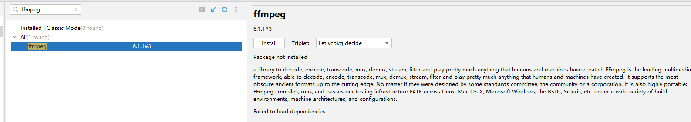

# mp4 转 mp3

[[toc]]

## 1. 安装 ffmpeg

mp4 转 mp3 的过程中会遇到下面的库 libavformat、libavcodec、libswresample、libavutil ,需要安装 ffmpeg,使用 vcpkg 安装 ffmpeg 的方法如下

```
vcpkg install ffmpeg
```



---

## 2、原理说明

1. **FFmpeg 解码/编码流程**

   - 通过 `avformat_open_input()` 打开输入文件并读取流信息，定位到音频流。
   - 使用 `avcodec_find_decoder()` 与 `avcodec_open2()` 打开解码器，解码音频帧。
   - 创建输出的 `AVFormatContext`，找到 MP3 编码器 (`avcodec_find_encoder()`)，并用 `avcodec_open2()` 打开它。
   - 使用 `swr_convert()` 对解码后的音频帧进行采样格式或采样率转换（如果需要），然后送入 MP3 编码器生成编码后的数据包，写入输出文件。
   - 最后写入文件尾并释放各种资源。

2. **JNI 调用与动态库依赖**

   - 通过 `System.load()` 加载编译生成的 `libnative_media.dll`。
   - 由于 FFmpeg 动态库（`avcodec-xx.dll`, `avformat-xx.dll`, 等）是该 DLL 的依赖库，需要一并放到可搜索的路径下，并在加载主库前显式加载这些依赖库，以免出现 “Can't find dependent libraries” 的错误。
   - Java 端定义了 `NativeMedia` 类及其 `mp4ToMp3` 本地方法，调用时即执行了对应的 C 函数，实现 MP4 转 MP3 的功能。

3. **编译与部署**
   - 使用 CMake 构建 C/C++ 代码，生成 `native_media.dll` 以及测试可执行文件 `mp4_test.exe`。
   - 将生成的主要动态库 `libnative_media.dll` 和 FFmpeg 依赖库（`avcodec-xx.dll`, `avformat-xx.dll`, `avutil-xx.dll`, `swresample-xx.dll`）复制到 Java 工程的 `lib` 目录下。
   - 在 Java 程序运行时，先加载 FFmpeg 依赖库，再加载 `libnative_media.dll`，即可调用 `NativeMedia.mp4ToMp3()` 完成转换。

---

## 3、C/C++ 代码

下面是 `native_mp4_to_mp3.c` 和 `mp4_test.c` 的全部内容。

### 1. `native_mp4_to_mp3.c`

```c
#include "com_litongjava_media_NativeMedia.h"
#include <jni.h>
#include <stdio.h>
#include <stdlib.h>
#include <string.h>

// FFmpeg 头文件
#include <libavformat/avformat.h>
#include <libavcodec/avcodec.h>
#include <libswresample/swresample.h>
#include <libavutil/opt.h>
#include <libavutil/channel_layout.h>
#include <libavutil/samplefmt.h>
#include <libavutil/audio_fifo.h>
#ifdef _WIN32
#include <stringapiset.h>
#endif

#include <stdint.h>

#ifndef av_get_channel_layout_nb_channels
static inline int av_get_channel_layout_nb_channels(uint64_t channel_layout) {
  int count = 0;
  while (channel_layout) {
    count += channel_layout & 1;
    channel_layout >>= 1;
  }
  return count;
}
#endif


JNIEXPORT jstring JNICALL Java_com_litongjava_media_NativeMedia_mp4ToMp3(JNIEnv *env, jclass clazz, jstring inputPath) {
  // 将 Java 字符串转换为 C 字符串
  const char *input_file = (*env)->GetStringUTFChars(env, inputPath, NULL);
  if (!input_file) {
    return (*env)->NewStringUTF(env, "Error: Failed to get input file path");
  }

  // 构造输出文件名（将 .mp4 替换为 .mp3）
  char *output_file = NULL;
  size_t input_len = strlen(input_file);
  if (input_len > 4 && strncmp(input_file + input_len - 4, ".mp4", 4) == 0) {
    output_file = (char *) malloc(input_len + 1);
    if (!output_file) {
      (*env)->ReleaseStringUTFChars(env, inputPath, input_file);
      return (*env)->NewStringUTF(env, "Error: Memory allocation failed");
    }
    strcpy(output_file, input_file);
    strcpy(output_file + input_len - 4, ".mp3");
  } else {
    output_file = (char *) malloc(input_len + 5);
    if (!output_file) {
      (*env)->ReleaseStringUTFChars(env, inputPath, input_file);
      return (*env)->NewStringUTF(env, "Error: Memory allocation failed");
    }
    strcpy(output_file, input_file);
    strcat(output_file, ".mp3");
  }

  // 初始化变量
  AVFormatContext *input_format_context = NULL;
  AVFormatContext *output_format_context = NULL;
  SwrContext *swr_context = NULL;
  AVCodecContext *decoder_context = NULL;
  AVCodecContext *encoder_context = NULL;
  const AVCodec *encoder = NULL;
  const AVCodec *decoder = NULL;
  AVStream *audio_stream = NULL;
  AVPacket *input_packet = NULL;
  AVPacket *output_packet = NULL;
  AVFrame *input_frame = NULL;
  AVFrame *output_frame = NULL; // 用于 swr_convert 的临时缓冲区
  AVAudioFifo *fifo = NULL;
  char error_buffer[1024] = {0};
  int ret = 0;
  int audio_stream_index = -1;
  jstring result = NULL;
  int64_t pts = 0;  // 用于给编码帧设置 pts 的计数器

  // 打开输入文件（Windows 下使用 UTF-8 转换）
#ifdef _WIN32
  int wlen = MultiByteToWideChar(CP_UTF8, 0, input_file, -1, NULL, 0);
  wchar_t *winput_file = malloc(wlen * sizeof(wchar_t));
  if (winput_file) {
    MultiByteToWideChar(CP_UTF8, 0, input_file, -1, winput_file, wlen);
    int len = WideCharToMultiByte(CP_UTF8, 0, winput_file, -1, NULL, 0, NULL, NULL);
    char *local_input_file = malloc(len);
    if (local_input_file) {
      WideCharToMultiByte(CP_UTF8, 0, winput_file, -1, local_input_file, len, NULL, NULL);
      ret = avformat_open_input(&input_format_context, local_input_file, NULL, NULL);
      free(local_input_file);
    } else {
      ret = -1;
    }
    free(winput_file);
  } else {
    ret = -1;
  }
#else
  ret = avformat_open_input(&input_format_context, input_file, NULL, NULL);
#endif
  if (ret < 0) {
    av_strerror(ret, error_buffer, sizeof(error_buffer));
    snprintf(error_buffer, sizeof(error_buffer), "Error: Could not open input file: %s", error_buffer);
    goto cleanup;
  }

  // 查找流信息
  if ((ret = avformat_find_stream_info(input_format_context, NULL)) < 0) {
    av_strerror(ret, error_buffer, sizeof(error_buffer));
    snprintf(error_buffer, sizeof(error_buffer), "Error: Could not find stream info: %s", error_buffer);
    goto cleanup;
  }

  // 寻找第一个音频流
  for (unsigned int i = 0; i < input_format_context->nb_streams; i++) {
    if (input_format_context->streams[i]->codecpar->codec_type == AVMEDIA_TYPE_AUDIO) {
      audio_stream_index = i;
      break;
    }
  }
  if (audio_stream_index == -1) {
    snprintf(error_buffer, sizeof(error_buffer), "Error: Could not find audio stream in input file");
    goto cleanup;
  }

  // 【新增】查看输入音频详细信息，并计算理论输出文件大小（按 128kbps 计算）
  {
    AVStream *audio_stream_in = input_format_context->streams[audio_stream_index];
    double duration_sec = 0.0;
    if (audio_stream_in->duration != AV_NOPTS_VALUE) {
      duration_sec = audio_stream_in->duration * av_q2d(audio_stream_in->time_base);
    } else {
      duration_sec = input_format_context->duration / (double)AV_TIME_BASE;
    }
#if LIBAVUTIL_VERSION_MAJOR < 57
    int input_channels = audio_stream_in->codecpar->channels;
#else
    int input_channels = audio_stream_in->codecpar->ch_layout.nb_channels;
#endif

    int sample_rate = audio_stream_in->codecpar->sample_rate;
    printf("Input Audio Info:\n");
    printf("  Duration: %.2f seconds\n", duration_sec);
    printf("  Sample Rate: %d\n", sample_rate);
    printf("  Channels: %d\n", input_channels);
    // 计算理论输出文件大小，128kbps -> 128000 bps，每秒生成 128000/8 字节
    double theoretical_size_bytes = (128000.0 * duration_sec) / 8.0;
    double theoretical_size_MB = theoretical_size_bytes / (1024.0 * 1024.0);
    printf("Theoretical output file size at 128kbps: %.2f MB\n", theoretical_size_MB);
  }

  // 查找音频解码器
  decoder = avcodec_find_decoder(input_format_context->streams[audio_stream_index]->codecpar->codec_id);
  if (!decoder) {
    snprintf(error_buffer, sizeof(error_buffer), "Error: Could not find decoder");
    goto cleanup;
  }

  // 分配解码器上下文
  decoder_context = avcodec_alloc_context3(decoder);
  if (!decoder_context) {
    snprintf(error_buffer, sizeof(error_buffer), "Error: Could not allocate decoder context");
    goto cleanup;
  }

  // 复制解码器参数
  if ((ret = avcodec_parameters_to_context(decoder_context, input_format_context->streams[audio_stream_index]->codecpar)) < 0) {
    av_strerror(ret, error_buffer, sizeof(error_buffer));
    snprintf(error_buffer, sizeof(error_buffer), "Error: Could not copy decoder parameters: %s", error_buffer);
    goto cleanup;
  }

  // 打开解码器
  if ((ret = avcodec_open2(decoder_context, decoder, NULL)) < 0) {
    av_strerror(ret, error_buffer, sizeof(error_buffer));
    snprintf(error_buffer, sizeof(error_buffer), "Error: Could not open decoder: %s", error_buffer);
    goto cleanup;
  }

  // 创建输出格式上下文
  if ((ret = avformat_alloc_output_context2(&output_format_context, NULL, "mp3", output_file)) < 0) {
    av_strerror(ret, error_buffer, sizeof(error_buffer));
    snprintf(error_buffer, sizeof(error_buffer), "Error: Could not allocate output context: %s", error_buffer);
    goto cleanup;
  }

  // 查找 MP3 编码器（使用 libmp3lame）
  encoder = avcodec_find_encoder_by_name("libmp3lame");
  if (!encoder) {
    snprintf(error_buffer, sizeof(error_buffer), "Error: Could not find libmp3lame encoder");
    goto cleanup;
  }

  // 在输出文件中创建新的音频流
  audio_stream = avformat_new_stream(output_format_context, NULL);
  if (!audio_stream) {
    snprintf(error_buffer, sizeof(error_buffer), "Error: Could not create new audio stream");
    goto cleanup;
  }

  // 分配编码器上下文
  encoder_context = avcodec_alloc_context3(encoder);
  if (!encoder_context) {
    snprintf(error_buffer, sizeof(error_buffer), "Error: Could not allocate encoder context");
    goto cleanup;
  }

  // 设置编码器参数（固定输出 128kbps）
  encoder_context->sample_rate = decoder_context->sample_rate;
  encoder_context->bit_rate = 128000;  // 128kbps
  encoder_context->sample_fmt = AV_SAMPLE_FMT_S16P; // libmp3lame 通常使用 s16p
#if LIBAVUTIL_VERSION_MAJOR < 57
  encoder_context->channels = 2;
  encoder_context->channel_layout = AV_CH_LAYOUT_STEREO;
#else
  av_channel_layout_default(&encoder_context->ch_layout, 2);
#endif

  // 如果容器格式要求全局头信息
  if (output_format_context->oformat->flags & AVFMT_GLOBALHEADER) {
    encoder_context->flags |= AV_CODEC_FLAG_GLOBAL_HEADER;
  }

  // 打开编码器
  if ((ret = avcodec_open2(encoder_context, encoder, NULL)) < 0) {
    av_strerror(ret, error_buffer, sizeof(error_buffer));
    snprintf(error_buffer, sizeof(error_buffer), "Error: Could not open encoder: %s", error_buffer);
    goto cleanup;
  }

  // 将编码器参数复制到流
  if ((ret = avcodec_parameters_from_context(audio_stream->codecpar, encoder_context)) < 0) {
    av_strerror(ret, error_buffer, sizeof(error_buffer));
    snprintf(error_buffer, sizeof(error_buffer), "Error: Could not copy encoder parameters: %s", error_buffer);
    goto cleanup;
  }

  // 设置流的 timebase
  audio_stream->time_base = (AVRational){1, encoder_context->sample_rate};

  // 创建重采样上下文
  swr_context = swr_alloc();
  if (!swr_context) {
    snprintf(error_buffer, sizeof(error_buffer), "Error: Could not allocate resampler context");
    goto cleanup;
  }
#if LIBAVUTIL_VERSION_MAJOR < 57
  av_opt_set_int(swr_context, "in_channel_layout", decoder_context->channel_layout, 0);
  av_opt_set_int(swr_context, "out_channel_layout", encoder_context->channel_layout, 0);
  av_opt_set_int(swr_context, "in_channel_count", decoder_context->channels, 0);
  av_opt_set_int(swr_context, "out_channel_count", encoder_context->channels, 0);
#else
  av_opt_set_chlayout(swr_context, "in_chlayout", &decoder_context->ch_layout, 0);
  av_opt_set_chlayout(swr_context, "out_chlayout", &encoder_context->ch_layout, 0);
#endif
  av_opt_set_int(swr_context, "in_sample_rate", decoder_context->sample_rate, 0);
  av_opt_set_int(swr_context, "out_sample_rate", encoder_context->sample_rate, 0);
  av_opt_set_sample_fmt(swr_context, "in_sample_fmt", decoder_context->sample_fmt, 0);
  av_opt_set_sample_fmt(swr_context, "out_sample_fmt", encoder_context->sample_fmt, 0);

  if ((ret = swr_init(swr_context)) < 0) {
    av_strerror(ret, error_buffer, sizeof(error_buffer));
    snprintf(error_buffer, sizeof(error_buffer), "Error: Could not initialize resampler: %s", error_buffer);
    goto cleanup;
  }

  // 打开输出文件（Windows 下使用 UTF-8 转换）
  if (!(output_format_context->oformat->flags & AVFMT_NOFILE)) {
#ifdef _WIN32
    int wlen_out = MultiByteToWideChar(CP_UTF8, 0, output_file, -1, NULL, 0);
    wchar_t *woutput_file = malloc(wlen_out * sizeof(wchar_t));
    if (woutput_file) {
      MultiByteToWideChar(CP_UTF8, 0, output_file, -1, woutput_file, wlen_out);
      int len_out = WideCharToMultiByte(CP_UTF8, 0, woutput_file, -1, NULL, 0, NULL, NULL);
      char *local_output_file = malloc(len_out);
      if (local_output_file) {
        WideCharToMultiByte(CP_UTF8, 0, woutput_file, -1, local_output_file, len_out, NULL, NULL);
        ret = avio_open(&output_format_context->pb, local_output_file, AVIO_FLAG_WRITE);
        free(local_output_file);
      } else {
        ret = -1;
      }
      free(woutput_file);
    } else {
      ret = -1;
    }
#else
    ret = avio_open(&output_format_context->pb, output_file, AVIO_FLAG_WRITE);
#endif
    if (ret < 0) {
      av_strerror(ret, error_buffer, sizeof(error_buffer));
      snprintf(error_buffer, sizeof(error_buffer), "Error: Could not open output file: %s", error_buffer);
      goto cleanup;
    }
  }

  // 写入输出文件头
  if ((ret = avformat_write_header(output_format_context, NULL)) < 0) {
    av_strerror(ret, error_buffer, sizeof(error_buffer));
    snprintf(error_buffer, sizeof(error_buffer), "Error: Could not write output header: %s", error_buffer);
    goto cleanup;
  }

  // 分配 packet 和 frame 缓冲区
  input_packet = av_packet_alloc();
  output_packet = av_packet_alloc();
  if (!input_packet || !output_packet) {
    snprintf(error_buffer, sizeof(error_buffer), "Error: Could not allocate packet");
    goto cleanup;
  }
  input_frame = av_frame_alloc();
  // 为转换分配一个较大的输出帧缓冲区（后续会取 encoder_context->frame_size 个样本送入编码器）
  output_frame = av_frame_alloc();
  if (!input_frame || !output_frame) {
    snprintf(error_buffer, sizeof(error_buffer), "Error: Could not allocate frame");
    goto cleanup;
  }
  int max_samples = 8192; // 转换缓冲区样本数（可根据需要调整）
  output_frame->nb_samples = max_samples;
  output_frame->format = encoder_context->sample_fmt;
  output_frame->sample_rate = encoder_context->sample_rate;
#if LIBAVUTIL_VERSION_MAJOR < 57
  output_frame->channel_layout = encoder_context->channel_layout;
#else
  av_channel_layout_copy(&output_frame->ch_layout, &encoder_context->ch_layout);
#endif
  if ((ret = av_frame_get_buffer(output_frame, 0)) < 0) {
    av_strerror(ret, error_buffer, sizeof(error_buffer));
    snprintf(error_buffer, sizeof(error_buffer), "Error: Could not allocate conversion buffer: %s", error_buffer);
    goto cleanup;
  }

  // 由于新版 FFmpeg 不再直接使用 encoder_context->channels，
  // 使用条件编译方式获取实际声道数
#if LIBAVUTIL_VERSION_MAJOR < 57
  int nb_channels = encoder_context->channels;
#else
  int nb_channels = encoder_context->ch_layout.nb_channels;
#endif

  // 分配 FIFO 用于缓存转换后的音频样本
  fifo = av_audio_fifo_alloc(encoder_context->sample_fmt, nb_channels, 1);
  if (!fifo) {
    snprintf(error_buffer, sizeof(error_buffer), "Error: Could not allocate FIFO");
    goto cleanup;
  }

  // 读取输入文件的 packet 并转换音频样本
  while (av_read_frame(input_format_context, input_packet) >= 0) {
    if (input_packet->stream_index == audio_stream_index) {
      ret = avcodec_send_packet(decoder_context, input_packet);
      if (ret < 0) {
        av_strerror(ret, error_buffer, sizeof(error_buffer));
        snprintf(error_buffer, sizeof(error_buffer), "Error sending packet to decoder: %s", error_buffer);
        goto cleanup;
      }
      while (1) {
        ret = avcodec_receive_frame(decoder_context, input_frame);
        if (ret == AVERROR(EAGAIN) || ret == AVERROR_EOF) {
          break;
        } else if (ret < 0) {
          av_strerror(ret, error_buffer, sizeof(error_buffer));
          snprintf(error_buffer, sizeof(error_buffer), "Error receiving frame from decoder: %s", error_buffer);
          goto cleanup;
        }
        // 使用 swr_convert 转换音频采样
        int nb_samples_converted = swr_convert(swr_context,
                                               output_frame->data, max_samples,
                                               (const uint8_t **) input_frame->data, input_frame->nb_samples);
        if (nb_samples_converted < 0) {
          av_strerror(nb_samples_converted, error_buffer, sizeof(error_buffer));
          snprintf(error_buffer, sizeof(error_buffer), "Error converting audio: %s", error_buffer);
          goto cleanup;
        }
        // 将转换后的样本写入 FIFO
        int fifo_size = av_audio_fifo_size(fifo);
        if (av_audio_fifo_realloc(fifo, fifo_size + nb_samples_converted) < 0) {
          snprintf(error_buffer, sizeof(error_buffer), "Error: Could not reallocate FIFO");
          goto cleanup;
        }
        if (av_audio_fifo_write(fifo, (void **) output_frame->data, nb_samples_converted) < nb_samples_converted) {
          snprintf(error_buffer, sizeof(error_buffer), "Error: Could not write data to FIFO");
          goto cleanup;
        }
        // 当 FIFO 中样本数达到一个完整的编码帧时，就读取一帧送入编码器
        while (av_audio_fifo_size(fifo) >= encoder_context->frame_size) {
          AVFrame *enc_frame = av_frame_alloc();
          if (!enc_frame) {
            snprintf(error_buffer, sizeof(error_buffer), "Error: Could not allocate encoder frame");
            goto cleanup;
          }
          enc_frame->nb_samples = encoder_context->frame_size;
          enc_frame->format = encoder_context->sample_fmt;
          enc_frame->sample_rate = encoder_context->sample_rate;
#if LIBAVUTIL_VERSION_MAJOR < 57
          enc_frame->channel_layout = encoder_context->channel_layout;
#else
          av_channel_layout_copy(&enc_frame->ch_layout, &encoder_context->ch_layout);
#endif
          if (av_frame_get_buffer(enc_frame, 0) < 0) {
            snprintf(error_buffer, sizeof(error_buffer), "Error: Could not allocate encoder frame buffer");
            av_frame_free(&enc_frame);
            goto cleanup;
          }
          if (av_audio_fifo_read(fifo, (void **) enc_frame->data, encoder_context->frame_size) < encoder_context->frame_size) {
            snprintf(error_buffer, sizeof(error_buffer), "Error: Could not read data from FIFO");
            av_frame_free(&enc_frame);
            goto cleanup;
          }
          enc_frame->pts = pts;
          pts += encoder_context->frame_size;

          ret = avcodec_send_frame(encoder_context, enc_frame);
          av_frame_free(&enc_frame);
          if (ret < 0) {
            av_strerror(ret, error_buffer, sizeof(error_buffer));
            snprintf(error_buffer, sizeof(error_buffer), "Error sending frame to encoder: %s", error_buffer);
            goto cleanup;
          }
          while (1) {
            ret = avcodec_receive_packet(encoder_context, output_packet);
            if (ret == AVERROR(EAGAIN) || ret == AVERROR_EOF)
              break;
            else if (ret < 0) {
              av_strerror(ret, error_buffer, sizeof(error_buffer));
              snprintf(error_buffer, sizeof(error_buffer), "Error receiving packet from encoder: %s", error_buffer);
              goto cleanup;
            }
            output_packet->stream_index = 0;
            av_packet_rescale_ts(output_packet, encoder_context->time_base, audio_stream->time_base);
            ret = av_interleaved_write_frame(output_format_context, output_packet);
            if (ret < 0) {
              av_strerror(ret, error_buffer, sizeof(error_buffer));
              snprintf(error_buffer, sizeof(error_buffer), "Error writing packet: %s", error_buffer);
              goto cleanup;
            }
            av_packet_unref(output_packet);
          }
        }
        av_frame_unref(input_frame);
      }
    }
    av_packet_unref(input_packet);
  }

  // 处理 FIFO 中剩余不足一帧的样本：填充零后编码
  int remaining_samples = av_audio_fifo_size(fifo);
  if (remaining_samples > 0) {
    AVFrame *enc_frame = av_frame_alloc();
    if (!enc_frame) {
      snprintf(error_buffer, sizeof(error_buffer), "Error: Could not allocate encoder frame for flush");
      goto cleanup;
    }
    enc_frame->nb_samples = encoder_context->frame_size;
    enc_frame->format = encoder_context->sample_fmt;
    enc_frame->sample_rate = encoder_context->sample_rate;
#if LIBAVUTIL_VERSION_MAJOR < 57
    enc_frame->channel_layout = encoder_context->channel_layout;
#else
    av_channel_layout_copy(&enc_frame->ch_layout, &encoder_context->ch_layout);
#endif
    if (av_frame_get_buffer(enc_frame, 0) < 0) {
      snprintf(error_buffer, sizeof(error_buffer), "Error: Could not allocate encoder frame buffer for flush");
      av_frame_free(&enc_frame);
      goto cleanup;
    }
    if (av_audio_fifo_read(fifo, (void **) enc_frame->data, remaining_samples) < remaining_samples) {
      snprintf(error_buffer, sizeof(error_buffer), "Error: Could not read remaining data from FIFO");
      av_frame_free(&enc_frame);
      goto cleanup;
    }
    // 将不足部分填 0，使用 nb_channels 来循环
    for (int i = remaining_samples; i < encoder_context->frame_size; i++) {
      for (int ch = 0; ch < nb_channels; ch++) {
        ((int16_t *)enc_frame->data[ch])[i] = 0;
      }
    }
    enc_frame->pts = pts;
    pts += remaining_samples;

    ret = avcodec_send_frame(encoder_context, enc_frame);
    av_frame_free(&enc_frame);
    if (ret < 0) {
      av_strerror(ret, error_buffer, sizeof(error_buffer));
      snprintf(error_buffer, sizeof(error_buffer), "Error sending flush frame to encoder: %s", error_buffer);
      goto cleanup;
    }
  }

  // 刷新编码器
  avcodec_send_frame(encoder_context, NULL);
  while (1) {
    ret = avcodec_receive_packet(encoder_context, output_packet);
    if (ret == AVERROR(EAGAIN) || ret == AVERROR_EOF)
      break;
    else if (ret < 0) {
      av_strerror(ret, error_buffer, sizeof(error_buffer));
      snprintf(error_buffer, sizeof(error_buffer), "Error flushing encoder: %s", error_buffer);
      goto cleanup;
    }
    output_packet->stream_index = 0;
    av_packet_rescale_ts(output_packet, encoder_context->time_base, audio_stream->time_base);
    ret = av_interleaved_write_frame(output_format_context, output_packet);
    if (ret < 0) {
      av_strerror(ret, error_buffer, sizeof(error_buffer));
      snprintf(error_buffer, sizeof(error_buffer), "Error writing flushed packet: %s", error_buffer);
      goto cleanup;
    }
    av_packet_unref(output_packet);
  }

  if ((ret = av_write_trailer(output_format_context)) < 0) {
    av_strerror(ret, error_buffer, sizeof(error_buffer));
    snprintf(error_buffer, sizeof(error_buffer), "Error writing trailer: %s", error_buffer);
    goto cleanup;
  }

  // 成功：返回输出文件路径
  strncpy(error_buffer, output_file, sizeof(error_buffer) - 1);
  error_buffer[sizeof(error_buffer) - 1] = '\0';

  cleanup:
  if (fifo) av_audio_fifo_free(fifo);
  if (input_frame) av_frame_free(&input_frame);
  if (output_frame) av_frame_free(&output_frame);
  if (input_packet) av_packet_free(&input_packet);
  if (output_packet) av_packet_free(&output_packet);
  if (decoder_context) avcodec_free_context(&decoder_context);
  if (encoder_context) avcodec_free_context(&encoder_context);
  if (swr_context) swr_free(&swr_context);
  if (input_format_context) avformat_close_input(&input_format_context);
  if (output_format_context) {
    if (!(output_format_context->oformat->flags & AVFMT_NOFILE) && output_format_context->pb) {
      avio_closep(&output_format_context->pb);
    }
    avformat_free_context(output_format_context);
  }
  result = (*env)->NewStringUTF(env, error_buffer);
  (*env)->ReleaseStringUTFChars(env, inputPath, input_file);
  if (output_file) free(output_file);
  return result;
}
```

### 2. `mp4_test.c`

```c
#include <stdio.h>
#include <libavformat/avformat.h>
#include <libavcodec/avcodec.h>
#include <libswresample/swresample.h>
#include <libavutil/opt.h>

int main() {
  printf("Testing FFmpeg initialization...\n");

  // Print FFmpeg version info
  printf("libavcodec version: %s\n", av_version_info());
  printf("libavformat version: %d.%d.%d\n",
         LIBAVFORMAT_VERSION_MAJOR,
         LIBAVFORMAT_VERSION_MINOR,
         LIBAVFORMAT_VERSION_MICRO);

  // Test opening a format context
  AVFormatContext *fmt_ctx = NULL;
  printf("Creating format context...\n");

  fmt_ctx = avformat_alloc_context();
  if (!fmt_ctx) {
    printf("Failed to allocate format context\n");
    return -1;
  }

  printf("Format context created successfully\n");
  avformat_free_context(fmt_ctx);

  printf("Test completed successfully\n");
  return 0;
}
```

---

## 4、CMake 构建脚本

以下是 `CMakeLists.txt`，用于查找 FFmpeg、JNI 并生成对应的共享库 `native_media.dll` 以及测试可执行文件 `mp4_test.exe`。

```cmake
cmake_minimum_required(VERSION 3.15)
project(native_media)

set(CMAKE_CXX_STANDARD 17)

# Find JNI
find_package(JNI REQUIRED)
include_directories(${JNI_INCLUDE_DIRS})

# Find FFmpeg components explicitly
find_path(AVCODEC_INCLUDE_DIR libavcodec/avcodec.h)
find_path(AVFORMAT_INCLUDE_DIR libavformat/avformat.h)
find_path(SWRESAMPLE_INCLUDE_DIR libswresample/swresample.h)
find_path(AVUTIL_INCLUDE_DIR libavutil/avutil.h)

find_library(AVCODEC_LIBRARY avcodec)
find_library(AVFORMAT_LIBRARY avformat)
find_library(SWRESAMPLE_LIBRARY swresample)
find_library(AVUTIL_LIBRARY avutil)

# Print paths for debugging
message(STATUS "AVCODEC_INCLUDE_DIR: ${AVCODEC_INCLUDE_DIR}")
message(STATUS "AVCODEC_LIBRARY: ${AVCODEC_LIBRARY}")
message(STATUS "AVFORMAT_INCLUDE_DIR: ${AVFORMAT_INCLUDE_DIR}")
message(STATUS "AVFORMAT_LIBRARY: ${AVFORMAT_LIBRARY}")
message(STATUS "SWRESAMPLE_INCLUDE_DIR: ${SWRESAMPLE_INCLUDE_DIR}")
message(STATUS "SWRESAMPLE_LIBRARY: ${SWRESAMPLE_LIBRARY}")
message(STATUS "AVUTIL_INCLUDE_DIR: ${AVUTIL_INCLUDE_DIR}")
message(STATUS "AVUTIL_LIBRARY: ${AVUTIL_LIBRARY}")

# Include directories
include_directories(
        ${AVCODEC_INCLUDE_DIR}
        ${AVFORMAT_INCLUDE_DIR}
        ${SWRESAMPLE_INCLUDE_DIR}
        ${AVUTIL_INCLUDE_DIR}
        jni
)

# Add sources
add_library(native_media SHARED src/native_mp3.c src/native_mp4_to_mp3.c)

# Link libraries
target_link_libraries(native_media
        ${JNI_LIBRARIES}
        ${AVCODEC_LIBRARY}
        ${AVFORMAT_LIBRARY}
        ${SWRESAMPLE_LIBRARY}
        ${AVUTIL_LIBRARY}
)

# Add test executable
add_executable(mp4_test src/mp4_test.c src/native_mp4_to_mp3.c)
target_link_libraries(mp4_test
        ${AVCODEC_LIBRARY}
        ${AVFORMAT_LIBRARY}
        ${SWRESAMPLE_LIBRARY}
        ${AVUTIL_LIBRARY}
)
```

---

## 5、Java 代码

### 1. `LibraryUtils.java`

```java
package com.litongjava.media.utils;

import java.io.File;

import com.litongjava.media.core.Core;

public class LibraryUtils {

  public static void load() {
    String osName = System.getProperty("os.name").toLowerCase();
    String libFileName;
    if (osName.contains("win")) {
      libFileName = Core.WIN_NATIVE_LIBRARY_NAME;
    } else if (osName.contains("mac")) {
      libFileName = Core.MACOS_NATIVE_LIBRARY_NAME;

    } else if (osName.contains("nix") || osName.contains("nux") || osName.contains("aix")) {
      libFileName = Core.UNIX_NATIVE_LIBRARY_NAME;
    } else {
      throw new UnsupportedOperationException("Unsupported OS：" + osName);
    }

    File libDir = new File("lib");
    if (!libDir.exists()) {
      libDir.mkdirs();
    }

    File libFile = new File(libDir, libFileName);
    if (!libFile.exists()) {
      throw new RuntimeException("Not foud libiary：" + libFile.getAbsolutePath());
    }
    // 加载顺序不可改变
    System.load(new File("lib", "avutil-59.dll").getAbsolutePath());
    System.load(new File("lib", "swresample-5.dll").getAbsolutePath());
    System.load(new File("lib", "avcodec-61.dll").getAbsolutePath());
    System.load(new File("lib", "avformat-61.dll").getAbsolutePath());
    System.load(libFile.getAbsolutePath());
  }
}
```

### 2. `NativeMedia.java`

```java
package com.litongjava.media;

import com.litongjava.media.utils.LibraryUtils;

public class NativeMedia {
  static {
    LibraryUtils.load();
  }

  /**
   * Converts an MP4 video file to an MP3 audio file
   *
   * @param inputPath Path to the input MP4 file
   * @return Path to the output MP3 file on success, or error message on failure
   */
  public static native String mp4ToMp3(String inputPath);
}
```

### 3. 测试类 `Mp4ToMp3Test.java`

```java
package com.litongjava.media;

public class Mp4ToMp3Test {

  public static void main(String[] args) {
    String inputPath = "E:\\code\\cpp\\project-ping\\native-media\\samples\\01.mp4";
    String result = NativeMedia.mp4ToMp3(inputPath);

    if (result.startsWith("Error:")) {
      System.out.println("Conversion failed: " + result);
    } else {
      System.out.println("Conversion successful! Output file: " + result);
    }
  }
}
```

---

## 6、总结

1. **文件部署**

   - 将 `libnative_media.dll`（JNI 共享库）放入 Java 工程的 `lib` 目录。
   - 同时拷贝 FFmpeg 依赖的动态库 `avcodec-xx.dll`, `avformat-xx.dll`, `avutil-xx.dll`, `swresample-xx.dll` 到同一目录。
   - 通过 `LibraryUtils.load()` 先后加载这些 DLL，保证依赖顺序正确。

2. **原理概括**

   - 在 C/C++ 层面利用 FFmpeg 解码 MP4 文件中的音频数据，再编码为 MP3。
   - 在 Java 层通过 JNI 调用该 C 函数，实现跨语言集成。

3. **运行结果**
   - 最终在命令行或 IDE 中运行 `Mp4ToMp3Test.java`，可看到 “Conversion successful!” 提示以及输出文件路径，表示转换完成。
