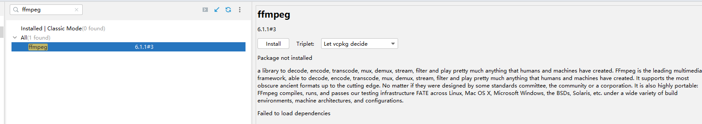

# mp4 转 mp3

## 1. 安装 ffmpeg

mp4 转 mp3 的过程中会遇到下面的库 ibavformat、libavcodec、libswresample、libavutil ,需要安装 ffmpeg,使用 vcpkg 安装 ffmpeg 的方法如下

```
vcpkg install ffmpeg
```



---

## 2、原理说明

1. **FFmpeg 解码/编码流程**

   - 通过 `avformat_open_input()` 打开输入文件并读取流信息，定位到音频流。
   - 使用 `avcodec_find_decoder()` 与 `avcodec_open2()` 打开解码器，解码音频帧。
   - 创建输出的 `AVFormatContext`，找到 MP3 编码器 (`avcodec_find_encoder()`)，并用 `avcodec_open2()` 打开它。
   - 使用 `swr_convert()` 对解码后的音频帧进行采样格式或采样率转换（如果需要），然后送入 MP3 编码器生成编码后的数据包，写入输出文件。
   - 最后写入文件尾并释放各种资源。

2. **JNI 调用与动态库依赖**

   - 通过 `System.load()` 加载编译生成的 `libnative_media.dll`。
   - 由于 FFmpeg 动态库（`avcodec-xx.dll`, `avformat-xx.dll`, 等）是该 DLL 的依赖库，需要一并放到可搜索的路径下，并在加载主库前显式加载这些依赖库，以免出现 “Can't find dependent libraries” 的错误。
   - Java 端定义了 `NativeMedia` 类及其 `mp4ToMp3` 本地方法，调用时即执行了对应的 C 函数，实现 MP4 转 MP3 的功能。

3. **编译与部署**
   - 使用 CMake 构建 C/C++ 代码，生成 `native_media.dll` 以及测试可执行文件 `mp4_test.exe`。
   - 将生成的主要动态库 `libnative_media.dll` 和 FFmpeg 依赖库（`avcodec-xx.dll`, `avformat-xx.dll`, `avutil-xx.dll`, `swresample-xx.dll`）复制到 Java 工程的 `lib` 目录下。
   - 在 Java 程序运行时，先加载 FFmpeg 依赖库，再加载 `libnative_media.dll`，即可调用 `NativeMedia.mp4ToMp3()` 完成转换。

---

## 3、C/C++ 代码

下面是 `native_mp4.c` 和 `mp4_test.c` 的全部内容，代码保持不变。

### 1. `native_mp4.c`

```c
#include "com_litongjava_media_NativeMedia.h"
#include <jni.h>
#include <stdio.h>
#include <stdlib.h>
#include <string.h>

// FFmpeg headers
#include <libavformat/avformat.h>
#include <libavcodec/avcodec.h>
#include <libswresample/swresample.h>
#include <libavutil/opt.h>
#include <libavutil/channel_layout.h>
#include <libavutil/samplefmt.h>

JNIEXPORT jstring JNICALL Java_com_litongjava_media_NativeMedia_mp4ToMp3(JNIEnv *env, jclass clazz, jstring inputPath) {
  // Convert Java string to C string
  const char *input_file = (*env)->GetStringUTFChars(env, inputPath, NULL);
  if (!input_file) {
    return (*env)->NewStringUTF(env, "Error: Failed to get input file path");
  }

  // Create output filename (replace .mp4 with .mp3)
  char *output_file = NULL;
  size_t input_len = strlen(input_file);
  if (input_len > 4 && strncmp(input_file + input_len - 4, ".mp4", 4) == 0) {
    output_file = (char *) malloc(input_len + 1);
    if (!output_file) {
      (*env)->ReleaseStringUTFChars(env, inputPath, input_file);
      return (*env)->NewStringUTF(env, "Error: Memory allocation failed");
    }
    strcpy(output_file, input_file);
    strcpy(output_file + input_len - 4, ".mp3");
  } else {
    output_file = (char *) malloc(input_len + 5);
    if (!output_file) {
      (*env)->ReleaseStringUTFChars(env, inputPath, input_file);
      return (*env)->NewStringUTF(env, "Error: Memory allocation failed");
    }
    strcpy(output_file, input_file);
    strcat(output_file, ".mp3");
  }

  // Initialize variables
  AVFormatContext *input_format_context = NULL;
  AVFormatContext *output_format_context = NULL;
  SwrContext *swr_context = NULL;
  AVCodecContext *decoder_context = NULL;
  AVCodecContext *encoder_context = NULL;
  const AVCodec *encoder = NULL;
  const AVCodec *decoder = NULL;
  AVStream *audio_stream = NULL;
  AVPacket *input_packet = NULL;
  AVPacket *output_packet = NULL;
  AVFrame *input_frame = NULL;
  AVFrame *output_frame = NULL;
  char error_buffer[1024] = {0};
  int ret = 0;
  int audio_stream_index = -1;
  jstring result = NULL;

  // Open input file
  if ((ret = avformat_open_input(&input_format_context, input_file, NULL, NULL)) < 0) {
    av_strerror(ret, error_buffer, sizeof(error_buffer));
    snprintf(error_buffer, sizeof(error_buffer), "Error: Could not open input file: %s", error_buffer);
    goto cleanup;
  }

  // Find stream info
  if ((ret = avformat_find_stream_info(input_format_context, NULL)) < 0) {
    av_strerror(ret, error_buffer, sizeof(error_buffer));
    snprintf(error_buffer, sizeof(error_buffer), "Error: Could not find stream info: %s", error_buffer);
    goto cleanup;
  }

  // Find the first audio stream
  for (unsigned int i = 0; i < input_format_context->nb_streams; i++) {
    if (input_format_context->streams[i]->codecpar->codec_type == AVMEDIA_TYPE_AUDIO) {
      audio_stream_index = i;
      break;
    }
  }

  if (audio_stream_index == -1) {
    snprintf(error_buffer, sizeof(error_buffer), "Error: Could not find audio stream in input file");
    goto cleanup;
  }

  // Find decoder for the audio stream
  decoder = avcodec_find_decoder(input_format_context->streams[audio_stream_index]->codecpar->codec_id);
  if (!decoder) {
    snprintf(error_buffer, sizeof(error_buffer), "Error: Could not find decoder");
    goto cleanup;
  }

  // Allocate decoder context
  decoder_context = avcodec_alloc_context3(decoder);
  if (!decoder_context) {
    snprintf(error_buffer, sizeof(error_buffer), "Error: Could not allocate decoder context");
    goto cleanup;
  }

  // Copy codec parameters to decoder context
  if ((ret = avcodec_parameters_to_context(decoder_context,
                                           input_format_context->streams[audio_stream_index]->codecpar)) < 0) {
    av_strerror(ret, error_buffer, sizeof(error_buffer));
    snprintf(error_buffer, sizeof(error_buffer), "Error: Could not copy decoder parameters: %s", error_buffer);
    goto cleanup;
  }

  // Open decoder
  if ((ret = avcodec_open2(decoder_context, decoder, NULL)) < 0) {
    av_strerror(ret, error_buffer, sizeof(error_buffer));
    snprintf(error_buffer, sizeof(error_buffer), "Error: Could not open decoder: %s", error_buffer);
    goto cleanup;
  }

  // Create output format context
  if ((ret = avformat_alloc_output_context2(&output_format_context, NULL, "mp3", output_file)) < 0) {
    av_strerror(ret, error_buffer, sizeof(error_buffer));
    snprintf(error_buffer, sizeof(error_buffer), "Error: Could not allocate output context: %s", error_buffer);
    goto cleanup;
  }

  // Find the MP3 encoder
  encoder = avcodec_find_encoder(AV_CODEC_ID_MP3);
  if (!encoder) {
    snprintf(error_buffer, sizeof(error_buffer), "Error: Could not find MP3 encoder");
    goto cleanup;
  }

  // Create a new audio stream in the output file
  audio_stream = avformat_new_stream(output_format_context, NULL);
  if (!audio_stream) {
    snprintf(error_buffer, sizeof(error_buffer), "Error: Could not create new audio stream");
    goto cleanup;
  }

  // Allocate encoder context
  encoder_context = avcodec_alloc_context3(encoder);
  if (!encoder_context) {
    snprintf(error_buffer, sizeof(error_buffer), "Error: Could not allocate encoder context");
    goto cleanup;
  }

  // Set encoder parameters
  encoder_context->sample_rate = decoder_context->sample_rate;
  encoder_context->bit_rate = 128000;  // 128kbps bitrate
  //encoder_context->sample_fmt = AV_SAMPLE_FMT_S16P; // MP3 encoder typically uses s16p
  encoder_context->sample_fmt = AV_SAMPLE_FMT_S16; // MP3 encoder supports s16

  // Set up channel layout based on FFmpeg version
#if LIBAVUTIL_VERSION_MAJOR < 57
  encoder_context->channels = 2;
  encoder_context->channel_layout = AV_CH_LAYOUT_STEREO;
#else
  av_channel_layout_default(&encoder_context->ch_layout, 2);
#endif

  // Some container formats (like MP4) require global headers
  if (output_format_context->oformat->flags & AVFMT_GLOBALHEADER) {
    encoder_context->flags |= AV_CODEC_FLAG_GLOBAL_HEADER;
  }

  // Open encoder
  if ((ret = avcodec_open2(encoder_context, encoder, NULL)) < 0) {
    av_strerror(ret, error_buffer, sizeof(error_buffer));
    snprintf(error_buffer, sizeof(error_buffer), "Error: Could not open encoder: %s", error_buffer);
    goto cleanup;
  }

  // Copy encoder parameters to stream
  if ((ret = avcodec_parameters_from_context(audio_stream->codecpar, encoder_context)) < 0) {
    av_strerror(ret, error_buffer, sizeof(error_buffer));
    snprintf(error_buffer, sizeof(error_buffer), "Error: Could not copy encoder parameters: %s", error_buffer);
    goto cleanup;
  }

  // Set stream timebase
  audio_stream->time_base = (AVRational) {1, encoder_context->sample_rate};

  // Create resampler context
  swr_context = swr_alloc();
  if (!swr_context) {
    snprintf(error_buffer, sizeof(error_buffer), "Error: Could not allocate resampler context");
    goto cleanup;
  }

  // Set resampler options
#if LIBAVUTIL_VERSION_MAJOR < 57
  // Set input channel layout
  av_opt_set_int(swr_context, "in_channel_layout", decoder_context->channel_layout, 0);
  // Set output channel layout
  av_opt_set_int(swr_context, "out_channel_layout", encoder_context->channel_layout, 0);
  // Set input & output channels
  av_opt_set_int(swr_context, "in_channel_count", decoder_context->channels, 0);
  av_opt_set_int(swr_context, "out_channel_count", encoder_context->channels, 0);
#else
  // Set input channel layout
  av_opt_set_chlayout(swr_context, "in_chlayout", &decoder_context->ch_layout, 0);
  // Set output channel layout
  av_opt_set_chlayout(swr_context, "out_chlayout", &encoder_context->ch_layout, 0);
#endif

  // Set input & output sample rates
  av_opt_set_int(swr_context, "in_sample_rate", decoder_context->sample_rate, 0);
  av_opt_set_int(swr_context, "out_sample_rate", encoder_context->sample_rate, 0);

  // Set input & output sample formats
  av_opt_set_sample_fmt(swr_context, "in_sample_fmt", decoder_context->sample_fmt, 0);
  av_opt_set_sample_fmt(swr_context, "out_sample_fmt", encoder_context->sample_fmt, 0);

  // Initialize resampler
  if ((ret = swr_init(swr_context)) < 0) {
    av_strerror(ret, error_buffer, sizeof(error_buffer));
    snprintf(error_buffer, sizeof(error_buffer), "Error: Could not initialize resampler: %s", error_buffer);
    goto cleanup;
  }

  // Open output file for writing
  if (!(output_format_context->oformat->flags & AVFMT_NOFILE)) {
    if ((ret = avio_open(&output_format_context->pb, output_file, AVIO_FLAG_WRITE)) < 0) {
      av_strerror(ret, error_buffer, sizeof(error_buffer));
      snprintf(error_buffer, sizeof(error_buffer), "Error: Could not open output file: %s", error_buffer);
      goto cleanup;
    }
  }

  // Write file header
  if ((ret = avformat_write_header(output_format_context, NULL)) < 0) {
    av_strerror(ret, error_buffer, sizeof(error_buffer));
    snprintf(error_buffer, sizeof(error_buffer), "Error: Could not write output header: %s", error_buffer);
    goto cleanup;
  }

  // Allocate packets
  input_packet = av_packet_alloc();
  output_packet = av_packet_alloc();
  if (!input_packet || !output_packet) {
    snprintf(error_buffer, sizeof(error_buffer), "Error: Could not allocate packet");
    goto cleanup;
  }

  // Allocate frames
  input_frame = av_frame_alloc();
  output_frame = av_frame_alloc();
  if (!input_frame || !output_frame) {
    snprintf(error_buffer, sizeof(error_buffer), "Error: Could not allocate frame");
    goto cleanup;
  }

  // Set output frame properties
  if (encoder_context->frame_size > 0) {
    output_frame->nb_samples = encoder_context->frame_size;
  } else {
    output_frame->nb_samples = 1152;
  }

  output_frame->format = encoder_context->sample_fmt;
#if LIBAVUTIL_VERSION_MAJOR < 57
  output_frame->channel_layout = encoder_context->channel_layout;
  output_frame->channels = encoder_context->channels;
#else
  av_channel_layout_copy(&output_frame->ch_layout, &encoder_context->ch_layout);
#endif

  // Allocate buffer for output frame
  if ((ret = av_frame_get_buffer(output_frame, 0)) < 0) {
    av_strerror(ret, error_buffer, sizeof(error_buffer));
    snprintf(error_buffer, sizeof(error_buffer), "Error: Could not allocate output frame buffer: %s", error_buffer);
    goto cleanup;
  }

  // Read packets from input file
  while (av_read_frame(input_format_context, input_packet) >= 0) {
    // Process only audio stream
    if (input_packet->stream_index == audio_stream_index) {
      // Send packet to decoder
      ret = avcodec_send_packet(decoder_context, input_packet);
      if (ret < 0) {
        av_strerror(ret, error_buffer, sizeof(error_buffer));
        snprintf(error_buffer, sizeof(error_buffer), "Error sending packet to decoder: %s", error_buffer);
        goto cleanup;
      }

      // Receive frames from decoder
      while (1) {
        ret = avcodec_receive_frame(decoder_context, input_frame);
        if (ret == AVERROR(EAGAIN) || ret == AVERROR_EOF) {
          break;
        } else if (ret < 0) {
          av_strerror(ret, error_buffer, sizeof(error_buffer));
          snprintf(error_buffer, sizeof(error_buffer), "Error receiving frame from decoder: %s", error_buffer);
          goto cleanup;
        }

        // Make sure output frame is writable
        if ((ret = av_frame_make_writable(output_frame)) < 0) {
          av_strerror(ret, error_buffer, sizeof(error_buffer));
          snprintf(error_buffer, sizeof(error_buffer), "Error making frame writable: %s", error_buffer);
          goto cleanup;
        }

        // Convert audio samples
        int nb_samples_converted = swr_convert(swr_context,
                                               output_frame->data, output_frame->nb_samples,
                                               (const uint8_t **) input_frame->data, input_frame->nb_samples);
        if (nb_samples_converted < 0) {
          av_strerror(nb_samples_converted, error_buffer, sizeof(error_buffer));
          snprintf(error_buffer, sizeof(error_buffer), "Error converting audio: %s", error_buffer);
          goto cleanup;
        }
        output_frame->nb_samples = nb_samples_converted;

        // Set PTS for the output frame
        output_frame->pts = av_rescale_q(input_frame->pts,
                                         input_format_context->streams[audio_stream_index]->time_base,
                                         encoder_context->time_base);

        // Send frame to encoder
        ret = avcodec_send_frame(encoder_context, output_frame);
        if (ret < 0) {
          av_strerror(ret, error_buffer, sizeof(error_buffer));
          snprintf(error_buffer, sizeof(error_buffer), "Error sending frame to encoder: %s", error_buffer);
          goto cleanup;
        }

        // Receive encoded packets
        while (1) {
          ret = avcodec_receive_packet(encoder_context, output_packet);
          if (ret == AVERROR(EAGAIN) || ret == AVERROR_EOF) {
            break;
          } else if (ret < 0) {
            av_strerror(ret, error_buffer, sizeof(error_buffer));
            snprintf(error_buffer, sizeof(error_buffer), "Error receiving packet from encoder: %s", error_buffer);
            goto cleanup;
          }

          // Set stream index and rescale timestamps
          output_packet->stream_index = 0;
          av_packet_rescale_ts(output_packet,
                               encoder_context->time_base,
                               output_format_context->streams[0]->time_base);

          // Write packet to output file
          ret = av_interleaved_write_frame(output_format_context, output_packet);
          if (ret < 0) {
            av_strerror(ret, error_buffer, sizeof(error_buffer));
            snprintf(error_buffer, sizeof(error_buffer), "Error writing packet: %s", error_buffer);
            goto cleanup;
          }
        }

        av_frame_unref(input_frame);
      }
    }
    av_packet_unref(input_packet);
  }

  // Flush encoder
  avcodec_send_frame(encoder_context, NULL);
  while (1) {
    ret = avcodec_receive_packet(encoder_context, output_packet);
    if (ret == AVERROR(EAGAIN) || ret == AVERROR_EOF) {
      break;
    } else if (ret < 0) {
      av_strerror(ret, error_buffer, sizeof(error_buffer));
      snprintf(error_buffer, sizeof(error_buffer), "Error flushing encoder: %s", error_buffer);
      goto cleanup;
    }

    // Set stream index and rescale timestamps
    output_packet->stream_index = 0;
    av_packet_rescale_ts(output_packet,
                         encoder_context->time_base,
                         output_format_context->streams[0]->time_base);

    // Write packet to output file
    ret = av_interleaved_write_frame(output_format_context, output_packet);
    if (ret < 0) {
      av_strerror(ret, error_buffer, sizeof(error_buffer));
      snprintf(error_buffer, sizeof(error_buffer), "Error writing flushed packet: %s", error_buffer);
      goto cleanup;
    }
  }

  // Write file trailer
  if ((ret = av_write_trailer(output_format_context)) < 0) {
    av_strerror(ret, error_buffer, sizeof(error_buffer));
    snprintf(error_buffer, sizeof(error_buffer), "Error writing trailer: %s", error_buffer);
    goto cleanup;
  }

  // Success! Set the result to the output file path
  strncpy(error_buffer, output_file, sizeof(error_buffer) - 1);
  error_buffer[sizeof(error_buffer) - 1] = '\0';

cleanup:
  // Free all allocated resources
  if (input_frame) av_frame_free(&input_frame);
  if (output_frame) av_frame_free(&output_frame);
  if (input_packet) av_packet_free(&input_packet);
  if (output_packet) av_packet_free(&output_packet);
  if (decoder_context) avcodec_free_context(&decoder_context);
  if (encoder_context) avcodec_free_context(&encoder_context);

  if (swr_context) swr_free(&swr_context);

  if (input_format_context) avformat_close_input(&input_format_context);

  if (output_format_context) {
    if (!(output_format_context->oformat->flags & AVFMT_NOFILE) && output_format_context->pb) {
      avio_closep(&output_format_context->pb);
    }
    avformat_free_context(output_format_context);
  }

  // Create Java string for result
  jstring result = (*env)->NewStringUTF(env, error_buffer);

  // Release C strings
  (*env)->ReleaseStringUTFChars(env, inputPath, input_file);
  if (output_file) free(output_file);

  return result;
}
```

### 2. `mp4_test.c`

```c
#include <stdio.h>
#include <libavformat/avformat.h>
#include <libavcodec/avcodec.h>
#include <libswresample/swresample.h>
#include <libavutil/opt.h>

int main() {
  printf("Testing FFmpeg initialization...\n");

  // Print FFmpeg version info
  printf("libavcodec version: %s\n", av_version_info());
  printf("libavformat version: %d.%d.%d\n",
         LIBAVFORMAT_VERSION_MAJOR,
         LIBAVFORMAT_VERSION_MINOR,
         LIBAVFORMAT_VERSION_MICRO);

  // Test opening a format context
  AVFormatContext *fmt_ctx = NULL;
  printf("Creating format context...\n");

  fmt_ctx = avformat_alloc_context();
  if (!fmt_ctx) {
    printf("Failed to allocate format context\n");
    return -1;
  }

  printf("Format context created successfully\n");
  avformat_free_context(fmt_ctx);

  printf("Test completed successfully\n");
  return 0;
}
```

---

## 4、CMake 构建脚本

以下是 `CMakeLists.txt`，同样保持不变，用于查找 FFmpeg、JNI 并生成对应的共享库 `native_media.dll` 以及测试可执行文件 `mp4_test.exe`。

```cmake
cmake_minimum_required(VERSION 3.15)
project(native_media)

set(CMAKE_CXX_STANDARD 17)

# Find JNI
find_package(JNI REQUIRED)
include_directories(${JNI_INCLUDE_DIRS})

# Find FFmpeg components explicitly
find_path(AVCODEC_INCLUDE_DIR libavcodec/avcodec.h)
find_path(AVFORMAT_INCLUDE_DIR libavformat/avformat.h)
find_path(SWRESAMPLE_INCLUDE_DIR libswresample/swresample.h)
find_path(AVUTIL_INCLUDE_DIR libavutil/avutil.h)

find_library(AVCODEC_LIBRARY avcodec)
find_library(AVFORMAT_LIBRARY avformat)
find_library(SWRESAMPLE_LIBRARY swresample)
find_library(AVUTIL_LIBRARY avutil)

# Print paths for debugging
message(STATUS "AVCODEC_INCLUDE_DIR: ${AVCODEC_INCLUDE_DIR}")
message(STATUS "AVCODEC_LIBRARY: ${AVCODEC_LIBRARY}")
message(STATUS "AVFORMAT_INCLUDE_DIR: ${AVFORMAT_INCLUDE_DIR}")
message(STATUS "AVFORMAT_LIBRARY: ${AVFORMAT_LIBRARY}")
message(STATUS "SWRESAMPLE_INCLUDE_DIR: ${SWRESAMPLE_INCLUDE_DIR}")
message(STATUS "SWRESAMPLE_LIBRARY: ${SWRESAMPLE_LIBRARY}")
message(STATUS "AVUTIL_INCLUDE_DIR: ${AVUTIL_INCLUDE_DIR}")
message(STATUS "AVUTIL_LIBRARY: ${AVUTIL_LIBRARY}")

# Include directories
include_directories(
        ${AVCODEC_INCLUDE_DIR}
        ${AVFORMAT_INCLUDE_DIR}
        ${SWRESAMPLE_INCLUDE_DIR}
        ${AVUTIL_INCLUDE_DIR}
        jni
)

# Add sources
add_library(native_media SHARED src/native_mp3.c src/native_mp4.c)

# Link libraries
target_link_libraries(native_media
        ${JNI_LIBRARIES}
        ${AVCODEC_LIBRARY}
        ${AVFORMAT_LIBRARY}
        ${SWRESAMPLE_LIBRARY}
        ${AVUTIL_LIBRARY}
)

# Add test executable
add_executable(mp4_test src/mp4_test.c src/native_mp4.c)
target_link_libraries(mp4_test
        ${AVCODEC_LIBRARY}
        ${AVFORMAT_LIBRARY}
        ${SWRESAMPLE_LIBRARY}
        ${AVUTIL_LIBRARY}
)
```

---

在 Linux 上使用 CMake 时分两步进行：首先进行配置生成，再进行构建。

1. **配置生成阶段**

在项目根目录下执行：

```bash
cmake -S . -B cmake-build-debug -DCMAKE_TOOLCHAIN_FILE=/opt/vcpkg/scripts/buildsystems/vcpkg.cmake
```

切换为 release 模式

```
cmake -S . -B cmake-build-release -DCMAKE_TOOLCHAIN_FILE=/opt/vcpkg/scripts/buildsystems/vcpkg.cmake -DCMAKE_BUILD_TYPE=Release
```

output

```
-- Found JNI: /usr/java/jdk1.8.0_411/include  found components: AWT JVM
-- AVCODEC_INCLUDE_DIR: /opt/vcpkg/installed/x64-linux/include
-- AVCODEC_LIBRARY: /opt/vcpkg/installed/x64-linux/lib/libavcodec.a
-- AVFORMAT_INCLUDE_DIR: /opt/vcpkg/installed/x64-linux/include
-- AVFORMAT_LIBRARY: /opt/vcpkg/installed/x64-linux/lib/libavformat.a
-- SWRESAMPLE_INCLUDE_DIR: /opt/vcpkg/installed/x64-linux/include
-- SWRESAMPLE_LIBRARY: /opt/vcpkg/installed/x64-linux/lib/libswresample.a
-- AVUTIL_INCLUDE_DIR: /opt/vcpkg/installed/x64-linux/include
-- AVUTIL_LIBRARY: /opt/vcpkg/installed/x64-linux/lib/libavutil.a
-- Configuring done
-- Generating done
-- Build files have been written to: /root/code/native-media-main/cmake-build-debug

```

这一步将使用 vcpkg 的 toolchain 文件生成构建系统到 `cmake-build-debug` 目录。

2. **构建阶段**  
   然后执行：
   ```bash
   cmake --build cmake-build-debug --target all
   ```
   ```
   cmake --build cmake-build-release --target all
   ```
   这一步将从生成的构建目录中编译项目。

---

## 5、Java 代码

### 1. `LibraryUtils.java`

```java
package com.litongjava.media.utils;

import java.io.File;

import com.litongjava.media.core.Core;

public class LibraryUtils {

  public static void load() {
    String osName = System.getProperty("os.name").toLowerCase();
    String libFileName;
    if (osName.contains("win")) {
      libFileName = Core.WIN_NATIVE_LIBRARY_NAME;
    } else if (osName.contains("mac")) {
      libFileName = Core.MACOS_NATIVE_LIBRARY_NAME;

    } else if (osName.contains("nix") || osName.contains("nux") || osName.contains("aix")) {
      libFileName = Core.UNIX_NATIVE_LIBRARY_NAME;
    } else {
      throw new UnsupportedOperationException("Unsupported OS：" + osName);
    }

    File libDir = new File("lib");
    if (!libDir.exists()) {
      libDir.mkdirs();
    }

    File libFile = new File(libDir, libFileName);
    if (!libFile.exists()) {
      throw new RuntimeException("Not foud libiary：" + libFile.getAbsolutePath());
    }
    // 加载顺序不可改变
    System.load(new File("lib", "avutil-59.dll").getAbsolutePath());
    System.load(new File("lib", "swresample-5.dll").getAbsolutePath());
    System.load(new File("lib", "avcodec-61.dll").getAbsolutePath());
    System.load(new File("lib", "avformat-61.dll").getAbsolutePath());
    System.load(libFile.getAbsolutePath());
  }
}
```

### 2. `NativeMedia.java`

```java
package com.litongjava.media;

import com.litongjava.media.utils.LibraryUtils;

public class NativeMedia {
  static {
    LibraryUtils.load();
  }

  /**
   * Converts an MP4 video file to an MP3 audio file
   *
   * @param inputPath Path to the input MP4 file
   * @return Path to the output MP3 file on success, or error message on failure
   */
  public static native String mp4ToMp3(String inputPath);
}
```

### 3. 测试类 `Mp4ToMp3Test.java`

```java
package com.litongjava.media;

public class Mp4ToMp3Test {

  public static void main(String[] args) {
    String inputPath = "E:\\code\\cpp\\project-ping\\native-media\\samples\\01.mp4";
    String result = NativeMedia.mp4ToMp3(inputPath);

    if (result.startsWith("Error:")) {
      System.out.println("Conversion failed: " + result);
    } else {
      System.out.println("Conversion successful! Output file: " + result);
    }
  }
}
```

---

## 6、总结

1. **文件部署**

   - 将 `libnative_media.dll`（JNI 共享库）放入 Java 工程的 `lib` 目录。
   - 同时拷贝 FFmpeg 依赖的动态库 `avcodec-xx.dll`, `avformat-xx.dll`, `avutil-xx.dll`, `swresample-xx.dll` 到同一目录。
   - 通过 `LibraryUtils.load()` 先后加载这些 DLL，保证依赖顺序正确。

2. **原理概括**

   - 在 C/C++ 层面利用 FFmpeg 解码 MP4 文件中的音频数据，再编码为 MP3。
   - 在 Java 层通过 JNI 调用该 C 函数，实现跨语言集成。

3. **运行结果**
   - 最终在命令行或 IDE 中运行 `Mp4ToMp3Test.java`，可看到 “Conversion successful!” 提示以及输出文件路径，表示转换完成。

## 7. 错误记录

### can not be used when making a shared object; recompile with -fPIC

```
[ 50%] Linking C shared library libnative_media.so
/usr/bin/ld: /opt/vcpkg/installed/x64-linux/debug/lib/libavcodec.a(hevc_sao_10bit.o): warning: relocation against `ff_pw_1' in read-only section `.text'
/usr/bin/ld: /opt/vcpkg/installed/x64-linux/debug/lib/libavcodec.a(hevcdec.o): relocation R_X86_64_PC32 against symbol `ff_h264_cabac_tables' can not be used when making a shared object; recompile with -fPIC
/usr/bin/ld: final link failed: bad value
collect2: error: ld returned 1 exit status
gmake[2]: *** [CMakeFiles/native_media.dir/build.make:119: libnative_media.so] Error 1
gmake[1]: *** [CMakeFiles/Makefile2:85: CMakeFiles/native_media.dir/all] Error 2
gmake: *** [Makefile:91: all] Error 2

```

这个错误表明你正在将没有使用 PIC 编译（-fPIC）的静态 FFmpeg 库链接进一个共享库（.so），而在 Linux 上，所有被嵌入共享库的代码都必须使用 -fPIC 编译。

解决方法有两个方向：

1. **使用共享（动态）版的 FFmpeg 库**  
   通过 vcpkg 安装 FFmpeg 时，确保安装的是共享库版本。你可以在 vcpkg 中使用动态链接的 triplet 或设置环境变量：

   ```bash
   vcpkg install ffmpeg --triplet x64-linux-dynamic
   ```

   或者设置环境变量：

   ```bash
   export VCPKG_LIBRARY_LINKAGE=dynamic
   ```

   然后重新安装 FFmpeg，这样你在链接时会使用 .so 动态库而不是 .a 静态库，从而避免这个问题。

2. **重新编译 FFmpeg 静态库时启用 -fPIC**  
   如果你必须使用静态库，则需要重新编译 FFmpeg（通过 vcpkg 或自行编译）时，确保所有目标都加上 -fPIC。这通常可以在 CMake 配置阶段设置：
   ```bash
   cmake -DCMAKE_POSITION_INDEPENDENT_CODE=ON ...
   ```
   但注意，vcpkg 默认可能不启用这一选项，因此最好使用共享库方案。

总结：  
建议在 Linux 下使用共享版本的 FFmpeg 库，这样既避免了 PIC 问题，也能更好地与共享库（libnative_media.so）进行链接。

### 构建后到其他计算机上运行,其他 linux 也要安装吗?

如果你的程序是动态链接到系统中的共享库（例如通过 apt 安装的 libavcodec、libavformat 等），那么在其他 Linux 系统上运行时，如果这些系统没有相应的库，就会导致程序运行失败或者出现库缺失错误。解决方法有以下几种：

1. **要求目标系统安装相应的共享库**  
   在部署说明中注明需要安装相应版本的 FFmpeg 开发包（或相关共享库），这样系统上必须预先安装这些库。

2. **静态链接**  
   你可以选择在编译时将依赖的库静态链接进你的可执行文件，这样目标系统就不需要额外安装这些共享库。但静态链接会使生成的二进制文件变大，而且某些库可能不支持或不推荐静态链接。

3. **打包共享库**  
   另一种方法是在部署时将所有必要的共享库打包到一起，通过修改程序的运行时库路径（例如使用 RPATH 或 LD_LIBRARY_PATH）让程序加载打包的库，这样即使目标系统没有安装这些库也能正常运行。

综上，如果你选择使用系统共享库，则其他 Linux 计算机上需要安装相应的库，除非你采取静态链接或打包共享库的方式。

### 我的项目构建产物不是一个静态文件,而是一个库文件(_.ddl),(_.so).我在 windows 上复制 ddl 到 path 下即可,在 linux 上可以吗?

在 Linux 上共享库的查找机制与 Windows 不同，不能简单地将 .so 文件复制到 PATH 路径下。Linux 使用的是动态链接器（dynamic linker），它默认会在系统目录（如 /lib、/usr/lib、/usr/local/lib 等）中查找共享库，同时也会参考环境变量 LD_LIBRARY_PATH 中指定的路径。

你可以考虑以下几种方法来确保程序能找到你的 .so 文件：

1. **安装到系统目录**  
   将 .so 文件复制到系统默认的共享库目录，如 /usr/local/lib，然后运行 `ldconfig` 更新缓存，这样系统就能识别新的库。

2. **设置 LD_LIBRARY_PATH**  
   如果不想安装到系统目录，可以在运行程序前设置环境变量 LD_LIBRARY_PATH，指定包含 .so 文件的目录，例如：

   ```bash
   export LD_LIBRARY_PATH=/path/to/your/library:$LD_LIBRARY_PATH
   ./your_executable
   ```

3. **使用 rpath 或 RUNPATH**  
   在链接时，可以在可执行文件中嵌入库的路径（使用 -Wl,-rpath 选项），这样程序运行时会优先从指定路径加载共享库，无需额外设置环境变量。

总之，虽然在 Windows 上只需将 DLL 文件放在 PATH 中，但在 Linux 上你需要确保系统的动态链接器能够找到你的 .so 文件。

### 在 linux 上,这些 load 命令还需要吗?如果需要,需要替换为什么?

```java
    System.load(new File("lib", "avutil-59.dll").getAbsolutePath());
    System.load(new File("lib", "swresample-5.dll").getAbsolutePath());
    System.load(new File("lib", "avcodec-61.dll").getAbsolutePath());
    System.load(new File("lib", "avformat-61.dll").getAbsolutePath());
```

在 Linux 上，动态库的文件后缀与命名规则与 Windows 不同。Windows 使用 .dll，而 Linux 使用 .so，并且通常库名前面会有 "lib" 前缀。因此，如果你的应用需要手动加载这些本地库，并且这些库不是系统默认路径下可见的，你需要做如下修改：

例如，将

```java
System.load(new File("lib", "avutil-59.dll").getAbsolutePath());
```

替换为

```java
System.load(new File("lib", "libavutil.so.59").getAbsolutePath());
```

同理，其他几行也应替换为 Linux 下对应的动态库名称：

```java
System.load(new File("lib", "libswresample.so.5").getAbsolutePath());
System.load(new File("lib", "libavcodec.so.61").getAbsolutePath());
System.load(new File("lib", "libavformat.so.61").getAbsolutePath());
```

另外，有几点需要注意：

- **系统库路径：** 如果这些动态库已经安装在系统默认的库目录中（如 /usr/lib、/usr/local/lib 等），你可以使用 `System.loadLibrary("avutil")` 等方式加载库，而无需提供完整路径，也不需要手动加载所有依赖库。

- **打包和部署：** 如果你选择将这些库随应用程序一起分发，那么确保在 Linux 上使用上述命名方式，并且运行时设置好 LD_LIBRARY_PATH 或通过 rpath 告诉系统动态链接器如何找到这些库。

总结来说，在 Linux 上需要替换为对应的 .so 文件名，并且注意库文件的查找和加载方式与 Windows 不同。

在 Linux 系统中，如果共享库（如 libavutil、libswresample、libavcodec、libavformat 等）已经安装在系统默认的库目录（例如 /usr/lib、/usr/local/lib 等），并且你的 JNI 主库在编译时已正确链接了这些依赖库，那么系统的动态链接器会在加载你的 JNI 主库时自动加载这些依赖项。

因此，你只需要调用

```java
System.loadLibrary("native_media");
```

### 如果这些动态库已经安装在系统默认的库目录 java 中还需要 System.loadLibrary 吗?

来加载你的主 JNI 库，而不必在 Java 代码中显式调用 System.loadLibrary 加载每个依赖库。这和 Windows 下需要手动加载 DLL 是不同的，因为 Linux 的动态链接器会自动处理依赖项的加载，只要它们位于系统默认搜索路径中。
