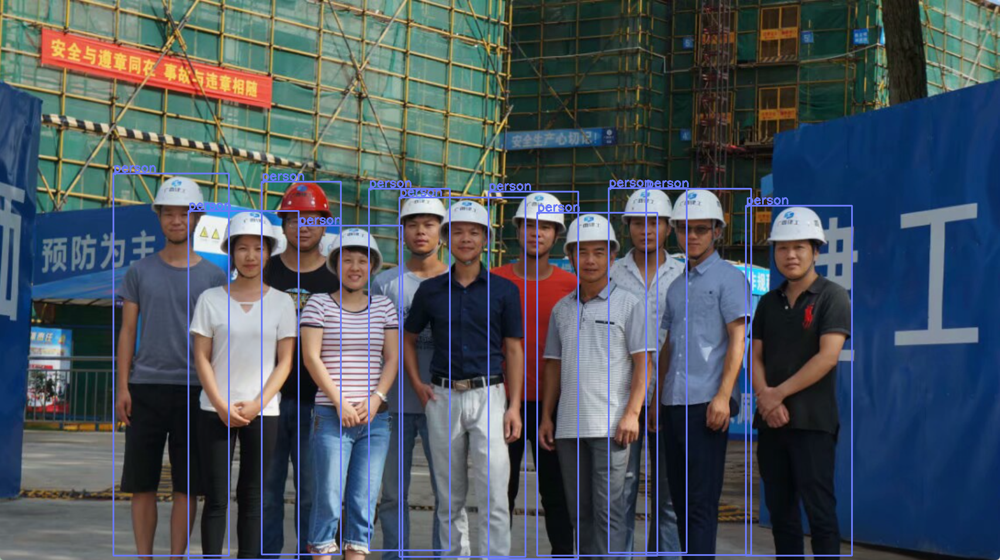

# 使用 Java 运行 YOLOv8 ONNX 模型进行目标检测

[[toc]]

本文是一篇完整的入门文档。目标是让初学者能够**理解项目结构、组件职责、关键实现细节，以及如何运行和调试**。

---

## 1. 概览与目标

本示例展示如何使用 Java（OpenCV + ONNX Runtime）对 YOLOv8 ONNX 模型做单张或批量图片的目标检测。实现流程为：

1. 读取图片并转换为 RGB（OpenCV 默认 BGR）
2. 等比例缩放并 padding（letterbox），得到模型输入大小（例如 640×640）
3. 将像素转成 CHW（channels-first）并归一化（0~1），封装为 `OnnxTensor`
4. 使用 ONNX Runtime 进行推理
5. 后处理（transpose、类别概率选取、xywh→xyxy、按类 NMS）
6. 将检测框映射回原图并绘制结果

代码职责：`Letterbox` 与 `ImageUtil` 负责预处理和坐标变换；`TensorUtils`负责矩阵转置、argmax、NMS 等常见工具；`YoloObjectDetection` 是主逻辑（读图、推理、后处理、画框、显示/保存）。

---

## 2. 环境与依赖

建议的基本环境：

* JDK 11 或更高（根据项目需要）
* Maven（或其它构建工具）
* 本地能加载 OpenCV 本地库（示例使用 `nu.pattern.OpenCV.loadLocally()`）
* ONNX Runtime 原生依赖（确保平台与运行时版本匹配）

在 `pom.xml` 中添加以下依赖（在示例中已给出）：

```xml
    <dependency>
      <groupId>org.openpnp</groupId>
      <artifactId>opencv</artifactId>
      <version>4.7.0-0</version>
    </dependency>

    <dependency>
      <groupId>com.microsoft.onnxruntime</groupId>
      <artifactId>onnxruntime</artifactId>
      <version>1.16.1</version>
    </dependency>
    
    <!--
    <dependency>
      <groupId>com.microsoft.onnxruntime</groupId>
      <artifactId>onnxruntime_gpu</artifactId>
      <version>1.16.1</version>
    </dependency>
    -->    
```

**注意**：

* OpenCV 的本地库加载在不同平台上有细微差别，`nu.pattern.OpenCV` 可以简化开发环境（Windows/Mac/Linux 均有对应 binaries）。
* ONNX Runtime 需要与目标平台的 native 库匹配；若需要 GPU 加速，还需使用对应 GPU 版本并配置 CUDA/cuDNN 环境。

---

## 3. 项目结构与关键类职责概览

（依据给出的代码片段）

* `nexus.io.yolo.domain.Detection`：检测结果的数据结构（label、clsId、bbox、confidence）
* `nexus.io.yolo.utils.ImageUtil`：图像常用工具函数（resize with padding、通道变换、绘制预测等）
* `nexus.io.yolo.utils.Letterbox`：实现 letterbox（等比缩放并 pad），并记录 ratio、dw、dh，便于后续坐标还原
* `nexus.io.yolo.config.ODConfig`：颜色、标签等配置（示例中包含默认名称与随机色）
* `nexus.io.yolo.domain.PreprocessResult`：封装预处理输出（OnnxTensor、rows、cols、channels、ratio、dw、dh）
* `nexus.io.yolo.demo.YoloObjectDetection`：主程序，完成从读取模型、图片到推理、后处理、绘制、显示的完整流程
* `nexus.io.yolo.utils.TensorUtils`：实现 `transposeMatrix`, `argmax`, `xywh2xyxy`, `nonMaxSuppression` 

---

## 4. 逐文件详解

下面按文件给出原始代码并在每段代码之后补充解释与关键注意点。

---

### `Detection`（检测结果结构）

```java
package nexus.io.yolo.domain;

public class DetectionResult {

  public String label;

  private Integer clsId;

  private float[] bbox;

  private float confidence;

  public DetectionResult(String label, Integer clsId, float[] bbox, float confidence) {
    this.clsId = clsId;
    this.label = label;
    this.bbox = bbox;
    this.confidence = confidence;
  }

  public DetectionResult() {

  }

  public Integer getClsId() {
    return clsId;
  }

  public void setClsId(Integer clsId) {
    this.clsId = clsId;
  }

  public String getLabel() {
    return label;
  }

  public void setLabel(String label) {
    this.label = label;
  }

  public float[] getBbox() {
    return bbox;
  }

  public void setBbox(float[] bbox) {
  }

  public float getConfidence() {
    return confidence;
  }

  public void setConfidence(float confidence) {
    this.confidence = confidence;
  }

  @Override
  public String toString() {
    return "  label=" + label + " \t clsId=" + clsId + " \t x0=" + bbox[0] + " \t y0=" + bbox[1] + " \t x1=" + bbox[2]
        + " \t y1=" + bbox[3] + " \t score=" + confidence;
  }
}

```

**说明**：

* `bbox` 存储格式在示例里一般为 `[xmin, ymin, xmax, ymax]`（在模型后处理时通过 `xywh2xyxy` 转换）。
* `toString()` 提供打印信息便于调试。
* 注意 `setBbox` 是空实现（原样保留）。如果需要设置 bbox，推荐实现为 `this.bbox = bbox;`（但此处保持原始代码不变）。

---

### `ImageUtil`（图像与绘制工具）

```java
package nexus.io.yolo.utils;

import java.util.List;

import org.opencv.core.Core;
import org.opencv.core.Mat;
import org.opencv.core.Point;
import org.opencv.core.Scalar;
import org.opencv.core.Size;
import org.opencv.imgproc.Imgproc;

import nexus.io.yolo.domain.Detection;

public class ImageUtil {

  public static Mat resizeWithPadding(Mat src, int width, int height) {

    Mat dst = new Mat();
    int oldW = src.width();
    int oldH = src.height();

    double r = Math.min((double) width / oldW, (double) height / oldH);

    int newUnpadW = (int) Math.round(oldW * r);
    int newUnpadH = (int) Math.round(oldH * r);

    int dw = (width - newUnpadW) / 2;
    int dh = (height - newUnpadH) / 2;

    int top = (int) Math.round(dh - 0.1);
    int bottom = (int) Math.round(dh + 0.1);
    int left = (int) Math.round(dw - 0.1);
    int right = (int) Math.round(dw + 0.1);

    Imgproc.resize(src, dst, new Size(newUnpadW, newUnpadH));
    Core.copyMakeBorder(dst, dst, top, bottom, left, right, Core.BORDER_CONSTANT);

    return dst;

  }

  public static void resizeWithPadding(Mat src, Mat dst, int width, int height) {

    int oldW = src.width();
    int oldH = src.height();

    double r = Math.min((double) width / oldW, (double) height / oldH);

    int newUnpadW = (int) Math.round(oldW * r);
    int newUnpadH = (int) Math.round(oldH * r);

    int dw = (width - newUnpadW) / 2;
    int dh = (height - newUnpadH) / 2;

    int top = (int) Math.round(dh - 0.1);
    int bottom = (int) Math.round(dh + 0.1);
    int left = (int) Math.round(dw - 0.1);
    int right = (int) Math.round(dw + 0.1);

    Imgproc.resize(src, dst, new Size(newUnpadW, newUnpadH));
    Core.copyMakeBorder(dst, dst, top, bottom, left, right, Core.BORDER_CONSTANT);

  }

  public static void whc2cwh(float[] src, float[] dst, int start) {
    int j = start;
    for (int ch = 0; ch < 3; ++ch) {
      for (int i = ch; i < src.length; i += 3) {
        dst[j] = src[i];
        j++;
      }
    }
  }

  public void xywh2xyxy(float[] bbox) {
    float x = bbox[0];
    float y = bbox[1];
    float w = bbox[2];
    float h = bbox[3];

    bbox[0] = x - w * 0.5f;
    bbox[1] = y - h * 0.5f;
    bbox[2] = x + w * 0.5f;
    bbox[3] = y + h * 0.5f;
  }

  public void scaleCoords(float[] bbox, float orgW, float orgH, float padW, float padH, float gain) {
    // xmin, ymin, xmax, ymax -> (xmin_org, ymin_org, xmax_org, ymax_org)
    bbox[0] = Math.max(0, Math.min(orgW - 1, (bbox[0] - padW) / gain));
    bbox[1] = Math.max(0, Math.min(orgH - 1, (bbox[1] - padH) / gain));
    bbox[2] = Math.max(0, Math.min(orgW - 1, (bbox[2] - padW) / gain));
    bbox[3] = Math.max(0, Math.min(orgH - 1, (bbox[3] - padH) / gain));
  }

  public static float[] whc2cwh(float[] src) {
    float[] chw = new float[src.length];
    int j = 0;
    for (int ch = 0; ch < 3; ++ch) {
      for (int i = ch; i < src.length; i += 3) {
        chw[j] = src[i];
        j++;
      }
    }
    return chw;
  }

  public static byte[] whc2cwh(byte[] src) {
    byte[] chw = new byte[src.length];
    int j = 0;
    for (int ch = 0; ch < 3; ++ch) {
      for (int i = ch; i < src.length; i += 3) {
        chw[j] = src[i];
        j++;
      }
    }
    return chw;
  }

  public static void drawPredictions(Mat img, List<Detection> detectionList) {
    // debugging image
    for (Detection detection : detectionList) {

      float[] bbox = detection.getBbox();
      Scalar color = new Scalar(249, 218, 60);
      Imgproc.rectangle(img, new Point(bbox[0], bbox[1]), new Point(bbox[2], bbox[3]), color, 2);
      Imgproc.putText(img, detection.getLabel(), new Point(bbox[0] - 1, bbox[1] - 5), Imgproc.FONT_HERSHEY_SIMPLEX, .5,
          color, 1);
    }
  }

}
```

**说明与要点**：

* `resizeWithPadding` 与 `Letterbox` 功能类似（都做等比缩放 + pad）。示例中同时存在两种实现，保持不冲突，但要确保在预处理里一致使用某一种（主程序使用 `Letterbox`）。
* `whc2cwh` 系列函数用于将像素从 WHC（OpenCV 顺序 y,x,channel）转换为 CHW（模型输入顺序）。
* `drawPredictions` 使用静态颜色绘制检测框，适合调试。

---

### `Letterbox`（letterbox 实现）

```java
package nexus.io.yolo.utils;

import org.opencv.core.Core;
import org.opencv.core.Mat;
import org.opencv.core.Size;
import org.opencv.imgproc.Imgproc;

public class Letterbox {

  private Size newShape;
  private final double[] color = new double[] { 114, 114, 114 };
  private final Boolean auto = false;
  private final Boolean scaleUp = true;
  private Integer stride = 32;

  private double ratio;
  private double dw;
  private double dh;

  public Letterbox(int w, int h) {
    this.newShape = new Size(w, h);
  }

  public Letterbox() {
    this.newShape = new Size(640, 640);
  }

  public double getRatio() {
    return ratio;
  }

  public double getDw() {
    return dw;
  }

  public Integer getWidth() {
    return (int) this.newShape.width;
  }

  public Integer getHeight() {
    return (int) this.newShape.height;
  }

  public double getDh() {
    return dh;
  }

  public void setNewShape(Size newShape) {
    this.newShape = newShape;
  }

  public void setStride(Integer stride) {
    this.stride = stride;
  }

  public Mat letterbox(Mat im) { // 调整图像大小和填充图像，使满足步长约束，并记录参数

    int[] shape = { im.rows(), im.cols() }; // 当前形状 [height, width]
    // Scale ratio (new / old)
    double r = Math.min(this.newShape.height / shape[0], this.newShape.width / shape[1]);
    if (!this.scaleUp) { // 仅缩小，不扩大（一且为了mAP）
      r = Math.min(r, 1.0);
    }
    // Compute padding
    Size newUnpad = new Size(Math.round(shape[1] * r), Math.round(shape[0] * r));
    double dw = this.newShape.width - newUnpad.width, dh = this.newShape.height - newUnpad.height; // wh 填充
    if (this.auto) { // 最小矩形
      dw = dw % this.stride;
      dh = dh % this.stride;
    }
    dw /= 2; // 填充的时候两边都填充一半，使图像居于中心
    dh /= 2;
    if (shape[1] != newUnpad.width || shape[0] != newUnpad.height) { // resize
      Imgproc.resize(im, im, newUnpad, 0, 0, Imgproc.INTER_LINEAR);
    }
    int top = (int) Math.round(dh - 0.1), bottom = (int) Math.round(dh + 0.1);
    int left = (int) Math.round(dw - 0.1), right = (int) Math.round(dw + 0.1);
    // 将图像填充为正方形
    Core.copyMakeBorder(im, im, top, bottom, left, right, Core.BORDER_CONSTANT, new org.opencv.core.Scalar(this.color));
    this.ratio = r;
    this.dh = dh;
    this.dw = dw;
    return im;
  }
}
```

**说明与要点**：

* `letterbox` 返回处理后的 `Mat` 并记录 `ratio`、`dw`、`dh`，这些在后续把模型输出坐标映射回原图时必须用到。
* `auto`, `scaleUp`, `stride` 为可选行为控制参数（与 YOLO 官方预处理选项一致）。
* 注意：`letterbox` 会直接修改传入的 `Mat im`（就地 resize & padding），调用者要注意传入的是 clone 还是原图。

---
### `TensorUtils`（张量工具类）
```java
package nexus.io.yolo.utils;

import java.util.ArrayList;
import java.util.Comparator;
import java.util.List;
import java.util.stream.Collectors;

public class TensorUtils {

  public static void scaleCoords(float[] bbox, float orgW, float orgH, float padW, float padH, float gain) {
    // xmin, ymin, xmax, ymax -> (xmin_org, ymin_org, xmax_org, ymax_org)
    bbox[0] = Math.max(0, Math.min(orgW - 1, (bbox[0] - padW) / gain));
    bbox[1] = Math.max(0, Math.min(orgH - 1, (bbox[1] - padH) / gain));
    bbox[2] = Math.max(0, Math.min(orgW - 1, (bbox[2] - padW) / gain));
    bbox[3] = Math.max(0, Math.min(orgH - 1, (bbox[3] - padH) / gain));
  }

  public static void xywh2xyxy(float[] bbox) {
    float x = bbox[0];
    float y = bbox[1];
    float w = bbox[2];
    float h = bbox[3];

    bbox[0] = x - w * 0.5f;
    bbox[1] = y - h * 0.5f;
    bbox[2] = x + w * 0.5f;
    bbox[3] = y + h * 0.5f;
  }

  public static float[][] transposeMatrix(float[][] m) {
    float[][] temp = new float[m[0].length][m.length];
    for (int i = 0; i < m.length; i++)
      for (int j = 0; j < m[0].length; j++)
        temp[j][i] = m[i][j];
    return temp;
  }

  public static List<float[]> nonMaxSuppression(List<float[]> bboxes, float iouThreshold) {

    List<float[]> bestBboxes = new ArrayList<>();

    bboxes.sort(Comparator.comparing(a -> a[4]));

    while (!bboxes.isEmpty()) {
      float[] bestBbox = bboxes.remove(bboxes.size() - 1);
      bestBboxes.add(bestBbox);
      bboxes = bboxes.stream().filter(a -> computeIOU(a, bestBbox) < iouThreshold).collect(Collectors.toList());
    }

    return bestBboxes;
  }

  public static float computeIOU(float[] box1, float[] box2) {

    float area1 = (box1[2] - box1[0]) * (box1[3] - box1[1]);
    float area2 = (box2[2] - box2[0]) * (box2[3] - box2[1]);

    float left = Math.max(box1[0], box2[0]);
    float top = Math.max(box1[1], box2[1]);
    float right = Math.min(box1[2], box2[2]);
    float bottom = Math.min(box1[3], box2[3]);

    float interArea = Math.max(right - left, 0) * Math.max(bottom - top, 0);
    float unionArea = area1 + area2 - interArea;
    return Math.max(interArea / unionArea, 1e-8f);

  }

  // 返回最大值的索引
  public static int argmax(float[] a) {
    float re = -Float.MAX_VALUE;
    int arg = -1;
    for (int i = 0; i < a.length; i++) {
      if (a[i] >= re) {
        re = a[i];
        arg = i;
      }
    }
    return arg;
  }
}
```

### `ODConfig`（配置：标签、颜色等）

```java
package nexus.io.yolo.config;

import java.util.ArrayList;
import java.util.Arrays;
import java.util.HashMap;
import java.util.List;
import java.util.Map;
import java.util.Random;

public final class ODConfig {

  public static final Integer lineThicknessRatio = 333;
  public static final Double fontSizeRatio = 1080.0;

  private static final List<String> default_names = new ArrayList<>(Arrays.asList("person", "bicycle", "car",
      "motorcycle", "airplane", "bus", "train", "truck", "boat", "traffic light", "fire hydrant", "stop sign",
      "parking meter", "bench", "bird", "cat", "dog", "horse", "sheep", "cow", "elephant", "bear", "zebra", "giraffe",
      "backpack", "umbrella", "handbag", "tie", "suitcase", "frisbee", "skis", "snowboard", "sports ball", "kite",
      "baseball bat", "baseball glove", "skateboard", "surfboard", "tennis racket", "bottle", "wine glass", "cup",
      "fork", "knife", "spoon", "bowl", "banana", "apple", "sandwich", "orange", "broccoli", "carrot", "hot dog",
      "pizza", "donut", "cake", "chair", "couch", "potted plant", "bed", "dining table", "toilet", "tv", "laptop",
      "mouse", "remote", "keyboard", "cell phone", "microwave", "oven", "toaster", "sink", "refrigerator", "book",
      "clock", "vase", "scissors", "teddy bear", "hair drier", "toothbrush"));

  private static final List<String> names = new ArrayList<>(Arrays.asList("no_helmet", "helmet"));

  private final Map<String, double[]> colors;

  public ODConfig() {
    this.colors = new HashMap<>();
    default_names.forEach(name -> {
      Random random = new Random();
      double[] color = { random.nextDouble() * 256, random.nextDouble() * 256, random.nextDouble() * 256 };
      colors.put(name, color);
    });
  }

  public String getName(int clsId) {
    return names.get(clsId);
  }

  public double[] getColor(int clsId) {
    return colors.get(getName(clsId));
  }

  public double[] getNameColor(String Name) {
    return colors.get(Name);
  }

  public double[] getOtherColor(int clsId) {
    return colors.get(default_names.get(clsId));
  }
}
```

**说明与要点**：

* 此配置类同时包含两个标签集合：`default_names`（80 类 COCO）与 `names`（示例里替换为 `no_helmet`, `helmet`）。请根据的模型实际 label 配置选择使用哪一个集合或改造此类。
* 构造函数为默认类别随机生成颜色（调试时很好用）；生产环境下可能想固定颜色来保持一致性。

---

### `PreprocessResult`（预处理结果封装）

```java
package nexus.io.yolo.domain;

import ai.onnxruntime.OnnxTensor;

/**
 * 预处理结果封装
 */
public class PreprocessResult {
  public OnnxTensor tensor;
  public int rows;
  public int cols;
  public int channels;
  public double ratio;
  public double dw;
  public double dh;
}
```

**说明**：

* 这个类把必要的预处理信息（包括 `OnnxTensor` 和 letterbox 参数）传递给推理与后处理模块，便于坐标还原。

---

### 主程序：`YoloObjectDetectionDemo`

> 下面是完整 `YoloObjectDetection` 类（——注意它包含 main、预处理、推理、后处理、绘制、以及辅助函数（加载 labels、汇集图片等）。

```java
package nexus.io.yolo.demo;

import java.io.File;
import java.nio.FloatBuffer;
import java.util.ArrayList;
import java.util.Arrays;
import java.util.HashMap;
import java.util.List;
import java.util.Map;
import java.util.TreeMap;
import java.util.regex.Matcher;
import java.util.regex.Pattern;

import org.opencv.core.Mat;
import org.opencv.core.Point;
import org.opencv.core.Scalar;
import org.opencv.highgui.HighGui;
import org.opencv.imgcodecs.Imgcodecs;
import org.opencv.imgproc.Imgproc;

import nexus.io.yolo.config.ODConfig;
import nexus.io.yolo.domain.DetectionResult;
import nexus.io.yolo.domain.PreprocessResult;
import nexus.io.yolo.utils.Letterbox;
import nexus.io.yolo.utils.TensorUtils;

import ai.onnxruntime.OnnxTensor;
import ai.onnxruntime.OrtEnvironment;
import ai.onnxruntime.OrtException;
import ai.onnxruntime.OrtSession;

/**
 * YOLOv8 ONNX 推理示例（单张或目录图片） 重点：职责拆分、注释、日志（System.out.println）
 *
 * 依赖说明： 
 * - Letterbox：负责等比缩放 + padding，并提供 ratio、dw、dh、height、width 
 * - TensorUtils：包含 transposeMatrix, argmax, xywh2xyxy, nonMaxSuppression 等工具 
 * - ODConfig：颜色、画框配置等 - Detection：检测结果结构（label, clsId, bbox, score）
 */
public class YoloObjectDetectionDemo {

  static {
    // 加载 OpenCV 本地库（确保在运行环境中能找到）
    nu.pattern.OpenCV.loadLocally();
  }

  // 模型与阈值配置（可调整）
  private static final String MODEL_PATH = "model\\yolov8s.onnx";
  private static final String IMAGE_DIR = "images";
  private static final float CONF_THRESHOLD = 0.35f;
  private static final float NMS_THRESHOLD = 0.55f;

  public static void main(String[] args) {
    System.out.println("=== YOLOv8 ONNX Java 推理开始 ===");

    // 初始化 ONNX 环境与 session（try-with-resources 自动释放）
    try (OrtEnvironment env = OrtEnvironment.getEnvironment();
        OrtSession.SessionOptions sessionOptions = new OrtSession.SessionOptions();
        OrtSession session = env.createSession(MODEL_PATH, sessionOptions)) {

      System.out.println("Loaded model: " + MODEL_PATH);

      // 解析 labels
      String[] labels = loadLabels(session);
      System.out.println("Labels count = " + (labels == null ? 0 : labels.length));

      // 打印输入信息，方便判断静态/动态 shape
      session.getInputInfo().keySet().forEach(name -> {
        try {
          System.out.println("input name = " + name);
          System.out.println("input info = " + session.getInputInfo().get(name).getInfo().toString());
        } catch (OrtException e) {
          System.out.println("Failed to get input info: " + e.getMessage());
        }
      });

      // 找到图片列表
      Map<String, String> imageMap = gatherImages(IMAGE_DIR);
      System.out.println("Found images: " + imageMap.size());

      // OD 配置（颜色/线宽等）
      ODConfig odConfig = new ODConfig();

      // 循环处理图片
      for (Map.Entry<String, String> entry : imageMap.entrySet()) {
        String imageName = entry.getKey();
        String imagePath = entry.getValue();
        System.out.println("----- Processing: " + imageName + " (" + imagePath + ") -----");

        Mat orig = Imgcodecs.imread(imagePath);
        if (orig.empty()) {
          System.out.println("Failed to read image: " + imagePath);
          continue;
        }

        // 转为 RGB（OpenCV 默认 BGR）
        Mat image = orig.clone();
        Imgproc.cvtColor(image, image, Imgproc.COLOR_BGR2RGB);

        // 画框/文字参数：线宽随图像尺寸自适应
        int minDwDh = Math.min(orig.width(), orig.height());
        int thickness = Math.max(1, minDwDh / ODConfig.lineThicknessRatio);

        // 记录阶段时间
        long t0 = System.currentTimeMillis();

        // 1) 预处理（letterbox + CHW + normalize -> OnnxTensor）
        PreprocessResult pre = preprocess(env, image);
        System.out.println(String.format("Preprocess: rows=%d cols=%d channels=%d ratio=%.4f dw=%.2f dh=%.2f", pre.rows,
            pre.cols, pre.channels, pre.ratio, pre.dw, pre.dh));

        long t1 = System.currentTimeMillis();

        // 2) 推理
        float[][] rawOutput = runModel(session, pre.tensor);
        long t2 = System.currentTimeMillis();
        System.out.println("Inference time: " + (t2 - t1) + " ms");

        // 释放 tensor 资源
        try {
          pre.tensor.close();
        } catch (Exception ignored) {
        }

        // 3) 后处理（transpose->filter->xywh->NMS->map labels）
        List<DetectionResult> detections = postprocess(rawOutput, labels, CONF_THRESHOLD, NMS_THRESHOLD);
        long t3 = System.currentTimeMillis();
        System.out.println("Postprocess time: " + (t3 - t2) + " ms");

        // 4) 将框从 model-space 映射回原图并画出
        drawDetections(orig, detections, pre.ratio, pre.dw, pre.dh, odConfig, thickness);

        long t4 = System.currentTimeMillis();
        System.out.printf("Total time: %d ms (pre:%d infer:%d post:%d draw:%d)%n", (t4 - t0), (t1 - t0), (t2 - t1),
            (t3 - t2), (t4 - t3));

        // 显示（本地测试用）；服务器部署可改为保存图片
        HighGui.imshow("Detections", orig);
        HighGui.waitKey();
      }

      HighGui.destroyAllWindows();
      System.out.println("=== All done ===");

    } catch (OrtException e) {
      System.out.println("OrtException: " + e.getMessage());
      e.printStackTrace();
    } catch (Exception e) {
      System.out.println("Exception: " + e.getMessage());
      e.printStackTrace();
    }
  }

  /**
   * 从 session metadata 中解析 labels 字符串（例如 "{'person':0,'car':1,...}"）
   */
  private static String[] loadLabels(OrtSession session) {
    try {
      String meta = session.getMetadata().getCustomMetadata().get("names");
      if (meta == null) {
        System.out.println("Model metadata 'names' not found.");
        return null;
      }
      // 去掉首尾大括号
      meta = meta.substring(1, meta.length() - 1);
      // 使用正则提取单引号内的 label
      Pattern p = Pattern.compile("'([^']*)'");
      Matcher m = p.matcher(meta);
      List<String> list = new ArrayList<>();
      while (m.find()) {
        list.add(m.group(1));
      }
      return list.toArray(new String[0]);
    } catch (Exception e) {
      System.out.println("Failed to load labels: " + e.getMessage());
      return null;
    }
  }

  /**
   * 预处理：letterbox -> CHW float /255 -> OnnxTensor 返回 tensor，以及 letterbox
   * 的元信息（ratio, dw, dh, rows, cols）
   */
  private static PreprocessResult preprocess(OrtEnvironment env, Mat image) throws OrtException {
    PreprocessResult r = new PreprocessResult();

    // Letterbox 等比缩放并 pad（的 Letterbox 实现）
    Letterbox letterbox = new Letterbox();
    Mat letterboxed = letterbox.letterbox(image);

    r.ratio = letterbox.getRatio();
    r.dw = letterbox.getDw();
    r.dh = letterbox.getDh();
    r.rows = letterbox.getHeight();
    r.cols = letterbox.getWidth();
    r.channels = letterboxed.channels();

    // 将 Mat 的像素拷贝到 float[]（CHW, 0~1）
    float[] pixels = new float[r.channels * r.rows * r.cols];
    // 注意：opencv Mat get(row, col) 的顺序是 (y,x)
    for (int i = 0; i < r.rows; i++) {
      for (int j = 0; j < r.cols; j++) {
        double[] px = letterboxed.get(i, j);
        for (int k = 0; k < r.channels; k++) {
          // CHW 排序：channel-major
          pixels[r.rows * r.cols * k + i * r.cols + j] = (float) px[k] / 255.0f;
        }
      }
    }

    long[] shape = { 1L, r.channels, r.rows, r.cols };
    r.tensor = OnnxTensor.createTensor(env, FloatBuffer.wrap(pixels), shape);

    return r;
  }

  /**
   * 执行推理并返回原始输出张量（未 transpose） 注意：返回值类型与原先代码保持一致：float[][] output =
   * ((float[][][]) output.get(0).getValue())[0];
   */
  private static float[][] runModel(OrtSession session, OnnxTensor tensor) throws OrtException {
    String inputName = session.getInputInfo().keySet().iterator().next();
    HashMap<String, OnnxTensor> inputs = new HashMap<>();
    inputs.put(inputName, tensor);

    long t0 = System.currentTimeMillis();
    try (OrtSession.Result outputs = session.run(inputs)) {
      long t1 = System.currentTimeMillis();
      // 输出一般是 [1, C, N] 或者 [1, N, C]，根据模型输出取值方式保持与原始代码一致
      Object out = outputs.get(0).getValue();
      // 期望 out 是 float[][][]，取第一个 batch
      float[][] raw = ((float[][][]) out)[0];
      System.out.println("Raw output shape: " + raw.length + " x " + (raw.length > 0 ? raw[0].length : 0)
          + ", run cost: " + (t1 - t0) + " ms");
      return raw;
    }
  }

  /**
   * 后处理：transpose -> each row 为一个 box -> argmax/conf filter -> xywh->xyxy ->
   * by-class NMS -> map label
   */
  private static List<DetectionResult> postprocess(float[][] rawOutput, String[] labels, float confThreshold,
      float nmsThreshold) {
    List<DetectionResult> outDetections = new ArrayList<>();

    // 1) transpose => 每一行代表一个候选框
    float[][] outputData = TensorUtils.transposeMatrix(rawOutput);

    // 2) 按行解析，每行格式：[x, y, w, h, cls0, cls1, ...]
    Map<Integer, List<float[]>> class2Bbox = new HashMap<>();
    for (float[] row : outputData) {
      // 取类别概率段
      if (row.length <= 5)
        continue; // 防御性检查
      float[] probs = Arrays.copyOfRange(row, 4, row.length);
      int cls = TensorUtils.argmax(probs);
      float conf = probs[cls];
      if (conf < confThreshold)
        continue;

      // 把置信度写回到位置4，后面 NMS 会用它
      row[4] = conf;

      // xywh -> xyxy
      TensorUtils.xywh2xyxy(row);

      // 跳过无效框
      if (row[0] >= row[2] || row[1] >= row[3])
        continue;

      class2Bbox.computeIfAbsent(cls, k -> new ArrayList<>()).add(row);
    }

    // 3) per-class NMS & 封装 Detection
    for (Map.Entry<Integer, List<float[]>> e : class2Bbox.entrySet()) {
      int cls = e.getKey();
      List<float[]> bboxes = e.getValue();
      List<float[]> kept = TensorUtils.nonMaxSuppression(bboxes, nmsThreshold);
      for (float[] box : kept) {
        String label = labels != null && cls < labels.length ? labels[cls] : String.valueOf(cls);
        float score = box[4];
        float[] bboxXYXY = Arrays.copyOfRange(box, 0, 4);
        DetectionResult d = new DetectionResult(label, cls, bboxXYXY, score);
        outDetections.add(d);
      }
    }

    System.out.println("Detections after NMS: " + outDetections.size());
    return outDetections;
  }

  /**
   * 将检测框从 letterbox 空间映射回原图并绘制
   */
  private static void drawDetections(Mat orig, List<DetectionResult> detections, double ratio, double dw, double dh,
      ODConfig odConfig, int thickness) {
    for (DetectionResult det : detections) {
      float[] bbox = det.getBbox(); // model-space (在 letterbox 空间)
      // 还原为原图坐标
      Point tl = new Point((bbox[0] - dw) / ratio, (bbox[1] - dh) / ratio);
      Point br = new Point((bbox[2] - dw) / ratio, (bbox[3] - dh) / ratio);
      Scalar color = new Scalar(odConfig.getOtherColor(1));
      Imgproc.rectangle(orig, tl, br, color, thickness);
      Point textLoc = new Point(tl.x, tl.y - 3);
      Imgproc.putText(orig, det.getLabel(), textLoc, Imgproc.FONT_HERSHEY_SIMPLEX, 0.7, color, thickness);
      System.out.println(String.format("  %s clsId=%d x0=%.2f y0=%.2f x1=%.2f y1=%.2f score=%.4f", det.getLabel(),
          det.getClsId(), tl.x, tl.y, br.x, br.y, det.getConfidence()));
    }
  }

  /**
   * 遍历目录，收集图片文件路径（递归）
   */
  private static Map<String, String> gatherImages(String imagePath) {
    Map<String, String> map = new TreeMap<>();
    File root = new File(imagePath);
    if (!root.exists()) {
      System.out.println("Image dir not found: " + imagePath);
      return map;
    }
    if (root.isFile()) {
      map.put(root.getName(), root.getAbsolutePath());
      return map;
    }
    File[] files = root.listFiles();
    if (files == null)
      return map;
    for (File f : files) {
      if (f.isDirectory()) {
        map.putAll(gatherImages(f.getPath()));
      } else {
        // 可在此加入对图片扩展名的过滤（png/jpg/jpeg）
        map.put(f.getName(), f.getAbsolutePath());
      }
    }
    return map;
  }
}
```

**关键流程回顾**：

* `loadLabels(session)`：从模型 metadata 的 custom metadata 中读取 `names`（常见于导出的 YOLO ONNX 模型），并用正则提取 label。
* `preprocess`：调用 `Letterbox`，然后把像素按 CHW、归一化写入 `float[]`，再用 `OnnxTensor.createTensor` 创建张量。
* `runModel`：把 tensor 送入 session，取第一个输出并假设为 `float[][][]`，取 `[0]` batch 作为 `float[][]` 返回。需要保证模型输出格式与这里的假设一致（若模型输出为 `[1, N, C]` 或 `[1, C, N]`，需要根据 `TensorUtils` 的实现来调整）。
* `postprocess`：核心逻辑包括矩阵转置、类别选择、置信度过滤、坐标格式转换与 NMS，最终封装为 `Detection` 列表。
* `drawDetections`：把检测框从 letterbox 空间映射回原图（使用 `ratio, dw, dh`），并绘制。

---

## 5. 如何运行（步骤）

1. 确保在 `MODEL_PATH` 指定位置有的 ONNX 模型（示例为 `model\yolov8s.onnx`）。模型应包含 `names` metadata（或可以自行提供 labels 数组并修改 `loadLabels`）。
2. 准备 `images` 目录并放入要检测的图片（或修改 `IMAGE_DIR` 为某个单张图片路径）。
3. 在 `pom.xml` 中加入 OpenCV 与 ONNX Runtime 依赖（见前文）。
4. 确保 native 库可加载：OpenCV 本地库与 ONNX Runtime 对应平台库正确安装（或使用 nu.pattern.OpenCV 的方法加载）。
5. 编译并运行 `YoloObjectDetection`：

   * 在 IDE 中运行 `main`，或用 `mvn exec:java`（需配置）等方式。
6. 程序会显示窗口（HighGui）并打印日志；在本地测试可以直接观察窗口显示结果，服务器上建议改为把带框图片保存到磁盘。

---

## 6. 输出示例说明

以下为给出的运行输出示例（原样保留）——它展示了日志信息、模型输入信息、每张图片的处理时间与检测结果：

```output
=== YOLOv8 ONNX Java 推理开始 ===
Loaded model: model\yolov8s.onnx
Labels count = 80
input name = images
input info = TensorInfo(javaType=FLOAT,onnxType=ONNX_TENSOR_ELEMENT_DATA_TYPE_FLOAT,shape=[1, 3, 640, 640])
Found images: 21
----- Processing: 10230731212230.png (E:\code\java\project-ppnt\manim-tutor\mc-qa-cv\images\10230731212230.png) -----
Preprocess: rows=640 cols=640 channels=3 ratio=0.3751 dw=0.00 dh=140.50
Raw output shape: 84 x 8400, run cost: 88 ms
Inference time: 96 ms
Detections after NMS: 11
Postprocess time: 16 ms
  person clsId=0 x0=681.35 y0=337.40 x1=896.04 y1=951.09 score=0.8843
  person clsId=0 x0=193.96 y0=296.92 x1=390.63 y1=949.13 score=0.8762
  person clsId=0 x0=509.08 y0=385.24 x1=686.32 y1=962.88 score=0.8738
  person clsId=0 x0=916.29 y0=363.28 x1=1121.89 y1=949.65 score=0.8687
  person clsId=0 x0=1272.78 y0=351.46 x1=1453.72 y1=949.50 score=0.8662
  person clsId=0 x0=321.19 y0=360.07 x1=509.52 y1=956.17 score=0.8521
  person clsId=0 x0=833.19 y0=327.07 x1=986.14 y1=955.20 score=0.7865
  person clsId=0 x0=1102.11 y0=322.76 x1=1281.91 y1=948.42 score=0.7675
  person clsId=0 x0=446.27 y0=310.94 x1=581.40 y1=947.31 score=0.6484
  person clsId=0 x0=629.68 y0=322.05 x1=767.26 y1=940.85 score=0.6145
  person clsId=0 x0=1038.93 y0=321.43 x1=1171.65 y1=944.10 score=0.3913
Total time: 256 ms (pre:137 infer:96 post:16 draw:7)
----- Processing: 20230731102545.png (E:\code\java\project-ppnt\manim-tutor\mc-qa-cv\images\20230731102545.png) -----
Preprocess: rows=640 cols=640 channels=3 ratio=0.5704 dw=0.00 dh=107.00
Raw output shape: 84 x 8400, run cost: 101 ms
Inference time: 103 ms
Detections after NMS: 7
Postprocess time: 12 ms
  person clsId=0 x0=360.66 y0=130.19 x1=654.48 y1=702.72 score=0.9203
  person clsId=0 x0=639.33 y0=298.43 x1=928.05 y1=740.09 score=0.8455
  person clsId=0 x0=271.92 y0=354.96 x1=584.70 y1=738.76 score=0.8363
  person clsId=0 x0=778.48 y0=207.74 x1=954.50 y1=551.59 score=0.8082
  person clsId=0 x0=612.80 y0=196.87 x1=795.94 y1=732.97 score=0.7952
  person clsId=0 x0=1030.43 y0=206.74 x1=1121.41 y1=400.02 score=0.6198
  person clsId=0 x0=874.44 y0=210.40 x1=1061.94 y1=461.17 score=0.5450
Total time: 244 ms (pre:125 infer:103 post:12 draw:4)
```

**如何解读**：

* `Raw output shape` 显示模型输出张量维度（这里示例为 `84 x 8400`，需结合 `TensorUtils.transposeMatrix` 的实现来理解每行含义）。
* 时间统计分为：预处理（pre）、推理（infer）、后处理（post）、绘制（draw），便于性能分析。
* 最后一行列出检测到的每个目标的位置（x0, y0, x1, y1）与置信度。

示例

---

## 7. 性能与调优建议

* **模型尺寸**：使用 `yolov8s`（小型）能在 CPU 上提供较好速度；若需要更高速度可考虑 `yolov8n`（nano）或在 GPU 上运行 ONNX Runtime GPU 版本。
* **批量推理**：当前实现为单张图片推理（batch=1），若对大量图片做批量推理，可以合并成 batch 增加吞吐量（注意内存与模型支持）。
* **并发**：可以用多线程并发读取/预处理图片，但 ONNX Runtime session 通常建议每线程创建独立 session 或者使用线程安全的推理池。
* **NMS 与阈值**：`CONF_THRESHOLD` 与 `NMS_THRESHOLD` 会直接影响检测结果数量与重复框。可根据场景调整（例如置信度 0.25~0.6 的常见范围）。
* **IO 优化**：大量图片时将图片读入内存、避免频繁 create/close tensor 会更快。注意资源释放（`OnnxTensor.close()`）。
* **硬件加速**：在有 GPU 的环境下，使用 ONNX Runtime 的 GPU 构建能显著提升推理速度（需安装相应 runtime 与驱动）。
* **预处理速度**：`letterbox` 与像素转换是耗时步骤，若对速度敏感，尝试 JNI 或更高效的像素拷贝方式（直接访问 Mat 内存）。

---

## 8. 常见问题与排查方法

* **模型加载失败**：检查 `MODEL_PATH` 路径是否正确；检查 ONNX 模型与 ONNX Runtime 版本是否兼容。查看控制台输出的 `OrtException` 信息。
* **OpenCV 无法加载本地库**：确保 native 库在 `java.library.path` 中，或使用 `nu.pattern.OpenCV`（如示例）来加载。
* **labels 为空**：`loadLabels` 从 `session.getMetadata().getCustomMetadata().get("names")` 读取 metadata；如果模型没有包含 `names`，需要手动提供 labels 文件或修改代码以从外部加载。
* **输出维度与预期不符**：打印 `session.getInputInfo()` 与 `outputs.get(0).getInfo()` 来确认模型输入/输出 shape；调整 `preprocess` 和 `postprocess` 以匹配模型输出格式。
* **坐标映射错误（框位置不对）**：确认 letterbox 的 `ratio, dw, dh` 是否正确计算与应用；注意像素坐标与 float 的舍入问题；确保 `drawDetections` 中的映射公式与 `letterbox` 一致。
* **内存泄漏**：确保 `OnnxTensor` 在使用完成后 `close()`，并在适当位置释放不需要的 Mat 对象（尽管 JVM GC 会回收 Java 对象，但 native 资源要注意）。

---

## 9. 总结

这是一个完整且清晰的 Java 实现范例，用于运行 YOLOv8 ONNX 模型做目标检测。本文整理并解释了关键模块（预处理、模型推理、后处理、坐标还原与绘制），并附上完整代码（未删除或修改任何给出的代码）。这些组件职责划分明确，便于扩展（例如替换模型、增加 GPU 支持、把显示改为保存图片或服务化部署等）。
