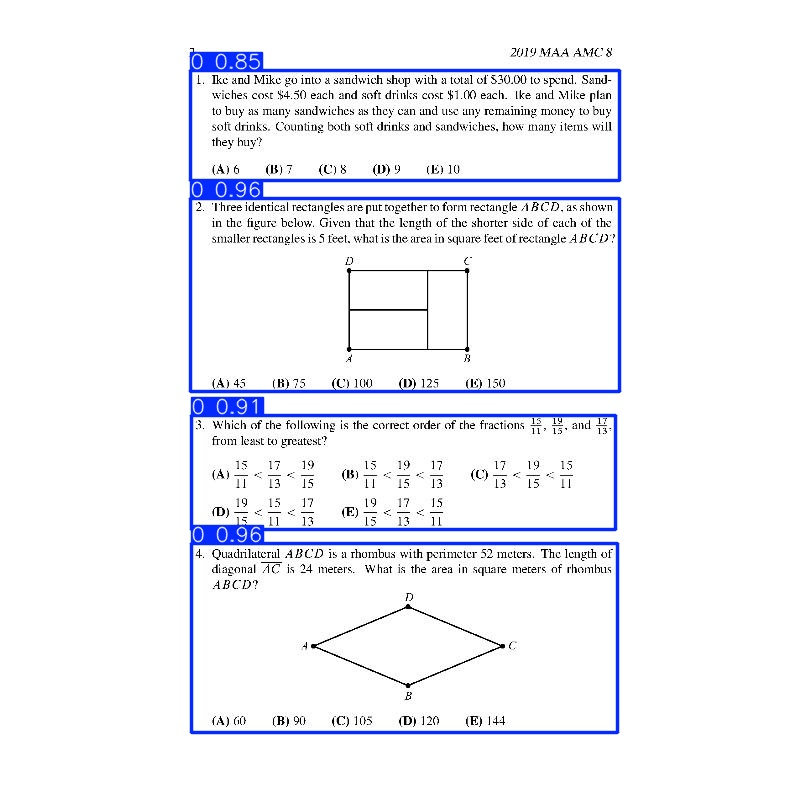

# 题目区域

请求
```
POST /yolo/question/detection
file:binary
```

```json
{
    "data": [
        {
            "bbox": [
                190.37964,
                198.73161,
                619.1305,
                391.99677
            ],
            "label": "0",
            "clsId": 0,
            "confidence": 0.96059114
        },
        {
            "bbox": [
                191.79543,
                543.9065,
                617.9324,
                732.2914
            ],
            "label": "0",
            "clsId": 0,
            "confidence": 0.95622677
        },
        {
            "bbox": [
                191.75919,
                415.07095,
                615.75287,
                529.24176
            ],
            "label": "0",
            "clsId": 0,
            "confidence": 0.9143174
        },
        {
            "bbox": [
                190.507,
                70.80026,
                619.5657,
                180.49628
            ],
            "label": "0",
            "clsId": 0,
            "confidence": 0.848917
        }
    ],
    "ok": true,
    "code": 1,
    "error": null,
    "msg": null
}
```



| 名称 | 含义   |
| -- | ---- |
| x0 | 左上角X |
| y0 | 左上角Y |
| x1 | 右下角X |
| y1 | 右下角Y |