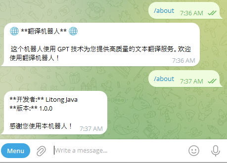

# 增加命令菜单

## 引言

本文档旨在指导开发者如何为 Telegram 机器人添加命令菜单，以提升用户交互体验。通过详细的代码示例和解释，读者将学习如何使用 BotFather 或通过编程方式动态管理机器人命令菜单。本文还介绍了如何过滤命令消息以及封装路由，以实现更灵活和可维护的机器人功能。

## 增加命令菜单

为机器人增加命令菜单有两种主要方式：

- 通过 **BotFather**
- 通过 **代码**

### 通过 **BotFather** 增加菜单

- /mybots
- 选择机器人
- Edit Bot
- Edit Commands
  发送下面的消息

```plantext
start - 首页
```

### 通过代码增加命令菜单

以下代码示例演示了如何通过编程方式为 Telegram 机器人设置和删除命令菜单。通过这种方法，可以在运行时动态管理机器人的命令，提供更大的灵活性。

```java
package com.litongjava.gpt.translator.config;

import java.nio.file.Path;
import java.time.Duration;
import java.util.List;
import java.util.function.Function;

import com.litongjava.annotation.AConfiguration;
import com.litongjava.annotation.Initialization;
import com.litongjava.gpt.translator.client.TelegramClient;
import com.litongjava.gpt.translator.predicate.UserMessagePredicate;
import com.litongjava.gpt.translator.telegram.adapter.MyBotEventAdapter;
import com.litongjava.gpt.translator.telegram.function.TranslateFunction;
import com.litongjava.tio.boot.server.TioBootServer;
import com.litongjava.tio.utils.environment.EnvUtils;

import lombok.extern.slf4j.Slf4j;
import reactor.util.retry.Retry;
import telegram4j.core.MTProtoBootstrap;
import telegram4j.core.MTProtoTelegramClient;
import telegram4j.core.event.domain.message.SendMessageEvent;
import telegram4j.core.spec.BotCommandScopeSpec;
import telegram4j.mtproto.RpcException;
import telegram4j.mtproto.store.FileStoreLayout;
import telegram4j.mtproto.store.StoreLayoutImpl;
import telegram4j.tl.BotCommand;
import telegram4j.tl.ImmutableBotCommand;

@Slf4j
@AConfiguration
public class TelegramTranslateBot {

  @Initialization
  public void config() {
    // 从环境变量获取 Telegram API 配置信息
    int apiId = EnvUtils.getInt("telegram.api.id");
    String apiHash = EnvUtils.getStr("telegram.api.hash");
    String botAuthToken = EnvUtils.getStr("telegram.bot.auth.token");

    String botId = botAuthToken.split(":")[0];
    // 创建并连接 MTProto Telegram 客户端
    MTProtoBootstrap bootstrap = MTProtoTelegramClient.create(apiId, apiHash, botAuthToken);

    StoreLayoutImpl storeLayoutImpl = new StoreLayoutImpl(Function.identity());
    FileStoreLayout storeLayout = new FileStoreLayout(storeLayoutImpl, Path.of("t4j-bot_" + botId + ".bin"));
    bootstrap.setStoreLayout(storeLayout);

    MTProtoTelegramClient client = bootstrap.connect().block();
    if (client == null) {
      log.error("Failed to connect to Telegram MTProto client.");
      return;
    }
    log.info("Telegram MTProto client connected.");

    //deleteCommand(client);
    setCommand(client);

    // 获取自己的id
    long selfId = client.getSelfId().asLong();
    log.info("self id:{}", selfId);

    // 配置事件监听器：接收 SendMessageEvent，过滤用户消息，并应用翻译功能
    client.on(SendMessageEvent.class)
        //
        .filter(new UserMessagePredicate(selfId)::test).flatMap(new TranslateFunction()::apply)
        //
        .delayElements(Duration.ofSeconds(1)) // 每秒最多发送一条消息
        //
        .doOnError(e -> log.error("处理消息时发生错误", e))
        //
        .retryWhen(Retry.backoff(5, Duration.ofSeconds(1)).filter(e -> e instanceof RpcException))
        //
        .subscribe();

    client.on(new MyBotEventAdapter()).subscribe();

    TelegramClient.client = client;

    // 防止主线程阻塞，监控客户端断开连接
    //    TioThreadUtils.submit(() -> {
    //      client.onDisconnect().block();
    //      log.info("Telegram client disconnected.");
    //    });

    // 在服务器关闭时，断开 Telegram 客户端连接
    HookCan.me().addDestroyMethod(client::disconnect);


  }

  private void deleteCommand(MTProtoTelegramClient client) {
    client.resetCommands(BotCommandScopeSpec.of(BotCommandScopeSpec.Type.DEFAULT), "")
        //
        .retryWhen(Retry.backoff(3, Duration.ofSeconds(2)))
        //
        .doOnSuccess(v -> log.info("Commands successfully deleted!"))
        //
        .doOnError(e -> log.error("Failed to delete commands.", e)).block();
  }

  private void setCommand(MTProtoTelegramClient client) {
    BotCommand startCommand = ImmutableBotCommand.of("start", "Start using the bot");
    BotCommand aboutCommand = ImmutableBotCommand.of("about", "About this bot");

    List<BotCommand> commands = List.of(startCommand, aboutCommand);

    client.setCommands(BotCommandScopeSpec.of(BotCommandScopeSpec.Type.DEFAULT), "", commands)
        //
        .retryWhen(Retry.backoff(3, Duration.ofSeconds(2)))
        //
        .doOnSuccess(v -> log.info("Commands successfully set!"))
        //
        .doOnError(e -> log.error("Failed to set commands.", e)).block();
  }
}
```

上面的代码演示了如何通过代码增加命令菜单，增加完成后显示如下：


在上述代码中，`TelegramTranslateBot` 类通过代码方式为 Telegram 机器人设置和删除命令菜单。下面将详细解释 `setCommand` 和 `deleteCommand` 两个方法的实现及其工作原理。

## 通过代码增加命令菜单 代码解释

### `setCommand` 方法

#### 功能

`setCommand` 方法用于为机器人设置命令菜单。在本例中，设置了两个命令：`/start` 和 `/about`，分别对应“开始使用机器人”和“关于此机器人”的描述。设置菜单时无需在命令前添加斜杠（"/"），只需直接添加命令即可。菜单设置一次后，只要不删除，即可永久有效。

#### 代码解析

```java
private void setCommand(MTProtoTelegramClient client) {
    BotCommand startCommand = ImmutableBotCommand.of("start", "Start using the bot");
    BotCommand aboutCommand = ImmutableBotCommand.of("about", "About this bot");

    List<BotCommand> commands = List.of(startCommand, aboutCommand);

    client.setCommands(BotCommandScopeSpec.of(BotCommandScopeSpec.Type.DEFAULT), "", commands)
        //
        .retryWhen(Retry.backoff(3, Duration.ofSeconds(2)))
        //
        .doOnSuccess(v -> log.info("Commands successfully set!"))
        //
        .doOnError(e -> log.error("Failed to set commands.", e)).block();
}
```

#### 详细说明

1. **定义命令**

   ```java
   BotCommand startCommand = ImmutableBotCommand.of("start", "Start using the bot");
   BotCommand aboutCommand = ImmutableBotCommand.of("about", "About this bot");
   ```

   - 使用 `ImmutableBotCommand.of` 方法创建两个不可变的 `BotCommand` 对象，分别代表 `/start` 和 `/about` 命令，并为其添加描述。

2. **创建命令列表**

   ```java
   List<BotCommand> commands = List.of(startCommand, aboutCommand);
   ```

   - 将上述两个命令添加到一个 `List` 中，以便一次性设置多个命令。

3. **设置命令**

   ```java
   client.setCommands(BotCommandScopeSpec.of(BotCommandScopeSpec.Type.DEFAULT), "", commands)
   ```

   - 调用 `client.setCommands` 方法，将命令列表应用到默认范围 (`BotCommandScopeSpec.Type.DEFAULT`)。
   - 第二个参数为空字符串，表示不使用特定的语言环境。

4. **重试机制**

   ```java
   .retryWhen(Retry.backoff(3, Duration.ofSeconds(2)))
   ```

   - 使用 Reactor 的 `retryWhen` 操作符，配置在失败时进行重试，最多重试 3 次，每次重试之间间隔 2 秒。

5. **日志记录**

   ```java
   .doOnSuccess(v -> log.info("Commands successfully set!"))
   .doOnError(e -> log.error("Failed to set commands.", e))
   ```

   - 成功设置命令后，记录成功日志。
   - 如果设置失败，记录错误日志。

6. **阻塞等待**

   ```java
   .block();
   ```

   - 阻塞当前线程，直到命令设置操作完成。这在初始化阶段确保命令已经设置完毕。

### `deleteCommand` 方法

#### 功能

`deleteCommand` 方法用于删除机器人当前的所有命令菜单。这在需要重置命令或移除现有命令时使用。

#### 代码解析

```java
private void deleteCommand(MTProtoTelegramClient client) {
    client.resetCommands(BotCommandScopeSpec.of(BotCommandScopeSpec.Type.DEFAULT), "")
        //
        .retryWhen(Retry.backoff(3, Duration.ofSeconds(2)))
        //
        .doOnSuccess(v -> log.info("Commands successfully deleted!"))
        //
        .doOnError(e -> log.error("Failed to delete commands.", e)).block();
}
```

#### 详细说明

1. **重置命令**

   ```java
   client.resetCommands(BotCommandScopeSpec.of(BotCommandScopeSpec.Type.DEFAULT), "")
   ```

   - 调用 `client.resetCommands` 方法，针对默认范围 (`BotCommandScopeSpec.Type.DEFAULT`) 重置命令。
   - 第二个参数为空字符串，表示不使用特定的语言环境。

2. **重试机制**

   ```java
   .retryWhen(Retry.backoff(3, Duration.ofSeconds(2)))
   ```

   - 类似于 `setCommand` 方法，配置在失败时进行最多 3 次重试，每次间隔 2 秒。

3. **日志记录**

   ```java
   .doOnSuccess(v -> log.info("Commands successfully deleted!"))
   .doOnError(e -> log.error("Failed to delete commands.", e))
   ```

   - 成功删除命令后，记录成功日志。
   - 如果删除失败，记录错误日志。

4. **阻塞等待**

   ```java
   .block();
   ```

   - 阻塞当前线程，直到命令删除操作完成。

#### 注意事项

- 在 `config` 方法中，`deleteCommand(client);` 被注释掉了。这意味着默认情况下不会删除现有命令，只有在需要重置命令时才会启用该方法。
- 使用阻塞操作 (`block()`) 在初始化阶段是合理的，但在其他上下文中应谨慎使用，以避免阻塞非阻塞式应用的执行流程。

### 总结

通过 `setCommand` 和 `deleteCommand` 方法，`TelegramTranslateBot` 类实现了通过代码方式动态管理 Telegram 机器人的命令菜单。这种方法相比使用 BotFather 更加灵活，适用于需要在运行时动态调整命令的场景。此外，代码中采用了重试机制和日志记录，增强了系统的健壮性和可维护性。

## 过滤命令消息

在上述代码中，我们增加了 `SendMessageEvent` 和 `MyBotEventAdapter` 的监听。当消息发送到本程序时，`MyBotEventAdapter` 和 `SendMessageEvent` 对应的监听器都会处理消息。为了避免处理命令消息，我们在 `UserMessagePredicate` 中增加了过滤逻辑。命令消息的 `entities` 类型为 `MessageEntityBotCommand`。

以下是命令消息的日志示例：

```log
SendMessageEvent{
	message=Message{data=Variant2{t1=BaseMessage#38116ee0{flags=10000000, id=1822, fromId=null, peerId=PeerUser#59511722{userId=my_chat_id}, fwdFrom=null, viaBotId=null, replyTo=null, date=1733760693, message='/start', media=null, replyMarkup=null,

		entities=[MessageEntityBotCommand#6cef8ac7{offset=0, length=6}], views=null, forwards=null, replies=null, editDate=null, postAuthor='null', groupedId=null, reactions=null, restrictionReason=null, ttlPeriod=null}}},

	chat=PrivateChat{user=User{minData=BaseUser#abb5f120{flags=10010000000000000001101011, flags2=10000, id=my_chat_id, accessHash=-6745242867060598026, firstName='苏里南', lastName='null', username='xpankou', phone='null', photo=BaseUserProfilePhoto#82d1f706{flags=0, photoId=5129962608709971087, strippedThumb=null, dcId=1}, status=UserStatusRecently#e26f42f1{}, botInfoVersion=null, restrictionReason=null, botInlinePlaceholder='null', langCode='zh-hans', emojiStatus=null, usernames=null, storiesMaxId=null}, fullData=null}, selfUser=User{minData=BaseUser#abb5f120{flags=10000010001100010000001011, flags2=10010, id=7847170133, accessHash=-4262855346709871929, firstName='my-translator', lastName='null', username='litongjava_bot', phone='null', photo=null, status=null, botInfoVersion=3, restrictionReason=null, botInlinePlaceholder='Search...', langCode='null', emojiStatus=null, usernames=null, storiesMaxId=null}, fullData=null}},

	author=User{minData=BaseUser#abb5f120{flags=10010000000000000001101011, flags2=10000, id=my_chat_id, accessHash=-6745242867060598026, firstName='苏里南', lastName='null', username='xpankou', phone='null', photo=BaseUserProfilePhoto#82d1f706{flags=0, photoId=5129962608709971087, strippedThumb=null, dcId=1}, status=UserStatusRecently#e26f42f1{}, botInfoVersion=null, restrictionReason=null, botInlinePlaceholder='null', langCode='zh-hans', emojiStatus=null, usernames=null, storiesMaxId=null}, fullData=null}
}
```

### `UserMessagePredicate` 类

```java
package com.litongjava.gpt.translator.predicate;

import java.util.List;
import java.util.Optional;
import java.util.function.Predicate;

import lombok.extern.slf4j.Slf4j;
import telegram4j.core.event.domain.message.SendMessageEvent;
import telegram4j.core.object.MentionablePeer;
import telegram4j.core.object.Message;
import telegram4j.core.object.MessageEntity;
import telegram4j.core.object.chat.Chat;

@Slf4j
public class UserMessagePredicate implements Predicate<SendMessageEvent> {
  private long botId;

  public UserMessagePredicate(long selfId) {
    this.botId = selfId;
  }

  @Override
  public boolean test(SendMessageEvent event) {
    // log.info("e:{}", event);

    Optional<MentionablePeer> optionalAuthor = event.getAuthor();
    Optional<Chat> optionalChat = event.getChat();
    // 防止机器人处理自己发送的消息
    // 如果消息的发送者信息不存在，说明可能是机器人自身发送的消息，忽略
    if (optionalAuthor.isEmpty()) {
      log.info("消息发送者信息缺失，可能是机器人自身发送的消息。");
      return false;
    }
    if (optionalChat.isEmpty()) {
      log.info("消息信息缺失，可能是机器人自身发送的消息。");
      return false;
    }
    long messageAuthorId = optionalAuthor.get().getId().asLong();
    if (botId == messageAuthorId) {
      log.info("获取到机器人的消息");
      return false;
    }
    Message message = event.getMessage();
    String content = message.getContent();
    List<MessageEntity> entities = message.getEntities();
    for (MessageEntity messageEntity : entities) {
      if (messageEntity.getType() == MessageEntity.Type.BOT_COMMAND && messageEntity.getContent().equals(content)) {
        log.info("不处理命令");
        return false;
      }
    }

    return true;
  }
}
```

## 封装路由

### TelegramCommandUtils

```java
package com.litongjava.gpt.translator.telegram.common;

import java.util.List;
import java.util.Optional;

import telegram4j.core.object.Message;
import telegram4j.core.object.MessageEntity;

public class TelegramCommandUtils {
  public static Optional<ParsedCommand> parseCommand(Message message) {

    List<MessageEntity> entities = message.getEntities();
    for (MessageEntity entity : entities) {
      if (entity.getType() == MessageEntity.Type.BOT_COMMAND) {
        String commandWithArgs = message.getContent().substring(entity.getOffset(), entity.getOffset() + entity.getLength());
        String[] parts = commandWithArgs.split(" ", 2);
        String command = parts[0].substring(1);
        String args = parts.length > 1 ? parts[1] : "";
        return Optional.of(new ParsedCommand(command, args));
      }
    }
    return Optional.empty();
  }
}
```

### ParsedCommand

```java
package com.litongjava.gpt.translator.telegram.common;
public class ParsedCommand {
  private final String command;
  private final String args;

  public ParsedCommand(String command, String args) {
    this.command = command;
    this.args = args;
  }

  public String getCommand() { return command; }
  public String getArgs() { return args; }
}
```

### TelegramCommandRouter

```java
package com.litongjava.gpt.translator.telegram.common;

import java.util.ArrayList;
import java.util.List;
import java.util.Map;
import java.util.concurrent.ConcurrentHashMap;
import java.util.function.Function;

import org.reactivestreams.Publisher;

import telegram4j.core.event.domain.message.SendMessageEvent;
import telegram4j.tl.BotCommand;
import telegram4j.tl.ImmutableBotCommand;

public class TelegramCommandRouter {
  public static List<BotCommand> botCommands = new ArrayList<>();
  public static Map<String, Function<SendMessageEvent, Publisher<?>>> mappings = new ConcurrentHashMap<>();

  public static void add(String command, String descripton, Function<SendMessageEvent, Publisher<?>> function) {
    botCommands.add(ImmutableBotCommand.of(command, descripton));
    mappings.put(command, function);
  }

  public static Function<SendMessageEvent, Publisher<?>> find(String command) {
    return mappings.get(command);
  }
}
```

### TelegramCommandDispatcher

```java
package com.litongjava.gpt.translator.telegram.common;

import java.util.function.Function;

import org.reactivestreams.Publisher;

import lombok.extern.slf4j.Slf4j;
import reactor.core.publisher.Mono;
import reactor.core.scheduler.Schedulers;
import telegram4j.core.event.domain.message.SendMessageEvent;

@Slf4j
public class TelegramCommandDispatcher {
  public static Publisher<?> dispatch(String command, SendMessageEvent event) {
    Function<SendMessageEvent, Publisher<?>> function = TelegramCommandRouter.find(command);
    if (function != null) {
      return Mono.from(function.apply(event))
          //
          .subscribeOn(Schedulers.boundedElastic())
          //
          .doOnSuccess(v -> log.info("执行命令: " + command))
          //
          .doOnError(e -> log.error("执行命令时出错: " + command, e))
          //
          .onErrorResume(e -> Mono.empty());
    }
    return Mono.empty();
  }
}
```

## 使用 MyBotEventAdapter 处理所有消息和添加命令

### 配置 TelegramTranslateBot

以下代码展示了如何使用 `MyBotEventAdapter` 处理所有消息，并通过封装的路由添加命令。

```java
package com.litongjava.gpt.translator.config;

import java.nio.file.Path;
import java.time.Duration;
import java.util.function.Function;

import com.litongjava.annotation.AConfiguration;
import com.litongjava.annotation.Initialization;
import com.litongjava.gpt.translator.client.TelegramClient;
import com.litongjava.gpt.translator.telegram.adapter.MyBotEventAdapter;
import com.litongjava.gpt.translator.telegram.common.TelegramCommandRouter;
import com.litongjava.gpt.translator.telegram.function.AboutUsCommandFunction;
import com.litongjava.gpt.translator.telegram.function.StartCommandFunction;
import com.litongjava.tio.boot.server.TioBootServer;
import com.litongjava.tio.utils.environment.EnvUtils;

import lombok.extern.slf4j.Slf4j;
import reactor.util.retry.Retry;
import telegram4j.core.MTProtoBootstrap;
import telegram4j.core.MTProtoTelegramClient;
import telegram4j.core.spec.BotCommandScopeSpec;
import telegram4j.mtproto.RpcException;
import telegram4j.mtproto.store.FileStoreLayout;
import telegram4j.mtproto.store.StoreLayoutImpl;

@Slf4j
@AConfiguration
public class TelegramTranslateBot {

  @Initialization
  public void config() {
    // 从环境变量获取 Telegram API 配置信息
    int apiId = EnvUtils.getInt("telegram.api.id");
    String apiHash = EnvUtils.getStr("telegram.api.hash");
    String botAuthToken = EnvUtils.getStr("telegram.bot.auth.token");

    String botId = botAuthToken.split(":")[0];
    // 创建并连接 MTProto Telegram 客户端
    MTProtoBootstrap bootstrap = MTProtoTelegramClient.create(apiId, apiHash, botAuthToken);

    StoreLayoutImpl storeLayoutImpl = new StoreLayoutImpl(Function.identity());
    FileStoreLayout storeLayout = new FileStoreLayout(storeLayoutImpl, Path.of("t4j-bot_" + botId + ".bin"));
    bootstrap.setStoreLayout(storeLayout);

    MTProtoTelegramClient client = bootstrap.connect().block();
    if (client == null) {
      log.error("Failed to connect to Telegram MTProto client.");
      return;
    }
    log.info("Telegram MTProto client connected.");

    //deleteCommand(client);
    setCommand(client);

    // 获取自己的id
    long selfId = client.getSelfId().asLong();
    log.info("self id:{}", selfId);
    client.on(new MyBotEventAdapter(selfId))
        //
        .delayElements(Duration.ofSeconds(1)) // 每秒最多发送一条消息
        //
        .doOnError(e -> log.error("处理消息时发生错误", e))
        //
        .retryWhen(Retry.backoff(5, Duration.ofSeconds(1)).filter(e -> e instanceof RpcException))
        //
        .subscribe();

    TelegramClient.client = client;

    // 防止主线程阻塞，监控客户端断开连接
    //    TioThreadUtils.submit(() -> {
    //      client.onDisconnect().block();
    //      log.info("Telegram client disconnected.");
    //    });

    // 在服务器关闭时，断开 Telegram 客户端连接
    HookCan.me().addDestroyMethod(client::disconnect);

  }

  private void deleteCommand(MTProtoTelegramClient client) {
    client.resetCommands(BotCommandScopeSpec.of(BotCommandScopeSpec.Type.DEFAULT), "")
        //
        .retryWhen(Retry.backoff(3, Duration.ofSeconds(2)))
        //
        .doOnSuccess(v -> log.info("Commands successfully deleted!"))
        //
        .doOnError(e -> log.error("Failed to delete commands.", e)).block();
  }

  private void setCommand(MTProtoTelegramClient client) {
    TelegramCommandRouter.add("start", "Start using the bot", new StartCommandFunction()::apply);
    TelegramCommandRouter.add("about", "About this bot", new AboutUsCommandFunction()::apply);

    client.setCommands(BotCommandScopeSpec.of(BotCommandScopeSpec.Type.DEFAULT), "", TelegramCommandRouter.botCommands)
        //
        .retryWhen(Retry.backoff(3, Duration.ofSeconds(2)))
        //
        .doOnSuccess(v -> log.info("Commands successfully set!"))
        //
        .doOnError(e -> log.error("Failed to set commands.", e)).block();
  }
}
```

### MyBotEventAdapter

```java
package com.litongjava.gpt.translator.telegram.adapter;

import java.util.List;
import java.util.Optional;

import org.reactivestreams.Publisher;

import com.litongjava.gpt.translator.services.SendMessageEventService;
import com.litongjava.gpt.translator.telegram.common.ParsedCommand;
import com.litongjava.gpt.translator.telegram.common.TelegramCommandDispatcher;
import com.litongjava.gpt.translator.telegram.common.TelegramCommandUtils;
import com.litongjava.gpt.translator.telegram.function.TelegramMessageDispatcher;
import com.litongjava.jfinal.aop.Aop;

import lombok.extern.slf4j.Slf4j;
import reactor.core.publisher.Mono;
import reactor.core.scheduler.Schedulers;
import telegram4j.core.event.EventAdapter;
import telegram4j.core.event.domain.inline.CallbackQueryEvent;
import telegram4j.core.event.domain.message.SendMessageEvent;
import telegram4j.core.object.MentionablePeer;
import telegram4j.core.object.Message;
import telegram4j.core.object.MessageEntity;
import telegram4j.core.object.chat.Chat;

@Slf4j
public class MyBotEventAdapter extends EventAdapter {

  private long botId;

  public MyBotEventAdapter(long selfId) {
    this.botId = selfId;
  }

  @Override
  public Publisher<?> onSendMessage(SendMessageEvent event) {
    Message message = event.getMessage();
    Optional<MentionablePeer> optionalAuthor = event.getAuthor();
    Optional<Chat> optionalChat = event.getChat();
    //防止机器人处理自己发送的消息
    // 如果消息的发送者信息不存在，说明可能是机器人自身发送的消息，忽略
    if (optionalAuthor.isEmpty()) {
      log.info("消息发送者信息缺失，可能是机器人自身发送的消息。");
      return Mono.empty();
    }
    if (optionalChat.isEmpty()) {
      log.info("消息信息缺失，可能是机器人自身发送的消息。");
      return Mono.empty();
    }
    long messageAuthorId = optionalAuthor.get().getId().asLong();
    if (botId == messageAuthorId) {
      log.info("获取到机人自己的消息");
      return Mono.empty();
    }

    // 火并忘记：异步保存事件
    Mono.fromRunnable(() -> {
      try {
        Aop.get(SendMessageEventService.class).save(event);
      } catch (Exception e) {
        log.error("Failed to save event", e);
      }
    }).subscribeOn(Schedulers.boundedElastic()).subscribe();

    List<MessageEntity> entities = message.getEntities();
    if (entities.size() > 0) {
      for (MessageEntity entity : entities) {
        if (entity.getType() == MessageEntity.Type.BOT_COMMAND) {
          Optional<ParsedCommand> parseCommand = TelegramCommandUtils.parseCommand(message);
          return parseCommand.map(parsed -> TelegramCommandDispatcher.dispatch(parsed.getCommand(), event))
              //
              .orElse(Mono.empty());
        }
      }
    } else {
      // 将 dispatch 调用转为异步 Mono 计算
      return Mono.fromCallable(() -> new TelegramMessageDispatcher().dispatch(event))
          //
          .subscribeOn(Schedulers.boundedElastic())
          //
          .flatMap(publisher -> Mono.from(publisher))
          //
          .onErrorResume(e -> {
            log.error("处理消息时出错", e);
            return Mono.empty();
          });
    }

    return Mono.empty();

  }

  @Override
  public Publisher<?> onCallbackQuery(CallbackQueryEvent event) {
    return super.onCallbackQuery(event);
  }
}
```

### 命令函数

#### StartCommandFunction

```java
package com.litongjava.gpt.translator.telegram.function;

import org.reactivestreams.Publisher;
import reactor.core.publisher.Mono;
import telegram4j.core.event.domain.message.SendMessageEvent;
import telegram4j.core.object.Message;
import telegram4j.core.object.chat.Chat;

public class StartCommandFunction {

  public Publisher<? extends Message> apply(SendMessageEvent event) {
    String welcomeMessage = "🌐 **翻译机器人** 🌐\n\n 这个机器人使用 GPT 技术为您提供高质量的文本翻译服务。欢迎使用翻译机器人！\n\n";

    Mono<Chat> chat = event.getMessage().getChat();
    return chat.flatMap(c -> {
      return c.sendMessage(welcomeMessage);
    });
  }
}
```

#### AboutUsCommandFunction

```java
package com.litongjava.gpt.translator.telegram.function;

import org.reactivestreams.Publisher;

import reactor.core.publisher.Mono;
import telegram4j.core.event.domain.message.SendMessageEvent;
import telegram4j.core.object.Message;
import telegram4j.core.object.chat.Chat;

public class AboutUsCommandFunction {

  public Publisher<? extends Message> apply(SendMessageEvent event) {
    String aboutMessage = "**开发者:** Litong Java\n" + "**版本:** 1.0.0\n\n" + "感谢您使用本机器人！";
    Mono<Chat> chat = event.getMessage().getChat();
    return chat.flatMap(c -> {
      return c.sendMessage(aboutMessage);
    });
  }
}
```

以上配置完成后，命令菜单的显示效果如下：



## 结论

通过本文档的指导，您已经了解了如何通过代码为 Telegram 机器人添加和管理命令菜单，并实现了命令消息的过滤和路由封装。这不仅提升了机器人的功能性和用户体验，还增强了代码的可维护性和扩展性。您可以根据需要进一步扩展命令功能，满足不同的业务需求。
