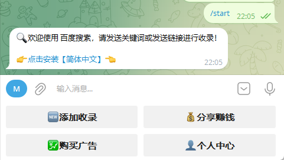

# tio-boot 整合 Telegram-Bot-Utils

[[toc]]

`telegram-bot-utils` 内置了 `TelegramBots` 依赖，使得构建 Telegram 机器人更加便捷。本篇文档将指导您如何使用 `tio-boot` 框架与 `TelegramBots` 库，创建一个简单的“回音机”功能的 Telegram 机器人。

telegram-bot-utils 提供的两个核心类是

- TelegramClientCan
- LongPollingMultiThreadUpdateConsumer

## 入门示例

通过一个简单的示例，展示如何利用 `tio-boot` 和 `TelegramBots` 构建一个基本的 Telegram 机器人。该机器人将实现“回音机”功能，即将用户发送的文本消息原样回传。

### 环境准备

在开始之前，请确保您具备以下条件：

- **Telegram Bot Token**：已通过 [BotFather](https://core.telegram.org/bots#6-botfather) 创建并获取。
- **Java 开发环境**：已配置好相应的 Java 开发环境（建议使用 JDK 17 及以上版本）。
- **项目管理工具**：推荐使用 Maven 或 Gradle 进行依赖管理。
- **必要依赖**：已导入 `telegrambots` 相关依赖（包括 `telegrambots-meta`、`telegrambots`、`telegrambots-spring` 等，根据需求选择）。

### 添加依赖

在您的项目 `pom.xml` 文件中，添加以下依赖项：

```xml
<dependencies>
    <dependency>
      <groupId>com.litongjava</groupId>
      <artifactId>telegram-bot-utils</artifactId>
      <version>1.0.0</version>
    </dependency>
</dependencies>
```

确保在项目中正确导入上述依赖，以便后续代码能够正常编译和运行。

### 核心代码说明

本示例包括以下核心类：

1. [`MyAmazingBot`](#mynamingbot-类)：集成 `LongPollingMultiThreadUpdateConsumer`，负责处理接收到的 `Update`。
2. [`TelegramClientCan`](#telegramclientcan-类)：封装 `TelegramClient` 客户端，用于发送消息。
3. [`TelegramBotConfig`](#telegrambotconfig-类)：负责 Bot 的注册和初始化配置。

`LongPollingMultiThreadUpdateConsumer` 每次执行 `consumeGroup` 或者 `consume` 时都会单独启动一个线程执行。

#### `MyAmazingBot` 类

`MyAmazingBot` 类是 Bot 的核心，实现了 `LongPollingMultiThreadUpdateConsumer` 接口，用于接收和处理 Telegram 服务器推送的更新。

```java
package com.litongjava.telegram.bot.bots;

import java.util.List;

import org.telegram.telegrambots.meta.api.methods.send.SendMessage;
import org.telegram.telegrambots.meta.api.objects.Update;
import org.telegram.telegrambots.meta.api.objects.message.Message;

import com.litongjava.telegram.can.TelegramClientCan;
import com.litongjava.telegram.utils.LongPollingMultiThreadUpdateConsumer;

import lombok.extern.slf4j.Slf4j;

@Slf4j
public class MyAmazingBot extends LongPollingMultiThreadUpdateConsumer {
  @Override
  public void consumeGroup(List<Update> groupUpdates) {

  }

  @Override
  public void consume(Update update) {
    if (update.hasMessage()) {
      Message message = update.getMessage();
      if (message.hasText()) {
        String receivedText = update.getMessage().getText();

        Long chatId = update.getMessage().getChatId();
        log.info("Received text message: {}", receivedText);

        // 创建回发消息对象，将收到的文本原样发送回去
        SendMessage sendMessage = new SendMessage(chatId.toString(), receivedText);

        // 使用 TelegramClient 发送消息
        TelegramClientCan.execute(sendMessage);
      }
    }
  }

}
```

**说明**：

- `consume(Update update)` 方法是接口 `LongPollingMultiThreadUpdateConsumer` 的实现，当有新的更新到来时，框架会自动调用此方法。
- 方法内部首先检查 `Update` 对象是否包含文本消息，如果是，则提取消息内容和聊天 ID。
- 创建 `SendMessage` 对象，将收到的文本原样回传给用户，实现“回音机”功能。
- 最后，通过 `TelegramClientCan.execute(sendMessage)` 方法发送消息。

**说明**：

- `TelegramClientCan` 使用静态成员变量 `main` 存储 `TelegramClient` 实例，方便在项目中任何地方调用。
- `execute` 方法封装了发送消息的逻辑，并处理可能出现的异常。

#### `TelegramBotConfig` 类

`TelegramBotConfig` 类负责 Bot 的注册和初始化配置。

```java
package com.litongjava.gpt.translator.config;

import org.telegram.telegrambots.client.okhttp.OkHttpTelegramClient;
import org.telegram.telegrambots.longpolling.TelegramBotsLongPollingApplication;
import org.telegram.telegrambots.meta.exceptions.TelegramApiException;
import org.telegram.telegrambots.meta.generics.TelegramClient;

import com.litongjava.annotation.AConfiguration;
import com.litongjava.annotation.Initialization;
import com.litongjava.gpt.translator.bots.MyAmazingBot;
import com.litongjava.telegram.can.TelegramClientCan;
import com.litongjava.tio.boot.server.TioBootServer;
import com.litongjava.tio.utils.environment.EnvUtils;

@AConfiguration
public class TelegramBotConfig {

  @Initialization
  public void config() {
    // 从环境变量或配置文件中读取 Bot Token
    String botAuthToken = EnvUtils.getStr("telegram.bot.auth.token");

    // 创建 TelegramBotsLongPollingApplication 实例，用于管理长轮询 Bot 的注册与启动
    TelegramBotsLongPollingApplication botsApplication = new TelegramBotsLongPollingApplication();

    try {
      // 注册自定义 Bot
      botsApplication.registerBot(botAuthToken, new MyAmazingBot());
    } catch (TelegramApiException e) {
      throw new RuntimeException("Failed to register bot:", e);
    }

    // 创建 TelegramClient 实例（使用 OkHttp 实现）
    TelegramClient telegramClient = new OkHttpTelegramClient(botAuthToken);
    TelegramClientCan.main = telegramClient;

    // 在应用关闭时调用 botsApplication 的 close 方法，确保资源正常释放
    HookCan.me().addDestroyMethod(() -> {
      try {
        botsApplication.close();
      } catch (Exception e) {
        throw new RuntimeException("Failed to close botsApplication:", e);
      }
    });
  }
}
```

**说明**：

- 使用注解 `@AConfiguration` 和 `@Initialization` 标识此类为配置类，并在初始化阶段执行 `config()` 方法。
- 从环境变量或配置文件中读取 Telegram Bot 的 Token，确保安全性和灵活性。
- 创建 `TelegramBotsLongPollingApplication` 实例，用于管理长轮询 Bot 的注册与启动。
- 注册自定义的 `MyAmazingBot` 实例。
- 使用 `OkHttpTelegramClient` 创建 `TelegramClient` 实例，并赋值给 `TelegramClientCan.main`，以供发送消息时使用。
- 通过 `HookCan.me().addDestroyMethod` 注册应用关闭时的资源清理逻辑，确保长轮询进程正常停止。

### 运行说明

按照以下步骤运行您的 Telegram Bot：

1. **代码组织**：将上述代码保存至项目的相应位置，确保包路径和类名与代码一致。
2. **配置 Bot Token**：在配置文件或环境变量中设置 `telegram.bot.auth.token`，其值为从 BotFather 获得的实际 Token。例如，在 `application.properties` 中添加：
   ```properties
   telegram.bot.auth.token=YOUR_BOT_TOKEN
   ```
3. **依赖导入**：确保所有必要的依赖已正确导入，并通过 Maven 或 Gradle 进行项目构建。
4. **启动应用**：运行您的 Java 应用。启动后，应用将自动启动长轮询进程，监听 Telegram 服务器的更新。
5. **测试 Bot**：
   - 打开 Telegram，搜索并找到您的 Bot。
   - 向 Bot 发送一条文本消息。
   - 观察日志输出，您应能看到对应的 `Update` 信息。
   - Bot 将原样回传您发送的消息，验证回音功能是否正常工作。

### 常见问题排查

- **Bot 无响应**：
  - 确认 Bot Token 是否正确。
  - 检查网络连接是否正常，确保应用能够访问 Telegram 服务器。
  - 查看日志输出，检查是否有异常信息。
- **消息发送失败**：

  - 确认 `TelegramClientCan.main` 是否已正确初始化。
  - 检查发送消息的格式是否正确，尤其是 `chatId` 和消息内容。

- **应用无法启动**：
  - 检查依赖是否正确导入，版本是否匹配。
  - 确认配置类 `TelegramBotConfig` 是否被正确扫描和加载。

## SendMessageUtils 和 ReplyKeyboardUtils

### BaiduSosoBot 类

以下是一个名为 `StartService` 的示例类，展示了如何使用 `isPrivateChat` 和 `hasCommand` 来处理 用户发送的消息

```java
package com.litongjava.telegram.bot.bots;

import java.util.List;

import org.telegram.telegrambots.meta.api.objects.Update;
import org.telegram.telegrambots.meta.api.objects.message.Message;

import com.litongjava.jfinal.aop.Aop;
import com.litongjava.telegram.bot.services.StartService;
import com.litongjava.telegram.utils.LongPollingMultiThreadUpdateConsumer;

import lombok.extern.slf4j.Slf4j;

@Slf4j
public class BaiduSosoBot extends LongPollingMultiThreadUpdateConsumer {

  @Override
  public void consumeGroup(List<Update> groupUpdates) {
    // 可选：批量处理更新
    for (Update update : groupUpdates) {
      consume(update);
    }
  }

  @Override
  public void consume(Update update) {
    try {
      if (update.hasMessage()) {
        Message message = update.getMessage();
        if (isPrivateChat(message) && hasCommand(message, "/start")) {
          Aop.get(StartService.class).handleStartCommand(message);
        }
      }
    } catch (Exception e) {
      log.error("Error processing update: ", e);
    }
  }
}
```

### StartService 类

`StartService` 类负责处理 `/start` 命令，并使用 `SendMessageUtils` 和 `ReplyKeyboardUtils` 来发送欢迎消息和自定义键盘。

```java
package com.litongjava.telegram.bot.services;

import java.util.ArrayList;
import java.util.List;

import org.telegram.telegrambots.meta.api.methods.send.SendMessage;
import org.telegram.telegrambots.meta.api.objects.User;
import org.telegram.telegrambots.meta.api.objects.message.Message;
import org.telegram.telegrambots.meta.api.objects.replykeyboard.ReplyKeyboardMarkup;
import org.telegram.telegrambots.meta.api.objects.replykeyboard.buttons.KeyboardButton;
import org.telegram.telegrambots.meta.api.objects.replykeyboard.buttons.KeyboardRow;

import com.litongjava.telegram.can.TelegramClientCan;
import com.litongjava.telegram.utils.ReplyKeyboardUtils;
import com.litongjava.telegram.utils.SendMessageUtils;

public class StartService {
  private static final ReplyKeyboardMarkup HOME_MARKUP = createHomeMarkup();

  /**
   * 创建主页键盘
   */
  private static ReplyKeyboardMarkup createHomeMarkup() {
    List<KeyboardRow> keyboard = new ArrayList<>();

    KeyboardRow row1 = new KeyboardRow();
    row1.add(new KeyboardButton("🆕 添加收录"));
    row1.add(new KeyboardButton("💰 分享赚钱"));

    KeyboardRow row2 = new KeyboardRow();
    row2.add(new KeyboardButton("💹 购买广告"));
    row2.add(new KeyboardButton("👤 个人中心"));

    keyboard.add(row1);
    keyboard.add(row2);

    ReplyKeyboardMarkup markup = ReplyKeyboardUtils.build(keyboard);
    markup.setResizeKeyboard(true);
    markup.setOneTimeKeyboard(false);
    markup.setSelective(false);
    return markup;
  }

  /**
   * 处理 /start 命令
   */
  public void handleStartCommand(Message message) {
    User fromUser = message.getFrom();
    Long tgId = fromUser.getId().longValue();

    String retMessage = "🔍 欢迎使用百度搜索，请发送关键词或发送链接进行收录！\n\n👉<a href=\"https://t.me/setlanguage/zhcncc\">点击安装【简体中文】</a>👈";

    // 发送欢迎消息给用户
    SendMessage sendMessage = SendMessageUtils.text(tgId, retMessage);
    sendMessage.setReplyMarkup(HOME_MARKUP);
    sendMessage.enableHtml(true);
    TelegramClientCan.execute(sendMessage);
  }
}
```

### 功能展示

以下是机器人发送的欢迎消息界面：



## 详细说明

### BaiduSosoBot 类解析

`BaiduSosoBot` 类继承自 `LongPollingMultiThreadUpdateConsumer`，负责接收并处理来自 Telegram 的更新。主要功能包括：

- **consumeGroup**: 可选的方法，用于批量处理一组更新。
- **consume**: 处理单个更新，如果消息来自私聊且包含 `/start` 命令，则调用 `StartService` 处理该命令。

### StartService 类解析

`StartService` 类负责处理 `/start` 命令，具体步骤如下：

1. **创建主页键盘**: 使用 `ReplyKeyboardUtils` 构建自定义键盘布局，包括“添加收录”、“分享赚钱”、“购买广告”和“个人中心”四个按钮。
2. **发送欢迎消息**: 利用 `SendMessageUtils` 发送带有自定义键盘的欢迎消息，并启用 HTML 格式以支持链接。

### 工具类介绍

- **SendMessageUtils**: 简化发送消息的操作，提供便捷的方法创建 `SendMessage` 对象。
- **ReplyKeyboardUtils**: 简化自定义键盘的创建和配置，提供便捷的方法构建 `ReplyKeyboardMarkup` 对象。

## 总结

本文介绍了如何使用 Telegram-Bot-Utils 提供的 `SendMessageUtils` 和 `ReplyKeyboardUtils` 工具类，通过示例代码展示了如何创建自定义键盘并发送带有键盘的欢迎消息。借助这些工具类，可以更高效地开发功能丰富的 Telegram 机器人。
