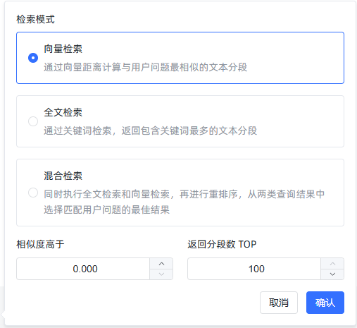
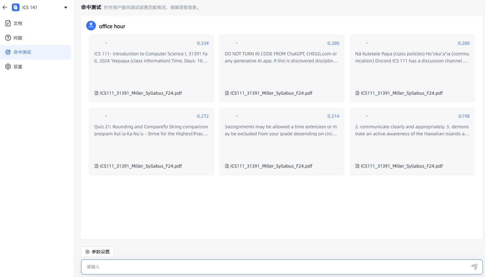

# 命中率测试

本节介绍如何对文本数据集进行命中率测试，以计算用户查询和数据库中存储的文本分段之间的相似度。我们已经完成数据库设计、用户登录、知识库管理、文件拆分和片段向量化功能。接下来，将通过实现命中率测试功能，为用户提供最相似的文本分段。

## 接口文档

- 请求方式：GET
- 请求 URL：`http://localhost:3000/api/dataset/{dataset_id}/hit_test`
- 参数说明：
  - `query_text`：查询文本，例如"office hour"
  - `similarity`：相似度阈值，默认为 0
  - `top_number`：返回的文本分段数目上限，默认为 100
  - `search_mode`：搜索模式，支持三种模式：
    - `embedding`：基于向量距离计算相似度，返回与用户问题最相关的文本分段。
    - `fulltext`：全文关键词搜索，返回包含最多相关关键词的文本分段。
    - `mixed`：同时执行全文搜索和向量检索，再进行重排序。

### 示例请求和响应

请求示例：

```http
GET http://localhost:3000/api/dataset/443309276048408576/hit_test?query_text=office+hour&similarity=0&top_number=100&search_mode=embedding
```

响应示例：

```json
{
  "code": 200,
  "message": "成功",
  "data": [
    {
      "document_name": "ICS111_31391_Miller_Syllabus_F24.pdf",
      "dataset_name": "CHEM 161",
      "similarity": 0.8021859166400532,
      "comprehensive_score": 0.8021859166400532
    }
  ]
}
```

---

## SQL 解释

### SQL 查询分析

在 `kb.sql` 文件中，包含了名为 `kb.hit_test_by_dataset_id` 的查询语句，目的是根据数据集 ID 执行相似度命中率测试。以下是 SQL 代码及其解释：

```sql
--# kb.hit_test_by_dataset_id
SELECT
  sub.document_name,
  sub.dataset_name,
  sub.create_time,
  sub.update_time,
  sub.id,
  sub.content,
  sub.title,
  sub.status,
  sub.hit_num,
  sub.is_active,
  sub.dataset_id,
  sub.document_id,
  sub.similarity,
  sub.similarity AS comprehensive_score
FROM (
  SELECT
    d.name AS document_name,
    ds.name AS dataset_name,
    p.create_time,
    p.update_time,
    p.id,
    p.content,
    p.title,
    p.status,
    p.hit_num,
    p.is_active,
    p.dataset_id,
    p.document_id,
    (1 - (p.embedding <=> ?::vector)) AS similarity
  FROM
    max_kb_paragraph p
  JOIN
    max_kb_document d ON p.document_id = d.id
  JOIN
    max_kb_dataset ds ON p.dataset_id = ds.id
  WHERE
    p.is_active = TRUE
    AND p.deleted = 0
    AND ds.deleted = 0
    AND p.dataset_id = ?
) sub
WHERE
  sub.similarity > ?
ORDER BY
  sub.similarity DESC
LIMIT ?;
```

### SQL 解释

1. **嵌套查询**：主查询从嵌套查询 `sub` 中选择符合条件的分段。
2. **嵌套查询内部**：
   - `max_kb_paragraph` 表存储了文本分段数据，包括每个段落的向量化表示 `embedding`。
   - `max_kb_document` 表和 `max_kb_dataset` 表分别存储文档和数据集的信息。
   - `embedding <=> ?::vector` 表示向量距离计算，其中 `?` 是占位符，表示用户查询向量。PostgreSQL 中的 `<=>` 操作符用于计算两向量的余弦距离，结果的范围在 `[0, 1]` 之间。
3. **相似度计算**：
   - `1 - (p.embedding <=> ?::vector)` 用于将距离转换为相似度。距离越小，相似度越高。
   - 结果按相似度降序排列，并只返回 `top_number` 个结果。

---

## 相似度计算算法

- **余弦相似度**：通过 `1 - (p.embedding <=> ?::vector)` 计算。余弦相似度用于衡量两个向量之间的夹角。相似度值在 0 到 1 之间，1 表示完全相似，0 表示完全不相似。
- **向量化查询**：基于查询文本 `query_text` 生成向量。通过模型名称和查询文本，使用特定向量化模型生成查询的向量表示。
- **阈值过滤**：相似度结果根据用户设定的阈值 `similarity` 进行过滤，只返回相似度高于该阈值的结果。

---

## 后端实现代码说明

### `MaxKbDatasetServiceHitTest` 类

`MaxKbDatasetServiceHitTest` 类包含 `hitTest` 方法，用于处理命中率测试请求。

```java
public ResultVo hitTest(Long userId, Long datasetId, String query_text, Double similarity, Integer top_number, String search_mode) {
  if ("embedding".equals(search_mode)) {
    MaxKbDatasetDao datasetDao = Aop.get(MaxKbDatasetDao.class);
    TableResult<Record> datasetResult = datasetDao.get(userId, datasetId);
    Record dataset = datasetResult.getData();
    Long embeddingModeId = dataset.getLong("embedding_mode_id");

    // 获取模型名称
    String modelName = Db.queryStr(String.format("SELECT model_name FROM %s WHERE id = ?", TableNames.max_kb_model), embeddingModeId);

    // 获取查询向量
    String sql = SqlTemplates.get("kb.hit_test_by_dataset_id");
    PGobject vector = Aop.get(MaxKbEmbeddingService.class).getVector(query_text, modelName);
    List<Record> records = Db.find(sql, vector.getValue(), datasetId, similarity, top_number);
    List<Kv> kvs = RecordUtils.recordsToKv(records, false);
    return ResultVo.ok(kvs);
  }
  return null;
}
```

### `hitTest` 方法说明

1. **数据集信息获取**：从数据库中检索数据集信息，并获取用于向量化的模型名称。
2. **向量生成**：通过 `MaxKbEmbeddingService` 生成查询文本的向量表示。
3. **数据库查询**：使用 `SqlTemplates.get` 获取 SQL 语句，调用数据库执行查询。
4. **结果转换**：将查询结果转换为 `Kv` 格式，并返回响应对象。

### AapiDatasetController

```java
package com.litongjava.maxkb.controller;

import java.util.List;

import com.litongjava.annotation.Delete;
import com.litongjava.annotation.Get;
import com.litongjava.annotation.Post;
import com.litongjava.annotation.RequestPath;
import com.litongjava.jfinal.aop.Aop;
import com.litongjava.maxkb.model.DocumentBatchVo;
import com.litongjava.maxkb.model.KbDatasetModel;
import com.litongjava.maxkb.service.DatasetDocumentVectorService;
import com.litongjava.maxkb.service.MaxKbDatasetService;
import com.litongjava.maxkb.service.MaxKbDatasetServiceHitTest;
import com.litongjava.maxkb.service.MaxKbDocumentService;
import com.litongjava.model.result.ResultVo;
import com.litongjava.tio.boot.http.TioRequestContext;
import com.litongjava.tio.http.common.HttpRequest;
import com.litongjava.tio.utils.json.JsonUtils;

@RequestPath("/api/dataset")
public class AapiDatasetController {

  @Get("/{id}/hit_test")
  public ResultVo hitTest(Long id, HttpRequest request) {
    String query_text = request.getParam("query_text");
    Double similarity = request.getDouble("similarity");
    Integer top_number = request.getInt("top_number");
    String search_mode = request.getParam("search_mode");
    Long userId = TioRequestContext.getUserIdLong();
    return Aop.get(MaxKbDatasetServiceHitTest.class).hitTest(userId, id, query_text, similarity, top_number, search_mode);
  }
}
```

## 测试截图




至此,向量的相似度计算功能已经完成
