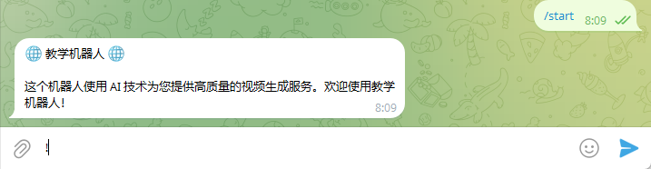
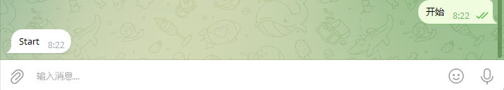

# s 使用 工具库 telegram-bot-base 开发翻译机器人

本文档旨在帮助开发者了解如何利用基于 telegram-bots 封装的工具类库 **telegram-bot-base** 快速开发 Telegram Bot 应用。文档内容分为以下几个部分：

1. Maven 坐标配置
2. 利用工具库获取 chat_id
3. 发送 Markdown 格式消息
4. 开发翻译机器人

每个部分均包含对应的代码示例和详细说明。

---

## Maven 坐标

在您的 Maven 工程中引入所需依赖，可以使用以下配置。其中除了日志记录和 JSON 处理的依赖外，核心依赖即为 **telegram-bot-base**。

```xml
<dependency>
  <groupId>com.litongjava</groupId>
  <artifactId>tio-boot-admin</artifactId>
  <version>1.0.0</version>
</dependency>
<dependency>
  <groupId>com.litongjava</groupId>
  <artifactId>telegram-bot-base</artifactId>
  <version>1.0.0</version>
</dependency>
<dependency>
  <groupId>ch.qos.logback</groupId>
  <artifactId>logback-classic</artifactId>
  <version>1.4.12</version>
</dependency>
<!-- Jackson Core 库，用于 JSON 处理 -->
<dependency>
  <groupId>com.fasterxml.jackson.core</groupId>
  <artifactId>jackson-core</artifactId>
  <version>2.17.2</version>
</dependency>
```

> **说明**  
> 上述依赖中，`telegram-bot-base` 是基于 telegram-bots 封装的工具库，提供了常用操作的简单封装，降低了开发复杂度。

---

## 基础

### 整合 TioBoot

### .env

tio-boot 启动时会自动加载根目录下面的.env 文件

```
GEMINI_API_KEY=
telegram.bot.token=
telegram.bot.webhook=https://max-translator.fly.dev/telegram/webhook
```

#### TelegramBotConfig

```java
package com.litongjava.manim.config;

import org.telegram.telegrambots.longpolling.TelegramBotsLongPollingApplication;
import org.telegram.telegrambots.meta.exceptions.TelegramApiException;

import com.litongjava.annotation.AConfiguration;
import com.litongjava.annotation.Initialization;
import com.litongjava.hook.HookCan;
import com.litongjava.manim.bots.MyAmazingBot;
import com.litongjava.tio.utils.environment.EnvUtils;

@AConfiguration
public class TelegramBotConfig {

  @Initialization
  public void config() {
    //非生产环境使用长轮询,生产环境使用WebHook模式
    if(!EnvUtils.isProd()) {
      // 在此填写您的 Bot Token
      String botAuthToken = EnvUtils.getStr("telegram.bot.token");
      // 创建TelegramBotsLongPollingApplication实例，用于管理长轮询Bot的注册与启动
      TelegramBotsLongPollingApplication botsApplication = new TelegramBotsLongPollingApplication();

      try {
        // 注册自定义Bot
        MyAmazingBot updatesConsumer = new MyAmazingBot();
        botsApplication.registerBot(botAuthToken, updatesConsumer);
      } catch (TelegramApiException e) {
        e.printStackTrace();
      }

      // 在应用关闭时调用botsApplication的close方法
      HookCan.me().addDestroyMethod(() -> {
        try {
          botsApplication.unregisterBot(botAuthToken);
          botsApplication.close();
        } catch (Exception e) {
          e.printStackTrace();
        }
      });
    }

  }
}
```

#### TelegramClientConfig

```java
package com.litongjava.manim.config;

import org.telegram.telegrambots.client.okhttp.OkHttpTelegramClient;
import org.telegram.telegrambots.meta.generics.TelegramClient;

import com.litongjava.annotation.AConfiguration;
import com.litongjava.annotation.Initialization;
import com.litongjava.telegram.can.TelegramClientCan;
import com.litongjava.tio.utils.environment.EnvUtils;

@AConfiguration
public class TelegramClientConfig {

  @Initialization
  public void config() {
    // 创建TelegramClient实例（使用OkHttp实现）
    String botAuthToken = EnvUtils.getStr("telegram.bot.token");
    TelegramClient telegramClient = new OkHttpTelegramClient(botAuthToken);
    TelegramClientCan.main = telegramClient;
  }
}

```

#### MyAmazingBot

```java
package com.litongjava.manim.bots;

import java.util.List;

import org.telegram.telegrambots.meta.api.methods.send.SendMessage;
import org.telegram.telegrambots.meta.api.objects.Update;

import com.litongjava.jfinal.aop.Aop;
import com.litongjava.telegram.bot.service.GetChatIdService;
import com.litongjava.telegram.can.TelegramClientCan;
import com.litongjava.telegram.utils.LongPollingMultiThreadUpdateConsumer;

import lombok.extern.slf4j.Slf4j;

@Slf4j
public class MyAmazingBot extends LongPollingMultiThreadUpdateConsumer {
  @Override
  public void consume(Update update) {
    if (update.hasMessage() && update.getMessage().hasText()) {
      String receivedText = update.getMessage().getText();
      Long chatId = update.getMessage().getChatId();
      log.info("Received text message: {}", receivedText);

      // 根据指令进行路由分发
      if ("/get_chat_id".equals(receivedText)) {
        Aop.get(GetChatIdService.class).index(update);
      } else {
        // 默认将接收文本原样回发
        SendMessage sendMessage = new SendMessage(chatId.toString(), receivedText);
        TelegramClientCan.execute(sendMessage);
      }
    }
  }

  @Override
  public void consumeGroup(List<Update> arg0) {
    for (Update update : arg0) {
      this.consume(update);
    }
  }
}
```

#### GetChatIdService 使用工具库获取 chat_id

以下代码示例展示了如何通过工具库获取更新中的 `chat_id`，并将该信息通过消息回复给用户。此过程适用于私聊和频道消息。

```java
package com.litongjava.gpt.translator.bots;

import org.telegram.telegrambots.meta.api.methods.send.SendMessage;
import org.telegram.telegrambots.meta.api.objects.Update;
import org.telegram.telegrambots.meta.api.objects.chat.Chat;
import com.litongjava.telegram.utils.TelegramClientCan;

public class GetChatIdService {

  public void index(Update update) {
    Chat chat = null;
    if (update.hasMessage()) {
      chat = update.getMessage().getChat();
    } else if (update.hasChannelPost()) {
      chat = update.getChannelPost().getChat();
    }

    // 获取 chat_id（数据已脱敏）
    Long chatId = chat.getId();

    // 创建回发消息对象，将 chat_id 信息原样返回
    SendMessage sendMessage = new SendMessage(chatId.toString(), chatId.toString());
    // 使用 TelegramClient 发送消息
    TelegramClientCan.execute(sendMessage);
  }
}
```

> **关键点说明**
>
> - 通过 `update.hasMessage()` 与 `update.hasChannelPost()` 判断消息来源；
> - 从 `chat` 对象中获取 chat_id，然后原样返回（可根据需要进行其他业务处理）。

---

### 发送 Markdown 格式数据

工具库中提供了便捷的方法，帮助开发者发送支持 Markdown 语法的消息。下面示例展示了如何结合 AOP（面向切面编程）实现基于命令的消息路由与回复，支持 `/get_chat_id`、`/start`、`/about` 等指令。

#### 核心 Bot 类

```java
package com.litongjava.manim.bots;

import java.util.List;

import org.telegram.telegrambots.meta.api.methods.send.SendMessage;
import org.telegram.telegrambots.meta.api.objects.Update;

import com.litongjava.jfinal.aop.Aop;
import com.litongjava.manim.services.StartService;
import com.litongjava.telegram.bot.service.GetChatIdService;
import com.litongjava.telegram.can.TelegramClientCan;
import com.litongjava.telegram.utils.LongPollingMultiThreadUpdateConsumer;

import lombok.extern.slf4j.Slf4j;

@Slf4j
public class MyAmazingBot extends LongPollingMultiThreadUpdateConsumer {
  @Override
  public void consume(Update update) {
    if (update.hasMessage() && update.getMessage().hasText()) {
      String receivedText = update.getMessage().getText();
      Long chatId = update.getMessage().getChatId();
      log.info("Received text message: {}", receivedText);

      // 根据指令进行路由分发
      if ("/get_chat_id".equals(receivedText)) {
        Aop.get(GetChatIdService.class).index(update);
      } else if ("/start".equals(receivedText)) {
        Aop.get(StartService.class).index(update);
      } else if ("/about".equals(receivedText)) {
        Aop.get(StartService.class).about(update);
      } else {
        // 默认将接收文本原样回发
        SendMessage sendMessage = new SendMessage(chatId.toString(), receivedText);
        TelegramClientCan.execute(sendMessage);
      }
    }
  }

  @Override
  public void consumeGroup(List<Update> arg0) {
    for (Update update : arg0) {
      this.consume(update);
    }
  }
}
```

#### StartService 类

此类主要用于处理 `/start` 与 `/about` 指令，通过封装方法发送 Markdown 格式的消息。

```java
package com.litongjava.manim.services;

import org.telegram.telegrambots.meta.api.methods.send.SendMessage;
import org.telegram.telegrambots.meta.api.objects.Update;

import com.litongjava.telegram.can.TelegramClientCan;
import com.litongjava.telegram.utils.SendMessageUtils;

public class StartService {

  public void index(Update update) {
    Long chatId = update.getMessage().getChatId();
    String welcomeMessage = "🌐 **教学机器人** 🌐\n\n" + "这个机器人使用 AI 技术为您提供高质量的视频生成服务。欢迎使用教学机器人！\n\n";
    // 通过工具库生成 Markdown 格式的消息
    SendMessage markdown = SendMessageUtils.markdown(chatId, welcomeMessage);
    TelegramClientCan.execute(markdown);
  }

  public void about(Update update) {
    Long chatId = update.getMessage().getChatId();
    String aboutMessage = "**开发者:** Litong Java\n" + "**版本:** 1.0.0\n\n" + "感谢您使用本机器人！";
    SendMessage markdown = SendMessageUtils.markdown(chatId, aboutMessage);
    TelegramClientCan.execute(markdown);
  }
}
```

> **亮点说明**
>
> - 利用 `SendMessageUtils.markdown` 方法快速构造支持 Markdown 语法的消息内容；
> - 使用 AOP 框架调用 `GetChatIdService` 与 `StartService`，实现业务逻辑模块化，降低耦合度。

---

#### 显示效果



## 开发翻译机器人

下面的示例展示了如何基于工具库和 tio-boot 架构，开发一个支持文本翻译功能的 Telegram Bot。其主要逻辑为：

- 当接收到非预定义指令的文本消息后，判断消息来源（仅针对私聊生效）；
- 根据文本内容判断源语言和目标语言（例如包含中文则视为中译英，否则英译中）；
- 调用翻译服务，并将返回的翻译结果以 Markdown 格式回复用户。

### 提示词

translator_prompt.txt

```txt
You are a helpful translator.
- Please translate the following #(src_lang) into #(dst_lang).
- Preserve the format of the source content during translation.
- Do not provide any explanations or text apart from the translation.
- Only output the translated text

text:#(source_text)

translated text:

```

### 核心 Bot 类（私聊消息路由）

```java
package com.litongjava.manim.bots;

import java.util.List;

import org.telegram.telegrambots.meta.api.objects.Update;

import com.litongjava.jfinal.aop.Aop;
import com.litongjava.manim.services.BotMessageDispatherService;
import com.litongjava.manim.services.StartService;
import com.litongjava.telegram.bot.service.GetChatIdService;
import com.litongjava.telegram.utils.ChatType;
import com.litongjava.telegram.utils.LongPollingMultiThreadUpdateConsumer;

import lombok.extern.slf4j.Slf4j;

@Slf4j
public class MyAmazingBot extends LongPollingMultiThreadUpdateConsumer {
  @Override
  public void consume(Update update) {
    if (update.hasMessage() && update.getMessage().hasText()) {
      String receivedText = update.getMessage().getText();
      log.info("Received text message: {}", receivedText);

      // 根据指令进行路由分发
      if ("/get_chat_id".equals(receivedText)) {
        Aop.get(GetChatIdService.class).index(update);
      } else if ("/start".equals(receivedText)) {
        Aop.get(StartService.class).index(update);
      } else if ("/about".equals(receivedText)) {
        Aop.get(StartService.class).about(update);
      } else {
        // 仅当消息来源为私聊时，调用翻译服务处理文本
        if (update.getMessage().getChat().getType().equals(ChatType.chat_private)) {
          Aop.get(BotMessageDispatherService.class).index(update);
        }
      }
    }
  }

  @Override
  public void consumeGroup(List<Update> arg0) {
    for (Update update : arg0) {
      this.consume(update);
    }
  }
}
```

### BotMessageDispatherService

```java
package com.litongjava.manim.services;

import org.telegram.telegrambots.meta.api.objects.Update;

import com.litongjava.jfinal.aop.Aop;

public class BotMessageDispatherService {

  public void index(Update update) {
    Aop.get(BotTranslateService.class).index(update);
  }
}

```

### BotTranslateService 类

此类主要负责翻译文本内容，并将翻译结果以 Markdown 格式发送回用户，主要步骤如下：

1. 获取消息文本与 chat 信息。
2. 根据文本判断源语言和目标语言（例如：包含中文则源语言为中文，目标语言为英文；否则反之）。
3. 创建翻译请求对象，并调用翻译服务（通过 AOP 获取 TranslatorService 的实例）。
4. 捕获异常（若翻译服务出现异常，则返回错误信息）。
5. 使用 `SendMessageUtils.markdown` 构造 Markdown 消息，最后调用 TelegramClient 发送消息。

```java
package com.litongjava.manim.services;

import org.telegram.telegrambots.meta.api.methods.send.SendMessage;
import org.telegram.telegrambots.meta.api.objects.Update;
import org.telegram.telegrambots.meta.api.objects.chat.Chat;

import com.litongjava.jfinal.aop.Aop;
import com.litongjava.manim.vo.TranslatorTextVo;
import com.litongjava.telegram.can.TelegramClientCan;
import com.litongjava.telegram.utils.SendMessageUtils;

import lombok.extern.slf4j.Slf4j;

@Slf4j
public class BotTranslateService {

  public void index(Update update) {
    String text = update.getMessage().getText();
    Chat chat = update.getMessage().getChat();
    Long chatIdLong = chat.getId();

    // 根据文本内容判断语言方向
    String srcLang;
    String destLang;
    if (containsChinese(text)) {
      srcLang = "Chinese";
      destLang = "English";
    } else {
      srcLang = "English";
      destLang = "Chinese";
    }

    // 构造翻译请求对象
    TranslatorTextVo translatorTextVo = new TranslatorTextVo();
    translatorTextVo.setSrcText(text);
    translatorTextVo.setSrcLang(srcLang);
    translatorTextVo.setDestLang(destLang);

    String responseText;
    try {
      // 调用翻译服务获取翻译结果
      responseText = Aop.get(TranslatorService.class).translate(chatIdLong.toString(), translatorTextVo);
    } catch (Exception e) {
      log.error("Exception", e);
      responseText = "Exception: " + e.getMessage();
    }

    // 构造 Markdown 格式的消息，将翻译结果发送回用户
    SendMessage markdown = SendMessageUtils.markdown(chatIdLong, responseText);
    TelegramClientCan.execute(markdown);
  }

  /**
   * 判断输入文本是否包含中文字符
   *
   * @param text 输入的文本
   * @return 若包含中文字符，返回 true；否则返回 false
   */
  private boolean containsChinese(String text) {
    if (text == null || text.isEmpty()) {
      return false;
    }
    // 使用正则表达式判断是否含有中文字符
    return text.matches(".*[\\u4e00-\\u9fa5]+.*");
  }
}
```

> **注意事项**
>
> - 翻译服务部分（`TranslatorService`）应在您的项目中实现具体调用逻辑，本文仅展示调用接口过程；
> - AOP 框架用于动态获取各服务类实例，保证代码模块之间的低耦合；
> - 文本语言判断采用正则表达式检测中文字符，根据实际需求可扩展更多语言支持。

---

```java
package com.litongjava.manim.services;

import java.util.HashMap;
import java.util.Map;

import com.jfinal.template.Template;
import com.litongjava.gemini.GeminiClient;
import com.litongjava.gemini.GoogleGeminiModels;
import com.litongjava.manim.vo.TranslatorTextVo;
import com.litongjava.template.PromptEngine;

public class TranslatorService {

  public String translate(TranslatorTextVo translatorTextVo) {
    String srcLang = translatorTextVo.getSrcLang();
    String destLang = translatorTextVo.getDestLang();
    String srcText = translatorTextVo.getSrcText();

    Template template = PromptEngine.getTemplate("translator_prompt.txt");
    Map<String, String> values = new HashMap<>();

    values.put("src_lang", srcLang);
    values.put("dst_lang", destLang);
    values.put("source_text", srcText);

    String prompt = template.renderToString(values);
    String response = GeminiClient.chatWithModel(GoogleGeminiModels.GEMINI_2_0_FLASH_EXP, "user", prompt);
    return response;
  }

  public String translate(String chatId, TranslatorTextVo translatorTextVo) {
    return this.translate(translatorTextVo);
  }
}
```

### 显示效果



### 使用 WebHook 模式

开发环境使用成轮询模式,生产环境使用 WebHook 模式

## 总结

本文档详细介绍了 **telegram-bot-base** 工具库的 Maven 坐标、常用功能以及典型使用场景。通过以下几部分，您能够快速实现：

- **获取 chat_id**：根据消息来源解析聊天对象，并回发其 id 信息；
- **发送 Markdown 数据**：利用工具方法构造支持 Markdown 格式的消息回复；
- **开发翻译机器人**：对私聊消息进行语言判断、调用翻译服务，并将翻译结果以优雅的格式返回给用户。

以上示例均对关键数据进行了脱敏处理，保证应用开发中的数据安全。您可以在此基础上，根据具体需求扩展更多功能，例如接入更多翻译引擎、支持其他消息类型或实现复杂的业务逻辑。

希望本指南能为您快速构建高效、可靠的 Telegram Bot 应用提供有力支持。
