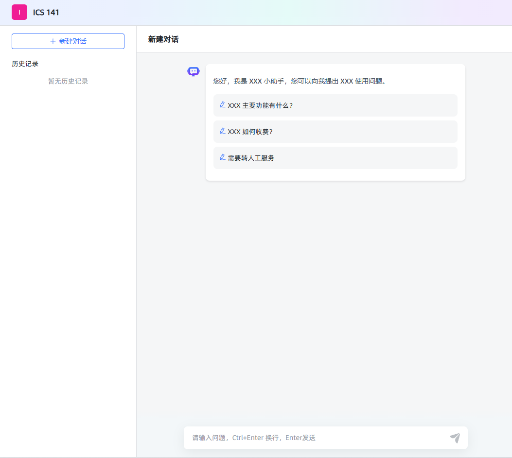

# 对话问答

## api 接口

### 基本接口

打开问答页面例如http://127.0.0.1:3000/ui/chat/abe8055668fb480f会发送下面的请求和得到下面的响应


#### profile

GET /api/profile

```json
{
  "code": 200,
  "message": "成功",
  "data": {
    "version": "v1.7.0 (build at 2024-10-31T12:49, commit: 44b3aed5)",
    "IS_XPACK": false,
    "XPACK_LICENSE_IS_VALID": false
  }
}
```

#### authentication

验证前端传递的 token 是否合法
POST /api/application/authentication

```json
{ "access_token": "abe8055668fb480f" }
```

```json
{
  "code": 200,
  "message": "成功",
  "data": "eyJhcHBsaWNhdGlvbl9pZCI6Ijc3NzNiNjY4LTlmM2QtMTFlZi04MjI0LTAyNDJhYzExMDAwNSIsInVzZXJfaWQiOiJmMGRkOGY3MS1lNGVlLTExZWUtOGM4NC1hOGExNTk1ODAxYWIiLCJhY2Nlc3NfdG9rZW4iOiJhYmU4MDU1NjY4ZmI0ODBmIiwidHlwZSI6IkFQUExJQ0FUSU9OX0FDQ0VTU19UT0tFTiIsImNsaWVudF9pZCI6ImIyMTJiMDJjLWQ2MGEtMTFlZi04NjVhLTAyNDJhYzExMDAwNSIsImF1dGhlbnRpY2F0aW9uIjp7fX0:1tZKmf:fkqrwQpjDRRs9-vHnhT7RKOKcRwTGwz3Yi6NC7xucHM"
}
```

1.浏览器在 local storage 中存储的 accessToken 用户 chat 页面聊天 2.浏览器在 local storage 中存储的 token 后台管理页面

## profile

获取应用的信息
GET /api/application/profile
authorization:{上面获取的 token}

```json
{
  "code": 200,
  "message": "成功",
  "data": {
    "id": "7773b668-9f3d-11ef-8224-0242ac110005",
    "name": "ICS 141",
    "desc": "ics 141 课程助手",
    "prologue": "您好，我是 XXX 小助手，您可以向我提出 XXX 使用问题。\n- XXX 主要功能有什么？\n- XXX 如何收费？\n- 需要转人工服务",
    "dialogue_number": 1,
    "icon": "/ui/favicon.ico",
    "type": "SIMPLE",
    "stt_model_id": null,
    "tts_model_id": null,
    "stt_model_enable": false,
    "tts_model_enable": false,
    "tts_type": "BROWSER",
    "work_flow": {},
    "show_source": false,
    "multiple_rounds_dialogue": true
  }
}
```

GET /api/application/7773b668-9f3d-11ef-8224-0242ac110005/chat/client/1/20

```json
{
  "code": 200,
  "message": "成功",
  "data": {
    "total": 0,
    "records": [],
    "current": 1,
    "size": 20
  }
}
```

### 开启回话

客户端调用 GET /api/application/{application_id}/chat/open 接口时，服务端为此次会话生成了一个新的会话标识（这里返回的是 chat_id，如 "c2c9530c-d60b-11ef-865a-0242ac110005"）。此时，虽然主要返回的是会话 ID，但服务端内部可能已经初始化了与该会话关联的各类信息，包括生成一个唯一的客户端标识。

get /api/application/7773b668-9f3d-11ef-8224-0242ac110005/chat/open

```
{
  "code": 200,
  "message": "成功",
  "data": "c2c9530c-d60b-11ef-865a-0242ac110005"
}
```

### 问答

POST /api/application/chat_message/c2c9530c-d60b-11ef-865a-0242ac110005

```
{"message":"when is the office hours","re_chat":false,"form_data":{}}
```

response event response 和项目的相同

get /api/application/7773b668-9f3d-11ef-8224-0242ac110005/chat/client/1/20

```json
{
  "code": 200,
  "message": "成功",
  "data": {
    "total": 1,
    "records": [
      {
        "id": "c2c9530c-d60b-11ef-865a-0242ac110005",
        "application_id": "7773b668-9f3d-11ef-8224-0242ac110005",
        "abstract": "when is the office hours",
        "client_id": "b212b02c-d60a-11ef-865a-0242ac110005"
      }
    ],
    "current": 1,
    "size": 20
  }
}
```

## 开发接口

### InterceptorConfiguration

InterceptorConfiguration 开放/api/profile

```java
package com.litongjava.maxkb.config;

import com.litongjava.annotation.AConfiguration;
import com.litongjava.annotation.Initialization;
import com.litongjava.maxkb.inteceptor.AuthInterceptor;
import com.litongjava.tio.boot.http.interceptor.HttpInteceptorConfigure;
import com.litongjava.tio.boot.http.interceptor.HttpInterceptorModel;
import com.litongjava.tio.boot.server.TioBootServer;

@AConfiguration
public class InterceptorConfiguration {

  @Initialization
  public void config() {
    AuthInterceptor authTokenInterceptor = new AuthInterceptor();
    HttpInterceptorModel model = new HttpInterceptorModel();
    model.setInterceptor(authTokenInterceptor);

    model.addBlockUrl("/**");

    model.addAllowUrls("", "/");
    model.addAllowUrls("/ui/**");
    model.addAllowUrls("/register/*", "/api/login/account", "/api/login/outLogin", "/api/user/login");
    model.addAllowUrl("/sse");

    model.addAllowUrls("/api/application/chat_message/*", "/api/profile","/api/application/authentication");

    HttpInteceptorConfigure configure = new HttpInteceptorConfigure();
    configure.add(model);

    TioBootServer.me().setHttpInteceptorConfigure(configure);
  }
}
```
