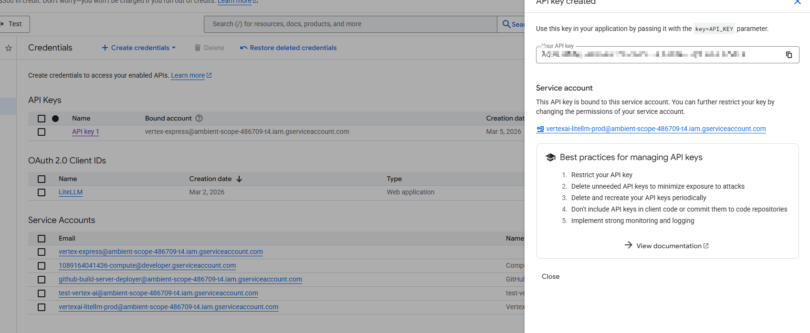

# google Vertex AI 接入
[[toc]]

## service account 到 API Key 的转换与 `java-openai` 使用说明

在 Google Cloud 生态中，**Vertex AI 默认更偏向使用 Service Account 进行认证**。
但在当前 `java-openai` 的统一调用体系里，**暂不直接支持 Service Account 认证流程**，因此在接入 Vertex AI 时，推荐的做法是：

**先在 Google Cloud 中为对应服务账号创建 API Key，再通过 API Key 的方式调用 Vertex AI 提供的 Gemini 模型接口。**

这意味着，虽然底层目标平台是 Vertex AI，但在业务侧依然可以继续使用 `java-openai` 的统一抽象：

* 使用 `UniChatRequest` 组织请求
* 使用 `UniChatClient` 发起调用
* 使用 `UniChatResponse` 获取结果

从而保持与前文 OpenAI / Gemini / Claude / OpenRouter 等平台一致的开发体验。

---

## 一、背景说明

在实际工程中，Google 的大模型能力有两种常见接入路径：

### 1. Google AI / Gemini API

更偏向通用 API Key 模式，调用方式相对轻量。

### 2. Vertex AI

更偏向 Google Cloud 企业体系，通常与以下能力一起使用：

* Google Cloud Project
* IAM 权限体系
* Service Account
* 区域化部署与企业治理
* 更完整的云资源管理能力

对于 Java 工程集成来说，如果你的业务已经运行在 Google Cloud 环境中，或者需要与现有的 GCP 权限体系结合，那么 Vertex AI 会是一个很自然的选择。

但当前 `java-openai` **默认不是走 Google Cloud Service Account 签名认证链路**，因此需要把认证方式切换为：

**Service Account 绑定的 API Key 调用模式。**

---

## 二、为什么需要把 Service Account 转成 API Key

`java-openai` 的统一调用模型，本质上是围绕“平台标识 + 模型标识 + API Key”展开的。
例如：

* OpenAI → `apiKey`
* OpenRouter → `apiKey`
* Google Gemini → `apiKey`
* Vertex AI（当前在 `java-openai` 中）→ 也通过 `apiKey` 方式接入

因此，当目标平台是 Vertex AI 时，如果你手上只有 Service Account，而没有 API Key，那么当前无法直接通过 `java-openai` 使用它。

所以需要先完成这一步：

> **为对应的 Google Cloud 服务账号创建 API Key，并在请求中通过 `key=API_KEY` 参数传递。**

---

## 三、控制台操作说明

参考 Google Cloud 官方文档：

```text
https://docs.cloud.google.com/docs/authentication/api-keys
```

从截图可以看到，Google Cloud 的 **Credentials** 页面中可以为某个绑定的服务账号创建 API Key。

截图中展示的信息说明了几件事：

* 已成功创建一个 API Key
* 该 API Key 绑定到了一个具体的 Service Account
* 后续请求时，需要通过 `key=API_KEY` 作为查询参数传入
* Google Cloud 控制台也明确提示了 API Key 的管理最佳实践，例如：

  * 限制 API Key 的使用范围
  * 删除不再使用的 Key
  * 定期轮换 Key
  * 不要把 Key 提交到代码仓库
  * 做好监控与日志记录

这一步完成后，就可以把这个 API Key 配置到 `java-openai` 的环境变量中，像普通平台一样发起请求。

---

## 四、Vertex AI 原生请求示例

下面是一个直接调用 Vertex AI Gemini 模型的原生 HTTP 示例。

```bash
curl "https://aiplatform.googleapis.com/v1/publishers/google/models/gemini-2.5-flash-lite:streamGenerateContent?key=${API_KEY}" \
-X POST \
-H "Content-Type: application/json" \
-d '{
  "contents": [
    {
      "role": "user",
      "parts": [
        {
          "text": "Explain how AI works in a few words"
        }
      ]
    }
  ]
}'
```

这个例子说明了 Vertex AI 在 API Key 模式下的几个关键点：

### 1. 认证方式

API Key 通过 URL 参数传入：

```text
?key=${API_KEY}
```

### 2. 请求结构

请求体仍然是 Google Gemini 风格：

* `contents`
* `role`
* `parts`
* `text`

也就是说，**Vertex AI 在模型请求结构上仍然沿用 Google/Gemini 协议风格**，只是认证与平台入口属于 GCP/Vertex AI 体系。

### 3. 调用接口

这里使用的是：

```text
streamGenerateContent
```

说明该接口是流式生成接口。
如果使用非流式版本，则通常对应普通生成接口。

---

## 五、在 `java-openai` 中使用 Vertex AI

虽然底层请求地址是 Vertex AI，协议风格也是 Gemini，但在 `java-openai` 中，业务侧不需要手工拼接 URL，也不需要自己写 `contents / parts` 结构。

只需要：

1. 指定平台为 `VERTEX_AI`
2. 指定模型为 Gemini 模型
3. 配置 API Key
4. 使用统一请求对象发起调用

---

## 六、环境变量配置

先在运行环境中配置 API Key。

```sh
AIAPI_API_KEY=
```

这里填入你在 Google Cloud 控制台中创建的 Vertex AI API Key。

在实际项目中，建议通过以下方式管理：

* `.env`
* 系统环境变量
* CI/CD 密钥管理
* Kubernetes Secret
* 云平台 Secret Manager

不要把 API Key 直接写进代码。

---

## 七、最小可运行示例

下面是使用 `java-openai` 调用 Vertex AI 的示例代码。

```java
package com.litongjava.chat;

import org.junit.Test;

import com.litongjava.consts.ModelPlatformName;
import com.litongjava.exception.GenerateException;
import com.litongjava.gemini.GoogleModels;
import com.litongjava.tio.utils.environment.EnvUtils;

public class VertexAiTest {

  @Test
  public void useVertexAi() {
    EnvUtils.load();
    PlatformInput platformInput = new PlatformInput(ModelPlatformName.VERTEX_AI, GoogleModels.GEMINI_2_5_FLASH);

    UniChatRequest request = new UniChatRequest(platformInput);
    request.setUserPrompts("how are you?");

    try {
      UniChatResponse response = UniChatClient.generate(request);
      String content = response.getMessage().getContent();
      System.out.println(content);
    } catch (GenerateException e) {
      String responseBody = e.getResponseBody();
      System.out.println(responseBody);
    }
  }
}
```

---

## 八、代码说明

这段代码虽然目标平台是 Vertex AI，但调用方式仍然完全符合 `java-openai` 的统一抽象设计。

### 1. 加载环境配置

```java
EnvUtils.load();
```

用于加载环境变量，例如：

```text
AIAPI_API_KEY
```

---

### 2. 指定平台与模型

```java
PlatformInput platformInput = new PlatformInput(
    ModelPlatformName.VERTEX_AI,
    GoogleModels.GEMINI_2_5_FLASH
);
```

这里表达了两个关键信息：

* 平台是 `VERTEX_AI`
* 模型是 `GEMINI_2_5_FLASH`

这说明在 `java-openai` 中，**Vertex AI 被视为一个平台入口，而 Gemini 模型仍然沿用 Google 模型常量体系**。

---

### 3. 构造统一请求

```java
UniChatRequest request = new UniChatRequest(platformInput);
request.setUserPrompts("how are you?");
```

业务侧只需要表达自己的意图：

* 我要发一条用户消息
* 内容是 `"how are you?"`

不需要自己构造 Vertex AI 原生 JSON。

---

### 4. 发起统一调用

```java
UniChatResponse response = UniChatClient.generate(request);
```

调用入口与前面所有平台一致：

* OpenAI 是这样调
* OpenRouter 是这样调
* Gemini 是这样调
* Vertex AI 仍然是这样调

这正体现了 `java-openai` 的统一抽象价值。

---

### 5. 读取结果

```java
String content = response.getMessage().getContent();
```

这里仍然读取统一响应模型中的：

```java
response.getMessage().getContent()
```

而不是去关心 Vertex AI 原生返回里的具体嵌套字段。

---

### 6. 异常处理

```java
} catch (GenerateException e) {
  String responseBody = e.getResponseBody();
  System.out.println(responseBody);
}
```

当调用失败时，可以直接读取平台原始响应内容。
这在接入 Vertex AI 时尤其有价值，因为常见错误通常来自以下几类问题：

* API Key 无效
* API Key 没有绑定正确项目
* 对应服务未启用
* 模型名不正确
* 权限不足
* 请求路径或区域配置问题

通过 `GenerateException` 提取原始返回，可以更快定位问题。

---

## 九、Vertex AI 在统一抽象中的定位

从 `java-openai` 的设计视角看，Vertex AI 可以理解为：

**平台入口是 Vertex AI，协议家族仍然属于 Google/Gemini 风格。**

因此它具备两个层面的特点：

### 1. 平台层面

它和 OpenAI、Anthropic、OpenRouter 一样，是一个独立平台入口：

```java
ModelPlatformName.VERTEX_AI
```

### 2. 协议层面

它底层很多字段和 Google Gemini 协议保持一致，例如：

* `contents`
* `parts`
* `text`

所以在模型常量上继续使用：

```java
GoogleModels.GEMINI_2_5_FLASH
```

这是合理的，也符合统一适配的分层思想。

---

## 十、与前面 Google Gemini 文档的关系

这一篇和前面“Google Gemini 协议自动转换”那篇文档既有联系，也有区别。

### 相同点

两者最终都面向 Gemini 模型能力，统一抽象都一样：

* `UniChatRequest`
* `UniChatClient`
* `UniChatResponse`

### 不同点

主要区别在于**平台入口与认证方式**：

#### Google Gemini API

* 更偏向 Google 原生 Gemini API 入口
* 通常直接走 Gemini 的 API Key 体系

#### Vertex AI

* 更偏向 Google Cloud / Vertex AI 企业云体系
* 默认常见的是 Service Account 认证
* 在 `java-openai` 当前实现中，需要转成 API Key 方式使用

所以你可以把 Vertex AI 看成：

> **同样是 Gemini 模型能力，但运行在 Vertex AI 这个平台通道之上。**

---

## 十一、适用场景建议

当你满足以下条件之一时，可以优先考虑 Vertex AI 接入：

* 业务已经部署在 Google Cloud 环境
* 希望统一纳入 GCP 的 IAM 与资源治理体系
* 需要和企业级云资源管理结合
* 需要使用 Vertex AI 体系中的模型访问通道
* 希望在 `java-openai` 中继续保持统一调用方式，但平台落在 Vertex AI

如果你的目标只是快速试用 Gemini 模型能力，而没有强依赖 GCP 体系，那么直接使用 Google/Gemini API 入口可能会更轻量。

---

## 十二、常见问题说明

### 1. 为什么不能直接使用 Service Account？

因为当前 `java-openai` **暂不支持直接走 Service Account 的认证流程**，所以需要转换为 API Key 方式调用。

---

### 2. Vertex AI 和 Google Gemini 是不是重复的？

不是重复关系，而是：

* **Gemini** 更偏向模型家族 / 协议家族
* **Vertex AI** 更偏向平台入口 / 云服务体系

---

### 3. 模型为什么还用 `GoogleModels`？

因为模型本身属于 Gemini 模型体系，所以模型常量仍然定义在 `GoogleModels` 中，这是协议层与平台层分离后的自然结果。

---

### 4. 如何判断调用失败原因？

优先查看：

```java
e.getResponseBody()
```

必要时再结合日志、平台返回状态码、请求配置进行定位。

---

## 十三、安全建议

由于 Vertex AI 当前是通过 API Key 方式接入，因此安全管理尤其重要。

建议至少做到以下几点：

* 不要把 API Key 硬编码到源码中
* 不要提交到 Git 仓库
* 使用环境变量或 Secret Manager 管理
* 对 API Key 做访问限制
* 定期轮换 API Key
* 记录调用日志并监控异常请求

你提供的控制台截图中，Google Cloud 也明确给出了类似最佳实践，这些建议在线上环境中都应当严格执行。

---

## 十四、小结

`java-openai` 对 Vertex AI 的支持，可以理解为：

* 平台入口：`VERTEX_AI`
* 模型体系：Gemini
* 当前认证方式：**通过 API Key 使用**
* 当前不直接支持：Service Account 原生认证链路

因此，接入步骤非常清晰：

1. 在 Google Cloud 中为 Service Account 创建 API Key
2. 将 API Key 配置到环境变量
3. 使用 `ModelPlatformName.VERTEX_AI`
4. 指定对应的 `GoogleModels.*`
5. 通过 `UniChatClient.generate(...)` 发起统一调用

这样就能在不破坏 `java-openai` 统一抽象的前提下，把 Vertex AI 纳入同一套业务调用体系中。

---

## 十五、总结

这一篇文档补充说明了 `java-openai` 在 Vertex AI 场景下的接入方式，核心结论是：

**Vertex AI 当前通过 API Key 接入，而不是直接使用 Service Account。**

它延续了 `java-openai` 一贯的设计原则：

* 业务只关心统一请求与响应
* 平台差异由底层适配层处理
* 模型能力继续沿用 Gemini 体系
* 认证差异通过接入说明补齐

从整体架构上看，Vertex AI 只是 `java-openai` 多平台统一抽象中的又一个平台入口。
这也进一步证明了这套设计的价值：

> **无论平台入口如何变化，只要统一抽象稳定，业务层代码就可以长期保持一致。**

