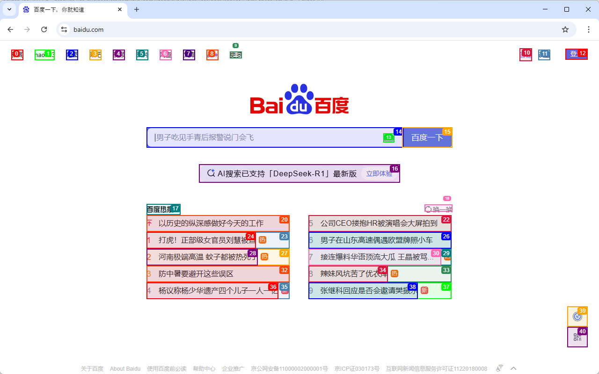

# deepseek-browser-use：概念与学习路线

deepseek-browser-use 是供智能体调用的浏览器服务。它用真实浏览器加载网页，通过 HTTP 接收命令，返回页面文本、元素索引、截图和动作结果。DeepSeek 或其他模型负责理解目标与选择动作；服务负责执行，模型调用并不内置在每条浏览器命令里。

项目源码：[GitHub](https://github.com/litongjava/deepseek-browser-use)、[Gitee](https://gitee.com/ppnt/deepseek-browser-use)。

## 先理解四个概念

| 概念 | 含义 |
| --- | --- |
| 服务 | Java 进程，默认端口为 10049，统一控制入口是 `POST /playwright/command` |
| 浏览器 | 服务管理的共享浏览器与持久化 profile，多个任务可共享登录状态 |
| 任务 | 用 `id` 标识的一组页签和当前页状态；不是独立浏览器或独立账号 |
| 页面快照 | 某一时刻的结构化文本和元素索引，页面变化后需要重新获取 |

profile 中的持久数据可以跨任务保留，但网站可能让登录失效，浏览器退出也可能丢失会话 Cookie。同一任务的命令应顺序执行。任务完成后使用 `close` 释放自己的页签；最后一个任务关闭时，共享浏览器也会退出。

## 从截图到结构化文本

浏览器服务通过 DOM 采集脚本识别页面元素，为符合条件的元素分配索引，并可在截图上绘制对应的高亮框。下面保留原教程的百度页面示意图：



这是历史页面截图，用于理解高亮框与编号的对应关系，不代表当前百度页面的内容。图中的搜索框标记为 14，“百度一下”按钮标记为 15；实际操作必须读取当次页面快照，不能照抄图片编号。

### 模型看到的结构化文本

当前通过 `get_browser_state` 获取 `data.text`。下面按原示例简化展示格式，省略了热点内容和部分属性，不是与截图逐字对应的完整快照：

```text
[Start of page]
		[0]<a >新闻/>
		[8]<a />
			[9]<a name='tj_briicon'>更多/>
		[12]<a name='tj_login'>登录/>
							[14]<input name='wd' placeholder='肖战连续两天请剧组喝冰饮'/>
							[15]<input type='submit' value='百度一下'/>
							[16]<a >AI搜索已支持「DeepSeek-R1」最新版 立即体验/>
								[17]<div > />
						[19]<li />
							[20]<a > 0 以历史的纵深感做好今天的工作/>
						[21]<li >新/>
							[22]<a > 5 亲叔叔炮轰宗馥莉：她从不与宗家往来/>
			[39]<div >辅助模式/>
				[40]<div />
[End of page]
```

| 表示方式 | 如何理解 |
| --- | --- |
| `[14]` | 本次快照中的元素索引，用于后续按索引操作；不是 HTML id，也不是文本行号 |
| `<input ...>`、`<a ...>` | 元素类型与选取的语义属性，并非完整 HTML |
| 缩进 | 元素的层级关系，不是页面上的像素位置 |
| `新闻`、`登录` | 元素提取出来的可读文本 |
| `value='百度一下'` | 按钮类 input 的文字；普通输入控件的 value 表示采集到的当前值 |
| 行尾 `/>` | 本项目文本渲染的格式后缀，不表示网页元素一定是 HTML 自闭合标签 |

索引可能不连续，不能用“第几行”代替索引。没有文字的元素仍可能有索引；可见的只读或禁用控件也可能展示状态而没有可操作索引。是否能执行动作，还要检查当前元素的可操作性。

这份文本保留标签、文字和部分属性，方便模型判断操作目标；它不等同于完整 DOM，不能假定 id、class、href 或 XPath 都会随文本返回。读取链接地址、属性或表单值时，应使用相应的读取命令。

旧示例中的 `[Start of page]` 和 `[End of page]` 是测试程序添加的展示标记，不是当前 `data.text` 的固定组成部分。

### 文本、截图与实际动作如何连接

```text
页面 DOM
  → 采集脚本建立节点与索引
  → Java 输出结构化文本，保存索引与 Frame 的映射
  → 截图上的高亮编号帮助核对目标
  → 模型选择实际快照中的元素
  → 服务通过索引定位元素并执行动作
```

页面跳转、弹窗变化或重新渲染后，需要重新取快照；`indicesUsable:false` 时不能使用该次索引。截图负责补充视觉信息，结构化文本提供可读内容与操作入口，二者应结合当前状态使用。

操作示例见 [第一个任务：理解元素索引](./03.md#_4-理解元素索引)。实现代码见 [前端 DOM 构建](./15.md)、[Java 元素提取](./16.md) 和 [页面状态命令](./19.md)。

## 一次任务如何完成

```text
用户目标
  → 智能体读取页面状态
  → 选择一条命令或一组确定的命令
  → POST /playwright/command
  → 服务操作浏览器
  → 回读页面、截图和业务结果
  → 达到目标或请求人工协助
```

例如查询页面信息，可以先启动任务，再导航到网页，读取页面状态，提取正文，最后关闭任务。填表时还需要检查实时字段值、必填项、弹窗和提交结果，不能只凭点击命令成功就认定业务完成。

## 当前工程的组成

| 路径（相对于项目根目录） | 用途 |
| --- | --- |
| `playwright-server/` | Java 服务、命令执行、浏览器生命周期和 DOM 采集 |
| `client/dsb.py` | 只依赖 Python 标准库的 HTTP 客户端，支持命令行与库调用 |
| `scripts/run/` | Windows 启动、健康检查和停止脚本 |
| `recipes/` | 可复用的站点步骤与参数模板 |
| `.agents/skills/` | 智能体操作指南和站点手册 |
| `data/`、`logs/` | 服务与客户端运行时留档 |

服务的真实调用链为 `PlaywrightHandler → ActionService → CommandTable → PlaywrightService`。先掌握 HTTP 使用，再读这些类的实现。

## 按这个顺序学习

1. [安装与启动](./02.md)：准备环境，确认服务可访问。
2. [第一个完整任务](./03.md)：完成启动、导航、读取和关闭。
3. [统一命令协议](./04.md)：理解参数、回执、批量和错误。
4. [浏览器与登录态](./05.md)、[视口](./06.md)：理解运行环境。
5. [接入智能体](./07.md)：把观察、动作、验证连成循环。
6. [表单排障](./08.md) 到 [配置与维护](./12.md)：处理实际任务。
7. [命令速查](./13.md)、[执行链](./14.md)、[DOM 原理](./15.md)：按需进入源码。

完整分组见 [章节目录](./readme.md)。
