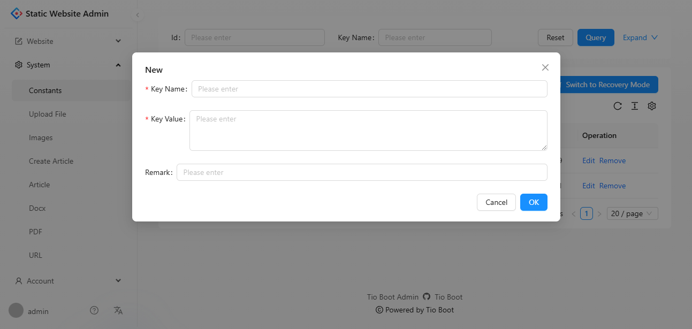
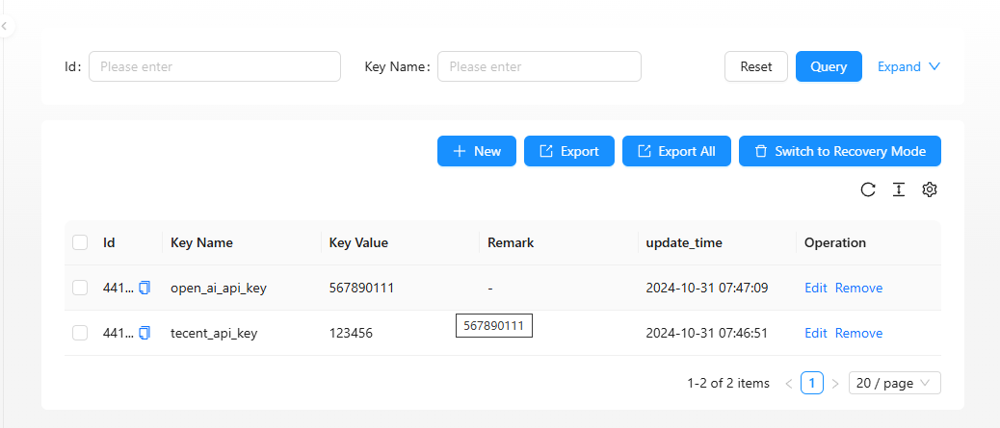
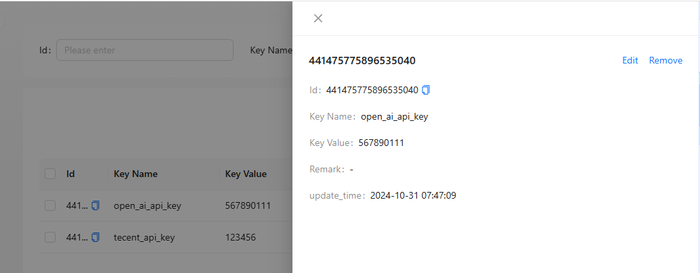

# 系统模块 - 配置管理

## 功能概述

本模块实现了系统配置项的管理功能，提供了增删查改等基础操作。通过 `ApiTableLong` 组件实现单表数据的管理，支持分页、搜索、创建等功能，适合在后台管理中使用。

### 核心组件

本模块的主要组件包括：

- **`systemConstatnsColumn.tsx`**：定义了表格的列及其属性。
- **`systemConstantsIndex.tsx`**：配置页面的主文件，结合 `ApiTableLong` 实现单表数据管理。

## 代码结构

### 1. 配置表格列 (`systemConstatnsColumn.tsx`)

该文件定义了表格中每一列的显示内容和表单验证规则。

```typescript
import { ProColumns } from "@ant-design/pro-components";

export const tio_boot_admin_system_constants_config_columns = (): ProColumns<any>[] => [
  {
    title: "Key Name",
    dataIndex: "key_name",
    formItemProps(form) {
      return {
        rules: [
          {
            required: true,
          },
        ],
      };
    },
  },
  {
    title: "Key Value",
    dataIndex: "key_value",
    valueType: "textarea",
    ellipsis: true,
    formItemProps(form) {
      return {
        rules: [
          {
            required: true,
          },
        ],
      };
    },
  },
  {
    title: "Remark",
    dataIndex: "remark",
  },
  {
    title: "update_time",
    dataIndex: "update_time",
    valueType: "dateTime",
    hideInSearch: true,
    hideInForm: true,
  },
  {
    key: "update_time",
    title: "update_time",
    dataIndex: "update_time_range",
    valueType: "dateTimeRange",
    hideInTable: true,
    hideInForm: true,
    hideInDescriptions: true,
  },
];
```

- **Key Name**：配置项的名称，必填字段。
- **Key Value**：配置项的值，显示为多行文本且必填。
- **Remark**：备注信息，允许用户填写附加说明。
- **Update Time**：更新时间，支持单项显示和时间范围搜索。

### 2. 主页面配置 (`systemConstantsIndex.tsx`)

该文件将表格列配置与数据请求逻辑结合，形成完整的配置项管理页面。

```typescript
import React from "react";
import ApiTableLong from "@/components/common/ApiTableLong";
import { tio_boot_admin_system_constants_config_columns } from "@/pages/system/constants/systemConstatnsColumn";

export default () => {
  const from = "tio_boot_admin_system_constants_config";

  const beforePageRequest = (params: any) => {
    params.idType = "long";
    params.keyNameOp = "ct";
    params.keyValueOp = "ct";
    params.remarkOp = "ct";
    params.deleted = 0;
    params.orderBy = "update_time";
    params.isAsc = "false";
    params.update_time_type = "string[]";
    params.update_time_op = "bt";
    return params;
  };

  const beforeCreateRequest = (formValues: any) => {
    return {
      ...formValues,
      idType: "long",
    };
  };

  return (
    <ApiTableLong
      from={from}
      columns={tio_boot_admin_system_constants_config_columns()}
      beforePageRequest={beforePageRequest}
      beforeCreateRequest={beforeCreateRequest}
    />
  );
};
```

#### 参数说明

- **from**：数据来源的标识，用于指定表名或数据源。
- **beforePageRequest**：分页请求前的参数处理，包括字段名称的模糊查询和时间范围查询。
- **beforeCreateRequest**：创建请求前的参数处理，自动添加 `idType` 字段。

### 核心组件 - ApiTableLong

`ApiTableLong` 是一个高度封装的单表管理组件，支持分页、搜索、排序等多项功能，极大简化了配置项管理的开发工作。

- **分页功能**：实现数据的分页加载。
- **模糊查询**：支持根据字段名称或内容的部分字符进行查询。
- **排序**：默认根据 `update_time` 字段降序排列。

## 功能演示

1. **创建配置项**

   - 点击「新建」按钮，弹出表单填写页面。

   

2. **查看和管理配置项**

   - 支持按条件分页查询，点击分页器切换页面。

   

3. **查看配置详情**

   - 点击记录进入详情页面，可查看配置项的详细信息。

   

## 总结

本模块提供了配置项的增删查改功能，代码结构简洁，基于 `ApiTableLong` 组件实现，支持模糊查询、时间范围搜索和排序功能。
