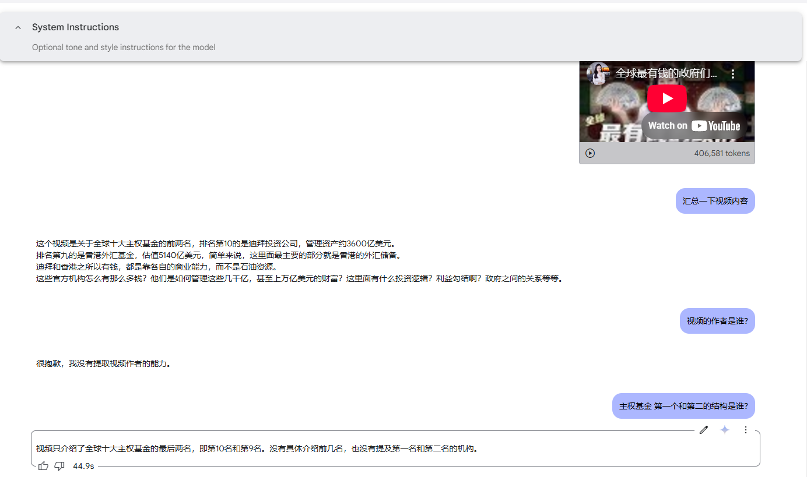

# Ai studio gemini youbue 问答使用说明

[[toc]]

> 生产环境不推荐使用,因为延迟太高了,每次推理的延迟都在 40s 左右
> 

本文档介绍了 youbue 功能的工作原理及消息交互格式。该功能支持前端向后端提交包含 YouTube 视频链接和用户消息的请求，后端会将消息转换为大模型所需的消息格式并发送。以下详细描述了首次消息发送及后续追问的消息格式转换过程。

---

## 1. 第一个消息

当用户首次发送请求时，前端会按照下面的格式将数据提交到后端。后端会将数据转换成大模型所需的消息格式并发送。需要注意的是，在发送消息时，**args.url** 与 **messages[0].role** 以及 **messages[0].content** 均不能为空。

### 应用消息格式

```json
{
  "chat_id": "490485509258018816",
  "type": "youtube",
  "args": {
    "url": "https://www.youtube.com/watch?v=31FpW6CMmYE"
  },
  "messages": [
    {
      "role": "user",
      "content": "解释一下视频内容"
    }
  ],
  "stream": true
}
```

### 转换后发送给大模型的消息格式

```json
{
  "contents": [
    {
      "parts": [
        {
          "fileData": {
            "mimeType": "video/*",
            "fileUri": "https://www.youtube.com/watch?v=31FpW6CMmYE"
          }
        },
        {
          "text": "解释一下视频内容"
        }
      ],
      "role": "user"
    }
  ],
  "system_instruction": {
    "parts": {
      "text": "You are a helpful assistant.\r\nCurrent date & time in ISO format (UTC timezone) is: 2025-03-15T05:34:41.815Z."
    }
  }
}
```

在该消息中，主要包含两部分内容：

- **视频信息**：由 `fileData` 部分表示，包含 MIME 类型以及视频的 URI。
- **用户文本消息**：直接在 `text` 字段中给出，例如 “解释一下视频内容”。

同时，还包含系统指令部分，用以指示大模型当前的身份和时间。

---

## 2. 继续追问

当用户对视频内容做出后续追问时，前端会提交新的消息。此时，后端会自动加载之前的上下文信息，并在消息中追加用户的追问内容。注意，追问消息中同样要求 **messages[0].role** 与 **messages[0].content** 不为空。

### 应用消息格式

```json
{
  "chat_id": "490485509258018816",
  "type": "youtube",
  "messages": [
    {
      "role": "user",
      "content": "视频的作者是谁"
    }
  ],
  "stream": true
}
```

### 转换后推送给大模型的报文

```json
{
  "system_instruction": {
    "parts": {
      "text": "You are a helpful assistant.\r\nCurrent date & time in ISO format (UTC timezone) is: 2025-03-15T05:43:11.366Z."
    }
  },
  "contents": [
    {
      "role": "user",
      "parts": [
        {
          "fileData": {
            "mimeType": "video/*",
            "fileUri": "https://www.youtube.com/watch?v=31FpW6CMmYE"
          }
        },
        {
          "text": "解释一下视频内容"
        }
      ]
    },
    {
      "role": "model",
      "parts": [
        {
          "text": "这是一个讲授缅甸历史的视频，视频中，一位中国学者坐在装满书籍的书架前，介绍了他称为“中国周边的小国”的缅甸。\n\n以下是此视频的一些要点：\n- 缅甸的第一个统一国家在公元1044年出现。\n- 缅甸经历了三个王朝，包括蒲甘王朝、东吁王朝和贡榜王朝。\n- 缅甸有三个主要民族，分别是缅族（该国主要民族）、孟族和掸族（中国傣族）。\n- 缅甸和中国的关系持续了数个朝代，但与大英帝国相比有所减少。\n\n视频中的这位学者表示，他已经去过与中国接壤的掸邦，他描述了中国的瑞丽，以及掸邦掸族（果敢）文化中的中国文化特色。"
        }
      ]
    },
    {
      "role": "user",
      "parts": [
        {
          "text": "视频的作者是谁"
        }
      ]
    }
  ]
}
```

在该追问的报文中，除了新的用户提问信息外，消息中还包含了之前对视频内容的解释和大模型的回复，以便保持对话的连续性和上下文完整性。

---

## 3. 总结

- **初始消息**：用户提交包含视频链接和初始问题的消息。后端转换为大模型消息格式时，将视频的链接和问题文本分别以 `fileData` 和 `text` 字段形式传递。
- **追问消息**：当用户追问时，后端会加载之前的对话上下文，将之前的视频内容和模型回复保留，并将新的问题追加到消息列表中。

该设计确保了对话的连续性，使大模型能够在充分上下文信息的支持下给出更准确和有针对性的回答。

---

以上便是 youbue 功能的完整使用说明及消息格式示例。
