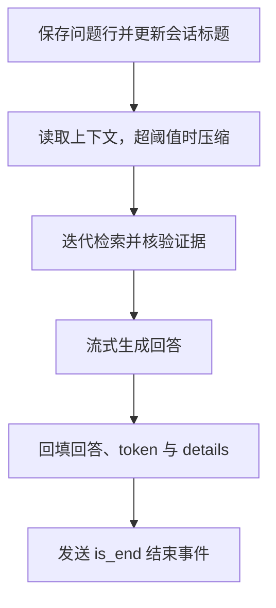

# 对话日志

[[toc]]

Java MaxKB 把会话、问答记录、检索轨迹与压缩摘要保存在 PostgreSQL。官方前端的「对话日志」页和分享对话页直接复用这些接口：管理账号按应用查看全部会话，分享访客只读取属于自己客户端的会话，两者都要通过应用与会话归属检查。

## 数据结构

| 表 | 保存内容 |
| --- | --- |
| `max_kb_application_chat` | 会话：所属应用、客户标识、会话类型、标题与删除标记 |
| `max_kb_application_chat_record` | 一轮问答：问题、回答、token 计数、耗时、评价与执行明细 |
| `max_kb_chat_context` | 该会话的摘要与压缩水位，见[上下文压缩](./32.md) |

建表语句以[数据库设计](./01.md)所述脚本为准，两处索引服务于日志读取：`max_kb_application_chat_record(chat_id)` 用于分页取记录，`max_kb_application_chat_record(chat_id,id) WHERE answer_text IS NOT NULL` 用于按水位读取未压缩历史。会话表的关键字段：

| 字段 | 含义 |
| --- | --- |
| `id` | 雪花 ID，主键，也是前端持有的 chat ID |
| `abstract` | 会话标题；首次提问写入问题前 100 个字符，之后不再覆盖 |
| `application_id` | 所属应用 |
| `client_id` | 会话归属的客户端：登录账号或分享访客标识 |
| `chat_type` | `0` 发布后的对话页，`1` 应用调试 |
| `is_deleted` | 逻辑删除，列表和详情都过滤该标记 |

问答表的关键字段：

| 字段 | 含义 |
| --- | --- |
| `problem_text` / `answer_text` | 本轮问题与回答原文 |
| `message_tokens` / `answer_tokens` | 问题与回答的 token 计数 |
| `run_time` | 生成耗时（秒） |
| `details` | JSONB，本轮模型调用与检索明细 |
| `vote_status` | 评价：`-1` 未评价、`0` 点赞、`1` 点踩 |
| `improve_paragraph_id_list` | 标注段落 ID，当前流程不写入 |

`answer_text` 为空表示该轮尚未生成完成。上下文压缩只读取 `answer_text is not null` 的记录，未完成的问答既不进入摘要，也不会因为压缩被删除。

`details` 由 `chat_step`（模型、消息、token、耗时）和 `search_step`（改写后的问题、引用片段、每轮检索与停止原因、上下文元数据）两个对象组成。它记录检索资料与核验结论，不保存模型私有思维过程：

```json
{
  "chat_step": {
    "model_id": "6956...",
    "run_time": 1.89,
    "message_tokens": 9349,
    "answer_tokens": 143,
    "message_list": ["..."]
  },
  "search_step": {
    "step_type": "iterative_search",
    "problem_text": "行政复议的一般申请期限是多久，以及因不可抗力耽误该期限时如何处理？",
    "paragraph_list": ["..."],
    "iterations": [
      {
        "round": 1,
        "queries": ["行政复议的一般申请期限是多久，以及因不可抗力耽误该期限时如何处理？"],
        "new_paragraph_ids": ["695639888776241152"],
        "total_evidence": 5,
        "sufficient": true,
        "missing": "",
        "next_queries": []
      }
    ],
    "stop_reason": "sufficient",
    "sufficient": true,
    "missing": "",
    "context": { "compacted_rounds": 0, "recent_rounds": 2, "revision": 0 }
  }
}
```

## 一次提问的写入顺序



提问先落问题行，回答流结束后再回填答案与明细，最后才发送结束事件；这样紧接着的追问能读到完整的上一轮。

```java
import nexus.io.db.activerecord.Db;
import nexus.io.db.activerecord.Row;
import nexus.io.maxkb.model.MaxKbApplicationChat;
import nexus.io.maxkb.model.MaxKbApplicationChatRecord;
import nexus.io.maxkb.vo.MaxKbChatRequestVo;
import nexus.io.model.result.ResultVo;
import nexus.io.tio.boot.http.TioRequestContext;
import nexus.io.tio.utils.snowflake.SnowflakeIdUtils;

public ResultVo ask(ChannelContext channelContext, Long chatId, MaxKbChatRequestVo vo) {
  String quesiton = vo.getMessage();
  Row record = Db.findFirst(MaxKbApplicationChat.tableName, "application_id,chat_type,client_id",
      Row.by("id", chatId).set("is_deleted", false));
  if (record == null) {
    return ResultVo.fail("会话不存在");
  }
  Long caller = TioRequestContext.getUserIdLong();
  if (caller == null || (caller != 1L && !caller.equals(record.getLong("client_id")))) {
    return ResultVo.fail("无权访问此会话");
  }
  Long application_id = record.getLong("application_id");
  if (!ApplicationAccess.canChat(caller, application_id)) {
    return ResultVo.fail("应用已停用或无权访问");
  }
  if (!ChatExecution.begin(chatId)) {
    return ResultVo.fail("当前会话正在处理上一条问题，请等待完成");
  }
  long messageId = SnowflakeIdUtils.id();
  // 先保存问题行，回答生成结束后回填答案与明细
  int countTokens = TokenCounter.countTokens(quesiton);
  Row chatRecord = Row.by("id", messageId).set("problem_text", quesiton).set("message_tokens", countTokens).set("chat_id", chatId);
  Db.save(MaxKbApplicationChatRecord.tableName, chatRecord);
  Db.update("update max_kb_application_chat set abstract=coalesce(abstract,?),update_time=now() where id=?",
      quesiton.substring(0, Math.min(quesiton.length(), 100)), chatId);
  // 检索与生成省略，见迭代检索章节
}
```

回填在流式回调里完成，`details` 以 JSONB 写入：

```java
import org.postgresql.util.PGobject;

import nexus.io.db.activerecord.Db;
import nexus.io.db.activerecord.Row;
import nexus.io.kit.PgObjectUtils;
import nexus.io.maxkb.constant.MaxKbTableNames;
import nexus.io.maxkb.vo.MaxKbChatRecordDetail;
import nexus.io.maxkb.vo.MaxKbStreamChatVo;
import nexus.io.maxkb.utils.TokenCounter;
import nexus.io.tio.http.server.util.SseEmitter;
import nexus.io.tio.utils.json.JsonUtils;

StringBuffer completionContent = processResponseBody(chatId, messageId, channelContext, responseBody);
double runTime = ((double) (System.currentTimeMillis() - start)) / 1000;
int answer_tokens = TokenCounter.countTokens(completionContent.toString());
chatStep.setRun_time(runTime).setAnswer_tokens(answer_tokens);

MaxKbChatRecordDetail detail = new MaxKbChatRecordDetail(chatStep, searchStep);
PGobject pgobject = PgObjectUtils.json(JsonUtils.toJson(detail));
Row record = Row.by("id", messageId).set("run_time", runTime).set("answer_text", completionContent.toString())
    .set("answer_tokens", answer_tokens).set("message_tokens", chatStep.getMessage_tokens())
    .set("details", pgobject);
Db.update(MaxKbTableNames.max_kb_application_chat_record, record);
// 先落库，再发送结束事件：紧接着的追问能读到这一轮
MaxKbStreamChatVo end = new MaxKbStreamChatVo();
end.setContent("").setChat_id(chatId).setId(messageId).setChat_record_id(messageId.toString());
end.setOperate(true).setIs_end(true).setNode_is_end(true);
SseEmitter.pushSSEChunk(channelContext, JsonUtils.toJson(end));
```

流式失败时发送 `event: error`，`finally` 中释放会话执行锁并关闭 SSE 连接；同一会话同时只允许一轮生成，避免追问读到未完成的答案。

## 归属与权限

三类判断集中在 `ApplicationAccess`：

```java
package nexus.io.maxkb.service.kb;

import nexus.io.db.activerecord.Db;
import nexus.io.db.activerecord.Row;

public final class ApplicationAccess {
  private ApplicationAccess() {}

  public static boolean owns(Long userId, Long applicationId) {
    if (userId == null || applicationId == null) {
      return false;
    }
    Row app = Db.findById("max_kb_application", applicationId);
    return app != null && (userId == 1L || userId.equals(app.getLong("user_id")));
  }

  public static boolean canChat(Long clientId, Long applicationId) {
    if (owns(clientId, applicationId)) {
      return true;
    }
    return clientId != null && Db.queryLong("select count(*) from max_kb_application_public_access_client c join max_kb_application_access_token t on t.application_id=c.application_id where c.client_id=? and c.application_id=? and t.is_active=true and t.deleted=0", clientId, applicationId) > 0;
  }

  public static boolean canReadChat(Long clientId, Long applicationId, Long chatId) {
    Row chat = Db.findById("max_kb_application_chat", chatId);
    return chat != null && !Boolean.TRUE.equals(chat.getBoolean("is_deleted")) && applicationId.equals(chat.getLong("application_id"))
        && (owns(clientId, applicationId) || (canChat(clientId, applicationId) && clientId.equals(chat.getLong("client_id"))));
  }
}
```

| 判断 | 通过条件 |
| --- | --- |
| `owns` | 应用属于该账号；系统管理员视为拥有全部应用 |
| `canChat` | 账号本人、应用所有者，或被公开访问授权且令牌有效的访客 |
| `canReadChat` | 会话属于该应用、未删除，并且调用者是应用所有者，或该会话 `client_id` 本人 |

`canReadChat` 同时校验 `applicationId` 与 `chatId` 的从属关系，因此换一个应用 ID 去读同一会话同样会被拒绝。分享访客的令牌不对应后台账号，请求拦截器只放行对话所需路径，其余一律 403：

```java
if (!member && !(path.equals("/api/application/profile")
    || path.matches("/api/application/\\d+/chat/open")
    || path.matches("/api/application/chat_message/\\d+")
    || path.matches("/api/application/\\d+/chat/\\d+/context(/compact)?")
    || path.matches("/api/application/\\d+/chat/client/\\d+(/\\d+)?")
    || path.matches("/api/application/\\d+/chat/\\d+/chat_record/\\d+/\\d+")
    || path.matches("/api/application/\\d+/chat/\\d+/chat_record/\\d+(/vote)?"))) {
  HttpResponse denied = TioRequestContext.getResponse();
  denied.setStatus(HttpResponseStatus.C403);
  return denied;
}
```

## 接口

| 方法与路径 | 行为 |
| --- | --- |
| `GET /api/application/{app}/chat/{page}/{size}` | 管理端会话分页，按更新时间倒序；支持标题、时间区间与评价筛选 |
| `GET /api/application/{app}/chat/client/{page}/{size}` | 分享端会话分页，只返回本人 `client_id` 且 `chat_type=0` 的会话 |
| `GET /api/application/{app}/chat/{chat}/chat_record/{page}/{size}` | 问答分页，每页最多 100 条；默认按 ID 升序，`order_asc=false` 时倒序 |
| `GET /api/application/{app}/chat/{chat}/chat_record/{record}` | 单条问答详情，含引用与检索轨迹 |
| `PUT /api/application/{app}/chat/{chat}/chat_record/{record}/vote` | 评价，只接受 `-1`、`0`、`1` |
| `PUT /api/application/{app}/chat/client/{chat}` | 重命名会话，标题 1～256 字符 |
| `DELETE /api/application/{app}/chat/{chat}` | 逻辑删除会话 |
| `POST /api/application/{app}/chat/export` | 导出勾选的会话，未勾选时按当前筛选条件导出 xlsx，文件名带日期 |
| `PUT /api/application/{app}/chat/{chat}/chat_record/{record}/dataset/{dataset}/document_id/{document}/improve` | 标注：把答案写成段落并记在问答上 |
| `GET /api/application/{app}/chat/{chat}/chat_record/{record}/improve` | 当前记录的标注段落 |
| `DELETE /api/application/{app}/chat/{chat}/chat_record/{record}/dataset/{dataset}/document_id/{document}/improve/{paragraph}` | 删除标注、段落与问题关联 |
| `POST /api/application/{app}/dataset/{dataset}/improve` | 加入知识库：把勾选会话的问答批量写成段落 |
| `DELETE /api/dataset/{dataset}/document/{document}/paragraph/{paragraph}` | 删除段落，标注删除与分段管理共用 |

会话分页接受 `abstract`、`start_time`、`end_time`、`min_star`、`min_trample`、`comparer` 六个查询参数，与界面上的搜索框、时间选择器和评价筛选一一对应；时间按本机时区整天闭区间处理，非法日期忽略该条件而不是报错。

会话列表在 SQL 里统计提问数、赞同数、反对数、标注数与会话 token 合计，并用 `client_id` 反查用户（查不到按游客显示）；问答分页先取 ID 再逐条组装详情，方向由 `order_asc` 决定；评价只更新属于该会话的记录，因此跨会话提交记录 ID 不会命中：

```java
import java.time.LocalDate;
import java.time.OffsetDateTime;
import java.time.ZoneId;
import java.util.ArrayList;
import java.util.List;

import com.jfinal.kit.Kv;

import nexus.io.db.activerecord.Db;
import nexus.io.db.activerecord.Row;
import nexus.io.jfinal.aop.Aop;
import nexus.io.model.result.ResultVo;

public class MaxKbChatHistoryService {

  public ResultVo chats(Long user, Long application, int page, int size, boolean clientOnly, Query query) {
    if (clientOnly ? !ApplicationAccess.canChat(user, application) : !ApplicationAccess.owns(user, application)) {
      return ResultVo.fail("无权访问对话日志");
    }
    page = Math.max(1, page);
    size = Math.max(1, Math.min(100, size));
    Sql sql = listSql(application, clientOnly ? user : null, query, false);
    long total = Db.queryLong("select count(*) from (" + sql.select + ") chat_log", sql.args.toArray());
    List<Object> pageArgs = new ArrayList<>(sql.args);
    pageArgs.add(size);
    pageArgs.add((page - 1) * size);
    List<Row> rows = Db.find(sql.select + " order by c.update_time desc,c.id desc limit ? offset ?", pageArgs.toArray());
    List<Kv> records = new ArrayList<>();
    for (Row row : rows) {
      records.add(toChat(row));
    }
    return ResultVo.ok(Kv.by("current", page).set("size", size).set("total", total).set("records", records));
  }

  /** 统计子查询 + 用户反查 + 条件拼装，导出与会话分页共用。 */
  private Sql listSql(Long application, Long clientId, Query query, boolean export) {
    StringBuilder select = new StringBuilder();
    select.append("select c.*, coalesce(s.chat_record_count,0) chat_record_count, coalesce(s.star_num,0) star_num,")
        .append(" coalesce(s.trample_num,0) trample_num, coalesce(s.mark_sum,0) mark_sum, coalesce(s.tokens_num,0) tokens_num,")
        .append(" u.username asker_name, u.nick_name asker_nick_name")
        .append(" from max_kb_application_chat c")
        .append(" left join (select r.chat_id, count(*) chat_record_count,")
        .append(" sum(case when r.vote_status='0' then 1 else 0 end) star_num,")
        .append(" sum(case when r.vote_status='1' then 1 else 0 end) trample_num,")
        .append(" sum(case when r.improve_paragraph_id_list is null then 0 else array_length(r.improve_paragraph_id_list,1) end) mark_sum,")
        .append(" sum(coalesce(r.answer_tokens,0)+coalesce(r.message_tokens,0)) tokens_num")
        .append(" from max_kb_application_chat_record r group by r.chat_id) s on s.chat_id=c.id")
        .append(" left join max_kb_user u on u.id=c.client_id");
    List<Object> args = new ArrayList<>();
    select.append(" where c.application_id=? and c.is_deleted=false");
    args.add(application);
    if (clientId != null) {
      select.append(" and c.client_id=? and c.chat_type=0");
      args.add(clientId);
    }
    if (query.hasAbstract()) {
      select.append(" and c.abstract ilike ?");
      args.add("%" + query.abstractText + "%");
    }
    OffsetDateTime from = startOfDay(query.startTime);
    if (from != null) {
      select.append(" and c.update_time >= ?");
      args.add(from);
    }
    OffsetDateTime to = endOfDay(query.endTime);
    if (to != null) {
      select.append(" and c.update_time <= ?");
      args.add(to);
    }
    if (query.hasVoteFilter()) {
      String star = "coalesce(s.star_num,0) >= ?";
      String trample = "coalesce(s.trample_num,0) >= ?";
      if (query.minStar != null && query.minTrample != null) {
        select.append(" and (").append(star).append(query.isOrComparer() ? " or " : " and ").append(trample).append(")");
        args.add(query.minStar);
        args.add(query.minTrample);
      } else if (query.minStar != null) {
        select.append(" and ").append(star);
        args.add(query.minStar);
      } else {
        select.append(" and ").append(trample);
        args.add(query.minTrample);
      }
    }
    Sql sql = new Sql();
    sql.select = select.toString();
    sql.args = args;
    return sql;
  }

  public ResultVo records(Long user, Long application, Long chat, int page, int size, boolean ascending) {
    if (!ApplicationAccess.canReadChat(user, application, chat)) {
      return ResultVo.fail("无权访问会话");
    }
    page = Math.max(1, page);
    size = Math.max(1, Math.min(100, size));
    long total = Db.queryLong("select count(*) from max_kb_application_chat_record where chat_id=?", chat);
    List<Long> ids = Db.queryListLong("select id from max_kb_application_chat_record where chat_id=? order by id "
        + (ascending ? "asc" : "desc") + " limit ? offset ?", chat, size, (page - 1) * size);
    List<Object> records = new ArrayList<>();
    for (Long id : ids) {
      records.add(Aop.get(MaxKbApplicationCharRecordService.class).get(user, application, chat, id).getData());
    }
    return ResultVo.ok(Kv.by("current", page).set("size", size).set("total", total).set("records", records));
  }

  public ResultVo vote(Long user, Long application, Long chat, Long record, String vote) {
    if (!ApplicationAccess.canReadChat(user, application, chat) || vote == null || !List.of("-1", "0", "1").contains(vote)) {
      return ResultVo.fail("无效的评价请求");
    }
    return ResultVo.ok(Db.update("update max_kb_application_chat_record set vote_status=? where id=? and chat_id=?", vote, record, chat) > 0);
  }
}
```

统计值统一补齐为 0，`asker` 统一为 `{user_name}` 对象，界面不再出现空列。重命名与删除沿用同一套归属检查：标题必须是 1～256 个字符，删除只把 `is_deleted` 置为真。

上下文读取与手动压缩使用 `GET /api/application/{app}/chat/{chat}/context` 和 `POST .../context/compact`，返回内容与阈值见[上下文压缩](./32.md)。

## 记录详情

详情在原文之外补充界面需要的字段：`answer_text_list` 供回答列表渲染，`paragraph_list` 是本轮引用片段，`dataset_list` 是去重后的知识库，`agent_trace` 是每轮查询与核验结论，`agent_stop_reason` 与 `context_info` 说明停止原因和上下文状态：

```json
{
  "id": "695892668679344128",
  "problem_text": "结合刚才的问题，简短总结申请期限及不可抗力的处理，引用知识库文档。",
  "answer_text": "根据《中华人民共和国行政复议法.docx》第二十条：……",
  "answer_text_list": ["根据《中华人民共和国行政复议法.docx》第二十条：……"],
  "message_tokens": 9349,
  "answer_tokens": 143,
  "run_time": 1.894,
  "vote_status": "-1",
  "create_time": "2026-10-03 09:09:01.290883",
  "agent_trace": [
    {
      "round": 1,
      "queries": ["行政复议的一般申请期限是多久，以及因不可抗力耽误该期限时如何处理？"],
      "new_paragraph_ids": ["695639888776241152"],
      "total_evidence": 5,
      "sufficient": true,
      "missing": "",
      "next_queries": []
    }
  ],
  "agent_stop_reason": "sufficient",
  "context_info": {
    "enabled": true,
    "revision": 0,
    "compacted": false,
    "compacted_rounds": 0,
    "recent_rounds": 2,
    "token_budget": 6000,
    "threshold_exceeded": false,
    "estimated_tokens": 270,
    "compaction_reason": "none"
  },
  "paragraph_list": [
    {
      "id": "695639888776241152",
      "content": "……第二十条　公民、法人或者其他组织认为行政行为侵犯其合法权益的，可以自知道或者应当知道该行政行为之日起六十日内提出行政复议申请……",
      "dataset_id": "695638732989636608",
      "dataset_name": "政法文档验证",
      "document_id": "695639883218788352",
      "document_name": "中华人民共和国行政复议法.docx"
    }
  ],
  "dataset_list": [{ "id": "695638732989636608", "name": "政法文档验证" }]
}
```

`details` 在 PostgreSQL 中是 JSONB，驱动返回 `PGobject`，因此先判断类型再解析；知识库列表按 `dataset_id` 去重：

```java
import java.util.ArrayList;
import java.util.HashSet;
import java.util.List;
import java.util.Set;
import java.util.Objects;

import org.postgresql.util.PGobject;

import com.jfinal.kit.Kv;

import nexus.io.db.activerecord.Db;
import nexus.io.db.activerecord.Row;
import nexus.io.maxkb.constant.MaxKbTableNames;
import nexus.io.maxkb.vo.MaxKbChatRecordDetail;
import nexus.io.maxkb.vo.ParagraphSearchResultVo;
import nexus.io.model.result.ResultVo;
import nexus.io.tio.utils.hutool.StrUtil;
import nexus.io.tio.utils.json.JsonUtils;

public class MaxKbApplicationCharRecordService {

  public ResultVo get(Long userId, Long applicationId, Long chatId, Long recordId) {
    if (!ApplicationAccess.canReadChat(userId, applicationId, chatId)) {
      return ResultVo.fail("会话不存在或无权访问");
    }
    Row queryRecord = Row.by("id", recordId).set("chat_id", chatId);
    Row record = Db.findFirst(MaxKbTableNames.max_kb_application_chat_record, queryRecord);
    if (record == null) {
      return ResultVo.ok();
    }
    Object object = record.get("details");
    record.remove("details");
    MaxKbChatRecordDetail detail = null;
    if (object instanceof PGobject) {
      String value = ((PGobject) object).getValue();
      if (StrUtil.isNotBlank(value)) {
        detail = JsonUtils.parse(value, MaxKbChatRecordDetail.class);
      }
    } else if (object instanceof String) {
      String value = (String) object;
      if (StrUtil.isNotBlank(value)) {
        detail = JsonUtils.parse(value, MaxKbChatRecordDetail.class);
      }
    }

    Kv kv = record.toKv();
    String answer = record.getStr("answer_text");
    kv.set("answer_text_list", List.of(answer == null ? "" : answer));
    kv.set("create_time", Objects.toString(record.getObject("create_time")));
    kv.set("update_time", Objects.toString(record.getObject("update_time")));
    if (detail != null) {
      kv.set("agent_trace", detail.getSearch_step().getIterations());
      kv.set("agent_stop_reason", detail.getSearch_step().getStop_reason());
      kv.set("context_info", detail.getSearch_step().getContext());
      List<ParagraphSearchResultVo> paragraph_list = detail.getSearch_step().getParagraph_list();
      List<Kv> dataset_list = new ArrayList<>();
      Set<Long> seenIds = new HashSet<>();
      for (ParagraphSearchResultVo paragraph : paragraph_list) {
        if (seenIds.add(paragraph.getDataset_id())) {
          dataset_list.add(Kv.by("id", paragraph.getDataset_id()).set("name", paragraph.getDataset_name()));
        }
      }
      kv.set("paragraph_list", paragraph_list);
      kv.set("dataset_list", dataset_list);
    }
    return ResultVo.ok(kv);
  }
}
```

时间字段转成字符串返回，前端按字符串排序；`agent_stop_reason` 的取值与停止条件见[多轮检索](./31.md)。`improve_paragraph_id_list` 是 BIGINT[]，JDBC 返回 `java.sql.Array`，直接写进 JSON 会变成 null，因此统一转成数组：

```java
  Object improveParagraphIds = record.get("improve_paragraph_id_list");
  record.remove("improve_paragraph_id_list");

  Kv kv = record.toKv();
  kv.set("improve_paragraph_id_list", ChatLogArrays.toLongList(improveParagraphIds));
```

## 标注与加入知识库

标注把一条答案变成知识库段落：新建段落并计算向量、按问题内容建立问题与段落关联、把段落 ID 追加到问答的 `improve_paragraph_id_list`。删除标注时反向执行，段落与关联问题一起移除；如果段落被分段管理单独删除，读取标注列表时会清掉残留 ID，界面不会显示失效条目。

```java
import java.util.ArrayList;
import java.util.LinkedHashSet;
import java.util.List;
import java.util.Set;

import com.alibaba.fastjson2.JSONObject;
import com.jfinal.kit.Kv;

import nexus.io.db.activerecord.Db;
import nexus.io.db.activerecord.Row;
import nexus.io.jfinal.aop.Aop;
import nexus.io.maxkb.constant.MaxKbTableNames;
import nexus.io.model.result.ResultVo;
import nexus.io.tio.utils.snowflake.SnowflakeIdUtils;

public class MaxKbChatLogService {

  public ResultVo improve(Long userId, Long applicationId, Long chatId, Long recordId, Long datasetId, Long documentId, JSONObject body) {
    ResultVo denied = check(userId, applicationId, chatId, recordId, datasetId, documentId);
    if (denied != null) {
      return denied;
    }
    String content = body == null ? null : body.getString("content");
    if (content == null || content.isBlank()) {
      return ResultVo.fail("段落内容不能为空");
    }
    String title = body.getString("title");
    String problemText = body.getString("problem_text");

    Long paragraphId = Aop.get(MaxKbParagraphServcie.class).insertParagraph(datasetId, documentId, title, content);
    saveProblem(datasetId, documentId, paragraphId, problemText, recordId);
    appendParagraph(recordId, chatId, paragraphId);
    return Aop.get(MaxKbApplicationCharRecordService.class).get(userId, applicationId, chatId, recordId);
  }

  private void appendParagraph(Long recordId, Long chatId, Long paragraphId) {
    Db.update("update max_kb_application_chat_record set improve_paragraph_id_list=array_append(coalesce(improve_paragraph_id_list,'{}'),?::bigint) where id=? and chat_id=?",
        paragraphId, recordId, chatId);
  }
}
```

段落本身复用分段管理的写入路径，向量由知识库配置的向量模型计算，写完后刷新文档的段落数与字符数统计：

```java
  /** 插入段落并计算向量，返回段落 ID；调用方需自行完成归属校验。 */
  public Long insertParagraph(Long datasetId, Long documentId, String title, String content) {
    Row dataset = Db.findById(MaxKbTableNames.max_kb_dataset, datasetId);
    if (dataset == null) {
      throw new IllegalArgumentException("知识库不存在");
    }
    Long embedding_mode_id = dataset.getLong("embedding_mode_id");
    KbEmbeddingService maxKbEmbeddingService = Aop.get(KbEmbeddingService.class);

    PGobject contentVector = maxKbEmbeddingService.getVectorForModel(content, embedding_mode_id);
    PGobject titleVector = title == null || title.isBlank() ? null : maxKbEmbeddingService.getVectorForModel(title, embedding_mode_id);
    long id = SnowflakeIdUtils.id();
    Row record = Row.by("id", id)
        .set("source_type", "md")
        .set("title", title)
        .set("content", content)
        .set("md5", Md5Utils.md5Hex(content))
        .set("status", "2")
        .set("hit_num", 0)
        .set("is_active", true).set("dataset_id", datasetId).set("document_id", documentId)
        .set("embedding", contentVector).set(MaxKbParagraph.titleEmbedding, titleVector);

    Db.save(MaxKbTableNames.max_kb_paragraph, record);
    refreshStatistics(documentId);
    return id;
  }
```

「加入知识库」按勾选的会话批量写入：每个会话逐条问答建段，问题作为段落标题、答案作为段落内容，因此标注内容会立即参与检索。接口返回新建段落的 ID 列表：

```java
  public ResultVo improveBatch(Long userId, Long applicationId, Long datasetId, JSONObject body) {
    if (!ApplicationAccess.owns(userId, applicationId)) {
      return ResultVo.fail("应用不存在或无权访问");
    }
    Long documentId = body == null ? null : body.getLong("document_id");
    if (!DatasetAccess.ownsDocument(userId, datasetId, documentId)) {
      return ResultVo.fail("文档不存在或无权访问");
    }
    ...
    List<Long> paragraphIds = new ArrayList<>();
    for (Long chatId : chatIds) {
      if (!ApplicationAccess.canReadChat(userId, applicationId, chatId)) {
        return ResultVo.fail("会话不存在或无权访问");
      }
      List<Row> records = Db.find("select id,problem_text,answer_text from max_kb_application_chat_record where chat_id=? order by id", chatId);
      for (Row record : records) {
        String answer = record.getStr("answer_text");
        if (answer == null || answer.isBlank()) {
          continue;
        }
        Long paragraphId = paragraphService.insertParagraph(datasetId, documentId, record.getStr("problem_text"), answer);
        saveProblem(datasetId, documentId, paragraphId, record.getStr("problem_text"), record.getLong("id"));
        appendParagraph(record.getLong("id"), chatId, paragraphId);
        paragraphIds.add(paragraphId);
      }
    }
    return ResultVo.ok(Kv.by("paragraph_ids", paragraphIds).set("dataset_id", datasetId));
  }
```

写入前校验应用、会话、记录、知识库与文档五层归属；问题内容相同时复用已有问题记录，不重复建问题。

## 导出

导出用 EasyExcel 写 xlsx，并复用 api-table 提供的写入器：`EasyExcelUtils.getExcelWriteBuilder` 已注册列宽自适应、日期与数组转换器，与表格导出的行为一致。api-table 把 easyexcel 声明为 `provided`，业务工程需要显式引入依赖：

```xml
<dependency>
  <groupId>com.alibaba</groupId>
  <artifactId>easyexcel</artifactId>
  <version>4.0.3</version>
</dependency>
<dependency>
  <groupId>nexus.io</groupId>
  <artifactId>api-table</artifactId>
  <version>1.6.1</version>
</dependency>
```

表头与内容统一左对齐，设置在写入器里，因此所有用该写入器导出的表格行为一致：只声明对齐方式，其余属性沿用 EasyExcel 默认值，`WriteCellStyle.merge` 只覆盖非 null 字段，表头仍保留默认的加粗、灰底与边框。数字列也随内容一起左对齐。

```java
  public static ExcelWriterBuilder getExcelWriteBuilder(OutputStream outputStream) {
    ExcelWriterBuilder excelWriterBuilder = EasyExcel.write(outputStream)
        .autoCloseStream(false)
        .registerWriteHandler(new MaxColumnWidthStyleStrategy(15, 30))
        // 表头与内容统一左对齐
        .registerWriteHandler(new HorizontalCellStyleStrategy(leftAlignStyle(), leftAlignStyle()))
        .registerConverter(new LocalDateTimeConverter()).registerConverter(new TimestampStringConverter())
        .registerConverter(new StringArrayConverter());
    return excelWriterBuilder;
  }

  /** 左对齐样式，其余属性沿用 EasyExcel 默认值 */
  public static WriteCellStyle leftAlignStyle() {
    WriteCellStyle writeCellStyle = new WriteCellStyle();
    writeCellStyle.setHorizontalAlignment(HorizontalAlignment.LEFT);
    return writeCellStyle;
  }
```

响应头由 t-io 的 `Resps` 统一处理：`Resps.excel(response, bytes, filename)` 设置 OOXML 的 Content-Type 并按附件下载，文件名按 UTF-8 URL 编码，支持中文应用名。同一个工具类还提供 `pdf`、`docx`、`doc`、`pptx`、`ppt`、`image` 与通用的 `download(response, bytes, contentType, filename)`。

```java
  public static HttpResponse excel(HttpResponse response, byte[] bodyBytes, String filename) {
    return download(response, bodyBytes, CONTENT_TYPE_EXCEL, filename);
  }

  public static HttpResponse download(HttpResponse response, byte[] bodyBytes, String contentType, String filename) {
    bytesWithContentType(response, bodyBytes, contentType);
    return contentDisposition(response, filename);
  }
```

导出按当前筛选条件取会话，再逐条问答展开成行，列与官方界面一致：会话 ID、标题、用户问题、改写后的问题、回答、用户反馈、引用分段数、分段标题与内容、标注、用户、消耗 tokens、耗时与提问时间。向量检索得到的引用和标注段落都取自记录详情，与界面看到的内容同源。

```java
import java.io.ByteArrayOutputStream;
import java.time.LocalDate;
import java.util.ArrayList;
import java.util.List;

import nexus.io.db.activerecord.Db;
import nexus.io.db.activerecord.Row;
import nexus.io.table.utils.EasyExcelUtils;

public class MaxKbChatLogExportService {

  private static final String[] HEADERS = { "会话 ID", "标题", "用户问题", "改写后的问题", "回答", "用户反馈", "引用分段数", "分段标题 + 内容", "标注", "用户", "消耗 tokens", "耗时(秒)", "提问时间" };

  /** 导出文件名带日期，避免多次下载互相覆盖。 */
  public String fileName(Long applicationId) {
    Row application = Db.findById("max_kb_application", applicationId);
    String name = application == null ? null : application.getStr("name");
    if (name == null || name.isBlank()) {
      name = "chat_log";
    }
    return name + "_" + LocalDate.now() + ".xlsx";
  }

  public byte[] export(Long user, Long applicationId, MaxKbChatHistoryService.Query query) {
    MaxKbChatHistoryService history = new MaxKbChatHistoryService();
    List<Row> chats = history.chatsForExport(user, applicationId, query);
    List<List<Object>> rows = new ArrayList<>();
    for (Row chat : chats) {
      List<Row> records = Db.find("select id,problem_text,answer_text,vote_status,message_tokens,answer_tokens,run_time,details,"
          + "improve_paragraph_id_list,create_time from max_kb_application_chat_record where chat_id=? order by id", chat.getLong("id"));
      for (Row record : records) {
        rows.add(toRow(chat.getLong("id"), chat.getStr("abstract"), askerName(chat), record));
      }
    }

    ByteArrayOutputStream outputStream = new ByteArrayOutputStream();
    EasyExcelUtils.getExcelWriteBuilder(outputStream)
        .sheet("对话日志")
        .head(EasyExcelUtils.head(HEADERS))
        .doWrite(rows);
    return outputStream.toByteArray();
  }
}
```

表头用显式 head 声明，而不是让 `EasyExcelUtils.write(outputStream, sheetName, records)` 从 `Row` 的列名推导：`Row` 的列是哈希序，那样导出的列顺序是随机的，head 与值虽然仍然对齐，但人看不出规律。

导出请求体里的 `select_ids` 非空时只导出勾选的会话，为空时按筛选条件导出；控制器一行返回，类型与下载头交给 `Resps`：

```java
  @Post("/{app}/chat/export")
  public HttpResponse export(Long app, HttpRequest request) {
    Long userId = TioRequestContext.getUserIdLong();
    MaxKbChatHistoryService.Query query = query(request);
    JSONObject body = body(request);
    ...
    MaxKbChatLogExportService exportService = Aop.get(MaxKbChatLogExportService.class);
    byte[] data = exportService.export(userId, app, query);
    return Resps.excel(TioRequestContext.getResponse(), data, exportService.fileName(app));
  }
```

依赖版本：日志导出用到 api-table 1.6.1（左对齐写入器）与 t-io 2.1.7（`Resps` 的导出方法）。t-io 各模块由根 pom 的 `dependencyManagement` 统一到 `tio-boot.version`；`tio-boot-admin-*` 来自另一个仓库，仍按 `tio-boot-admin.version` 保持 2.1.6，避免被一起抬到 2.1.7：

```xml
<tio-boot.version>2.1.7</tio-boot.version>
<tio-boot-admin.version>2.1.6</tio-boot-admin.version>
```

界面这一侧由前端命名下载文件，因此日志页在应用名后追加当前日期，两端文件名保持一致：

```ts
logApi.exportChatLog(
  detail.value.id,
  `${detail.value.name}_${nowDate}`,
  obj,
  { select_ids: arr },
  loading
)
```

## 清理策略

界面上的「清除策略」保存的是应用表的 `clean_time`（保留天数）。保存走的是应用更新接口，请求体只有 `clean_time` 一个字段，因此更新实现只写非空字段，不会把其他列清空；未设置或非正数时按 180 天处理。

每天凌晨的任务按应用逐个清理：先取出有过期问答的会话 ID，删除过期记录，再把因此变空的会话删除。数据库访问集中在可覆盖的方法里，方便用内存数据做单元测试。

```java
public class ChatLogCleanupService {

  public static final int DEFAULT_RETAIN_DAYS = 180;

  public record Application(Long id, Integer cleanTime) {
    public int retainDays() {
      return cleanTime == null || cleanTime <= 0 ? DEFAULT_RETAIN_DAYS : cleanTime;
    }
  }

  /** 返回删除的问答记录条数。 */
  public int cleanExpired() {
    int deleted = 0;
    for (Application application : applications()) {
      OffsetDateTime cutoff = cutoff(application);
      List<Long> chatIds = expiredChatIds(application.id(), cutoff);
      if (chatIds.isEmpty()) {
        continue;
      }
      deleted += deleteExpiredRecords(application.id(), cutoff);
      List<Long> emptyChats = chatsWithoutRecords(chatIds);
      if (!emptyChats.isEmpty()) {
        deleteChats(emptyChats);
      }
    }
    return deleted;
  }

  protected int deleteExpiredRecords(Long applicationId, OffsetDateTime cutoff) {
    return Db.update("delete from max_kb_application_chat_record r using max_kb_application_chat c"
        + " where r.chat_id=c.id and c.application_id=? and r.create_time < ?", applicationId, cutoff);
  }
}
```

任务通过 Quartz 配置注册，每天 00:05 执行；原配置里的类名还是旧包名，加载不到，已一并改成本项目的类名：

```properties
nexus.io.maxkb.task.SchduleTaskPerHour = 0 0 */1 * * ?
nexus.io.maxkb.task.CleanChatLogJob = 0 5 0 * * ?
```

定时任务只在 `app.env=prod` 时启动，本地开发环境需要手工触发清理逻辑。

## 前端

管理端的应用详情下有 Chat Logs 页，表格显示标题、提问数、评价、标注、用户与最近对话时间，点击行打开抽屉；抽屉复用对话组件并以 `type="log"` 渲染，只读、不显示输入框：

```ts
import { Result } from '@/request/Result'
import { get } from '@/request/index'
import type { pageRequest } from '@/api/type/common'
import { type Ref } from 'vue'

const prefix = '/application'

const getChatRecordLog: (
  application_id: String,
  chart_id: String,
  page: pageRequest,
  loading?: Ref<boolean>,
  order_asc?: boolean
) => Promise<Result<any>> = (application_id, chart_id, page, loading, order_asc) => {
  return get(
    `${prefix}/${application_id}/chat/${chart_id}/chat_record/${page.current_page}/${page.page_size}`,
    { order_asc: order_asc !== undefined ? order_asc : true },
    loading
  )
}
```

```ts
import { defineStore } from 'pinia'
import logApi from '@/api/log'
import { type Ref } from 'vue'
import type { pageRequest } from '@/api/type/common'

const useLogStore = defineStore({
  id: 'log',
  state: () => ({}),
  actions: {
    async asyncChatRecordLog(id: string, chatId: string, page: pageRequest, loading?: Ref<boolean>, order_asc?: boolean) {
      return new Promise((resolve, reject) => {
        logApi
          .getChatRecordLog(id, chatId, page, loading, order_asc)
          .then((data) => resolve(data))
          .catch((error) => reject(error))
      })
    }
  }
})

export default useLogStore
```

抽屉把分页结果按 `create_time` 升序拼接，滚动到顶部时加载更早的一页：

```ts
import { ref, reactive, watch, nextTick } from 'vue'
import { useRoute } from 'vue-router'
import { type chatType } from '@/api/type/application'
import useStore from '@/stores'

const { log } = useStore()
const recordList = ref<chatType[]>([])
const paginationConfig = reactive({ current_page: 1, page_size: 20, total: 0 })

function getChatRecord() {
  return log
    .asyncChatRecordLog(id as string, props.chatId, paginationConfig, loading)
    .then((res: any) => {
      paginationConfig.total = res.data.total
      const list = res.data.records
      recordList.value = [...list, ...recordList.value].sort((a, b) => a.create_time.localeCompare(b.create_time))
      if (paginationConfig.current_page === 1) {
        nextTick(() => {
          AiChatRef.value.setScrollBottom()
        })
      }
    })
}
```

阶段提示与检索轨迹显示在回答上方。流式回答用 `agent_status` 事件实时更新，历史记录则用详情里的 `agent_trace` / `agent_stop_reason` / `context_info` 还原：

```ts
if (/^event:\s*agent_status/.test(event)) {
  chat.agent_status = chunk
  continue
}
```

```vue
<template>
  <div v-if="status || trace?.length || context?.compacted_rounds" class="agent-progress">
    <p v-if="!done && status" role="status">{{ progressText }}</p>
    <details v-if="trace?.length">
      <summary>检索过程 · {{ trace.length }} 轮 · {{ stopLabel }}</summary>
      <div v-for="step in trace" :key="step.round" class="round">
        <strong>第 {{ step.round }} 轮</strong>
        <p v-for="query in step.queries" :key="query">检索：{{ query }}</p>
        <p>新增 {{ step.new_paragraph_ids?.length || 0 }} 个片段；{{ step.sufficient ? '资料充分' : '仍有资料缺口' }}</p>
        <p v-if="step.missing">{{ step.missing }}</p>
      </div>
    </details>
    <small v-if="context?.compacted_rounds">上下文：已压缩 {{ context.compacted_rounds }} 轮，保留近期 {{ context.recent_rounds }} 轮原文</small>
  </div>
</template>
<script setup lang="ts">
import { computed } from 'vue'
const props = defineProps<{ status?: any; trace?: any[]; context?: any; stop?: string; done?: boolean }>()
const labels: Record<string, string> = {
  sufficient: '资料充分', max_rounds: '达到检索轮次上限', no_new_evidence: '未发现新增资料',
  duplicate_query: '查询重复', evidence_budget: '达到资料容量上限', no_followup_query: '无后续查询',
  no_datasets: '未关联知识库', assessment_error: '资料核验未完成'
}
const stopLabel = computed(() => labels[props.stop || ''] || '已完成')
</script>
```

引用来源显示在回答下方，列表按文档名去重，点击后按相似度排序查看片段。分享端的三种对话布局（桌面、移动、嵌入）改走 client 接口读取左侧会话列表和右侧历史，删除与重命名也只作用于访客自己的会话。

## 尚未实现

界面上还有以下元素没有对应的后端实现，使用时不要按「已完成」理解：

| 界面元素 | 当前状态 |
| --- | --- |
| 段落批量删除（`paragraph/_batch`） | 分段管理页的批量删除按钮没有对应路由，单条删除已实现 |
| 分享端「加入知识库」 | 该入口只对拥有应用与知识库的管理账号开放，分享访客会被拒绝 |
| 评价筛选的组合条件 | 只支持「同时满足」与「任一满足」两种组合，界面上的比较符仅这两个取值 |

对话日志的写入、读取、筛选、评价、标注、导出与清理策略都已有后端实现；下列内容不属于本实现范围：回复的重新生成（对话页能力）、标注内容的自动审核、导出到对象存储。

## 验证重点

接口层在本机用管理账号令牌逐项实测：

- 会话分页返回提问数、赞同数、反对数、标注数、token 合计与用户（管理员显示昵称，分享访客显示游客），并按更新时间倒序；管理端路径要求应用归属，分享端路径在 SQL 中追加 `client_id` 与 `chat_type=0` 条件（本次只用管理账号令牌实测，访客令牌未实测）。
- 标题搜索、日期区间与评价筛选都生效：`abstract` 命中两条、`start_time=2026-10-03` 命中一条、`start_time=2026-10-02&end_time=2026-10-02` 命中三条；给一条记录点赞后 `min_star=1` 命中该会话且 `star_num=1`，`comparer=or` 与默认 `and` 结果不同；非法日期被忽略而不是报错。
- 问答分页 `order_asc=true` 时按时间正序返回，抽屉与对话页分别使用正序和倒序。
- 记录详情返回 `agent_trace`、`agent_stop_reason`、`context_info`、`paragraph_list`、去重后的 `dataset_list`，`improve_paragraph_id_list` 返回数组而不是 null。
- 评价 `-1`、`0`、`1` 可用，其他取值返回「无效的评价请求」。
- 用一个不包含该会话的应用 ID 读取记录返回「无权访问会话」，不存在的会话同样被拒绝。
- 标注写入后：段落入 `max_kb_paragraph` 且带向量与标题向量、问题关联写入映射表、问答的 `improve_paragraph_id_list` 追加成功、文档段落数统计刷新；标注段落能被命中测试检索到（相似度 0.93 / 0.69），说明标注内容真实参与检索。
- 删除标注后段落、映射与问答上的 ID 同步移除，文档段落数回到原值；通过分段管理单独删除段落后再读标注列表，残留 ID 会被清理。
- 加入知识库：指定会话后按问答逐条建段，文档段落数按条数增加，返回新建段落 ID 列表。
- 导出：EasyExcel 生成的 xlsx 合法，列顺序与声明一致（从「会话 ID」到「提问时间」共 13 列），表头与内容都是左对齐且表头保留加粗、灰底与边框；Content-Type 为 OOXML 的 spreadsheet 类型，勾选与筛选条件都生效；文件名带日期，后端 `Content-Disposition` 与界面下载名一致，中文应用名经 URL 编码，实际下载为 `政法多轮问答验证_2026-10-03.xlsx`。
- 清除策略：只提交 `clean_time` 的部分更新不会清空名称、模型与知识库关联；`ChatLogCleanupServiceTest` 的 6 个用例覆盖默认 180 天、按应用读取保留天数、过期记录删除、仅剩空会话才删除会话、无过期记录跳过应用。

界面验收应包含：日志页表格能列出会话、提问数、评价、标注与用户；搜索与日期筛选立即生效；打开抽屉能看到回答、引用文档、Tokens/Runtime 和「检索过程 · N 轮」轨迹；标注后标注列变为 1，标注弹窗能读取并删除标注；导出按钮下载到 xlsx；清除策略弹窗保存后天数持久化。验收时还发现并修正了日志抽屉的一处判空问题：记录的 `improve_paragraph_id_list` 为 NULL 时，操作按钮组件取长度会中断渲染，导致回答与轨迹整块不显示；现在后端统一返回数组，组件也按空列表兜底。

上下文压缩、停止原因与 token 阈值的自动化测试见[上下文压缩](./32.md)与[多轮检索](./31.md)。

- 删除、重命名、加入知识库、导出与清除策略未逐项实测，按上文「尚未实现」表理解。
