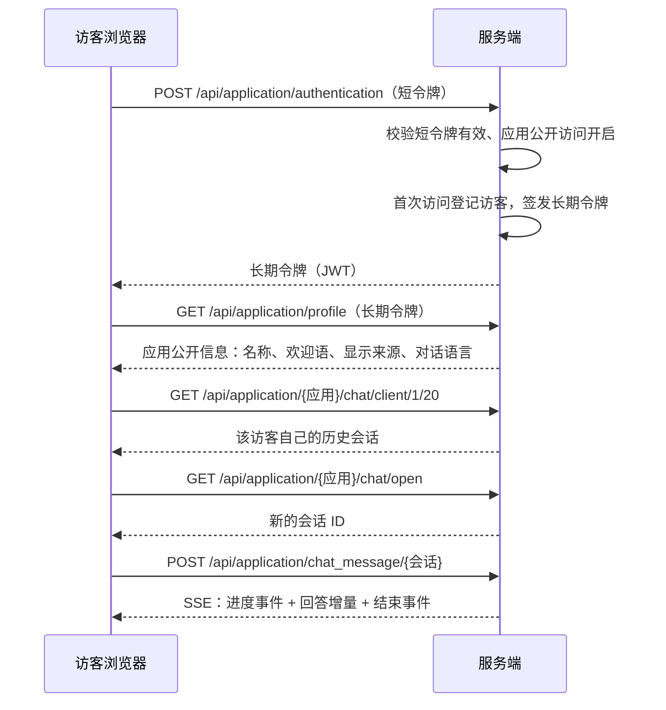

# 独立对话页

[[toc]]

本章说明如何把一个应用以公开链接的形式发给外部访客使用：访客打开分享地址即可直接对话，不需要注册、不需要登录，也看不到后台的任何管理入口。这条链路在代码里对应「公开访问链接 + 访客会话」，本章只讲这一条链路；对话日志的写入、检索与导出见[对话日志](./24.md)。

## 一、这个页面是什么

应用管理里有两种「能对话的页面」，它们的数据完全隔离，不要混为一谈：

| 页面 | 打开方式 | 会话类型 | 谁在用 |
| --- | --- | --- | --- |
| 应用调试页 | 应用详情页里点**演示 / Preview**，地址栏停在应用详情上，会话由创建接口临时建立 | `chat_type = 1` | 应用所有者，用来验证提示词与知识库效果 |
| 独立对话页 | 应用概览里复制**公开链接**发给他人，地址形如 `/ui/#/chat/{访问令牌}` | `chat_type = 0` | 拿到链接的任何人（访客） |

两者的问答界面长得很像，区别在会话类型：调试会话把应用配置整体快照写进临时表，改配置立即生效但不进日志；正式会话只记应用 ID，读的是应用表里的当前配置，会进入对话日志、统计与清理策略。**对外分享请只用公开链接**，调试页是给应用作者自己看的。

独立对话页的现成例子：`http://127.0.0.1:3000/ui/#/chat/7335647387278176`，其中 `7335647387278176` 就是该应用的访问令牌。

## 二、公开链接从哪里来

公开链接在**应用概览**页维护：

- 地址 = 当前站点根地址 + `/ui/#/chat/` + 该应用的访问令牌；
- 右上角的开关控制这条链接是否可用，关掉后访客访问会拿到错误提示；
- 令牌右侧的复制按钮用于把链接发给别人，刷新按钮用于**作废旧链接并换一个新的令牌**；
- 公开链接与 API Key 是两套凭证：前者给网页访客用，后者给第三方程序调用接口用，见 [api 管理](./26.md)。


链接里的令牌是应用自己的不透明数字串，与登录令牌无关，泄露了也不会拿到后台权限；真泄露了就点刷新换一个，旧令牌立刻失效。

## 三、一次访客对话的完整流程



页面上的效果：


左侧是访客自己的历史会话，可以新建、重命名、删除；右侧是问答区，回答下方带知识来源、消耗 tokens 与耗时；页面顶部只有应用名称，没有任何后台菜单。来源里的文档卡片可以直接点开，按分段查看该文档的正文，访客身份同样可用，见[分段预览](./29.md)。

## 四、访客身份与鉴权

访客没有账号，服务端用「一次登记、长期复用」的方式给他一个身份：

1. 页面带上链接里的短令牌请求认证接口；
2. 服务端校验短令牌：记录存在、未删除、公开访问处于启用状态；
3. 浏览器里若已有可用的长期令牌，且该访客与本应用已经建立过关系，直接沿用；
4. 否则新建一个访客身份，签发长期令牌并写入访客表，返回长期令牌。

```java
package nexus.io.mosskb.service.kb;

import com.jfinal.kit.Kv;

import nexus.io.db.activerecord.Db;
import nexus.io.db.activerecord.Row;
import nexus.io.jfinal.aop.Aop;
import nexus.io.mosskb.model.MossKbApplicationPublicAccessClient;
import nexus.io.mosskb.service.MossKbAuthService;
import nexus.io.model.result.ResultVo;
import nexus.io.tio.boot.admin.utils.TioAdminEnvUtils;
import nexus.io.tio.utils.jwt.JwtUtils;
import nexus.io.tio.utils.snowflake.SnowflakeIdUtils;
import nexus.io.tio.utils.token.TokenManager;

/** 公开链接的认证入口：短令牌换长期令牌，首次访问时登记访客。 */
public ResultVo authentication(Long shortToken, String longToken) {
  Row token = Db.findFirst(FIND_BY_TOKEN, shortToken);
  if (token == null) {
    return ResultVo.fail("not found applicaiton id:" + shortToken);
  }
  Long applicationId = token.getLong("application_id");
  Long clientId = Aop.get(MossKbAuthService.class).getIdByToken(longToken);
  if (clientId != null && Db.queryLong("select count(*) from moss_kb_application_public_access_client where application_id=? and client_id=?",
      applicationId, clientId) > 0) {
    return ResultVo.ok(longToken);
  }
  return ResultVo.ok(bindClient(applicationId, token.getStr("language")));
}
```

长期令牌由服务端的密钥签发，带上它就能访问分享页用到的那几个接口；令牌里的身份是访客 ID，不是后台账号，因此拿不到任何管理接口。访客记录只用于统计与后续的访问控制，不保存姓名、手机号这类资料。

请求拦截器按路径放行分享页需要的最小集合，其余一律拒绝：

```java
package nexus.io.mosskb.inteceptor;

import java.util.regex.Pattern;

/** 没有本地账号的令牌仍可访问的路径，用于分享对话。 */
private static final String[] PUBLIC_PATHS = {"/api/application/profile"};

/** 没有本地账号的令牌仍可访问的路径，用于分享对话。 */
private static final Pattern[] PUBLIC_PATH_PATTERNS = {
    Pattern.compile("/api/application/\\d+/chat/open"),
    Pattern.compile("/api/application/chat_message/\\d+"),
    Pattern.compile("/api/application/\\d+/chat/\\d+/context(/compact)?"),
    Pattern.compile("/api/application/\\d+/chat/client/\\d+(/\\d+)?"),
    Pattern.compile("/api/application/\\d+/chat/\\d+/chat_record/\\d+/\\d+"),
    Pattern.compile("/api/application/\\d+/chat/\\d+/chat_record/\\d+(/vote)?")};
```

放行的只是「路径形状」，不是「谁都能读」：每个业务方法内部还会做一次会话归属校验，访客只能读写 `client_id` 属于自己的会话。

## 五、接口清单

| 方法与路径 | 认证 | 行为 |
| --- | --- | --- |
| `POST /api/application/authentication` | 短令牌 | 短令牌换长期令牌，首次访问登记访客 |
| `GET /api/application/profile` | 长期令牌 | 应用公开信息，含显示来源开关与对话语言 |
| `GET /api/application/{应用ID}/access_token` | 登录令牌 | 读取公开链接配置 |
| `PUT /api/application/{应用ID}/access_token` | 登录令牌 | 修改公开链接配置：启停、重置令牌、来源显示、语言 |
| `GET /api/application/{应用ID}/chat/open` | 长期令牌 | 新建一个访客会话，返回会话 ID |
| `POST /api/application/chat_message/{会话ID}` | 长期令牌 | 提问，SSE 流式返回 |
| `GET /api/application/{应用ID}/chat/client/{页}/{条}` | 长期令牌 | 该访客的会话分页 |
| `GET /api/application/{应用ID}/chat/{会话}/chat_record/{页}/{条}` | 长期令牌 | 会话内的问答分页 |
| `GET /api/application/{应用ID}/chat/{会话}/chat_record/{记录}` | 长期令牌 | 单条回答详情，含引用与检索轨迹 |
| `PUT /api/application/{应用ID}/chat/{会话}/chat_record/{记录}/vote` | 长期令牌 | 点赞 / 点踩 |
| `PUT /api/application/{应用ID}/chat/client/{会话}` | 长期令牌 | 重命名会话 |
| `DELETE /api/application/{应用ID}/chat/client/{会话}` | 长期令牌 | 删除会话（只作用于访客自己的会话） |

认证与授权是两步：拦截器负责「这个令牌能不能到这条路径」，业务方法负责「这条会话是不是你的」。第二节的路径放行列表只解决第一步。

### 认证接口

```bash
curl -X POST "http://127.0.0.1:10060/api/application/authentication" \
  -H "Content-Type: application/json" \
  -d '{"access_token": 7335647387278176}'
```

```json
{
  "code": 200,
  "message": null,
  "data": "eyJhbGciOiJIUzI1NiIsInR5cCI6IkpXVCJ9…"
}
```

### 应用公开信息

```bash
curl "http://127.0.0.1:10060/api/application/profile" \
  -H "authorization: ${GUEST_TOKEN}"
```

```json
{
  "code": 200,
  "message": null,
  "data": {
    "id": "695640157413023744",
    "name": "政法多轮问答验证",
    "desc": "依据上传的行政复议法文档回答问题，验证连续追问与引用",
    "prologue": "您好，我是 XXX 小助手，您可以向我提出 XXX 使用问题。\n- XXX 主要功能有什么？\n- XXX 如何收费？",
    "dialogue_number": 5,
    "icon": null,
    "type": "SIMPLE",
    "work_flow": null,
    "show_source": true,
    "language": "zh-CN",
    "multiple_rounds_dialogue": true,
    "stt_model_enable": false,
    "tts_model_enable": false,
    "tts_type": "BROWSER"
  }
}
```

`dialogue_number` 决定追问时带入多少轮历史，`prologue` 是首次进入的欢迎语与推荐问题，`show_source` 决定回答下方是否展示知识来源，`language` 决定界面语言（为空时跟随访客浏览器语言）。

### 开始新会话

```bash
curl "http://127.0.0.1:10060/api/application/695640157413023744/chat/open" \
  -H "authorization: ${GUEST_TOKEN}"
```

```json
{ "code": 200, "message": null, "data": "695954186705608704" }
```

### 提问

```bash
curl -N -X POST "http://127.0.0.1:10060/api/application/chat_message/695954186705608704" \
  -H "authorization: ${GUEST_TOKEN}" \
  -H "Content-Type: application/json" \
  -d '{"message": "行政复议的一般申请期限是多久", "re_chat": false, "form_data": {}}'
```

流里先给过程事件，再给回答增量，最后给结束事件：

```text
event:agent_status
data:{"phase":"context","message":"正在读取会话上下文"}

event:agent_status
data:{"phase":"retrieving","round":1,"query":"行政复议的一般申请期限是多久"}

data:{"is_end":false,"chat_id":"695954186705608704","content":"根据","node_type":"ai-chat-node"}
data:{"is_end":false,"chat_id":"695954186705608704","content":"《中华人民共和国行政复议法》","node_type":"ai-chat-node"}
data:{"is_end":true,"chat_id":"695954186705608704","chat_record_id":"695954187593580544","content":""}
```

前端的处理要点是「一个中文字符可能被网络切成多个数据块」，因此不能按块解析，要先把数据攒起来再按事件边界切分：

```ts
const decoder = new TextDecoder('utf-8')
const write_stream = ({ done, value }: { done: boolean; value: any }) => {
  let str = decoder.decode(value, { stream: true })
  tempResult += str
  // 一次网络数据块不保证正好是一个完整事件，按 data:…\n\n 的边界切
  const split = tempResult.match(/(?:event:[^\n]*\r?\n)?data:[^\n]*\r?\n\r?\n/g)
  if (split) {
    str = split.join('')
    tempResult = tempResult.replace(str, '')
  } else {
    return reader.read().then(write_stream)
  }
  // …
}
```

### 会话与记录

```bash
# 该访客的历史会话
curl "http://127.0.0.1:10060/api/application/695640157413023744/chat/client/1/20" \
  -H "authorization: ${GUEST_TOKEN}"

# 会话内的问答（升序取第一页）
curl "http://127.0.0.1:10060/api/application/695640157413023744/chat/695954186705608704/chat_record/1/20?order_asc=true" \
  -H "authorization: ${GUEST_TOKEN}"
```

会话分页只返回 `client_id` 为当前访客、且 `chat_type = 0` 的记录，所以同一个应用的两个访客互相看不到对方的对话；换一个应用 ID 去读同一会话同样会被拒绝。

## 六、公开链接配置接口

前端在应用概览上做的三件事——拨动开关、刷新令牌、修改显示设置——都会落到同一个写入接口上。请求体里出现哪个字段就改哪个字段，没出现的保持原值：

```java
package nexus.io.mosskb.controller;

import com.alibaba.fastjson2.JSONObject;

import nexus.io.annotation.Get;
import nexus.io.annotation.Put;
import nexus.io.annotation.RequestPath;
import nexus.io.jfinal.aop.Aop;
import nexus.io.mosskb.service.kb.MossKbApplicationAccessTokenService;
import nexus.io.model.result.ResultVo;
import nexus.io.tio.boot.http.TioRequestContext;
import nexus.io.tio.http.common.HttpRequest;
import nexus.io.tio.utils.hutool.StrUtil;
import nexus.io.tio.utils.json.FastJson2Utils;

@RequestPath("/api/application")
public class ApiApplicationController {

  @Get("/{applicationId}/access_token")
  public ResultVo getAccessToken(Long applicationId) {
    if (!nexus.io.mosskb.service.kb.ApplicationAccess.owns(TioRequestContext.getUserIdLong(), applicationId)) {
      return ResultVo.fail("无权访问应用");
    }
    return Aop.get(MossKbApplicationAccessTokenService.class).getById(applicationId);
  }

  /** 公开访问链接配置：启停、重置短令牌、访问次数、白名单与对话语言。 */
  @Put("/{applicationId}/access_token")
  public ResultVo updateAccessToken(Long applicationId, HttpRequest request) {
    return Aop.get(MossKbApplicationAccessTokenService.class).update(TioRequestContext.getUserIdLong(), applicationId,
        body(request));
  }

  private JSONObject body(HttpRequest request) {
    String bodyString = request.getBodyString();
    return StrUtil.isBlank(bodyString) ? new JSONObject() : FastJson2Utils.parseObject(bodyString);
  }
}
```

可写字段：

| 字段 | 类型 | 说明 |
| --- | --- | --- |
| `is_active` | 布尔 | 公开链接是否可用；关闭后短令牌立即失效 |
| `access_token_reset` | 布尔 | 置为 `true` 时换一个新的访问令牌，旧链接立刻作废 |
| `show_source` | 布尔 | 回答下方是否展示知识来源 |
| `language` | 字符串 | 对话语言，取值 `en-US`、`zh-CN`、`zh-Hant`，传空表示跟随浏览器 |
| `access_num` | 整数 | 允许的访问次数，`0` 表示不限 |
| `white_active` | 布尔 | 是否启用来源白名单 |
| `white_list` | 字符串数组 | 白名单条目，最多 32 条 |

服务层的写入沿用「请求里有什么就改什么」的写法，条件永远是应用 ID：

```java
package nexus.io.mosskb.service.kb;

import java.util.ArrayList;
import java.util.List;

import com.alibaba.fastjson2.JSONArray;
import com.alibaba.fastjson2.JSONObject;

import nexus.io.db.activerecord.Db;
import nexus.io.model.result.ResultVo;
import nexus.io.tio.utils.hutool.StrUtil;
import nexus.io.tio.utils.mcid.McIdUtils;

  /** 公开链接的写入：只改请求里出现的字段，未出现的保持原值。 */
  public ResultVo update(Long userId, Long applicationId, JSONObject input) {
    if (!ApplicationAccess.owns(userId, applicationId)) {
      return ResultVo.fail("应用不存在或无权访问");
    }
    if (Db.queryLong("select count(*) from moss_kb_application_access_token where application_id=? and deleted=0",
        applicationId) == 0) {
      return ResultVo.fail("公开访问链接不存在");
    }
    List<String> assignments = new ArrayList<>();
    List<Object> args = new ArrayList<>();
    if (input.containsKey("is_active")) {
      assignments.add("is_active = ?");
      args.add(Boolean.TRUE.equals(input.getBoolean("is_active")));
    }
    if (Boolean.TRUE.equals(input.getBoolean("access_token_reset"))) {
      assignments.add("access_token = ?");
      args.add(McIdUtils.id());
    }
    if (input.containsKey("show_source")) {
      assignments.add("show_source = ?");
      args.add(Boolean.TRUE.equals(input.getBoolean("show_source")));
    }
    if (input.containsKey("language")) {
      String language = input.getString("language");
      if (StrUtil.isNotBlank(language) && !SUPPORTED_LANGUAGES.contains(language)) {
        return ResultVo.fail("不支持的语言：" + language);
      }
      assignments.add("language = ?");
      args.add(StrUtil.isBlank(language) ? null : language);
    }
    if (assignments.isEmpty()) {
      return getById(applicationId);
    }
    assignments.add("update_time = now()");
    args.add(applicationId);
    Db.update("update moss_kb_application_access_token set " + String.join(", ", assignments)
        + " where application_id = ? and deleted = 0", args.toArray());
    return getById(applicationId);
  }
```

语言在白名单里校验，避免把任意文本写进数据库，也避免前端拿到它渲染不出来的取值：

```java
  /** 界面支持的语言，与前端语言包目录同名；留空表示跟随访客浏览器语言。 */
  private static final List<String> SUPPORTED_LANGUAGES = List.of("en-US", "zh-CN", "zh-Hant");
```

命令行改配置同样方便，改完立即生效：

```bash
TOKEN="<登录令牌>"
APP=695640157413023744

# 关闭公开访问（旧链接立刻不可用）
curl -X PUT "http://127.0.0.1:10060/api/application/${APP}/access_token" \
  -H "authorization: ${TOKEN}" -H "Content-Type: application/json" \
  -d '{"is_active": false}'

# 换一个新的访问令牌（旧链接立刻作废）
curl -X PUT "http://127.0.0.1:10060/api/application/${APP}/access_token" \
  -H "authorization: ${TOKEN}" -H "Content-Type: application/json" \
  -d '{"access_token_reset": true}'

# 展示知识来源，并把对话语言固定为简体中文
curl -X PUT "http://127.0.0.1:10060/api/application/${APP}/access_token" \
  -H "authorization: ${TOKEN}" -H "Content-Type: application/json" \
  -d '{"show_source": true, "language": "zh-CN"}'
```

写入接口返回修改后的完整配置，前端直接拿它刷新界面：

```json
{
  "code": 200,
  "message": null,
  "data": {
    "application_id": "695640157413023744",
    "access_token": "7335647387278176",
    "is_active": true,
    "access_num": 100,
    "white_active": false,
    "white_list": [],
    "show_source": true,
    "language": "zh-CN",
    "create_time": 1790929537923,
    "update_time": 1791004873064
  }
}
```

非法取值会被挡下，不写库：

```json
{ "code": 400, "message": "不支持的语言：fr-FR", "data": null }
```

## 七、对话语言

`language` 是分享页唯一影响渲染的配置项：

- 页面加载时先用 `language` 覆盖界面语言，因此同一条链接对所有人显示同一种语言；
- 传空值时跟随访客浏览器语言，浏览器是中文就是中文、是英文就是英文；
- **只改界面文案，不改应用内容**：欢迎语、推荐问题、回答语言都属于应用自身配置，切语言不会把它们一起翻译。

前端在拿到应用公开信息后就地切换语言：

```ts
import useStore from '@/stores'
import { getBrowserLang } from '@/locales/index'
import { useI18n } from 'vue-i18n'

const { locale } = useI18n({ useScope: 'global' })
const { application, user } = useStore()
const application_profile = ref<any>({})

function getAppProfile() {
  return application.asyncGetAppProfile(loading).then((res: any) => {
    locale.value = res.data?.language || getBrowserLang()
    application_profile.value = res.data
  })
}
```

## 八、隔离与安全

访客能做的事被限制在很小的范围内：

| 边界 | 做法 |
| --- | --- |
| 看不到后台 | 令牌里是访客身份，拦截器只放行分享页的几个路径，其余返回 403 |
| 看不到别人的会话 | 会话与问答的读写都带 `client_id` 与 `chat_type = 0` 条件 |
| 换应用 ID 也读不到 | 会话归属校验同时比对 `application_id` 与 `chat_id` |
| 链接可随时作废 | 关掉开关或重置令牌，旧链接立刻失效，无需等缓存 |
| 拿不到后台权限 | 访客身份与后台账号是两套体系，不共享角色与权限 |

会话的归属判断集中在同一处，管理端、分享端、提问接口共用：

```java
package nexus.io.mosskb.service.kb;

import nexus.io.db.activerecord.Db;
import nexus.io.db.activerecord.Row;

public final class ApplicationAccess {

  public static boolean canChat(Long clientId, Long applicationId) {
    if (owns(clientId, applicationId)) {
      return true;
    }
    return clientId != null && Db.queryLong("select count(*) from moss_kb_application_public_access_client c join moss_kb_application_access_token t on t.application_id=c.application_id where c.client_id=? and c.application_id=? and t.is_active=true and t.deleted=0", clientId, applicationId) > 0;
  }

  public static boolean canReadChat(Long clientId, Long applicationId, Long chatId) {
    Row chat = Db.findById("moss_kb_application_chat", chatId);
    return chat != null && !Boolean.TRUE.equals(chat.getBoolean("is_deleted")) && applicationId.equals(chat.getLong("application_id"))
        && (owns(clientId, applicationId) || (canChat(clientId, applicationId) && clientId.equals(chat.getLong("client_id"))));
  }
}
```

## 九、数据表

公开链接一个应用一行，主键就是应用 ID：

```sql
CREATE TABLE IF NOT EXISTS "public"."moss_kb_application_access_token" (
  "application_id" BIGINT PRIMARY KEY,
  "access_token" BIGINT NOT NULL,
  "is_active" BOOLEAN NOT NULL,
  "access_num" INT NOT NULL,
  "white_active" BOOLEAN NOT NULL,
  "white_list" VARCHAR[] NOT NULL,
  "show_source" BOOLEAN NOT NULL,
  "language" VARCHAR(16),
  "remark" VARCHAR(256),
  "creator" VARCHAR(64) DEFAULT '',
  "create_time" TIMESTAMP WITH TIME ZONE NOT NULL DEFAULT CURRENT_TIMESTAMP,
  "updater" VARCHAR(64) DEFAULT '',
  "update_time" TIMESTAMP WITH TIME ZONE NOT NULL DEFAULT CURRENT_TIMESTAMP,
  "deleted" SMALLINT DEFAULT 0,
  "tenant_id" BIGINT NOT NULL DEFAULT 0
);

CREATE INDEX IF NOT EXISTS "moss_kb_application_access_token_access_token"
  ON "public"."moss_kb_application_access_token" USING btree ("access_token");
```

访客登记表记录「谁在哪个应用上访问过多少次」，用于统计与后续的访问控制：

```sql
CREATE TABLE IF NOT EXISTS "public"."moss_kb_application_public_access_client" (
  "id" BIGINT PRIMARY KEY,
  "access_num" INT NOT NULL,
  "intraday_access_num" INT NOT NULL,
  "application_id" BIGINT NOT NULL,
  "client_id" BIGINT,
  "creator" VARCHAR(64) DEFAULT '',
  "create_time" TIMESTAMP WITH TIME ZONE NOT NULL DEFAULT CURRENT_TIMESTAMP,
  "updater" VARCHAR(64) DEFAULT '',
  "update_time" TIMESTAMP WITH TIME ZONE NOT NULL DEFAULT CURRENT_TIMESTAMP,
  "deleted" SMALLINT DEFAULT 0,
  "tenant_id" BIGINT NOT NULL DEFAULT 0
);
```

字段取值约定：`access_token` 是应用级的不透明数字串，随机生成、全局唯一；`is_active` 关闭后该应用的公开链接整体不可用；`language` 为空表示跟随浏览器；`white_active` 与 `white_list` 保存来源白名单配置；`access_num` 保存访问次数配置，`0` 表示不限。

`language` 列由建表脚本一并创建，重新执行可重复执行的初始化脚本即可给已有库补上：

```sql
BEGIN;

ALTER TABLE moss_kb_application_access_token
  ADD COLUMN IF NOT EXISTS language VARCHAR(16);

COMMENT ON COLUMN moss_kb_application_access_token.language IS '公开分享链接的对话语言，为空表示跟随浏览器语言';

COMMIT;
```

## 十、前端对应实现

前端不需要为分享页单独写一套页面：同一个对话组件按地址参数决定用哪种布局，PC、移动、嵌入三种模板共用一套逻辑。

分享地址由当前站点地址拼出来，不写死主机名，因此换域名或换端口后链接自动跟着变：

```ts
import { defineStore } from 'pinia'

const useApplicationStore = defineStore({
  id: 'application',
  state: () => ({
    // 分享地址前缀：当前站点 + /ui/#/chat/
    location: `${window.location.origin}/ui/#/chat/`
  })
})
```

应用概览把令牌拼到前缀后面，构成最终分享地址：

```ts
import { computed, ref } from 'vue'
import { useRoute } from 'vue-router'
import useStore from '@/stores'

const { user, application } = useStore()
const route = useRoute()
const { params: { id } } = route as any
const accessToken = ref<any>({})

const shareUrl = computed(() => application.location + accessToken.value.access_token)
```

访客令牌的保存位置与登录令牌分开，互不覆盖：

```ts
async asyncAppAuthentication(token: string, loading?: Ref<boolean>, authentication_value?: any) {
  return new Promise((resolve, reject) => {
    applicationApi
      .postAppAuthentication(token, loading, authentication_value)
      .then((res) => {
        localStorage.setItem(`${token}-accessToken`, res.data)
        sessionStorage.setItem(`${token}-accessToken`, res.data)
        resolve(res)
      })
      .catch((error) => reject(error))
  })
}
```

请求时按令牌来源自动选取：后台页面用登录令牌，分享页用该访问令牌对应的长期令牌：

```ts
import useStore from '@/stores'

getToken(): String | null {
  if (this.token) {
    return this.token
  }
  return this.userType === 1 ? localStorage.getItem('token') : this.getAccessToken()
}
```

## 十一、实际验证

验证在浏览器里完成，应用为公开政法资料问答应用，公开链接为 `http://127.0.0.1:3000/ui/#/chat/7335647387278176`。

| 操作 | 观察结果 |
| --- | --- |
| 用无痕身份打开公开链接 | 直接进入对话页，未出现登录或认证弹窗 |
| 页面信息 | 标题为应用名，界面文案为简体中文（配置的对话语言），欢迎语与应用内配置的推荐问题保持应用自身的原文 |
| 提问「行政复议的一般申请期限是多久」 | 回答引用《中华人民共和国行政复议法》第二十条，给出「六十日内」，显示检索过程 1 轮、引用分段 5、消耗 tokens 10559、耗时 1.71 秒 |
| 刷新页面 | 左侧历史记录仍在，当轮问答与引用完整恢复，说明访客身份被复用而不是新建 |
| 关闭公开访问后重新打开链接 | 页面提示服务暂不可用，提问入口不可用 |
| 重新开启公开访问 | 链接恢复可用，历史记录仍在 |
| 重置访问令牌后访问旧链接 | 认证接口返回「找不到应用」，旧链接失效 |
| 配置文件写入 | 中文以外的语言取值返回「不支持的语言」，库内记录不变 |
| 越权写入 | 用另一个普通账号读写他人应用的链接配置返回 403，管理员侧配置保持不变 |
| 越权提问 | 用访客令牌请求管理接口返回 403，请求他人会话由会话归属校验拒绝 |

浏览器实测的问答页见本章第三节的截图，公开链接入口见第二节的截图。

## 十二、已知边界

- **访客之间互不可见**：同一个应用的两个访客各自只看到自己的会话，这是隔离的代价，也是打开公开链接时的预期行为。
- **公开链接不绑定账号**：拿到链接的人都能对话，需要限制时用白名单与访问次数配置；需要更强的准入时，应在反向代理或网关层再加一层校验。这两项配置的落地方式见[嵌入第三方web系统](./28.md)。
- **对话语言是界面语言**：它不改变回答语言，回答语言由应用配置的模型与提示词决定。
- **访客会话同样计入日志与清理策略**：分享页产生的会话会出现在对话日志里，也会被保留天数策略清理，见[对话日志](./24.md)。
- **应用被删除后链接失效**：访客名单与公开链接记录仍在库里，需要清理时可以按应用 ID 一并删除。

## 十三、部署提示

- 分享地址使用浏览器当前地址拼接，因此用域名访问时分享出去的链接就是域名，不需要改配置；反向代理需要同时转发 `/api` 与 `/ui/`。
- 公开链接的写入接口只允许应用所有者调用，越权请求在归属校验处被拒绝，不需要额外配置。
- 数据库初始化脚本已包含 `language` 列的迁移，可重复执行；已有库执行一次即可。
- 前端沿用官方界面即可对接上述接口，无需为分享页单独发布一个站点。
