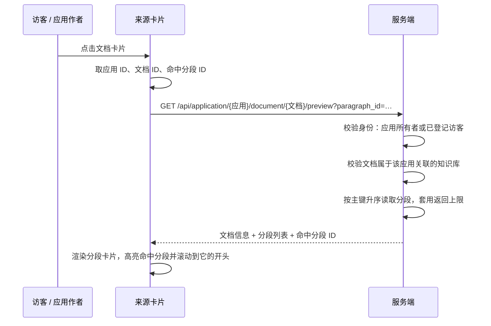

# 分段预览

[[toc]]

回答下方的「知识来源」只给出文档名，看不到引用内容的上下文。本章补上**分段预览**：点一下来源里的文档卡片，弹窗按分段逐张列出该文档的全部分段，并把本次回答真正引用到的那个分段高亮出来、滚动到它的开头。核对回答时不用再跳回知识库文档页翻分段列表。

分段是知识库的最小检索单元，所以预览以分段为单位而不是把整篇文档揉成一段连续正文：每张卡片对应一个分段，带自己的序号、标题、正文与启用状态。需要看原文版式、表格或扫描件时，从本章弹窗头部的文档名进[文档预览](./30.md)。公开链接、访客身份见[独立对话页](./27.md)，嵌入第三方页面见[嵌入第三方 web 系统](./28.md)，本章的预览入口就是这两个页面回答下方的来源卡片。

## 一、功能位置与效果

一次问答结束后，回答下方会出现「知识来源」区块：左边是引用分段按钮，右边是本次用到的文档卡片。


卡片本身带 `cursor` 指针与「点击预览分段」的悬停提示，点击后弹出分段预览窗口，窗口会自动定位到命中分段：


继续往下滚可以看到分段之间的边界，每个分段是一张独立卡片：


弹窗由三部分组成：

| 区域 | 内容 |
| --- | --- |
| 头部 | 文档图标、文档名（**可点击**，在新标签页打开[文档预览](./30.md)）、文件类型标签、所属知识库名、`已展示分段 / 文档总分段`，以及右侧的「预览全文」按钮 |
| 分段卡片 | 每张卡片一张分段：左侧序号、标题（没有标题时显示「未命名分段」）、命中标记、停用标记、正文字数，卡片正文按 Markdown 渲染 |
| 提示条 | 文档超过返回上限时出现的告警条，说明只展示了部分分段 |

头部的文档名与「预览全文」按钮都只是**入口**：分段预览本身仍然只看分段，点它们会在新标签页打开文档全文，两者的分工见[文档预览](./30.md)。

从点击到渲染，一共一次请求：



## 二、接口约定

预览接口按**应用**维度开放，而不是按知识库维度：

```text
GET /api/application/{applicationId}/document/{documentId}/preview?paragraph_id={分段ID}
```

| 参数 | 位置 | 必填 | 说明 |
| --- | --- | --- | --- |
| `applicationId` | 路径 | 是 | 当前对话所属应用，用来校验文档是否属于该应用关联的知识库 |
| `documentId` | 路径 | 是 | 来源卡片上的文档 ID，与对话记录里 `paragraph_list[].document_id` 一致 |
| `paragraph_id` | 查询串 | 否 | 本次回答命中的分段 ID，服务端只回传，由前端做高亮与滚动定位 |

返回体在统一的 `ResultVo` 信封里，`data` 结构如下：

```json
{
  "code": 200,
  "message": null,
  "data": {
    "document_id": "695639883218788352",
    "document_name": "中华人民共和国行政复议法.docx",
    "document_type": "docx",
    "dataset_id": "695638732989636608",
    "dataset_name": "政法文档验证",
    "paragraph_count": 8,
    "preview_paragraph_count": 8,
    "char_length": 13297,
    "hit_paragraph_id": "695639888776241152",
    "truncated": false,
    "paragraphs": [
      {
        "id": "695639883290091520",
        "title": "",
        "content": "中华人民共和国行政复议法\n\n目　　录\n\n第一章　总　　则……",
        "is_active": true
      }
    ]
  }
}
```

| 字段 | 说明 |
| --- | --- |
| `document_name` / `document_type` | 文档名与后缀，前端据此取文件图标 |
| `dataset_name` | 知识库名，同名文档分布在不同知识库时用于区分 |
| `paragraph_count` | 文档记录上的分段总数 |
| `preview_paragraph_count` | 本次真正返回的分段数，被截断时小于总数 |
| `char_length` | 文档记录上的正文字符数 |
| `hit_paragraph_id` | 原样回传的命中分段 ID，未传时为 `null` |
| `truncated` | 是否因为返回上限只给了前面一部分分段 |
| `paragraphs[]` | 分段数组，一项就是一张卡片：`id`、`title`、`content`、`is_active` |

`paragraphs` 的顺序就是文档里的分段顺序，前端不再排序，直接按数组顺序编号。`id`、`document_id`、`dataset_id` 这类雪花 ID 在 JSON 里统一是**字符串**，前端不要把它们转成数字再比较：`695639888776241152` 超出双精度整数的安全范围，转成数字会丢精度。

## 三、为什么挂在应用维度

预览是「对话来源」的延伸，而对话可能发生在两类页面上：

- 应用调试页：登录用户，身份就是应用所有者或管理员；
- 公开链接 / 嵌入页：没有账号的访客，只有一张访问令牌。

访客令牌不是账号令牌，认证拦截器只放行公开路径。因此预览接口挂在 `/api/application/{applicationId}/...` 下，并在拦截器里登记为公开路径：

```java
import java.util.regex.Pattern;

/** Paths a token without a local account may still reach, for shared chat links. */
private static final Pattern[] PUBLIC_PATH_PATTERNS = {
    Pattern.compile("/api/application/\\d+/chat/open"),
    Pattern.compile("/api/application/chat_message/\\d+"),
    Pattern.compile("/api/application/\\d+/chat/\\d+/context(/compact)?"),
    Pattern.compile("/api/application/\\d+/chat/client/\\d+(/\\d+)?"),
    Pattern.compile("/api/application/\\d+/chat/\\d+/chat_record/\\d+/\\d+"),
    Pattern.compile("/api/application/\\d+/chat/\\d+/chat_record/\\d+(/vote)?"),
    Pattern.compile("/api/application/\\d+/document/\\d+/preview")};
```

放行不等于放开，控制器方法还要过两道校验，缺一不可：

| 校验 | 规则 | 失败返回 |
| --- | --- | --- |
| 身份 | 应用所有者，或已在公开访问链接下登记过的访客 | `应用不存在或无权访问` |
| 对象归属 | 文档所属知识库必须与该应用存在关联记录 | `文档不存在或不属于该应用的知识库` |

第二道校验是这条接口的关键：只有「应用关联的知识库」里的文档才能被读到，访客即使猜到别的文档 ID，也拿不到未关联知识库的分段正文，所以来源卡片之外不构成新的越权面。

## 四、服务端实现

### 4.1 控制器方法

```java
package nexus.io.maxkb.controller;

import nexus.io.annotation.Get;
import nexus.io.annotation.RequestPath;
import nexus.io.jfinal.aop.Aop;
import nexus.io.model.result.ResultVo;
import nexus.io.tio.boot.http.TioRequestContext;
import nexus.io.tio.http.common.HttpRequest;

@RequestPath("/api/application")
public class ApiApplicationController {

  @Get("/{applicationId}/document/{documentId}/preview")
  public ResultVo previewDocument(Long applicationId, Long documentId, HttpRequest request) {
    Long clientId = TioRequestContext.getUserIdLong();
    return Aop.get(nexus.io.maxkb.service.kb.MaxKbDocumentService.class).preview(clientId, applicationId, documentId,
        request.getLong("paragraph_id"));
  }
}
```

`TioRequestContext.getUserIdLong()` 取的是当前请求身份：登录用户是自己的用户 ID，访客是访客 ID，服务层只需要认识「客户端 ID」这一种身份。

### 4.2 两条 SQL

两条语句都用 Java 21 的文本块书写，多行缩进与换行在源码里保持可读：

```java
package nexus.io.maxkb.service.kb;

/**
 * 文档必须同时属于该应用关联的知识库，访客才看不到未关联文档的内容。
 */
private static final String FIND_APPLICATION_DOCUMENT = """
    select d.id,
           d.name,
           d.type,
           d.dataset_id,
           d.char_length,
           d.paragraph_count,
           s.name as dataset_name
      from max_kb_document d
      join max_kb_application_dataset_mapping m on m.dataset_id = d.dataset_id
 left join max_kb_dataset s on s.id = d.dataset_id
     where m.application_id = ?
       and d.id = ?
     limit 1
    """;

/**
 * 分段没有单独的顺序列，主键由雪花算法递增生成，按主键升序即导入顺序。
 */
private static final String FIND_PREVIEW_PARAGRAPHS = """
    select id,
           title,
           content,
           is_active
      from max_kb_paragraph
     where document_id = ?
       and deleted = 0
     order by id
     limit ?
    """;
```

分段表没有 `index` 之类的排序列，一次导入生成的主键单调递增，`order by id` 就是文档里的自然顺序；后续在文档里插入分段会排到末尾，这一点与分段管理页的展示顺序一致。

### 4.3 预览方法

```java
package nexus.io.maxkb.service.kb;

import java.util.ArrayList;
import java.util.List;

import com.jfinal.kit.Kv;

import nexus.io.db.activerecord.Db;
import nexus.io.db.activerecord.Row;
import nexus.io.model.result.ResultVo;

/** 预览一次最多返回的分段数，避免超长文档把整篇正文发给浏览器。 */
private static final int PREVIEW_PARAGRAPH_LIMIT = 1000;

/** 预览一次最多返回的正文字符数，达到上限后只保留前面的分段。 */
private static final int PREVIEW_CHAR_LIMIT = 200_000;

public ResultVo preview(Long clientId, Long applicationId, Long documentId, Long paragraphId) {
  if (applicationId == null || documentId == null) {
    return ResultVo.fail("缺少应用或文档标识");
  }
  if (!ApplicationAccess.owns(clientId, applicationId) && !ApplicationAccess.canChat(clientId, applicationId)) {
    return ResultVo.fail("应用不存在或无权访问");
  }
  Row document = Db.findFirst(FIND_APPLICATION_DOCUMENT, applicationId, documentId);
  if (document == null) {
    return ResultVo.fail("文档不存在或不属于该应用的知识库");
  }

  // 多取一条用于判断是否被分段数上限截断。
  List<Row> records = Db.find(FIND_PREVIEW_PARAGRAPHS, documentId, PREVIEW_PARAGRAPH_LIMIT + 1);
  List<Kv> paragraphs = new ArrayList<>();
  boolean truncated = records.size() > PREVIEW_PARAGRAPH_LIMIT;
  int charLength = 0;
  for (Row record : records) {
    if (paragraphs.size() >= PREVIEW_PARAGRAPH_LIMIT || charLength >= PREVIEW_CHAR_LIMIT) {
      truncated = true;
      break;
    }
    String content = record.getStr("content");
    paragraphs.add(Kv.by("id", record.getLong("id"))
        .set("title", record.getStr("title"))
        .set("content", content)
        .set("is_active", record.getBoolean("is_active")));
    if (content != null) {
      charLength += content.length();
    }
  }

  Kv data = Kv.by("document_id", document.getLong("id"))
      .set("document_name", document.getStr("name"))
      .set("document_type", document.getStr("type"))
      .set("dataset_id", document.getLong("dataset_id"))
      .set("dataset_name", document.getStr("dataset_name"))
      .set("paragraph_count", document.getInt("paragraph_count"))
      .set("preview_paragraph_count", paragraphs.size())
      .set("char_length", document.getInt("char_length"))
      .set("hit_paragraph_id", paragraphId)
      .set("truncated", truncated)
      .set("paragraphs", paragraphs);
  return ResultVo.ok(data);
}
```

几个取舍：

- **两个上限同时生效**。分段数上限挡住「几百个短分段」的文档，字符数上限挡住「十个超长分段」的文档；命中任一上限即停止追加，`truncated` 置为 `true`，前端显示提示条而不是静默少给内容。
- **SQL 里多取一条**。`limit` 传 `PREVIEW_PARAGRAPH_LIMIT + 1`，查到第 1001 条就说明被截断，不需要再发一次 `count` 查询。
- **只读不写**。预览不修改分段状态、不写访问日志，也不改变 `hit_num` 之类的检索统计，反复打开不会污染知识库数据。
- **未启用分段照样返回**。`is_active = false` 的分段已经不参与检索，但仍是文档的一部分，前端用「已停用」标签与半透明区分，避免用户以为内容丢了。

## 五、前端实现

### 5.1 卡片变成可点击

来源卡片原来只渲染文档名（有站点来源时渲染成外链），现在整张卡片挂上点击事件，并保留外链的原有点击行为：

```vue
<template>
  <el-col :span="12" class="mb-8">
    <el-card
      shadow="never"
      class="file-List-card cursor"
      data-width="40"
      :title="$t('chat.segmentPreview.clickTip')"
      @click="openSegmentPreview(item)"
    >
      <div class="flex-between">
        <div class="flex">
          
          <div class="ml-4 ellipsis-1" :title="item?.document_name" v-if="!item.source_url">
            <p>{{ item && item?.document_name }}</p>
          </div>
          <div class="ml-8" v-else>
            <a
              :href="getNormalizedUrl(item?.source_url)"
              target="_blank"
              class="ellipsis"
              :title="item?.document_name?.trim()"
              @click.stop
            >
              <span :title="item?.document_name?.trim()">{{ item?.document_name }}</span>
            </a>
          </div>
        </div>
      </div>
    </el-card>
  </el-col>
</template>
```

```ts
import { computed, ref } from 'vue'
import SegmentPreviewDialog from './SegmentPreviewDialog.vue'
import { getImgUrl, getNormalizedUrl } from '@/utils/utils'

const props = defineProps({
  data: {
    type: Object,
    default: () => {}
  },
  type: {
    type: String,
    default: ''
  },
  application: {
    type: Object,
    default: () => ({})
  }
})

const SegmentPreviewDialogRef = ref()

function openSegmentPreview(row: any) {
  const applicationId = props.application?.id
  if (!applicationId || !row?.document_id) {
    return
  }
  SegmentPreviewDialogRef.value.open(applicationId, row.document_id, row.id)
}
```

来源卡片去重后每张卡片代表一个文档，卡片对象上的 `id` 是列表中该文档第一个被引用的分段 ID，正好可以作为 `paragraph_id` 用来定位。应用 ID 由上层对话组件透传下来，`row.document_id` 来自对话记录里的 `paragraph_list`。

### 5.2 分段卡片

弹窗按分段列表渲染卡片，每张卡片的头部放序号、标题与状态标记，正文交给全局注册的 Markdown 预览组件：

```vue
<template>
  <div
    v-for="(item, index) in visibleSegments"
    :key="item.id"
    :ref="(el: any) => setSegmentRef(item.id, el)"
    class="segment-preview-item"
  >
    <el-card
      shadow="never"
      class="segment-preview-card"
      :class="{
        'is-hit': isHit(item),
        'is-disabled': item.is_active === false
      }"
    >
      <div class="segment-preview-card-header">
        <div class="segment-preview-card-title flex align-center">
          <AppAvatar class="mr-8 avatar-light" :size="22">{{ index + 1 }}</AppAvatar>
          <span class="ellipsis-1" :title="segmentTitle(item)">{{ segmentTitle(item) }}</span>
          <el-tag v-if="isHit(item)" class="ml-8" size="small" effect="dark">
            {{ $t('chat.segmentPreview.hit') }}
          </el-tag>
          <el-tag
            v-if="item.is_active === false"
            class="ml-8"
            size="small"
            type="info"
            effect="plain"
          >
            {{ $t('chat.segmentPreview.disabled') }}
          </el-tag>
        </div>
        <span class="segment-preview-length color-secondary">
          {{ (item.content || '').length }} {{ $t('chat.segmentPreview.chars') }}
        </span>
      </div>
      <div class="segment-preview-content">
        <MdPreview editorId="preview-only" :modelValue="item.content" noImgZoomIn />
      </div>
    </el-card>
  </div>
</template>
```

命中卡片用主色边框与浅色底突出，停用分段整张卡片降透明度：

```scss
.segment-preview-card {
  border-radius: 8px;

  &.is-hit {
    border-color: var(--el-color-primary);
    background: var(--el-color-primary-light-9);
  }

  &.is-disabled {
    opacity: 0.65;
  }
}
```

### 5.3 分批渲染与命中定位

一个文档可能有几百个分段，一次把 Markdown 全部渲染出来会卡住界面，所以先渲染前 50 个，剩下的点按钮继续加载；命中分段如果排在后面，先把它所在的那一批扩进来再滚动：

```ts
import { computed, ref, nextTick } from 'vue'
import { getImgUrl } from '@/utils/utils'
import applicationApi from '@/api/application'
import { t } from '@/locales'

/** 单次渲染的分段数，逐批渲染避免几百个分段一次性渲染卡住界面。 */
const RENDER_STEP = 50

const dialogVisible = ref(false)
const loading = ref(false)
const detail = ref<any>({})
const renderLimit = ref(RENDER_STEP)
// 分段元素按 id 暂存，加载完成后把命中分段滚动到可视区域。
const segmentRefs = new Map<string, any>()

const visibleSegments = computed(() => (detail.value.paragraphs || []).slice(0, renderLimit.value))
const hasMore = computed(() => (detail.value.paragraphs?.length || 0) > renderLimit.value)

const setSegmentRef = (id: string, el: any) => {
  if (el) {
    segmentRefs.set(id + '', el)
  }
}

const isHit = (item: any) => {
  return item?.id !== undefined && item.id + '' === detail.value.hit_paragraph_id + ''
}

const segmentTitle = (item: any) => {
  const title = item?.title?.trim()
  return title ? title : t('chat.segmentPreview.untitled')
}

const open = (applicationId: string, documentId: string, paragraphId?: string) => {
  segmentRefs.clear()
  renderLimit.value = RENDER_STEP
  detail.value = { hit_paragraph_id: paragraphId }
  dialogVisible.value = true
  loading.value = true
  applicationApi
    .getSegmentPreview(applicationId, documentId, paragraphId)
    .then((res: any) => {
      detail.value = res.data || {}
      expandToHitSegment()
      scrollToHitSegment()
    })
    .catch(() => {})
    .finally(() => {
      loading.value = false
    })
}

/** 命中分段排在本批渲染范围之外时先把它扩进来，否则滚不过去。 */
function expandToHitSegment() {
  const paragraphs = detail.value.paragraphs || []
  const hitIndex = paragraphs.findIndex((item: any) => isHit(item))
  if (hitIndex + 1 > renderLimit.value) {
    renderLimit.value = hitIndex + 1
  }
}

function scrollToHitSegment() {
  nextTick(() => {
    const hitId = detail.value.hit_paragraph_id
    if (!hitId) {
      return
    }
    const target = segmentRefs.get(hitId + '')
    if (target) {
      // 命中分段可能很长，对齐到分段开头更便于核对引用内容。
      target.scrollIntoView({ block: 'start' })
    }
  })
}

defineExpose({ open })
```

几个细节值得说明：

- **先开弹窗、再拉数据**。点了卡片立刻出现弹窗与加载态，长文档加载时用户知道系统在工作，不会以为点击没生效。
- **`hit_paragraph_id` 先写入本地状态**，接口返回后整体替换为服务端数据；请求失败时弹窗留在空态，不会显示上一次的文档内容。
- **命中判断用字符串比较**。服务端把雪花 ID 序列化成字符串，前端也按字符串比对，绕开大整数精度问题。
- **`scrollIntoView({ block: 'start' })`**。命中分段可能是整章正文，居中会让用户从中间开始读，对齐到分段开头更便于核对。
- **分批渲染不影响命中定位**。命中分段可能排在几百个分段之后，`expandToHitSegment` 先把它纳入渲染范围，滚动才有目标。

### 5.4 接口封装与文案

前端请求统一走 `get`，查询参数用对象传入，`undefined` 的参数不会出现在地址里：

```ts
import { Result } from '@/request/Result'
import { get } from '@/request/index'
import { type Ref } from 'vue'

const prefix = '/application'

/**
 * 分段预览
 * @param application_id 应用 id
 * @param document_id    文档 id
 * @param paragraph_id   需要高亮定位的分段 id，可省略
 */
const getSegmentPreview: (
  application_id: string,
  document_id: string,
  paragraph_id?: string,
  loading?: Ref<boolean>
) => Promise<Result<any>> = (application_id, document_id, paragraph_id, loading) => {
  return get(
    `${prefix}/${application_id}/document/${document_id}/preview`,
    { paragraph_id },
    loading
  )
}
```

界面文案放在对话语言包里，中英与繁体同步维护：

```ts
segmentPreview: {
  title: '分段预览',
  clickTip: '点击预览分段',
  segmentCount: '分段',
  hit: '命中分段',
  disabled: '已停用',
  untitled: '未命名分段',
  chars: '字',
  loadMore: '加载更多分段',
  empty: '该文档暂无可预览的分段',
  truncated: '文档内容较大，仅展示部分分段'
}
```

## 六、验收

验收环境与[前端适配与验收记录](./41.md)同一套知识库，日期 2026-10-03。

界面部分在公开分享页上观察：提问「行政复议的一般申请期限是多久」，回答下方出现文档卡片，点击后弹窗按分段列出 8 张卡片，头部显示「分段: 8 / 8」，命中分段带「命中分段」标记并被滚动到开头，即上面三张截图。

接口部分用同一个知识库的两份文档逐项核对：

| 场景 | 请求 | 观察结果 |
| --- | --- | --- |
| 访客预览 Word 文档 | 访客令牌请求该 DOCX 文档的预览接口 | `code=200`，`preview_paragraph_count = paragraph_count = 8` |
| 访客预览扫描件 | 访客令牌请求扫描 PDF 的预览接口 | `code=200`，返回 OCR 后的 2 个分段 |
| 登录身份预览 | 管理员令牌请求同一接口 | `code=200`，返回同样的文档与分段 |
| 未关联应用 | 访客令牌请求另一个应用的预览接口 | 返回「应用不存在或无权访问」 |
| 越权文档 | 本应用搭配不存在的文档 ID | 返回「文档不存在或不属于该应用的知识库」 |
| 无令牌请求 | 不带 `authorization` 直接请求 | HTTP 401，不返回任何分段内容 |

`document_id` 与 `paragraph_id` 可以直接查库取一组真实值：

```sql
select d.id as document_id, d.dataset_id, p.id as paragraph_id
  from max_kb_document d
  join max_kb_paragraph p on p.document_id = d.id
 order by d.create_time desc
 limit 1;
```

再问一句 `select application_id from max_kb_application_dataset_mapping where dataset_id = ?` 拿到应用 ID，就能拼出完整的预览地址。返回值里的 `preview_paragraph_count` 与 `paragraph_count` 相等、`truncated` 为 `false`，说明这份文档没有触发返回上限。

分段预览只解决「看到的引用对不对」，检索质量本身仍取决于分段与向量模型，相关配置见[分段管理](./09.md)与[片段向量](./06.md)。
