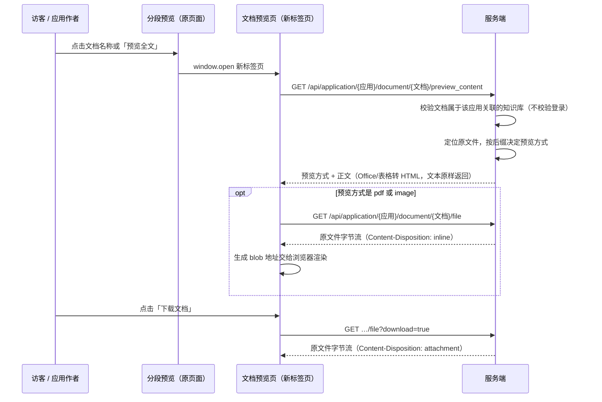

# 文档预览

[[toc]]

[分段预览](./29.md) 解决的是「这次回答引用了哪几段」，视角停在分段上。要核对版式、盖章页、表格数字或者扫描件时，分段文本不够用：原文里的表格会被压成一行行文字，图片和印章根本不在分段里。本章补上**文档预览**：在分段预览界面点一下**文档名称**或「**预览全文**」按钮，**新标签页**打开一个独立的文档预览页，按文件类型把文档全文渲染出来，并可就地下载原文件。

「能支持预览的文档全部支持」是本章的目标：PDF、图片、Word、Excel、CSV、纯文本、Markdown、HTML、ZIP 都在覆盖范围内，解析不了的类型也不会给一个空白页面，而是明确提示「下载后查看」。预览页**不需要登录**：地址本身就是访问凭据，分享链接里的访客、没有账号的同事都能直接打开。

## 一、入口与效果

一次问答结束后，回答下方「知识来源」里的每张文档卡片都可以点开**分段预览**，卡片上的文档名只是标题，不改变卡片的点击行为：


分段预览窗口的头部就是全文入口：**文档名称可点击**，右侧还有一个「预览全文」按钮，两者都在新标签页打开文档预览页：


第三个入口在「知识库引用」弹窗（回答下方的「引用分段」按钮）里，每张引用分段卡片底部的文档名称同样可以点击：

```text
回答 → 引用分段 → 知识库引用弹窗 → 点分段卡片上的文档名称 → 新标签页打开文档预览
```

每张引用分段卡片底部的文档名称就是入口：


**为什么用新标签页而不是弹窗**：核对原文往往要来回对照，预览页可以长时间停在一边，不占用、也不打断正在进行的分段预览；浏览器自己的前进后退、打印、PDF 缩放与搜索都能直接用，地址栏里的链接还能直接发给同事。

Office 文档在服务端解析成 HTML 片段，段落、表格、空行都保留下来，右上角「下载文档」直接保存原文件：


PDF 与图片不经过服务端解析，直接交给浏览器自己的阅读器，缩放、翻页、搜索都是原生能力：


从点击到看到正文，新标签页里一共两次请求（PDF 与图片是三次，多一次取原文件）：



## 二、预览方式与支持的文件类型

服务端只回答一个问题：**这份文件用哪种方式给浏览器看**。前端按 `preview_kind` 选一个渲染分支，不做后缀判断，新增类型只要服务端多一个分支。

| 后缀 | `preview_kind` | 呈现方式 |
| --- | --- | --- |
| `pdf` | `pdf` | 浏览器内置 PDF 阅读器，服务端只负责把原文件读出来 |
| `png` `jpg` `jpeg` `gif` `bmp` `webp` `svg` | `image` | `` 按容器宽度等比缩放 |
| `docx` | `html` | 解析 OOXML 正文，段落转 `<p>`、表格转 `<table>`，文本统一转义 |
| `doc` | `html` | 二进制 Word 逐段取文本后转 HTML |
| `xlsx` `xls` | `html` | 每个工作表一张表格，前面带工作表名 |
| `csv` | `html` | 按引号规则切分单元格后转表格 |
| `md` `markdown` | `markdown` | 交给 Markdown 渲染器，标题、列表、表格都保留 |
| `txt` `log` `json` `xml` `yaml` `yml` `properties` `sql` `java` `js` `ts` `vue` `py` `sh` `bat` `ini` `conf` | `text` | 等宽字体，保留换行与空格 |
| `html` `htm` | `web` | **沙箱 iframe** 渲染，页面里的脚本不会执行 |
| `zip` | `text` | 包内文件清单（文件名 + 大小） |
| 其它后缀 | `unsupported` | 页面给出「请下载后查看」的提示，下载按钮仍然可用 |
| 原文件已被清理或文档来自网页抓取 | `markdown` | 退回该文档的全部分段正文，按分段顺序拼接 |

解析与呈现都在保护范围内，避免一份超大文档把浏览器拖垮：

| 限制 | 取值 | 说明 |
| --- | --- | --- |
| 正文返回上限 | 200000 字符 | 超出后只返回前半部分，`truncated` 为真，页面顶部弹出提示条 |
| 参与解析的原文件大小 | 30 MB | 超过则直接进入只下载模式，不做解析 |
| 表格行列上限 | 2000 行 × 200 列 | 超出部分截断并置 `truncated` |
| ZIP 清单条数 | 500 条 | 超出后追加省略号 |
| 分段兜底条数 | 2000 个分段 | 原文件缺失时最多拼接的分段数 |

## 三、接口约定

两个接口都挂在**应用**维度，与[分段预览](./29.md)共用同一套路径约定：

```text
GET /api/application/{applicationId}/document/{documentId}/preview_content
GET /api/application/{applicationId}/document/{documentId}/file?download={true|false}
```

| 参数 | 位置 | 必填 | 说明 |
| --- | --- | --- | --- |
| `applicationId` | 路径 | 是 | 当前对话所属应用，用来校验文档是否属于该应用关联的知识库 |
| `documentId` | 路径 | 是 | 文档 ID |
| `download` | 查询串 | 否 | 缺省或 `false` 按 `inline` 输出供预览；`true` 或 `1` 按 `attachment` 输出触发下载 |

两个接口都**不要求登录**：没有 `Authorization` 头也能拿到内容。访问控制靠「应用 + 文档」这一对 ID：

```java
  private static final String FIND_APPLICATION_DOCUMENT = """
      select d.id,
             d.name,
             d.type,
             d.file_id,
             d.dataset_id,
             d.char_length,
             d.paragraph_count,
             s.name as dataset_name
        from max_kb_document d
        join max_kb_application_dataset_mapping m on m.dataset_id = d.dataset_id
   left join max_kb_dataset s on s.id = d.dataset_id
       where m.application_id = ?
         and d.id = ?
       limit 1
      """;
```

也就是说：**只有确实挂在该应用关联知识库下的文档才会被读出来**，随便换个 `documentId` 只会得到「文档不存在或不属于该应用的知识库」。文档 ID 是雪花算法生成的 64 位整数，无法猜测；预览链接只出现在对话页与分享出去的地址里。

`preview_content` 返回体在统一的 `ResultVo` 信封里，`data` 结构如下（Word 文档示例）：

```json
{
  "code": 200,
  "message": null,
  "data": {
    "document_id": "695639883218788352",
    "document_name": "中华人民共和国行政复议法.docx",
    "document_type": "docx",
    "dataset_id": "695638732989636608",
    "dataset_name": "政法文档验证",
    "paragraph_count": 8,
    "char_length": 13297,
    "file_name": "中华人民共和国行政复议法.docx",
    "file_size": 32517,
    "downloadable": true,
    "preview_kind": "html",
    "content": "<p>中华人民共和国行政复议法</p><p>目　　录</p>…",
    "truncated": false,
    "message_code": null,
    "message": null
  }
}
```

| 字段 | 说明 |
| --- | --- |
| `document_name` / `document_type` | 文档名与后缀，前端据此取文件图标并决定标题栏文案 |
| `dataset_name` | 知识库名，同名文档分布在不同知识库时用于区分 |
| `file_name` / `file_size` | 原文件名与字节数，下载时作为保存文件名，页面显示为 `31.8 KB` |
| `downloadable` | 原文件是否还在本地存储里；为 `false` 时下载按钮置灰 |
| `preview_kind` | 预览方式，取值见上一节的表；前端按它选渲染分支 |
| `content` | 解析后的正文；`pdf` 与 `image` 为 `null`，正文由 `/file` 提供 |
| `truncated` | 是否因为上限只返回了部分正文 |
| `message_code` | 无法预览的机器可读原因（目前只有 `unsupported`），**由前端翻译成本地文案**，页面语言是英文时不会冒出中文提示 |
| `message` | 同一个原因的中文兜底文案，供不走界面的调用方直接使用 |

`file` 接口不返回 JSON，而是一段字节流，响应头由服务端拼好：

```text
Content-Type: application/pdf
Content-Disposition: inline;filename=%E8%A4%9A%E5%BA%99%E4%B9%A1…pdf;filename*=UTF-8''%E8%A4%9A%E5%BA%99%E4%B9%A1…pdf
```

文件名同时给出 `filename`（百分号编码）与 `filename*`（RFC 5987），中文名在下载时不会丢字。文档不存在或不属于该应用时返回 `404`，读盘失败返回 `500`，前端拿到的是失败状态，不会把错误 JSON 当成文件保存下来。

## 四、服务端实现

### 4.1 控制器方法

两个方法都只做三件事：接住路径变量、取查询串里的下载开关、交给服务层。tio-boot 的注解路由把路径变量直接绑到方法参数上，控制器里不需要手工解析 URL：

```java
package nexus.io.maxkb.controller;

import nexus.io.annotation.Get;
import nexus.io.annotation.RequestPath;
import nexus.io.jfinal.aop.Aop;
import nexus.io.model.result.ResultVo;
import nexus.io.maxkb.service.kb.MaxKbDocumentPreviewService;
import nexus.io.tio.http.common.HttpRequest;
import nexus.io.tio.http.common.HttpResponse;

@RequestPath("/api/application")
public class ApiApplicationController {

  /** 文档全文预览：按文件类型返回预览方式与正文，无原文件时退回分段正文；预览链接不需要登录。 */
  @Get("/{applicationId}/document/{documentId}/preview_content")
  public ResultVo previewDocumentContent(Long applicationId, Long documentId) {
    return Aop.get(MaxKbDocumentPreviewService.class).content(applicationId, documentId);
  }

  /** 文档原文件：默认按 inline 输出用于在线预览，download=true 时按附件下载。 */
  @Get("/{applicationId}/document/{documentId}/file")
  public HttpResponse previewDocumentFile(Long applicationId, Long documentId, HttpRequest request) {
    String download = request.getParam("download");
    boolean asAttachment = "true".equalsIgnoreCase(download) || "1".equals(download);
    return Aop.get(MaxKbDocumentPreviewService.class).file(applicationId, documentId, asAttachment, request);
  }
}
```

### 4.2 预览链接不需要登录

默认情况下，认证拦截器先解析令牌，解不出身份就直接返回 `401`。文档预览要在**没有登录态**时也能打开，所以这两条路径在解析令牌之后立刻放行：

```java
import java.util.regex.Pattern;

public class MaxKbAuthInterceptor implements HttpRequestInterceptor {

  /**
   * 文档全文预览与下载原文件：预览链接不需要登录，按分享链接对待，
   * 能否看到内容由服务层按「文档是否属于该应用关联的知识库」判断。
   */
  private static final Pattern DOCUMENT_PREVIEW_PATH = Pattern
      .compile("/api/application/\\d+/document/\\d+/(preview_content|file)");

  @Override
  public HttpResponse doBeforeHandler(HttpRequest request, RequestLine requestLine, HttpResponse responseFromCache) {
    String authorization = request.getHeader("authorization");
    Long userId = Aop.get(MaxKbAuthService.class).getIdByToken(authorization);
    String path = requestLine.getPath();

    // 文档预览按分享链接处理：没有登录令牌也放行，登录与否得到的结果一致。
    // 带了有效令牌时仍然记下身份，方便日志与审计。
    if (isDocumentPreviewPath(path)) {
      if (userId != null) {
        TioRequestContext.setUserId(userId);
      }
      return null;
    }

    if (userId == null) {
      HttpResponse response = TioRequestContext.getResponse();
      response.setStatus(HttpResponseStatus.C401);
      return response;
    }
    // …其余路径继续按登录令牌、账号状态与资源归属校验
    return null;
  }

  /** 文档预览与下载原文件的路径，这两个路径不要求登录。 */
  private boolean isDocumentPreviewPath(String path) {
    return DOCUMENT_PREVIEW_PATH.matcher(path).matches();
  }
}
```

**放行是在「解析令牌」之后、不是「跳过令牌」**：带了有效令牌仍然会记下身份，日志和审计看得到是谁打开的。也正因为这条路径对所有人一视同仁，不会出现「登录之后反而没权限」这种怪事——服务层不再按身份判权，只看文档与应用的绑定关系。

[分段预览](./29.md) 的 `/preview` 接口保持原样：它需要身份，因为返回的是**全部分段正文**，属于应用内部资料的完整展开；而文档预览页是给「拿到链接的人看这一份文档」用的，两者的边界在文档里写清楚。

### 4.3 三条 SQL

文档信息查询把三个条件叠在一条语句里：文档属于该应用关联的知识库、按文档 ID 命中、顺带取知识库名。SQL 用文本块书写，字段与条件各占一行，改条件时不会漏掉逗号：

```java
  private static final String FIND_FILE = """
      select filename,
             bucket_name,
             target_name,
             file_size
        from max_kb_file
       where id = ?
         and deleted = 0
      """;

  /** 分段没有单独的顺序列，主键由雪花算法递增生成，按主键升序即导入顺序。 */
  private static final String FIND_PARAGRAPHS = """
      select content
        from max_kb_paragraph
       where document_id = ?
         and deleted = 0
       order by id
       limit ?
      """;
```

文档表只存 `file_id`，真实文件信息在文件表里，所以预览要多走一次查询。原文件落盘路径由存储桶名与目标名拼出来，与静态资源目录 `server.resources.static-locations=pages` 保持一致：

```java
  /** 本地文件存储根目录，与静态资源目录 server.resources.static-locations 保持一致。 */
  private static final String FILE_ROOT = "pages";

  /** 原文件落盘路径：pages/{bucketName}/{targetName}。 */
  private Path storagePath(Row file) {
    String bucketName = file.getStr("bucket_name");
    String targetName = file.getStr("target_name");
    if (bucketName == null || targetName == null) {
      return null;
    }
    Path path = Paths.get(FILE_ROOT, bucketName, targetName).normalize();
    if (!path.startsWith(FILE_ROOT) || !Files.isReadable(path)) {
      return null;
    }
    return path;
  }
```

`normalize()` 加上 `startsWith(FILE_ROOT)` 是一次必要的兜底：即使将来 `target_name` 里出现 `../`，路径也不会跑到 `pages` 目录外面去。

### 4.4 预览方式判定与分段兜底

预览方式由后缀决定，整段逻辑就是一次 `switch`，每个分支只关心「怎么把字节变成能看的内容」：

```java
  /**
   * 按文件名后缀选择预览方式，返回 null 表示原文件不可读、由调用方退回分段正文。
   */
  private Preview extract(Path path, String documentName) {
    try {
      if (!Files.isReadable(path) || Files.size(path) == 0) {
        return null;
      }
      long size = Files.size(path);
      if (size > MAX_PARSE_BYTES) {
        return new Preview(KIND_UNSUPPORTED, null, false);
      }
      return switch (suffix(documentName)) {
        case "pdf" -> new Preview(KIND_PDF, null, false);
        case "png", "jpg", "jpeg", "gif", "bmp", "webp", "svg" -> new Preview(KIND_IMAGE, null, false);
        case "docx" -> html(docxToHtml(Files.readAllBytes(path)));
        case "doc" -> html(docToHtml(Files.readAllBytes(path)));
        case "xlsx", "xls" -> spreadsheetToHtml(Files.readAllBytes(path));
        case "csv" -> csvToHtml(readText(Files.readAllBytes(path)));
        case "md", "markdown" -> limited(KIND_MARKDOWN, readText(Files.readAllBytes(path)), false);
        case "html", "htm" -> limited(KIND_WEB, readText(Files.readAllBytes(path)), false);
        case "zip" -> limited(KIND_TEXT, zipListing(Files.readAllBytes(path)), false);
        default -> textLike(documentName) ? limited(KIND_TEXT, readText(Files.readAllBytes(path)), false)
            : new Preview(KIND_UNSUPPORTED, null, false);
      };
    } catch (Exception e) {
      log.warn("文档预览解析失败, path={}", path, e);
      return new Preview(KIND_UNSUPPORTED, null, false);
    }
  }
```

**预览方式与结果都不写死在前端**，而是作为数据返回，这是让「新增一种可预览类型」只改一处的前提。PDF 与图片返回 `content = null`，因为它们的正文就是原文件本身，服务端不需要读进内存再吐出来。

解析异常一律收敛成 `unsupported`，不会把 500 抛到前端：一份损坏的 DOCX 只是看不到正文，下载按钮照旧可用。

原文件缺失（网页抓取来的文档、文件被运维清理）时退回分段正文，让「文档全文」在任何情况下都有内容可看：

```java
  /**
   * 原文件缺失时的兜底：把全部分段按顺序拼成 Markdown 正文，仍然看得到文档全文。
   */
  private Preview segments(Long documentId) {
    List<Row> records = Db.find(FIND_PARAGRAPHS, documentId, MAX_FALLBACK_PARAGRAPHS);
    StringBuilder text = new StringBuilder();
    boolean truncated = false;
    for (Row record : records) {
      String content = record.getStr("content");
      if (content == null || content.isBlank()) {
        continue;
      }
      if (text.length() + content.length() > MAX_PREVIEW_CHARS) {
        truncated = true;
        break;
      }
      text.append(content).append("\n\n");
    }
    if (text.length() == 0) {
      return new Preview(KIND_UNSUPPORTED, null, false);
    }
    return new Preview(KIND_MARKDOWN, text.toString(), truncated);
  }
```

主干方法把所有信息拼成给前端的 `Kv`，字段名与接口约定里的表一一对应：

```java
  public ResultVo content(Long applicationId, Long documentId) {
    if (applicationId == null || documentId == null) {
      return ResultVo.fail("缺少应用或文档标识");
    }
    Row document = Db.findFirst(FIND_APPLICATION_DOCUMENT, applicationId, documentId);
    if (document == null) {
      return ResultVo.fail("文档不存在或不属于该应用的知识库");
    }

    Row file = file(document);
    Path path = file == null ? null : storagePath(file);
    Preview preview = path == null ? null : extract(path, document.getStr("name"));
    if (preview == null) {
      preview = segments(documentId);
    }

    Kv data = Kv.by("document_id", document.getLong("id"))
        .set("document_name", document.getStr("name"))
        .set("document_type", document.getStr("type"))
        .set("dataset_name", document.getStr("dataset_name"))
        .set("file_name", file == null ? null : file.getStr("filename"))
        .set("file_size", file == null ? null : file.getLong("file_size"))
        .set("downloadable", path != null)
        .set("preview_kind", preview.kind())
        .set("content", preview.content())
        .set("truncated", preview.truncated())
        .set("message_code", KIND_UNSUPPORTED.equals(preview.kind()) ? MESSAGE_CODE_UNSUPPORTED : null)
        .set("message", KIND_UNSUPPORTED.equals(preview.kind()) ? MESSAGE_UNSUPPORTED : null);
    return ResultVo.ok(data);
  }
```

### 4.5 Office 与表格转 HTML

DOCX 的正文在 `word/document.xml` 里，段落是 `w:p`、表格是 `w:tbl`、文本被拆在多个 `w:t` 中。解析器关掉 DOCTYPE 与外部实体，避免文档携带 XXE，然后按节点顺序还原结构：

```java
import java.io.ByteArrayInputStream;
import java.util.zip.ZipEntry;
import java.util.zip.ZipInputStream;
import javax.xml.XMLConstants;
import javax.xml.parsers.DocumentBuilderFactory;
import org.w3c.dom.Document;
import org.w3c.dom.Element;
import org.w3c.dom.Node;
import org.w3c.dom.NodeList;

  /**
   * DOCX 正文转 HTML：段落转 p，表格转 table，文本统一做转义，避免文档内容被当成标签执行。
   */
  public String docxToHtml(byte[] data) throws Exception {
    try (ZipInputStream zip = new ZipInputStream(new ByteArrayInputStream(data))) {
      ZipEntry entry;
      while ((entry = zip.getNextEntry()) != null) {
        if (!"word/document.xml".equals(entry.getName())) {
          continue;
        }
        byte[] xml = zip.readNBytes(20 * 1024 * 1024 + 1);
        if (xml.length > 20 * 1024 * 1024) {
          throw new IllegalArgumentException("DOCX内容过大");
        }
        DocumentBuilderFactory factory = DocumentBuilderFactory.newInstance();
        factory.setNamespaceAware(true);
        factory.setFeature("http://apache.org/xml/features/disallow-doctype-decl", true);
        factory.setAttribute(XMLConstants.ACCESS_EXTERNAL_DTD, "");
        factory.setAttribute(XMLConstants.ACCESS_EXTERNAL_SCHEMA, "");
        Document doc = factory.newDocumentBuilder().parse(new ByteArrayInputStream(xml));
        Node body = doc.getElementsByTagNameNS("*", "body").item(0);
        if (body == null) {
          throw new IllegalArgumentException("DOCX缺少正文");
        }
        StringBuilder out = new StringBuilder();
        for (Node node = body.getFirstChild(); node != null; node = node.getNextSibling()) {
          if ("p".equals(node.getLocalName())) {
            appendParagraph(out, nodeText(node));
          } else if ("tbl".equals(node.getLocalName())) {
            out.append("<table class=\"preview-table\">");
            NodeList rows = ((Element) node).getElementsByTagNameNS("*", "tr");
            for (int r = 0; r < rows.getLength(); r++) {
              NodeList cells = ((Element) rows.item(r)).getElementsByTagNameNS("*", "tc");
              out.append("<tr>");
              for (int c = 0; c < cells.getLength(); c++) {
                out.append("<td>").append(escape(nodeText(cells.item(c)))).append("</td>");
              }
              out.append("</tr>");
            }
            out.append("</table>");
          }
        }
        return out.toString();
      }
    }
    throw new IllegalArgumentException("DOCX缺少正文");
  }

  /** 取节点下所有文本，DOCX 的文本可能被拆在多个 w:t 里。 */
  private String nodeText(Node node) {
    StringBuilder out = new StringBuilder();
    NodeList texts = ((Element) node).getElementsByTagNameNS("*", "t");
    for (int i = 0; i < texts.getLength(); i++) {
      out.append(texts.item(i).getTextContent());
    }
    return out.toString();
  }
```

生成的 HTML 是**片段**而不是整页：前端把它放进预览页正文容器，样式由前端控制，服务端不用关心主题色和字号。

Excel 走 POI 的统一工作簿接口，`.xlsx` 与 `.xls` 共用一条路径，`DataFormatter` 取「单元格显示出来的值」，公式单元格用缓存值，避免预览里出现 `#VALUE!`：

```java
import java.util.Locale;
import org.apache.poi.ss.usermodel.Cell;
import org.apache.poi.ss.usermodel.DataFormatter;
import org.apache.poi.ss.usermodel.Sheet;
import org.apache.poi.ss.usermodel.Workbook;
import org.apache.poi.ss.usermodel.WorkbookFactory;

  /** 表格文档转 HTML 表格，超过行列上限时截断并标记。 */
  public Preview spreadsheetToHtml(byte[] data) throws Exception {
    try (Workbook workbook = WorkbookFactory.create(new ByteArrayInputStream(data))) {
      DataFormatter formatter = new DataFormatter(Locale.ROOT);
      formatter.setUseCachedValuesForFormulaCells(true);
      StringBuilder out = new StringBuilder();
      boolean truncated = false;
      for (Sheet sheet : workbook) {
        out.append("<h4>").append(escape(sheet.getSheetName())).append("</h4>");
        out.append("<table class=\"preview-table\">");
        int rows = 0;
        for (org.apache.poi.ss.usermodel.Row row : sheet) {
          if (rows >= MAX_TABLE_ROWS) {
            truncated = true;
            break;
          }
          rows++;
          int lastCell = row.getLastCellNum();
          if (lastCell > MAX_TABLE_COLUMNS) {
            truncated = true;
          }
          out.append("<tr>");
          for (int i = 0; i < Math.min(lastCell, MAX_TABLE_COLUMNS); i++) {
            Cell cell = row.getCell(i);
            out.append("<td>").append(escape(formatter.formatCellValue(cell))).append("</td>");
          }
          out.append("</tr>");
        }
        out.append("</table>");
      }
      return limited(KIND_HTML, out.toString(), truncated);
    }
  }
```

CSV 不能用 POI 读，但它只有一条规则：引号内的逗号不是分隔符，两个连续引号表示一个引号。一个小状态机就够了：

```java
import java.util.ArrayList;
import java.util.List;

  /** 单个 CSV 行切分：引号内的逗号属于单元格内容，两个连续引号表示一个引号。 */
  public static List<String> splitCsvLine(String line) {
    List<String> cells = new ArrayList<>();
    StringBuilder cell = new StringBuilder();
    boolean quoted = false;
    for (int i = 0; i < line.length(); i++) {
      char current = line.charAt(i);
      if (current == '"') {
        if (quoted && i + 1 < line.length() && line.charAt(i + 1) == '"') {
          cell.append('"');
          i++;
        } else {
          quoted = !quoted;
        }
      } else if (current == ',' && !quoted) {
        cells.add(cell.toString());
        cell.setLength(0);
      } else {
        cell.append(current);
      }
    }
    cells.add(cell.toString());
    return cells;
  }
```

文本文件按 UTF-8 解码，失败再退回 GB18030。Windows 上大量公文仍是记事本另存的 GB18030 编码，只按 UTF-8 读会得到一串问号：

```java
import java.nio.ByteBuffer;
import java.nio.charset.CharacterCodingException;
import java.nio.charset.Charset;
import java.nio.charset.StandardCharsets;

  /** 文本文件按 UTF-8 读取，乱码时退回 GB18030，覆盖 Windows 下常见的记事本文件。 */
  public static String readText(byte[] data) {
    try {
      return StandardCharsets.UTF_8.newDecoder().decode(ByteBuffer.wrap(data)).toString();
    } catch (CharacterCodingException e) {
      return new String(data, Charset.forName("GB18030"));
    }
  }
```

**转义是这一段的硬要求**：文档正文里的 `<script>` 必须以文本形式显示。所有来自文档的字符串都过同一个函数，前端才敢用 `v-html` 接住这段 HTML：

```java
  /** 文档正文里的 & < > " 必须转义，否则文档内容会被浏览器当成标签执行。 */
  public static String escape(String text) {
    if (text == null) {
      return "";
    }
    return text.replace("&", "&amp;").replace("<", "&lt;").replace(">", "&gt;").replace("\"", "&quot;");
  }
```

只有原始 HTML 文件例外，它的标签是**要生效的**，所以既不能转义也不能 `v-html`，而是交给下一节说的沙箱 iframe。

### 4.6 原文件输出与下载

原文件输出只做三件事：读字节、按后缀定 `Content-Type`、按 `download` 决定 `inline` 还是 `attachment`。tio-boot 的响应工具已经覆盖了常见类型，取不到的类型按二进制流返回：

```java
import java.net.URLEncoder;
import java.nio.file.Files;
import java.nio.file.Path;
import java.nio.charset.StandardCharsets;
import nexus.io.tio.http.common.HeaderName;
import nexus.io.tio.http.common.HeaderValue;
import nexus.io.tio.http.common.HttpResponse;
import nexus.io.tio.http.common.HttpResponseStatus;
import nexus.io.tio.http.server.util.Resps;

  public HttpResponse file(Long applicationId, Long documentId, boolean download, HttpRequest request) {
    Row document = Db.findFirst(FIND_APPLICATION_DOCUMENT, applicationId, documentId);
    if (document == null) {
      return json(request, ResultVo.fail("文档不存在或不属于该应用的知识库"), HttpResponseStatus.C404);
    }
    Row file = file(document);
    Path path = file == null ? null : storagePath(file);
    if (path == null) {
      return json(request, ResultVo.fail("原文件不存在或已被清理"), HttpResponseStatus.C404);
    }
    try {
      byte[] bytes = Files.readAllBytes(path);
      String filename = document.getStr("name");
      HttpResponse response = Resps.bytesWithContentType(request, bytes, contentType(suffix(filename)));
      response.addHeader(HeaderName.Content_Disposition, HeaderValue.from(disposition(download, filename)));
      return response;
    } catch (Exception e) {
      log.warn("文档原文件读取失败, documentId={}, path={}", documentId, path, e);
      return json(request, ResultVo.fail("原文件读取失败"), HttpResponseStatus.C500);
    }
  }

  /** 预览用 inline，下载用 attachment；文件名按 UTF-8 百分号编码，兼容中文名。 */
  public static String disposition(boolean download, String filename) {
    String name = filename == null || filename.isBlank() ? "document" : filename;
    String encoded = URLEncoder.encode(name, StandardCharsets.UTF_8).replace("+", "%20");
    return (download ? "attachment" : "inline") + ";filename=" + encoded + ";filename*=UTF-8''" + encoded;
  }
```

**为什么不让浏览器直接去静态资源目录取文件**：`pages` 目录下的文件确实能通过 URL 直接访问，但那条路完全绕过接口——文档 ID 之所以难猜是因为它只出现在接口地址里，而静态路径一旦拼出来就是「谁都能拿」；而且静态资源不会带 `Content-Disposition`，下载下来的文件名是雪花 ID。走接口输出原文件，文档归属校验、中文文件名、预览与下载两种语义都能一次解决。代价是一次 `Files.readAllBytes`，对知识库文档这个量级完全可以接受。

失败时返回 `404` / `500` 而不是 200 包一个错误 JSON，是因为前端拿二进制流时无法解析业务错误码，只有非 2xx 才能被 axios 拦成异常。

### 4.7 预览结果对象与提示码

三处返回值汇总成一个不可变对象，避免在方法之间传三个变量：

```java
  /** 预览结果：预览方式 + 正文 + 是否被截断。 */
  public record Preview(String kind, String content, boolean truncated) {
  }

  /** 无法在线预览时的提示码，由前端翻译成本地文案，服务端只给出机器可读的原因。 */
  public static final String MESSAGE_CODE_UNSUPPORTED = "unsupported";

  /** 提示码对应的中文兜底文案，供不走界面的调用方直接使用。 */
  private static final String MESSAGE_UNSUPPORTED = "该文件类型暂不支持在线预览，请下载后查看";

  /** 按字符上限截断正文，命中上限时由前端提示用户下载原文件查看。 */
  private Preview limited(String kind, String content, boolean truncated) {
    if (content != null && content.length() > MAX_PREVIEW_CHARS) {
      return new Preview(kind, content.substring(0, MAX_PREVIEW_CHARS), true);
    }
    return new Preview(kind, content, truncated);
  }
```

提示码与文案一起返回：界面拿 `message_code` 去查本地文案，非界面调用方（脚本、接口联调）直接读 `message`。

## 五、前端实现

### 5.1 新标签页打开

打开动作收在一个小工具里，三个入口共用；`router.resolve` 负责按路由名拼地址，避免手写路径：

```ts
import router from '@/router'

/**
 * 在新标签页打开文档预览页。
 *
 * 预览接口不需要登录，链接本身就是访问凭据，所以地址里只带应用与文档 ID：
 * 分享链接的访客和已登录用户打开的是同一个地址，登录与否结果一致。
 */
export function openDocumentPreviewTab(applicationId: string, documentId: string) {
  if (!applicationId || !documentId) {
    return
  }
  const path = `#/document-preview/${applicationId}/${documentId}`
  try {
    const { href } = router.resolve({
      name: 'DocumentPreview',
      params: { applicationId, documentId }
    })
    window.open(new URL(href, window.location.href).href, '_blank')
  } catch (e) {
    // 路由还没注册好时退回按路径拼地址，保证调用方（分段预览、知识库引用）不受影响
    window.open(new URL(path, window.location.href).href, '_blank')
  }
}
```

**`window.open` 必须由真实点击触发**：浏览器会拦截「脚本自己弹出来的窗口」。分段预览与知识库引用里的入口都是用户点出来的，所以能正常开；如果哪天想改成页面加载后自动开，需要换成 `location.href` 或让用户手动点。

### 5.2 三个入口

分段预览弹窗的头部把文档名做成可点，并补一个带图标的「预览全文」按钮，避免用户看不出名称可以点：

```vue
<span
  class="segment-preview-name ellipsis-1"
  :title="$t('chat.documentPreview.clickTip')"
  @click="openDocumentPreview"
>
  {{ detail.document_name }}
</span>
<el-button type="primary" link class="ml-8" @click="openDocumentPreview">
  <AppIcon iconName="app-view" class="mr-4"></AppIcon>
  {{ $t('chat.documentPreview.previewFullText') }}
</el-button>
```

```ts
/** 点击文档名称或「预览全文」按钮，在新标签页打开文档预览页。 */
function openDocumentPreview() {
  if (!currentApplicationId || !detail.value.document_id) {
    return
  }
  openDocumentPreviewTab(currentApplicationId, detail.value.document_id)
}
```

`currentApplicationId` 在打开分段预览时记下来，因为预览接口需要应用 ID 做归属校验，而分段预览的响应里只回文档信息。

「知识库引用」弹窗里的文档名称同样可点。应用 ID 从 `KnowledgeSource` 逐层传下去，不引入全局状态：

```vue
<!-- KnowledgeSource.vue：把应用 id 交给引用弹窗 -->
<ParagraphSourceDialog ref="ParagraphSourceDialogRef" :application-id="application?.id" />

<!-- ParagraphSourceDialog.vue：再交给每一张引用分段卡片 -->
<ParagraphCard :data="item" :content="item.content" :index="index" :application-id="props.applicationId" />
```

```vue
<!-- ParagraphCard.vue：文档名称变成入口，正文与相似度都不受影响 -->
<span
  class="paragraph-source-document-name cursor ellipsis-1 break-all"
  :title="data?.document_name?.trim()"
  @click="openDocumentPreview"
>
  {{ data?.document_name?.trim() }}
</span>
```

```ts
/** 点击文档名称在新标签页打开文档预览页。 */
function openDocumentPreview() {
  openDocumentPreviewTab(props.applicationId, props.data?.document_id)
}
```

**对话来源卡片上的文档名刻意保持不可点**：那张卡片很小，文档名几乎占满整张卡，名称一旦单独接管点击，用户点卡片就会「莫名其妙跳到预览页」，把原本的**分段预览**入口挤掉。所以点击优先级是：卡片 → 分段预览；分段预览头部 / 知识库引用里的名称 → 文档预览。

### 5.3 预览页与渲染分支

预览页是独立路由，不带后台布局，进来就是一个整屏的查看器：

```ts
// routes.ts
  // 文档预览：从分段预览或知识库引用里新开标签页打开，独立成页而不是弹窗
  {
    path: '/document-preview/:applicationId/:documentId',
    name: 'DocumentPreview',
    meta: { title: 'chat.documentPreview.title' },
    component: () => import('@/views/document-preview/index.vue')
  }
```

```vue
<template>
  <div class="document-preview-page">
    <DocumentPreview :application-id="applicationId" :document-id="documentId" />
  </div>
</template>
```

路由表里的菜单文案一律走 `$t(...)`，所以 `meta.title` 给的是 **i18n 键**而不是写死的中文；页面主体按 `preview_kind` 选渲染分支，同一份数据在不同分支下用完全不同的方式呈现：

```vue
<div class="document-preview-header flex align-center">
  <span class="document-preview-title">{{ $t('chat.documentPreview.title') }}</span>
  <el-divider direction="vertical" class="mr-8" />
  
  <span class="document-preview-name ellipsis-1" :title="detail.document_name">{{ detail.document_name }}</span>
  <el-tag v-if="detail.document_type" class="ml-8" size="small" type="info">
    {{ detail.document_type }}
  </el-tag>
  <span class="ml-8 color-secondary ellipsis-1" :title="detail.dataset_name">{{ detail.dataset_name }}</span>
  <span v-if="fileSizeText" class="ml-16 color-secondary">{{ fileSizeText }}</span>
  <div class="document-preview-space"></div>
  <el-button type="primary" :disabled="!detail.downloadable" :loading="downloading" @click="downloadDocument">
    <AppIcon iconName="app-export" class="mr-4"></AppIcon>
    {{ $t('chat.documentPreview.download') }}
  </el-button>
</div>
<el-alert
  v-if="detail.truncated"
  class="mb-8"
  type="warning"
  :closable="false"
  :title="$t('chat.documentPreview.truncated')"
/>
<div class="document-preview-body">
  <iframe v-if="previewKind === 'pdf'" :src="previewUrl" class="document-preview-frame" />
  <div v-else-if="previewKind === 'image'" class="document-preview-image">
    
  </div>
  <!-- 原始 HTML 文件不做任何处理，放进沙箱 iframe，页面里的脚本不会执行 -->
  <iframe v-else-if="previewKind === 'web'" :srcdoc="detail.content" sandbox="" class="document-preview-frame" />
  <!-- 服务端已经对文档正文做过转义，这里的 HTML 是表格与段落片段 -->
  <div v-else-if="previewKind === 'html'" class="document-preview-html" v-html="detail.content"></div>
  <MdPreview
    v-else-if="previewKind === 'markdown'"
    editorId="document-preview"
    :modelValue="detail.content"
    noImgZoomIn
  />
  <pre v-else-if="previewKind === 'text'" class="document-preview-text">{{ detail.content }}</pre>
  <el-empty v-else-if="!loading" :description="emptyText" />
</div>
```

`web` 分支的 `sandbox=""` 是关键：原始 HTML 文件里的 `<script>` 不会执行，也拿不到同源权限，但它自己的样式和内联图片照常显示。`html` 分支敢用 `v-html`，是因为服务端已经把文档文本全部转义过。

正文容器用 flex 撑满剩余高度，PDF 与图片因此能占满整屏：

```scss
.document-preview {
  display: flex;
  flex-direction: column;
  height: 100%;
}

.document-preview-body {
  flex: 1;
  min-height: 0;
  padding-top: 12px;
  overflow: auto;
}

.document-preview-frame {
  width: 100%;
  height: 100%;
  border: none;
}
```

PDF 与图片需要原文件本身，取回二进制后生成 blob 地址；地址在页面卸载时释放，避免反复打开预览把内存攒起来。用 axios 取二进制而不是把 URL 直接写进 `<iframe src>`，是因为接口虽然不要求登录，但带着令牌请求才能让服务端日志记下访问者：

```ts
/** PDF、图片需要原文件本身，取回二进制后生成浏览器可直接打开的地址。 */
function loadBinaryPreview() {
  const kind = (detail.value.preview_kind || '').toLowerCase()
  if (kind !== 'pdf' && kind !== 'image') {
    return
  }
  applicationApi
    .getDocumentFile(props.applicationId, props.documentId, false)
    .then((blob: any) => {
      if (blob instanceof Blob) {
        previewUrl.value = window.URL.createObjectURL(blob)
      }
    })
    .catch(() => {
      MsgError(t('chat.documentPreview.loadFailed'))
    })
}
```

### 5.4 下载

下载与预览共用同一个接口，只差一个 `download=true`：

```ts
function downloadDocument() {
  if (!detail.value.downloadable) {
    return
  }
  downloading.value = true
  applicationApi
    .getDocumentFile(props.applicationId, props.documentId, true)
    .then((blob: any) => {
      if (blob instanceof Blob) {
        saveAs(blob, detail.value.file_name || detail.value.document_name)
      }
    })
    .catch(() => {})
    .finally(() => {
      downloading.value = false
    })
}
```

`file_name` 是服务端给的原文件名（带后缀），比直接用文档名更稳：文档名被改成不带上缀时，下载下来的文件仍然能被系统识别。

### 5.5 国际化

预览页的所有文案都走 i18n，三套语言各补一份；服务端只回提示码，页面用提示码查本地文案，英文界面不会冒出中文：

```ts
  documentPreview: {
    title: '文档预览',
    clickTip: '点击预览文档全文',
    previewFullText: '预览全文',
    download: '下载文档',
    truncated: '文档内容较大，仅展示部分内容，可下载原文件查看',
    unsupported: '该文件类型暂不支持在线预览，请下载后查看',
    loadFailed: '原文件加载失败',
    message: {
      unsupported: '该文件类型暂不支持在线预览，请下载后查看'
    }
  },
```

```ts
const { t, locale } = useI18n({ useScope: 'global' })

/** 无法预览时的提示：服务端只给原因码，文案由界面语言决定。 */
const emptyText = computed(() => {
  if (detail.value.message_code) {
    return t(`chat.documentPreview.message.${detail.value.message_code}`)
  }
  return detail.value.message || t('chat.documentPreview.unsupported')
})

/**
 * 新标签页的标题用文档名，方便在多个预览页之间切换；
 * 文档信息还没回来时用当前界面语言的「文档预览」，语言切换后标题会跟着更新。
 */
watch(
  [() => detail.value.document_name, locale],
  () => {
    document.title = detail.value.document_name || t('chat.documentPreview.title')
  },
  { immediate: true }
)
```

浏览器标签页标题优先用文档名（它本身不随语言变化），文档信息还没回来时退回当前语言的「文档预览」；`locale` 放进 `watch` 的依赖里，切换语言时标题会跟着刷新。

### 5.6 路由放行

预览页由对话页新开标签页打开，此时 Pinia 里没有身份，路由守卫不能按登录用户拦：

```ts
    const { user } = useStore()
    // 文档预览页由对话页新开标签页打开，它的两个接口本身不要求登录，不能按登录用户拦。
    const notAuthRouteNameList = [
      'register',
      'login',
      'forgot_password',
      'reset_password',
      'Chat',
      'DocumentPreview'
    ]
```

后端这两条接口本身也不校验登录，前端因此不需要在地址里带任何令牌，链接可以直接复制给别人。

## 六、服务端解析单元测试

后缀到预览方式的映射、Office 与表格转 HTML、转义规则都是纯函数，用单元测试覆盖最划算，不需要起服务也不需要数据库：

```java
import static org.junit.Assert.assertEquals;
import static org.junit.Assert.assertFalse;
import static org.junit.Assert.assertTrue;
import java.io.ByteArrayOutputStream;
import java.nio.charset.StandardCharsets;
import java.util.List;
import java.util.zip.ZipEntry;
import java.util.zip.ZipOutputStream;
import org.junit.Test;

public class MaxKbDocumentPreviewServiceTest {

  @Test
  public void docxPreviewKeepsParagraphsAndTablesInOrder() throws Exception {
    String xml = "<w:document xmlns:w='urn:test'><w:body>"
        + "<w:p><w:r><w:t>第七十七条</w:t></w:r></w:p>"
        + "<w:tbl><w:tr><w:tc><w:p><w:r><w:t>申请期限</w:t></w:r></w:p></w:tc>"
        + "<w:tc><w:p><w:r><w:t>六十日</w:t></w:r></w:p></w:tc></w:tr></w:tbl>"
        + "</w:body></w:document>";
    String html = new MaxKbDocumentPreviewService().docxToHtml(docx(xml));
    assertTrue(html.contains("<p>第七十七条</p>"));
    assertTrue(html.contains("<table class=\"preview-table\">"));
    assertTrue(html.indexOf("第七十七条") < html.indexOf("申请期限"));
  }

  /** 文档正文里的尖括号必须转义，否则预览会把文档内容当成标签执行。 */
  @Test
  public void docxPreviewEscapesDocumentText() throws Exception {
    String xml = "<w:document xmlns:w='urn:test'><w:body>"
        + "<w:p><w:r><w:t>&lt;script&gt;alert(1)&lt;/script&gt;</w:t></w:r></w:p>"
        + "</w:body></w:document>";
    String html = new MaxKbDocumentPreviewService().docxToHtml(docx(xml));
    assertTrue(html.contains("&lt;script&gt;"));
    assertFalse(html.contains("<script>"));
  }

  @Test
  public void csvPreviewHandlesQuotedCells() {
    MaxKbDocumentPreviewService.Preview preview = new MaxKbDocumentPreviewService()
        .csvToHtml("名称,说明\n\"行政复议,申请\",\"含\"\"引号\"\"\"\n");
    assertTrue(preview.content().contains("<td>行政复议,申请</td>"));
    // 单元格里的双引号属于正文，输出 HTML 时按实体转义。
    assertTrue(preview.content().contains("<td>含&quot;引号&quot;</td>"));
  }

  private byte[] docx(String xml) throws Exception {
    ByteArrayOutputStream out = new ByteArrayOutputStream();
    try (ZipOutputStream zip = new ZipOutputStream(out)) {
      zip.putNextEntry(new ZipEntry("word/document.xml"));
      zip.write(xml.getBytes(StandardCharsets.UTF_8));
      zip.closeEntry();
    }
    return out.toByteArray();
  }
}
```

## 七、验收

| 场景 | 期望 | 实测 |
| --- | --- | --- |
| 分段预览 | 点对话来源卡片仍然弹出分段预览，命中分段高亮并可滚动定位 | 通过（本次改动后重新回归） |
| 分段预览头部入口 | 点文档名称或「预览全文」在新标签页打开预览页 | 通过 |
| 知识库引用入口 | 引用分段卡片上的文档名称在新标签页打开预览页 | 通过 |
| 无需登录 | 清空浏览器全部登录令牌后直接打开预览地址，正文正常渲染 | 通过 |
| 无需登录（下载） | 同一状态下点「下载文档」，`/file?download=true` 返回 200 | 通过 |
| Word（`.docx`） | 页面按原文顺序渲染段落与表格，头部显示类型、知识库、文件大小 | 通过 |
| PDF | 浏览器内置阅读器，可翻页、缩放、搜索 | 通过 |
| 纯文本（`.txt`） | 等宽字体保留换行，中文不乱码 | 通过 |
| CSV | 转成表格，引号包裹的逗号不被拆列 | 通过 |
| 文档归属校验 | 换个不属于该应用的文档 ID，返回「文档不存在或不属于该应用的知识库」 | 通过 |
| 原文件缺失 | 退回分段正文（`preview_kind=markdown`），`downloadable=false`，下载按钮置灰 | 通过 |
| 国际化 | 界面切到英文时页面标题为 Document Preview、按钮为 Download，提示文案不出现中文 | 通过 |
| 单元测试 | 解析与转义用例全绿 | 通过 |

未在界面里逐一截图的两类：Excel 与 ZIP 清单，与 Word 共用同一段转换逻辑，由单元测试覆盖；扫描件 PDF 不需要额外处理，PDF 分支直接展示原文件，预览不再触发 OCR，这也是把 PDF 交给浏览器渲染的另一个好处。
