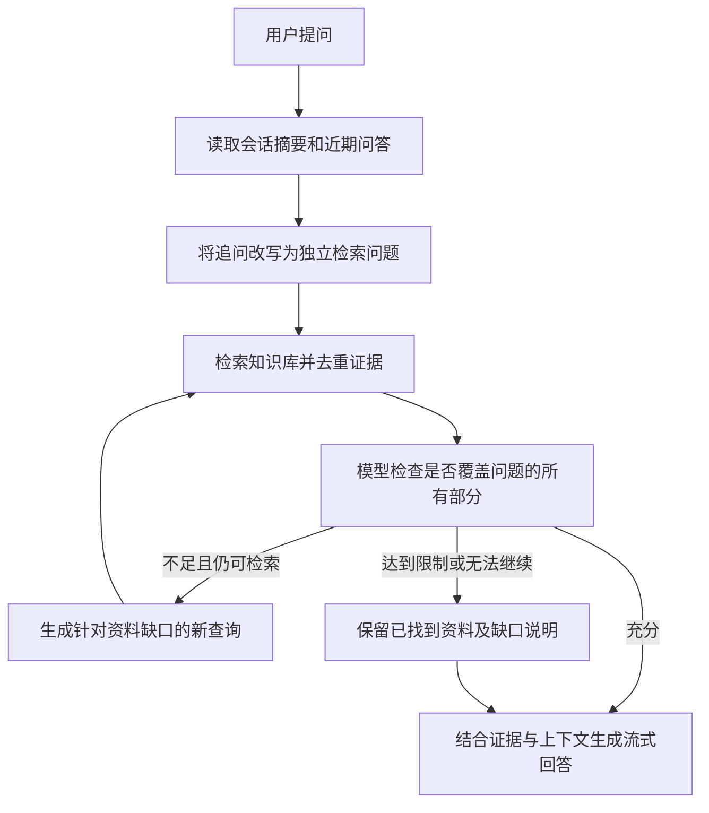

# Java MaxKB 迭代检索、上下文压缩与隔离 Python 执行

Java 后端通过 tio-boot 路由、SSE 流式响应和数据库访问能力，将会话记忆、知识检索及最终回答连接为统一流程。推理和向量调用远程服务，文档解析继续按文件类型选择原生文本提取或 OCR。

## 一次提问中的迭代检索

流程如下：



核验模型仅输出结构化决策：是否充分、缺失的资料、下一轮查询。它不会把自身常识作为新增证据。每轮最多执行两个查询，按段落 ID 去重；最终回答引用累计的知识库资料。证据不足时，回答应指出无法核实的部分。

问题改写、摘要和证据核验通过 `UniChatClient.generate` 采用非流式辅助调用，设置 `thinking.type=disabled`，让有限输出额度用于实际结果。对于返回 `finish_reason=length` 的辅助调用，后端将其视为未完成，不会把被截断的摘要写入压缩水位。最终回答使用应用选择的推理模型，通过 `UniChatClient.streamOpenAi` 的 OpenAI 兼容回调入口以 SSE 流式输出。统一客户端传递 `thinking`、输出格式和 token 上限；业务层不自建 HTTP 传输。

循环在资料充分、达到轮次上限、后续查询重复、没有新增证据、达到证据容量限制、没有后续查询或核验失败时停止。核验失败不会标记为“资料充分”。这是一条专用知识检索 Agent 流程，并不代表所有工作流节点均已实现。

在 `maxkb-web/my.txt` 中配置：

```properties
kb.agent.max_rounds=3
kb.agent.evidence_tokens=16000
kb.context.recent_tokens=6000
```

| 参数 | 默认值 | 范围或含义 |
| --- | --- | --- |
| `kb.agent.max_rounds` | 3 | 1～6 次检索与核验循环 |
| `kb.agent.evidence_tokens` | 16000 | 1000～24000，累计证据预算 |
| `kb.context.recent_tokens` | 6000 | 512～16000，历史摘要与未压缩问答的合计 token 阈值 |
| 应用 `dialogue_number` | 未设置时为 5 | 0～20，0 禁用历史；正数为超 token 阈值压缩后保留原文的目标轮数 |

单次问题最多 4000 个估算 token，累计证据最多 40 个段落。计数采用本地 tokenizer 估算，与远程模型实际计费 token 可能不同。生成请求也对系统提示、资料及问题设置长度保护。

## Context compaction：摘要加近期原文

长会话使用“持久摘要＋近期问答”的上下文组织方式。仅当历史摘要与未压缩问答的估算 token 合计超过 `kb.context.recent_tokens` 时，系统才将较早问答分批合并到摘要，保留用户目标、约束、实体、数字、日期、更正、未解决问题及引用来源，再携带近期原文继续检索与回答。

未达到阈值时携带全部未压缩历史原文，即使超过 `dialogue_number` 也不调用摘要模型。等于阈值时同样不压缩。超限后按目标轮数和剩余预算保留近期原文，至少保留最近一轮；单条超长记录可能截断。

摘要属于历史数据，使用普通消息承载，不能覆盖系统规则；历史回答也不能替代本轮知识库证据。较长的单条消息会按预算截断。摘要是有损压缩，原始问答始终保留在聊天记录表，供界面查看和审计。

公开的 [OpenAI compaction 文档](https://developers.openai.com/api/docs/guides/compaction) 描述了压缩长期上下文的机制。本实现借鉴其控制上下文大小的思路，但使用 Gitee 生成可读摘要，不调用 OpenAI 的压缩接口，也不是其加密压缩项格式。

`scripts/005-agent-context.sql` 新增 `max_kb_chat_context`：

| 字段 | 含义 |
| --- | --- |
| `chat_id` | 会话 ID，主键 |
| `summary` | 较早会话的摘要 |
| `through_record_id` | 已完成压缩的记录水位 |
| `compacted_rounds` | 累计压缩轮数 |
| `revision` | 摘要修订号，用于并发更新校验 |

摘要生成成功后才推进水位；失败时保留旧摘要和原始记录。重新启动后按持久水位继续，不会重复压缩已经合并的记录。同一 Java 进程内，同一会话只允许一个生成或手动压缩任务，避免追问读取未完成答案。多实例部署需要在这一层增加分布式会话互斥。

## 后端接口及 SSE

接口均要求身份认证，且检查会话归属。分享访客只能操作属于自己的会话。

| 方法与路径 | 行为 |
| --- | --- |
| `GET /api/application/{app}/chat/{chat}/context` | 读取摘要、压缩水位、累计轮数与修订号 |
| `POST /api/application/{app}/chat/{chat}/context/compact` | 检查 token 阈值，超限才压缩；未超限返回 compacted=false，不推进修订号 |
| `POST /api/application/chat_message/{chat}` | 自动读取、按需压缩，然后迭代检索与流式生成 |
| `GET /api/application/{app}/chat/{chat}/chat_record/{record}` | 返回回答、引用及检索轨迹 |

聊天流新增 `event: agent_status`，普通答案流字段保持兼容。`phase` 依次可能为 `context`、`compacting`、`retrieving`、`assessed`、`generating`。前端将这些事件显示为进度，不追加到答案正文。`context` 仅表示读取历史；只有超限且确实开始调用摘要模型时才发送 `compacting`，显示 Compacting context。

记录详情新增：

```json
{
  "agent_trace": [{
    "round": 1,
    "queries": ["行政复议一般申请期限"],
    "new_paragraph_ids": ["段落ID"],
    "total_evidence": 1,
    "sufficient": false,
    "missing": "缺少特殊情形的期限规定",
    "next_queries": ["不可抗力导致行政复议期限耽误"]
  }],
  "agent_stop_reason": "sufficient",
  "context_info": {
    "compacted_rounds": 8,
    "recent_rounds": 5,
    "revision": 2
  }
}
```

轨迹记录查询与证据判断，不存储模型私有思维过程。`agent_stop_reason` 的取值包括 `sufficient`、`max_rounds`、`duplicate_query`、`no_new_evidence`、`evidence_budget`、`no_followup_query`、`no_datasets`、`assessment_error`。

## 保留 Python 函数，使用一次性隔离容器

Java 负责鉴权、函数存储、参数转换、执行调度；Python 保留原版函数代码的执行能力。每次调试或执行创建一个一次性容器，通过标准输入输出交换 JSON，结束后删除容器。代码中最后一个顶层函数为默认入口；调试请求可用 `entrypoint` 显式指定。

容器默认无网络、根文件系统只读、非 root 用户、移除 Linux capabilities、禁止提权，并限制内存、CPU、进程数、输入输出及执行时间。临时目录使用内存文件系统。不挂载宿主机目录或 Docker socket，也不传入模型密钥和数据库凭据。

| 限制 | 默认设置 |
| --- | --- |
| 并发执行 | 每个 Java 进程最多 2 个 |
| 执行时间 | 15 秒，可通过 `kb.python.timeout_seconds` 调整为 1～60 秒 |
| 内存 / CPU / 进程数 | 256 MiB / 1 CPU / 32 |
| 代码 / 总输入 / 输出 | 64 KiB / 128 KiB / 256 KiB |
| 临时目录 | 16 MiB |

Docker 不可用时返回明确错误，绝不自动改为宿主机 Python 执行。需要外网或第三方包的函数，应由运维准备经过审核的镜像；默认镜像仅含 Python 标准环境，不自动安装函数代码请求的依赖。

### 本机 WSL 部署

先按 [微软 WSL 安装说明](https://learn.microsoft.com/en-us/windows/wsl/install) 启用所需 Windows 组件；如果提示重启，保存工作后重启。准备 Ubuntu 发行版：

```powershell
wsl --install -d Ubuntu --no-launch
```

Java 项目提供以下脚本，在 WSL Ubuntu 内通过 [Docker 官方软件源](https://docs.docker.com/engine/install/ubuntu/) 安装 Docker Engine，不依赖 Docker Desktop：

```powershell
.\scripts\Setup-PythonSandbox.ps1 -Distribution Ubuntu
.\scripts\Test-PythonSandbox.ps1 -Distribution Ubuntu
```

测试脚本验证容器用户、密钥不可见、根目录不可写及外部网络不可达。完成后在私有配置中添加并重启 Java 服务：

```properties
kb.python.wsl.distribution=Ubuntu
kb.python.timeout_seconds=15
```

已有原生 Docker CLI 时不配置 `kb.python.wsl.distribution`，可用 `kb.python.docker` 指定 CLI 路径，用 `kb.python.image` 指定已拉取的受信任镜像。Java 请求采用 `--pull=never`，镜像应由部署流程提前准备。

### 函数库接口

`scripts/006-python-functions.sql` 新增函数存储。可重复执行 `Initialize-Database.ps1` 应用迁移，已有数据保留。

| 方法与路径 | 功能 |
| --- | --- |
| `GET /api/function_lib` | 函数列表，最多 100 条 |
| `GET /api/function_lib/{page}/{size}` | 分页函数列表 |
| `POST /api/function_lib` | 创建函数 |
| `GET /api/function_lib/{id}` | 查看函数 |
| `PUT /api/function_lib/{id}` | 修改自己的函数 |
| `DELETE /api/function_lib/{id}` | 软删除自己的函数 |
| `POST /api/function_lib/debug` | 按原版参数结构调试 Python 代码 |
| `POST /api/function_lib/pylint` | 容器内进行 Python 语法检查，返回前端兼容的行列诊断；不等同于完整 Pylint 规则集 |
| `POST /api/function_lib/{id}/execute` | 执行自己保存且启用的函数，请求体为参数对象 |

支持 `string`、`int`、`float`、`dict`、`array` 参数类型。保存函数的初始化参数与调用参数合并后传入 Python，调用参数优先。公开函数列表不会向其他用户返回初始化参数值。共享执行入口为 `PythonFunctionService.execute`，可供后续工作流节点调度接入；这不代表任意原版工作流都已完成兼容。

## 验证重点

自动化测试覆盖证据不足触发二次检索、重复查询停止、无新增证据停止、轮次上限、空证据不能判为充分、核验失败、压缩水位、摘要失败不推进、重启后复用、关闭历史、会话互斥、Python 容器启动参数和无 Docker 时拒绝执行。

界面验收应包含：复合问题触发再次检索；资料缺失时明确说明；长会话压缩后仍可理解追问；刷新页面可恢复检索轨迹。容器准备完成后还应实测 Python 返回值、异常、超时、文件系统及网络限制。

构建时增加 `-Dgpg.skip=true` 跳过签名。官方前端升级与定制恢复见 [补丁维护](40.md)。
