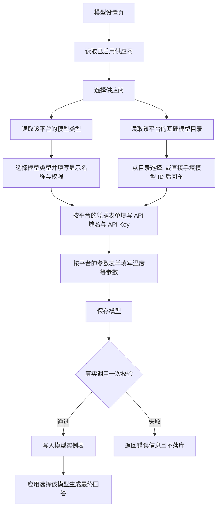

# 支持自定义模型

[[toc]]

Java MossKB 把供应商、基础模型目录、凭据表单和参数表单统一放进 PostgreSQL，模型设置页因此可以按需扩展：接入一家新的 OpenAI 兼容平台、登记一批候选模型 ID、或者直接手填任意模型 ID，都不需要修改 Java 代码，也不需要给官方前端打补丁。生成与模型发现复用 `java-openai` 的 `UniChatClient`，业务层不自建 HTTP 传输。

下面出现的 Java 代码是对应实现的节选，保留了与本主题相关的成员与导入，省略了与之无关的部分。

## 设计要点

| 目标 | 实现方式 |
| --- | --- |
| 新增平台不改代码 | 供应商 ID、名称、图标、默认 API 地址、支持的模型类型、凭据表单、参数表单都是数据行 |
| 任意模型 ID 可用 | 基础模型目录只做候选提示，不是白名单；保存时原样传递填写的 ID |
| 密钥不泄漏 | 平台目录不保存密钥；用户模型密钥归属到模型实例，详情接口只返回掩码 |
| 复用官方模型管理页 | 保持官方前端所需的 `{code,message,data}` 响应结构与参数名 |
| 改目录立即生效 | 目录在每次请求时读取，修改数据行后无需重新打包 Java |

模型类型目前覆盖大语言模型（`LLM`）与向量模型（`EMBEDDING`）。重排、语音、视觉等类型在官方页面上可见，但不属于本次接入范围。

## 一次模型管理请求的走向



## 数据结构

| 表 | 保存内容 |
| --- | --- |
| `moss_kb_model_provider` | 平台 ID、名称、图标、默认 API 地址、协议、支持的模型类型、凭据表单、参数表单、启用状态和排序 |
| `moss_kb_model_catalog` | 平台 ID + 模型类型 + 模型 ID 的联合主键、描述、来源、启用状态、更新时间 |
| `moss_kb_model` | 用户实际创建的模型、权限、所属用户、所选模型 ID、凭据、参数表单 |

平台目录与基础模型目录都不保存 API Key：`credential_form` 只是一段表单结构，里面的 `api_key` 字段 `default_value` 为 `null`。用户填写的真实密钥保存在模型实例自己的 `credential` 字段里，读取时先取出再替换成掩码，因此模型详情接口返回的永远是掩码而不是明文。

表结构由迁移脚本建立：

```sql
CREATE TABLE IF NOT EXISTS moss_kb_model_provider (
 provider varchar(128) PRIMARY KEY,
 name varchar(200) NOT NULL,
 icon text NOT NULL DEFAULT '',
 api_base text NOT NULL DEFAULT '',
 protocol varchar(40) NOT NULL DEFAULT 'OPENAI_COMPATIBLE',
 model_types jsonb NOT NULL,
 credential_form jsonb NOT NULL,
 params_form jsonb NOT NULL,
 enabled boolean NOT NULL DEFAULT true,
 sort_order integer NOT NULL DEFAULT 0,
 updated_at timestamptz NOT NULL DEFAULT now());

CREATE TABLE IF NOT EXISTS moss_kb_model_catalog (
 provider varchar(128) REFERENCES moss_kb_model_provider(provider),
 model_type varchar(30) NOT NULL,
 model_id varchar(256) NOT NULL,
 description text,
 source text NOT NULL DEFAULT 'seed',
 enabled boolean NOT NULL DEFAULT true,
 updated_at timestamptz NOT NULL DEFAULT now(),
 PRIMARY KEY(provider,model_type,model_id));

ALTER TABLE moss_kb_model ADD COLUMN IF NOT EXISTS model_params_form jsonb NOT NULL DEFAULT '[]';
```

写这类多行语句的 Java 代码时统一用文本块承载，避免字符串拼接丢空格、漏换行：

```java
package nexus.io.mosskb.service.kb;

import java.util.ArrayList;
import java.util.List;
import com.jfinal.kit.Kv;
import nexus.io.db.activerecord.Db;
import nexus.io.db.activerecord.Row;

public class ModelCatalogService {

  public List<Kv> providers() {
    return providers(null);
  }

  /**
   * @param modelType 目录中登记的模型类型，可为空；为空时返回全部已启用平台
   */
  public List<Kv> providers(String modelType) {
    String sql = """
        select p.provider,p.name,p.icon from moss_kb_model_provider p
        where p.enabled=true
          and (cast(? as text) is null
               or exists (select 1 from jsonb_array_elements(p.model_types) t where t->>'value'=?))
        order by p.sort_order,p.name
        """;
    List<Kv> result = new ArrayList<>();
    for (Row row : Db.find(sql, modelType, modelType)) {
      result.add(row.toKv());
    }
    return result;
  }
}
```

`providers` 用 `jsonb_array_elements` 展开表里的 `model_types`，因此“这个平台是否支持向量模型”完全由数据决定：既不需要额外建索引表，也不会把平台列表写死在代码里。传空值即返回全部已启用平台，官方页面在“全部模型”选项下走的就是这条路径。

运行 `scripts/Initialize-Database.ps1`，会在原有迁移之后按顺序执行 `008-model-catalog.sql` 与 `009-model-catalog-snapshot.sql`：前者建表并写入平台，后者登记获取到的目录快照。两个脚本都可以重复执行，供应商冲突时保留已有管理配置，目录项冲突时保留已有行。旧 JSON 文件不再作为运行时模型目录来源，目录全部来自数据表。

已有模型实例与 ID 保留。两条默认 Gitee 模型只有在 `credential` 为空对象时才被归入 Gitee 平台，管理员已经填写过凭据的行不会被改写。

## 已配置的平台

| 平台 | 默认兼容 API 地址 | 目录中的模型类型 |
| --- | --- | --- |
| OpenAI 兼容 / 自定义中转 | 自行填写 | 大语言模型、向量模型 |
| OpenAI | `https://api.openai.com/v1` | 大语言模型、向量模型 |
| Gitee AI | `https://ai.gitee.com/v1` | 大语言模型、向量模型 |
| OpenRouter（含 Claude / GPT / Gemini） | `https://openrouter.ai/api/v1` | 大语言模型 |
| 硅基流动 | `https://api.siliconflow.cn/v1` | 大语言模型、向量模型 |
| DeepSeek | `https://api.deepseek.com` | 大语言模型 |
| 阿里云百炼 | `https://dashscope.aliyuncs.com/compatible-mode/v1` | 大语言模型、向量模型 |
| Kimi | `https://api.moonshot.cn/v1` | 大语言模型 |
| 智谱 AI | `https://open.bigmodel.cn/api/paas/v4` | 大语言模型、向量模型 |
| Gemini（OpenAI 兼容） | `https://generativelanguage.googleapis.com/v1beta/openai` | 大语言模型 |
| 火山方舟 | `https://ark.cn-beijing.volces.com/api/v3` | 大语言模型 |
| New API / One API 中转 | 自行填写 | 大语言模型、向量模型 |

打开“添加模型”后可以按模型类型过滤供应商，只列出支持该类型的平台：


例如只筛向量模型时，只保留上表里支持向量模型的 7 个平台：


这里接入的是 OpenAI 兼容的 `/chat/completions`、`/embeddings` 接口。Claude 可以通过 OpenRouter 或其他兼容中转选择；这不表示已实现 Anthropic 原生接口、Bedrock 签名认证或所有厂商的图片、音频、工作流能力。平台地域、套餐与密钥必须对应，例如专属套餐不能直接使用普通付费接口地址。

随迁移脚本落库的目录快照包含 OpenRouter 的 378 个文本生成目录项，以及 Gitee 的 78 个文本生成、13 个向量目录项。OpenRouter 按输出模态筛选，并排除批处理专用 ID；Gitee 的 `/models` 不提供能力元数据，同步脚本只识别明确的文本模型系列和向量命名，排除 OCR、语音、重排等名称。重复运行同步脚本会按平台当时的返回刷新目录，条目数量随平台上架与下线变化；最终是否可用以保存时的实际请求为准。其他平台在没有可用密钥时不伪造“已实测可用”的模型列表，可以手工输入模型 ID，也可以由管理员发现后登记目录。

## 目录接口

所有接口都需要登录，并保持官方前端所需的 `{code,message,data}` 响应结构。

| 方法 | 路径 | 内容 |
| --- | --- | --- |
| GET | `/api/provider` | 已启用平台；带 `model_type` 时只返回支持该类型的平台 |
| GET | `/api/provider/model_type_list?provider=...` | 平台模型类型 |
| GET | `/api/provider/model_list?provider=...&model_type=LLM` | 数据库中的基础模型目录 |
| GET | `/api/provider/model_form?provider=...&model_type=LLM&model_name=...` | 凭据表单；自定义 ID 同样可用 |
| GET | `/api/provider/model_params_form?provider=...&model_type=LLM&model_name=...` | 平台参数表单 |
| GET / PUT | `/api/model/{id}/model_params_form` | 模型实例的参数表单 |
| POST | `/api/provider/catalog/discover` | 管理员调用兼容 `/models` 发现模型，不保存请求中的凭据 |
| PUT | `/api/provider/catalog` | 管理员登记或停用目录项 |

控制器保持极薄，全部逻辑在目录服务里：

```java
package nexus.io.mosskb.controller;

import com.alibaba.fastjson2.JSON;
import nexus.io.annotation.Get;
import nexus.io.annotation.Post;
import nexus.io.annotation.Put;
import nexus.io.annotation.RequestPath;
import nexus.io.jfinal.aop.Aop;
import nexus.io.mosskb.service.kb.ModelCatalogService;
import nexus.io.model.result.ResultVo;
import nexus.io.tio.boot.http.TioRequestContext;
import nexus.io.tio.http.common.HttpRequest;

@RequestPath("/api/provider")
public class ApiProviderController {
  private final ModelCatalogService catalog = Aop.get(ModelCatalogService.class);

  @Get("")
  public ResultVo index(String model_type) {
    return ResultVo.ok(catalog.providers(model_type));
  }

  @Get("/model_type_list")
  public ResultVo model_type_list(String provider) {
    return ResultVo.ok(catalog.types(provider));
  }

  @Get("/model_list")
  public ResultVo model_list(String provider, String model_type) {
    return ResultVo.ok(catalog.models(provider, model_type));
  }

  @Get("/model_form")
  public ResultVo model_form(String provider, String model_type, String model_name) {
    return ResultVo.ok(catalog.form(provider, "credential_form"));
  }

  @Post("/catalog/discover")
  public ResultVo discover(HttpRequest request) {
    return catalog.discover(TioRequestContext.getUserIdLong(), JSON.parseObject(request.getBodyString()));
  }

  @Put("/catalog")
  public ResultVo saveCatalog(HttpRequest request) {
    return catalog.saveCatalog(TioRequestContext.getUserIdLong(), JSON.parseObject(request.getBodyString()));
  }
}
```

服务侧用文本块承载查询语句，目录检索只返回启用状态且所属平台也启用的行：

```java
package nexus.io.mosskb.service.kb;

import java.util.ArrayList;
import java.util.List;
import com.jfinal.kit.Kv;
import nexus.io.db.activerecord.Db;
import nexus.io.db.activerecord.Row;

public class ModelCatalogService {

  public List<Kv> models(String provider, String type) {
    String sql = """
        select model_id as name,description as desc,model_type
        from moss_kb_model_catalog c
        where provider=? and model_type=? and enabled=true
          and exists(select 1 from moss_kb_model_provider p where p.provider=c.provider and p.enabled=true)
        order by model_id
        """;
    List<Kv> result = new ArrayList<>();
    for (Row row : Db.find(sql, provider, type)) {
      result.add(row.toKv());
    }
    return result;
  }
}
```

`model_form` 与 `model_params_form` 返回的是平台行里的 `credential_form`、`params_form`，与具体模型 ID 无关，所以手填的模型 ID 同样能拿到凭据表单。模型 ID 最长 256 字符，不允许控制字符；API 域名必须是 HTTP(S) 基础地址，且不能带用户名、密钥、查询参数或片段，避免把密钥拼进地址里。

## 在模型设置页创建模型


1. 打开“系统管理 → 模型设置”，点击“添加模型”。
2. 设置显示名称与权限（私有仅当前用户可用，公有所有用户可用）。
3. 选择模型类型，然后在“基础模型”里从目录中挑选，或直接输入完整模型 ID 后回车。可以包含 `/`、`:`，例如中转平台给出的供应商前缀与别名；目录不是白名单。
4. 按平台提示填入 API 域名与自己的 API Key，并按需调整温度、输出最大 Tokens 等参数，保存。

第 3 步手填模型 ID 的效果：


保存时会真实调用一次填写的模型 ID。聊天模型通过 `UniChatClient.generate` 发一条非流式的最小请求校验；向量模型使用填写的 ID 发起 embeddings 请求，并要求返回长度正好是 1024 且数值有效。保存成功表示该次校验通过，后续是否可用仍受平台额度、权限和模型状态影响。

```java
package nexus.io.mosskb.service.kb;

import java.io.IOException;
import java.util.List;
import com.alibaba.fastjson2.JSON;
import com.alibaba.fastjson2.JSONObject;
import nexus.io.chat.UniChatClient;
import nexus.io.chat.UniChatMessage;
import nexus.io.chat.UniChatRequest;
import nexus.io.chat.UniChatResponse;
import nexus.io.mosskb.vo.CredentialVo;
import nexus.io.mosskb.vo.ModelVo;
import nexus.io.openai.client.OpenAiClient;
import okhttp3.Response;

public class MossKbModelService {

  static void validateModel(ModelVo model) throws IOException {
    CredentialVo credential = model.getCredential();
    if ("EMBEDDING".equals(model.getModel_type())) {
      JSONObject input = new JSONObject();
      input.put("model", model.getModel_name());
      input.put("input", List.of("模型连接测试"));
      input.put("dimensions", 1024);
      try (Response response = OpenAiClient.embeddings(credential.getApi_base(), credential.getApi_key(), input.toJSONString())) {
        if (!response.isSuccessful() || response.body() == null) {
          throw new IllegalArgumentException("向量模型校验失败，HTTP " + response.code());
        }
        float[] vector = JSON.parseObject(response.body().string())
            .getJSONArray("data").getJSONObject(0).getObject("embedding", float[].class);
        if (vector == null || vector.length != 1024) {
          throw new IllegalArgumentException("当前知识库需要 1024 维向量，请选用支持 dimensions=1024 的模型");
        }
        for (float value : vector) {
          if (!Float.isFinite(value)) {
            throw new IllegalArgumentException("向量模型返回无效数据");
          }
        }
      }
    } else {
      UniChatRequest request = new UniChatRequest();
      request.setModel(model.getModel_name())
          .setApiPrefixUrl(credential.getApi_base())
          .setApiKey(credential.getApi_key())
          .setStream(false)
          .setMessages(List.of(new UniChatMessage("user", "Reply OK")));
      UniChatResponse response = UniChatClient.generate(request);
      if (response == null || response.getRawData() == null) {
        throw new IllegalArgumentException("模型未返回有效响应");
      }
    }
  }
}
```

编辑时保留掩码或留空 Key，后端沿用原密钥；如果更换 API 域名，必须重新填写新平台的 Key，避免把旧平台的密钥发给新地址。除两条默认 Gitee 种子模型外，不会在用户模型缺少密钥时自动借用服务器的 Gitee Key。模型详情接口返回的 `credential.api_key` 固定为掩码，列表接口根本不查询该字段。

## 管理员发现与登记

发现接口请求为 `{"api_base":"https://平台地址/v1","api_key":"自己的密钥"}`，返回该密钥可见的模型 ID 列表；接口只做一次查询，不把凭据写入任何表。接口未携带完整能力信息时，由管理员明确指定模型类型后再登记，不把所有 ID 当作聊天模型。

登记请求：

```json
{
  "provider": "model_default_provider",
  "models": [
    {"name": "vendor/model-id", "model_type": "LLM", "desc": "本单位中转模型", "enabled": true}
  ]
}
```

同平台、类型及 ID 再次提交会更新原行的描述、来源与启用状态；设置 `enabled:false` 隐藏目录项，不删除用户已经保存的模型，也不影响已引用该目录项的模型实例继续工作。一次最多 5000 项，批量操作在事务内完成，并先逐项校验模型 ID 与类型。登记需要管理员身份，普通用户不能修改共享目录。

```java
package nexus.io.mosskb.service.kb;

import com.alibaba.fastjson2.JSONArray;
import com.alibaba.fastjson2.JSONObject;
import com.jfinal.kit.Kv;
import nexus.io.db.activerecord.Db;
import nexus.io.model.result.ResultVo;

public class ModelCatalogService {

  public ResultVo saveCatalog(Long userId, JSONObject input) {
    if (!admin(userId)) {
      return ResultVo.fail(403, "仅管理员可管理共享模型目录");
    }
    String provider = input.getString("provider");
    if (provider(provider) == null) {
      return ResultVo.fail(400, "供应商不存在或已停用");
    }
    JSONArray models = input.getJSONArray("models");
    if (models == null || models.size() > 5000) {
      return ResultVo.fail(400, "models 必须是最多 5000 项的数组");
    }
    for (int i = 0; i < models.size(); i++) {
      JSONObject model = models.getJSONObject(i);
      modelId(model.getString("name"));
      if (!List.of("LLM", "EMBEDDING").contains(model.getString("model_type"))) {
        return ResultVo.fail(400, "当前支持 LLM 和 EMBEDDING 类型");
      }
    }
    String upsert = """
        insert into moss_kb_model_catalog(provider,model_type,model_id,description,source,enabled)
        values(?,?,?,?,?,?)
        on conflict(provider,model_type,model_id)
        do update set description=excluded.description,source=excluded.source,enabled=excluded.enabled,updated_at=now()
        """;
    Db.tx(() -> {
      for (int i = 0; i < models.size(); i++) {
        JSONObject model = models.getJSONObject(i);
        Db.update(upsert,
            provider, model.getString("model_type"), modelId(model.getString("name")), model.getString("desc"),
            "admin", !Boolean.FALSE.equals(model.getBoolean("enabled")));
      }
      return true;
    });
    return ResultVo.ok(Kv.by("updated", models.size()));
  }
}
```

对于 OpenRouter 和 Gitee，可以运行已有同步脚本批量登记：

```powershell
python scripts/Sync-ModelCatalog.py --source openrouter --token-file <管理员令牌文件>
# Gitee 还需在当前进程环境中设置 GITEE_API_KEY
python scripts/Sync-ModelCatalog.py --source gitee --token-file <管理员令牌文件>
```

脚本先读取平台的 `/models`，筛出候选项，再带上管理员令牌调用登记接口；默认接口地址是本机后端，可以用 `--api` 指向其他实例。脚本只登记本次获取到的候选项，不删除未返回的旧项，管理员应按平台下线公告把停用模型设为 `enabled:false`。令牌文件和密钥不提交到仓库。

新增平台无需改代码：在数据表里复制一行兼容平台配置，修改平台 ID、名称、默认 API 地址，以及凭据表单里的默认地址即可。名称、图标和表单都来自数据行，页面上会立即出现新平台。

## 向量空间约束

向量列本身不声明维度，1024 维是应用层的约定：向量化请求固定携带 `dimensions=1024`，返回值长度不是 1024 或出现无效数值时直接拒绝。这样同一个知识库内所有向量都落在同一空间，历史数据无需迁移即可继续检索。

| 场景 | 行为 |
| --- | --- |
| 创建或编辑向量模型 | 用填写的模型 ID 真实请求一次 embeddings，长度必须为 1024 |
| 文档导入、分段新增与编辑 | 使用所属知识库的 `embedding_mode_id` 生成向量 |
| 命中测试与对话检索 | 按 `embedding_mode_id` 分组，每组生成一个查询向量后合并结果并排序 |
| 知识库已有文档时切换向量模型 | 直接拒绝，提示新建知识库并重新导入文档 |
| 向量模型已被知识库引用时改模型 ID 或 API 地址 | 直接拒绝，提示新建模型和知识库 |
| 删除仍被应用或知识库引用的模型 | 直接拒绝 |

跨知识库查询时先按模型分组，再分别取查询向量，最后统一排序截断：

```java
package nexus.io.mosskb.service.kb;

import java.util.ArrayList;
import java.util.List;
import nexus.io.db.activerecord.Db;
import nexus.io.db.activerecord.Row;
import nexus.io.jfinal.aop.Aop;

public class MossKbParagraphRetrieveService {

  public List<Row> searchRows(Long[] datasets, Float threshold, Integer limit, String question, String mode) {
    if (datasets == null || datasets.length == 0) {
      return List.of();
    }
    if (!"keywords".equals(mode)) {
      java.util.Map<Long, List<Long>> groups = new java.util.LinkedHashMap<>();
      String sql = """
          select id,coalesce(embedding_mode_id,1002) as model_id
          from moss_kb_dataset
          where id=any(?) and deleted=0
          """;
      for (Row dataset : Db.find(sql, (Object) datasets)) {
        groups.computeIfAbsent(dataset.getLong("model_id"), key -> new ArrayList<>()).add(dataset.getLong("id"));
      }
      List<Row> all = new ArrayList<>();
      for (java.util.Map.Entry<Long, List<Long>> group : groups.entrySet()) {
        Long vectorId = Aop.get(KbEmbeddingService.class).getVectorIdForModel(question, group.getKey());
        all.addAll(searchGroup(group.getValue().toArray(new Long[0]), threshold, limit, question, mode, vectorId));
      }
      all.sort(java.util.Comparator.<Row>comparingDouble(row -> ((Number) row.get("similarity")).doubleValue()).reversed());
      return all;
    }
    return searchGroup(datasets, threshold, limit, question, mode, null);
  }
}
```

不同知识库可以选择不同的兼容向量模型。不同模型的相似度分布并不一致，换用新模型后仍应结合测试集重新调整相似度阈值，而不是沿用旧值。

## 默认模型与辅助链路

默认检索向量为 Gitee 的 `Qwen3-Embedding-8B`（1024 维），默认生成模型为 Gitee 的 `deepseek-v4.1-flash`，两者都对应默认种子模型实例。没有在应用里指定模型时，最终回答使用 Gitee 的默认生成模型。`deepseek-v4.1-flash` 属 DeepSeek Flash 系列，DeepSeek 官方平台把同系列模型 ID 写作 `deepseek-flash`，两者是不同平台的 ID，不要混填；三个默认模型的平台、维度与配置键汇总见[默认模型](./readme.md)。

问题改写、证据核验和摘要等辅助步骤继续使用配置的 Gitee 模型，属于固定开销较小的非流式调用；应用选择的新模型用于最终回答，因此接入更贵的模型只会抬高回答部分的成本。OCR 继续按文档检测策略调用 `PaddleOCR-VL-1.5`，与用户选择的对话模型互不影响。

`GITEE_API_KEY` 与默认模型名可以通过环境配置覆盖；向量模型、生成模型和 API 地址都有对应的配置键，部署时可以整体切到自建网关。

## 验证与边界

本次完成本地协议测试（自定义 ID 原样传递、错误向量维度拒绝、密钥隔离）、真实 Gitee 创建与掩码编辑测试，以及官方 UI 的模型目录、手填自定义 ID、按类型过滤供应商和知识库追问验证。其他平台尚未提供真实 Key，因此不宣称全部平台模型都已完成真实推理测试。目录快照代表获取时的平台列表，不代表永久可用或统一计费。

平台接口说明：[OpenRouter 模型目录](https://openrouter.ai/docs/api/api-reference/models/get-models)、[Gitee API](https://ai.gitee.com/docs/products/apis)、[百炼 Base URL](https://help.aliyun.com/zh/model-studio/base-url)、[Gemini OpenAI 兼容](https://ai.google.dev/gemini-api/docs/openai)、[DeepSeek 模型列表](https://api-docs.deepseek.com/api/list-models/)。
