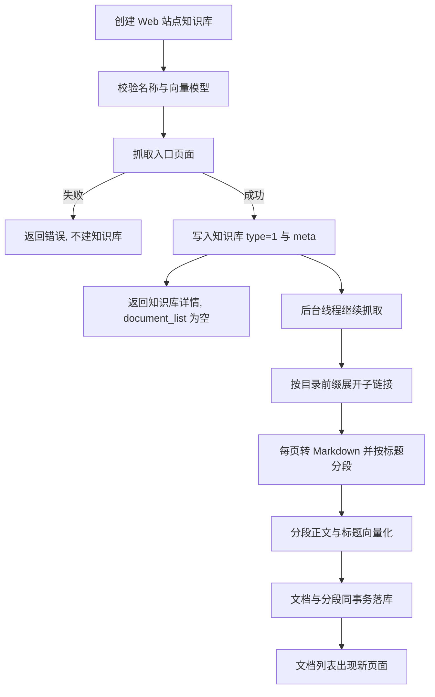

# 爬取网页数据

[[toc]]

Web 站点知识库只描述两件事：一个根地址，以及一个可选的正文选择器。后端按目录范围把站点抓下来，转成 Markdown 后按标题切成段落，逐个页面写进文档列表。抓取与向量化都在后台线程执行，创建接口立即返回，文档会随着抓取进度陆续出现，界面上的文档列表每 6 秒刷新一次，不需要等到整站抓完。

下面出现的 Java 代码是对应实现的节选，保留了与本主题相关的成员与导入。

## 设计要点

| 目标 | 实现方式 |
| --- | --- |
| 建库即校验地址 | 创建前真实抓一次入口页面，地址不可用或取不到正文时直接返回错误，不留空知识库 |
| 抓取范围可控 | 只跟随入口地址所在目录下的链接，入口页之下最多再展开两层，一次最多 50 页 |
| 正文可裁剪 | 选择器为空时取整个 body，填了就用 CSS 选择器取正文容器，命中多个元素按顺序拼接 |
| 同一页面只存一份 | 记录重定向之后的正式地址，带后缀的旧地址不再单独成页 |
| 分段可读可检索 | HTML 转 Markdown 保留标题层级，按标题切分，标题链写入分段标题，正文与标题都参与向量化 |
| 同步不重复劳动 | 文档按来源地址匹配，替换同步命中已有文档时整份替换段落；向量请求命中缓存后重复同步很快 |
| 同步不互相踩 | 同一知识库、同一文档同时只允许一个抓取任务，重复触发返回明确提示 |
| 失败可见可重试 | 抓取失败的地址仍会建一条失败状态的文档，用户在列表里能看到并再次同步 |

## 一次同步的走向



## 请求与响应

创建接口是 `POST /api/dataset/web`：

```json
{
  "name": "tio-boot",
  "desc": "tio-boot 站点资料",
  "embedding_mode_id": 1002,
  "source_url": "https://www.tio-boot.com/",
  "selector": ""
}
```

`type` 由后端固定写成 `1`（Web 站点），前端即使带上 `type` 也不影响结果；`selector` 允许为空。

```json
{
  "code": 200,
  "message": null,
  "data": {
    "id": "696030923267534848",
    "name": "TIO-BOOT 官网抓取",
    "desc": "抓取 tio-boot 官网首页与两层子页面，验证网页知识库",
    "type": "1",
    "embedding_mode_id": "1002",
    "meta": {
      "source_url": "https://www.tio-boot.com",
      "selector": "",
      "embedding_mode_id": 1002
    },
    "document_list": []
  }
}
```

`document_list` 此刻一定是空数组：页面还在后台抓。地址末尾的斜杠与 `#` 片段会被去掉，重定向也会归一到正式地址，`meta.source_url` 里存的就是这个规范化之后的地址，后续同步直接用它。

## 抓取范围

| 规则 | 取值 | 说明 |
| --- | --- | --- |
| 跟随层数 | 入口页 + 2 层子链接 | 入口页算第 0 层，第 2 层页面里的链接不再继续展开 |
| 目录范围 | 入口地址所在目录 | 入口是 `/zh/15_java-db/01` 时，只抓 `/zh/15_java-db/` 下的页面，同站其它目录不抓 |
| 页面数量 | 一次最多 50 页 | 达到上限时写出日志并停止 |
| 单页超时 | 20 秒 | 超时或非 200 的页面记一条告警后跳过 |
| 单页体积 | 5 MiB | 超过后不再读取响应体 |
| 重定向 | 记录最终地址 | 带 `.html` 的地址被 308 重定向到正式地址时，只保留正式地址那一份 |
| 链接来源 | 整页所有 `<a href>` | 导航、页脚里的链接照样跟随，只是它们的文字不进正文 |

所以同一个知识库的页面范围是「入口地址那一节」，不是整站。想抓整站就把根地址写成站点根路径，想只抓一节就直接把入口地址写成那一节的首页地址。

## 正文选择器

选择器按 CSS 选择器解析，界面上提示的 `.classname`、`#idname`、`tagname` 三种写法都能用：

| 输入 | 行为 |
| --- | --- |
| 留空 | 取整个 body |
| `.vp-doc` | 取该容器，命中多个时按文档顺序拼接 |
| 写错格式 | 创建接口直接返回「选择器格式不正确」，不会悄悄退回 body |
| 没有命中 | 回退到整个 body，避免因为选择器写偏而抓出空文档 |

选择器会写进文档的 `meta.selector`，之后对这个文档做同步时继续使用它；知识库的 `meta.selector` 则是整站同步时的默认值。

## HTML 转 Markdown

正文提取与转换都在同一个类里完成。抓取入口负责处理重定向、状态码与超时：

```java
package nexus.io.mosskb.service.kb;

import java.io.IOException;
import java.net.URI;
import java.net.URISyntaxException;
import java.util.ArrayDeque;
import java.util.Deque;
import java.util.LinkedHashSet;
import java.util.List;
import java.util.Locale;
import java.util.Set;
import java.util.function.Consumer;

import org.jsoup.Connection;
import org.jsoup.Jsoup;
import org.jsoup.nodes.Document;

public class WebCrawlService {

  /** 部分站点会过滤默认 UA，因此使用浏览器 UA。 */
  public static final String USER_AGENT = "Mozilla/5.0 (Windows NT 10.0; Win64; x64) AppleWebKit/537.36 (KHTML, like Gecko) Chrome/127.0.0.0 Safari/537.36";

  private static final int TIMEOUT_MS = 20_000;
  private static final int MAX_BODY_BYTES = 5 * 1024 * 1024;
  private static final int MAX_DEPTH = 2;
  private static final int MAX_PAGES = 50;

  public record Page(String url, String name, String markdown, List<String> links) {
  }

  /** 抓取单个页面，链接只用于继续扩散，不计入正文。 */
  public Page fetch(String url, String selector) throws IOException {
    String target = absoluteUrl(url);
    if (target == null) {
      throw new CrawlException("Web 根地址必须是 http 或 https 地址");
    }
    Connection.Response response;
    try {
      response = Jsoup.connect(target).userAgent(USER_AGENT).timeout(TIMEOUT_MS).maxBodySize(MAX_BODY_BYTES)
          .followRedirects(true).ignoreHttpErrors(true).execute();
    } catch (IOException e) {
      throw new CrawlException("无法访问该地址：" + e.getMessage());
    }
    if (response.statusCode() != 200) {
      throw new CrawlException("目标地址返回 HTTP " + response.statusCode());
    }
    Document document = response.parse();
    // 记录重定向之后的正式地址，避免同一页面按多个地址重复入库。
    String finalUrl = absoluteUrl(response.url() == null ? target : response.url().toString());
    return new Page(finalUrl == null ? target : finalUrl, pageName(document, finalUrl), markdown(document, selector),
        pageLinks(document));
  }
}
```

逐层展开时，每抓到一页就立即回调，调用方可以边抓边落库，不必等整站抓完：

```java
package nexus.io.mosskb.service.kb;

import java.io.IOException;
import java.util.ArrayDeque;
import java.util.Deque;
import java.util.LinkedHashSet;
import java.util.Set;
import java.util.function.Consumer;

public class WebCrawlService {

  /**
   * @param firstPage 已经抓取过的入口页面，可为空；不为空时不再重复请求入口地址
   * @param onPage    每抓到一个页面就回调一次，由调用方决定如何落库
   */
  public int crawl(String sourceUrl, String selector, Page firstPage, Consumer<Page> onPage) throws IOException {
    String entry = absoluteUrl(sourceUrl);
    if (entry == null) {
      throw new CrawlException("Web 根地址必须是 http 或 https 地址");
    }
    String prefix = directoryPrefix(entry);
    Set<String> visited = new LinkedHashSet<>();
    Deque<Object[]> queue = new ArrayDeque<>();
    int count = 0;
    if (firstPage != null) {
      count++;
      visited.add(trimSlash(firstPage.url()));
      onPage.accept(firstPage);
      for (String link : firstPage.links()) {
        if (link.startsWith(prefix)) {
          queue.add(new Object[] { link, 1 });
        }
      }
    } else {
      queue.add(new Object[] { entry, 0 });
    }
    while (!queue.isEmpty() && count < MAX_PAGES) {
      Object[] current = queue.poll();
      String url = (String) current[0];
      int depth = (Integer) current[1];
      if (url == null || !visited.add(trimSlash(url))) {
        continue;
      }
      Page page;
      try {
        page = fetch(url, selector);
      } catch (IOException e) {
        continue;
      }
      String canonicalKey = trimSlash(page.url());
      if (!canonicalKey.equals(trimSlash(url)) && !visited.add(canonicalKey)) {
        continue;
      }
      count++;
      onPage.accept(page);
      if (depth >= MAX_DEPTH) {
        continue;
      }
      for (String link : page.links()) {
        if (link.startsWith(prefix) && !visited.contains(trimSlash(link))) {
          queue.add(new Object[] { link, depth + 1 });
        }
      }
    }
    return count;
  }
}
```

HTML 转 Markdown 用一次深度遍历完成，标题层级、列表、表格、代码块、链接与图片都换成 Markdown 写法，脚本、样式、表单、导航、页脚这类节点整棵跳过：

```java
package nexus.io.mosskb.service.kb;

import java.util.Locale;
import java.util.Set;

import org.jsoup.nodes.Element;
import org.jsoup.nodes.Node;
import org.jsoup.nodes.TextNode;

public class WebCrawlService {

  private static final Set<String> SKIPPED_TAGS = Set.of("script", "style", "noscript", "template", "svg", "canvas",
      "iframe", "head", "form", "select", "option", "button", "nav", "footer", "aside");

  private static void appendNode(Node node, StringBuilder out, String baseUri) {
    if (node instanceof TextNode textNode) {
      out.append(textNode.getWholeText().replace('\u00a0', ' '));
      return;
    }
    if (!(node instanceof Element element)) {
      return;
    }
    String tag = element.tagName().toLowerCase(Locale.ROOT);
    if (SKIPPED_TAGS.contains(tag) || element.hasAttr("hidden")) {
      return;
    }
    switch (tag) {
      case "h1", "h2", "h3", "h4", "h5", "h6" -> {
        int level = tag.charAt(1) - '0';
        out.append("\n\n").append("#".repeat(level)).append(' ').append(inline(element, baseUri)).append("\n\n");
      }
      case "p", "div", "section", "article", "main", "header" -> {
        out.append("\n\n");
        appendChildren(element, out, baseUri);
        out.append("\n\n");
      }
      case "ul", "ol" -> appendList(element, out, baseUri, tag);
      case "pre" -> out.append("\n\n```\n").append(element.wholeText().strip()).append("\n```\n\n");
      case "table" -> out.append("\n\n").append(table(element, baseUri)).append("\n\n");
      case "a" -> appendLink(element, out, baseUri);
      case "img" -> appendImage(element, out);
      default -> appendChildren(element, out, baseUri);
    }
  }
}
```

链接与图片都按页面的正式地址补全成绝对地址，因此 Markdown 里的链接复制到别处也能打开。

## 按标题分段

转换出来的 Markdown 仍带着 `#` 标题，分段就按标题切：同一标题下的正文成为一个分段，标题链（从一级标题到当前标题）作为分段标题。只有标题没有正文的小节保留标题，避免目录型页面整页丢失：

```java
package nexus.io.mosskb.service.kb;

import java.util.ArrayList;
import java.util.List;
import java.util.regex.Matcher;
import java.util.regex.Pattern;

public class WebCrawlService {

  private static final Pattern HEADING = Pattern.compile("^(#{1,6})\\s+(.*)$");

  public record Paragraph(String title, String content) {
  }

  /** 按标题切分 Markdown：标题构成标题链，正文构成分段内容。 */
  public List<Paragraph> split(String markdown) {
    List<Paragraph> paragraphs = new ArrayList<>();
    if (markdown == null || markdown.isBlank()) {
      return paragraphs;
    }
    String normalized = markdown.replace("\r\n", "\n").replace('\r', '\n');
    List<String> chain = new ArrayList<>();
    List<String> sectionTitles = List.of();
    StringBuilder body = new StringBuilder();
    for (String line : normalized.split("\n", -1)) {
      Matcher matcher = HEADING.matcher(line.strip());
      if (!matcher.matches()) {
        body.append(line).append('\n');
        continue;
      }
      appendSection(paragraphs, sectionTitles, body);
      body.setLength(0);
      int level = matcher.group(1).length();
      while (chain.size() >= level) {
        chain.remove(chain.size() - 1);
      }
      chain.add(matcher.group(2).strip());
      sectionTitles = List.copyOf(chain);
    }
    appendSection(paragraphs, sectionTitles, body);
    return paragraphs;
  }
}
```

一段 Markdown 与它切出来的分段示例：

```markdown
# 快速开始

先安装依赖。

## 配置

| 参数 | 说明 |
| --- | --- |
| port | 服务端口 |
```

| 分段标题 | 分段正文 |
| --- | --- |
| 快速开始 | 先安装依赖。 |
| 快速开始 配置 | `\|参数\|说明\|` 与后续表格行 |

小节正文超过 2000 字符时继续按行切分，保证单个分段不会过长；标题链最长按一级到当前层级拼接，标题本身不再重复出现在正文里。

## 落库

没有新增表：知识库用 `moss_kb_dataset.meta` 记录根地址与选择器，文档用 `moss_kb_document.meta` 记录自己的来源地址，爬来的文档类型固定为 `1`。

```sql
-- 知识库 meta 的形态，type 固定写成 1
-- {"source_url": "https://www.tio-boot.com", "selector": "", "embedding_mode_id": 1002}

-- 文档 meta 的形态
-- {"source_url": "https://www.tio-boot.com/zh/15_java-db/01", "selector": ""}

-- 文档按来源地址匹配，替换同步据此复用已有文档
select id
  from moss_kb_document
 where dataset_id = ?
   and meta->>'source_url' = ?;
```

写这类多行语句时用文本块承载，避免字符串拼接丢空格：

```java
package nexus.io.mosskb.service.kb;

public class MossKbWebDatasetService {

  /** 同一个地址只对应一个文档，替换同步据此复用已有文档。 */
  private static final String FIND_DOCUMENT_BY_SOURCE_URL = """
      select id
        from moss_kb_document
       where dataset_id = ?
         and meta->>'source_url' = ?
      """;

  private static final String DELETE_DOCUMENT_PARAGRAPHS = """
      delete from moss_kb_paragraph
       where document_id = ?
      """;
}
```

一个页面对应一个文档，文档与它的分段在同一个事务里落库；重新抓取已有页面时先删旧分段再写新分段。分段的正文与标题各取一次向量，维度与知识库的向量模型约定一致：

```java
package nexus.io.mosskb.service.kb;

import java.util.ArrayList;
import java.util.List;

import org.postgresql.util.PGobject;

import com.jfinal.kit.Kv;

import nexus.io.db.activerecord.Db;
import nexus.io.db.activerecord.Row;
import nexus.io.jfinal.aop.Aop;
import nexus.io.mosskb.constant.MossKbTableNames;
import nexus.io.tio.utils.crypto.Md5Utils;
import nexus.io.tio.utils.snowflake.SnowflakeIdUtils;

public class MossKbWebDatasetService {

  public static final String DOCUMENT_TYPE_WEB = "1";

  /** 写入或替换一个网页文档，段落与文档在同一个事务里落库。 */
  private int saveDocument(WebCrawlService crawler, Long datasetId, Long userId, Long embeddingModeId, String selector,
      WebCrawlService.Page page, Long documentId) {
    List<WebCrawlService.Paragraph> paragraphs = crawler.split(page.markdown());
    if (paragraphs.isEmpty()) {
      throw new IllegalArgumentException("页面没有可用的正文");
    }
    long id = documentId == null ? SnowflakeIdUtils.id() : documentId;
    KbEmbeddingService embeddingService = Aop.get(KbEmbeddingService.class);
    List<Row> rows = new ArrayList<>();
    int charLength = 0;
    for (WebCrawlService.Paragraph paragraph : paragraphs) {
      charLength += paragraph.content().length();
      PGobject titleVector = paragraph.title().isBlank() ? null
          : embeddingService.getVectorForModel(paragraph.title(), embeddingModeId);
      rows.add(Row.by("id", SnowflakeIdUtils.id()).set("source_id", id).set("source_type", DOCUMENT_TYPE_WEB)
          .set("title", paragraph.title()).set("content", paragraph.content())
          .set("md5", Md5Utils.md5Hex(paragraph.content())).set("status", "2").set("hit_num", 0).set("is_active", true)
          .set("dataset_id", datasetId).set("document_id", id).set("embedding",
              embeddingService.getVectorForModel(paragraph.content(), embeddingModeId))
          .set("title_embedding", titleVector));
    }
    Row document = Row.by("id", id).set("user_id", userId).set("name", page.name()).set("type", DOCUMENT_TYPE_WEB)
        .set("char_length", charLength).set("status", "2").set("is_active", true).set("dataset_id", datasetId)
        .set("paragraph_count", rows.size()).set("hit_handling_method", "optimization")
        .set("directly_return_similarity", 0.9).set("meta", pageMeta(page.url(), selector));
    Db.tx(() -> {
      if (documentId == null) {
        Db.save(MossKbTableNames.moss_kb_document, document);
      } else {
        document.set("update_time", new java.util.Date());
        Db.update(MossKbTableNames.moss_kb_document, document);
        Db.update(DELETE_DOCUMENT_PARAGRAPHS, id);
      }
      Db.batchSave(MossKbTableNames.moss_kb_paragraph, rows, 2000);
      return true;
    });
    return rows.size();
  }
}
```

文档状态只有两种：`2` 表示成功，`3` 表示失败。抓取失败的地址仍然建一条失败文档，名称就是地址本身，用户可以点同步重试；原本存在的文档抓取失败时只把状态改成失败，已有分段保留。

## 后台任务与并发

抓取在线程池里执行，接口先返回。向量请求是耗时主要来源（每个分段两次），同一个知识库同时跑两个任务则会写出重复文档，所以每个知识库、每个文档同一时间只允许一个任务：

```java
package nexus.io.mosskb.service.kb;

import java.util.Set;
import java.util.concurrent.ConcurrentHashMap;

import lombok.extern.slf4j.Slf4j;
import nexus.io.mosskb.utils.ExecutorServiceUtils;

@Slf4j
public class MossKbWebDatasetService {

  private static final Set<String> RUNNING = ConcurrentHashMap.newKeySet();
  private static final String DATASET_KEY = "dataset:";
  private static final String DOCUMENT_KEY = "document:";

  /** 占用任务槽；返回 false 说明同一个知识库或文档的任务还在执行。 */
  private boolean acquire(String key) {
    return RUNNING.add(key);
  }

  private void release(String key) {
    RUNNING.remove(key);
  }

  /** 提交任务，任务结束（含异常）后释放任务槽。 */
  private void submit(String key, Runnable task) {
    submit(() -> {
      try {
        task.run();
      } finally {
        release(key);
      }
    });
  }

  private void submit(Runnable task) {
    ExecutorServiceUtils.getExecutorService().submit(() -> {
      try {
        task.run();
      } catch (Exception e) {
        log.error("Web 站点任务执行失败", e);
      }
    });
  }
}
```

再次触发时接口直接返回提示，而不是排队或并行执行：

```json
{
  "code": 400,
  "message": "该知识库正在同步中，请稍后再试"
}
```

任务槽在进程内存里，多实例部署时这一层需要换成分布式锁。

## 接口

所有接口都要求登录，并沿用官方前端需要的 `{code,message,data}` 结构。

| 方法 | 路径 | 内容 |
| --- | --- | --- |
| POST | `/api/dataset/web` | 创建 Web 站点知识库，先校验入口地址再入库，随后后台抓取 |
| PUT | `/api/dataset/{id}/sync_web?sync_type=replace` | 替换同步：重新抓取，命中来源地址的文档整份替换，新页面新增 |
| PUT | `/api/dataset/{id}/sync_web?sync_type=complete` | 整体同步：先删除该知识库全部文档与分段，再重新抓取 |
| POST | `/api/dataset/{id}/document/web` | 按地址列表导入网页文档，请求体为 `source_url_list` 与 `selector` |
| PUT | `/api/dataset/{id}/document/{documentId}/sync` | 重新抓取一个网页文档 |
| PUT | `/api/dataset/{id}/document/_bach` | 批量同步，请求体为 `{"id_list":[...]}` |

控制器只做参数转交，逻辑都在服务里：

```java
package nexus.io.mosskb.controller;

import com.alibaba.fastjson2.JSON;
import com.alibaba.fastjson2.JSONObject;

import nexus.io.annotation.Post;
import nexus.io.annotation.Put;
import nexus.io.annotation.RequestPath;
import nexus.io.jfinal.aop.Aop;
import nexus.io.mosskb.service.kb.MossKbWebDatasetService;
import nexus.io.model.result.ResultVo;
import nexus.io.tio.boot.http.TioRequestContext;
import nexus.io.tio.http.common.HttpRequest;

@RequestPath("/api/dataset")
public class ApiDatasetController {

  /** 创建 Web 站点知识库：保存根地址与选择器后由后台线程抓取页面。 */
  @Post("/web")
  public ResultVo saveWebDataset(HttpRequest request) {
    JSONObject input = JSON.parseObject(request.getBodyString());
    return Aop.get(MossKbWebDatasetService.class).save(TioRequestContext.getUserIdLong(), input);
  }

  /** 同步 Web 站点知识库，sync_type 取 replace 或 complete。 */
  @Put("/{id}/sync_web")
  public ResultVo syncWebDataset(Long id, HttpRequest request) {
    return Aop.get(MossKbWebDatasetService.class).sync(TioRequestContext.getUserIdLong(), id,
        request.getParam("sync_type"));
  }

  /** 按地址列表向 Web 站点知识库导入网页文档。 */
  @Post("/{datasetId}/document/web")
  public ResultVo importWebDocument(Long datasetId, HttpRequest request) {
    JSONObject input = JSON.parseObject(request.getBodyString());
    return Aop.get(MossKbWebDatasetService.class).importDocuments(TioRequestContext.getUserIdLong(), datasetId, input);
  }
}
```

知识库详情与文档详情都会把 `meta` 作为 JSON 对象返回，前端据此回填根地址、选择器，并在文档上显示来源地址。编辑知识库时没有提交 `type` 也会保留原有类型与 `meta`，不会因为改个名字就把 Web 站点变回通用型。

## 替换同步与整体同步

| 场景 | 替换同步 | 整体同步 |
| --- | --- | --- |
| 抓到的页面已存在 | 按来源地址命中，整份替换分段 | 先清空再抓，等于新建全部文档 |
| 抓到了新页面 | 新增文档 | 新增文档 |
| 页面已从站点删除 | 旧文档保留，可在列表里手动删除 | 旧文档随清空一起消失 |
| 分段标注、关联问题 | 命中文档的段落被替换，标注需要重建 | 随文档一起清空 |
| 同步过程中再次触发 | 提示「该知识库正在同步中」 | 同左 |

只想刷新正文用替换同步；站点结构变化大、想彻底对齐时才用整体同步，界面上也明确提示整体同步会先删除本地文档。

## 在界面上使用

在知识库页面点击创建，填名称、描述与向量模型，把类型选成 web 站点，再填根地址与选择器：


创建后进入文档列表，抓取在后台进行，页面每隔几秒刷新一次，文档按抓到的顺序出现，字符数与分段数随页面大小变化：


点开一篇文档可以看到按标题切出来的分段，标题就是标题链，正文是 Markdown 转换后的内容：


需要重抓时，在知识库卡片的菜单里选同步，再选替换同步或整体同步：


根地址与选择器可以在设置页里改，改完再触发同步即按新地址抓取：


临时补几页时用「导入文档」，一行一个地址，也可以带一个只对本次导入生效的选择器：


## 验证

抓取链路的自动化测试覆盖 9 项：Markdown 转换（标题、列表、表格、代码块、链接绝对化、导航与脚本不参与正文）、选择器裁剪正文、选择器未命中回退 body、目录范围限制、层数限制、重定向地址只保留一份、标题链分段、超长小节切分、地址规范化与目录前缀计算。本地起一个 HTTP 服务充当站点，其中一页返回 308 重定向，用来验证同一页面不会因为两种写法各存一份。

真实站点验证以一个章节页为入口（`/zh/15_java-db/01`），结果符合预期：

| 观察项 | 结果 |
| --- | --- |
| 抓取页面 | 34 页，全部落在入口所在目录 |
| 文档与来源地址 | 34 篇文档、34 个不同来源地址，没有重复 |
| 带后缀的旧地址 | 0 篇（308 重定向统一到正式地址） |
| 段落与字符 | 由各页面大小决定，章节首页 23 段 |
| 重复触发同步 | 第二次返回「该知识库正在同步中，请稍后再试」 |
| 抓取失败的地址 | 列表里出现失败状态的文档，重试后状态仍为失败并记录 HTTP 404 |

向量请求命中缓存后，同一站点再次同步会明显加快；首次抓取的时间主要花在远程向量化上，页面会随着抓取陆续出现在文档列表里。

## 边界

| 情况 | 当前行为 |
| --- | --- |
| 正文由前端脚本渲染 | 抓不到。抓取只解析服务端返回的 HTML，遇到必须执行 JavaScript 才有内容的页面会得到空正文并以失败告终 |
| sitemap、分页列表 | 不使用。页面范围完全由链接与目录前缀决定，超出范围或超过 50 页的部分不会抓 |
| 需要登录的页面 | 不抓。抓取不带 Cookie 与凭据，只按公开地址访问 |
| `robots.txt` | 不读取。部署方需要自行确认目标站点允许抓取，并控制同步频率 |
| 页面结构大幅改版 | 已存在的文档按来源地址替换分段，改版后标题层级变化会让分段重新划分 |
| 多实例部署 | 任务槽在单进程内生效，需要在外部再加一层分布式锁 |
| 附件与图片 | 只保留链接与图片地址，不下载文件本体 |
