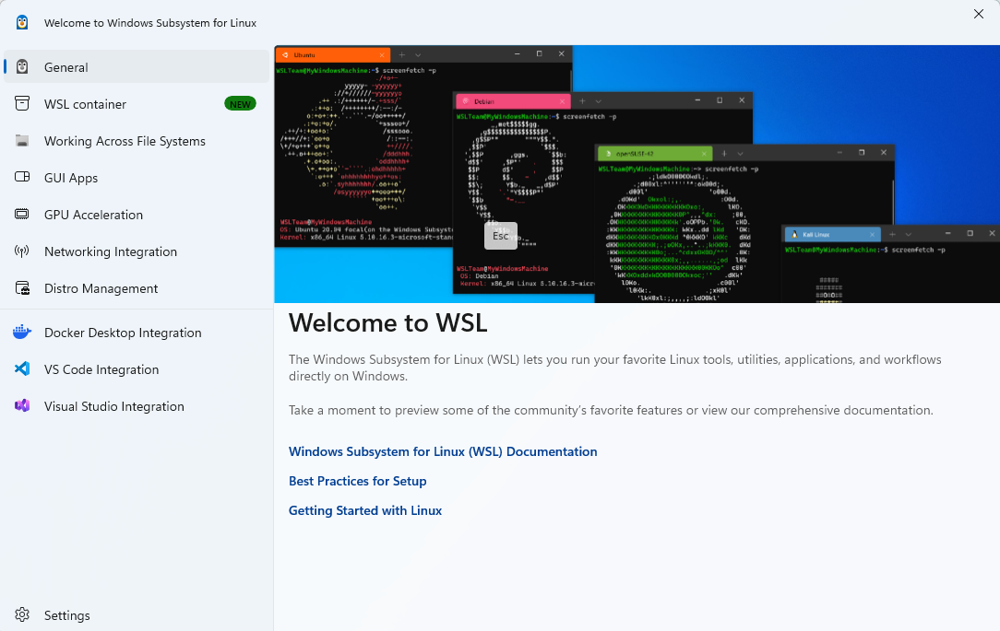

# 隔离 Python 执行器

[[toc]]

函数库里的 Python 代码由 Java 侧调度执行：鉴权、存储、参数转换、并发控制和超时都由 Java 负责，Python 只负责运行原版函数代码本身。每次调试或执行都是一次独立的执行单元，结束后不留容器、不留文件。

这样做换来的是几条很实在的好处：

- **用户代码永远不以 Java 进程的身份运行。** 执行环境不可用时一律拒绝执行，代码里不存在"降级到 Java 进程里跑"的分支。
- **宿主机密钥进不去。** 模型密钥、数据库口令都不在传给执行单元的环境变量里。
- **执行环境本身没有状态。** 一次性容器加内存临时目录，跑完即销毁，不需要为每个函数维护常驻运行时。
- **参数转换和必填校验在 Java 侧完成。** Python 函数按声明的类型接收参数即可，不用自己处理字符串到数字的转换。

执行环境怎么接（Docker 本机/远程，或宿主沙箱）见[隔离 Python 执行环境配置](./35.md)；对外接口见[函数库与调用接口](./37.md)。


## 一、交换协议

Java 与执行单元之间只用标准输入输出交换 JSON，不通过命令行传用户代码或参数，也不落脚本文件。

请求（Java 写入子进程 stdin）：

```json
{
  "code": "def main(a, b):\n    return a + b",
  "params": { "a": 2, "b": 40 },
  "entrypoint": "main",
  "mode": "execute"
}
```

| 字段 | 说明 |
| --- | --- |
| `code` | 用户函数源码，不超过 64 KiB |
| `params` | 调用参数，由 Java 侧完成类型转换后再传入 |
| `entrypoint` | 指定入口函数；为空时取源码里**最后一个**顶层函数 |
| `mode` | `execute` 执行，`lint` 只做语法检查 |

Java 侧组装这段请求的代码很薄，长度校验和并发闸门都在同一个方法里完成：

```java
import java.nio.charset.StandardCharsets;
import java.util.concurrent.Semaphore;
import com.alibaba.fastjson2.JSONObject;

public class IsolatedPythonExecutor {
  private static final Semaphore SLOTS = new Semaphore(2);

  public Object execute(String code, JSONObject params, String entrypoint, boolean lint) {
    if (code == null || code.isBlank() || code.getBytes(StandardCharsets.UTF_8).length > 65536) {
      throw new IllegalArgumentException("Python 代码不能为空且不能超过 64 KiB");
    }
    JSONObject request = JSONObject.of("code", code, "params", params == null ? new JSONObject() : params,
        "entrypoint", entrypoint, "mode", lint ? "lint" : "execute");
    byte[] input = request.toJSONString().getBytes(StandardCharsets.UTF_8);
    if (input.length > 131072) {
      throw new IllegalArgumentException("函数输入超过 128 KiB");
    }
    if (!SLOTS.tryAcquire()) {
      throw new IllegalStateException("Python 执行器繁忙，请稍后重试");
    }
    // 之后启动一次性执行单元、把 input 写进它的 stdin、按秒等待，再用 JSON 解码 stdout
  }
}
```

响应（执行单元写入 stdout）：

```json
{ "ok": true, "data": 42 }
{ "ok": false, "error": "division by zero" }
```

`ok=false` 时 Java 直接把 `error` 作为失败原因返回；用户函数里的 `print` 会被重定向到一个受限缓冲（8 KiB），不会污染这段协议输出。

执行单元这一侧同样很短：读一行请求、按 `mode` 分流、把返回值序列化回一行 JSON。

```python
import ast
import contextlib
import io
import json
import sys


class LimitedOutput(io.StringIO):
    def write(self, value):
        room = max(0, 8192 - self.tell())
        super().write(value[:room])
        return len(value)


def run(request):
    code = request.get("code", "")
    tree = ast.parse(code, filename="function.py")
    if request.get("mode") == "lint":
        return []
    functions = [node.name for node in tree.body if isinstance(node, (ast.FunctionDef, ast.AsyncFunctionDef))]
    if not functions:
        raise ValueError("代码需要至少一个顶层函数")
    entry = request.get("entrypoint") or functions[-1]
    namespace = {"__name__": "maxkb_function"}
    output = LimitedOutput()
    with contextlib.redirect_stdout(output), contextlib.redirect_stderr(output):
        exec(compile(tree, "function.py", "exec"), namespace, namespace)
        return namespace[entry](**request.get("params", {}))


def main():
    try:
        request = json.loads(sys.stdin.buffer.read(131073))
        response = json.dumps({"ok": True, "data": run(request)}, ensure_ascii=False, allow_nan=False)
    except BaseException as error:
        response = json.dumps({"ok": False, "error": str(error)[:1000]}, ensure_ascii=False)
    sys.stdout.write(response)
```

命名空间里的 `__name__` 固定是 `maxkb_function`，所以源码里 `if __name__ == "__main__":` 分支不会被执行，写在那里的代码不会运行。

### `lint` 模式

`mode=lint` 只做 `ast.parse`：语法正确时返回空数组，语法错误时把行列信息包成诊断数组返回，**不会执行函数体**。

```json
{ "line": 1, "column": 9, "endLine": 1, "endColumn": 11, "message": "invalid syntax", "type": "error" }
```

字段与前端编辑器的诊断格式一一对应，所以语法错误能直接画成波浪线并弹出提示。它只覆盖语法层面，"这行代码运行起来对不对"要靠在调试抽屉里真的跑一次。

## 二、两种 runner 的命令形状

### docker runner

```bash
docker [--host <引擎地址>] run --rm --pull=never --name maxkb-python-<uuid> \
  --network=none --read-only --cap-drop=ALL --security-opt=no-new-privileges --pids-limit=32 \
  --memory=256m --memory-swap=256m --cpus=1 --user=65534:65534 \
  --tmpfs=/tmp:rw,noexec,nosuid,size=16m --workdir=/tmp --log-driver=none -i \
  python:3.12-slim python -I -B -c <base64 引导脚本>
```

容器名带一次执行一个的随机后缀（`maxkb-python-<uuid>`），不挂载宿主机目录，也不挂载 Docker socket。

### host runner

```bash
/usr/sbin/runuser -u sandbox -- python3 -I -B -c <base64 引导脚本>
```

子进程的工作目录是沙箱目录，环境变量只保留白名单（见第六节）。为什么默认用 `runuser` 而不是 `su`，见[环境配置](./35.md)里的实测对比。

## 三、为什么用 base64 引导脚本，而不是直接传源码

两个独立的原因，缺一不可：

1. **Windows 会破坏参数里的双引号。** 直接把 `runner.py` 源码作为 `python -c` 的参数传，`CreateProcess` 会把它解析坏：容器能起来，但 Python 报 `SyntaxError: unterminated string literal`。改成不含空格、不含双引号的 base64 引导脚本（`exec(__import__('base64').b64decode('...').decode())`）后各平台行为一致。
2. **不落脚本文件，就没有属主问题。** 官方 MaxKB 的做法是把代码写成一个 `.py` 文件再 `su -c "exec(open(file).read())"`，这需要把文件 `chown` 给沙箱用户——只有以 root 运行的部署才做得到。走 stdin 既避开了这个问题，也不会留下残留文件。

引导脚本只包含 base64 字符和单引号，所以即使经由 shell 传递也不会被改写；单元测试固定了这一点（断言引导脚本里不含 `$`、反引号、反斜杠和双引号，并且能解码回 `runner.py` 原文）。

## 四、资源限制与并发

| 限制 | 默认设置 |
| --- | --- |
| 并发执行 | 每个 Java 进程最多 2 个，超出返回"执行器繁忙" |
| 执行时间 | 15 秒，`kb.python.timeout_seconds` 可调 1～60 秒 |
| 内存 / CPU / 进程数 | 256 MiB / 1 CPU / 32 |
| 代码 / 总输入 / 输出 | 64 KiB / 128 KiB / 256 KiB |
| 单次 print 缓冲 | 8 KiB，超出部分丢弃，`print` 本身不报错 |
| 超时后收取输出 | 3 秒 |
| 返回值上限 | 序列化后 256 KiB，超过返回"函数返回结果超过 256 KiB" |
| 临时目录 | 16 MiB（docker runner 走内存文件系统） |

docker runner 的这几项由容器参数强制；host runner 只有超时和输入输出限制来自 Java 侧，内存、CPU、进程数**没有**上限，这一点在[环境配置](./35.md)的边界对比表里同样列出。

超时触发后杀的是提权进程，用户代码是它的子进程，因此会连同整棵进程树一起强制终止，避免在宿主上留下沙箱进程。

## 五、失败语义：一律拒绝，不降级

执行器在任何一环不可用时都返回明确错误，**不会**把用户代码改到 Java 进程里跑：

| 情况 | 返回 |
| --- | --- |
| 代码为空或超过 64 KiB | `Python 代码不能为空且不能超过 64 KiB` |
| 输入超过 128 KiB | `函数输入超过 128 KiB` |
| 并发已满 | `Python 执行器繁忙，请稍后重试` |
| 执行超时 | `Python 执行超时，进程已终止` |
| 容器/沙箱进程退出码非 0 | `Python 容器启动或执行失败…` 或 `宿主 Python 沙箱启动或执行失败…` |
| 引擎或提权命令不可用 | `隔离 Python 执行器不可用…不会在宿主机执行代码` 或 `宿主 Python 沙箱不可用…不会以当前用户执行代码` |
| 输出格式非法或超限 | `Python 输出无效或超过限制` |
| 响应不是合法 JSON | `Python 返回格式无效` |
| 执行被中断 | `Python 执行已中断` |

用户函数自身抛出的异常不算执行器故障，会原样作为失败原因返回（例如 `division by zero`），便于在前端直接展示。

## 六、执行单元能看到什么

- docker runner：容器内 uid 固定为 `65534`，根文件系统只读，`/tmp` 是 16 MiB 的内存文件系统，没有网络；传给 docker 客户端的环境变量走白名单（`PATH`、Windows 上的 `SYSTEMROOT`/`WINDIR`/`TEMP`/`TMP`/`USERPROFILE`，以及 `DOCKER_HOST`/`DOCKER_CONTEXT`/`DOCKER_TLS_VERIFY`/`DOCKER_CERT_PATH` 等 `DOCKER_*` 项），应用密钥不会进入容器。`SYSTEMROOT` 这类只为了让 Windows 上的 docker 客户端能正常启动，容器内看不到它们。
- host runner：子进程以沙箱用户身份运行，工作目录与 `HOME`/`TMPDIR` 都指向沙箱目录，环境变量只保留显式清单 `PATH`、`LANG`、`LC_ALL`、`LC_CTYPE`、`TZ`、`TERM`（不是 `LC_*` 通配），外加固定的 `USER`/`LOGNAME`/`SHELL`。

两者都不把模型密钥和数据库凭据传给用户代码；区别在于 host runner 的沙箱用户能读到宿主上"其他人可读"的文件，因此部署时要收紧 `my.txt`、`secrets.txt` 的权限。

## 七、前端怎么用起来

编辑器和调试抽屉是这条链路的两个入口，二者都走执行器，但用途不同。

**编辑器实时语法检查。** Python 代码编辑器在内容变化后调用语法检查接口，把返回的行列诊断画成波浪线，鼠标悬停显示 `message`：

```javascript
import { linter, type Diagnostic } from '@codemirror/lint'
import FunctionApi from '@/api/function-lib'

function getRangeFromLineAndColumn(state: any, line: number, column: number, end_column?: number) {
  const l = state.doc.line(line)
  const from = l.from + column
  const to_end_column = l.from + end_column
  return {
    from: from > l.to ? l.to : from,
    to: end_column && to_end_column < l.to ? to_end_column : l.to
  }
}

const regexpLinter = linter(async (view) => {
  const diagnostics: Diagnostic[] = []
  await FunctionApi.pylint(view.state.doc.toString()).then((ok) => {
    ok.data.forEach((element: any) => {
      const range = getRangeFromLineAndColumn(
        view.state,
        element.line,
        element.column,
        element.endColumn
      )
      diagnostics.push({
        from: range.from,
        to: range.to,
        severity: element.type,
        message: element.message
      })
    })
  })
  return diagnostics
})
```

请求失败时不会打断编辑，只是不显示诊断；语法检查只覆盖语法层面。

**调试抽屉。** 它按函数的输入参数定义生成表单（必填项带星号），把界面上填的值和函数保存的初始参数一起交给调试接口，再直接展示返回值或错误信息。函数自己抛的异常会原样出现在"输出"里，例如 `division by zero`。


保存过的函数还可以被工作流节点等 Java 侧调用方复用，走的是同一个 `execute` 入口；前端目前接的是列表、增删改查、调试和语法检查这几条路径。

## 八、验证

```powershell
mvn '-Dtest=IsolatedPythonExecutorTest' '-Dsurefire.failIfNoSpecifiedTests=false' '-Dmaven.javadoc.skip=true' '-Dgpg.skip=true' test
```

测试覆盖：容器命令不含宿主挂载且带全部限制参数、引导脚本的 shell 安全性、两种 runner 的命令形状、引擎地址作为全局参数出现在子命令之前、host runner 的七条拒绝路径（平台、沙箱用户缺失、沙箱用户是 root、Java 进程非 root、沙箱目录缺失、沙箱目录所有人可写、找不到提权命令）、环境变量不泄漏父进程变量、无引擎时拒绝执行、超时后终止并清理、响应超过 262144 字节被拒绝。

真实隔离效果用[环境配置](./35.md)里的脚本验证，容器内的四项检查（uid 是否为 `65534`、根文件系统只读、外部网络不可达、宿主密钥不可见）实测结果：

```json
{ "uid": 65534, "secret_absent": true, "read_only": true, "network_blocked": true }
```

接口层面的执行验证见[函数库与调用接口](./37.md)。

## 九、本机 WSL2 + Docker Engine

Windows 本机开发时，可以让 Java 运行在 Windows 中，把 Docker Engine 安装在 WSL2 的 Ubuntu 中。执行器通过 `wsl.exe` 调用 Linux Docker CLI，再由 Docker 创建一次性 Python 容器。这条链路不需要 Docker Desktop，也不需要开放 Docker TCP 端口。

```text
Windows Java 服务
  → wsl.exe --distribution Ubuntu --user root --exec docker
  → Ubuntu 中的 Docker Engine
  → 一次性 Python 容器（uid=65534，断网、只读、资源受限）
```

下面 Windows 命令在 CMD 或 PowerShell 中执行；项目的 `.ps1` 脚本在 PowerShell 中执行；Linux 命令在 Ubuntu 终端中执行。

### 1. 启用 WSL2 并初始化 Ubuntu

先确保 BIOS/UEFI 中开启 CPU 虚拟化：Intel 通常称为 VT-x，AMD 通常称为 SVM。可在 Windows「任务管理器 → 性能 → CPU」查看“虚拟化”是否已启用。

在**管理员 Windows 终端**中执行：

```powershell
DISM /Online /Enable-Feature /FeatureName:Microsoft-Windows-Subsystem-Linux /All /NoRestart
DISM /Online /Enable-Feature /FeatureName:VirtualMachinePlatform /All /NoRestart
```

两条命令成功后，先通过「开始 → 电源 → 重启」重启 Windows。`/NoRestart` 只是禁止命令自动重启，不能省略这一步。然后执行：

```powershell
wsl --update
wsl --set-default-version 2
wsl --install -d Ubuntu
```

如果 Ubuntu 应用已经安装，直接打开它完成初始化即可。首次启动会提示创建 UNIX 用户，例如 `ping`；该用户名不需要与 Windows 用户名一致。输入密码时终端不显示字符，重复输入后看到 `passwd: password updated successfully` 表示密码设置成功；随后出现的 `usermod: no changes` 本身不表示安装失败。



上图是 WSL 欢迎页面。发行版是否安装成功、是否使用 WSL2，应以 Windows 终端中的检查结果为准：

```powershell
wsl --status
wsl --list --verbose
```

列表中应能看到 Ubuntu，且 `VERSION` 为 `2`。如果为 `1`，执行 `wsl --set-version Ubuntu 2`；如果提示没有已安装的发行版，说明当前 Windows 用户下还没有成功注册 Ubuntu，需要完成安装及首次初始化。后续命令中的 `Ubuntu` 必须与列表里的发行版名称一致。

### 2. 安装 Docker Engine 和 Python 镜像

脚本安装和手动安装二选一，完成后都继续检查引擎、配置 Java 并验证隔离效果。

#### 方式一：使用项目脚本

在 **Java 项目的 `java-maxkb` 根目录**打开 PowerShell，执行项目自带的安装脚本：

```powershell
.\scripts\Setup-PythonSandbox.ps1 -Distribution Ubuntu
```

脚本以 WSL 的 root 用户执行 `scripts/setup-python-sandbox.sh`，从 [Docker 官方 Ubuntu 软件源](https://docs.docker.com/engine/install/ubuntu/)安装 Docker Engine、CLI、containerd、Buildx 和 Compose 插件，启动 Docker，拉取 `python:3.12-slim`，并运行一次带隔离参数的测试容器。看到 `isolated-python-ready` 才说明这一步的容器验证通过。

这一步需要 Ubuntu 能访问 Ubuntu 软件源、Docker 软件源和镜像仓库。WSL 初始化成功只代表 Linux 环境可用，不代表 Docker 已经安装。

#### 方式二：在 Ubuntu 中手动安装

不使用 `Setup-PythonSandbox.ps1` 时，可以直接完成以下步骤，无需切换到 Java 项目目录。在 Windows 终端进入 Ubuntu：

```powershell
wsl -d Ubuntu
```

**以下 `bash` 命令全部在 Ubuntu 终端执行，不要粘贴到 Windows CMD 或 PowerShell。** 普通用户通过 `sudo` 提权，输入的是初始化 Ubuntu 时设置的 Linux 密码。

**（1）准备软件源。** 新安装的 Ubuntu 可直接继续。如果此前安装过 `docker.io`、`podman-docker` 或单独的 `containerd`、`runc`，先按 [Docker 官方安装文档](https://docs.docker.com/engine/install/ubuntu/#uninstall-old-versions)处理冲突软件包，再安装官方 Docker Engine。

```bash
sudo apt-get update
sudo apt-get install -y ca-certificates curl
sudo install -m 0755 -d /etc/apt/keyrings
sudo curl -fsSL https://download.docker.com/linux/ubuntu/gpg -o /etc/apt/keyrings/docker.asc
sudo chmod a+r /etc/apt/keyrings/docker.asc
```

添加 Docker 官方 APT 源，发行版代号和 CPU 架构从当前 Ubuntu 自动获取。将下面整个代码块一起执行，最后一行 `EOF` 必须独占一行：

```bash
. /etc/os-release
sudo tee /etc/apt/sources.list.d/docker.sources > /dev/null <<EOF
Types: deb
URIs: https://download.docker.com/linux/ubuntu
Suites: ${UBUNTU_CODENAME:-$VERSION_CODENAME}
Components: stable
Architectures: $(dpkg --print-architecture)
Signed-By: /etc/apt/keyrings/docker.asc
EOF
```

**（2）安装 Docker Engine 并启动服务。**

```bash
sudo apt-get update
sudo apt-get install -y docker-ce docker-ce-cli containerd.io docker-buildx-plugin docker-compose-plugin
sudo service docker start
sudo docker version
```

`sudo docker version` 应同时显示 Client 和 Server。这里启动的是当前 Ubuntu 中的 Docker 服务；随 WSL 启动的配置见本节第 5 步。

**（3）准备 Python 镜像并测试容器。**

```bash
sudo docker pull python:3.12-slim
sudo docker run --rm --pull=never \
  --network=none --read-only --cap-drop=ALL \
  --security-opt=no-new-privileges --user=65534:65534 \
  --pids-limit=32 --memory=256m --memory-swap=256m --cpus=1 \
  --tmpfs=/tmp:rw,noexec,nosuid,size=16m --workdir=/tmp --log-driver=none \
  python:3.12-slim python -I -B -c 'import os; print("isolated-python-ready", os.getuid())'
```

预期输出为 `isolated-python-ready 65534`，表示镜像可以在指定的限制参数下启动，且 Python 进程以非 root 用户运行。完整的只读文件系统、网络和环境变量检查继续按第 4 步执行。

手动操作始终使用 `sudo docker`，不需要把普通用户加入 docker 组。任何一步报错时，先处理该步骤的错误，再继续；软件源配置或镜像下载失败不代表 WSL 安装失败。

执行 `exit` 返回 Windows 终端，然后继续下面的引擎检查和第 3 步 Java 配置。

#### 检查引擎和镜像

在 Windows 终端检查引擎和镜像：

```powershell
wsl -d Ubuntu -u root --exec docker version
wsl -d Ubuntu -u root --exec docker image inspect python:3.12-slim
```

`docker version` 应同时返回 Client 和 Server 信息。执行器使用 `--pull=never`，因此镜像必须事先存在；如果后续更改 `kb.python.image`，也需要在同一个 WSL 引擎中提前拉取对应镜像。

### 3. 配置 Java 执行器

编辑 Java 项目的 `maxkb-web/my.txt`：

```properties
kb.python.runner=docker
kb.python.wsl.distribution=Ubuntu
kb.python.image=python:3.12-slim
kb.python.timeout_seconds=15
```

切换到本机 WSL 引擎时，删除或注释原来的 `kb.python.docker` 和 `kb.python.docker.host` 配置，尤其不能保留远程 `tcp://...` 地址，否则 `--host` 仍会把命令指向远程引擎。同时检查 Java 启动环境中的 `DOCKER_HOST`、`DOCKER_CONTEXT` 等变量，避免继承旧的远程连接设置。保存后重启 Java 服务。

Java 通过 `--user root` 调用 WSL 内的 Docker CLI，因此不要求把初始化创建的 `ping` 用户加入 docker 组；实际运行用户代码的容器仍使用 `--user=65534:65534`。运行 Java 的 Windows 账户应与安装 Ubuntu 的账户一致，因为 WSL 发行版按 Windows 用户注册。

### 4. 验证隔离效果

在 `java-maxkb` 根目录的 PowerShell 中执行：

```powershell
.\scripts\Test-PythonSandbox.ps1
```

脚本读取 `maxkb-web/my.txt`，输出的 `engine` 应包含 `wsl.exe --distribution Ubuntu --user root --exec docker`，且不带旧的远程 `--host`。验证成功时，结果应满足：

```json
{
  "uid": 65534,
  "secret_absent": true,
  "read_only": true,
  "network_blocked": true
}
```

最后在函数库中调试一个简单函数，例如返回 `a + b`，确认 Java 到容器的完整调用链路正常；接口操作见[函数库与调用接口](./37.md)。

### 5. 重启 WSL 后启动 Docker

如果 `docker version` 只有 Client 信息，并提示无法连接 Docker daemon，先在 Windows 终端执行：

```powershell
wsl -d Ubuntu -u root --exec service docker start
```

需要让 Docker 随 Ubuntu 启动时，可使用 systemd。在 Ubuntu 中执行 `ps -p 1 -o comm=`；如果结果不是 `systemd`，编辑 `/etc/wsl.conf`，在保留已有配置的基础上添加或合并：

```ini
[boot]
systemd=true
```

保存 Linux 中的工作后，在 Windows 终端执行 `wsl --shutdown`，再打开 Ubuntu。该命令会停止所有正在运行的 WSL 发行版。随后在 Ubuntu 中执行：

```bash
sudo systemctl enable --now docker
sudo systemctl status docker --no-pager
```

这表示 Docker 随该 WSL 发行版启动，并不等于 Windows 开机后 WSL 一定已经运行。systemd 的版本要求和配置说明见[微软 WSL systemd 文档](https://learn.microsoft.com/en-us/windows/wsl/systemd)。

### 6. 安装时的常见故障

**启用 Windows 功能时报 `0x800f081f`：** 表示缺少组件源文件。在管理员 Windows 终端执行：

```powershell
DISM /Online /Cleanup-Image /RestoreHealth
sfc /scannow
```

完成后重启，再尝试启用两个功能。DISM/SFC 修复成功不保证可选功能的所有源文件都已补齐；如果仍然报错，应查看 `C:\Windows\Logs\CBS\CBS.log` 和 `C:\Windows\Logs\DISM\dism.log` 中本次操作的缺失组件记录。

本次排障中，日志仍提示缺少 Lxss 与 Hyper-V 组件。通过「设置 → 系统 → 恢复 → 使用 Windows 更新修复问题 → 立即重新安装」修复系统后，两个功能才成功启用。该入口保留文件、应用和设置，注意不要误选“重置此电脑”；入口不可用时，再考虑匹配系统版本的安装介质。详见[微软修复重装说明](https://support.microsoft.com/en-US/Windows/Deployment/Install-Upgrade/fix-issues-by-reinstalling-the-current-version-of-windows)。

**功能启用成功，但 `wsl --status` 仍提示虚拟化未开启：** 先确认启用后已经重启 Windows，再检查任务管理器中的固件虚拟化状态。如果固件虚拟化已开启，仍无法启动 WSL2，可在管理员 CMD 中执行以下命令，然后重启：

```cmd
bcdedit /set hypervisorlaunchtype auto
```

该命令设置 Windows 虚拟机监控程序随系统启动，不能代替 BIOS/UEFI 的虚拟化开关。如果 Windows 本身运行在虚拟机内，还需要宿主平台提供嵌套虚拟化。详见[微软 WSL 故障排查](https://learn.microsoft.com/en-us/windows/wsl/troubleshooting)。

## 相关章节

- [隔离 Python 执行环境配置](./35.md)：Docker over TCP、宿主沙箱、边界对比与验证脚本。
- [函数库与调用接口](./37.md)：函数存储、调试、执行与参数转换。
- [支持自定义模型](./33.md)：辅助模型与推理模型的配置来源。
