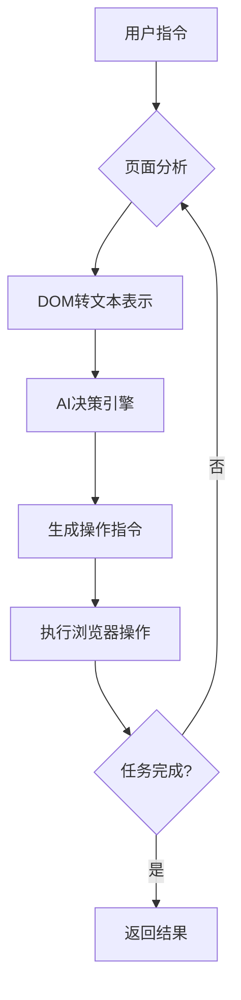

# AI Browser：基于用户指令的浏览器自动化系统

> 本文保留早期 Controller 多端点方案的教学示例；其中的接口地址、参数绑定和运行模型不适用于当前工程。当前开发请先阅读[统一命令接口与人机协作](./08.md)，完整命令参数以项目根目录的 SKILL.md 为准。

## 简介

本系统实现了智能化浏览器操作引擎，能够根据自然语言指令自动执行网页浏览任务。通过将网页元素结构化表示与AI决策模型相结合，系统能够理解用户意图并转化为具体浏览器操作，实现从简单搜索到复杂工作流（如在线购票）的自动化执行。

## 网页内容结构化处理

系统核心创新在于将复杂DOM结构转换为AI可理解的文本表示：

1. **DOM标记与提取**：
   - 注入脚本遍历页面DOM结构
   - 识别并标记所有可交互元素（输入框、按钮、链接等）
   - 为元素添加可视化高亮标识（如图示）
    

2. **结构化文本表示**：
```text
[Start of page]
		[0]<a >新闻/>
		[8]<a />
			[9]<a name='tj_briicon'>更多/>
		[12]<a name='tj_login'>登录/>
							[14]<input name='wd' placeholder='肖战连续两天请剧组喝冰饮'/>
							[15]<input type='submit' value='百度一下'/>
							[16]<a >AI搜索已支持「DeepSeek-R1」最新版 立即体验/>
								[17]<div > />
						[19]<li />
							[20]<a > 0 以历史的纵深感做好今天的工作/>
						[21]<li >新/>
							[22]<a > 5 亲叔叔炮轰宗馥莉：她从不与宗家往来/>
			[39]<div >辅助模式/>
				[40]<div />
[End of page]
```

上面这段文本就是接口 `get_dom_text` 返回的 `data.text`，每行形如 `[index]<tag attr='value'>文本/>`。完整样例与逐条解释见 [操作浏览器指令](<./07.md>) 的“快照文本怎么读”一节，这里只列最容易误判的几条：

- 样例里的 `[Start of page]` / `[End of page]` 是测试/demo 代码用 `System.out.println` 打印的边界标记，**`get_dom_text` 接口不返回这两行**（实测 `data.text` 第一行直接就是 `[0]<a >新闻/>`）；它们不是页面元素，也没有索引。
- 行首缩进（制表符）表示 DOM 嵌套层级，嵌套关系只靠缩进表达。
- `[index]` 是元素索引，**编号不连续**（`[12]` 后面直接是 `[14]`）：只有 buildDomTree 判定为可交互的节点才有索引，不要当成行号。
- 行尾 `/>` 只是格式化后缀，**不代表自闭合**：`[0]<a >新闻/>` 里的 `新闻` 就是链接文字。
- 只保留部分语义属性（实测有 `type`、`placeholder`、`aria-label`、`title`、`name`、`value`），**没有 `id`、`class`、`href`、`style`**。
- 不可见的元素不会出现在快照里，而且**选择器、文本、角色、标签这几类定位接口也操作不了它**：隐藏元素不满足可操作性检查，会等满 5 秒后返回 `没匹配到可操作的元素(不存在或不可见): 选择器 xxx`；这种情况只能用 `execute_js` 直接设值并派发 `input` 事件。

**关键特性**：
- 保留元素类型、文本内容、交互状态等核心信息
- 索引化组织确保操作精确性（如`[14]`对应搜索框）
- 精简格式优化AI处理效率
- 快照文本里不含 `id`、`class`、`href`、`style` 与 XPath，元素可见时可按这些信息用选择器类接口定位，隐藏元素只能用 `execute_js`

**索引的用法**：
- `data.text` 中每行的 `index` 直接用于按索引操作的接口，例如 `click_element_by_index`、`input_text`、`upload_file`、`get_element_text`、`is_visible`。
- 索引优先取最近一次 `get_dom_text` 生成的 DOM 树快照；页面变化后必须重新调用 `get_dom_text`，旧索引会失效。
- 按索引操作元素的等待上限为 5 秒，超时报错会提示重新调用 `get_dom_text`。

## 系统架构

### 主要功能模块

| 模块           | 职责描述                                   | 核心技术                    |
| -------------- | ------------------------------------------ | --------------------------- |
| **Agent**      | 决策中枢，管理任务上下文，生成操作指令序列 | 状态机管理，LLM指令生成     |
| **Controller** | 连接AI决策与浏览器操作，解析并执行高级指令 | 指令分发，异常处理          |
| **DOM**        | 网页结构处理与分析                         | Playwright, XPath, 跨域通信 |
| **Browser**    | 浏览器实例管理，封装底层操作               | Playwright核心集成          |

### 模块详解

1. **Agent 决策引擎**
   - 维护任务执行状态机
   - 结合用户目标与页面状态生成下一步指令
   - 支持多步骤复杂任务编排（如"预订北京到上海的机票"）

2. **Controller 执行中枢**
   - 翻译AI指令为具体浏览器操作
   - 监控操作执行结果
   - 提供操作失败时的回退机制
   - 通过 HTTP 接口对外暴露全部操作，前缀为 `http://localhost:10049/api/v1/playwright/`

3. **DOM 处理系统**
   - **buildDomTree.js**：注入脚本实现：
     * 可交互元素过滤
     * 可视化标记渲染
     * 元素特征提取
   - 提供DOM节点数据模型
   - 支持动态页面解析（SPA应用）
   - 由 `nexus.io.ai.browser.dom.service.DomService` 构建，输出结构化文本与元素索引

4. **Browser 核心引擎**
   - 基于Playwright封装：
     * 多标签页管理（创建/切换/关闭）
     * 智能导航与历史记录跟踪
     * 页面截图与PDF生成
     * 文件下载处理
   - 安全防护机制：
     * URL白名单检测
     * 跨域操作隔离

## 操作指令集

系统通过 HTTP 接口暴露全部浏览器操作，前缀为 `http://localhost:10049/api/v1/playwright/`，控制器共 79 个接口。下表的“接口”列是接口名，完整 URL 为前缀加接口名，例如 `http://localhost:10049/api/v1/playwright/start`；每个接口的完整 URL、参数与返回示例见 [操作浏览器指令](<./07.md>)。

**导航**

| 接口 | 参数 | 说明 |
| --- | --- | --- |
| `start` | `id` (Long, 可选), `headless` (boolean) | 启动或复用浏览器实例，返回 `data.id` |
| `navigate` | `id` (Long), `url` (string) | 导航到指定 URL，返回 `data.status` |
| `go_to_url` | `id` (Long), `url` (string) | 与 `navigate` 同功能，单独接口 |
| `get_dom_text` | `id` (Long), `highlight` (Boolean), `viewportExpansion` (Integer) | 获取结构化页面文本与元素索引 |
| `go_forward` | `id` (Long) | 前进一页 |
| `reload` | `id` (Long) | 刷新当前页 |
| `get_url` | `id` (Long) | 当前地址 |
| `get_title` | `id` (Long) | 当前标题 |
| `go_back` | `id` (Long) | 后退一页 |
| `wait` | `id` (Long), `seconds` (Integer) | 等待指定秒数 |
| `close` | `id` (Long) | 关闭并移除浏览器实例 |

**元素交互**

| 接口 | 参数 | 说明 |
| --- | --- | --- |
| `click_element_by_index` | `id` (Long), `index` (Integer) | 单击指定索引的元素 |
| `input_text` | `id` (Long), `index` (Integer), `text` (string) | 清空后填入文字 |
| `upload_file` | `id` (Long), `index` (Integer), `path` (string) | 在指定上传控件中上传文件 |
| `extract_structured_data` | `id` (Long), `query` (String), `extractLinks` (boolean) | 提取页面可见文本，可选同时提取链接 |
| `scroll` | `id` (Long), `down` (boolean), `numPages` (Integer), `index` (Integer, 可选) | 对页面或指定容器滚动 |
| `send_keys` | `id` (Long), `keys` (string) | 模拟按键，如 `Enter`、`Control+o` |
| `scroll_to_text` | `id` (Long), `text` (string) | 滚动页面直到出现指定文本 |
| `get_dropdown_options` | `id` (Long), `index` (Integer) | 获取原生下拉框的所有选项 |
| `select_dropdown_option` | `id` (Long), `index` (Integer), `text` (string) | 在原生下拉框中按文本选择 |
| `execute_js` | `id` (Long), `body` (string) | 在页面中执行 JavaScript 并返回结果 |
| `double_click_element_by_index` | `id` (Long), `index` (Integer) | 双击指定索引的元素 |
| `hover_element_by_index` | `id` (Long), `index` (Integer) | 悬停到指定索引的元素 |
| `focus_element_by_index` | `id` (Long), `index` (Integer) | 让指定索引的元素获得焦点 |
| `check_element_by_index` | `id` (Long), `index` (Integer) | 勾选复选框 |
| `uncheck_element_by_index` | `id` (Long), `index` (Integer) | 取消勾选复选框 |
| `type_text` | `id` (Long), `index` (Integer), `text` (string) | 不清空原内容，逐字输入 |
| `drag_element_by_index` | `id` (Long), `index` (Integer), `targetIndex` (Integer) | 把元素拖到另一个元素上 |
| `key_down` | `id` (Long), `keys` (string) | 按下按键并保持 |
| `key_up` | `id` (Long), `keys` (string) | 释放按键 |

**信息读取**

| 接口 | 参数 | 说明 |
| --- | --- | --- |
| `get_element_text` | `id` (Long), `index` (Integer) | 元素文本，返回 `data.text` |
| `get_element_html` | `id` (Long), `index` (Integer) | 元素内部 HTML，返回 `data.html` |
| `get_element_value` | `id` (Long), `index` (Integer) | 表单元素的值，返回 `data.value` |
| `get_element_attribute` | `id` (Long), `index` (Integer), `name` (String) | 指定属性的值 |
| `get_element_count` | `id` (Long), `selector` (String) | 匹配选择器的元素数量 |
| `get_element_box` | `id` (Long), `index` (Integer) | 元素的位置与尺寸 |

**状态查询**

| 接口 | 参数 | 说明 |
| --- | --- | --- |
| `is_visible` | `id` (Long), `index` (Integer) | 是否可见，返回 `data.visible` |
| `is_enabled` | `id` (Long), `index` (Integer) | 是否可用，返回 `data.enabled` |
| `is_checked` | `id` (Long), `index` (Integer) | 是否已勾选，返回 `data.checked` |

**定位方式**

| 接口 | 参数 | 说明 |
| --- | --- | --- |
| `click_element_by_selector` | `id` (Long), `selector` (String) | 按 CSS 选择器点击 |
| `input_text_by_selector` | `id` (Long), `selector` (String), `text` (string) | 按 CSS 选择器输入 |
| `click_element_by_text` | `id` (Long), `text` (string) | 按可见文本点击 |
| `click_element_by_role` | `id` (Long), `role` (String), `name` (String) | 按语义角色与名称点击 |
| `input_text_by_label` | `id` (Long), `label` (String), `text` (string) | 按表单标签输入 |

**标签页**

| 接口 | 参数 | 说明 |
| --- | --- | --- |
| `switch_tab` | `id` (Long), `pageIndex` (Integer) | 切换到指定标签页 |
| `close_tab` | `id` (Long), `pageIndex` (Integer) | 关闭指定标签页 |
| `get_tabs` | `id` (Long) | 所有标签页及其索引 |
| `new_tab` | `id` (Long), `url` (string, 可选) | 新建标签页并切换过去 |

**等待**

| 接口 | 参数 | 说明 |
| --- | --- | --- |
| `wait_for_element` | `id` (Long), `selector` (String), `timeoutSeconds` (Double) | 等待元素出现 |
| `wait_for_text` | `id` (Long), `text` (string), `timeoutSeconds` (Double) | 等待文本出现 |
| `wait_for_url` | `id` (Long), `url` (string), `timeoutSeconds` (Double) | 等待地址匹配 |
| `wait_for_load` | `id` (Long), `state` (String), `timeoutSeconds` (Double) | 等待加载状态 |
| `wait_for_function` | `id` (Long), `expression` (string), `timeoutSeconds` (Double) | 等待 JS 表达式为真 |

**鼠标**

| 接口 | 参数 | 说明 |
| --- | --- | --- |
| `mouse_move` | `id` (Long), `x` (Double), `y` (Double) | 移动鼠标到坐标 |
| `mouse_down` | `id` (Long), `button` (String) | 按下鼠标键 |
| `mouse_up` | `id` (Long), `button` (String) | 释放鼠标键 |
| `mouse_wheel` | `id` (Long), `deltaY` (Double) | 滚动滚轮 |

**截图与 PDF**

| 接口 | 参数 | 说明 |
| --- | --- | --- |
| `screenshot` | `id` (Long), `path` (String, 可选), `fullPage` (Boolean) | 传 `path` 存文件返回 `data.path`，不传返回 `data.base64` |
| `pdf` | `id` (Long), `path` (String, 可选) | 不传 `path` 时落到 `~/Downloads/broswer/` |

**Cookie 与存储**

| 接口 | 参数 | 说明 |
| --- | --- | --- |
| `get_cookies` | `id` (Long), `url` (String, 可选) | 读取 Cookie |
| `set_cookie` | `id` (Long), `name` (String), `value` (String), `url` (String, 可选) | 写入 Cookie |
| `clear_cookies` | `id` (Long) | 清空 Cookie |
| `get_local_storage` | `id` (Long), `key` (String, 可选) | 不传 `key` 时返回整个 localStorage 的 JSON 字符串 |
| `set_local_storage` | `id` (Long), `key` (String), `value` (String) | 写入 localStorage |
| `clear_local_storage` | `id` (Long) | 清空 localStorage |

**浏览器设置**

| 接口 | 参数 | 说明 |
| --- | --- | --- |
| `set_viewport` | `id` (Long), `width` (Integer), `height` (Integer) | 设置视口尺寸 |
| `set_geolocation` | `id` (Long), `latitude` (Double), `longitude` (Double) | 设置地理位置 |
| `set_offline` | `id` (Long), `offline` (boolean) | 切换离线模式 |
| `set_headers` | `id` (Long), `headersJson` (String) | 设置额外请求头，形如 `{"X-Key":"v"}` |
| `set_credentials` | `id` (Long), `username` (String), `password` (String) | 设置 HTTP 基本认证，会重建上下文 |
| `set_media` | `id` (Long), `colorScheme` (String) | `light`、`dark`、`no-preference` |

**弹窗与控制台**

| 接口 | 参数 | 说明 |
| --- | --- | --- |
| `get_dialog` | `id` (Long) | 最近一次弹窗信息 |
| `set_dialog_behavior` | `id` (Long), `dismiss` (boolean) | `dismiss=true` 时后续弹窗自动取消 |
| `get_console_logs` | `id` (Long) | 控制台输出 `data.logs` 与页面错误 `data.errors` |
| `clear_console_logs` | `id` (Long) | 清空日志与错误 |

**网络**

| 接口 | 参数 | 说明 |
| --- | --- | --- |
| `route` | `id` (Long), `urlPattern` (String), `action` (String), `body` (String), `status` (Integer), `contentType` (String) | `action` 取 `abort` 或 `mock` |
| `unroute` | `id` (Long), `urlPattern` (String, 可选) | 不传 `urlPattern` 时移除全部路由 |
| `get_requests` | `id` (Long), `filter` (String, 可选) | 最多 200 条请求记录，可按 URL 过滤 |

**批量**

| 接口 | 参数 | 说明 |
| --- | --- | --- |
| `commands` | `id` (Long, 可选)、命令 JSON 请求体（POST 必需） | 批量执行一组命令：除 `commands` 自身之外的 78 个接口都能作为命令调用，逐步结果在 `data.results` 里原样返回，默认遇错即停（`stopOnError` 传 `false` 可跑完）。只接受 `POST` + JSON 请求体，`id` 可放查询串或对象载荷里。详见 [操作浏览器指令](<./07.md>) 的“批量”一节 |

**参数说明**：
- 统一响应体为 `{"data":{},"code":1,"ok":true,"error":null,"msg":null}`；成功 `code` 为 `1`、`ok` 为 `true`，失败 `code` 为 `0`、`ok` 为 `false` 且 `msg` 是中文原因；未捕获异常返回裸 HTTP 500。
- `id` 是 Long 型雪花 ID，序列化成字符串。
- `execute_js` 可以用 JSON 请求体，也可以走查询串或表单（同名字段以 JSON 请求体优先）；`commands` 必须用 POST + JSON 请求体，命令写在请求体里；其余接口的参数只从 query 或表单读取，JSON 请求体不生效。
- 按索引接口的 `index` 来自 `get_dom_text` 的 `data.text`，页面变化后需要重新调用 `get_dom_text`。
- 选择器、文本、角色、标签类定位接口要求元素**可操作（存在且可见）**：目标不存在或不可见时会等满 5 秒后返回 `没匹配到可操作的元素(不存在或不可见): 选择器 xxx`。快照里没有的隐藏元素既不能用索引操作、也不能用选择器操作，只能用 `execute_js` 直接设值并派发 `input` 事件。
- 坐标是 `mouse_move` 的独立参数 `x`、`y`，不是 `{x,y}` 对象；拖拽使用 `drag_element_by_index` 的 `index` 与 `targetIndex` 两个元素索引。

## AI集成工作流

系统通过智能决策循环实现自动化操作：



**执行流程**：
1. 用户提交自然语言指令（如"查找最近的咖啡店"）
2. 当前工程调用 `get_browser_state` 获取页面结构化表示、标签页与元素索引
3. AI模型综合以下信息生成操作指令：
   - 系统提示词（操作规范）
   - 页面元素文本表示
   - 用户原始指令
   - 历史操作上下文
4. 当前工程通过统一命令端点，由 PlaywrightHandler 校验请求、ActionService 执行动作
5. 遇到无法处理的登录、验证码、滑块或点击验证等环节，请求人类协助并保留浏览器现场；确认处理成功后再继续循环，任务完成后返回结果

**典型应用场景**：
- 跨网站比价购物
- 定期数据采集
- 复杂表单自动填写
- 多步骤工作流执行（机票预订/酒店下单）
- 无障碍网页浏览辅助

本系统通过融合现代浏览器技术与大语言模型能力，实现了真正智能化的网页交互范式，为自动化测试、数据采集、智能助手等领域提供强大基础设施支持。
