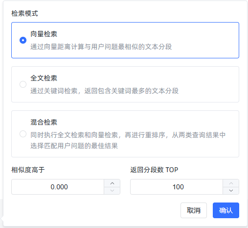
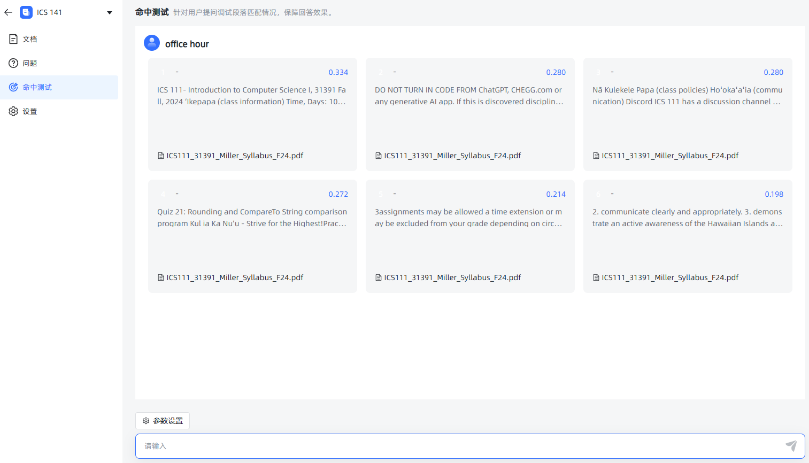

# 命中测试

[[toc]]

## 项目目标

本项目旨在构建一个功能完备的 RAG（Retrieval-Augmented Generation）系统，主要目标包括：

- **知识库管理**：支持创建、更新和删除知识库，便于用户高效维护内容。
- **文档处理**：包括文档的拆分、片段的向量化处理，以提升检索效率和准确性。
- **问答系统**：提供高效的向量检索和实时生成回答的能力，支持复杂汇总类问题的处理。
- **系统优化**：通过统计分析和推理问答调试，不断优化系统性能和用户体验。

## 系统核心概念

在 RAG 系统中，以下是几个核心概念：

- **应用**：知识库的集合。每个应用可以自定义提示词，以满足不同的个性化需求。
- **知识库**：由多个文档组成，便于用户对内容进行分类和管理。
- **文档**：系统中对应的真实文档内容。
- **片段**：文档经过拆分后的最小内容单元，用于更高效的处理和检索。

## 功能实现步骤

1. **数据库设计** [查看 01.md](./01.md)  
   设计并实现项目所需的数据表结构与数据库方案，为后续的数据操作打下坚实基础。

2. **用户登录** [查看 02.md](./02.md)  
   实现了安全可靠的用户认证系统，保护用户数据并限制未经授权的访问。

3. **模型管理** [查看 03.md](./03.md)  
   支持针对不同平台的模型（如 OpenAI、Google Gemini、Claude）进行管理与配置。

4. **知识库管理** [查看 04.md](./04.md)  
   提供创建、更新及删除知识库的功能，方便用户维护与管理文档内容。

5. **文档拆分** [查看 05.md](./05.md)  
   可将文档拆分为多个片段，便于后续向量化和检索操作。

6. **片段向量** [查看 06.md](./06.md)  
   将文本片段进行向量化处理，以便进行语义相似度计算及高效检索。

7. **命中率测试** [查看 07.md](./07.md)  
   通过语义相似度和 Top-N 算法，检索并返回与用户问题最相关的文档片段，用于评估检索的准确性。

8. **文档管理** [查看 08.md](./08.md)  
   提供上传和管理文档的功能，上传后可自动拆分为片段便于进一步处理。

9. **片段管理** [查看 09.md](./09.md)  
   允许对已拆分的片段进行增、删、改、查等操作，确保内容更新灵活可控。

10. **问题管理** [查看 10.md](./10.md)  
    为片段指定相关问题，以提升检索时的准确性与关联度。

11. **应用管理** [查看 11.md](./11.md)  
    提供创建和配置应用（智能体）的功能，并可关联指定模型和知识库。

12. **向量检索** [查看 12.md](./12.md)  
    基于语义相似度，在知识库中高效检索与用户问题最匹配的片段。

13. **推理问答调试** [查看 13.md](./13.md)  
    提供检索与问答性能的评估工具，帮助开发者进行系统优化与调试。

14. **对话问答** [查看 14.md](./14.md)  
    为用户提供友好的人机交互界面，结合检索到的片段与用户问题实时生成回答。

15. **统计分析** [查看 15.md](./15.md)  
    对用户的提问与系统回答进行数据化分析，并以可视化图表的形式呈现系统使用情况。

16. **用户管理** [查看 16.md](./16.md)  
    提供多用户管理功能，包括用户的增删改查及权限控制。

17. **API 管理** [查看 17.md](./17.md)  
    对外提供标准化 API，便于外部系统集成和调用本系统的功能。

18. **存储文件到 S3** [查看 18.md](./18.md)  
    将用户上传的文件存储至 S3 等对象存储平台，提升文件管理的灵活性与可扩展性。

19. **文档解析优化** [查看 19.md](./19.md)  
    介绍与对比常见的文档解析方案，并提供提升文档解析速度和准确性的优化建议。

20. **片段汇总** [查看 20.md](./20.md)  
    对片段内容进行汇总，以提升总结类问题的查询与回答效率。

21. **文档多分块与检索** [查看 21.md](./21.md)  
    将片段进一步拆分为句子并进行向量检索，提升检索的准确度与灵活度。

22. **多文档支持** [查看 22.md](./22.md)  
    兼容多种文档格式，包括 `.doc`, `.docx`, `.xls`, `.xlsx`, `.ppt`, `.pptx` 等。

23. **对话日志** [查看 23.md](./23.md)  
    记录并展示对话日志，用于后续分析和问题回溯。

24. **检索性能优化** [查看 24.md](./24.md)  
    提供整库扫描和分区检索等多种方式，进一步提高检索速度和效率。

25. **Milvus** [查看 25.md](./25.md)  
    将向量数据库切换至 Milvus，以在大规模向量检索场景中获得更佳的性能与可扩展性。

26. **文档解析方案和费用对比** [查看 26.md](./26.md)  
    对比不同文档解析方案在成本、速度、稳定性等方面的差异，为用户提供更加经济高效的选择。

27. **爬取网页数据** [查看 27.md](./27.md)  
    支持从网页中抓取所需内容，后续处理流程与本地文档一致：分段、向量化、存储与检索。

本节介绍如何对文本数据集进行命中率测试，以计算用户查询和数据库中存储的文本分段之间的相似度。我们已经完成数据库设计、用户登录、知识库管理、文件拆分和片段向量化功能。接下来，将通过实现命中率测试功能，为用户提供最相似的文本分段。

## 接口文档

- 请求方式：GET
- 请求 URL：`http://localhost:3000/api/dataset/{dataset_id}/hit_test`
- 参数说明：
  - `query_text`：查询文本，例如"office hour"
  - `similarity`：相似度阈值，默认为 0
  - `top_number`：返回的文本分段数目上限，默认为 100
  - `search_mode`：搜索模式，支持三种模式：
    - `embedding`：基于向量距离计算相似度，返回与用户问题最相关的文本分段。
    - `fulltext`：全文关键词搜索，返回包含最多相关关键词的文本分段。
    - `mixed`：同时执行全文搜索和向量检索，再进行重排序。

### 示例请求和响应

请求示例：

```http
GET http://localhost:3000/api/dataset/443309276048408576/hit_test?query_text=office+hour&similarity=0&top_number=100&search_mode=embedding
```

响应示例：

```json
{
  "code": 200,
  "message": "成功",
  "data": [
    {
      "document_name": "ICS111_31391_Miller_Syllabus_F24.pdf",
      "dataset_name": "CHEM 161",
      "content": "文件内容",
      "id": "474253393001992193",
      "similarity": 0.8021859166400532,
      "comprehensive_score": 0.8021859166400532
    }
  ]
}
```

---

## SQL 解释

### SQL 查询分析

在 `kb.sql` 文件中，包含了名为 `kb.hit_test_by_dataset_id` 的查询语句，目的是根据数据集 ID 执行相似度命中率测试。以下是 SQL 代码及其解释：

```sql
--# kb.hit_test_by_dataset_id
SELECT
  sub.document_name,
  sub.dataset_name,
  sub.create_time,
  sub.update_time,
  sub.id,
  sub.content,
  sub.title,
  sub.status,
  sub.hit_num,
  sub.is_active,
  sub.dataset_id,
  sub.document_id,
  sub.similarity,
  sub.similarity AS comprehensive_score
FROM (
  SELECT
    d.name AS document_name,
    ds.name AS dataset_name,
    p.create_time,
    p.update_time,
    p.id,
    p.content,
    p.title,
    p.status,
    p.hit_num,
    p.is_active,
    p.dataset_id,
    p.document_id,
    (1 - (p.embedding <=> ?::vector)) AS similarity
  FROM
    max_kb_paragraph p
  JOIN
    max_kb_document d ON p.document_id = d.id
  JOIN
    max_kb_dataset ds ON p.dataset_id = ds.id
  WHERE
    p.is_active = TRUE
    AND p.deleted = 0
    AND ds.deleted = 0
    AND p.dataset_id = ?
) sub
WHERE
  sub.similarity > ?
ORDER BY
  sub.similarity DESC
LIMIT ?;
```

### SQL 解释

1. **嵌套查询**：主查询从嵌套查询 `sub` 中选择符合条件的分段。
2. **嵌套查询内部**：
   - `max_kb_paragraph` 表存储了文本分段数据，包括每个段落的向量化表示 `embedding`。
   - `max_kb_document` 表和 `max_kb_dataset` 表分别存储文档和数据集的信息。
   - `embedding <=> ?::vector` 表示向量距离计算，其中 `?` 是占位符，表示用户查询向量。PostgreSQL 中的 `<=>` 操作符用于计算两向量的余弦距离，结果的范围在 `[0, 1]` 之间。
3. **相似度计算**：
   - `1 - (p.embedding <=> ?::vector)` 用于将距离转换为相似度。距离越小，相似度越高。
   - 结果按相似度降序排列，并只返回 `top_number` 个结果。

---

## 相似度计算算法

- **余弦相似度**：通过 `1 - (p.embedding <=> ?::vector)` 计算。余弦相似度用于衡量两个向量之间的夹角。相似度值在 0 到 1 之间，1 表示完全相似，0 表示完全不相似。
- **向量化查询**：基于查询文本 `query_text` 生成向量。通过模型名称和查询文本，使用特定向量化模型生成查询的向量表示。
- **阈值过滤**：相似度结果根据用户设定的阈值 `similarity` 进行过滤，只返回相似度高于该阈值的结果。

---

## 后端实现代码说明

### `MaxKbDatasetServiceHitTest` 类

`MaxKbDatasetServiceHitTest` 类包含 `hitTest` 方法，用于处理命中率测试请求。

```java
public ResultVo hitTest(Long userId, Long datasetId, String query_text, Double similarity, Integer top_number, String search_mode) {
  if ("embedding".equals(search_mode)) {
    MaxKbDatasetDao datasetDao = Aop.get(MaxKbDatasetDao.class);
    TableResult<Row> datasetResult = datasetDao.get(userId, datasetId);
    Row dataset = datasetResult.getData();
    Long embeddingModeId = dataset.getLong("embedding_mode_id");

    // 获取模型名称
    String modelName = Db.queryStr(String.format("SELECT model_name FROM %s WHERE id = ?", TableNames.max_kb_model), embeddingModeId);

    // 获取查询向量
    String sql = SqlTemplates.get("kb.hit_test_by_dataset_id");
    PGobject vector = Aop.get(MaxKbEmbeddingService.class).getVector(query_text, modelName);
    List<Row> records = Db.find(sql, vector.getValue(), datasetId, similarity, top_number);
    List<Kv> kvs = RecordUtils.recordsToKv(records, false);
    return ResultVo.ok(kvs);
  }
  return null;
}
```

### `hitTest` 方法说明

1. **数据集信息获取**：从数据库中检索数据集信息，并获取用于向量化的模型名称。
2. **向量生成**：通过 `MaxKbEmbeddingService` 生成查询文本的向量表示。
3. **数据库查询**：使用 `SqlTemplates.get` 获取 SQL 语句，调用数据库执行查询。
4. **结果转换**：将查询结果转换为 `Kv` 格式，并返回响应对象。

### AapiDatasetController

```java
package com.litongjava.maxkb.controller;

import java.util.List;

import com.litongjava.annotation.Delete;
import com.litongjava.annotation.Get;
import com.litongjava.annotation.Post;
import com.litongjava.annotation.RequestPath;
import com.litongjava.jfinal.aop.Aop;
import com.litongjava.maxkb.model.DocumentBatchVo;
import com.litongjava.maxkb.model.KbDatasetModel;
import com.litongjava.maxkb.service.DatasetDocumentVectorService;
import com.litongjava.maxkb.service.MaxKbDatasetService;
import com.litongjava.maxkb.service.MaxKbDatasetServiceHitTest;
import com.litongjava.maxkb.service.MaxKbDocumentService;
import com.litongjava.model.result.ResultVo;
import com.litongjava.tio.boot.http.TioRequestContext;
import com.litongjava.tio.http.common.HttpRequest;
import com.litongjava.tio.utils.json.JsonUtils;

@RequestPath("/api/dataset")
public class ApiDatasetController {

  @Get("/{id}/hit_test")
  public ResultVo hitTest(Long id, HttpRequest request) {
    String query_text = request.getParam("query_text");
    Double similarity = request.getDouble("similarity");
    Integer top_number = request.getInt("top_number");
    String search_mode = request.getParam("search_mode");
    Long userId = TioRequestContext.getUserIdLong();
    return Aop.get(MaxKbDatasetServiceHitTest.class).hitTest(userId, id, query_text, similarity, top_number, search_mode);
  }
}
```

## 测试截图




至此,向量的相似度计算功能已经完成

## 优化查询

### JDBC 不支持 Vector

在上面的实现中，执行相似度计算的 SQL 查询时，将向量表示为字符串传递给数据库，然后在 SQL 查询中使用 `?::vector` 将其转换为向量类型。既然向量本质上是一个 `float` 数组，为什么不能直接传递一个 `float` 数组到数据库中？是否是因为 Java 的 JDBC 不支持这样做？

1. **Java JDBC 对自定义类型的支持有限**

   JDBC（Java Database Connectivity）是用于连接和执行数据库操作的 Java API。它对标准的 SQL 数据类型有良好的支持，但对于数据库的自定义类型（如 PostgreSQL 的 `vector` 类型），支持就相对有限。

   在 JDBC 中，标准的数据类型（如 `INTEGER`、`VARCHAR`、`FLOAT` 等）都有对应的 Java 数据类型，可以直接通过 `PreparedStatement` 的 `setInt`、`setString`、`setFloat` 等方法传递。

2. **PostgreSQL 的向量类型是自定义类型**

   PostgreSQL 的向量类型（如您使用的 `vector` 扩展）不是标准的 SQL 数据类型，而是通过扩展实现的自定义类型。JDBC 并不直接支持这种自定义类型，因此无法直接通过标准的 `setArray` 或其他方法传递 Java 的数组。

3. **传递 `float[]` 会遇到类型映射问题**

   即使您在 Java 中有一个 `float[]` 数组，JDBC 也无法将其直接映射到 PostgreSQL 的向量类型。`setArray` 方法用于传递 SQL 的数组类型，但 PostgreSQL 的 `vector` 类型并不是 SQL 标准的数组类型，而是自定义的定长浮点数组。

4. **使用字符串表示是可行的解决方案**

   由于上述限制，通常的做法是将向量转换为字符串表示，然后在 SQL 查询中使用类型转换（如 `?::vector`）将其转换为向量类型。这种方法的优点是：

   - **兼容性**：字符串可以通过 JDBC 的 `setString` 或者 `PGobject` 传递，无需额外的驱动支持。
   - **灵活性**：您可以控制字符串的格式，确保与数据库的向量类型兼容。

5. **使用 `PGobject` 是一种常见的方式**

   在您的代码中，您使用了 `PGobject` 来表示向量，这是一种处理 PostgreSQL 自定义类型的方式。`PGobject` 允许您设置自定义类型的名称和对应的值（通常是字符串形式），然后通过 JDBC 传递给数据库。

   ```java
   PGobject vector = new PGobject();
   vector.setType("vector");
   vector.setValue(vectorString); // vectorString 是向量的字符串表示
   ```

6. **JDBC 对自定义类型的支持需要额外的配置**

   如果您希望直接传递 `float[]`，需要实现自定义的类型映射，这涉及：

   - **自定义 JDBC 类型映射**：需要扩展 JDBC 驱动，添加对自定义类型的支持。
   - **实现 `SQLData` 接口**：创建一个类实现 `SQLData`，以定义自定义类型的读写方式。
   - **注册类型映射**：在连接时注册自定义类型映射。

   这些步骤相对复杂，且可能引入兼容性和维护性问题。

7. **总结**

   - **技术限制**：由于 JDBC 对 PostgreSQL 自定义类型的支持有限，直接传递 `float[]` 到数据库并映射为向量类型并不直接可行。
   - **可行方案**：将向量转换为字符串表示，然后在 SQL 中进行类型转换，是一种实用且常见的解决方案。
   - **性能考虑**：虽然字符串转换可能有一些性能开销，但对于大多数应用场景，其影响可以忽略不计。

**建议：**

- **继续使用当前方法**：在不引入额外复杂性的情况下，继续使用字符串表示向量的方式是合理的。
- **性能优化**：如果性能成为瓶颈，您可以考虑在数据库端预先存储查询向量，或者使用二进制传输协议，但这需要更多的开发工作。
- **确保数据安全**：在传递字符串时，注意防范 SQL 注入，确保字符串的内容被正确转义或参数化。

### 数据库端预先存储查询向量

可以将 `max_kb_embedding_cache` 表的 `v` 字段与其他表进行关联查询。假设您需要用 `id` 字段进行关联，并且希望基于向量字段 `v` 进行相似度计算，使用以下 SQL 示例进行查询：

```sql
--# kb.hit_test_by_dataset_id_with_max_kb_embedding_cache
SELECT
  sub.document_name,
  sub.dataset_name,
  sub.create_time,
  sub.update_time,
  sub.id,
  sub.content,
  sub.title,
  sub.status,
  sub.hit_num,
  sub.is_active,
  sub.dataset_id,
  sub.document_id,
  sub.similarity,
  sub.similarity AS comprehensive_score
FROM (
  SELECT
    d.name AS document_name,
    ds.name AS dataset_name,
    p.create_time,
    p.update_time,
    p.id,
    p.content,
    p.title,
    p.status,
    p.hit_num,
    p.is_active,
    p.dataset_id,
    p.document_id,
    (1 - (p.embedding <=> c.v)) AS similarity
  FROM
    max_kb_paragraph p
  JOIN
    max_kb_document d ON p.document_id = d.id
  JOIN
    max_kb_dataset ds ON p.dataset_id = ds.id
  JOIN
    max_kb_embedding_cache c ON c.id = ?
  WHERE
    p.is_active = TRUE
    AND p.deleted = 0
    AND ds.deleted = 0
    AND p.dataset_id = ?
) sub
WHERE
  sub.similarity > ?
ORDER BY
  sub.similarity DESC
LIMIT ?;
```

### 说明

1. **向量关联**：此查询中，将 `max_kb_paragraph` 表的 `embedding` 与 `max_kb_embedding_cache` 表的 `v` 字段进行相似度计算。
2. **`ON c.id = ?`**：这里的 `?` 表示您已知的 `id` 值，用于关联 `max_kb_embedding_cache` 表的记录。
3. **参数化查询**：将 `c.id = ?` 作为关联条件以确保从 `max_kb_embedding_cache` 表中找到对应的向量 `v`。
4. **计算相似度**：使用 `(1 - (p.embedding <=> c.v)) AS similarity` 计算向量相似度。
5. **筛选和排序**：通过相似度阈值进行筛选，并按相似度降序排列结果。

这样可以利用 `max_kb_embedding_cache` 表中的向量来进行相似度计算，并根据查询需求返回最相似的文本分段。

### 变动后的代码

```java
package com.litongjava.maxkb.service;

import java.util.List;

import com.jfinal.kit.Kv;
import com.litongjava.db.TableResult;
import com.litongjava.db.activerecord.Db;
import com.litongjava.db.activerecord.Row;
import com.litongjava.jfinal.aop.Aop;
import com.litongjava.kit.RecordUtils;
import com.litongjava.maxkb.constant.TableNames;
import com.litongjava.maxkb.dao.MaxKbDatasetDao;
import com.litongjava.model.result.ResultVo;
import com.litongjava.template.SqlTemplates;

public class MaxKbDatasetServiceHitTest {

  public ResultVo hitTest(Long userId, Long datasetId, String query_text, Double similarity, Integer top_number, String search_mode) {
    if ("embedding".equals(search_mode)) {
      // 获取数据集信息
      MaxKbDatasetDao datasetDao = Aop.get(MaxKbDatasetDao.class);
      TableResult<Row> datasetResult = datasetDao.get(userId, datasetId);
      Row dataset = datasetResult.getData();
      Long embeddingModeId = dataset.getLong("embedding_mode_id");

      // 获取模型名称
      String modelName = Db.queryStr(String.format("SELECT model_name FROM %s WHERE id = ?", TableNames.max_kb_model), embeddingModeId);

      String sql = SqlTemplates.get("kb.hit_test_by_dataset_id_with_max_kb_embedding_cache");
      Long vectorId = Aop.get(MaxKbEmbeddingService.class).getVectorId(query_text, modelName);
      List<Row> records = Db.find(sql, vectorId, datasetId, similarity, top_number);
      List<Kv> kvs = RecordUtils.recordsToKv(records, false);
      return ResultVo.ok(kvs);
    }
    return null;
  }
}
```

```java
package com.litongjava.maxkb.service;

import java.util.Arrays;

import org.postgresql.util.PGobject;

import com.litongjava.db.activerecord.Db;
import com.litongjava.db.activerecord.Row;
import com.litongjava.db.utils.PgVectorUtils;
import com.litongjava.maxkb.constant.TableNames;
import com.litongjava.openai.client.OpenAiClient;
import com.litongjava.tio.utils.crypto.Md5Utils;
import com.litongjava.tio.utils.snowflake.SnowflakeIdUtils;

public class MaxKbEmbeddingService {
  private final Object vectorLock = new Object();
  private final Object writeLock = new Object();

  public PGobject getVector(String text, String model) {
    String v = null;
    String md5 = Md5Utils.getMD5(text);
    String sql = String.format("select v from %s where md5=? and m=?", TableNames.max_kb_embedding_cache);
    PGobject pGobject = Db.queryFirst(sql, md5, model);

    if (pGobject == null) {
      float[] embeddingArray = null;
      synchronized (vectorLock) {
        embeddingArray = OpenAiClient.embeddingArray(text, model);
      }

      String string = Arrays.toString(embeddingArray);
      long id = SnowflakeIdUtils.id();
      v = (String) string;
      pGobject = PgVectorUtils.getPgVector(v);
      Row saveRecord = new Row().set("t", text).set("v", pGobject).set("id", id).set("md5", md5)
          //
          .set("m", model);
      synchronized (writeLock) {
        Db.save(TableNames.max_kb_embedding_cache, saveRecord);
      }
    }
    return pGobject;
  }

  public Long getVectorId(String text, String model) {
    String md5 = Md5Utils.getMD5(text);
    String sql = String.format("select id from %s where md5=? and m=?", TableNames.max_kb_embedding_cache);
    Long id = Db.queryLong(sql, md5, model);

    if (id == null) {
      float[] embeddingArray = null;
      synchronized (vectorLock) {
        embeddingArray = OpenAiClient.embeddingArray(text, model);
      }

      String vString = Arrays.toString(embeddingArray);
      id = SnowflakeIdUtils.id();
      PGobject pGobject = PgVectorUtils.getPgVector(vString);
      Row saveRecord = new Row().set("t", text).set("v", pGobject).set("id", id).set("md5", md5)
          //
          .set("m", model);
      synchronized (writeLock) {
        Db.save(TableNames.max_kb_embedding_cache, saveRecord);
      }
    }
    return id;
  }
}
```
