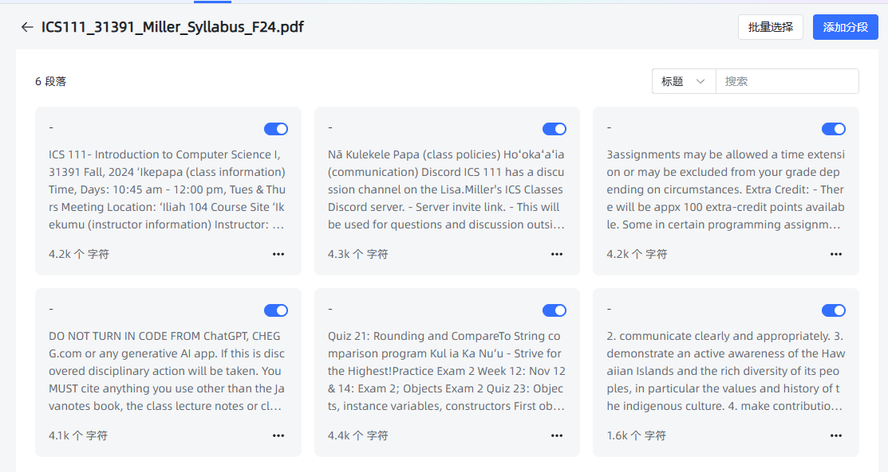

# 片段管理

[[toc]]

## 项目目标

本项目旨在构建一个功能完备的 RAG（Retrieval-Augmented Generation）系统，主要目标包括：

- **知识库管理**：支持创建、更新和删除知识库，便于用户高效维护内容。
- **文档处理**：包括文档的拆分、片段的向量化处理，以提升检索效率和准确性。
- **问答系统**：提供高效的向量检索和实时生成回答的能力，支持复杂汇总类问题的处理。
- **系统优化**：通过统计分析和推理问答调试，不断优化系统性能和用户体验。

## 系统核心概念

在 RAG 系统中，以下是几个核心概念：

- **应用**：知识库的集合。每个应用可以自定义提示词，以满足不同的个性化需求。
- **知识库**：由多个文档组成，便于用户对内容进行分类和管理。
- **文档**：系统中对应的真实文档内容。
- **片段**：文档经过拆分后的最小内容单元，用于更高效的处理和检索。

## 功能实现步骤

1. **数据库设计** [查看 01.md](./01.md)  
   设计并实现项目所需的数据表结构与数据库方案，为后续的数据操作打下坚实基础。

2. **用户登录** [查看 02.md](./02.md)  
   实现了安全可靠的用户认证系统，保护用户数据并限制未经授权的访问。

3. **模型管理** [查看 03.md](./03.md)  
   支持针对不同平台的模型（如 OpenAI、Google Gemini、Claude）进行管理与配置。

4. **知识库管理** [查看 04.md](./04.md)  
   提供创建、更新及删除知识库的功能，方便用户维护与管理文档内容。

5. **文档拆分** [查看 05.md](./05.md)  
   可将文档拆分为多个片段，便于后续向量化和检索操作。

6. **片段向量** [查看 06.md](./06.md)  
   将文本片段进行向量化处理，以便进行语义相似度计算及高效检索。

7. **命中率测试** [查看 07.md](./07.md)  
   通过语义相似度和 Top-N 算法，检索并返回与用户问题最相关的文档片段，用于评估检索的准确性。

8. **文档管理** [查看 08.md](./08.md)  
   提供上传和管理文档的功能，上传后可自动拆分为片段便于进一步处理。

9. **片段管理** [查看 09.md](./09.md)  
   允许对已拆分的片段进行增、删、改、查等操作，确保内容更新灵活可控。

10. **问题管理** [查看 10.md](./10.md)  
    为片段指定相关问题，以提升检索时的准确性与关联度。

11. **应用管理** [查看 11.md](./11.md)  
    提供创建和配置应用（智能体）的功能，并可关联指定模型和知识库。

12. **向量检索** [查看 12.md](./12.md)  
    基于语义相似度，在知识库中高效检索与用户问题最匹配的片段。

13. **推理问答调试** [查看 13.md](./13.md)  
    提供检索与问答性能的评估工具，帮助开发者进行系统优化与调试。

14. **对话问答** [查看 14.md](./14.md)  
    为用户提供友好的人机交互界面，结合检索到的片段与用户问题实时生成回答。

15. **统计分析** [查看 15.md](./15.md)  
    对用户的提问与系统回答进行数据化分析，并以可视化图表的形式呈现系统使用情况。

16. **用户管理** [查看 16.md](./16.md)  
    提供多用户管理功能，包括用户的增删改查及权限控制。

17. **API 管理** [查看 17.md](./17.md)  
    对外提供标准化 API，便于外部系统集成和调用本系统的功能。

18. **存储文件到 S3** [查看 18.md](./18.md)  
    将用户上传的文件存储至 S3 等对象存储平台，提升文件管理的灵活性与可扩展性。

19. **文档解析优化** [查看 19.md](./19.md)  
    介绍与对比常见的文档解析方案，并提供提升文档解析速度和准确性的优化建议。

20. **片段汇总** [查看 20.md](./20.md)  
    对片段内容进行汇总，以提升总结类问题的查询与回答效率。

21. **文档多分块与检索** [查看 21.md](./21.md)  
    将片段进一步拆分为句子并进行向量检索，提升检索的准确度与灵活度。

22. **多文档支持** [查看 22.md](./22.md)  
    兼容多种文档格式，包括 `.doc`, `.docx`, `.xls`, `.xlsx`, `.ppt`, `.pptx` 等。

23. **对话日志** [查看 23.md](./23.md)  
    记录并展示对话日志，用于后续分析和问题回溯。

24. **检索性能优化** [查看 24.md](./24.md)  
    提供整库扫描和分区检索等多种方式，进一步提高检索速度和效率。

25. **Milvus** [查看 25.md](./25.md)  
    将向量数据库切换至 Milvus，以在大规模向量检索场景中获得更佳的性能与可扩展性。

26. **文档解析方案和费用对比** [查看 26.md](./26.md)  
    对比不同文档解析方案在成本、速度、稳定性等方面的差异，为用户提供更加经济高效的选择。

27. **爬取网页数据** [查看 27.md](./27.md)  
     支持从网页中抓取所需内容，后续处理流程与本地文档一致：分段、向量化、存储与检索。  
    在该功能模块中，我们已完成以下几个核心功能：

- **数据库设计**：为存储和管理片段数据提供结构化的支持。
- **用户登录**：确保数据访问和操作的安全性。
- **知识库管理**：支持知识库的创建、更新和删除。
- **文件拆分**：将上传的文件拆分为多个片段，便于内容的精细化管理。
- **片段向量化**：通过向量化技术，将片段内容转换为可计算的向量，便于相似度计算。
- **命中率测试**：通过计算用户查询与片段的相似度来进行匹配测试。
- **文档管理**：实现对不同文档内容的管理。

接下来，我们将实现 **片段管理** 功能，提供三个主要的 API 接口，使用户可以高效地访问和管理片段的内容数据。

## 功能概述

**片段管理** 功能包括以下主要操作：

1. **获取片段列表**：根据数据集 ID 和文档 ID 分页获取片段列表。
2. **添加问题到片段**：为指定的片段添加问题。
3. **获取片段的问题列表**：获取指定片段下的所有问题。

## 接口定义

以下是片段管理的三个主要接口定义：

### 1. 获取片段列表

**接口 URL**: `http://localhost:3000/api/dataset/{datasetId}/document/{documentId}/paragraph/{pageNo}/{pageSize}`  
**请求方法**: `GET`

- **路径参数**：
  - `datasetId` (Long)：数据集的唯一标识符。
  - `documentId` (Long)：文档的唯一标识符。
  - `pageNo` (Integer)：当前页码。
  - `pageSize` (Integer)：每页显示的记录数。

**示例请求**

```http
GET http://localhost:3000/api/dataset/443309276048408576/document/443662133182980096/paragraph/1/20
```

**响应**

```json
{
  "message": null,
  "data": {
    "size": 20,
    "total": 6,
    "current": 1,
    "records": [
      {
        "update_time": 1730853305661,
        "is_active": true,
        "create_time": 1730853305661,
        "id": "443662143056371712",
        "title": "",
        "document_id": "443662133182980096",
        "content": "...."
      }
    ]
  },
  "code": 200
}
```

**响应字段说明**

- `message`: 错误或提示信息，成功时为 `null`。
- `data`: 数据对象，包含分页信息和片段记录。
  - `size`: 每页的记录数。
  - `total`: 总记录数。
  - `current`: 当前页码。
  - `records`: 包含片段信息的列表，每条记录包含以下字段：
    - `update_time`: 片段最后一次更新的时间戳。
    - `is_active`: 片段的状态，`true` 表示启用，`false` 表示禁用。
    - `create_time`: 片段的创建时间戳。
    - `id`: 片段的唯一标识符。
    - `title`: 片段的标题（如果有）。
    - `document_id`: 所属文档的标识符。
    - `content`: 片段的具体内容。
- `code`: 响应状态码，`200` 表示成功。

### 2. 添加问题到片段

**接口 URL**: `http://localhost:3000/api/dataset/{datasetId}/document/{documentId}/paragraph/{paragraphId}/problem`  
**请求方法**: `POST`

- **路径参数**：

  - `datasetId` (Long)：数据集的唯一标识符。
  - `documentId` (Long)：文档的唯一标识符。
  - `paragraphId` (Long)：片段的唯一标识符。

- **请求体**：

```json
{
  "content": "Exam Schedule"
}
```

**示例请求**

```http
POST http://localhost:3000/api/dataset/443309276048408576/document/443662133182980096/paragraph/443662151243653120/problem
Content-Type: application/json

{
  "content": "Exam Schedule"
}
```

**响应**

```json
{
  "message": null,
  "data": {
    "id": "444734959665311744",
    "content": "Exam Schedule",
    "dataset_id": "443309276048408576"
  },
  "code": 200
}
```

**响应字段说明**

- `message`: 错误或提示信息，成功时为 `null`。
- `data`: 新添加的问题对象，包含以下字段：
  - `id`: 问题的唯一标识符。
  - `content`: 问题的内容。
  - `dataset_id`: 所属数据集的标识符。
- `code`: 响应状态码，`200` 表示成功。

### 3. 获取片段的问题列表

**接口 URL**: `http://localhost:3000/api/dataset/{datasetId}/document/{documentId}/paragraph/{paragraphId}/problem`  
**请求方法**: `GET`

- **路径参数**：
  - `datasetId` (Long)：数据集的唯一标识符。
  - `documentId` (Long)：文档的唯一标识符。
  - `paragraphId` (Long)：片段的唯一标识符。

**示例请求**

```http
GET http://localhost:3000/api/dataset/443309276048408576/document/443662133182980096/paragraph/443662151243653120/problem
```

**响应**

```json
{
  "message": null,
  "data": [
    {
      "id": "444734959665311744",
      "content": "office hour",
      "dataset_id": "443309276048408576"
    },
    {
      "id": "444831888056446976",
      "content": "class time",
      "dataset_id": "443309276048408576"
    }
  ],
  "code": 200
}
```

**响应字段说明**

- `message`: 错误或提示信息，成功时为 `null`。
- `data`: 问题列表数组，每个问题包含以下字段：
  - `id`: 问题的唯一标识符。
  - `content`: 问题的内容。
  - `dataset_id`: 所属数据集的标识符。
- `code`: 响应状态码，`200` 表示成功。

## 代码实现

以下是 **片段管理** 功能的核心代码实现，包括 API 控制器和服务层。

### 1. API 控制器

**文件：`ApiDatasetController.java`**

```java
import com.litongjava.annotation.Get;
import com.litongjava.annotation.Post;
import com.litongjava.annotation.RequestPath;
import com.litongjava.jfinal.aop.Aop;
import com.litongjava.maxkb.service.MaxKbParagraphServcie;
import com.litongjava.model.result.ResultVo;
import com.litongjava.tio.boot.http.HttpRequest;
import com.litongjava.tio.boot.http.TioRequestContext;
import com.litongjava.tio.utils.json.JsonUtils;

@RequestPath("/api/dataset")
public class ApiDatasetController {

  /**
   * 获取指定文档下的片段列表（分页）
   *
   * @param datasetId 数据集 ID
   * @param documentId 文档 ID
   * @param pageNo 当前页码
   * @param pageSize 每页片段数量
   * @return ResultVo 包含分页片段列表
   */
  @Get("/{datasetId}/document/{documentId}/paragraph/{pageNo}/{pageSize}")
  public ResultVo listParagraph(Long datasetId, Long documentId, Integer pageNo, Integer pageSize) {
    Long userId = TioRequestContext.getUserIdLong();
    return Aop.get(MaxKbParagraphServcie.class).page(userId, datasetId, documentId, pageNo, pageSize);
  }

  /**
   * 获取指定片段下的问题列表
   *
   * @param datasetId 数据集 ID
   * @param documentId 文档 ID
   * @param paragraphId 片段 ID
   * @return ResultVo 包含问题列表
   */
  @Get("/{datasetId}/document/{documentId}/paragraph/{paragraphId}/problem")
  public ResultVo listProblem(Long datasetId, Long documentId, Long paragraphId) {
    Long userId = TioRequestContext.getUserIdLong();
    return Aop.get(MaxKbParagraphServcie.class).listProblemByParagraphId(datasetId, documentId, paragraphId);
  }

  /**
   * 添加问题到指定片段
   *
   * @param datasetId 数据集 ID
   * @param documentId 文档 ID
   * @param paragraphId 片段 ID
   * @param request HTTP 请求对象，包含请求体
   * @return ResultVo 添加结果
   */
  @Post("/{datasetId}/document/{documentId}/paragraph/{paragraphId}/problem")
  public ResultVo addProblem(Long datasetId, Long documentId, Long paragraphId, HttpRequest request) {
    String bodyString = request.getBodyString();
    String content = JsonUtils.parseToMap(bodyString, String.class, String.class).get("content");
    return Aop.get(MaxKbParagraphServcie.class).addProblemById(datasetId, documentId, paragraphId, content);
  }
}
```

**代码说明**

- **注解 `@RequestPath("/api/dataset")`**：定义控制器的基础路径为 `/api/dataset`。
- **方法 `listParagraph`**：
  - **注解 `@Get("/{datasetId}/document/{documentId}/paragraph/{pageNo}/{pageSize}")`**：定义 GET 请求路径。
  - **参数**：
    - `datasetId`：数据集 ID。
    - `documentId`：文档 ID。
    - `pageNo`：当前页码。
    - `pageSize`：每页片段数量。
  - **功能**：获取指定文档下的分页片段列表。
- **方法 `listProblem`**：
  - **注解 `@Get("/{datasetId}/document/{documentId}/paragraph/{paragraphId}/problem")`**：定义 GET 请求路径。
  - **参数**：
    - `datasetId`：数据集 ID。
    - `documentId`：文档 ID。
    - `paragraphId`：片段 ID。
  - **功能**：获取指定片段下的所有问题列表。
- **方法 `addProblem`**：
  - **注解 `@Post("/{datasetId}/document/{documentId}/paragraph/{paragraphId}/problem")`**：定义 POST 请求路径。
  - **参数**：
    - `datasetId`：数据集 ID。
    - `documentId`：文档 ID。
    - `paragraphId`：片段 ID。
    - `request`：包含请求体的 HTTP 请求对象。
  - **功能**：为指定的片段添加一个新问题。
- **依赖注入**：通过 `Aop.get(MaxKbParagraphServcie.class)` 获取 `MaxKbParagraphServcie` 服务实例。

### 2. 服务层

**文件：`MaxKbParagraphServcie.java`**

```java
package com.litongjava.maxkb.service;

import java.util.ArrayList;
import java.util.List;

import com.jfinal.kit.Kv;
import com.litongjava.db.TableInput;
import com.litongjava.db.TableResult;
import com.litongjava.db.activerecord.Db;
import com.litongjava.db.activerecord.Row;
import com.litongjava.kit.RecordUtils;
import com.litongjava.maxkb.constant.TableNames;
import com.litongjava.maxkb.model.ResultPage;
import com.litongjava.model.page.Page;
import com.litongjava.model.result.ResultVo;
import com.litongjava.table.services.ApiTable;
import com.litongjava.tio.utils.snowflake.SnowflakeIdUtils;

import lombok.extern.slf4j.Slf4j;

@Slf4j
public class MaxKbParagraphServcie {

  /**
   * 分页获取片段列表
   *
   * @param userId 用户 ID
   * @param datasetId 数据集 ID
   * @param documentId 文档 ID
   * @param pageNo 当前页码
   * @param pageSize 每页片段数量
   * @return ResultVo 包含分页片段列表
   */
  public ResultVo page(Long userId, Long datasetId, Long documentId, Integer pageNo, Integer pageSize) {
    log.info("datasetId:{}, documentId:{}", datasetId, documentId);
    TableInput tableInput = new TableInput();
    tableInput.setColumns("id, title, content, is_active, document_id, create_time, update_time");
    tableInput.set("dataset_id", datasetId)
              .set("document_id", documentId)
              .setPageNo(pageNo)
              .setPageSize(pageSize);

    TableResult<Page<Row>> tableResult = ApiTable.page(TableNames.max_kb_paragraph, tableInput);
    Page<Row> page = tableResult.getData();
    int totalRow = page.getTotalRow();
    List<Row> records = page.getList();

    List<Kv> kvs = RecordUtils.recordsToKv(records, false);
    ResultPage<Kv> resultPage = new ResultPage<>(pageNo, pageSize, totalRow, kvs);
    return ResultVo.ok(resultPage);
  }

  /**
   * 获取指定片段下的问题列表
   *
   * @param datasetId 数据集 ID
   * @param documentId 文档 ID
   * @param paragraphId 片段 ID
   * @return ResultVo 包含问题列表
   */
  public ResultVo listProblemByParagraphId(Long datasetId, Long documentId, Long paragraphId) {
    String sql = "SELECT p.id, p.content, p.dataset_id " +
                 "FROM max_kb_problem p " +
                 "JOIN max_kb_problem_paragraph_mapping mapping ON mapping.problem_id = p.id " +
                 "WHERE mapping.paragraph_id = ?";
    List<Row> records = Db.find(sql, paragraphId);
    List<Kv> kvs = RecordUtils.recordsToKv(records, false);
    return ResultVo.ok(kvs);
  }

  /**
   * 批量添加问题到指定片段
   *
   * @param datasetId 数据集 ID
   * @param documentId 文档 ID
   * @param paragraphId 片段 ID
   * @param problems 问题内容列表
   * @return ResultVo 添加结果
   */
  public ResultVo addProblemsById(Long datasetId, Long documentId, Long paragraphId, List<String> problems) {
    List<Row> problemRecords = new ArrayList<>();
    List<Row> mappings = new ArrayList<>();
    for (String str : problems) {
      long problemId = SnowflakeIdUtils.id();
      problemRecords.add(Row.by("id", problemId)
                              .set("dataset_id", datasetId)
                              .set("hit_num", 0)
                              .set("content", str));
      long mappingId = SnowflakeIdUtils.id();
      mappings.add(Row.by("id", mappingId)
                     .set("dataset_id", datasetId)
                     .set("document_id", documentId)
                     .set("paragraph_id", paragraphId)
                     .set("problem_id", problemId));
    }

    Db.tx(() -> {
      Db.batchSave(TableNames.max_kb_problem, problemRecords, 2000);
      Db.batchSave(TableNames.max_kb_problem_paragraph_mapping, mappings, 2000);
      return true;
    });
    return ResultVo.ok("问题添加成功");
  }

  /**
   * 添加单个问题到指定片段
   *
   * @param datasetId 数据集 ID
   * @param documentId 文档 ID
   * @param paragraphId 片段 ID
   * @param content 问题内容
   * @return ResultVo 添加结果
   */
  public ResultVo addProblemById(Long datasetId, Long documentId, Long paragraphId, String content) {
    long problemId = SnowflakeIdUtils.id();
    Row problem = Row.by("id", problemId)
                           .set("dataset_id", datasetId)
                           .set("hit_num", 0)
                           .set("content", content);
    long mappingId = SnowflakeIdUtils.id();
    Row mapping = Row.by("id", mappingId)
                           .set("dataset_id", datasetId)
                           .set("document_id", documentId)
                           .set("paragraph_id", paragraphId)
                           .set("problem_id", problemId);

    Db.tx(() -> {
      Db.save(TableNames.max_kb_problem, problem);
      Db.save(TableNames.max_kb_problem_paragraph_mapping, mapping);
      return true;
    });
    return ResultVo.ok("问题添加成功");
  }
}
```

**代码说明**

- **方法 `page`**：
  - **参数**：
    - `userId`：当前用户的 ID，用于权限控制。
    - `datasetId`：数据集 ID，用于过滤片段。
    - `documentId`：文档 ID，用于过滤片段。
    - `pageNo`：当前页码。
    - `pageSize`：每页片段数量。
  - **功能**：
    1. 创建 `TableInput` 对象，设置查询列、数据集 ID、文档 ID、页码和页大小。
    2. 调用 `ApiTable.page` 方法执行分页查询，获取 `TableResult`。
    3. 从 `TableResult` 中提取 `Page<Row>` 对象，获取总行数和记录列表。
    4. 将记录列表转换为键值对列表 (`List<Kv>`)。
    5. 构建 `ResultPage<Kv>` 对象，包含分页信息和片段列表。
    6. 返回成功的 `ResultVo` 对象，包含 `ResultPage` 数据。
- **方法 `listProblemByParagraphId`**：
  - **参数**：
    - `datasetId`：数据集 ID。
    - `documentId`：文档 ID。
    - `paragraphId`：片段 ID。
  - **功能**：
    1. 定义 SQL 查询，联接问题表和问题-片段映射表，筛选指定片段的所有问题。
    2. 执行查询，获取问题记录列表。
    3. 将记录列表转换为键值对列表 (`List<Kv>`)。
    4. 返回成功的 `ResultVo` 对象，包含问题列表数据。
- **方法 `addProblemsById`**：
  - **参数**：
    - `datasetId`：数据集 ID。
    - `documentId`：文档 ID。
    - `paragraphId`：片段 ID。
    - `problems`：问题内容列表。
  - **功能**：
    1. 遍历问题内容列表，为每个问题生成唯一 ID，并创建问题记录和映射记录。
    2. 执行数据库事务，批量保存问题记录和映射记录。
    3. 返回成功的 `ResultVo` 对象，包含添加结果信息。
- **方法 `addProblemById`**：
  - **参数**：
    - `datasetId`：数据集 ID。
    - `documentId`：文档 ID。
    - `paragraphId`：片段 ID。
    - `content`：问题内容。
  - **功能**：
    1. 生成唯一的 `problemId` 和 `mappingId`。
    2. 创建问题记录和映射记录。
    3. 执行数据库事务，保存问题记录和映射记录。
    4. 返回成功的 `ResultVo` 对象，包含添加结果信息。
- **依赖组件**：
  - `ApiTable`：用于执行数据库表的分页查询和单条记录查询。
  - `RecordUtils`：用于将数据库记录转换为键值对格式。
  - `ResultVo` 和 `ResultPage`：用于标准化 API 响应结构。
  - `SnowflakeIdUtils`：用于生成唯一的 ID。
  - `Db`：用于数据库操作，支持事务管理。

## 权限控制

在上述实现中，我们假设 `userId` 为 `1` 的用户为管理员，具有管理所有数据集和片段的权限。非管理员用户只能管理和访问自己创建的数据集和片段。这种权限控制确保了数据的安全性和隐私性。

## 异常处理

当前实现未详细展示异常处理逻辑。建议在实际开发中加入以下内容：

1. **参数校验**：确保请求参数的有效性，如 `datasetId`、`documentId` 和 `paragraphId` 的存在性、`pageNo` 和 `pageSize` 的合理性。
2. **权限验证**：在服务层进一步验证用户是否有权访问指定的数据集、文档和片段。
3. **错误响应**：在发生异常时，返回适当的错误消息和状态码，如 `400 Bad Request`、`401 Unauthorized`、`404 Not Found` 等。

## 测试

为了确保片段管理功能的正确性和稳定性，建议编写以下测试用例：

1. **获取片段列表**：
   - 查询存在的数据集和文档，验证返回的片段列表是否正确。
   - 查询不存在的数据集或文档，验证返回的错误信息。
   - 测试不同的 `pageNo` 和 `pageSize` 参数，确保分页逻辑正确。
2. **添加问题到片段**：
   - 向存在的片段添加问题，验证问题是否成功添加。
   - 向不存在的片段添加问题，验证返回的错误信息。
   - 添加空内容的问题，验证系统的处理方式。
3. **获取片段的问题列表**：
   - 查询存在的片段，验证返回的问题列表是否正确。
   - 查询不存在的片段，验证返回的错误信息。
   - 验证权限控制，确保用户无法访问未授权的片段的问题。

## 显示效果



## 总结

通过上述接口和代码实现，我们成功地为系统添加了片段管理功能。该功能允许用户根据数据集和文档管理和检索片段，支持分页查询、问题的添加与查看。未来，可以进一步扩展此功能，如添加片段编辑、删除、批量操作等，以满足更全面的片段管理需求。
